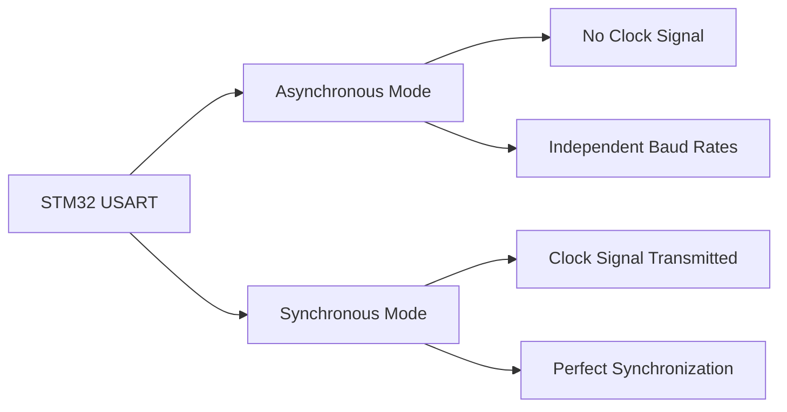

# STM32 USART Features

## Introduction

The Universal Synchronous/Asynchronous Receiver Transmitter (USART) is one of the most fundamental and widely used communication peripherals in STM32 microcontrollers. It provides a flexible means of full-duplex data exchange with external devices such as computers, other microcontrollers, or various communication modules.

In this tutorial, we'll explore the various features of the STM32 USART peripheral, understand its configurations, and learn how to implement it in practical applications.

## What is USART?

USART stands for Universal Synchronous/Asynchronous Receiver Transmitter. As the name suggests, it supports two modes of operation:

1. **Asynchronous mode (UART)**: No clock signal is transmitted alongside the data. Both the transmitter and receiver must operate at approximately the same baud rate.

2. **Synchronous mode**: A clock signal is transmitted along with the data, ensuring perfect synchronization between devices.



## STM32 USART Hardware Features

STM32 microcontrollers typically contain multiple USART peripherals with rich functionality:

- Full-duplex communication (simultaneous transmission and reception)
- Programmable baud rate up to several Mbps
- Configurable data word length (8 or 9 bits)
- Configurable stop bits (0.5, 1, 1.5, or 2)
- Parity generation and checking
- Hardware flow control through RTS/CTS lines
- DMA capability for both transmission and reception
- Various interrupt sources (TX complete, RX complete, etc.)
- Multiprocessor communication mode
- Synchronous mode operation
- LIN, IrDA, and smartcard emulation capability (in some models)

## Configuring USART Pins

Before using USART, you need to configure the appropriate GPIO pins. STM32 microcontrollers typically require at least two pins for basic USART operation:

- **TX pin**: Transmitter output
- **RX pin**: Receiver input

For advanced features, you might also use:

- **CK pin**: Clock output (for synchronous mode)
- **RTS pin**: Request to Send (for hardware flow control)
- **CTS pin**: Clear to Send (for hardware flow control)

Here's an example configuration of USART pins in STM32:

```c
// Enable GPIO clock
RCC->AHB1ENR |= RCC_AHB1ENR_GPIOAEN;

// Configure PA2 (TX) and PA3 (RX) for USART2
// Set mode to alternate function
GPIOA->MODER &= ~(GPIO_MODER_MODER2_0 | GPIO_MODER_MODER3_0);
GPIOA->MODER |= (GPIO_MODER_MODER2_1 | GPIO_MODER_MODER3_1);

// Set alternate function type to USART (AF7)
GPIOA->AFR[0] |= (7 << (4 * 2)); // PA2
GPIOA->AFR[0] |= (7 << (4 * 3)); // PA3

// Set output speed to high
GPIOA->OSPEEDR |= (GPIO_OSPEEDER_OSPEEDR2 | GPIO_OSPEEDER_OSPEEDR3);

// Enable pull-up resistors
GPIOA->PUPDR |= (GPIO_PUPDR_PUPDR2_0 | GPIO_PUPDR_PUPDR3_0);
```

## Basic USART Configuration

Here's a step-by-step guide to configure and initialize USART in STM32:

1. **Enable USART Clock**: First, enable the clock for the USART peripheral you plan to use.

2. **Configure USART Parameters**: Set baud rate, word length, stop bits, parity, and mode.

3. **Enable USART**: Finally, enable the USART peripheral.

Here's a simple example to initialize USART2 at 9600 baud rate, 8 data bits, 1 stop bit, no parity:

```c
void USART2_Init(void) {
    // 1. Enable clock for USART2
    RCC->APB1ENR |= RCC_APB1ENR_USART2EN;
    
    // 2. Configure USART2 parameters
    // Reset USART2 configuration (optional)
    USART2->CR1 = 0x00;
    USART2->CR2 = 0x00;
    USART2->CR3 = 0x00;
    
    // Calculate and set baud rate (assuming 16MHz system clock)
    // BRR = fCK / (16 * baud rate)
    // For 9600 baud: BRR = 16,000,000 / (16 * 9600) = 104.166...
    // Rounded to 104
    USART2->BRR = 104;
    
    // Enable transmitter and receiver
    USART2->CR1 |= USART_CR1_TE | USART_CR1_RE;
    
    // 3. Enable USART2
    USART2->CR1 |= USART_CR1_UE;
}
```

Using the HAL library, the same configuration would look like this:

```c
UART_HandleTypeDef huart2;

void USART2_Init(void) {
    huart2.Instance = USART2;
    huart2.Init.BaudRate = 9600;
    huart2.Init.WordLength = UART_WORDLENGTH_8B;
    huart2.Init.StopBits = UART_STOPBITS_1;
    huart2.Init.Parity = UART_PARITY_NONE;
    huart2.Init.Mode = UART_MODE_TX_RX;
    huart2.Init.HwFlowCtl = UART_HWCONTROL_NONE;
    huart2.Init.OverSampling = UART_OVERSAMPLING_16;
    
    HAL_UART_Init(&huart2);
}
```

## Transmitting and Receiving Data

### Basic Transmission

After initializing USART, you can send data one byte at a time:

```c
void USART2_SendChar(uint8_t data) {
    // Wait until transmit data register is empty
    while (!(USART2->SR & USART_SR_TXE));
    
    // Send data
    USART2->DR = data;
}

void USART2_SendString(char *str) {
    while (*str) {
        USART2_SendChar(*str++);
    }
}
```

Using HAL:

```c
void USART2_SendString(char *str) {
    HAL_UART_Transmit(&huart2, (uint8_t*)str, strlen(str), HAL_MAX_DELAY);
}
```

### Basic Reception

To receive data:

```c
uint8_t USART2_ReceiveChar(void) {
    // Wait until data is received
    while (!(USART2->SR & USART_SR_RXNE));
    
    // Return received data
    return (uint8_t)(USART2->DR & 0xFF);
}
```

Using HAL:

```c
uint8_t receiveData;
HAL_UART_Receive(&huart2, &receiveData, 1, HAL_MAX_DELAY);
```

## Advanced USART Features

### Interrupt-Based Communication

Instead of polling, you can use interrupts to handle USART communication:

```c
void USART2_Init_With_Interrupt(void) {
    // Basic USART initialization (as shown earlier)
    USART2_Init();
    
    // Enable RXNE interrupt
    USART2->CR1 |= USART_CR1_RXNEIE;
    
    // Enable USART2 interrupt in NVIC
    NVIC_EnableIRQ(USART2_IRQn);
    NVIC_SetPriority(USART2_IRQn, 0);
}

// USART2 interrupt handler
void USART2_IRQHandler(void) {
    if (USART2->SR & USART_SR_RXNE) {
        // Data received
        uint8_t data = USART2->DR;
        
        // Process received data
        // For example, echo it back
        USART2_SendChar(data);
    }
}
```

Using HAL, you would use callback functions:

```c
uint8_t rxBuffer[1];

void HAL_UART_Init_IT(void) {
    // Initialize UART
    USART2_Init();
    
    // Start receiving in interrupt mode
    HAL_UART_Receive_IT(&huart2, rxBuffer, 1);
}

// This function is called when reception is complete
void HAL_UART_RxCpltCallback(UART_HandleTypeDef *huart) {
    if (huart->Instance == USART2) {
        // Echo back received data
        HAL_UART_Transmit(&huart2, rxBuffer, 1, HAL_MAX_DELAY);
        
        // Start receiving again
        HAL_UART_Receive_IT(&huart2, rxBuffer, 1);
    }
}
```

### DMA-Based Communication

For efficient data transfer, especially for large amounts of data, you can use DMA:

```c
void USART2_Init_With_DMA(void) {
    // Basic USART initialization (as shown earlier)
    USART2_Init();
    
    // Enable DMA clock
    RCC->AHB1ENR |= RCC_AHB1ENR_DMA1EN;
    
    // Configure DMA for USART2 TX (Channel 4, Stream 6)
    DMA1_Stream6->CR = 0;
    DMA1_Stream6->CR |= (4 << 25);  // Channel 4
    DMA1_Stream6->CR |= DMA_SxCR_MINC;  // Memory increment mode
    DMA1_Stream6->CR |= DMA_SxCR_DIR_0;  // Memory to peripheral
    
    // Set peripheral address
    DMA1_Stream6->PAR = (uint32_t)&USART2->DR;
    
    // Enable DMA for USART transmitter
    USART2->CR3 |= USART_CR3_DMAT;
}

void USART2_SendString_DMA(char *str, uint16_t size) {
    // Set memory address
    DMA1_Stream6->M0AR = (uint32_t)str;
    
    // Set data size
    DMA1_Stream6->NDTR = size;
    
    // Enable DMA stream
    DMA1_Stream6->CR |= DMA_SxCR_EN;
}
```

With HAL:

```c
void USART2_SendString_DMA(char *str) {
    HAL_UART_Transmit_DMA(&huart2, (uint8_t*)str, strlen(str));
}

// This function is called when transmission is complete
void HAL_UART_TxCpltCallback(UART_HandleTypeDef *huart) {
    if (huart->Instance == USART2) {
        // Transmission complete, do whatever you need
    }
}
```

### Hardware Flow Control

USART can use RTS and CTS signals for hardware flow control:

```c
void USART2_Init_With_FlowControl(void) {
    // Configure GPIO for RTS (PA1) and CTS (PA0)
    // ... (GPIO configuration code similar to TX/RX)
    
    // Basic USART initialization
    RCC->APB1ENR |= RCC_APB1ENR_USART2EN;
    USART2->BRR = 104;  // 9600 baud
    
    // Enable hardware flow control
    USART2->CR3 |= USART_CR3_RTSE | USART_CR3_CTSE;
    
    // Enable transmitter, receiver, and USART
    USART2->CR1 |= USART_CR1_TE | USART_CR1_RE | USART_CR1_UE;
}
```

With HAL:

```c
void USART2_Init_With_FlowControl(void) {
    huart2.Instance = USART2;
    huart2.Init.BaudRate = 9600;
    huart2.Init.WordLength = UART_WORDLENGTH_8B;
    huart2.Init.StopBits = UART_STOPBITS_1;
    huart2.Init.Parity = UART_PARITY_NONE;
    huart2.Init.Mode = UART_MODE_TX_RX;
    huart2.Init.HwFlowCtl = UART_HWCONTROL_RTS_CTS;
    huart2.Init.OverSampling = UART_OVERSAMPLING_16;
    
    HAL_UART_Init(&huart2);
}
```

## Practical Example: Serial Command Interface

Let's create a simple command interface that processes commands received through USART:

```c
#define MAX_BUFFER_SIZE 64
#define CR 13  // Carriage Return ASCII

char rxBuffer[MAX_BUFFER_SIZE];
uint8_t rxIndex = 0;
uint8_t commandReady = 0;

void processCommand(void) {
    if (strncmp(rxBuffer, "LED ON", 6) == 0) {
        // Turn on LED
        HAL_GPIO_WritePin(GPIOA, GPIO_PIN_5, GPIO_PIN_SET);
        USART2_SendString("LED turned ON\r
");
    }
    else if (strncmp(rxBuffer, "LED OFF", 7) == 0) {
        // Turn off LED
        HAL_GPIO_WritePin(GPIOA, GPIO_PIN_5, GPIO_PIN_RESET);
        USART2_SendString("LED turned OFF\r
");
    }
    else if (strncmp(rxBuffer, "HELP", 4) == 0) {
        USART2_SendString("Available commands:\r
");
        USART2_SendString("  LED ON - Turn on the LED\r
");
        USART2_SendString("  LED OFF - Turn off the LED\r
");
        USART2_SendString("  HELP - Show this help message\r
");
    }
    else {
        USART2_SendString("Unknown command. Type HELP for assistance.\r
");
    }
    
    // Reset buffer
    rxIndex = 0;
    memset(rxBuffer, 0, MAX_BUFFER_SIZE);
}

void USART2_IRQHandler(void) {
    if (USART2->SR & USART_SR_RXNE) {
        // Read received character
        char ch = USART2->DR;
        
        // Echo character back
        USART2_SendChar(ch);
        
        if (ch == CR) {
            // End of command
            rxBuffer[rxIndex] = '\0';  // Null-terminate
            commandReady = 1;
        }
        else if (rxIndex < MAX_BUFFER_SIZE - 1) {
            // Store character
            rxBuffer[rxIndex++] = ch;
        }
    }
}

int main(void) {
    // System initialization
    SystemClock_Config();
    
    // Initialize LED
    __HAL_RCC_GPIOA_CLK_ENABLE();
    GPIO_InitTypeDef GPIO_InitStruct = {0};
    GPIO_InitStruct.Pin = GPIO_PIN_5;
    GPIO_InitStruct.Mode = GPIO_MODE_OUTPUT_PP;
    GPIO_InitStruct.Pull = GPIO_NOPULL;
    GPIO_InitStruct.Speed = GPIO_SPEED_FREQ_LOW;
    HAL_GPIO_Init(GPIOA, &GPIO_InitStruct);
    
    // Initialize USART with interrupt
    USART2_Init_With_Interrupt();
    
    // Display welcome message
    USART2_SendString("\r
--- STM32 Serial Command Interface ---\r
");
    USART2_SendString("Type HELP for available commands\r
");
    
    while (1) {
        if (commandReady) {
            processCommand();
            commandReady = 0;
        }
    }
}
```

Expected output when interacting with this program:

```
--- STM32 Serial Command Interface ---
Type HELP for available commands
HELP
Available commands:
  LED ON - Turn on the LED
  LED OFF - Turn off the LED
  HELP - Show this help message
LED ON
LED turned ON
LED OFF
LED turned OFF
```

## Debugging USART Communication

When implementing USART communication, you may encounter issues. Here are some common problems and solutions:

1. **No Communication**: Check if the baud rate settings match on both devices. Verify that TX and RX pins are correctly connected (TX of one device to RX of the other).

2. **Garbled Text**: This typically indicates a baud rate mismatch or incorrect configuration (data bits, stop bits, parity).

3. **Missing Characters**: This could be due to buffer overruns. Consider using interrupts or DMA for more reliable reception.

4. **One-Way Communication**: Verify that both TX and RX pins are properly configured and connected.

A logic analyzer or oscilloscope can be invaluable for debugging USART communication issues.

## Summary

In this tutorial, we've covered the essential features of the STM32 USART peripheral:

- Basic concepts of USART/UART communication
- Configuring USART pins and parameters
- Transmitting and receiving data using polling, interrupts, and DMA
- Hardware flow control
- A practical example of a serial command interface

USART is one of the most versatile and commonly used communication interfaces in embedded systems. It provides a simple yet powerful way to connect your STM32 microcontroller to computers, sensors, displays, and other devices.

## Exercises

1. Modify the serial command interface example to add a new command that toggles the LED state.

2. Implement a command to change the baud rate of the USART dynamically.

3. Create a simple data logger that reads an analog sensor and periodically sends the readings through USART.

4. Implement a ring buffer for USART reception to prevent data loss in interrupt mode.

5. Configure USART in synchronous mode and communicate with an SPI device.

## Further Resources

Here are some resources to deepen your understanding of STM32 USART:

- ST's official documentation for your specific STM32 model
- ST's application notes on USART communication (AN4031, AN3109)
- STM32 HAL documentation for UART/USART APIs
- The STM32CubeIDE examples for UART/USART