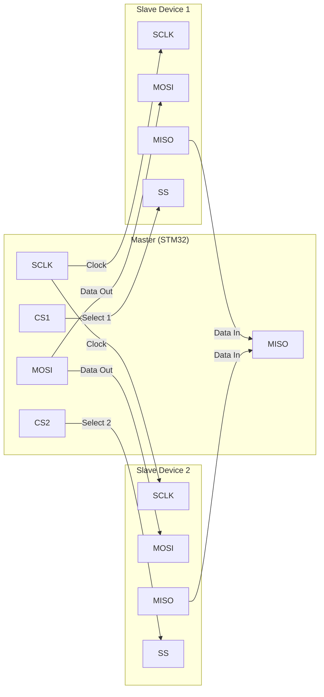

# STM32 SPI Basics

## Introduction

Serial Peripheral Interface (SPI) is a synchronous serial communication protocol widely used in embedded systems for communication between microcontrollers and peripheral devices such as sensors, memory chips, displays, and other integrated circuits. SPI is popular due to its simplicity, high speed, and full-duplex communication capabilities.

In this guide, we'll explore how to implement SPI communication on STM32 microcontrollers, which feature robust SPI peripherals that make interfacing with external devices straightforward. Whether you're building a weather station that communicates with sensors or developing a data logging system with external memory, understanding SPI on STM32 is an essential skill for embedded systems developers.

## What is SPI?

SPI is a 4-wire synchronous serial protocol that operates in a master-slave configuration. Before diving into the implementation details, let's understand the fundamental concepts of SPI:

### SPI Bus Structure

An SPI connection consists of four main signal lines:

1. **SCLK (Serial Clock)** - Generated by the master device to synchronize data transfer
2. **MOSI (Master Out Slave In)** - Data line from master to slave devices
3. **MISO (Master In Slave Out)** - Data line from slave to master devices
4. **SS/CS (Slave Select/Chip Select)** - Used to select which slave device the master communicates with



### SPI Key Characteristics

- **Full-Duplex Communication**: Data can be sent and received simultaneously
- **Master-Slave Architecture**: The master initiates and controls all communications
- **Variable Clock Speed**: Flexibility to adjust to the capabilities of the slave devices
- **Multiple Slave Support**: Using separate CS lines for each slave device
- **No Addressing Scheme**: Instead, slave selection is handled through dedicated CS lines
- **Simple Protocol**: No complex framing or acknowledgment mechanisms

### SPI Configuration Parameters

Before setting up SPI communication, you need to configure several parameters:

1. **Clock Polarity (CPOL)**: Determines the idle state of the clock
   - CPOL=0: Clock idles at low state
   - CPOL=1: Clock idles at high state

2. **Clock Phase (CPHA)**: Determines when data is sampled
   - CPHA=0: Data sampled on the first (leading) clock edge
   - CPHA=1: Data sampled on the second (trailing) clock edge

3. **Clock Speed**: Frequency of the SCLK signal, must be supported by all devices

4. **Data Order**: Most Significant Bit (MSB) first or Least Significant Bit (LSB) first

These parameters must match between master and slave for proper communication. The combination of CPOL and CPHA creates four possible SPI modes (Mode 0-3):

| Mode | CPOL | CPHA | Description |
|------|------|------|-------------|
| 0    | 0    | 0    | Clock idles low, data sampled on rising edge |
| 1    | 0    | 1    | Clock idles low, data sampled on falling edge |
| 2    | 1    | 0    | Clock idles high, data sampled on falling edge |
| 3    | 1    | 1    | Clock idles high, data sampled on rising edge |

## STM32 SPI Hardware

STM32 microcontrollers typically include multiple SPI peripherals (SPI1, SPI2, etc.) with features such as:

- Programmable data size (8 or 16 bits)
- Hardware slave management with NSS pin
- Separate transmit and receive buffers
- DMA support for efficient data transfer
- Configurable clock polarity and phase
- Various baud rate options

## Implementing SPI on STM32

We'll explore two approaches to implement SPI on STM32 microcontrollers:
1. Using the STM32 HAL (Hardware Abstraction Layer) library
2. Direct register manipulation

### Method 1: Using STM32 HAL Library

The HAL library provides a high-level API that abstracts the hardware details, making it easier to work with the SPI peripheral.

#### Step 1: Configure SPI Pins in STM32CubeMX

If you're using STM32CubeMX, you can configure the SPI pins graphically:

1. Select the SPI peripheral you want to use
2. Configure it as Master or Slave
3. Set parameters like data size, baud rate, CPOL, and CPHA
4. Generate the initialization code

#### Step 2: Initialize SPI in Your Code

```c
/* SPI handle structure */
SPI_HandleTypeDef hspi1;

/* SPI1 init function */
void MX_SPI1_Init(void)
{
  hspi1.Instance = SPI1;
  hspi1.Init.Mode = SPI_MODE_MASTER;
  hspi1.Init.Direction = SPI_DIRECTION_2LINES;
  hspi1.Init.DataSize = SPI_DATASIZE_8BIT;
  hspi1.Init.CLKPolarity = SPI_POLARITY_LOW;    // CPOL = 0
  hspi1.Init.CLKPhase = SPI_PHASE_1EDGE;        // CPHA = 0
  hspi1.Init.NSS = SPI_NSS_SOFT;                // Software CS management
  hspi1.Init.BaudRatePrescaler = SPI_BAUDRATEPRESCALER_16;
  hspi1.Init.FirstBit = SPI_FIRSTBIT_MSB;
  hspi1.Init.TIMode = SPI_TIMODE_DISABLE;
  hspi1.Init.CRCCalculation = SPI_CRCCALCULATION_DISABLE;
  
  if (HAL_SPI_Init(&hspi1) != HAL_OK)
  {
    Error_Handler();
  }
}
```

#### Step 3: Implement GPIO Initialization for CS Pin

Since we're using software CS management, we need to initialize the CS pin:

```c
/* GPIO init function */
void MX_GPIO_Init(void)
{
  GPIO_InitTypeDef GPIO_InitStruct = {0};
  
  /* Enable GPIO Ports Clock */
  __HAL_RCC_GPIOA_CLK_ENABLE();
  
  /* Configure CS Pin */
  GPIO_InitStruct.Pin = GPIO_PIN_4;
  GPIO_InitStruct.Mode = GPIO_MODE_OUTPUT_PP;
  GPIO_InitStruct.Pull = GPIO_NOPULL;
  GPIO_InitStruct.Speed = GPIO_SPEED_FREQ_HIGH;
  HAL_GPIO_Init(GPIOA, &GPIO_InitStruct);
  
  /* Set CS Pin High (inactive) */
  HAL_GPIO_WritePin(GPIOA, GPIO_PIN_4, GPIO_PIN_SET);
}
```

#### Step 4: Create Helper Functions for SPI Communication

```c
/* CS pin control functions */
void CS_Select(void)
{
  HAL_GPIO_WritePin(GPIOA, GPIO_PIN_4, GPIO_PIN_RESET); // Pull CS low to select slave
}

void CS_Deselect(void)
{
  HAL_GPIO_WritePin(GPIOA, GPIO_PIN_4, GPIO_PIN_SET); // Pull CS high to deselect slave
}

/* SPI Transmit function */
uint8_t SPI_Transmit(uint8_t data)
{
  uint8_t receivedData;
  
  CS_Select(); // Select slave device
  
  /* Transmit and Receive data */
  HAL_SPI_TransmitReceive(&hspi1, &data, &receivedData, 1, 100);
  
  CS_Deselect(); // Deselect slave device
  
  return receivedData; // Return received data
}
```

#### Step 5: Example Usage - Reading from an SPI Sensor

Here's an example of reading temperature from a fictional SPI temperature sensor:

```c
/* Read temperature from SPI sensor */
float ReadTemperature(void)
{
  uint8_t txData = 0x01; // Command to read temperature
  uint8_t rxData = 0;
  
  CS_Select(); // Select sensor
  
  /* Send command */
  HAL_SPI_Transmit(&hspi1, &txData, 1, 100);
  
  /* Small delay to allow sensor to process */
  HAL_Delay(1);
  
  /* Read temperature data */
  txData = 0x00; // Dummy byte to generate clock
  HAL_SPI_TransmitReceive(&hspi1, &txData, &rxData, 1, 100);
  
  CS_Deselect(); // Deselect sensor
  
  /* Convert raw data to temperature value (example) */
  float temperature = (float)rxData / 2.0;
  
  return temperature;
}
```

### Method 2: Direct Register Manipulation

For those who prefer a lower-level approach or need to optimize for performance, you can directly manipulate the SPI registers.

#### Step 1: Configure GPIO Pins

```c
void SPI_GPIO_Init(void)
{
  /* Enable clocks for GPIO ports and SPI1 */
  RCC->AHB1ENR |= RCC_AHB1ENR_GPIOAEN;  // Enable GPIOA clock
  RCC->APB2ENR |= RCC_APB2ENR_SPI1EN;   // Enable SPI1 clock
  
  /* Configure SCK, MISO, MOSI pins */
  // PA5 is SCK, PA6 is MISO, PA7 is MOSI
  
  // Configure PA5 (SCK) as alternate function
  GPIOA->MODER &= ~GPIO_MODER_MODER5;
  GPIOA->MODER |= GPIO_MODER_MODER5_1;  // Alternate function mode
  GPIOA->AFR[0] |= (5 << 20);           // AF5 for SPI1 on PA5
  
  // Configure PA6 (MISO) as alternate function
  GPIOA->MODER &= ~GPIO_MODER_MODER6;
  GPIOA->MODER |= GPIO_MODER_MODER6_1;  // Alternate function mode
  GPIOA->AFR[0] |= (5 << 24);           // AF5 for SPI1 on PA6
  
  // Configure PA7 (MOSI) as alternate function
  GPIOA->MODER &= ~GPIO_MODER_MODER7;
  GPIOA->MODER |= GPIO_MODER_MODER7_1;  // Alternate function mode
  GPIOA->AFR[0] |= (5 << 28);           // AF5 for SPI1 on PA7
  
  // Configure PA4 (CS) as output
  GPIOA->MODER &= ~GPIO_MODER_MODER4;
  GPIOA->MODER |= GPIO_MODER_MODER4_0;  // Output mode
  GPIOA->BSRR = GPIO_BSRR_BS4;          // Set CS high (inactive)
}
```

#### Step 2: Configure SPI Peripheral

```c
void SPI_Init(void)
{
  /* Configure SPI1 */
  SPI1->CR1 = 0;  // Reset CR1 register
  
  // Set SPI parameters
  SPI1->CR1 |= SPI_CR1_MSTR;            // Master mode
  SPI1->CR1 |= SPI_CR1_SSM | SPI_CR1_SSI; // Software slave management
  SPI1->CR1 |= SPI_CR1_BR_1;            // Baud rate = fPCLK/8
  // SPI1->CR1 |= SPI_CR1_CPOL;         // CPOL=1 (Uncomment if needed)
  // SPI1->CR1 |= SPI_CR1_CPHA;         // CPHA=1 (Uncomment if needed)
  
  // Enable SPI
  SPI1->CR1 |= SPI_CR1_SPE;
}
```

#### Step 3: Implement SPI Transfer Function

```c
uint8_t SPI_Transfer(uint8_t data)
{
  /* Wait until TX buffer is empty */
  while(!(SPI1->SR & SPI_SR_TXE));
  
  /* Send data */
  *(__IO uint8_t *)&SPI1->DR = data;
  
  /* Wait until RX buffer is not empty */
  while(!(SPI1->SR & SPI_SR_RXNE));
  
  /* Return received data */
  return *(__IO uint8_t *)&SPI1->DR;
}
```

#### Step 4: Implement CS Control Functions

```c
void CS_Select(void)
{
  GPIOA->BSRR = GPIO_BSRR_BR4;  // Reset bit (CS low)
}

void CS_Deselect(void)
{
  GPIOA->BSRR = GPIO_BSRR_BS4;  // Set bit (CS high)
}
```

## Practical Example: Interfacing with an SPI EEPROM

Let's put our knowledge into practice by interfacing with an SPI EEPROM (like 25LC640). This example uses the HAL library.

### Step 1: Define EEPROM Commands

```c
/* EEPROM Commands */
#define EEPROM_CMD_READ    0x03
#define EEPROM_CMD_WRITE   0x02
#define EEPROM_CMD_WREN    0x06
#define EEPROM_CMD_RDSR    0x05
#define EEPROM_CMD_WRSR    0x01
```

### Step 2: Implement EEPROM Functions

```c
/* Write a byte to EEPROM */
void EEPROM_WriteByte(uint16_t address, uint8_t data)
{
  uint8_t txData[4];
  
  /* Enable Write Latch */
  CS_Select();
  txData[0] = EEPROM_CMD_WREN;
  HAL_SPI_Transmit(&hspi1, txData, 1, 100);
  CS_Deselect();
  
  /* Small delay */
  HAL_Delay(5);
  
  /* Write data */
  CS_Select();
  txData[0] = EEPROM_CMD_WRITE;
  txData[1] = (address >> 8) & 0xFF;  // Address high byte
  txData[2] = address & 0xFF;         // Address low byte
  txData[3] = data;                   // Data byte
  HAL_SPI_Transmit(&hspi1, txData, 4, 100);
  CS_Deselect();
  
  /* Wait for write to complete */
  uint8_t status = 1;
  while(status & 0x01) {
    CS_Select();
    txData[0] = EEPROM_CMD_RDSR;
    HAL_SPI_Transmit(&hspi1, txData, 1, 100);
    HAL_SPI_Receive(&hspi1, &status, 1, 100);
    CS_Deselect();
    HAL_Delay(1);
  }
}

/* Read a byte from EEPROM */
uint8_t EEPROM_ReadByte(uint16_t address)
{
  uint8_t txData[3];
  uint8_t rxData;
  
  CS_Select();
  txData[0] = EEPROM_CMD_READ;
  txData[1] = (address >> 8) & 0xFF;  // Address high byte
  txData[2] = address & 0xFF;         // Address low byte
  HAL_SPI_Transmit(&hspi1, txData, 3, 100);
  HAL_SPI_Receive(&hspi1, &rxData, 1, 100);
  CS_Deselect();
  
  return rxData;
}
```

### Step 3: Example Usage

```c
int main(void)
{
  /* MCU Configuration */
  HAL_Init();
  SystemClock_Config();
  
  /* Initialize peripherals */
  MX_GPIO_Init();
  MX_SPI1_Init();
  
  /* Write data to EEPROM */
  EEPROM_WriteByte(0x0000, 0x42);
  
  /* Read back data */
  uint8_t readData = EEPROM_ReadByte(0x0000);
  
  /* Check if read matches write */
  if(readData == 0x42) {
    /* Success - LED on */
    HAL_GPIO_WritePin(GPIOC, GPIO_PIN_13, GPIO_PIN_RESET);
  } else {
    /* Error - LED blinking */
    while(1) {
      HAL_GPIO_TogglePin(GPIOC, GPIO_PIN_13);
      HAL_Delay(200);
    }
  }
  
  while(1) {
    /* Main loop */
  }
}
```

## Common SPI Challenges and Solutions

When working with SPI on STM32, you might encounter these common issues:

### 1. Clock Polarity and Phase Mismatch

**Problem:** Communication fails because the master and slave have different CPOL/CPHA settings.

**Solution:** Consult the datasheet of the slave device to determine its SPI mode, then configure the STM32 SPI peripheral accordingly.

### 2. Multiple Slave Devices

**Problem:** Managing multiple slave devices on the same SPI bus.

**Solution:** Use separate CS pins for each slave device and ensure proper CS control in your code.

```c
/* Select Slave 1 */
void CS1_Select(void)
{
  HAL_GPIO_WritePin(GPIOA, GPIO_PIN_4, GPIO_PIN_RESET);
}

/* Select Slave 2 */
void CS2_Select(void)
{
  HAL_GPIO_WritePin(GPIOB, GPIO_PIN_0, GPIO_PIN_RESET);
}
```

### 3. Clock Speed Issues

**Problem:** Communication errors due to excessive clock speed.

**Solution:** Start with a lower clock frequency and gradually increase it while testing to find the maximum reliable rate.

### 4. Timing Problems

**Problem:** Slave needs time between CS assertion and data transfer.

**Solution:** Add a small delay between CS selection and data transfer.

```c
void ReadFromSlave(void)
{
  CS_Select();
  HAL_Delay(1);  // Small delay for slave to prepare
  // Now proceed with SPI transfer
  // ...
}
```

## Advanced SPI Features on STM32

### DMA Transfers

For large data transfers, using DMA (Direct Memory Access) can significantly improve performance by offloading the CPU.

```c
/* Initialize DMA for SPI */
void SPI_DMA_Init(void)
{
  /* Configure DMA for SPI TX and RX */
  hdma_spi1_tx.Instance = DMA2_Stream3;
  hdma_spi1_tx.Init.Channel = DMA_CHANNEL_3;
  hdma_spi1_tx.Init.Direction = DMA_MEMORY_TO_PERIPH;
  hdma_spi1_tx.Init.PeriphInc = DMA_PINC_DISABLE;
  hdma_spi1_tx.Init.MemInc = DMA_MINC_ENABLE;
  hdma_spi1_tx.Init.PeriphDataAlignment = DMA_PDATAALIGN_BYTE;
  hdma_spi1_tx.Init.MemDataAlignment = DMA_MDATAALIGN_BYTE;
  hdma_spi1_tx.Init.Mode = DMA_NORMAL;
  hdma_spi1_tx.Init.Priority = DMA_PRIORITY_LOW;
  HAL_DMA_Init(&hdma_spi1_tx);
  
  __HAL_LINKDMA(&hspi1, hdmatx, hdma_spi1_tx);
  
  /* Configure DMA for SPI RX */
  // Similar configuration for RX DMA stream
  // ...
}

/* Transmit data using DMA */
void SPI_TransmitDMA(uint8_t *data, uint16_t size)
{
  CS_Select();
  HAL_SPI_Transmit_DMA(&hspi1, data, size);
  // Note: You'll need to handle CS deselection in the DMA completion callback
}
```

### SPI Interrupts

Using interrupts for SPI communication allows your application to perform other tasks while transfers are in progress.

```c
/* SPI interrupt example */
void SPI_TransmitIT(uint8_t *data, uint16_t size)
{
  CS_Select();
  HAL_SPI_Transmit_IT(&hspi1, data, size);
  // CS deselection happens in the interrupt callback
}

/* SPI TX Complete Callback */
void HAL_SPI_TxCpltCallback(SPI_HandleTypeDef *hspi)
{
  if(hspi->Instance == SPI1)
  {
    CS_Deselect();
    // Handle transfer completion
  }
}
```

## Summary

In this guide, we've covered the essentials of using SPI communication with STM32 microcontrollers:

1. **Basic SPI Concepts**
   - 4-wire interface (SCLK, MOSI, MISO, CS)
   - Master-slave architecture
   - Full-duplex communication
   - SPI modes (CPOL and CPHA settings)

2. **STM32 Implementation**
   - HAL library approach
   - Direct register manipulation
   - Pin configuration and initialization

3. **Practical Examples**
   - Basic data transfer
   - EEPROM interfacing
   - Multi-slave configurations

4. **Advanced Features**
   - DMA transfers
   - Interrupt-driven communication
   - Error handling

SPI is a versatile communication protocol that enables STM32 microcontrollers to interface with numerous sensors, displays, memory chips, and other peripherals. Understanding how to properly configure and use SPI opens up a world of possibilities for your embedded projects.

## Exercises

1. **Basic SPI Communication**: Write code to send and receive data between your STM32 and an SPI device of your choice.

2. **Multiple Slave Devices**: Configure your STM32 to communicate with two different SPI devices, like a temperature sensor and an EEPROM.

3. **Data Logging**: Create a data logging application that captures sensor data via SPI and stores it in an external SPI EEPROM or SD card.

4. **Performance Optimization**: Compare the performance of polling-based, interrupt-driven, and DMA-based SPI communication methods.

## Additional Resources

- STM32 Reference Manuals - Check your specific microcontroller family
- ST's HAL Library documentation
- STM32CubeMX software for easy configuration
- ST Community forums for troubleshooting

Happy coding, and enjoy exploring the versatile world of SPI communication with your STM32 microcontroller!