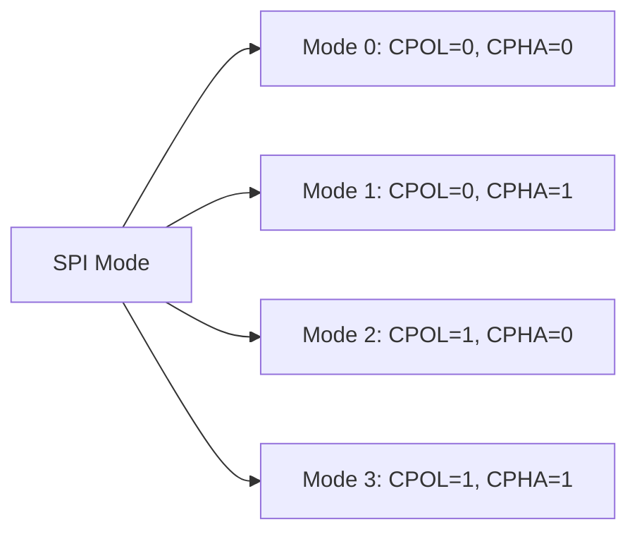

# STM32 SPI Configuration

## Introduction

Serial Peripheral Interface (SPI) is a synchronous serial communication protocol widely used in embedded systems for communicating with sensors, memory chips, displays, and other peripherals. In this tutorial, we'll explore how to configure and use SPI on STM32 microcontrollers.

SPI offers several advantages over other communication protocols, including:

- High-speed data transfer (several MHz)
- Full-duplex communication (simultaneous send and receive)
- Simple hardware implementation
- No addressing overhead

By the end of this guide, you'll understand the fundamentals of SPI and be able to implement SPI communication on your STM32 device.

## SPI Basics

### What is SPI?

SPI is a 4-wire, full-duplex communication protocol that operates in a master-slave configuration. One device (usually the microcontroller) acts as the master, while peripheral devices act as slaves.

### SPI Signal Lines

SPI uses four primary signal lines:

1. **SCLK (Serial Clock)**: Clock signal generated by the master
2. **MOSI (Master Out Slave In)**: Data line from master to slave
3. **MISO (Master In Slave Out)**: Data line from slave to master
4. **SS/CS (Slave Select/Chip Select)**: Line to select which slave device to communicate with

### SPI Communication Modes

SPI can operate in four different modes, determined by clock polarity (CPOL) and clock phase (CPHA):

| Mode | CPOL | CPHA | Clock Idle State | Data Sampling Edge |
|------|------|------|------------------|-------------------|
| 0    | 0    | 0    | Low              | Rising Edge       |
| 1    | 0    | 1    | Low              | Falling Edge      |
| 2    | 1    | 0    | High             | Falling Edge      |
| 3    | 1    | 1    | High             | Rising Edge       |



## STM32 SPI Hardware Overview

STM32 microcontrollers typically have multiple SPI peripherals (SPI1, SPI2, etc.), each connected to specific GPIO pins. The exact pin assignments depend on the specific STM32 model you're using.

Each SPI peripheral in STM32 includes:

- Data registers for transmission and reception
- Control registers for configuration
- Status registers for monitoring operations
- Clock generation circuitry

## SPI Configuration Steps

Let's walk through the process of configuring SPI on an STM32 microcontroller:

### 1. Enable GPIO and SPI Peripheral Clocks

First, we need to enable the clock for both the GPIO pins and the SPI peripheral:

```c
// Enable clock for GPIOA and SPI1
RCC->AHB1ENR |= RCC_AHB1ENR_GPIOAEN;  // Enable GPIOA clock
RCC->APB2ENR |= RCC_APB2ENR_SPI1EN;   // Enable SPI1 clock
```

### 2. Configure GPIO Pins

Configure the GPIO pins for SPI functionality:

```c
// Configure PA5 (SCK), PA6 (MISO), PA7 (MOSI) for SPI1
// Set alternate function mode
GPIOA->MODER &= ~(GPIO_MODER_MODER5_0 | GPIO_MODER_MODER6_0 | GPIO_MODER_MODER7_0);
GPIOA->MODER |= (GPIO_MODER_MODER5_1 | GPIO_MODER_MODER6_1 | GPIO_MODER_MODER7_1);

// Set high-speed mode
GPIOA->OSPEEDR |= (GPIO_OSPEEDER_OSPEEDR5 | GPIO_OSPEEDER_OSPEEDR6 | GPIO_OSPEEDER_OSPEEDR7);

// Configure alternate function to AF5 (SPI1)
GPIOA->AFR[0] |= (5 << (5 * 4)) | (5 << (6 * 4)) | (5 << (7 * 4));

// Configure PA4 as output for SS/CS
GPIOA->MODER &= ~GPIO_MODER_MODER4_1;
GPIOA->MODER |= GPIO_MODER_MODER4_0;
GPIOA->BSRR = GPIO_BSRR_BS_4;  // Set CS high initially
```

### 3. Configure SPI Parameters

Now, configure the SPI peripheral with the desired parameters:

```c
// Reset SPI1 configuration
SPI1->CR1 = 0;

// Configure SPI1
SPI1->CR1 |= (
    SPI_CR1_MSTR |      // Master mode
    SPI_CR1_SSM |       // Software slave management
    SPI_CR1_SSI |       // Internal slave select
    SPI_CR1_BR_1 |      // Baud rate: fPCLK/8
    0                   // CPOL=0, CPHA=0 (SPI Mode 0)
);

// Enable SPI
SPI1->CR1 |= SPI_CR1_SPE;
```

### 4. Create SPI Data Transfer Functions

Create functions to send and receive data:

```c
uint8_t SPI_Transfer(uint8_t data) {
    // Wait until transmit buffer is empty
    while(!(SPI1->SR & SPI_SR_TXE));
    
    // Send data
    SPI1->DR = data;
    
    // Wait until receive buffer is not empty
    while(!(SPI1->SR & SPI_SR_RXNE));
    
    // Return received data
    return SPI1->DR;
}

void SPI_CS_Low(void) {
    GPIOA->BSRR = GPIO_BSRR_BR_4;  // Set CS low
}

void SPI_CS_High(void) {
    GPIOA->BSRR = GPIO_BSRR_BS_4;  // Set CS high
}
```

## Using STM32CubeMX for SPI Configuration

For beginners, STM32CubeMX offers a graphical way to configure SPI:

1. Open your project in STM32CubeMX
2. Navigate to the Pinout & Configuration tab
3. Enable an SPI peripheral (e.g., SPI1)
4. Configure the SPI parameters (Mode, Data Size, etc.)
5. Configure the GPIO pins for SPI
6. Generate the code

Here's an example of SPI configuration using the HAL library generated by STM32CubeMX:

```c
// SPI handle declaration
SPI_HandleTypeDef hspi1;

// SPI initialization function
void MX_SPI1_Init(void) {
    hspi1.Instance = SPI1;
    hspi1.Init.Mode = SPI_MODE_MASTER;
    hspi1.Init.Direction = SPI_DIRECTION_2LINES;
    hspi1.Init.DataSize = SPI_DATASIZE_8BIT;
    hspi1.Init.CLKPolarity = SPI_POLARITY_LOW;
    hspi1.Init.CLKPhase = SPI_PHASE_1EDGE;
    hspi1.Init.NSS = SPI_NSS_SOFT;
    hspi1.Init.BaudRatePrescaler = SPI_BAUDRATEPRESCALER_8;
    hspi1.Init.FirstBit = SPI_FIRSTBIT_MSB;
    hspi1.Init.TIMode = SPI_TIMODE_DISABLE;
    hspi1.Init.CRCCalculation = SPI_CRCCALCULATION_DISABLE;
    hspi1.Init.CRCPolynomial = 10;
    
    if (HAL_SPI_Init(&hspi1) != HAL_OK) {
        Error_Handler();
    }
}

// SPI transmit/receive functions
uint8_t SPI_Transmit_Receive(uint8_t data) {
    uint8_t receivedData;
    HAL_SPI_TransmitReceive(&hspi1, &data, &receivedData, 1, HAL_MAX_DELAY);
    return receivedData;
}
```

## Practical Example: Reading Data from an SPI Sensor

Let's implement a practical example of reading data from an ADXL345 accelerometer using SPI:

```c
// ADXL345 Register Addresses
#define ADXL345_DEVID          0x00
#define ADXL345_POWER_CTL      0x2D
#define ADXL345_DATA_FORMAT    0x31
#define ADXL345_DATAX0         0x32

// Function to write to ADXL345 register
void ADXL345_WriteReg(uint8_t reg, uint8_t value) {
    SPI_CS_Low();              // Select the device
    SPI_Transfer(reg);         // Send register address
    SPI_Transfer(value);       // Send value
    SPI_CS_High();             // Deselect the device
}

// Function to read from ADXL345 register
uint8_t ADXL345_ReadReg(uint8_t reg) {
    SPI_CS_Low();              // Select the device
    SPI_Transfer(0x80 | reg);  // Send register address with read bit set
    uint8_t value = SPI_Transfer(0x00); // Read value (send dummy byte)
    SPI_CS_High();             // Deselect the device
    return value;
}

// Initialize ADXL345
void ADXL345_Init(void) {
    // Check device ID
    uint8_t deviceID = ADXL345_ReadReg(ADXL345_DEVID);
    if (deviceID != 0xE5) {
        // Error: Device not found
        while(1);
    }
    
    // Set data format (±4g range)
    ADXL345_WriteReg(ADXL345_DATA_FORMAT, 0x01);
    
    // Power on the device
    ADXL345_WriteReg(ADXL345_POWER_CTL, 0x08);
}

// Read Accelerometer Data
void ADXL345_ReadAccel(int16_t *x, int16_t *y, int16_t *z) {
    SPI_CS_Low();                      // Select the device
    SPI_Transfer(0x80 | 0x40 | ADXL345_DATAX0);  // Read bit + multiple byte + start register
    
    uint8_t x0 = SPI_Transfer(0x00);
    uint8_t x1 = SPI_Transfer(0x00);
    uint8_t y0 = SPI_Transfer(0x00);
    uint8_t y1 = SPI_Transfer(0x00);
    uint8_t z0 = SPI_Transfer(0x00);
    uint8_t z1 = SPI_Transfer(0x00);
    
    SPI_CS_High();                     // Deselect the device
    
    // Combine bytes to form 16-bit values
    *x = (int16_t)((x1 << 8) | x0);
    *y = (int16_t)((y1 << 8) | y0);
    *z = (int16_t)((z1 << 8) | z0);
}

// Main function example
int main(void) {
    // Initialize system
    SystemClock_Config();
    
    // Initialize SPI (assuming we've already configured it)
    
    // Initialize ADXL345
    ADXL345_Init();
    
    int16_t x, y, z;
    
    while(1) {
        // Read accelerometer data
        ADXL345_ReadAccel(&x, &y, &z);
        
        // Process or display data
        // ...
        
        HAL_Delay(100); // Read every 100ms
    }
}
```

## Common SPI Challenges and Solutions

### 1. Clock Speed Mismatch

**Problem**: The SPI master clock is too fast for the slave device.

**Solution**: Reduce the clock speed by adjusting the prescaler in the SPI configuration:

```c
// Reduce clock speed by increasing the prescaler
SPI1->CR1 |= SPI_CR1_BR_2 | SPI_CR1_BR_1 | SPI_CR1_BR_0; // fPCLK/256
```

### 2. Incorrect SPI Mode

**Problem**: Communication fails because the wrong SPI mode (CPOL/CPHA) is set.

**Solution**: Check the datasheet of your slave device and set the correct mode:

```c
// Configure for SPI Mode 3 (CPOL=1, CPHA=1)
SPI1->CR1 |= SPI_CR1_CPOL | SPI_CR1_CPHA;
```

### 3. Multi-Slave Management

**Problem**: Managing multiple slave devices on a single SPI bus.

**Solution**: Use separate chip select lines for each slave:

```c
// Chip select for device 1
void SPI_CS1_Low(void) {
    GPIOA->BSRR = GPIO_BSRR_BR_4;  // PA4 low
}

void SPI_CS1_High(void) {
    GPIOA->BSRR = GPIO_BSRR_BS_4;  // PA4 high
}

// Chip select for device 2
void SPI_CS2_Low(void) {
    GPIOB->BSRR = GPIO_BSRR_BR_0;  // PB0 low
}

void SPI_CS2_High(void) {
    GPIOB->BSRR = GPIO_BSRR_BS_0;  // PB0 high
}
```

## DMA with SPI

For high-performance applications, you can use Direct Memory Access (DMA) with SPI to transfer data without CPU intervention:

```c
// DMA configuration for SPI transmission
void SPI_DMA_Init(void) {
    // Enable DMA clock
    RCC->AHB1ENR |= RCC_AHB1ENR_DMA2EN;
    
    // Configure DMA for SPI TX
    DMA2_Stream3->CR = 0;
    DMA2_Stream3->CR |= (
        (3 << DMA_SxCR_CHSEL_Pos) |  // Channel 3
        DMA_SxCR_MINC |              // Memory increment mode
        DMA_SxCR_DIR_0               // Memory to peripheral
    );
    DMA2_Stream3->PAR = (uint32_t)&SPI1->DR;
    
    // Configure DMA for SPI RX
    DMA2_Stream2->CR = 0;
    DMA2_Stream2->CR |= (
        (3 << DMA_SxCR_CHSEL_Pos) |  // Channel 3
        DMA_SxCR_MINC                // Memory increment mode
    );
    DMA2_Stream2->PAR = (uint32_t)&SPI1->DR;
    
    // Enable DMA in SPI
    SPI1->CR2 |= SPI_CR2_TXDMAEN | SPI_CR2_RXDMAEN;
}

// Transfer data using DMA
void SPI_TransferDMA(uint8_t *txData, uint8_t *rxData, uint16_t size) {
    // Configure TX DMA
    DMA2_Stream3->M0AR = (uint32_t)txData;
    DMA2_Stream3->NDTR = size;
    
    // Configure RX DMA
    DMA2_Stream2->M0AR = (uint32_t)rxData;
    DMA2_Stream2->NDTR = size;
    
    // Enable DMA streams
    DMA2_Stream2->CR |= DMA_SxCR_EN;
    DMA2_Stream3->CR |= DMA_SxCR_EN;
    
    // Lower chip select
    SPI_CS_Low();
    
    // Wait for completion
    while(!(DMA2->LISR & DMA_LISR_TCIF2));
    
    // Clear flags
    DMA2->LIFCR |= DMA_LIFCR_CTCIF2;
    
    // Disable DMA streams
    DMA2_Stream2->CR &= ~DMA_SxCR_EN;
    DMA2_Stream3->CR &= ~DMA_SxCR_EN;
    
    // Raise chip select
    SPI_CS_High();
}
```

## Summary

In this tutorial, we've covered:

1. The basics of SPI communication protocol
2. How to configure SPI peripherals on STM32 microcontrollers
3. Implementation of data transfer functions
4. Practical example of interfacing with an ADXL345 accelerometer
5. Common challenges and their solutions
6. Advanced SPI usage with DMA

SPI is a versatile communication protocol for embedded systems, allowing high-speed data exchange with various peripherals. By understanding the configuration process and following the examples in this guide, you should now be able to implement SPI communication in your STM32 projects.

## Exercises

1. Configure SPI on your STM32 board and test communication using a logic analyzer or oscilloscope.
2. Implement SPI communication with an SD card to read and write files.
3. Connect multiple SPI devices (e.g., a display and a sensor) to your STM32 and manage them using separate chip select lines.
4. Implement DMA with SPI to transfer large blocks of data efficiently.
5. Compare the performance of polling-based, interrupt-based, and DMA-based SPI transfers.

## Additional Resources

- STM32 Reference Manual: Check the SPI peripheral section for your specific STM32 model
- STM32 HAL Documentation: For those using the STM32 HAL libraries
- Application Notes:
  - AN4286: SPI protocol used in the STM32 bootloader
  - AN3156: USB DFU protocol used in the STM32 bootloader

Remember that understanding the datasheets of both your microcontroller and the peripheral devices is crucial for successful SPI communication.