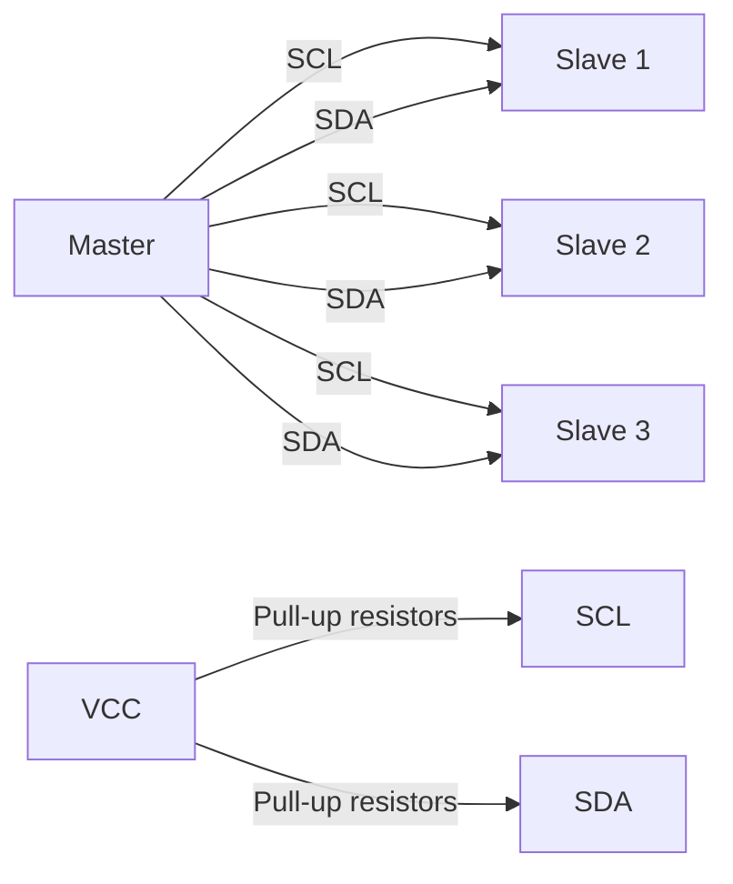
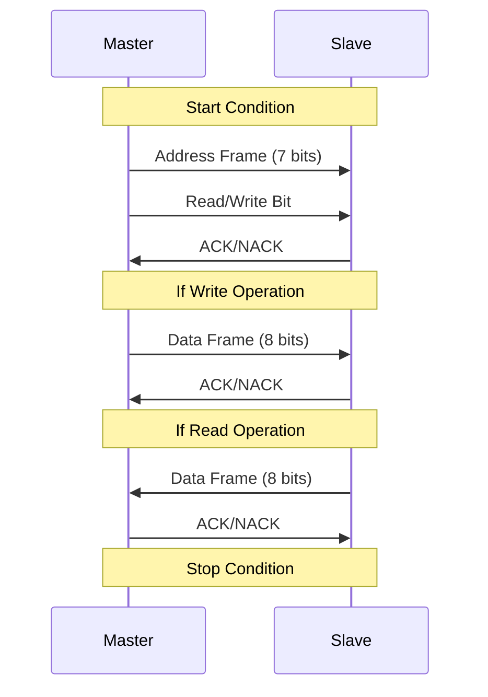

# STM32 I2C Basics

## Introduction

The Inter-Integrated Circuit (I²C or I2C) protocol is one of the most widely used communication protocols in embedded systems. Developed by Philips Semiconductors (now NXP) in the early 1980s, I2C provides a simple and efficient method for multiple devices to communicate over just two wires. This makes it perfect for connecting various low-speed peripheral devices to microcontrollers like the STM32 family.

In this tutorial, we'll explore the fundamentals of I2C and learn how to implement it on STM32 microcontrollers. You'll discover how to configure the I2C peripheral, communicate with sensors and other devices, and build practical applications using this versatile protocol.

## What is I2C?

I2C is a synchronous, multi-master, multi-slave, packet switched, single-ended, serial communication bus. Let's break down what each of these terms means:

- **Synchronous**: Data transfer is synchronized by a clock signal
- **Multi-master**: Multiple devices can initiate data transfers
- **Multi-slave**: Multiple peripheral devices can be connected to the same bus
- **Packet switched**: Data is transferred in packets that include addressing information
- **Single-ended**: Uses voltage levels relative to a common ground
- **Serial**: Data is transferred bit by bit over a single data line

### Physical Layer

I2C requires only two lines to communicate:

1. **SCL (Serial Clock Line)**: Carries the clock signal
2. **SDA (Serial Data Line)**: Carries the data

Both lines are bidirectional and connected to the positive supply voltage through pull-up resistors, making them normally HIGH when the bus is idle.



### I2C Communication Protocol

The I2C protocol follows a specific sequence for data transmission:

1. **Start Condition**: The master pulls SDA LOW while SCL is HIGH
2. **Address Frame**: 7 or 10 bits that identify which slave to communicate with
3. **Read/Write Bit**: Indicates whether the master wants to read from or write to the slave
4. **ACK/NACK Bit**: The receiving device acknowledges (ACK) or doesn't acknowledge (NACK) the transmission
5. **Data Frames**: 8-bit data messages transferred from master to slave or vice versa
6. **Stop Condition**: The master releases SDA (allowing it to go HIGH) while SCL is HIGH

Let's visualize this sequence:



## STM32 I2C Hardware

STM32 microcontrollers feature hardware I2C peripherals that handle most of the protocol details automatically. Depending on the specific STM32 model, you might have 1 to 4 I2C peripherals available.

The STM32 I2C peripherals support:
- Standard mode (up to 100 kHz)
- Fast mode (up to 400 kHz)
- Fast mode plus (up to 1 MHz, on some models)

Each I2C peripheral connects to specific GPIO pins that can be configured as SCL and SDA lines. You'll need to check your specific STM32 model's datasheet to identify which pins to use.

## Setting Up I2C on STM32

You can initialize the I2C peripheral using either the STM32CubeMX tool or directly through code. We'll cover both approaches.

### Using STM32CubeMX

STM32CubeMX provides a graphical interface to configure your STM32 microcontroller:

1. Open your project in STM32CubeMX
2. In the Pinout & Configuration tab, enable the I2C peripheral you want to use
3. Configure the I2C parameters (speed, addressing mode, etc.)
4. Generate the code

### Direct Code Configuration

Here's how to initialize I2C manually in your code using the HAL library:

```c
// I2C initialization function
void MX_I2C1_Init(void)
{
  hi2c1.Instance = I2C1;
  hi2c1.Init.ClockSpeed = 100000;    // 100 KHz (Standard mode)
  hi2c1.Init.DutyCycle = I2C_DUTYCYCLE_2;
  hi2c1.Init.OwnAddress1 = 0;        // Our address (as master)
  hi2c1.Init.AddressingMode = I2C_ADDRESSINGMODE_7BIT;
  hi2c1.Init.DualAddressMode = I2C_DUALADDRESS_DISABLE;
  hi2c1.Init.OwnAddress2 = 0;
  hi2c1.Init.GeneralCallMode = I2C_GENERALCALL_DISABLE;
  hi2c1.Init.NoStretchMode = I2C_NOSTRETCH_DISABLE;
  
  if (HAL_I2C_Init(&hi2c1) != HAL_OK)
  {
    Error_Handler();
  }
}

// I2C MSP initialization (called by HAL_I2C_Init)
void HAL_I2C_MspInit(I2C_HandleTypeDef* hi2c)
{
  GPIO_InitTypeDef GPIO_InitStruct = {0};
  
  if(hi2c->Instance == I2C1)
  {
    // Enable clock for GPIOB and I2C1
    __HAL_RCC_GPIOB_CLK_ENABLE();
    __HAL_RCC_I2C1_CLK_ENABLE();
    
    // Configure I2C1 pins (PB6: SCL, PB7: SDA)
    GPIO_InitStruct.Pin = GPIO_PIN_6|GPIO_PIN_7;
    GPIO_InitStruct.Mode = GPIO_MODE_AF_OD;      // Open-drain for I2C
    GPIO_InitStruct.Pull = GPIO_PULLUP;          // Pull-up resistors
    GPIO_InitStruct.Speed = GPIO_SPEED_FREQ_HIGH;
    GPIO_InitStruct.Alternate = GPIO_AF4_I2C1;   // Alternate function for I2C1
    HAL_GPIO_Init(GPIOB, &GPIO_InitStruct);
    
    // Configure NVIC for I2C1 interrupts if needed
    // HAL_NVIC_SetPriority(I2C1_EV_IRQn, 0, 0);
    // HAL_NVIC_EnableIRQ(I2C1_EV_IRQn);
  }
}
```

This code initializes I2C1 in standard mode (100 kHz) with 7-bit addressing. It also configures the GPIO pins for I2C communication.

## Basic I2C Operations

Let's explore the basic operations you can perform with I2C.

### 1. Transmitting Data

To send data to a slave device, use the `HAL_I2C_Master_Transmit` function:

```c
// Send data to a slave device
uint8_t data[] = {0x01, 0x02, 0x03};  // Data to send
HAL_StatusTypeDef status;

status = HAL_I2C_Master_Transmit(&hi2c1, 0x50 << 1, data, sizeof(data), HAL_MAX_DELAY);

if (status != HAL_OK)
{
  // Error handling
  printf("Error transmitting data: %d\r
", status);
}
```

Note that the slave address needs to be shifted left by 1 bit because the HAL functions use 8-bit addressing format (the LSB is used internally for the Read/Write bit).

### 2. Receiving Data

To receive data from a slave device, use the `HAL_I2C_Master_Receive` function:

```c
// Receive data from a slave device
uint8_t data[3];  // Buffer to store received data
HAL_StatusTypeDef status;

status = HAL_I2C_Master_Receive(&hi2c1, 0x50 << 1, data, sizeof(data), HAL_MAX_DELAY);

if (status != HAL_OK)
{
  // Error handling
  printf("Error receiving data: %d\r
", status);
}
else
{
  // Process received data
  printf("Received: %02X %02X %02X\r
", data[0], data[1], data[2]);
}
```

### 3. Memory Read/Write

Many I2C devices like sensors or EEPROMs have internal memory addresses that you need to access. For this, you can use the Memory Read/Write functions:

```c
// Write to a specific register in a slave device
uint8_t reg_addr = 0x0A;         // Register address
uint8_t data_to_write = 0x42;    // Data to write
HAL_StatusTypeDef status;

status = HAL_I2C_Mem_Write(&hi2c1, 0x50 << 1, reg_addr, I2C_MEMADD_SIZE_8BIT, 
                          &data_to_write, 1, HAL_MAX_DELAY);

if (status != HAL_OK)
{
  // Error handling
}

// Read from a specific register in a slave device
uint8_t reg_addr = 0x0A;         // Register address
uint8_t received_data;           // Buffer for received data
HAL_StatusTypeDef status;

status = HAL_I2C_Mem_Read(&hi2c1, 0x50 << 1, reg_addr, I2C_MEMADD_SIZE_8BIT,
                          &received_data, 1, HAL_MAX_DELAY);

if (status != HAL_OK)
{
  // Error handling
}
else
{
  printf("Register 0x%02X contains: 0x%02X\r
", reg_addr, received_data);
}
```

### 4. I2C Device Detection

A common task is scanning the I2C bus to find connected devices. Here's a function to do that:

```c
// Scan the I2C bus for connected devices
void I2C_ScanBus(I2C_HandleTypeDef *hi2c)
{
  HAL_StatusTypeDef status;
  uint8_t i;
  uint8_t found = 0;
  
  printf("Scanning I2C bus:\r
");
  
  for (i = 1; i < 128; i++)  // 7-bit addresses range from 0 to 127
  {
    // Attempt to communicate with each possible address
    status = HAL_I2C_IsDeviceReady(hi2c, i << 1, 2, 10);
    
    if (status == HAL_OK)
    {
      printf("Device found at address 0x%02X\r
", i);
      found++;
    }
  }
  
  if (found == 0)
  {
    printf("No devices found\r
");
  }
  else
  {
    printf("Found %d device(s)\r
", found);
  }
}
```

## Practical Example: Reading an I2C Temperature Sensor

Let's create a practical example using the common I2C temperature sensor LM75:

```c
// Define LM75 sensor address and registers
#define LM75_ADDR        0x48    // Address for LM75 (can be from 0x48 to 0x4F)
#define LM75_TEMP_REG    0x00    // Temperature register
#define LM75_CONF_REG    0x01    // Configuration register
#define LM75_THYST_REG   0x02    // Hysteresis register
#define LM75_TOS_REG     0x03    // Over-temperature register

// Initialize LM75 sensor
HAL_StatusTypeDef LM75_Init(I2C_HandleTypeDef *hi2c)
{
  uint8_t config = 0x00;  // Normal operation mode
  
  // Write configuration to the sensor
  return HAL_I2C_Mem_Write(hi2c, LM75_ADDR << 1, LM75_CONF_REG, 
                          I2C_MEMADD_SIZE_8BIT, &config, 1, HAL_MAX_DELAY);
}

// Read temperature from LM75 sensor
float LM75_ReadTemperature(I2C_HandleTypeDef *hi2c)
{
  uint8_t temp_data[2];
  HAL_StatusTypeDef status;
  int16_t temp_raw;
  float temperature;
  
  // Read temperature register (2 bytes)
  status = HAL_I2C_Mem_Read(hi2c, LM75_ADDR << 1, LM75_TEMP_REG,
                           I2C_MEMADD_SIZE_8BIT, temp_data, 2, HAL_MAX_DELAY);
  
  if (status != HAL_OK)
  {
    // Return error value
    return -273.15f;  // Absolute zero (obviously an error)
  }
  
  // Convert the raw data to temperature
  // The LM75 gives a 11-bit signed value, with LSB = 0.125°C
  temp_raw = (temp_data[0] << 8) | temp_data[1];
  temp_raw = temp_raw >> 5;  // The 5 LSBs are not used
  
  // Convert to 2's complement if negative
  if (temp_raw & 0x400)  // Check sign bit
  {
    temp_raw |= 0xF800;  // Extend sign bits
  }
  
  // Convert to floating point (LSB = 0.125°C)
  temperature = temp_raw * 0.125f;
  
  return temperature;
}

// Main function to use the LM75 sensor
void LM75_Example(void)
{
  HAL_StatusTypeDef status;
  float temperature;
  
  // Initialize I2C1 (call this before using I2C)
  MX_I2C1_Init();
  
  printf("LM75 Temperature Sensor Example\r
");
  
  // Initialize sensor
  status = LM75_Init(&hi2c1);
  if (status != HAL_OK)
  {
    printf("Error initializing LM75 sensor\r
");
    return;
  }
  
  while (1)
  {
    // Read and display temperature
    temperature = LM75_ReadTemperature(&hi2c1);
    
    if (temperature > -273.0f)  // Check if valid
    {
      printf("Current temperature: %.2f°C\r
", temperature);
    }
    else
    {
      printf("Error reading temperature\r
");
    }
    
    // Wait for 1 second
    HAL_Delay(1000);
  }
}
```

This example demonstrates how to:
1. Initialize the I2C peripheral
2. Configure the LM75 temperature sensor
3. Read temperature values in a loop
4. Convert the raw data to meaningful temperature readings

## Common Issues and Troubleshooting

When working with I2C on STM32, you might encounter several common issues:

### 1. Bus Errors

If your I2C communication fails, check for:

- **Missing pull-up resistors**: I2C requires pull-up resistors on both SDA and SDA lines
- **Incorrect pin configuration**: Ensure pins are set to Alternate Function Open-Drain mode
- **Clock speed issues**: Some devices may not support high-speed modes

### 2. Address Problems

- **Incorrect addressing**: Remember to shift the 7-bit address one bit left in HAL functions
- **Address conflicts**: Make sure no two devices on the bus have the same address

### 3. Timing Issues

- **Clock stretching**: Some slaves may need clock stretching, ensure it's not disabled
- **Bus timing violations**: Very long bus lines may cause timing issues at higher speeds

### 4. Debugging I2C

To debug I2C issues:

- Use an oscilloscope to observe the SDA and SCL lines
- Implement the I2C scanner code provided earlier to detect connected devices
- Check HAL status return codes for specific error information
- Try reducing the clock speed to see if that resolves communication issues

## Advanced I2C Features

Once you're comfortable with basic I2C operations, you can explore more advanced features:

### Interrupt-Based Communication

Instead of blocking functions, you can use interrupt-based I2C:

```c
// Start a non-blocking I2C transmission
HAL_I2C_Master_Transmit_IT(&hi2c1, 0x50 << 1, data, sizeof(data));

// Callback function (will be called when transmission completes)
void HAL_I2C_MasterTxCpltCallback(I2C_HandleTypeDef *hi2c)
{
  if (hi2c->Instance == I2C1)
  {
    // Transmission complete
    printf("Data sent successfully\r
");
  }
}
```

### DMA-Based Communication

For efficient transfer of large data blocks, use DMA:

```c
// Start a DMA-based I2C transmission
HAL_I2C_Master_Transmit_DMA(&hi2c1, 0x50 << 1, data, sizeof(data));

// Callback function for DMA completion
void HAL_I2C_MasterTxCpltCallback(I2C_HandleTypeDef *hi2c)
{
  if (hi2c->Instance == I2C1)
  {
    // DMA transmission complete
    printf("DMA transfer complete\r
");
  }
}
```

### I2C Slave Mode

STM32 can also function as an I2C slave device:

```c
// Initialize I2C in slave mode
hi2c1.Init.OwnAddress1 = 0x30 << 1;  // Our slave address
HAL_I2C_Init(&hi2c1);

// Start listening for master transmissions
uint8_t rx_buffer[10];
HAL_I2C_Slave_Receive_IT(&hi2c1, rx_buffer, sizeof(rx_buffer));

// Callback when data is received
void HAL_I2C_SlaveRxCpltCallback(I2C_HandleTypeDef *hi2c)
{
  // Process received data
  printf("Data received from master\r
");
  
  // Resume listening
  HAL_I2C_Slave_Receive_IT(&hi2c1, rx_buffer, sizeof(rx_buffer));
}
```

## Summary

In this tutorial, you've learned:

- The fundamentals of the I2C communication protocol
- How to configure I2C peripherals on STM32 microcontrollers
- Basic I2C operations including transmitting and receiving data
- How to communicate with I2C devices like sensors
- Techniques for debugging I2C issues
- Advanced features like interrupt and DMA-based communication

I2C is a versatile and widely used protocol in embedded systems. With the knowledge gained from this tutorial, you should be able to integrate various I2C devices into your STM32 projects.

## Exercises

To reinforce your learning, try these exercises:

1. Implement an I2C bus scanner and test it on a breadboard with multiple I2C devices
2. Interface with an I2C EEPROM (like 24LC256) to store and retrieve data
3. Connect an I2C OLED display (like SSD1306) and display text or graphics
4. Create a weather station using I2C sensors (temperature, humidity, pressure)
5. Implement a multi-master I2C configuration with two STM32 microcontrollers

## Additional Resources

To deepen your understanding of I2C with STM32:

- [STM32 HAL I2C Driver Documentation](https://www.st.com/resource/en/user_manual/um1725-description-of-stm32f4-hal-and-lowlayer-drivers-stmicroelectronics.pdf)
- [NXP I2C Specification](https://www.nxp.com/docs/en/user-guide/UM10204.pdf)
- "Making Embedded Systems" by Elecia White - contains good sections on communication protocols
- "Mastering STM32" by Carmine Noviello - comprehensive guide to STM32 programming