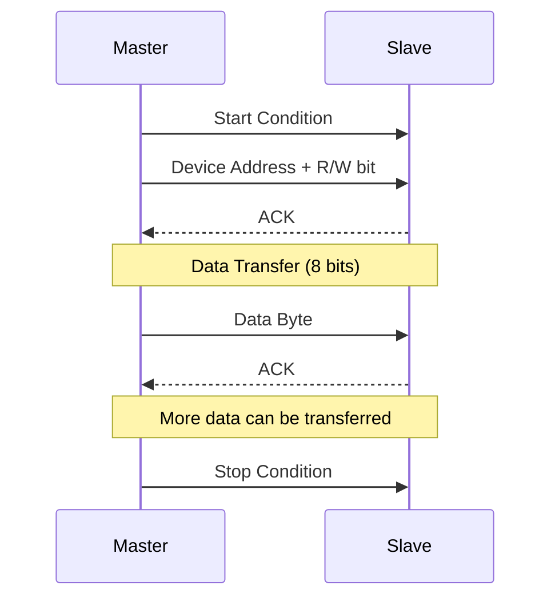

# STM32 I2C Configuration

## Introduction

I2C (Inter-Integrated Circuit) is a popular serial communication protocol used for connecting multiple devices on the same bus using just two wires. It's widely used in embedded systems to interface with sensors, EEPROMs, display modules, and other peripherals. In this tutorial, we'll explore how to configure and use the I2C peripheral on STM32 microcontrollers.

I2C uses two bidirectional lines:
- **SCL (Serial Clock Line)**: Carries the clock signal
- **SDA (Serial Data Line)**: Carries the data

The protocol supports multiple masters and slaves on the same bus, with each device having a unique address. This makes it perfect for systems where you need to connect several components with minimal wiring.

## Understanding I2C Basics

Before diving into STM32-specific implementation, let's understand some key I2C concepts:

### I2C Communication Structure

I2C communication follows a specific structure:

1. **Start Condition**: Master pulls SDA low while SCL is high
2. **Device Addressing**: 7-bit or 10-bit address + R/W bit
3. **Data Transfer**: 8-bit data packets followed by an acknowledgment bit
4. **Stop Condition**: Master releases SDA (goes high) while SCL is high



### I2C Bus Speed Modes

STM32 microcontrollers support various I2C speed modes:
- **Standard Mode**: 100 kHz
- **Fast Mode**: 400 kHz
- **Fast Mode Plus**: 1 MHz
- **High Speed Mode**: Up to 3.4 MHz (only on some STM32 models)

## STM32 I2C Peripheral Overview

STM32 microcontrollers typically have multiple I2C peripherals (I2C1, I2C2, etc.) with these key features:

- Support for 7-bit and 10-bit addressing modes
- Master or slave operation
- Multiple speed modes
- DMA support for efficient data transfer
- SMBus/PMBus compatibility
- Hardware error detection and handling

## Setting Up I2C on STM32

Let's walk through configuring I2C on an STM32 microcontroller using the STM32CubeIDE and HAL library.

### Step 1: Configure GPIO Pins

First, we need to set up the appropriate GPIO pins for I2C communication:

```c
// Enable GPIO clock
__HAL_RCC_GPIOB_CLK_ENABLE();

// Configure I2C pins (SCL and SDA)
GPIO_InitTypeDef GPIO_InitStruct = {0};
GPIO_InitStruct.Pin = GPIO_PIN_8 | GPIO_PIN_9;  // PB8 (SCL), PB9 (SDA) for I2C1
GPIO_InitStruct.Mode = GPIO_MODE_AF_OD;         // Alternate function, Open Drain
GPIO_InitStruct.Pull = GPIO_PULLUP;             // Enable pull-up resistors
GPIO_InitStruct.Speed = GPIO_SPEED_FREQ_HIGH;   // High speed
GPIO_InitStruct.Alternate = GPIO_AF4_I2C1;      // Alternate function for I2C1

HAL_GPIO_Init(GPIOB, &GPIO_InitStruct);
```

### Step 2: Configure I2C Peripheral

Now, let's configure the I2C peripheral:

```c
// Enable I2C clock
__HAL_RCC_I2C1_CLK_ENABLE();

// Initialize I2C
I2C_HandleTypeDef hi2c1 = {0};
hi2c1.Instance = I2C1;
hi2c1.Init.ClockSpeed = 100000;               // 100 kHz (Standard mode)
hi2c1.Init.DutyCycle = I2C_DUTYCYCLE_2;       // 50% duty cycle
hi2c1.Init.OwnAddress1 = 0;                   // Own address (for slave mode)
hi2c1.Init.AddressingMode = I2C_ADDRESSINGMODE_7BIT;  // 7-bit addressing
hi2c1.Init.DualAddressMode = I2C_DUALADDRESS_DISABLE; // Dual address disabled
hi2c1.Init.GeneralCallMode = I2C_GENERALCALL_DISABLE; // General call disabled
hi2c1.Init.NoStretchMode = I2C_NOSTRETCH_DISABLE;     // Clock stretching enabled

// Initialize I2C peripheral
if (HAL_I2C_Init(&hi2c1) != HAL_OK) {
    Error_Handler();
}
```

### Step 3: Enable Interrupts (Optional)

If you plan to use interrupts for I2C communication:

```c
// Enable I2C event and error interrupts
HAL_NVIC_SetPriority(I2C1_EV_IRQn, 0, 0);
HAL_NVIC_EnableIRQ(I2C1_EV_IRQn);
HAL_NVIC_SetPriority(I2C1_ER_IRQn, 0, 0);
HAL_NVIC_EnableIRQ(I2C1_ER_IRQn);
```

## Using STM32CubeMX for I2C Configuration

STM32CubeMX provides a graphical way to configure I2C:

1. Open STM32CubeMX and create a new project or open an existing one
2. Select your STM32 microcontroller
3. In the Pinout & Configuration tab, enable I2C1 (or other I2C peripheral)
4. Configure the I2C parameters in the Configuration panel
5. Go to the Clock Configuration tab to ensure proper clock settings
6. Generate the code

## Basic I2C Operations

Now that we've configured I2C, let's explore basic operations.

### Transmitting Data (Master Mode)

To send data to a slave device:

```c
// Buffer to hold data to transmit
uint8_t data_to_send[3] = {0x01, 0x02, 0x03};

// Send data to slave device with address 0x50
HAL_StatusTypeDef status = HAL_I2C_Master_Transmit(&hi2c1, 0x50 << 1, data_to_send, 3, 1000);

if (status != HAL_OK) {
    // Handle error
    printf("Error: Failed to transmit data over I2C\r
");
}
```

### Receiving Data (Master Mode)

To receive data from a slave device:

```c
// Buffer to hold received data
uint8_t received_data[3] = {0};

// Receive data from slave device with address 0x50
HAL_StatusTypeDef status = HAL_I2C_Master_Receive(&hi2c1, 0x50 << 1, received_data, 3, 1000);

if (status != HAL_OK) {
    // Handle error
    printf("Error: Failed to receive data over I2C\r
");
} else {
    // Process received data
    printf("Received: %02X %02X %02X\r
", received_data[0], received_data[1], received_data[2]);
}
```

### Writing to a Specific Register (Common with I2C Sensors)

Many I2C devices require writing to specific internal registers:

```c
HAL_StatusTypeDef I2C_WriteRegister(I2C_HandleTypeDef *hi2c, uint8_t device_address, uint8_t reg_address, uint8_t reg_value) {
    uint8_t data[2] = {reg_address, reg_value};
    
    return HAL_I2C_Master_Transmit(hi2c, device_address << 1, data, 2, 1000);
}

// Example usage:
I2C_WriteRegister(&hi2c1, 0x50, 0x01, 0xAB);  // Write 0xAB to register 0x01 of device 0x50
```

### Reading from a Specific Register

Similarly, to read from a specific register:

```c
HAL_StatusTypeDef I2C_ReadRegister(I2C_HandleTypeDef *hi2c, uint8_t device_address, uint8_t reg_address, uint8_t *data) {
    // Send register address
    HAL_StatusTypeDef status = HAL_I2C_Master_Transmit(hi2c, device_address << 1, &reg_address, 1, 1000);
    if (status != HAL_OK) {
        return status;
    }
    
    // Read data from the specified register
    return HAL_I2C_Master_Receive(hi2c, device_address << 1, data, 1, 1000);
}

// Example usage:
uint8_t value = 0;
HAL_StatusTypeDef status = I2C_ReadRegister(&hi2c1, 0x50, 0x01, &value);
if (status == HAL_OK) {
    printf("Register 0x01 value: 0x%02X\r
", value);
}
```

## Using Non-Blocking I2C Operations

For more efficient operations, you can use non-blocking I2C transfers with callbacks or DMA:

### Using Callbacks

```c
// Define callback flag
volatile uint8_t transfer_complete = 0;

// Implement the callback function
void HAL_I2C_MasterTxCpltCallback(I2C_HandleTypeDef *hi2c) {
    if (hi2c->Instance == I2C1) {
        transfer_complete = 1;
    }
}

// Usage example
uint8_t data_to_send[3] = {0x01, 0x02, 0x03};
transfer_complete = 0;

// Start non-blocking transmission
HAL_I2C_Master_Transmit_IT(&hi2c1, 0x50 << 1, data_to_send, 3);

// Continue with other tasks while transfer is in progress
while (!transfer_complete) {
    // Do other work or go to low power mode
}
```

### Using DMA

```c
// Configure DMA for I2C transmission (usually done in CubeMX or initialization)

// Usage
uint8_t data_to_send[3] = {0x01, 0x02, 0x03};
HAL_I2C_Master_Transmit_DMA(&hi2c1, 0x50 << 1, data_to_send, 3);

// Rest of your code - DMA will handle the transfer in the background
```

## Implementing I2C Slave Mode

STM32 can also operate in I2C slave mode:

```c
// Slave mode initialization (add this in your I2C initialization)
hi2c1.Init.OwnAddress1 = 0x30 << 1;  // Our own slave address (0x30)

// Buffer for received data
uint8_t slave_rx_buffer[10] = {0};
uint8_t slave_tx_buffer[10] = {0x11, 0x22, 0x33, 0x44, 0x55, 0x66, 0x77, 0x88, 0x99, 0xAA};

// Start listening for master requests
HAL_I2C_Slave_Receive_IT(&hi2c1, slave_rx_buffer, 10);  // For receiving data
HAL_I2C_Slave_Transmit_IT(&hi2c1, slave_tx_buffer, 10); // For sending data when requested
```

## Error Handling and Debugging

Proper error handling is crucial for robust I2C communication:

```c
void I2C_Error_Handler(HAL_StatusTypeDef status) {
    switch (status) {
        case HAL_ERROR:
            printf("HAL Error: Check device address and connections\r
");
            break;
        case HAL_BUSY:
            printf("I2C Bus Busy: Try again later\r
");
            break;
        case HAL_TIMEOUT:
            printf("I2C Timeout: Check connections and clock settings\r
");
            break;
        default:
            printf("Unknown I2C Error\r
");
    }
    
    // Additional debug information
    if (HAL_I2C_GetError(&hi2c1) == HAL_I2C_ERROR_AF) {
        printf("Acknowledge Failure: Device not responding\r
");
    }
}

// Usage example
HAL_StatusTypeDef status = HAL_I2C_Master_Transmit(&hi2c1, 0x50 << 1, data_to_send, 3, 1000);
if (status != HAL_OK) {
    I2C_Error_Handler(status);
}
```

## I2C Scanner: Detecting Devices on the Bus

This useful tool helps identify I2C devices on your bus:

```c
void I2C_Scan(I2C_HandleTypeDef *hi2c) {
    printf("Scanning I2C bus:\r
");
    
    uint8_t devices_found = 0;
    uint8_t dummy_data = 0;
    
    for (uint8_t address = 1; address < 128; address++) {
        // Try to communicate with the device
        HAL_StatusTypeDef result = HAL_I2C_Master_Transmit(hi2c, address << 1, &dummy_data, 0, 100);
        
        if (result == HAL_OK) {
            printf("Device found at address 0x%02X\r
", address);
            devices_found++;
        }
        
        // Small delay between tries
        HAL_Delay(5);
    }
    
    if (devices_found == 0) {
        printf("No I2C devices found\r
");
    } else {
        printf("Total devices found: %d\r
", devices_found);
    }
}

// Usage
I2C_Scan(&hi2c1);
```

## Practical Example: Interfacing with an EEPROM

Let's create a complete example of interfacing with an I2C EEPROM (like AT24C32):

```c
// EEPROM device address
#define EEPROM_ADDR 0x50

// Write a byte to the EEPROM
HAL_StatusTypeDef EEPROM_WriteByte(I2C_HandleTypeDef *hi2c, uint16_t mem_address, uint8_t data) {
    uint8_t buffer[3];
    
    // Format: high address byte, low address byte, data byte
    buffer[0] = (mem_address >> 8) & 0xFF;  // High byte of address
    buffer[1] = mem_address & 0xFF;         // Low byte of address
    buffer[2] = data;                        // Data to write
    
    HAL_StatusTypeDef status = HAL_I2C_Master_Transmit(hi2c, EEPROM_ADDR << 1, buffer, 3, 1000);
    
    // EEPROM needs time to complete the write cycle
    HAL_Delay(5);
    
    return status;
}

// Read a byte from the EEPROM
HAL_StatusTypeDef EEPROM_ReadByte(I2C_HandleTypeDef *hi2c, uint16_t mem_address, uint8_t *data) {
    uint8_t address_buffer[2];
    
    // Format address to send
    address_buffer[0] = (mem_address >> 8) & 0xFF;  // High byte
    address_buffer[1] = mem_address & 0xFF;         // Low byte
    
    // Send memory address
    HAL_StatusTypeDef status = HAL_I2C_Master_Transmit(hi2c, EEPROM_ADDR << 1, address_buffer, 2, 1000);
    if (status != HAL_OK) {
        return status;
    }
    
    // Read data from the specified address
    return HAL_I2C_Master_Receive(hi2c, EEPROM_ADDR << 1, data, 1, 1000);
}

// Usage example
void EEPROM_Test(void) {
    uint8_t write_value = 0x42;
    uint8_t read_value = 0;
    
    printf("Writing 0x%02X to EEPROM address 0x0010...\r
", write_value);
    
    if (EEPROM_WriteByte(&hi2c1, 0x0010, write_value) != HAL_OK) {
        printf("Failed to write to EEPROM\r
");
        return;
    }
    
    printf("Reading from EEPROM address 0x0010...\r
");
    
    if (EEPROM_ReadByte(&hi2c1, 0x0010, &read_value) != HAL_OK) {
        printf("Failed to read from EEPROM\r
");
        return;
    }
    
    printf("Read value: 0x%02X\r
", read_value);
    
    if (read_value == write_value) {
        printf("EEPROM test successful!\r
");
    } else {
        printf("EEPROM test failed\r
");
    }
}
```

## Practical Example: Reading from an I2C Temperature Sensor

Here's an example using the popular LM75 temperature sensor:

```c
#define LM75_ADDR 0x48  // Default LM75 address
#define LM75_TEMP_REG 0x00  // Temperature register

float LM75_ReadTemperature(I2C_HandleTypeDef *hi2c) {
    uint8_t temp_reg = LM75_TEMP_REG;
    uint8_t data[2];
    float temperature = 0;
    
    // Select temperature register
    HAL_StatusTypeDef status = HAL_I2C_Master_Transmit(hi2c, LM75_ADDR << 1, &temp_reg, 1, 100);
    if (status != HAL_OK) {
        printf("Error selecting temperature register\r
");
        return -1000.0f;  // Error indicator
    }
    
    // Read temperature data (2 bytes)
    status = HAL_I2C_Master_Receive(hi2c, LM75_ADDR << 1, data, 2, 100);
    if (status != HAL_OK) {
        printf("Error reading temperature data\r
");
        return -1000.0f;  // Error indicator
    }
    
    // Convert the data
    // For LM75, MSB is integer part, LSB[7] is 0.5, LSB[6] is 0.25, etc.
    int16_t raw_temp = (data[0] << 8) | data[1];
    raw_temp >>= 5;  // The 11-bit temperature value is stored in the upper bits
    
    // Convert to Celsius (each bit = 0.125°C)
    temperature = (float)raw_temp * 0.125f;
    
    return temperature;
}

// Usage example
void Temperature_Monitor(void) {
    float temp = LM75_ReadTemperature(&hi2c1);
    
    if (temp > -999.0f) {  // Check if valid
        printf("Current temperature: %.2f°C\r
", temp);
    }
}
```

## Common Issues and Troubleshooting

When working with I2C on STM32, you might encounter these common issues:

### 1. Bus Error or No Response

**Possible causes:**
- Missing pull-up resistors on SCL and SDA lines
- Incorrect device address
- Power supply issues with the slave device
- Clock frequency too high for the slave

**Solutions:**
- Add 4.7kΩ to 10kΩ pull-up resistors to both SCL and SDA lines
- Verify device address (check datasheet and any address pins)
- Measure voltage on the I2C lines with a multimeter
- Reduce I2C clock speed and test again

### 2. Communication Starts But Then Fails

**Possible causes:**
- Clock stretching issues (slave holding SCL low longer than expected)
- Incorrect register addresses
- Timing issues

**Solutions:**
- Enable clock stretching in the STM32 I2C configuration
- Verify register addresses against the device datasheet
- Add small delays between transmissions

### 3. Intermittent Failures

**Possible causes:**
- Noise on the I2C bus
- Wire length too long
- Multiple masters contention

**Solutions:**
- Keep I2C wires short and away from noise sources
- Add capacitors (100nF) between SCL/SDA and ground near devices
- Ensure proper pull-up resistor values

## Best Practices for I2C Implementation

1. **Always check return status** of I2C functions to catch errors early
2. **Use appropriate pull-up resistors** (typically 4.7kΩ)
3. **Keep I2C bus lines short** to minimize noise and capacitance
4. **Implement timeout handling** to prevent the application from hanging
5. **Start with lower clock speeds** (100kHz) and increase gradually if needed
6. **Use the I2C scanner** to verify device connections

## Summary

In this tutorial, we've covered:

- The basics of I2C communication protocol
- Setting up I2C on STM32 microcontrollers
- Configuring GPIO pins for I2C
- Performing basic I2C operations (transmit, receive)
- Reading from and writing to specific registers
- Non-blocking I2C operations using interrupts and DMA
- Implementing an I2C slave mode
- Error handling and debugging techniques
- Practical examples with common I2C devices

I2C is a versatile and widely used protocol that allows you to connect multiple devices to your STM32 microcontroller with minimal wiring. With the knowledge gained from this tutorial, you should be able to integrate various I2C sensors and devices into your embedded projects.

## Additional Resources and Exercises

### Further Reading
- STM32 HAL I2C documentation in the STM32 reference manual
- [ST's AN4235 Application Note](https://www.st.com/resource/en/application_note/dm00047230-i2c-protocol-how-to-use-ic-available-on-stm8-and-stm32-stmicroelectronics.pdf) on I2C protocol
- Datasheets of common I2C devices (sensors, EEPROMs, etc.)

### Practice Exercises

1. **Basic I2C Scanner**: Build an I2C scanner to detect all devices on your I2C bus.
2. **Temperature Logger**: Interface with an I2C temperature sensor (like LM75 or BME280) and log data over UART.
3. **Display Interface**: Connect an I2C OLED display (like SSD1306) and show sensor readings.
4. **Multi-Device System**: Create a project that communicates with multiple I2C devices concurrently.
5. **I2C Slave Implementation**: Implement I2C slave functionality on one STM32 and communicate with it from another STM32 acting as master.