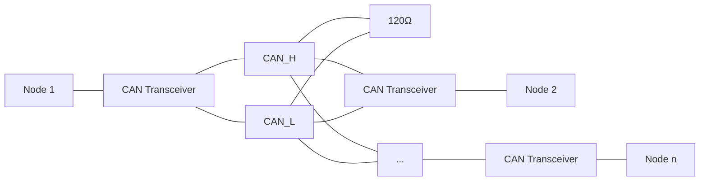
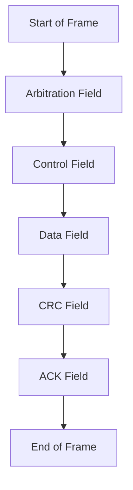

# STM32 CAN Basics

## Introduction

Controller Area Network (CAN) is a robust communication protocol initially designed for automotive applications but now widely used in industrial automation, medical equipment, and many other fields. CAN provides reliable, real-time communication with excellent error detection and fault confinement capabilities.

This tutorial introduces CAN communication using STM32 microcontrollers. You'll learn about the CAN protocol fundamentals, how to configure the STM32's bxCAN peripheral, and how to send and receive messages in your applications.

## What is CAN?

CAN is a multi-master, message-based broadcast protocol that allows microcontrollers and devices to communicate without a host computer. Key features include:

- **Differential signaling** on a twisted pair bus for noise immunity
- **Message-based** communication rather than address-based
- **Multi-master** architecture where any node can initiate transmission
- **Priority-based** bus arbitration using message identifiers
- **Robust error detection** and fault confinement mechanisms
- **Data rates** up to 1 Mbps (standard CAN)

## CAN Bus Physical Layer

The CAN bus consists of two wires: CAN_H (high) and CAN_L (low), which carry differential signals. The bus requires termination resistors (typically 120Ω) at each end to prevent signal reflections.



## CAN Message Structure

A standard CAN message frame contains:

1. **Start of Frame (SOF)** - Single dominant bit marking the start
2. **Arbitration Field** - Contains message identifier (11-bit or 29-bit) and RTR bit
3. **Control Field** - Contains IDE, reserved bit, and Data Length Code (DLC)
4. **Data Field** - 0 to 8 bytes of data
5. **CRC Field** - 15-bit cyclic redundancy check for error detection
6. **ACK Field** - Acknowledgment from receiving nodes
7. **End of Frame (EOF)** - 7 recessive bits



## STM32 CAN Hardware

Most STM32 microcontrollers feature the bxCAN (basic extended CAN) peripheral. STM32F1, F4, and many other series include at least one CAN interface.

### Hardware Requirements

To work with CAN on STM32, you'll need:

1. An STM32 microcontroller with CAN peripheral
2. CAN transceiver (e.g., MCP2551, SN65HVD230)
3. Proper wiring and termination resistors
4. Another CAN device to communicate with

### Pinout Example

For an STM32F4 device, a typical CAN setup might use:
- PA11 for CAN_RX
- PA12 for CAN_TX

These pins connect to a CAN transceiver, which then connects to the actual CAN bus.

## Setting Up STM32 CAN

We'll walk through the steps to configure CAN communication on an STM32 microcontroller.

### 1. Enable Clock for CAN Peripheral

First, enable the clock for the CAN peripheral and GPIO pins:

```c
// Enable clock for GPIOA
RCC->AHB1ENR |= RCC_AHB1ENR_GPIOAEN;
  
// Enable clock for CAN1
RCC->APB1ENR |= RCC_APB1ENR_CAN1EN;
```

### 2. Configure GPIO Pins

Configure the RX and TX pins with the correct alternate function:

```c
// Configure PA11 (CAN_RX) and PA12 (CAN_TX)
// Set alternate function mode
GPIOA->MODER &= ~(GPIO_MODER_MODER11 | GPIO_MODER_MODER12);
GPIOA->MODER |= (GPIO_MODER_MODER11_1 | GPIO_MODER_MODER12_1);
  
// Set alternate function as CAN
GPIOA->AFR[1] &= ~(GPIO_AFRH_AFSEL11 | GPIO_AFRH_AFSEL12);
GPIOA->AFR[1] |= (9 << GPIO_AFRH_AFSEL11_Pos) | (9 << GPIO_AFRH_AFSEL12_Pos);  // AF9 for CAN
  
// Set to push-pull output
GPIOA->OTYPER &= ~(GPIO_OTYPER_OT11 | GPIO_OTYPER_OT12);
  
// Set high speed
GPIOA->OSPEEDR |= (GPIO_OSPEEDR_OSPEED11 | GPIO_OSPEEDR_OSPEED12);
  
// Enable pull-up
GPIOA->PUPDR &= ~(GPIO_PUPDR_PUPD11 | GPIO_PUPDR_PUPD12);
GPIOA->PUPDR |= (GPIO_PUPDR_PUPD11_0 | GPIO_PUPDR_PUPD12_0);
```

### 3. Initialize CAN Peripheral

Now initialize the CAN peripheral:

```c
// Enter initialization mode
CAN1->MCR |= CAN_MCR_INRQ;
while ((CAN1->MSR & CAN_MSR_INAK) == 0); // Wait for initialization mode
  
// Configure CAN: set time triggered communication mode
CAN1->MCR |= CAN_MCR_TTCM;
  
// Set automatic bus-off management
CAN1->MCR |= CAN_MCR_ABOM;
  
// Set automatic wakeup mode
CAN1->MCR |= CAN_MCR_AWUM;
  
// Set no automatic retransmission
CAN1->MCR &= ~CAN_MCR_NART;
  
// Set receive FIFO locked mode
CAN1->MCR &= ~CAN_MCR_RFLM;
  
// Set transmit FIFO priority
CAN1->MCR &= ~CAN_MCR_TXFP;
```

### 4. Configure CAN Bit Timing

Set up the bit timing for the desired baud rate. For example, for a 1Mbps rate with an 8MHz clock:

```c
// Exit from sleep mode
CAN1->MCR &= ~CAN_MCR_SLEEP;
  
// Configure bit timing
// For 1Mbps with 8MHz clock:
// Prescaler = 1, BS1 = 3, BS2 = 2, SJW = 1
CAN1->BTR = 0;
CAN1->BTR |= (0 << CAN_BTR_BRP_Pos);  // Prescaler = 1
CAN1->BTR |= (2 << CAN_BTR_TS1_Pos);  // BS1 = 3 time quanta
CAN1->BTR |= (1 << CAN_BTR_TS2_Pos);  // BS2 = 2 time quanta
CAN1->BTR |= (0 << CAN_BTR_SJW_Pos);  // SJW = 1 time quantum
```

### 5. Configure Filters

Set up a filter to determine which messages the CAN peripheral receives:

```c
// Enter filter initialization mode
CAN1->FMR |= CAN_FMR_FINIT;
  
// Configure filter 0
// In this example, we accept all messages
CAN1->FA1R |= CAN_FA1R_FACT0;  // Activate filter 0
CAN1->FS1R |= CAN_FS1R_FSC0;   // Set filter to 32-bit scale configuration
CAN1->FM1R &= ~CAN_FM1R_FBM0;  // Set filter to mask mode
  
// Set filter to accept all messages
CAN1->sFilterRegister[0].FR1 = 0;  // Filter bits
CAN1->sFilterRegister[0].FR2 = 0;  // Mask bits
  
// Assign filter to FIFO 0
CAN1->FFA1R &= ~CAN_FFA1R_FFA0;
  
// Exit filter initialization mode
CAN1->FMR &= ~CAN_FMR_FINIT;
```

### 6. Exit Initialization Mode

Finally, exit initialization mode to start CAN operations:

```c
// Request normal mode
CAN1->MCR &= ~CAN_MCR_INRQ;
  
// Wait for normal mode
while (CAN1->MSR & CAN_MSR_INAK);
```

## Sending a CAN Message

Now let's see how to send a CAN message:

```c
uint8_t can_send_message(uint32_t id, uint8_t *data, uint8_t length) {
    uint8_t mailbox;
    uint32_t timeout = 0;
    
    // Check if any transmit mailbox is empty
    if ((CAN1->TSR & CAN_TSR_TME) == 0) {
        return 0; // No mailbox available
    }
    
    // Select an empty mailbox
    mailbox = (CAN1->TSR & CAN_TSR_CODE) >> 24;
    
    // Set the ID
    CAN1->sTxMailBox[mailbox].TIR = 0;
    CAN1->sTxMailBox[mailbox].TIR |= (id << 21); // Standard ID
    CAN1->sTxMailBox[mailbox].TIR &= ~CAN_TI0R_RTR; // Data frame
    
    // Set the data length
    CAN1->sTxMailBox[mailbox].TDTR &= ~CAN_TDT0R_DLC;
    CAN1->sTxMailBox[mailbox].TDTR |= (length & 0x0F);
    
    // Set the data
    CAN1->sTxMailBox[mailbox].TDLR = 
        (data[0] << 0) | 
        (data[1] << 8) | 
        (data[2] << 16) | 
        (data[3] << 24);
    
    CAN1->sTxMailBox[mailbox].TDHR = 
        (data[4] << 0) | 
        (data[5] << 8) | 
        (data[6] << 16) | 
        (data[7] << 24);
    
    // Request transmission
    CAN1->sTxMailBox[mailbox].TIR |= CAN_TI0R_TXRQ;
    
    // Wait for mailbox to become empty
    while ((CAN1->TSR & (CAN_TSR_TME0 << mailbox)) == 0) {
        timeout++;
        if (timeout > 1000000) {
            return 0; // Timeout
        }
    }
    
    return 1; // Success
}
```

### Example Usage of Transmission Function

```c
uint8_t data[8] = {0x01, 0x02, 0x03, 0x04, 0x05, 0x06, 0x07, 0x08};
uint32_t id = 0x123; // Message ID
uint8_t length = 8;  // Data length
  
can_send_message(id, data, length);
```

## Receiving a CAN Message

To receive CAN messages, we need to check FIFO message pending and read the data:

```c
uint8_t can_receive_message(uint32_t *id, uint8_t *data, uint8_t *length) {
    // Check if FIFO 0 has messages
    if ((CAN1->RF0R & CAN_RF0R_FMP0) == 0) {
        return 0; // No messages
    }
    
    // Get the ID
    *id = (CAN1->sFIFOMailBox[0].RIR >> 21);
    
    // Get the data length
    *length = (CAN1->sFIFOMailBox[0].RDTR & CAN_RDT0R_DLC);
    
    // Get the data
    data[0] = (CAN1->sFIFOMailBox[0].RDLR >> 0) & 0xFF;
    data[1] = (CAN1->sFIFOMailBox[0].RDLR >> 8) & 0xFF;
    data[2] = (CAN1->sFIFOMailBox[0].RDLR >> 16) & 0xFF;
    data[3] = (CAN1->sFIFOMailBox[0].RDLR >> 24) & 0xFF;
    data[4] = (CAN1->sFIFOMailBox[0].RDHR >> 0) & 0xFF;
    data[5] = (CAN1->sFIFOMailBox[0].RDHR >> 8) & 0xFF;
    data[6] = (CAN1->sFIFOMailBox[0].RDHR >> 16) & 0xFF;
    data[7] = (CAN1->sFIFOMailBox[0].RDHR >> 24) & 0xFF;
    
    // Release the mailbox
    CAN1->RF0R |= CAN_RF0R_RFOM0;
    
    return 1; // Success
}
```

### Example Usage of Reception Function

```c
uint8_t data[8];
uint32_t id;
uint8_t length;
  
// Check if a message is received
if (can_receive_message(&id, data, &length)) {
    // Process the received message
    printf("Received CAN message: ID=0x%x, Length=%d
", (unsigned int)id, length);
    printf("Data: ");
    for (int i = 0; i < length; i++) {
        printf("0x%02X ", data[i]);
    }
    printf("
");
}
```

## Configuring CAN Interrupts

For more efficient CAN communication, you can use interrupts instead of polling:

```c
void can_enable_interrupts(void) {
    // Enable interrupts for received messages in FIFO 0
    CAN1->IER |= CAN_IER_FMPIE0;
    
    // Enable NVIC interrupt for CAN1
    NVIC_EnableIRQ(CAN1_RX0_IRQn);
    NVIC_SetPriority(CAN1_RX0_IRQn, 5);
}
```

And here's how to handle the interrupt:

```c
void CAN1_RX0_IRQHandler(void) {
    uint8_t data[8];
    uint32_t id;
    uint8_t length;
    
    if (can_receive_message(&id, data, &length)) {
        // Process received message
        // Your message handling code here
    }
}
```

## Complete Example: CAN Echo Node

Here's a complete example that initializes CAN and echoes back any message it receives:

```c
#include "stm32f4xx.h"
#include <stdio.h>

void system_clock_config(void);
void can_init(void);
uint8_t can_send_message(uint32_t id, uint8_t *data, uint8_t length);
uint8_t can_receive_message(uint32_t *id, uint8_t *data, uint8_t *length);

int main(void) {
    // Initialize system
    system_clock_config();
    
    // Initialize CAN
    can_init();
    
    uint8_t data[8];
    uint32_t id;
    uint8_t length;
    
    while (1) {
        // Check if a message is received
        if (can_receive_message(&id, data, &length)) {
            // Echo the message back
            can_send_message(id, data, length);
        }
    }
}

void can_init(void) {
    // Enable clocks
    RCC->AHB1ENR |= RCC_AHB1ENR_GPIOAEN;
    RCC->APB1ENR |= RCC_APB1ENR_CAN1EN;
    
    // Configure GPIO pins
    GPIOA->MODER &= ~(GPIO_MODER_MODER11 | GPIO_MODER_MODER12);
    GPIOA->MODER |= (GPIO_MODER_MODER11_1 | GPIO_MODER_MODER12_1);
    
    GPIOA->AFR[1] &= ~(GPIO_AFRH_AFSEL11 | GPIO_AFRH_AFSEL12);
    GPIOA->AFR[1] |= (9 << GPIO_AFRH_AFSEL11_Pos) | (9 << GPIO_AFRH_AFSEL12_Pos);
    
    GPIOA->OTYPER &= ~(GPIO_OTYPER_OT11 | GPIO_OTYPER_OT12);
    GPIOA->OSPEEDR |= (GPIO_OSPEEDR_OSPEED11 | GPIO_OSPEEDR_OSPEED12);
    GPIOA->PUPDR &= ~(GPIO_PUPDR_PUPD11 | GPIO_PUPDR_PUPD12);
    GPIOA->PUPDR |= (GPIO_PUPDR_PUPD11_0 | GPIO_PUPDR_PUPD12_0);
    
    // Enter initialization mode
    CAN1->MCR |= CAN_MCR_INRQ;
    while ((CAN1->MSR & CAN_MSR_INAK) == 0);
    
    // Configure CAN
    CAN1->MCR &= ~CAN_MCR_SLEEP;
    CAN1->MCR |= CAN_MCR_ABOM | CAN_MCR_AWUM;
    CAN1->MCR &= ~CAN_MCR_NART;
    CAN1->MCR &= ~CAN_MCR_RFLM;
    CAN1->MCR &= ~CAN_MCR_TXFP;
    
    // 1Mbps with 8MHz clock
    CAN1->BTR = 0;
    CAN1->BTR |= (0 << CAN_BTR_BRP_Pos);  // Prescaler = 1
    CAN1->BTR |= (2 << CAN_BTR_TS1_Pos);  // BS1 = 3 time quanta
    CAN1->BTR |= (1 << CAN_BTR_TS2_Pos);  // BS2 = 2 time quanta
    CAN1->BTR |= (0 << CAN_BTR_SJW_Pos);  // SJW = 1 time quantum
    
    // Configure filters
    CAN1->FMR |= CAN_FMR_FINIT;
    CAN1->FA1R |= CAN_FA1R_FACT0;
    CAN1->FS1R |= CAN_FS1R_FSC0;
    CAN1->FM1R &= ~CAN_FM1R_FBM0;
    CAN1->sFilterRegister[0].FR1 = 0;
    CAN1->sFilterRegister[0].FR2 = 0;
    CAN1->FFA1R &= ~CAN_FFA1R_FFA0;
    CAN1->FMR &= ~CAN_FMR_FINIT;
    
    // Exit initialization mode
    CAN1->MCR &= ~CAN_MCR_INRQ;
    while (CAN1->MSR & CAN_MSR_INAK);
}

uint8_t can_send_message(uint32_t id, uint8_t *data, uint8_t length) {
    uint8_t mailbox;
    uint32_t timeout = 0;
    
    if ((CAN1->TSR & CAN_TSR_TME) == 0) {
        return 0;
    }
    
    mailbox = (CAN1->TSR & CAN_TSR_CODE) >> 24;
    
    CAN1->sTxMailBox[mailbox].TIR = 0;
    CAN1->sTxMailBox[mailbox].TIR |= (id << 21);
    CAN1->sTxMailBox[mailbox].TIR &= ~CAN_TI0R_RTR;
    
    CAN1->sTxMailBox[mailbox].TDTR &= ~CAN_TDT0R_DLC;
    CAN1->sTxMailBox[mailbox].TDTR |= (length & 0x0F);
    
    CAN1->sTxMailBox[mailbox].TDLR = 
        (data[0] << 0) | 
        (data[1] << 8) | 
        (data[2] << 16) | 
        (data[3] << 24);
    
    CAN1->sTxMailBox[mailbox].TDHR = 
        (data[4] << 0) | 
        (data[5] << 8) | 
        (data[6] << 16) | 
        (data[7] << 24);
    
    CAN1->sTxMailBox[mailbox].TIR |= CAN_TI0R_TXRQ;
    
    while ((CAN1->TSR & (CAN_TSR_TME0 << mailbox)) == 0) {
        timeout++;
        if (timeout > 1000000) {
            return 0;
        }
    }
    
    return 1;
}

uint8_t can_receive_message(uint32_t *id, uint8_t *data, uint8_t *length) {
    if ((CAN1->RF0R & CAN_RF0R_FMP0) == 0) {
        return 0;
    }
    
    *id = (CAN1->sFIFOMailBox[0].RIR >> 21);
    *length = (CAN1->sFIFOMailBox[0].RDTR & CAN_RDT0R_DLC);
    
    data[0] = (CAN1->sFIFOMailBox[0].RDLR >> 0) & 0xFF;
    data[1] = (CAN1->sFIFOMailBox[0].RDLR >> 8) & 0xFF;
    data[2] = (CAN1->sFIFOMailBox[0].RDLR >> 16) & 0xFF;
    data[3] = (CAN1->sFIFOMailBox[0].RDLR >> 24) & 0xFF;
    data[4] = (CAN1->sFIFOMailBox[0].RDHR >> 0) & 0xFF;
    data[5] = (CAN1->sFIFOMailBox[0].RDHR >> 8) & 0xFF;
    data[6] = (CAN1->sFIFOMailBox[0].RDHR >> 16) & 0xFF;
    data[7] = (CAN1->sFIFOMailBox[0].RDHR >> 24) & 0xFF;
    
    CAN1->RF0R |= CAN_RF0R_RFOM0;
    
    return 1;
}

// System clock configuration function would be here
```

## Real-World Applications

### Automotive Systems

CAN is extensively used in automotive systems for functions like:

- Engine control modules (ECMs)
- Anti-lock braking systems (ABS)
- Airbag systems
- Dashboard instrumentation
- Climate control

### Industrial Automation

In industrial applications, CAN is used for:

- Robotic systems
- PLC communication
- Sensor networks
- Motion control systems

### Example: OBD-II Car Diagnostics

Here's how to request engine RPM using OBD-II over CAN:

```c
// Request engine RPM (PID 0x0C)
uint8_t request_rpm(void) {
    uint8_t data[8] = {0x02, 0x01, 0x0C, 0x00, 0x00, 0x00, 0x00, 0x00};
    uint32_t id = 0x7DF;  // OBD-II request ID
    return can_send_message(id, data, 8);
}

// Process response
uint16_t process_rpm_response(uint8_t *data) {
    if (data[1] == 0x41 && data[2] == 0x0C) {
        uint16_t rpm = ((uint16_t)data[3] << 8) | data[4];
        return rpm / 4;  // RPM = ((A * 256) + B) / 4
    }
    return 0;
}
```

## Advanced Topics

### Extended Identifiers

To use 29-bit extended identifiers instead of 11-bit standard IDs:

```c
// For transmission
CAN1->sTxMailBox[mailbox].TIR |= CAN_TI0R_IDE;  // Set IDE bit for extended ID
CAN1->sTxMailBox[mailbox].TIR |= (id << 3);     // Extended ID is shifted differently

// For reception filter
CAN1->sFilterRegister[0].FR1 = (id << 3) | CAN_RI0R_IDE;
```

### Remote Transmission Requests (RTR)

To send a remote request frame:

```c
// Set RTR bit
CAN1->sTxMailBox[mailbox].TIR |= CAN_TI0R_RTR;
```

### Error Handling

Monitoring and handling CAN errors:

```c
void check_can_errors(void) {
    uint32_t esr = CAN1->ESR;
    
    // Check for errors
    if (esr & CAN_ESR_BOFF) {
        printf("CAN Bus-Off error
");
    }
    
    if (esr & CAN_ESR_EPVF) {
        printf("CAN Error Passive
");
    }
    
    if (esr & CAN_ESR_EWGF) {
        printf("CAN Error Warning
");
    }
    
    // Read error counters
    uint8_t tx_errors = (esr & CAN_ESR_TEC) >> 16;
    uint8_t rx_errors = (esr & CAN_ESR_REC) >> 24;
    
    printf("TX Errors: %d, RX Errors: %d
", tx_errors, rx_errors);
}
```

## Troubleshooting Tips

When working with CAN, common issues include:

1. **No Communication**
   - Check termination resistors (120Ω at each end)
   - Verify CAN transceiver connections
   - Confirm baud rate settings match on all nodes

2. **Intermittent Communication**
   - Check for proper grounding between nodes
   - Look for noise sources near the CAN bus
   - Verify signal integrity with an oscilloscope

3. **Bus-Off Errors**
   - Check for short circuits or physical layer issues
   - Reduce bus loading or lower the bit rate
   - Ensure correct bit timing parameters for your clock

## Summary

CAN is a robust communication protocol well-suited for embedded systems that require reliable, deterministic messaging. With STM32 microcontrollers, you can easily implement CAN communication for a wide range of applications.

Key points covered in this tutorial:
- CAN protocol basics and message structure
- STM32 CAN peripheral initialization
- Sending and receiving CAN messages
- Interrupt-based CAN handling
- Error detection and management
- Real-world applications

## Additional Resources

To continue learning about CAN with STM32:

1. ST's application notes:
   - AN4230: CAN protocol used in the STM32 MCUs
   - AN3997: STM32 microcontroller CAN peripheral optimization

2. Reference manuals:
   - STM32F4xx Reference Manual, section on bxCAN

3. Recommended exercises:
   - Create a multi-node CAN network with different STM32 boards
   - Implement a CAN protocol stack for a specific application
   - Build an OBD-II reader using STM32 and CAN
   - Design a fault-tolerant CAN application with error handling

## Next Steps

Now that you understand CAN basics on STM32, you might want to explore:
- CAN FD (Flexible Data-rate) on newer STM32 models
- Advanced filtering techniques for high-traffic CAN networks
- Implementing higher-level protocols like CANopen or J1939
- Using STM32CubeMX for graphical CAN configuration