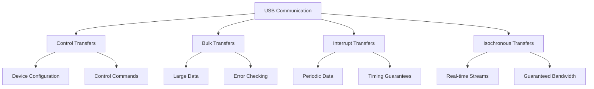

# STM32 USB Basics

Universal Serial Bus (USB) is one of the most widely used communication interfaces in modern electronics. STM32 microcontrollers offer robust USB capabilities that allow your embedded projects to communicate with computers, smartphones, and other devices. This guide will introduce you to the fundamentals of implementing USB communication on STM32 microcontrollers.

## Introduction to USB

USB (Universal Serial Bus) is a standardized interface that enables communication between devices and a host controller. Before diving into STM32-specific implementations, let's understand some key USB concepts:

### USB Terminology

- **Host**: The device that initiates and controls the communication (typically a computer)
- **Device**: The peripheral that responds to the host's requests (your STM32 microcontroller)
- **Endpoint**: A buffer in the USB device where data is stored before being transferred
- **Interface**: A collection of related endpoints that together provide a function
- **Configuration**: A specific operating mode of the device that defines power requirements and interfaces

### USB Transfer Types

USB supports four types of data transfers, each suited for different applications:

1. **Control Transfers**: Used for device configuration and control commands
2. **Bulk Transfers**: High-speed, error-checked data transfer with no guaranteed timing
3. **Interrupt Transfers**: Periodic, small data transfers with timing guarantees
4. **Isochronous Transfers**: Real-time data streams with guaranteed bandwidth but no error correction



## STM32 USB Hardware

STM32 microcontrollers offer different USB peripheral options:

### USB Peripheral Types in STM32

1. **USB Device (USB_D)**: Implements USB device functionality only
2. **USB On-The-Go (USB_OTG)**: Can function as either a host or a device
3. **USB High-Speed (USB_OTG_HS)**: Supports high-speed (480 Mbps) operation
4. **USB Full-Speed (USB_OTG_FS)**: Supports full-speed (12 Mbps) operation

Not all STM32 microcontrollers include USB peripherals. When selecting an STM32 for USB applications, ensure it has the appropriate USB hardware for your needs.

## Setting Up USB on STM32

There are three main approaches to implementing USB on STM32 microcontrollers:

1. Using STM32CubeMX and the HAL library
2. Using ST's USB middleware libraries
3. Directly programming the USB peripheral registers

For beginners, the first two options are recommended as they abstract many of the complex details.

### Using STM32CubeMX for USB Configuration

STM32CubeMX is a graphical tool that simplifies peripheral configuration, including USB. Here's how to set up a basic USB device:

1. Create a new STM32CubeMX project and select your microcontroller
2. In the Connectivity section, configure the USB peripheral
3. Select the device class (CDC, HID, MSC, etc.)
4. Configure the pins and clock settings
5. Generate the project code

### USB Device Classes

STM32 supports various USB device classes, including:

- **CDC (Communication Device Class)**: Creates a virtual COM port
- **HID (Human Interface Device)**: Used for keyboards, mice, and other input devices
- **MSC (Mass Storage Class)**: Allows the STM32 to function as a USB drive
- **Custom Class**: Implements user-defined functionality

## Implementing a Simple CDC Device (Virtual COM Port)

The CDC class is one of the easiest to implement and allows your STM32 to communicate with a computer as a virtual serial port.

### Required Components

- STM32 microcontroller with USB capability
- USB cable
- Development board or custom hardware with USB connector
- STM32CubeIDE or your preferred development environment

### Step 1: Configure the Project in STM32CubeMX

```c
// Note: This is not actual code to run, but configuration steps in CubeMX
// 1. Select "USB_OTG_FS" or "USB" in peripherals list
// 2. Set "Mode" to "Device Only"
// 3. Select "Communication Device Class (Virtual COM Port)"
// 4. Configure USB clock to 48MHz
```

### Step 2: Generate and Open the Project

After generating the project, open it in your IDE. You'll notice several USB-related files in the Middlewares directory.

### Step 3: Implement the USB Communication

```c
/* USER CODE BEGIN Includes */
#include "usbd_cdc_if.h"
/* USER CODE END Includes */

/* USER CODE BEGIN PV */
uint8_t buffer[64];
/* USER CODE END PV */

/* USER CODE BEGIN 2 */
// Initialize the USB device
MX_USB_DEVICE_Init();
/* USER CODE END 2 */

/* USER CODE BEGIN 3 */
// Send data over USB
uint8_t message[] = "Hello from STM32!\r
";
CDC_Transmit_FS(message, sizeof(message) - 1);

// To receive data, implement the CDC_Receive_FS callback in usbd_cdc_if.c
/* USER CODE END 3 */
```

### Step 4: Implement the Reception Callback

Open the `usbd_cdc_if.c` file and locate the `CDC_Receive_FS` function:

```c
static int8_t CDC_Receive_FS(uint8_t* Buf, uint32_t *Len)
{
  /* USER CODE BEGIN 6 */
  // Copy received data to our buffer
  memcpy(buffer, Buf, *Len);
  
  // Process the received data
  // For example, echo back the received data
  CDC_Transmit_FS(buffer, *Len);
  
  USBD_CDC_SetRxBuffer(&hUsbDeviceFS, &Buf[0]);
  USBD_CDC_ReceivePacket(&hUsbDeviceFS);
  return (USBD_OK);
  /* USER CODE END 6 */
}
```

## Practical Example: USB Data Logger

Let's implement a simple data logger that reads sensor values and sends them to a computer via USB.

### Hardware Setup

- STM32 microcontroller (e.g., STM32F4 Discovery board)
- Analog sensor connected to an ADC pin
- USB connection to a computer

### Implementation

```c
/* Includes */
#include "main.h"
#include "usbd_cdc_if.h"
#include <stdio.h>

/* Private variables */
ADC_HandleTypeDef hadc1;
uint16_t adcValue;
char usbBuffer[64];

/* Main function */
int main(void)
{
  /* MCU Configuration */
  HAL_Init();
  SystemClock_Config();
  
  /* Initialize peripherals */
  MX_GPIO_Init();
  MX_ADC1_Init();
  MX_USB_DEVICE_Init();
  
  /* Infinite loop */
  while (1)
  {
    /* Read sensor value */
    HAL_ADC_Start(&hadc1);
    HAL_ADC_PollForConversion(&hadc1, 100);
    adcValue = HAL_ADC_GetValue(&hadc1);
    
    /* Format data and send over USB */
    sprintf(usbBuffer, "Sensor value: %d\r
", adcValue);
    CDC_Transmit_FS((uint8_t*)usbBuffer, strlen(usbBuffer));
    
    /* Wait before next reading */
    HAL_Delay(1000);
  }
}
```

### Computer-Side Script (Python)

To receive and display the data on your computer:

```python
import serial
import time

# Open the serial port
ser = serial.Serial('COM3', 115200)  # Replace COM3 with your port

try:
    while True:
        # Read data from the STM32
        if ser.in_waiting > 0:
            line = ser.readline().decode('utf-8').strip()
            print(line)
        time.sleep(0.1)
except KeyboardInterrupt:
    ser.close()
    print("Serial port closed")
```

## USB HID Example: Simple Keyboard

Human Interface Device (HID) class is used for input devices like keyboards and mice. Here's how to implement a simple keyboard:

### STM32CubeMX Configuration

Configure the USB peripheral for HID operation:

```c
// Note: This is not actual code to run, but configuration steps in CubeMX
// 1. Select "USB_OTG_FS" or "USB" in peripherals list
// 2. Set "Mode" to "Device Only"
// 3. Select "Human Interface Device Class (HID)"
// 4. Configure for Keyboard in the HID settings
```

### Implementation

```c
/* Includes */
#include "main.h"
#include "usbd_hid.h"
extern USBD_HandleTypeDef hUsbDeviceFS;

/* Key press structure for standard HID keyboard */
typedef struct {
  uint8_t modifier;  // Ctrl, Shift, Alt, etc.
  uint8_t reserved;  // Reserved byte
  uint8_t keycode[6]; // Up to 6 keys pressed simultaneously
} KeyboardHID_t;

KeyboardHID_t keyboardHID = {0};

/* Function to send a single key press and release */
void SendKey(uint8_t key)
{
  /* Press key */
  keyboardHID.keycode[0] = key;
  USBD_HID_SendReport(&hUsbDeviceFS, (uint8_t*)&keyboardHID, sizeof(KeyboardHID_t));
  HAL_Delay(50);
  
  /* Release key */
  keyboardHID.keycode[0] = 0;
  USBD_HID_SendReport(&hUsbDeviceFS, (uint8_t*)&keyboardHID, sizeof(KeyboardHID_t));
  HAL_Delay(50);
}

/* Main function */
int main(void)
{
  /* MCU Configuration */
  HAL_Init();
  SystemClock_Config();
  
  /* Initialize peripherals */
  MX_GPIO_Init();
  MX_USB_DEVICE_Init();
  
  /* Wait for USB to initialize */
  HAL_Delay(1000);
  
  /* Infinite loop */
  while (1)
  {
    /* Check if button is pressed (e.g., on a GPIO) */
    if (HAL_GPIO_ReadPin(BUTTON_GPIO_Port, BUTTON_Pin) == GPIO_PIN_RESET)
    {
      /* Send 'H' key (0x0B in HID keyboard codes) */
      SendKey(0x0B);
      
      /* Wait for button release */
      while (HAL_GPIO_ReadPin(BUTTON_GPIO_Port, BUTTON_Pin) == GPIO_PIN_RESET);
      HAL_Delay(100); // Debounce
    }
  }
}
```

## USB Mass Storage Class (MSC) Implementation

The MSC class allows your STM32 to appear as a USB drive when connected to a computer.

### Prerequisites

- STM32 with USB support
- Storage medium (internal flash or external memory like an SD card)

### Basic Implementation Steps

1. Configure USB for MSC operation in STM32CubeMX
2. Implement the storage medium interface functions
3. Create a basic file system (FAT32 is common)

```c
// FATFS configuration to work with USB MSC
FATFS USBDISKFatFs;
FIL MyFile;
char USBDISKPath[4];

int main(void)
{
  /* MCU Configuration */
  HAL_Init();
  SystemClock_Config();
  
  /* Initialize peripherals */
  MX_GPIO_Init();
  MX_USB_DEVICE_Init();
  
  /* Mount the USB disk */
  FATFS_LinkDriver(&USBH_Driver, USBDISKPath);
  f_mount(&USBDISKFatFs, (TCHAR const*)USBDISKPath, 0);
  
  /* Create and write to a file */
  if (f_open(&MyFile, "STM32_USB_TEST.txt", FA_CREATE_ALWAYS | FA_WRITE) == FR_OK)
  {
    char testString[] = "STM32 USB MSC Test";
    UINT bytesWritten;
    f_write(&MyFile, testString, strlen(testString), &bytesWritten);
    f_close(&MyFile);
  }
  
  /* Infinite loop */
  while (1)
  {
    // Your application code here
    HAL_Delay(100);
  }
}
```

## Common USB Issues and Troubleshooting

When working with STM32 USB implementations, you might encounter these common issues:

### 1. Device Not Recognized

**Possible causes:**
- Incorrect USB clock configuration (must be 48MHz)
- Missing pull-up resistor on D+ line
- Power issues

**Solutions:**
- Verify the clock configuration in STM32CubeMX
- Check hardware connections
- Ensure adequate power supply

### 2. Communication Errors

**Possible causes:**
- Buffer overflow/underflow
- Timing issues
- Incorrect endpoint configuration

**Solutions:**
- Properly size your buffers
- Implement proper flow control
- Verify endpoint configurations

### 3. Driver Issues

**Possible causes:**
- Missing or incorrect drivers
- USB descriptors not matching driver expectations

**Solutions:**
- For CDC devices, ensure proper COM port drivers are installed
- Verify USB descriptors match the intended device class

## Advanced Topics

Once you're comfortable with basic USB implementation, consider exploring these advanced topics:

### USB On-The-Go (OTG)

Some STM32 devices support USB OTG, allowing them to act as either a host or a device:

```c
// Configuration for host mode
MX_USB_HOST_Init();

// Detect device connection
if (USBH_IsDeviceConnected(&hUsbHostFS))
{
  // Device is connected, process accordingly
}
```

### Custom USB Class

Creating a custom USB class allows for specialized communication protocols:

1. Define custom descriptors
2. Implement custom data handling
3. Develop custom host-side drivers

### USB DMA

For high-throughput applications, configure DMA for USB transfers:

```c
// Enable DMA in USB configuration
// In CubeMX: USB > Parameter Settings > Enable DMA
```

## Summary

STM32 microcontrollers provide versatile USB capabilities for embedded applications. In this guide, we covered:

- Basic USB concepts and terminology
- Different USB device classes (CDC, HID, MSC)
- Implementing USB communication using STM32CubeMX and HAL
- Practical examples for different use cases
- Common issues and troubleshooting tips

USB connectivity opens up numerous possibilities for your STM32 projects, allowing them to interface seamlessly with computers and other devices.

## Additional Resources

For further learning, consider these resources:

- ST Microelectronics USB documentation and application notes
- STM32CubeF4/F7/etc. USB examples in the firmware package
- USB.org specifications for detailed protocol information

## Exercises

To reinforce your understanding:

1. Modify the CDC example to implement a command interpreter that responds to text commands
2. Create an HID mouse that uses an accelerometer to control the cursor
3. Implement a USB device that combines multiple classes (e.g., CDC + MSC)
4. Build a USB data acquisition system that samples multiple sensors and streams the data to a computer
5. Create a custom USB class for a specialized application