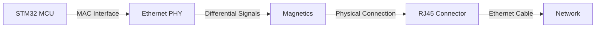
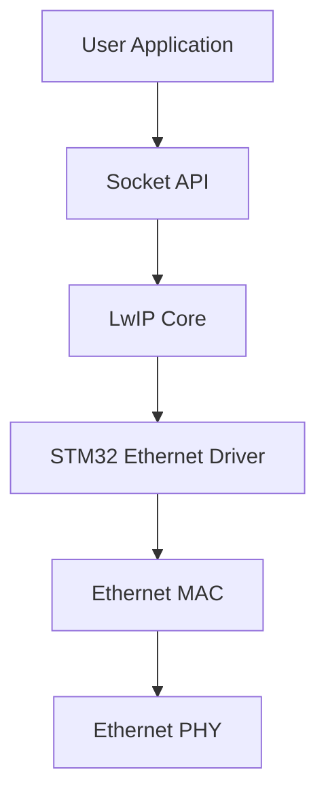

# STM32 Ethernet Basics

## Introduction

Ethernet is one of the most widely used communication technologies for connecting devices to networks and the internet. STM32 microcontrollers with built-in Ethernet controllers allow embedded systems to communicate over local networks and connect to the internet, enabling IoT applications, remote monitoring, and data exchange with servers.

In this tutorial, we'll explore how to implement Ethernet communication on STM32 microcontrollers. We'll cover the hardware requirements, software stack, and demonstrate simple examples to get you started with network connectivity.

## Prerequisites

Before diving into Ethernet communication with STM32, you should have:

- Basic knowledge of STM32 microcontrollers
- Experience with STM32CubeIDE or similar development environments
- Understanding of basic networking concepts (IP addresses, TCP/IP, etc.)
- An STM32 board with Ethernet capability (like STM32F4Discovery with Ethernet, STM32F7, or STM32H7 series)

## Hardware Components for STM32 Ethernet

To implement Ethernet on STM32, you'll need:

1. **STM32 with Ethernet MAC** - Not all STM32 microcontrollers have Ethernet capabilities. Common series with Ethernet support include:
   - STM32F4 (some models)
   - STM32F7
   - STM32H7

2. **Ethernet PHY** - The physical layer transceiver that connects the MAC to the Ethernet cable. Some development boards have this built-in.

3. **RJ45 Connector** - The standard connector for Ethernet cables.

4. **Magnetics** - Isolation transformers to protect the circuit and filter noise.

Here's how these components connect together:



## Ethernet Protocol Stack on STM32

STM32 microcontrollers typically use LwIP (Lightweight IP) as the TCP/IP stack. This is how the software stack is organized:



## Setting Up Ethernet in STM32CubeIDE

Let's start by configuring Ethernet in STM32CubeIDE:

1. Create a new STM32 project for your board
2. In the pinout configuration:
   - Enable Ethernet MAC in "Connectivity"
   - Configure the RMII or MII interface (RMII is more common as it uses fewer pins)

3. In the clock configuration:
   - Ensure proper clock settings for Ethernet (typically needs a 25MHz or 50MHz reference clock)

4. In the network configuration:
   - Set IP address parameters or enable DHCP
   - Configure LwIP settings

Here's a sample configuration in CubeMX:

![STM32CubeMX Ethernet Configuration]

## Basic Ethernet Initialization

After generating your project, you'll need to initialize the Ethernet interface. Here's a simplified version of what happens:

```c
/* Ethernet initialization function */
static void MX_ETH_Init(void)
{
  /* USER CODE BEGIN ETH_Init 0 */

  /* USER CODE END ETH_Init 0 */

  /* USER CODE BEGIN ETH_Init 1 */

  /* USER CODE END ETH_Init 1 */
  heth.Instance = ETH;
  heth.Init.MACAddr[0] =   0x00;
  heth.Init.MACAddr[1] =   0x80;
  heth.Init.MACAddr[2] =   0xE1;
  heth.Init.MACAddr[3] =   0x00;
  heth.Init.MACAddr[4] =   0x00;
  heth.Init.MACAddr[5] =   0x00;
  heth.Init.MediaInterface = HAL_ETH_RMII_MODE;
  heth.Init.TxDesc = DMATxDscrTab;
  heth.Init.RxDesc = DMARxDscrTab;
  heth.Init.RxBuffLen = 1524;

  /* Initialize Ethernet */
  if (HAL_ETH_Init(&heth) != HAL_OK)
  {
    Error_Handler();
  }
  /* USER CODE BEGIN ETH_Init 2 */

  /* USER CODE END ETH_Init 2 */
}
```

## LwIP Initialization and Network Interface Setup

After initializing the Ethernet hardware, you need to set up the LwIP stack:

```c
/* Initialize the LwIP stack */
static void MX_LWIP_Init(void)
{
  /* IP addresses initialization */
  ip_addr_t ipaddr;
  ip_addr_t netmask;
  ip_addr_t gw;

#if LWIP_DHCP
  ip_addr_set_zero_ip4(&ipaddr);
  ip_addr_set_zero_ip4(&netmask);
  ip_addr_set_zero_ip4(&gw);
#else
  IP4_ADDR(&ipaddr, IP_ADDR0, IP_ADDR1, IP_ADDR2, IP_ADDR3);
  IP4_ADDR(&netmask, NETMASK_ADDR0, NETMASK_ADDR1, NETMASK_ADDR2, NETMASK_ADDR3);
  IP4_ADDR(&gw, GW_ADDR0, GW_ADDR1, GW_ADDR2, GW_ADDR3);
#endif

  /* Initiate the network interface */
  netif_add(&gnetif, &ipaddr, &netmask, &gw, NULL, &ethernetif_init, &tcpip_input);

  /* Register the default network interface */
  netif_set_default(&gnetif);

  if (netif_is_link_up(&gnetif))
  {
    /* When the netif is fully configured this function must be called */
    netif_set_up(&gnetif);
  }
  else
  {
    /* When the netif link is down this function must be called */
    netif_set_down(&gnetif);
  }

#if LWIP_DHCP
  /* Start DHCP client */
  dhcp_start(&gnetif);
#endif
}
```

## Practical Example: Creating a Simple Web Server

Let's create a simple web server that responds with a basic HTML page:

```c
/* Headers for HTTP server */
#include "lwip/opt.h"
#include "lwip/arch.h"
#include "lwip/api.h"

/* HTML page to serve */
const static char http_html_hdr[] = "HTTP/1.1 200 OK\r
Content-type: text/html\r
\r
";
const static char http_index_html[] = "<html><head><title>STM32 Web Server</title></head><body><h1>Welcome to STM32 Web Server</h1><p>This is a simple web page served by your STM32 microcontroller.</p></body></html>";

/* HTTP server thread */
static void http_server_thread(void *arg)
{
  struct netconn *conn, *newconn;
  err_t err;
  
  /* Create a new TCP connection handle */
  conn = netconn_new(NETCONN_TCP);
  
  if (conn != NULL)
  {
    /* Bind to port 80 (HTTP) with default IP address */
    err = netconn_bind(conn, NULL, 80);
    
    if (err == ERR_OK)
    {
      /* Put the connection into LISTEN state */
      netconn_listen(conn);
      
      while(1) 
      {
        /* Accept any incoming connection */
        err = netconn_accept(conn, &newconn);
        
        if (err == ERR_OK)
        {
          struct netbuf *buf;
          void *data;
          u16_t len;
          
          while ((err = netconn_recv(newconn, &buf)) == ERR_OK) 
          {
            /* Process the HTTP request */
            do 
            {
                netbuf_data(buf, &data, &len);
                
                /* Send the HTML header and page */
                netconn_write(newconn, http_html_hdr, sizeof(http_html_hdr)-1, NETCONN_COPY);
                netconn_write(newconn, http_index_html, sizeof(http_index_html)-1, NETCONN_COPY);
                
            } while (netbuf_next(buf) >= 0);
            
            netbuf_delete(buf);
          }
          
          /* Close connection and discard connection identifier */
          netconn_close(newconn);
          netconn_delete(newconn);
        }
      }
    }
  }
}

/* Initialize web server thread */
void http_server_init(void)
{
  sys_thread_new("HTTP", http_server_thread, NULL, DEFAULT_THREAD_STACKSIZE, DEFAULT_THREAD_PRIO);
}
```

To use this web server, call `http_server_init()` in your `main.c` after the LwIP initialization:

```c
int main(void)
{
  /* MCU Configuration */
  HAL_Init();
  SystemClock_Config();
  
  /* Initialize all configured peripherals */
  MX_GPIO_Init();
  MX_ETH_Init();
  MX_USART3_UART_Init();
  
  /* Initialize LwIP */
  MX_LWIP_Init();
  
  /* Initialize and start HTTP server */
  http_server_init();
  
  /* Infinite loop */
  while (1)
  {
    /* LwIP needs time to handle its timers */
    MX_LWIP_Process();
    
    HAL_Delay(100);
  }
}
```

## Testing Your Ethernet Implementation

1. Connect your STM32 board to your local network using an Ethernet cable
2. Flash the application to your board
3. Open a terminal to monitor the board's output - you should see IP address information
4. Open a web browser on your computer and enter the IP address of your STM32 board
5. You should see the simple web page: "Welcome to STM32 Web Server"

## Practical Example: MQTT Client for IoT

For IoT applications, MQTT is a popular protocol. Here's a simple MQTT client using the MQTT module in LwIP:

```c
#include "lwip/apps/mqtt.h"

static mqtt_client_t mqtt_client;
static const struct mqtt_connect_client_info_t mqtt_client_info =
{
  "stm32-client",
  NULL, /* user */
  NULL, /* pass */
  120,  /* keep alive */
  NULL, /* will_topic */
  NULL, /* will_msg */
  0,    /* will_qos */
  0     /* will_retain */
};

static void mqtt_connection_cb(mqtt_client_t *client, void *arg, mqtt_connection_status_t status)
{
  if (status == MQTT_CONNECT_ACCEPTED) {
    printf("MQTT client connected\r
");
    
    /* Setup subscription for topic */
    mqtt_sub_unsub(client, "stm32/led", 0, mqtt_subscribe_cb, NULL, 1);
    
    /* Publish a message */
    const char *pub_payload = "Hello from STM32";
    u8_t qos = 0; /* 0 1 or 2, see MQTT specification */
    u8_t retain = 0; /* No don't retain such crappy payload... */
    mqtt_publish(client, "stm32/status", pub_payload, strlen(pub_payload), qos, retain, mqtt_pub_request_cb, NULL);
  } else {
    printf("MQTT client connection failed: %d\r
", status);
  }
}

static void mqtt_incoming_publish_cb(void *arg, const char *topic, u32_t tot_len)
{
  printf("Incoming message on topic: %s\r
", topic);
}

static void mqtt_incoming_data_cb(void *arg, const u8_t *data, u16_t len, u8_t flags)
{
  if (flags & MQTT_DATA_FLAG_LAST) {
    /* Last fragment of payload received */
    printf("Received data: %.*s\r
", len, data);
  } else {
    /* More fragments follow */
    printf("Received data fragment: %.*s\r
", len, data);
  }
}

void mqtt_client_init(void)
{
  ip_addr_t broker_ipaddr;
  IP4_ADDR(&broker_ipaddr, 192, 168, 1, 100); /* Change to your MQTT broker IP */
  
  mqtt_client_connect(&mqtt_client, &broker_ipaddr, MQTT_PORT, mqtt_connection_cb, NULL, &mqtt_client_info);
  
  /* Setup callback for incoming publish requests */
  mqtt_set_inpub_callback(&mqtt_client, mqtt_incoming_publish_cb, mqtt_incoming_data_cb, NULL);
}
```

## Troubleshooting Ethernet Issues

Here are some common issues and their solutions:

1. **No network connectivity**
   - Check physical connections (cable, RJ45 jack)
   - Verify PHY initialization
   - Ensure proper MAC address configuration
   - Check that the IP address doesn't conflict with other devices

2. **Intermittent connectivity**
   - Check for proper clock configuration
   - Ensure adequate power supply stability
   - Verify proper Ethernet cable quality (use CAT5e or better)

3. **Low performance**
   - Check DMA configuration
   - Increase buffer sizes if possible
   - Optimize LwIP settings for your application

## Common Ethernet-Related Registers

Understanding key registers helps with low-level debugging:

| Register | Description |
|----------|-------------|
| ETH_MACCR | MAC Configuration Register (controls speed, duplex mode, etc.) |
| ETH_MACMIIAR | MAC MII Address Register (for PHY communication) |
| ETH_MACMIID | MAC MII Data Register (for PHY communication) |
| ETH_DMASR | DMA Status Register (indicates transfer status) |
| ETH_DMABMR | DMA Bus Mode Register (configures DMA operation) |

## Summary

In this tutorial, we've covered the basics of implementing Ethernet communication on STM32 microcontrollers. We've explored:

1. Hardware requirements for Ethernet connectivity
2. Setting up the Ethernet interface in STM32CubeIDE
3. Initializing the LwIP stack for TCP/IP communication
4. Creating a simple web server example
5. Implementing an MQTT client for IoT applications
6. Troubleshooting common Ethernet issues

STM32's Ethernet capabilities enable your embedded devices to connect to networks and the Internet, opening up possibilities for IoT applications, remote monitoring, and data exchange with cloud services.

## Additional Resources and Exercises

### Resources

- ST's official [STM32 Ethernet documentation](https://www.st.com)
- LwIP [official documentation](https://savannah.nongnu.org/projects/lwip/)
- [Application note AN3966](https://www.st.com) - LwIP TCP/IP stack demonstration for STM32F4x7

### Exercises

1. **Basic**: Modify the web server example to display dynamic data (like sensor readings).
2. **Intermediate**: Implement a DHCP client to automatically obtain an IP address.
3. **Advanced**: Create a RESTful API that allows remote control of the STM32's peripherals.
4. **Expert**: Implement secure communication using TLS with the mbedTLS library.

Remember that networking in embedded systems requires careful consideration of memory usage and processing power. Always optimize your implementation for your specific hardware constraints and application requirements.