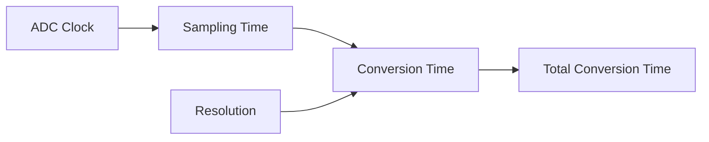

# STM32 ADC Configuration

## Introduction

The Analog-to-Digital Converter (ADC) is one of the most important peripherals in STM32 microcontrollers, serving as the bridge between the analog world and the digital domain. ADCs allow your microcontroller to read analog signals such as temperature, pressure, light intensity, or any sensor output that produces a varying voltage.

STM32 microcontrollers feature sophisticated ADC modules with numerous configuration options that might seem overwhelming at first. This guide will walk you through the process of configuring and using the ADC peripheral on STM32 microcontrollers, making it accessible even if you're new to embedded programming.

## ADC Basics on STM32

Before diving into configuration, let's understand what makes the STM32 ADC special:

- **Resolution**: STM32 ADCs typically offer 12-bit resolution (4096 levels), with options for 10, 8, or 6-bit for faster conversions
- **Multiple channels**: Sample different analog inputs without reconfiguration
- **DMA support**: Transfer conversion results without CPU intervention
- **Conversion modes**: Single, continuous, or scan mode operations
- **Triggering options**: Software or hardware triggers (timers, external pins)
- **Sampling rates**: Up to several MHz depending on the specific STM32 model

## Hardware Setup

To use an ADC channel, you must configure the corresponding GPIO pin as an analog input:

```c
// Enable GPIO clock (assuming using GPIOA)
RCC->AHB1ENR |= RCC_AHB1ENR_GPIOAEN;

// Configure PA0 as analog mode (for ADC channel 0)
GPIOA->MODER |= GPIO_MODER_MODER0;  // Set to 0b11 (analog mode)
GPIOA->PUPDR &= ~GPIO_PUPDR_PUPDR0; // No pull-up/pull-down
```

## Basic ADC Configuration

Let's walk through configuring ADC1 on an STM32F4 device step by step:

### 1. Enable Clocks

First, enable the clock for the ADC peripheral:

```c
// Enable ADC1 clock
RCC->APB2ENR |= RCC_APB2ENR_ADC1EN;
```

### 2. Configure ADC Parameters

Configure the ADC with your desired settings:

```c
// Reset ADC control registers
ADC1->CR1 = 0;
ADC1->CR2 = 0;

// Configure ADC1
// Set 12-bit resolution
ADC1->CR1 &= ~ADC_CR1_RES;

// Select right alignment
ADC1->CR2 &= ~ADC_CR2_ALIGN;

// Set single conversion mode
ADC1->CR2 &= ~ADC_CR2_CONT;

// Enable end of conversion interrupt if needed
// ADC1->CR1 |= ADC_CR1_EOCIE;

// Configure for software trigger
ADC1->CR2 |= ADC_CR2_EXTSEL_3;  // SWSTART
ADC1->CR2 |= ADC_CR2_EXTEN_0;   // Rising edge
```

### 3. Configure the Channel

Set up the ADC channel you want to use:

```c
// Configure channel 0 (connected to PA0)
// Set sampling time (longer time = more accuracy but slower)
ADC1->SMPR2 &= ~ADC_SMPR2_SMP0;  // Clear bits
ADC1->SMPR2 |= ADC_SMPR2_SMP0_1; // 28 cycles sampling time

// Set the channel in the sequence
ADC1->SQR1 &= ~ADC_SQR1_L;        // 1 conversion in the sequence
ADC1->SQR3 &= ~ADC_SQR3_SQ1;      // Clear the bits
ADC1->SQR3 |= (0 << ADC_SQR3_SQ1_Pos); // Channel 0 as first conversion
```

### 4. Enable the ADC

Turn on the ADC and wait for it to be ready:

```c
// Enable ADC
ADC1->CR2 |= ADC_CR2_ADON;

// Wait for ADC to stabilize (minimum 3 us)
for(volatile uint32_t i = 0; i < 10000; i++);
```

## Performing ADC Conversions

Now that your ADC is configured, let's see how to perform conversions:

### Single Conversion

```c
uint16_t ADC_ReadSingle(void) {
    // Start conversion
    ADC1->CR2 |= ADC_CR2_SWSTART;
    
    // Wait for conversion to complete
    while(!(ADC1->SR & ADC_SR_EOC));
    
    // Read and return the conversion result
    return (uint16_t)ADC1->DR;
}
```

### Example Usage

```c
int main(void) {
    // System initialization code...
    
    // Initialize ADC (using the configuration from above)
    
    while(1) {
        uint16_t raw_value = ADC_ReadSingle();
        
        // Convert to voltage (assuming 3.3V reference)
        float voltage = (raw_value * 3.3f) / 4095.0f;
        
        // Do something with the value...
        
        // Delay
        for(volatile uint32_t i = 0; i < 1000000; i++);
    }
}
```

## Advanced Configuration Options

### Multi-Channel Scanning

To read multiple channels in sequence:

```c
void ADC_ConfigureMultiChannel(void) {
    // Configure for scan mode (multiple channels)
    ADC1->CR1 |= ADC_CR1_SCAN;
    
    // Set the number of conversions in sequence (e.g., 3 channels)
    ADC1->SQR1 = (3-1) << ADC_SQR1_L_Pos;
    
    // Set channel sequence
    ADC1->SQR3 = (0 << ADC_SQR3_SQ1_Pos) |  // Channel 0 first
                 (1 << ADC_SQR3_SQ2_Pos) |  // Channel 1 second
                 (4 << ADC_SQR3_SQ3_Pos);   // Channel 4 third
                 
    // Configure sampling time for each channel
    ADC1->SMPR2 = (ADC_SMPR2_SMP0_1) |      // Channel 0: 28 cycles
                  (ADC_SMPR2_SMP1_2) |      // Channel 1: 56 cycles 
                  (ADC_SMPR2_SMP4_0);       // Channel 4: 15 cycles
}
```

### Using DMA with ADC

For continuous sampling without CPU intervention:

```c
void ADC_ConfigureWithDMA(uint16_t* buffer, uint16_t size) {
    // Enable DMA2 clock
    RCC->AHB1ENR |= RCC_AHB1ENR_DMA2EN;
    
    // Configure DMA2 Stream0 (used for ADC1)
    DMA2_Stream0->CR = 0;
    while(DMA2_Stream0->CR & DMA_SxCR_EN);  // Wait for DMA to disable
    
    DMA2_Stream0->PAR = (uint32_t)&ADC1->DR;  // Source: ADC data register
    DMA2_Stream0->M0AR = (uint32_t)buffer;   // Destination: our buffer
    DMA2_Stream0->NDTR = size;               // Number of data items
    
    DMA2_Stream0->CR = DMA_SxCR_CHSEL_0 |    // Channel 0
                       DMA_SxCR_MSIZE_0 |    // Memory size: 16-bit
                       DMA_SxCR_PSIZE_0 |    // Peripheral size: 16-bit
                       DMA_SxCR_MINC |       // Memory increment mode
                       DMA_SxCR_CIRC;        // Circular mode
    
    // Enable DMA Stream
    DMA2_Stream0->CR |= DMA_SxCR_EN;
    
    // Configure ADC for continuous mode with DMA
    ADC1->CR2 |= ADC_CR2_CONT;  // Continuous conversion
    ADC1->CR2 |= ADC_CR2_DMA;   // Enable DMA
    ADC1->CR2 |= ADC_CR2_DDS;   // DMA requests are issued as long as data are converted
    
    // Start conversion
    ADC1->CR2 |= ADC_CR2_SWSTART;
}
```

### ADC with Interrupt

For interrupt-driven ADC operation:

```c
void ADC_ConfigureInterrupt(void) {
    // Enable end of conversion interrupt
    ADC1->CR1 |= ADC_CR1_EOCIE;
    
    // Enable ADC interrupt in NVIC
    NVIC_EnableIRQ(ADC_IRQn);
    NVIC_SetPriority(ADC_IRQn, 0);
}

// Interrupt handler
void ADC_IRQHandler(void) {
    if(ADC1->SR & ADC_SR_EOC) {
        // Read conversion result
        uint16_t result = ADC1->DR;
        
        // Process result...
        
        // Clear the EOC flag (reading DR also clears it)
    }
}
```

## Temperature Sensor and Reference Voltage

STM32 microcontrollers have an internal temperature sensor and reference voltage connected to special ADC channels:

```c
void ADC_ConfigureInternalChannels(void) {
    // Enable internal temperature sensor and VREFINT
    ADC->CCR |= ADC_CCR_TSVREFE;
    
    // Temperature sensor is on channel 16
    // VREFINT is on channel 17
    
    // Configure ADC for these channels...
    // (similar to previous examples, but use channel 16 or 17)
    
    // For temperature calculation:
    // Temperature (in °C) = (V_SENSE - V_25) / Avg_Slope + 25
    // Where:
    // - V_SENSE is the voltage read from the temperature sensor
    // - V_25 is the voltage at 25°C (from datasheet)
    // - Avg_Slope is the average slope (from datasheet)
}
```

## Real-World Example: Battery Voltage Monitor

Let's create a complete example that monitors a battery voltage through a voltage divider:

```c
#define VREFINT_CAL *((uint16_t*)0x1FFF7A2A)  // Factory calibration value at 3.3V
#define VREFINT_CHANNEL 17

uint16_t adc_buffer[2];  // Channel 0 (battery), Channel 17 (VREFINT)

void BatteryMonitor_Init(void) {
    // Configure GPIO
    RCC->AHB1ENR |= RCC_AHB1ENR_GPIOAEN;
    GPIOA->MODER |= GPIO_MODER_MODER0;  // PA0 as analog
    
    // Configure ADC
    RCC->APB2ENR |= RCC_APB2ENR_ADC1EN;
    
    // Enable VREFINT
    ADC->CCR |= ADC_CCR_TSVREFE;
    
    // Configure for scan mode, 2 channels
    ADC1->CR1 = 0;
    ADC1->CR2 = 0;
    ADC1->CR1 |= ADC_CR1_SCAN;
    
    // Set sequence length to 2
    ADC1->SQR1 = (2-1) << ADC_SQR1_L_Pos;
    
    // Set channel sequence: 0 (battery), 17 (VREFINT)
    ADC1->SQR3 = (0 << ADC_SQR3_SQ1_Pos) | 
                 (VREFINT_CHANNEL << ADC_SQR3_SQ2_Pos);
    
    // Set sampling times
    ADC1->SMPR2 |= (0x7 << (3*0));  // Channel 0: 480 cycles
    ADC1->SMPR1 |= (0x7 << (3*7));  // Channel 17: 480 cycles
    
    // Configure DMA
    RCC->AHB1ENR |= RCC_AHB1ENR_DMA2EN;
    
    DMA2_Stream0->CR = 0;
    while(DMA2_Stream0->CR & DMA_SxCR_EN);
    
    DMA2_Stream0->PAR = (uint32_t)&ADC1->DR;
    DMA2_Stream0->M0AR = (uint32_t)adc_buffer;
    DMA2_Stream0->NDTR = 2;
    
    DMA2_Stream0->CR = DMA_SxCR_CHSEL_0 |
                       DMA_SxCR_MSIZE_0 |
                       DMA_SxCR_PSIZE_0 |
                       DMA_SxCR_MINC |
                       DMA_SxCR_CIRC;
    
    DMA2_Stream0->CR |= DMA_SxCR_EN;
    
    // Configure ADC with DMA
    ADC1->CR2 |= ADC_CR2_DMA | ADC_CR2_DDS;
    
    // Enable ADC
    ADC1->CR2 |= ADC_CR2_ADON;
    for(volatile int i = 0; i < 10000; i++);
    
    // Start conversion
    ADC1->CR2 |= ADC_CR2_SWSTART;
}

float GetBatteryVoltage(void) {
    // Calculate actual VDDA using VREFINT
    float vdda = 3.3f * VREFINT_CAL / adc_buffer[1];
    
    // Calculate battery voltage (assuming voltage divider ratio of 2:1)
    // e.g., for measuring a battery up to 6.6V
    float battery_voltage = (adc_buffer[0] * vdda / 4095.0f) * 2.0f;
    
    return battery_voltage;
}
```

## Understanding ADC Conversion Timing

The ADC conversion time depends on several factors:



The total conversion time can be calculated as:
- Total Time = Sampling Time + Conversion Time
- Sampling Time = Configured cycles (e.g., 3, 15, 28, etc.)
- Conversion Time = 12 cycles for 12-bit resolution (less for lower resolutions)

The STM32 ADC clock should not exceed 36 MHz (check your specific device datasheet for the maximum frequency).

## Precision and Accuracy Considerations

To improve ADC measurements:

1. **Oversampling**: Take multiple samples and average them to reduce noise:

```c
uint16_t ADC_ReadOversampled(uint8_t samples) {
    uint32_t sum = 0;
    
    for(uint8_t i = 0; i < samples; i++) {
        // Start conversion
        ADC1->CR2 |= ADC_CR2_SWSTART;
        
        // Wait for conversion to complete
        while(!(ADC1->SR & ADC_SR_EOC));
        
        // Add to sum
        sum += ADC1->DR;
    }
    
    return (uint16_t)(sum / samples);
}
```

2. **Hardware Averaging**: Some STM32 models support hardware oversampling:

```c
void ADC_ConfigureHardwareOversampling(void) {
    // For STM32F4 devices with this feature
    ADC->CCR |= ADC_CCR_VBATE;  // Enable oversampling
    ADC->CCR |= (4 << ADC_CCR_ADCPRE_Pos);  // Set oversampling ratio
}
```

3. **Use the Internal Reference**: As shown in the battery example, using the internal reference (VREFINT) can help compensate for supply voltage variations.

## STM32CubeMX Configuration

If you're using STM32CubeMX to generate your code, here's how to configure the ADC:

1. In the Pinout view, select your desired pin and set it to "ADC_IN"
2. Go to the ADC configuration panel and set your parameters:
   - Resolution
   - Data alignment
   - Scan conversion mode
   - Continuous conversion
   - DMA settings
   - Sampling time for each channel
3. Configure the clock settings for the ADC
4. Generate the code

The HAL library code would look like this:

```c
// Declare ADC handle
ADC_HandleTypeDef hadc1;

// ADC initialization function (generated by CubeMX)
static void MX_ADC1_Init(void) {
    // ADC configuration
    hadc1.Instance = ADC1;
    hadc1.Init.Resolution = ADC_RESOLUTION_12B;
    hadc1.Init.ScanConvMode = DISABLE;
    hadc1.Init.ContinuousConvMode = DISABLE;
    hadc1.Init.DiscontinuousConvMode = DISABLE;
    hadc1.Init.ExternalTrigConvEdge = ADC_EXTERNALTRIGCONVEDGE_NONE;
    hadc1.Init.ExternalTrigConv = ADC_SOFTWARE_START;
    hadc1.Init.DataAlign = ADC_DATAALIGN_RIGHT;
    hadc1.Init.NbrOfConversion = 1;
    hadc1.Init.DMAContinuousRequests = DISABLE;
    hadc1.Init.EOCSelection = ADC_EOC_SINGLE_CONV;
    
    HAL_ADC_Init(&hadc1);
    
    // Channel configuration
    ADC_ChannelConfTypeDef sConfig = {0};
    sConfig.Channel = ADC_CHANNEL_0;
    sConfig.Rank = 1;
    sConfig.SamplingTime = ADC_SAMPLETIME_28CYCLES;
    
    HAL_ADC_ConfigChannel(&hadc1, &sConfig);
}

// Reading ADC with HAL
uint16_t ADC_Read_HAL(void) {
    HAL_ADC_Start(&hadc1);
    HAL_ADC_PollForConversion(&hadc1, HAL_MAX_DELAY);
    return HAL_ADC_GetValue(&hadc1);
}
```

## Summary

The STM32 ADC is a powerful peripheral that bridges the analog and digital worlds in your embedded applications. We've covered:

- Basic ADC concepts and features on STM32
- Simple configuration for single-channel ADC conversion
- Advanced setups with multiple channels and DMA
- Techniques for improving measurement accuracy
- Practical examples like a battery voltage monitor
- Both register-level and HAL-based approaches

With these building blocks, you're now equipped to integrate analog measurements into your STM32 applications, enabling interaction with sensors, monitoring systems, and many other real-world applications.

## Additional Resources and Exercises

### Resources

- STM32 Reference Manuals for detailed ADC specifications
- STM32CubeF4/F7/etc. examples for your specific device family
- ST Application Notes (especially AN4073 - ADC accuracy in STM32 MCUs)

### Exercises

1. **Basic**: Configure the ADC to read a potentiometer value and control an LED brightness using PWM.
2. **Intermediate**: Create a digital thermometer using an analog temperature sensor (like LM35) and display the temperature on an LCD.
3. **Advanced**: Design a data logger that samples multiple analog channels at different rates and sends the data to a PC via UART.
4. **Challenge**: Implement a digital oscilloscope that can capture and visualize analog waveforms up to a few kHz.

Try these exercises to reinforce your understanding and build practical skills with the STM32 ADC peripheral!