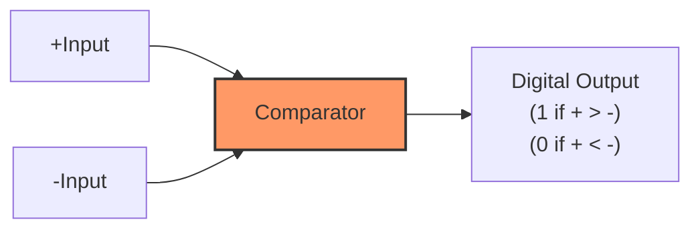
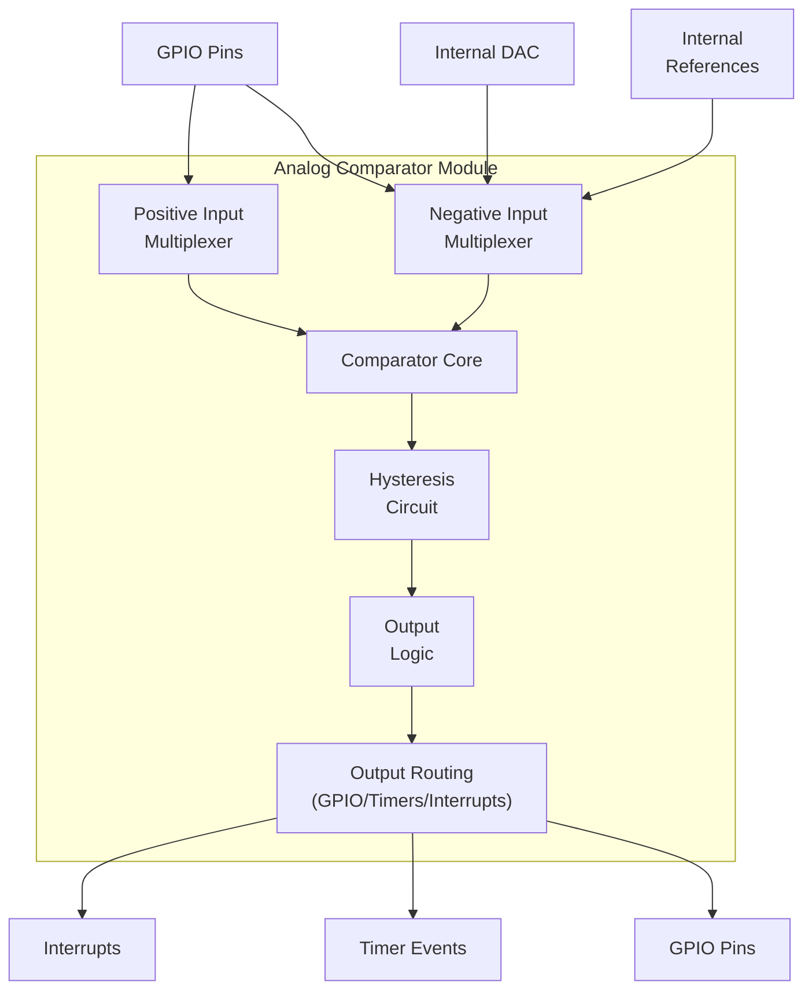
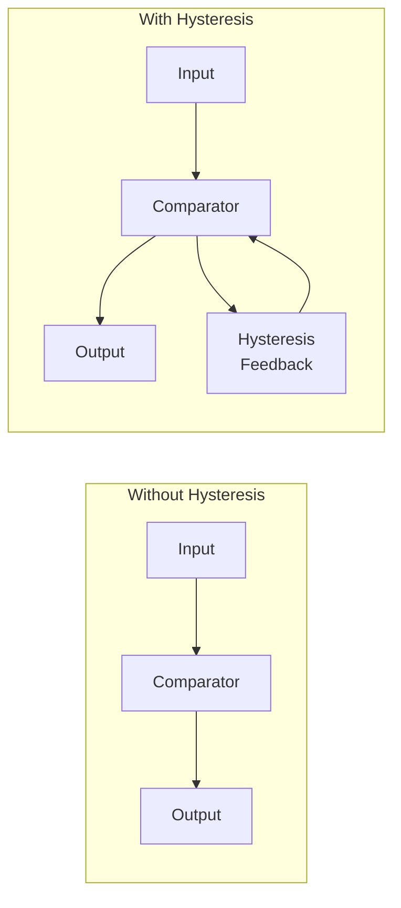
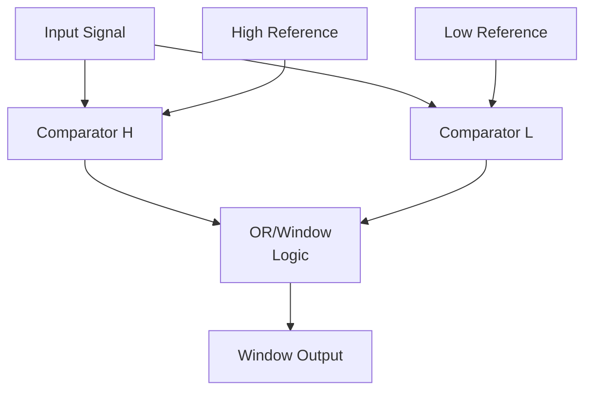

# STM32 Analog Comparators

## Introduction

Analog comparators are fundamental building blocks in analog circuit design that compare two voltage levels and output a digital signal based on their relationship. In STM32 microcontrollers, the integrated analog comparators allow you to perform voltage comparisons directly on-chip without needing external components, saving both board space and cost.

This guide will walk you through understanding, configuring, and using the analog comparators available in STM32 microcontrollers. Whether you're building a power management system, implementing voltage protection circuits, or creating signal conditioning interfaces, mastering STM32's analog comparators will give you a powerful tool for interfacing the analog and digital worlds.

## Basic Concepts

### What is an Analog Comparator?

An analog comparator is a circuit that compares two analog input voltages and outputs a digital signal indicating which input is larger.



The output follows these rules:
- If the voltage at the positive input (+) is greater than the voltage at the negative input (-), the output is HIGH (logical 1).
- If the voltage at the positive input (+) is less than the voltage at the negative input (-), the output is LOW (logical 0).

### STM32 Comparator Features

STM32 microcontrollers typically include several analog comparators with features such as:

- Programmable hysteresis to prevent output oscillation
- Selectable inputs from various sources (GPIO pins, internal references, DAC outputs)
- Output routing to timers, interrupts, or GPIO pins
- Ultra-low power consumption options
- Window comparison mode (on some models)
- Blanking capability from timers (on some models)

The number of comparators varies across different STM32 families:
- STM32F0/G0: 1-2 comparators
- STM32F3: 3-7 comparators
- STM32F4: 2 comparators
- STM32L4/L5: 2 comparators

## Comparator Hardware Architecture

The STM32 analog comparator module consists of several key components:



### Input Selection

Most STM32 comparators allow you to select different sources for both positive and negative inputs:

- **Positive Input Options**:
  - GPIO pins (typically multiple options)
  - Internal connections (device-specific)

- **Negative Input Options**:
  - GPIO pins
  - Internal voltage reference (VREFINT)
  - DAC outputs
  - Resistor divider network (on some models)

### Hysteresis

Hysteresis adds a small voltage difference between the switching thresholds when the output changes from low to high versus high to low. This prevents output oscillation when the input signals are noisy or changing slowly around the threshold.



STM32 comparators typically offer:
- No hysteresis
- Low hysteresis (typically ~5-10mV)
- Medium hysteresis (~15-20mV)
- High hysteresis (~30-50mV)

### Output Options

The comparator output can be routed to:
- GPIO pins
- Interrupt lines (EXTI)
- Timer input capture or break inputs
- Internal connections to other peripherals

## Configuring STM32 Analog Comparators

Let's look at how to configure and use an analog comparator on an STM32 microcontroller using the STM32CubeHAL library.

### Basic Configuration Steps

1. Enable the COMP clock
2. Configure GPIO pins for analog mode
3. Configure the comparator (inputs, hysteresis, output)
4. Enable the comparator

### Example Code: Simple Voltage Monitor

This example configures a comparator to monitor a voltage on PA1 against a reference on PA4, with the output triggering an LED on PA5.

```c
#include "main.h"

COMP_HandleTypeDef hcomp1;

void SystemClock_Config(void);
static void MX_GPIO_Init(void);
static void MX_COMP1_Init(void);

int main(void)
{
  /* MCU Configuration */
  HAL_Init();
  SystemClock_Config();
  
  /* Initialize all configured peripherals */
  MX_GPIO_Init();
  MX_COMP1_Init();
  
  /* Start the comparator */
  HAL_COMP_Start(&hcomp1);
  
  while (1)
  {
    /* Check comparator output and control LED */
    if (HAL_COMP_GetOutputLevel(&hcomp1) == COMP_OUTPUT_LEVEL_HIGH)
    {
      HAL_GPIO_WritePin(GPIOA, GPIO_PIN_5, GPIO_PIN_SET);    /* Turn on LED */
    }
    else
    {
      HAL_GPIO_WritePin(GPIOA, GPIO_PIN_5, GPIO_PIN_RESET);  /* Turn off LED */
    }
    
    HAL_Delay(10);  /* Small delay to prevent CPU hogging */
  }
}

static void MX_COMP1_Init(void)
{
  /* Configure COMP1 */
  hcomp1.Instance = COMP1;
  hcomp1.Init.InvertingInput = COMP_INVERTINGINPUT_IO1;      /* PA4 as negative input */
  hcomp1.Init.NonInvertingInput = COMP_NONINVERTINGINPUT_IO1; /* PA1 as positive input */
  hcomp1.Init.OutputPol = COMP_OUTPUTPOL_NONINVERTED;
  hcomp1.Init.Hysteresis = COMP_HYSTERESIS_MEDIUM;
  hcomp1.Init.Mode = COMP_POWERMODE_HIGHSPEED;
  hcomp1.Init.WindowMode = COMP_WINDOWMODE_DISABLE;
  hcomp1.Init.TriggerMode = COMP_TRIGGERMODE_NONE;
  
  if (HAL_COMP_Init(&hcomp1) != HAL_OK)
  {
    Error_Handler();
  }
}

/* GPIO initialization function to set up analog pins */
static void MX_GPIO_Init(void)
{
  GPIO_InitTypeDef GPIO_InitStruct = {0};
  
  /* GPIO Ports Clock Enable */
  __HAL_RCC_GPIOA_CLK_ENABLE();
  
  /* Configure analog input pins: PA1 and PA4 */
  GPIO_InitStruct.Pin = GPIO_PIN_1 | GPIO_PIN_4;
  GPIO_InitStruct.Mode = GPIO_MODE_ANALOG;
  GPIO_InitStruct.Pull = GPIO_NOPULL;
  HAL_GPIO_Init(GPIOA, &GPIO_InitStruct);
  
  /* Configure LED pin: PA5 */
  GPIO_InitStruct.Pin = GPIO_PIN_5;
  GPIO_InitStruct.Mode = GPIO_MODE_OUTPUT_PP;
  GPIO_InitStruct.Pull = GPIO_NOPULL;
  GPIO_InitStruct.Speed = GPIO_SPEED_FREQ_LOW;
  HAL_GPIO_Init(GPIOA, &GPIO_InitStruct);
}

/* This function is automatically called by HAL_COMP_Init() */
void HAL_COMP_MspInit(COMP_HandleTypeDef* compHandle)
{
  /* COMP1 clock enable */
  __HAL_RCC_COMP_CLK_ENABLE();
}
```

In this example:
- PA1 is configured as the positive input (monitored voltage)
- PA4 is the negative input (reference voltage)
- Medium hysteresis is enabled to prevent oscillation
- The output is checked in the main loop to control an LED on PA5
- High-speed mode is used for fast response time

## Using Interrupts with Comparators

One of the most powerful features of STM32 comparators is the ability to generate interrupts on output changes, allowing your microcontroller to sleep until a voltage threshold is crossed.

### Interrupt Configuration

To use comparator interrupts:

1. Configure the comparator as shown above
2. Configure EXTI line for the comparator
3. Enable and set priority for the NVIC interrupt
4. Implement the interrupt handler

### Example: Battery Low Voltage Detection with Interrupt

```c
#include "main.h"

COMP_HandleTypeDef hcomp1;

void SystemClock_Config(void);
static void MX_GPIO_Init(void);
static void MX_COMP1_Init(void);

int main(void)
{
  /* MCU Configuration */
  HAL_Init();
  SystemClock_Config();
  
  /* Initialize all configured peripherals */
  MX_GPIO_Init();
  MX_COMP1_Init();
  
  /* Start the comparator */
  HAL_COMP_Start_IT(&hcomp1);
  
  while (1)
  {
    /* Most of the time, we can stay in low-power mode */
    HAL_PWR_EnterSLEEPMode(PWR_LOWPOWERREGULATOR_ON, PWR_SLEEPENTRY_WFI);
  }
}

static void MX_COMP1_Init(void)
{
  /* Configure COMP1 for battery monitoring */
  hcomp1.Instance = COMP1;
  hcomp1.Init.InvertingInput = COMP_INVERTINGINPUT_VREFINT;   /* Internal reference as threshold */
  hcomp1.Init.NonInvertingInput = COMP_NONINVERTINGINPUT_IO1; /* PA1 connected to battery voltage divider */
  hcomp1.Init.OutputPol = COMP_OUTPUTPOL_NONINVERTED;
  hcomp1.Init.Hysteresis = COMP_HYSTERESIS_LOW;
  hcomp1.Init.Mode = COMP_POWERMODE_ULTRALOWPOWER;            /* Low power for battery applications */
  hcomp1.Init.WindowMode = COMP_WINDOWMODE_DISABLE;
  hcomp1.Init.TriggerMode = COMP_TRIGGERMODE_IT_FALLING;      /* Interrupt on falling edge (battery low) */
  
  if (HAL_COMP_Init(&hcomp1) != HAL_OK)
  {
    Error_Handler();
  }
}

void HAL_COMP_MspInit(COMP_HandleTypeDef* compHandle)
{
  /* COMP1 clock enable */
  __HAL_RCC_COMP_CLK_ENABLE();

  /* COMP1 interrupt Init */
  HAL_NVIC_SetPriority(COMP1_IRQn, 0, 0);
  HAL_NVIC_EnableIRQ(COMP1_IRQn);
}

/* Comparator interrupt callback */
void HAL_COMP_TriggerCallback(COMP_HandleTypeDef *hcomp)
{
  /* Battery voltage dropped below threshold */
  if (hcomp->Instance == COMP1)
  {
    /* Perform low battery actions */
    HAL_GPIO_WritePin(GPIOA, GPIO_PIN_5, GPIO_PIN_SET);  /* Turn on low battery indicator LED */
    
    /* Here you would typically:
       1. Save any critical data to non-volatile memory
       2. Disable non-essential peripherals
       3. Alert the user
       4. Prepare for shutdown
    */
  }
}

/* Comparator interrupt handler - calls the HAL handler */
void COMP_IRQHandler(void)
{
  HAL_COMP_IRQHandler(&hcomp1);
}
```

In this example:
- The comparator is configured to compare battery voltage against the internal reference
- Ultra-low power mode is used to minimize battery drain
- An interrupt is triggered when the battery voltage falls below the threshold
- The microcontroller can stay in sleep mode most of the time, conserving power

## Window Mode

Some STM32 models support window mode, where two comparators work together to detect if a voltage is inside or outside a specified range defined by two reference levels.



### Example: Temperature Range Detection

```c
/* Configuring comparators in window mode to detect temperature range */
COMP_HandleTypeDef hcomp1;
COMP_HandleTypeDef hcomp2;

static void MX_COMP_WindowMode_Init(void)
{
  /* Configure COMP1 (Lower threshold) */
  hcomp1.Instance = COMP1;
  hcomp1.Init.InvertingInput = COMP_INVERTINGINPUT_DAC1;      /* DAC1 provides lower threshold */
  hcomp1.Init.NonInvertingInput = COMP_NONINVERTINGINPUT_IO1; /* PA1 connected to temperature sensor */
  hcomp1.Init.OutputPol = COMP_OUTPUTPOL_NONINVERTED;
  hcomp1.Init.Hysteresis = COMP_HYSTERESIS_LOW;
  hcomp1.Init.Mode = COMP_POWERMODE_MEDIUMSPEED;
  hcomp1.Init.WindowMode = COMP_WINDOWMODE_COMP1_INPUT_PLUS_COMMON; /* Window mode enabled */
  hcomp1.Init.TriggerMode = COMP_TRIGGERMODE_IT_RISING_FALLING;
  
  if (HAL_COMP_Init(&hcomp1) != HAL_OK)
  {
    Error_Handler();
  }
  
  /* Configure COMP2 (Upper threshold) */
  hcomp2.Instance = COMP2;
  hcomp2.Init.InvertingInput = COMP_INVERTINGINPUT_DAC2;      /* DAC2 provides upper threshold */
  hcomp2.Init.NonInvertingInput = COMP_NONINVERTINGINPUT_IO1; /* Same input as COMP1 for window mode */
  hcomp2.Init.OutputPol = COMP_OUTPUTPOL_NONINVERTED;
  hcomp2.Init.Hysteresis = COMP_HYSTERESIS_LOW;
  hcomp2.Init.Mode = COMP_POWERMODE_MEDIUMSPEED;
  hcomp2.Init.WindowMode = COMP_WINDOWMODE_COMP2_INPUT_PLUS_COMMON; /* Window mode enabled */
  hcomp2.Init.TriggerMode = COMP_TRIGGERMODE_IT_RISING_FALLING;
  
  if (HAL_COMP_Init(&hcomp2) != HAL_OK)
  {
    Error_Handler();
  }
  
  /* Set DAC values for threshold */
  /* Note: Additional code needed to configure and set DAC values */
}
```

In window mode, the output logic is:
- COMP1 output = 1 when input > lower threshold
- COMP2 output = 0 when input < upper threshold
- Window output = 1 when lower threshold < input < upper threshold

## Practical Applications

### 1. Zero-Crossing Detector

A zero-crossing detector identifies when an AC signal crosses the zero voltage level, useful for power control applications.

```c
/* Configure comparator as zero-crossing detector */
hcomp.Instance = COMP1;
hcomp.Init.InvertingInput = COMP_INVERTINGINPUT_DAC1;       /* Set to mid-supply voltage (e.g., 1.65V) */
hcomp.Init.NonInvertingInput = COMP_NONINVERTINGINPUT_IO1;  /* AC signal input */
hcomp.Init.OutputPol = COMP_OUTPUTPOL_NONINVERTED;
hcomp.Init.Hysteresis = COMP_HYSTERESIS_LOW;                /* Small hysteresis for noise immunity */
hcomp.Init.Mode = COMP_POWERMODE_HIGHSPEED;                 /* Fast response for accurate timing */
hcomp.Init.TriggerMode = COMP_TRIGGERMODE_EVENT_RISING_FALLING; /* Capture both crossings */

/* This could be connected to timer capture for precise timing measurements */
```

### 2. Level Shifter/Signal Conditioning

```c
/* Configure comparator as level shifter (3.3V to 5V logic) */
hcomp.Instance = COMP1;
hcomp.Init.InvertingInput = COMP_INVERTINGINPUT_VREFINT_DIV2;  /* Half of reference (~0.6V) */
hcomp.Init.NonInvertingInput = COMP_NONINVERTINGINPUT_IO1;     /* 3.3V logic input */
hcomp.Init.OutputPol = COMP_OUTPUTPOL_NONINVERTED;
hcomp.Init.Hysteresis = COMP_HYSTERESIS_MEDIUM;                /* Prevent oscillation */
hcomp.Init.Mode = COMP_POWERMODE_MEDIUMSPEED;
```

### 3. Overcurrent Protection

```c
/* Configure comparator for current monitoring */
hcomp.Instance = COMP1;
hcomp.Init.InvertingInput = COMP_INVERTINGINPUT_DAC1;        /* Current threshold set by DAC */
hcomp.Init.NonInvertingInput = COMP_NONINVERTINGINPUT_IO1;   /* Current sense resistor voltage */
hcomp.Init.OutputPol = COMP_OUTPUTPOL_NONINVERTED;
hcomp.Init.Hysteresis = COMP_HYSTERESIS_LOW;
hcomp.Init.Mode = COMP_POWERMODE_HIGHSPEED;
hcomp.Init.TriggerMode = COMP_TRIGGERMODE_EVENT_RISING;      /* Trigger on overcurrent */

/* The output can be connected to a timer's break input to immediately stop PWM output */
```

### 4. Touch Button Implementation

```c
/* 
 * RC timing-based touch sensor:
 * - Capacitive touch button creates an RC circuit
 * - Comparator detects when capacitor voltage crosses threshold
 * - Timer measures discharge time to detect touch
 */
hcomp.Instance = COMP1;
hcomp.Init.InvertingInput = COMP_INVERTINGINPUT_VREFINT_DIV2;  /* Threshold */
hcomp.Init.NonInvertingInput = COMP_NONINVERTINGINPUT_IO1;     /* Connected to touch pad */
hcomp.Init.OutputPol = COMP_OUTPUTPOL_NONINVERTED;
hcomp.Init.Hysteresis = COMP_HYSTERESIS_LOW;
hcomp.Init.Mode = COMP_POWERMODE_MEDIUMSPEED;
hcomp.Init.TriggerMode = COMP_TRIGGERMODE_EVENT_FALLING;       /* Capacitor discharge detection */

/* Connect to timer input capture for timing measurement */
```

## Performance Considerations

### Power Consumption

STM32 comparators offer different operating modes affecting power consumption and speed:

- **Ultra-low power mode**: Lowest consumption (typically `<1μA`), but slower response (`5-10μs`)
- **Low power mode**: Good balance for battery applications (`1-5μA`, `2-5μs`)
- **Medium speed mode**: Better performance (`5-20μA`, `500ns-2μs`)
- **High speed mode**: Fastest response (`20-50μA`, `50-200ns`)

### Response Time

Response time is affected by:
- Selected power mode
- Hysteresis setting
- Input signal characteristics
- Filtering options

For time-critical applications, use high-speed mode and minimize filtering.

### Accuracy and Noise Immunity

To improve comparator accuracy:
- Use proper PCB layout to minimize noise
- Add external filtering when needed
- Choose appropriate hysteresis setting
- Consider using window mode for noise immunity

## Troubleshooting Common Issues

### Oscillating Output

**Problem**: Comparator output switches rapidly when input is near threshold.
**Solution**: 
- Increase hysteresis setting
- Add external RC filtering on inputs
- Use window comparator with small threshold gap

### Unexpected Triggering

**Problem**: Comparator triggers at wrong times or from noise.
**Solution**:
- Check input signal for noise with oscilloscope
- Verify ground connections
- Add filtering capacitors
- Use blanking feature if available (some STM32 models)

### Incorrect Threshold

**Problem**: Comparator switches at unexpected voltage levels.
**Solution**:
- Verify reference voltage source
- Check for voltage drops in PCB traces
- Measure actual input voltages
- Consider temperature effects on references

## Summary

STM32 analog comparators provide a versatile interface between analog and digital domains. They can be used for a wide range of applications including:

- Voltage monitoring and protection
- Signal conditioning and level shifting
- Timing and zero-crossing detection
- Touch sensors and user interfaces
- Power management

Key features to remember:
- Flexible input selection (pins, internal references, DAC)
- Configurable hysteresis for noise immunity
- Multiple power modes for power/performance balance
- Output routing to timers, interrupts, or GPIO pins
- Window mode for range detection (on some models)

By properly configuring and using these comparators, you can create efficient, reliable interfaces between analog signals and digital processing in your STM32-based designs.

## Exercises

1. Configure a comparator to create a simple light sensor that turns on an LED when ambient light falls below a certain threshold.

2. Implement a window comparator to monitor a power supply voltage and trigger an alert if it goes outside an acceptable range.

3. Create a capacitive touch button interface using a comparator and timer to measure RC discharge time.

4. Design a zero-crossing detector for AC mains synchronization (use appropriate isolation for safety!).

5. Build a voltage-controlled oscillator by connecting a comparator output to charge/discharge a capacitor through a resistor.

## Additional Resources

- STM32 Reference Manuals (RM0091, RM0316, etc.)
- STM32 HAL Documentation
- STM32CubeIDE or STM32CubeMX for peripheral configuration
- Application Note AN4071: "STM32 analog comparators"