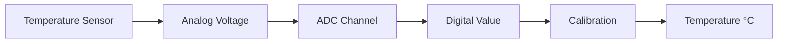

# STM32 Temperature Sensor

## Introduction

Temperature sensing is a fundamental requirement in many embedded systems applications. Whether you're building environmental monitoring systems, industrial control equipment, or simply want to monitor your microcontroller's own temperature for safety, the STM32 family of microcontrollers offers a convenient solution with its built-in temperature sensor.

STM32 microcontrollers come with an internal temperature sensor that's connected to an ADC (Analog-to-Digital Converter) channel. This means you can measure temperature without adding any external components, saving both cost and board space. In this tutorial, we'll explore how to use the internal temperature sensor on STM32 microcontrollers to measure and monitor temperature.

## Understanding the STM32 Internal Temperature Sensor

The internal temperature sensor in STM32 microcontrollers converts temperature to a voltage that can be read by the ADC. Here's how it works:

1. The sensor generates a voltage proportional to the temperature
2. This voltage is connected to one of the ADC channels (typically ADC1)
3. The ADC converts this analog voltage to a digital value
4. We apply a calibration formula to convert this digital value to temperature in degrees Celsius



### Key Characteristics

- **Resolution**: Typically 1°C (varies by STM32 family)
- **Accuracy**: ±1.5°C at 25°C (typical, check datasheet for your specific device)
- **Range**: -40°C to 125°C (typical)
- **Sampling time**: Requires a minimum sampling time (often 10μs or more)

## Setting Up the ADC for Temperature Sensing

To use the internal temperature sensor, we need to:

1. Enable the ADC peripheral clock
2. Configure the ADC (resolution, sampling time, etc.)
3. Enable the internal temperature sensor
4. Select the correct ADC channel for the temperature sensor
5. Perform the conversion and read the result
6. Apply calibration to convert the raw ADC value to temperature

Let's walk through these steps with code examples.

## Code Example: Reading the Internal Temperature Sensor

Here's a complete example using the STM32 HAL library. This example is for an STM32F4 series microcontroller, but the principles apply to most STM32 families with minor adjustments.

```c
#include "main.h"

ADC_HandleTypeDef hadc1;

void SystemClock_Config(void);
static void MX_GPIO_Init(void);
static void MX_ADC1_Init(void);
float ConvertToTemperature(uint32_t adcValue);

int main(void)
{
  HAL_Init();
  SystemClock_Config();
  MX_GPIO_Init();
  MX_ADC1_Init();
  
  uint32_t adcValue = 0;
  float temperature = 0.0f;
  
  while (1)
  {
    // Start ADC conversion
    HAL_ADC_Start(&hadc1);
    
    // Wait for conversion to complete
    if (HAL_ADC_PollForConversion(&hadc1, 100) == HAL_OK)
    {
      // Read ADC value
      adcValue = HAL_ADC_GetValue(&hadc1);
      
      // Convert to temperature
      temperature = ConvertToTemperature(adcValue);
      
      // Print or use the temperature value
      // For example, send it via UART
      
      // Wait for a moment before next reading
      HAL_Delay(1000);
    }
  }
}

static void MX_ADC1_Init(void)
{
  ADC_ChannelConfTypeDef sConfig = {0};

  // Configure the ADC peripheral
  hadc1.Instance = ADC1;
  hadc1.Init.ClockPrescaler = ADC_CLOCK_SYNC_PCLK_DIV4;
  hadc1.Init.Resolution = ADC_RESOLUTION_12B;
  hadc1.Init.ScanConvMode = DISABLE;
  hadc1.Init.ContinuousConvMode = DISABLE;
  hadc1.Init.DiscontinuousConvMode = DISABLE;
  hadc1.Init.ExternalTrigConvEdge = ADC_EXTERNALTRIGCONVEDGE_NONE;
  hadc1.Init.ExternalTrigConv = ADC_SOFTWARE_START;
  hadc1.Init.DataAlign = ADC_DATAALIGN_RIGHT;
  hadc1.Init.NbrOfConversion = 1;
  hadc1.Init.DMAContinuousRequests = DISABLE;
  hadc1.Init.EOCSelection = ADC_EOC_SINGLE_CONV;
  if (HAL_ADC_Init(&hadc1) != HAL_OK)
  {
    Error_Handler();
  }

  // Configure for the temperature sensor channel
  // For most STM32F4, temperature sensor is on ADC_CHANNEL_16
  sConfig.Channel = ADC_CHANNEL_16;
  sConfig.Rank = 1;
  // Temperature sensor needs a long sampling time
  sConfig.SamplingTime = ADC_SAMPLETIME_144CYCLES;
  if (HAL_ADC_ConfigChannel(&hadc1, &sConfig) != HAL_OK)
  {
    Error_Handler();
  }
}

void HAL_ADC_MspInit(ADC_HandleTypeDef* adcHandle)
{
  if(adcHandle->Instance==ADC1)
  {
    /* ADC1 clock enable */
    __HAL_RCC_ADC1_CLK_ENABLE();
    
    /* Enable temperature sensor */
    ADC->CCR |= ADC_CCR_TSVREFE;
  }
}

float ConvertToTemperature(uint32_t adcValue)
{
  // For STM32F4, the formula is typically:
  // Temperature (°C) = ((V_SENSE - V_25) / Avg_Slope) + 25
  
  // V_SENSE is the voltage read from the temperature sensor (via ADC)
  // V_25 is the voltage at 25°C (from datasheet)
  // Avg_Slope is the average slope (from datasheet)
  
  // Convert ADC value to voltage
  float voltage = (float)adcValue * (3.3f / 4096.0f); // assuming 3.3V reference and 12-bit ADC
  
  // Apply calibration constants (these vary by STM32 family; check your datasheet)
  float V_25 = 0.76f;        // Voltage at 25°C (volts)
  float Avg_Slope = 0.0025f; // Average slope (V/°C)
  
  // Calculate temperature
  float temperature = ((voltage - V_25) / Avg_Slope) + 25.0f;
  
  return temperature;
}
```

## Important Notes on Calibration

The calibration values used in the example (V_25 and Avg_Slope) are typical values for STM32F4 microcontrollers. For accurate temperature measurements, you should:

1. Check your specific microcontroller's datasheet for the correct values
2. Consider using the factory-calibrated values stored in the system memory (if available)

For STM32F4 devices, you can access factory calibration values like this:

```c
// Read factory calibration values
#define TEMP_SENSOR_CAL1_ADDR ((uint16_t*) ((uint32_t) 0x1FFF7A2C))
#define TEMP_SENSOR_CAL2_ADDR ((uint16_t*) ((uint32_t) 0x1FFF7A2E))
#define TEMP_SENSOR_CAL1_TEMP 30  // °C
#define TEMP_SENSOR_CAL2_TEMP 110 // °C
#define VREFINT_CAL_ADDR ((uint16_t*) ((uint32_t) 0x1FFF7A2A))

float ConvertToTemperatureWithCalibration(uint32_t adcValue)
{
  // Read calibration values from system memory
  float cal1 = *TEMP_SENSOR_CAL1_ADDR;
  float cal2 = *TEMP_SENSOR_CAL2_ADDR;
  
  // Calculate slope using factory calibration points
  float slope = (TEMP_SENSOR_CAL2_TEMP - TEMP_SENSOR_CAL1_TEMP) / (cal2 - cal1);
  
  // Calculate temperature
  float temperature = TEMP_SENSOR_CAL1_TEMP + (adcValue - cal1) * slope;
  
  return temperature;
}
```

## STM32CubeMX Configuration

STM32CubeMX makes it easy to configure the ADC for temperature sensing. Here's how:

1. Open your project in STM32CubeMX
2. Go to the "Analog" section and configure ADC1
3. In the ADC configuration page, enable the internal temperature sensor
4. Set an appropriate sampling time for the temperature sensor channel
5. Generate the code

## Real-World Applications

### 1. Microcontroller Thermal Protection

You can use the internal temperature sensor to monitor the MCU's temperature and take protective actions if it gets too hot:

```c
void monitorTemperature(void)
{
  float temperature = readInternalTemperature();
  
  if (temperature > 85.0f) {
    // Temperature is getting high - reduce clock speed
    decreaseClockSpeed();
  }
  
  if (temperature > 100.0f) {
    // Critical temperature - enter low power mode
    enterLowPowerMode();
  }
}
```

### 2. Simple Thermostat

Create a basic thermostat system:

```c
void simpleThermostat(float setPoint)
{
  float currentTemp = readInternalTemperature();
  
  // Simple on/off control
  if (currentTemp < setPoint) {
    // Turn heater on
    HAL_GPIO_WritePin(HEATER_GPIO_Port, HEATER_Pin, GPIO_PIN_SET);
  } else {
    // Turn heater off
    HAL_GPIO_WritePin(HEATER_GPIO_Port, HEATER_Pin, GPIO_PIN_RESET);
  }
}
```

### 3. Data Logger

Log temperature data to track environmental conditions:

```c
typedef struct {
  uint32_t timestamp;
  float temperature;
} TempLogEntry;

#define LOG_SIZE 100
TempLogEntry temperatureLog[LOG_SIZE];
uint32_t logIndex = 0;

void logTemperature(void)
{
  if (logIndex < LOG_SIZE) {
    temperatureLog[logIndex].timestamp = HAL_GetTick();
    temperatureLog[logIndex].temperature = readInternalTemperature();
    logIndex++;
  }
}
```

## Common Challenges and Solutions

### Challenge 1: Poor Accuracy

**Problem**: Temperature readings are inaccurate.

**Solutions**:
- Use factory calibration values from system memory
- Increase ADC sampling time
- Take multiple readings and average them
- Apply software filtering to reduce noise

```c
float getFilteredTemperature(uint8_t samples)
{
  float sum = 0.0f;
  
  for (uint8_t i = 0; i < samples; i++) {
    HAL_ADC_Start(&hadc1);
    HAL_ADC_PollForConversion(&hadc1, 100);
    uint32_t adcValue = HAL_ADC_GetValue(&hadc1);
    sum += ConvertToTemperature(adcValue);
    HAL_Delay(10);
  }
  
  return sum / samples;
}
```

### Challenge 2: Self-Heating

**Problem**: The microcontroller heats itself during operation, affecting readings.

**Solutions**:
- Use sleep modes between readings
- Consider thermal design of your PCB
- Apply compensation based on workload

### Challenge 3: Environmental Noise

**Problem**: Electrical noise affects ADC readings.

**Solutions**:
- Add filtering capacitors near the ADC power supply
- Use software filtering (moving average, median filter, etc.)
- Ensure proper board layout to minimize noise sources

## Summary

The internal temperature sensor in STM32 microcontrollers provides a convenient way to measure temperature without external components. Key takeaways:

- STM32 microcontrollers include an internal temperature sensor connected to the ADC
- Proper calibration is essential for accurate readings
- Use appropriate sampling times for the temperature sensor channel
- Consider factory calibration values for improved accuracy
- Apply filtering techniques to improve measurement quality

By following this guide, you should be able to successfully integrate temperature sensing capabilities into your STM32-based projects. This functionality can be used for thermal monitoring, environmental sensing, or even as a simple thermometer.

## Exercises

1. Create a program that takes temperature readings every minute and stores the min, max, and average values.
2. Implement a digital thermometer that displays the temperature on an LCD or sends it via UART to a computer.
3. Design a temperature alarm system that triggers an LED or buzzer when the temperature exceeds a threshold.
4. Combine the internal temperature sensor with an external sensor (like DS18B20) and compare their readings.
5. Create a PID temperature controller that maintains a steady temperature using a heating element.