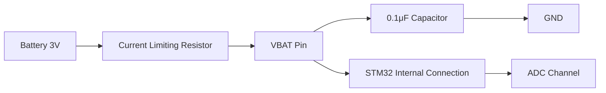

# STM32 VBAT Monitoring

## Introduction

Battery voltage monitoring is a critical feature in many embedded systems, particularly those that operate on battery power or require backup power. STM32 microcontrollers provide built-in hardware capabilities for monitoring the VBAT (battery voltage) level, which can be essential for:

- Detecting low battery conditions
- Implementing power-saving strategies
- Providing accurate battery status to users
- Protecting the system from under-voltage conditions

In this tutorial, we'll explore how to monitor battery voltage using STM32 microcontrollers, focusing on practical implementations that you can apply to your own projects.

## Understanding VBAT in STM32 Microcontrollers

The VBAT pin on STM32 microcontrollers serves a dual purpose:

1. It powers the real-time clock (RTC) and backup registers when the main power supply is disconnected
2. It can be monitored through the analog-to-digital converter (ADC) to determine the battery voltage level

Most STM32 devices include internal connections that allow you to measure the VBAT voltage using the ADC. This eliminates the need for external components to monitor battery voltage.

## Hardware Setup

### Battery Connection

To properly set up VBAT monitoring, you'll need:

1. A battery connected to the VBAT pin (typically 3V lithium coin cell)
2. A decoupling capacitor (0.1μF to 1μF) between VBAT and GND
3. Optional: A current-limiting resistor if your battery doesn't have built-in protection

Here's a typical connection diagram:



## Software Implementation

### 1. Enabling the ADC for VBAT Monitoring

To monitor VBAT, we first need to configure the ADC and enable the VBAT channel. In STM32 microcontrollers, VBAT is internally connected to a specific ADC channel through a voltage divider (typically 1/3 or 1/4 ratio).

Here's how to set it up using the STM32 HAL library:

```c
void ConfigureVBATMonitoring(void)
{
  // Enable ADC peripheral clock
  __HAL_RCC_ADC1_CLK_ENABLE();
  
  // Enable VBAT channel monitoring
  ADC->CCR |= ADC_CCR_VBATE;
  
  // Configure ADC
  hadc1.Instance = ADC1;
  hadc1.Init.Resolution = ADC_RESOLUTION_12B;
  hadc1.Init.ScanConvMode = DISABLE;
  hadc1.Init.ContinuousConvMode = DISABLE;
  hadc1.Init.DiscontinuousConvMode = DISABLE;
  hadc1.Init.ExternalTrigConvEdge = ADC_EXTERNALTRIGCONVEDGE_NONE;
  hadc1.Init.ExternalTrigConv = ADC_SOFTWARE_START;
  hadc1.Init.DataAlign = ADC_DATAALIGN_RIGHT;
  hadc1.Init.NbrOfConversion = 1;
  hadc1.Init.DMAContinuousRequests = DISABLE;
  hadc1.Init.EOCSelection = ADC_EOC_SINGLE_CONV;
  
  if (HAL_ADC_Init(&hadc1) != HAL_OK)
  {
    Error_Handler();
  }
  
  // Configure VBAT channel
  ADC_ChannelConfTypeDef sConfig = {0};
  
  // Note: The exact channel for VBAT varies by STM32 family
  // For most STM32F4 devices, it's channel 18
  sConfig.Channel = ADC_CHANNEL_VBAT;
  sConfig.Rank = 1;
  sConfig.SamplingTime = ADC_SAMPLETIME_480CYCLES;
  
  if (HAL_ADC_ConfigChannel(&hadc1, &sConfig) != HAL_OK)
  {
    Error_Handler();
  }
}
```

### 2. Reading VBAT Voltage

After configuring the ADC, we can read the VBAT voltage:

```c
float ReadVBAT(void)
{
  uint32_t adcValue;
  float vbatVoltage;
  
  // Start ADC conversion
  HAL_ADC_Start(&hadc1);
  
  // Wait for conversion to complete
  HAL_ADC_PollForConversion(&hadc1, 100);
  
  // Read ADC value
  adcValue = HAL_ADC_GetValue(&hadc1);
  
  // Convert ADC value to voltage
  // Note: The scaling factor depends on:
  // 1. ADC resolution (12-bit = 4096 levels)
  // 2. Reference voltage (typically 3.3V)
  // 3. VBAT channel divider ratio (typically 1/3 or 1/4)
  
  // For STM32F4 with 1/3 divider and 3.3V reference:
  vbatVoltage = (float)adcValue * (3.3f / 4096.0f) * 3.0f;
  
  // For STM32F7/L4 with 1/4 divider and 3.3V reference:
  // vbatVoltage = (float)adcValue * (3.3f / 4096.0f) * 4.0f;
  
  return vbatVoltage;
}
```

### 3. Complete Example

Let's put it all together into a complete example that periodically monitors VBAT and takes action based on the voltage level:

```c
#include "main.h"
#include "stm32f4xx_hal.h"
#include <stdio.h>

ADC_HandleTypeDef hadc1;
UART_HandleTypeDef huart2;

void SystemClock_Config(void);
static void MX_GPIO_Init(void);
static void MX_ADC1_Init(void);
static void MX_USART2_UART_Init(void);
void ConfigureVBATMonitoring(void);
float ReadVBAT(void);

// Battery threshold voltages
#define VBAT_LOW      2.7f
#define VBAT_CRITICAL 2.5f

int main(void)
{
  float batteryVoltage;
  char uartBuffer[64];
  int bufferLength;
  
  HAL_Init();
  SystemClock_Config();
  
  MX_GPIO_Init();
  MX_USART2_UART_Init();
  MX_ADC1_Init();
  
  ConfigureVBATMonitoring();
  
  // Main loop
  while (1)
  {
    // Read battery voltage
    batteryVoltage = ReadVBAT();
    
    // Print battery voltage
    bufferLength = sprintf(uartBuffer, "Battery Voltage: %.2f V\r
", batteryVoltage);
    HAL_UART_Transmit(&huart2, (uint8_t*)uartBuffer, bufferLength, 100);
    
    // Check battery status
    if (batteryVoltage < VBAT_CRITICAL)
    {
      // Critical battery level - take emergency action
      HAL_UART_Transmit(&huart2, (uint8_t*)"CRITICAL BATTERY LEVEL! Shutting down...\r
", 42, 100);
      
      // Save important data to flash
      // ...
      
      // Enter deep sleep mode
      HAL_PWR_EnterSTANDBYMode();
    }
    else if (batteryVoltage < VBAT_LOW)
    {
      // Low battery level - activate power saving mode
      HAL_UART_Transmit(&huart2, (uint8_t*)"LOW BATTERY ALERT! Entering power save mode\r
", 45, 100);
      
      // Reduce clock frequency
      // Disable non-essential peripherals
      // ...
    }
    
    // Wait 5 seconds before next reading
    HAL_Delay(5000);
  }
}

// Implementation of ConfigureVBATMonitoring() and ReadVBAT() as shown above
// ...
```

## Example Output

When running the above code, you might see output like this on your serial terminal:

```
Battery Voltage: 3.12 V
Battery Voltage: 3.11 V
Battery Voltage: 3.10 V
...
Battery Voltage: 2.67 V
LOW BATTERY ALERT! Entering power save mode
...
Battery Voltage: 2.48 V
CRITICAL BATTERY LEVEL! Shutting down...
```

## Advanced Topics

### 1. Improving Measurement Accuracy

For more accurate measurements, consider these improvements:

```c
float ReadVBATAccurate(void)
{
  uint32_t adcSum = 0;
  float vbatVoltage;
  
  // Take multiple readings and average them
  for (int i = 0; i < 16; i++)
  {
    HAL_ADC_Start(&hadc1);
    HAL_ADC_PollForConversion(&hadc1, 100);
    adcSum += HAL_ADC_GetValue(&hadc1);
    HAL_Delay(5); // Small delay between readings
  }
  
  // Calculate average
  uint32_t adcAverage = adcSum / 16;
  
  // Convert to voltage
  vbatVoltage = (float)adcAverage * (3.3f / 4096.0f) * 3.0f;
  
  // Apply calibration factor if needed
  // vbatVoltage *= 1.023f; // Example calibration factor
  
  return vbatVoltage;
}
```

### 2. Using DMA for Continuous Monitoring

For systems that need continuous VBAT monitoring without CPU intervention:

```c
void ConfigureVBAT_DMA(void)
{
  // Configure ADC with DMA
  hadc1.Instance = ADC1;
  // ... [other ADC settings as before]
  hadc1.Init.DMAContinuousRequests = ENABLE;
  
  HAL_ADC_Init(&hadc1);
  
  // Configure DMA
  hdma_adc1.Instance = DMA2_Stream0;
  hdma_adc1.Init.Channel = DMA_CHANNEL_0;
  hdma_adc1.Init.Direction = DMA_PERIPH_TO_MEMORY;
  hdma_adc1.Init.PeriphInc = DMA_PERIPH_INC_DISABLE;
  hdma_adc1.Init.MemInc = DMA_MEMORY_INC_DISABLE;
  hdma_adc1.Init.PeriphDataAlignment = DMA_PDATAALIGN_WORD;
  hdma_adc1.Init.MemDataAlignment = DMA_MDATAALIGN_WORD;
  hdma_adc1.Init.Mode = DMA_CIRCULAR;
  hdma_adc1.Init.Priority = DMA_PRIORITY_LOW;
  hdma_adc1.Init.FIFOMode = DMA_FIFOMODE_DISABLE;
  
  HAL_DMA_Init(&hdma_adc1);
  
  __HAL_LINKDMA(&hadc1, DMA_Handle, hdma_adc1);
  
  // Start continuous conversion
  HAL_ADC_Start_DMA(&hadc1, &adcDmaValue, 1);
}
```

### 3. Implementing a Battery Gauge

By tracking VBAT over time, you can implement a simple battery gauge:

```c
typedef struct {
  float voltage;
  uint8_t percentage;
} BatteryStatus_t;

BatteryStatus_t GetBatteryStatus(void)
{
  BatteryStatus_t status;
  
  // Read voltage
  status.voltage = ReadVBATAccurate();
  
  // Convert to percentage based on battery discharge curve
  // This is a simplified linear model for a typical lithium battery
  // For more accuracy, use a lookup table based on the actual battery discharge curve
  
  if (status.voltage >= 3.0f) {
    status.percentage = 100;
  } else if (status.voltage <= 2.5f) {
    status.percentage = 0;
  } else {
    // Linear mapping from 2.5V (0%) to 3.0V (100%)
    status.percentage = (uint8_t)((status.voltage - 2.5f) / 0.5f * 100.0f);
  }
  
  return status;
}
```

## Common Issues and Troubleshooting

1. **Inaccurate Readings**
   - Verify the voltage divider ratio for your specific STM32 model (check datasheet)
   - Calibrate your measurements against a known reference
   - Ensure ADC reference voltage is stable

2. **Unable to Enable VBAT Channel**
   - Check that you're using the correct register for your STM32 family
   - Some older STM32 models may have different mechanisms for VBAT monitoring

3. **Unexpectedly Low Readings**
   - Ensure proper battery connection
   - Check for current leakage in your circuit
   - Verify battery specifications and condition

## Practical Applications

### 1. Portable Data Logger

Monitor battery voltage to ensure your data is safely stored before power is depleted:

```c
void DataLoggerTask(void)
{
  float batteryVoltage = ReadVBAT();
  
  // Log sensor data with timestamp and battery voltage
  LogData(sensorValue, batteryVoltage);
  
  // If battery is low, increase logging interval to save power
  if (batteryVoltage < 2.8f) {
    loggingInterval = 60000; // Switch to 1 minute intervals
  } else {
    loggingInterval = 5000;  // Normal 5 second intervals
  }
  
  // If critically low, save all cached data to flash
  if (batteryVoltage < 2.6f) {
    FlushCacheToFlash();
    EnterDeepSleep();
  }
}
```

### 2. Battery-Powered IoT Device

Implement an intelligent power management system for a wireless sensor:

```c
void IoTSensorNode(void)
{
  BatteryStatus_t battStatus = GetBatteryStatus();
  
  // Adjust transmission power and frequency based on battery level
  if (battStatus.percentage > 70) {
    // Full power operation
    SetTransmitPower(TX_POWER_HIGH);
    SetTransmitInterval(5 * 60 * 1000); // 5 minutes
  } else if (battStatus.percentage > 30) {
    // Medium power operation
    SetTransmitPower(TX_POWER_MEDIUM);
    SetTransmitInterval(15 * 60 * 1000); // 15 minutes
  } else {
    // Low power operation
    SetTransmitPower(TX_POWER_LOW);
    SetTransmitInterval(60 * 60 * 1000); // 1 hour
    
    // Include battery warning in transmitted data
    SetLowBatteryFlag();
  }
  
  // Include battery percentage in transmitted data packet
  PrepareDataPacket(sensorData, battStatus.percentage);
  TransmitData();
}
```

## Summary

STM32 microcontrollers provide built-in capabilities for VBAT monitoring, which is essential for battery-powered applications. By following the steps outlined in this tutorial, you can implement reliable battery monitoring in your projects, enabling:

- Accurate battery level reporting
- Intelligent power management
- Safe system shutdown when battery is critically low
- Extended battery life through adaptive power strategies

With these techniques, you can create robust battery-powered systems that gracefully handle varying power conditions and provide users with meaningful battery status information.

## Additional Resources

- STM32 Reference Manuals (check your specific model)
- Application Note AN4056: "Getting started with STM32F4xxxx/F2xxxx series hardware development"
- The STM32 ADC cookbook

## Exercises

1. **Basic Implementation**: Configure your STM32 board to read and display the VBAT voltage through the serial port every 5 seconds.

2. **LED Battery Indicator**: Create a battery level indicator using LEDs (e.g., green for `>80%`, yellow for `40-80%`, red for `<40%`, blinking red for `<20%`).

3. **Power Optimization**: Implement a system that adjusts MCU clock frequency based on battery level. Measure how this affects battery life.

4. **Battery Profiler**: Create a program that logs battery voltage over time, allowing you to generate discharge curves for different types of batteries.

5. **Advanced Challenge**: Implement a "fuel gauge" algorithm that estimates remaining battery capacity based on both voltage and discharge history.