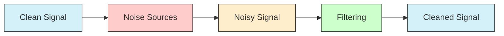
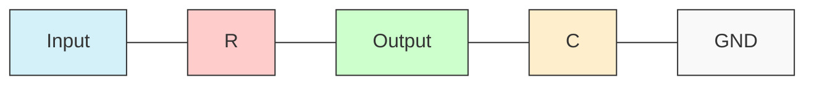
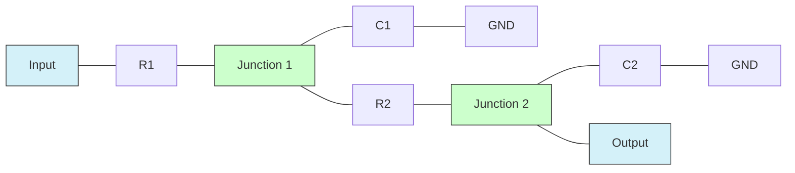

# STM32 Analog Filtering

## Introduction

Analog filtering is a crucial technique in embedded systems for cleaning up signals before processing them digitally. When working with STM32 microcontrollers, understanding how to implement effective analog filtering can significantly improve the reliability and accuracy of your measurements and control systems.

In this tutorial, we'll explore how to implement analog filtering techniques using STM32 microcontrollers. We'll cover both hardware approaches (external components) and software methods (digital filtering of analog signals) to achieve clean, noise-free signals for your embedded applications.

## Understanding Analog Noise

Before we dive into filtering techniques, let's understand the problem: analog noise. In real-world applications, analog signals are almost always contaminated with various noise sources:

- **Environmental noise**: Electromagnetic interference (EMI), radio frequency interference (RFI)
- **Power supply noise**: Ripple, switching noise
- **Thermal noise**: Random fluctuations due to temperature
- **Coupling noise**: Cross-talk between signal lines

Here's a visual representation of a noisy analog signal:



## Hardware Filtering Approaches

### 1. RC Low-Pass Filter

The simplest form of analog filtering is the RC low-pass filter, which attenuates high-frequency noise while allowing low-frequency signals to pass through.



To calculate the cutoff frequency (fc) of an RC filter:

```
fc = 1 / (2π × R × C)
```

Where:
- fc is the cutoff frequency in Hz
- R is the resistance in ohms
- C is the capacitance in farads

#### Example Implementation:

For a cutoff frequency of 100Hz using a 10kΩ resistor:

```
C = 1 / (2π × R × fc)
C = 1 / (2π × 10000 × 100)
C = 0.159 μF
```

You can use a standard 0.15μF or 0.22μF capacitor for this application.

### 2. Multiple-Stage Filtering

For better noise rejection, you can cascade multiple filter stages:



### 3. Connecting to STM32 ADC Inputs

When connecting filtered signals to STM32 ADC inputs, consider:

```c
// Pin configuration for ADC input with external filter
void ConfigureADCPin(void)
{
  GPIO_InitTypeDef GPIO_InitStruct = {0};
  
  // Enable GPIO clock
  __HAL_RCC_GPIOA_CLK_ENABLE();
  
  // Configure GPIO pin: PA0 as analog
  GPIO_InitStruct.Pin = GPIO_PIN_0;
  GPIO_InitStruct.Mode = GPIO_MODE_ANALOG;
  GPIO_InitStruct.Pull = GPIO_NOPULL;  // No pull-up/down for analog pins
  HAL_GPIO_Init(GPIOA, &GPIO_InitStruct);
}
```

## Software Filtering Techniques

STM32 microcontrollers offer several ways to implement digital filtering of analog signals after they've been converted by the ADC.

### 1. Moving Average Filter

The moving average filter is the simplest digital filter to implement:

```c
#define FILTER_SIZE 16

uint16_t adc_buffer[FILTER_SIZE];
uint8_t filter_index = 0;

uint16_t ApplyMovingAverage(uint16_t new_sample)
{
  // Store new sample
  adc_buffer[filter_index] = new_sample;
  
  // Update index
  filter_index = (filter_index + 1) % FILTER_SIZE;
  
  // Calculate average
  uint32_t sum = 0;
  for (uint8_t i = 0; i < FILTER_SIZE; i++) {
    sum += adc_buffer[i];
  }
  
  return (uint16_t)(sum / FILTER_SIZE);
}
```

#### Input and Output Example:

For a noisy input signal with values: 
```
[2048, 2068, 2032, 2095, 2024, 2075, 2041, 2084, 2035, 2071, 2039, 2066, 2045, 2059, 2048, 2062]
```

The output of the 16-point moving average filter would stabilize at:
```
2056
```

This is much more stable than the fluctuating input values.

### 2. Exponential Moving Average (EMA)

The EMA filter gives more weight to recent samples and requires less memory:

```c
#define ALPHA 0.1f  // Smoothing factor (0-1)

float ema_value = 0;

uint16_t ApplyExponentialMovingAverage(uint16_t new_sample)
{
  // Initialize on first run
  if (ema_value == 0) {
    ema_value = new_sample;
  }
  
  // Apply EMA formula
  ema_value = ALPHA * new_sample + (1 - ALPHA) * ema_value;
  
  return (uint16_t)ema_value;
}
```

### 3. Using STM32's Built-in Hardware Averaging

Many STM32 ADCs have built-in hardware averaging to reduce noise:

```c
void ConfigureADCWithAveraging(void)
{
  ADC_HandleTypeDef hadc1;
  
  // ADC configuration
  hadc1.Instance = ADC1;
  hadc1.Init.Resolution = ADC_RESOLUTION_12B;
  hadc1.Init.ScanConvMode = DISABLE;
  hadc1.Init.ContinuousConvMode = ENABLE;
  hadc1.Init.DiscontinuousConvMode = DISABLE;
  hadc1.Init.ExternalTrigConvEdge = ADC_EXTERNALTRIGCONVEDGE_NONE;
  hadc1.Init.ExternalTrigConv = ADC_SOFTWARE_START;
  hadc1.Init.DataAlign = ADC_DATAALIGN_RIGHT;
  hadc1.Init.NbrOfConversion = 1;
  
  // Configure for 16 samples average (F4 and some F7 series)
  // For other series, check the reference manual for the correct register
  hadc1.Init.NbrOfDiscConversion = 0;
  hadc1.Init.DMAContinuousRequests = DISABLE;
  hadc1.Init.EOCSelection = ADC_EOC_SINGLE_CONV;
  
  // Set oversampling to get hardware averaging (F4 and some F7 series)
  ADC_OversamplingStructTypeDef sConfig;
  sConfig.Ratio = ADC_OVERSAMPLING_RATIO_16;
  sConfig.RightBitShift = ADC_RIGHTBITSHIFT_4; // Divide by 16
  sConfig.TriggeredMode = ADC_TRIGGEREDMODE_SINGLE_TRIGGER;
  sConfig.OversamplingStopReset = ADC_REGOVERSAMPLING_CONTINUED_MODE;
  HAL_ADCEx_SetOversampling(&hadc1, &sConfig);
  
  HAL_ADC_Init(&hadc1);
  
  // ADC channel configuration
  ADC_ChannelConfTypeDef sConfig = {0};
  sConfig.Channel = ADC_CHANNEL_0;
  sConfig.Rank = 1;
  sConfig.SamplingTime = ADC_SAMPLETIME_480CYCLES;
  HAL_ADC_ConfigChannel(&hadc1, &sConfig);
}
```

## Practical Example: Temperature Sensor with Filtering

Let's implement a complete example using an LM35 temperature sensor with analog filtering:

```c
#include "main.h"

#define FILTER_SIZE 16
#define ADC_REFERENCE_VOLTAGE 3.3f
#define ADC_RESOLUTION 4096.0f
#define LM35_SCALE 10.0f  // LM35 outputs 10mV per degree Celsius

ADC_HandleTypeDef hadc1;
uint16_t adc_buffer[FILTER_SIZE] = {0};
uint8_t filter_index = 0;

void SystemClock_Config(void);
static void MX_GPIO_Init(void);
static void MX_ADC1_Init(void);
float ReadTemperature(void);

int main(void)
{
  // Initialize MCU and peripherals
  HAL_Init();
  SystemClock_Config();
  MX_GPIO_Init();
  MX_ADC1_Init();
  
  float temperature;
  
  while (1)
  {
    // Read filtered temperature
    temperature = ReadTemperature();
    
    // Process temperature value as needed
    // e.g., display on LCD, send via UART, etc.
    
    HAL_Delay(1000);  // Update every second
  }
}

// Function to read temperature with filtering
float ReadTemperature(void)
{
  uint32_t adc_sum = 0;
  
  // Perform ADC conversion
  HAL_ADC_Start(&hadc1);
  HAL_ADC_PollForConversion(&hadc1, HAL_MAX_DELAY);
  uint16_t raw_value = HAL_ADC_GetValue(&hadc1);
  
  // Apply moving average filter
  adc_buffer[filter_index] = raw_value;
  filter_index = (filter_index + 1) % FILTER_SIZE;
  
  // Calculate average
  for (uint8_t i = 0; i < FILTER_SIZE; i++) {
    adc_sum += adc_buffer[i];
  }
  uint16_t filtered_value = adc_sum / FILTER_SIZE;
  
  // Convert to temperature
  float voltage = (filtered_value / ADC_RESOLUTION) * ADC_REFERENCE_VOLTAGE;
  float temperature = (voltage * 1000.0f) / LM35_SCALE;  // Convert to degrees Celsius
  
  return temperature;
}

// ADC initialization
static void MX_ADC1_Init(void)
{
  ADC_ChannelConfTypeDef sConfig = {0};

  hadc1.Instance = ADC1;
  hadc1.Init.Resolution = ADC_RESOLUTION_12B;
  hadc1.Init.ScanConvMode = DISABLE;
  hadc1.Init.ContinuousConvMode = DISABLE;
  hadc1.Init.DiscontinuousConvMode = DISABLE;
  hadc1.Init.ExternalTrigConvEdge = ADC_EXTERNALTRIGCONVEDGE_NONE;
  hadc1.Init.ExternalTrigConv = ADC_SOFTWARE_START;
  hadc1.Init.DataAlign = ADC_DATAALIGN_RIGHT;
  hadc1.Init.NbrOfConversion = 1;
  hadc1.Init.DMAContinuousRequests = DISABLE;
  hadc1.Init.EOCSelection = ADC_EOC_SINGLE_CONV;
  
  HAL_ADC_Init(&hadc1);

  // Configure for channel 0 (PA0)
  sConfig.Channel = ADC_CHANNEL_0;
  sConfig.Rank = 1;
  sConfig.SamplingTime = ADC_SAMPLETIME_480CYCLES;
  HAL_ADC_ConfigChannel(&hadc1, &sConfig);
}
```

## Real-World Application: Analog Sensor Monitoring

Here's a more complex example that monitors an analog sensor and applies both hardware and software filtering to get stable readings:

```c
#include "main.h"
#include <stdio.h>
#include <string.h>

// Filter parameters
#define FILTER_SIZE 32
#define ALPHA 0.1f

// UART handle
UART_HandleTypeDef huart2;
ADC_HandleTypeDef hadc1;

// Filter buffers
uint16_t moving_avg_buffer[FILTER_SIZE] = {0};
uint8_t buffer_index = 0;
float ema_value = 0;

// Function prototypes
void SystemClock_Config(void);
static void MX_GPIO_Init(void);
static void MX_ADC1_Init(void);
static void MX_USART2_UART_Init(void);
uint16_t ApplyMovingAverage(uint16_t new_sample);
uint16_t ApplyExponentialMovingAverage(uint16_t new_sample);

int main(void)
{
  // Initialize hardware
  HAL_Init();
  SystemClock_Config();
  MX_GPIO_Init();
  MX_ADC1_Init();
  MX_USART2_UART_Init();
  
  // Variables for readings
  uint16_t raw_value, avg_value, ema_value;
  char uart_buffer[64];
  
  while (1)
  {
    // Read ADC value
    HAL_ADC_Start(&hadc1);
    HAL_ADC_PollForConversion(&hadc1, HAL_MAX_DELAY);
    raw_value = HAL_ADC_GetValue(&hadc1);
    
    // Apply filters
    avg_value = ApplyMovingAverage(raw_value);
    ema_value = ApplyExponentialMovingAverage(raw_value);
    
    // Format and send data over UART
    sprintf(uart_buffer, "Raw: %4d  |  Avg: %4d  |  EMA: %4d\r
", 
            raw_value, avg_value, ema_value);
    HAL_UART_Transmit(&huart2, (uint8_t*)uart_buffer, strlen(uart_buffer), 100);
    
    HAL_Delay(500);  // Sample at 2Hz
  }
}

// Moving average filter implementation
uint16_t ApplyMovingAverage(uint16_t new_sample)
{
  uint32_t sum = 0;
  
  // Store new sample in circular buffer
  moving_avg_buffer[buffer_index] = new_sample;
  buffer_index = (buffer_index + 1) % FILTER_SIZE;
  
  // Calculate average
  for (uint8_t i = 0; i < FILTER_SIZE; i++) {
    sum += moving_avg_buffer[i];
  }
  
  return (uint16_t)(sum / FILTER_SIZE);
}

// Exponential moving average implementation
uint16_t ApplyExponentialMovingAverage(uint16_t new_sample)
{
  // Initialize on first run
  if (ema_value == 0) {
    ema_value = new_sample;
  }
  
  // Apply EMA formula
  ema_value = ALPHA * new_sample + (1 - ALPHA) * ema_value;
  
  return (uint16_t)ema_value;
}

// ADC initialization (similar to previous example)
static void MX_ADC1_Init(void)
{
  // ADC configuration code (omitted for brevity)
  // See previous example for details
}

static void MX_USART2_UART_Init(void)
{
  huart2.Instance = USART2;
  huart2.Init.BaudRate = 115200;
  huart2.Init.WordLength = UART_WORDLENGTH_8B;
  huart2.Init.StopBits = UART_STOPBITS_1;
  huart2.Init.Parity = UART_PARITY_NONE;
  huart2.Init.Mode = UART_MODE_TX_RX;
  huart2.Init.HwFlowCtl = UART_HWCONTROL_NONE;
  huart2.Init.OverSampling = UART_OVERSAMPLING_16;
  HAL_UART_Init(&huart2);
}
```

### Example Output:

When running the above program with a potentiometer connected to PA0, you might see output like this on your terminal:

```
Raw: 2048  |  Avg: 2046  |  EMA: 2047
Raw: 2065  |  Avg: 2047  |  EMA: 2049
Raw: 2032  |  Avg: 2047  |  EMA: 2047
Raw: 2095  |  Avg: 2048  |  EMA: 2052
Raw: 2024  |  Avg: 2047  |  EMA: 2049
Raw: 2075  |  Avg: 2048  |  EMA: 2051
```

Notice how the filtered values (Avg and EMA) remain much more stable than the raw readings.

## STM32 ADC Hardware Features for Filtering

STM32 microcontrollers offer several hardware features that can help with filtering:

1. **Oversampling**: Some STM32 models support hardware oversampling, which automatically averages multiple consecutive samples.
2. **Sampling Time**: Longer ADC sampling times can help reduce noise by averaging the input signal during the sampling window.
3. **Hardware Triggers**: Using timer-triggered ADC conversions can help you sample at precise intervals.

```c
// Configure ADC with long sampling time for better noise immunity
static void ConfigureADCForLongSampling(void)
{
  ADC_ChannelConfTypeDef sConfig = {0};
  
  // ... ADC initialization code ...
  
  // Configure channel with long sampling time
  sConfig.Channel = ADC_CHANNEL_0;
  sConfig.Rank = 1;
  sConfig.SamplingTime = ADC_SAMPLETIME_480CYCLES;  // Use longest available sampling time
  HAL_ADC_ConfigChannel(&hadc1, &sConfig);
}
```

## Combining Hardware and Software Filtering

For optimal results, we can combine hardware and software filtering:

1. Use an RC low-pass filter on the input pin
2. Configure the ADC for long sampling time
3. Apply software filtering (moving average or EMA)

This multi-layered approach provides the best noise immunity for sensitive applications.

## Summary

In this tutorial, we've explored various techniques for analog filtering using STM32 microcontrollers:

1. **Hardware filtering** using passive components like resistors and capacitors
2. **Software filtering** using algorithms like moving average and exponential moving average
3. **STM32-specific features** like hardware oversampling and adjustable sampling times
4. **Practical implementations** for real-world applications like temperature sensing

By combining these approaches, you can significantly improve the quality of analog readings in your STM32 projects, leading to more reliable and accurate measurements.

## Exercises

1. Build a simple RC low-pass filter with a 10kΩ resistor and 0.1μF capacitor. Connect it to an STM32 ADC input and measure a varying signal (like a potentiometer). Compare the readings with and without the filter.

2. Implement both moving average and exponential moving average filters, and compare their performance with different parameters (filter size, alpha value).

3. Create a data logger that reads an analog sensor, applies filtering, and logs the raw and filtered values to a serial terminal or SD card.

4. Design a closed-loop control system (like a simple temperature controller) that uses filtered analog readings for better stability.

## Additional Resources

- [STM32 ADC Documentation](https://www.st.com)
- [STM32CubeIDE and HAL Library Documentation](https://www.st.com)
- [Digital Signal Processing Basics](https://www.analog.com/en/design-center/landing-pages/001/beginners-guide-to-dsp.html)
- [Filter Design Considerations](https://www.ti.com/lit/an/sloa068/sloa068.pdf)