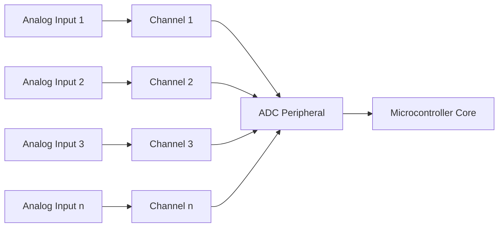

# STM32 ADC Channels

## Introduction

The Analog-to-Digital Converter (ADC) is one of the most important peripherals in the STM32 microcontroller family, allowing you to measure analog signals from sensors, potentiometers, and other analog devices. One of the key features of STM32 ADCs is the ability to use multiple channels, enabling you to read several analog inputs without requiring additional external components.

In this tutorial, we'll explore how STM32 ADC channels work, how to configure them, and how to use them in practical applications. By the end, you'll be able to confidently set up and use multiple ADC channels in your STM32 projects.

## ADC Channel Basics

### What are ADC Channels?

ADC channels are essentially different input pins that can be connected to the ADC peripheral. Each STM32 microcontroller has a specific number of ADC channels, typically ranging from 16 to 24 channels depending on the specific model.

Think of channels as "paths" through which analog signals can reach the ADC converter:



### Channel Mapping to Pins

In STM32 microcontrollers, specific GPIO pins are connected to specific ADC channels. For example, on an STM32F4 device:

- PA0 is connected to ADC1_IN0 (Channel 0 of ADC1)
- PA1 is connected to ADC1_IN1 (Channel 1 of ADC1)
- PA2 is connected to ADC1_IN2 (Channel 2 of ADC1)

And so on. This mapping varies between different STM32 families, so always refer to the datasheet for your specific device.

## Single Channel vs Multi-Channel Operation

STM32 ADCs can operate in different modes:

1. **Single Channel Mode**: The ADC reads from only one channel
2. **Scan Mode**: The ADC automatically scans through a predefined sequence of channels
3. **Continuous Mode**: The ADC continuously samples without need for triggers
4. **Discontinuous Mode**: The ADC samples a subset of channels in the sequence

Let's explore how to configure these modes with practical examples.

## Setting Up a Single ADC Channel

Before diving into multi-channel operations, let's start with a basic single-channel configuration using the STM32CubeIDE and HAL libraries.

### Step 1: Configure GPIO Pin as Analog

```c
// Enable GPIO clock
__HAL_RCC_GPIOA_CLK_ENABLE();

// Configure GPIO pin PA0 as analog
GPIO_InitTypeDef GPIO_InitStruct = {0};
GPIO_InitStruct.Pin = GPIO_PIN_0;
GPIO_InitStruct.Mode = GPIO_MODE_ANALOG;
GPIO_InitStruct.Pull = GPIO_NOPULL;
HAL_GPIO_Init(GPIOA, &GPIO_InitStruct);
```

### Step 2: Configure the ADC

```c
// Enable ADC clock
__HAL_RCC_ADC1_CLK_ENABLE();

// Configure ADC
ADC_HandleTypeDef hadc1 = {0};
hadc1.Instance = ADC1;
hadc1.Init.Resolution = ADC_RESOLUTION_12B;
hadc1.Init.ScanConvMode = DISABLE; // Single channel mode
hadc1.Init.ContinuousConvMode = DISABLE;
hadc1.Init.DiscontinuousConvMode = DISABLE;
hadc1.Init.ExternalTrigConv = ADC_SOFTWARE_START;
hadc1.Init.DataAlign = ADC_DATAALIGN_RIGHT;
hadc1.Init.NbrOfConversion = 1;
HAL_ADC_Init(&hadc1);

// Configure channel
ADC_ChannelConfTypeDef sConfig = {0};
sConfig.Channel = ADC_CHANNEL_0; // PA0 maps to channel 0
sConfig.Rank = 1;
sConfig.SamplingTime = ADC_SAMPLETIME_56CYCLES;
HAL_ADC_ConfigChannel(&hadc1, &sConfig);
```

### Step 3: Read the ADC Value

```c
uint16_t readADC(ADC_HandleTypeDef* hadc) {
    HAL_ADC_Start(hadc);
    HAL_ADC_PollForConversion(hadc, 100);
    uint16_t value = HAL_ADC_GetValue(hadc);
    HAL_ADC_Stop(hadc);
    return value;
}

// Usage example
uint16_t adcValue = readADC(&hadc1);
printf("ADC Value: %d
", adcValue);
```

## Multi-Channel ADC Configuration

Now, let's set up multiple ADC channels. In this example, we'll configure three channels: PA0, PA1, and PA4.

### Step 1: Configure Multiple GPIO Pins as Analog

```c
// Enable GPIO clock
__HAL_RCC_GPIOA_CLK_ENABLE();

// Configure GPIO pins PA0, PA1, and PA4 as analog
GPIO_InitTypeDef GPIO_InitStruct = {0};
GPIO_InitStruct.Pin = GPIO_PIN_0 | GPIO_PIN_1 | GPIO_PIN_4;
GPIO_InitStruct.Mode = GPIO_MODE_ANALOG;
GPIO_InitStruct.Pull = GPIO_NOPULL;
HAL_GPIO_Init(GPIOA, &GPIO_InitStruct);
```

### Step 2: Configure the ADC for Multiple Channels

```c
// Enable ADC clock
__HAL_RCC_ADC1_CLK_ENABLE();

// Configure ADC
ADC_HandleTypeDef hadc1 = {0};
hadc1.Instance = ADC1;
hadc1.Init.Resolution = ADC_RESOLUTION_12B;
hadc1.Init.ScanConvMode = ENABLE; // Enable scan mode for multiple channels
hadc1.Init.ContinuousConvMode = DISABLE;
hadc1.Init.DiscontinuousConvMode = DISABLE;
hadc1.Init.ExternalTrigConv = ADC_SOFTWARE_START;
hadc1.Init.DataAlign = ADC_DATAALIGN_RIGHT;
hadc1.Init.NbrOfConversion = 3; // Number of channels to convert
HAL_ADC_Init(&hadc1);

// Configure channels
ADC_ChannelConfTypeDef sConfig = {0};

// Channel 0 (PA0)
sConfig.Channel = ADC_CHANNEL_0;
sConfig.Rank = 1; // First in sequence
sConfig.SamplingTime = ADC_SAMPLETIME_56CYCLES;
HAL_ADC_ConfigChannel(&hadc1, &sConfig);

// Channel 1 (PA1)
sConfig.Channel = ADC_CHANNEL_1;
sConfig.Rank = 2; // Second in sequence
sConfig.SamplingTime = ADC_SAMPLETIME_56CYCLES;
HAL_ADC_ConfigChannel(&hadc1, &sConfig);

// Channel 4 (PA4)
sConfig.Channel = ADC_CHANNEL_4;
sConfig.Rank = 3; // Third in sequence
sConfig.SamplingTime = ADC_SAMPLETIME_56CYCLES;
HAL_ADC_ConfigChannel(&hadc1, &sConfig);
```

### Step 3: Read Multiple ADC Values

With multi-channel scanning, we need to use DMA (Direct Memory Access) to efficiently transfer multiple conversion results to memory.

```c
#define ADC_BUFFER_SIZE 3
uint16_t adcBuffer[ADC_BUFFER_SIZE];

// Configure DMA
void configureDMA(ADC_HandleTypeDef* hadc) {
    // Enable DMA clock
    __HAL_RCC_DMA2_CLK_ENABLE();
    
    // Configure DMA
    DMA_HandleTypeDef hdma_adc = {0};
    hdma_adc.Instance = DMA2_Stream0;
    hdma_adc.Init.Channel = DMA_CHANNEL_0;
    hdma_adc.Init.Direction = DMA_PERIPH_TO_MEMORY;
    hdma_adc.Init.PeriphInc = DMA_PINC_DISABLE;
    hdma_adc.Init.MemInc = DMA_MINC_ENABLE;
    hdma_adc.Init.PeriphDataAlignment = DMA_PDATAALIGN_HALFWORD;
    hdma_adc.Init.MemDataAlignment = DMA_MDATAALIGN_HALFWORD;
    hdma_adc.Init.Mode = DMA_NORMAL;
    hdma_adc.Init.Priority = DMA_PRIORITY_HIGH;
    hdma_adc.Init.FIFOMode = DMA_FIFOMODE_DISABLE;
    HAL_DMA_Init(&hdma_adc);
    
    // Link DMA to ADC
    __HAL_LINKDMA(hadc, DMA_Handle, hdma_adc);
}

// Start ADC with DMA
void startADC_DMA() {
    HAL_ADC_Start_DMA(&hadc1, (uint32_t*)adcBuffer, ADC_BUFFER_SIZE);
}

// Access the values from the buffer
void printADCValues() {
    printf("Channel 0: %d
", adcBuffer[0]);
    printf("Channel 1: %d
", adcBuffer[1]);
    printf("Channel 4: %d
", adcBuffer[2]);
}
```

## ADC Channel Groups and Injected Channels

STM32 ADCs support two groups of channels:

1. **Regular Group**: The channels we've been discussing so far
2. **Injected Group**: High-priority channels that can interrupt regular conversions

### Configuring Injected Channels

Injected channels are useful when you need to prioritize certain measurements. Here's how to configure them:

```c
// Configure an injected channel
ADC_InjectionConfTypeDef sConfigInjected = {0};
sConfigInjected.InjectedChannel = ADC_CHANNEL_2; // PA2
sConfigInjected.InjectedRank = 1;
sConfigInjected.InjectedNbrOfConversion = 1;
sConfigInjected.InjectedSamplingTime = ADC_SAMPLETIME_56CYCLES;
sConfigInjected.ExternalTrigInjecConv = ADC_INJECTED_SOFTWARE_START;
sConfigInjected.AutoInjectedConv = DISABLE;
sConfigInjected.InjectedDiscontinuousConvMode = DISABLE;
sConfigInjected.InjectedOffset = 0;
HAL_ADCEx_InjectedConfigChannel(&hadc1, &sConfigInjected);

// Read injected channel
void readInjectedChannel() {
    HAL_ADCEx_InjectedStart(&hadc1);
    HAL_ADCEx_InjectedPollForConversion(&hadc1, 100);
    uint16_t value = HAL_ADCEx_InjectedGetValue(&hadc1, ADC_INJECTED_RANK_1);
    HAL_ADCEx_InjectedStop(&hadc1);
    printf("Injected Channel Value: %d
", value);
}
```

## Special ADC Channels

STM32 microcontrollers also include special internal ADC channels that don't correspond to external pins:

1. **Temperature Sensor**: Measures the internal temperature of the chip
2. **VBAT Channel**: Monitors battery voltage
3. **VREFINT Channel**: Provides a reference voltage for calibration

### Reading the Internal Temperature Sensor

```c
// Enable the internal temperature sensor
ADC->CCR |= ADC_CCR_TSVREFE;

// Configure temperature sensor channel
ADC_ChannelConfTypeDef sConfig = {0};
sConfig.Channel = ADC_CHANNEL_TEMPSENSOR;
sConfig.Rank = 1;
sConfig.SamplingTime = ADC_SAMPLETIME_144CYCLES; // Longer sampling time for accuracy
HAL_ADC_ConfigChannel(&hadc1, &sConfig);

// Read and convert temperature
uint16_t readTemperature() {
    HAL_ADC_Start(&hadc1);
    HAL_ADC_PollForConversion(&hadc1, 100);
    uint16_t adcValue = HAL_ADC_GetValue(&hadc1);
    HAL_ADC_Stop(&hadc1);
    
    // Convert ADC value to temperature in degrees Celsius
    // This formula varies by STM32 family - check your reference manual
    float temperature = ((float)adcValue * 3.3f / 4096.0f - 0.76f) / 0.0025f + 25.0f;
    
    return (uint16_t)temperature;
}
```

## Practical Example: Multi-Channel Data Logger

Let's put everything together in a practical example - a multi-channel data logger that reads from three sensors and the internal temperature.

```c
#define NUM_CHANNELS 4
uint16_t adcBuffer[NUM_CHANNELS];

// DMA callback function
void HAL_ADC_ConvCpltCallback(ADC_HandleTypeDef* hadc) {
    // Process the data when DMA transfer is complete
    float sensor1 = (float)adcBuffer[0] * 3.3f / 4096.0f;  // Convert to voltage
    float sensor2 = (float)adcBuffer[1] * 3.3f / 4096.0f;
    float sensor3 = (float)adcBuffer[2] * 3.3f / 4096.0f;
    
    // Convert temperature sensor reading to degrees
    float temperature = ((float)adcBuffer[3] * 3.3f / 4096.0f - 0.76f) / 0.0025f + 25.0f;
    
    // Print or store the values
    printf("Sensor 1: %.2fV
", sensor1);
    printf("Sensor 2: %.2fV
", sensor2);
    printf("Sensor 3: %.2fV
", sensor3);
    printf("Temperature: %.1f°C
", temperature);
    
    // Restart ADC for continuous monitoring
    HAL_ADC_Start_DMA(hadc, (uint32_t*)adcBuffer, NUM_CHANNELS);
}

// Main application
void dataLogger_Init() {
    // Configure GPIO pins
    __HAL_RCC_GPIOA_CLK_ENABLE();
    GPIO_InitTypeDef GPIO_InitStruct = {0};
    GPIO_InitStruct.Pin = GPIO_PIN_0 | GPIO_PIN_1 | GPIO_PIN_4;
    GPIO_InitStruct.Mode = GPIO_MODE_ANALOG;
    GPIO_InitStruct.Pull = GPIO_NOPULL;
    HAL_GPIO_Init(GPIOA, &GPIO_InitStruct);
    
    // Configure ADC
    __HAL_RCC_ADC1_CLK_ENABLE();
    ADC_HandleTypeDef hadc1 = {0};
    hadc1.Instance = ADC1;
    hadc1.Init.Resolution = ADC_RESOLUTION_12B;
    hadc1.Init.ScanConvMode = ENABLE;
    hadc1.Init.ContinuousConvMode = ENABLE;
    hadc1.Init.DiscontinuousConvMode = DISABLE;
    hadc1.Init.ExternalTrigConv = ADC_SOFTWARE_START;
    hadc1.Init.DataAlign = ADC_DATAALIGN_RIGHT;
    hadc1.Init.NbrOfConversion = NUM_CHANNELS;
    HAL_ADC_Init(&hadc1);
    
    // Configure channels
    ADC_ChannelConfTypeDef sConfig = {0};
    
    // Channel 0 (PA0) - Sensor 1
    sConfig.Channel = ADC_CHANNEL_0;
    sConfig.Rank = 1;
    sConfig.SamplingTime = ADC_SAMPLETIME_56CYCLES;
    HAL_ADC_ConfigChannel(&hadc1, &sConfig);
    
    // Channel 1 (PA1) - Sensor 2
    sConfig.Channel = ADC_CHANNEL_1;
    sConfig.Rank = 2;
    sConfig.SamplingTime = ADC_SAMPLETIME_56CYCLES;
    HAL_ADC_ConfigChannel(&hadc1, &sConfig);
    
    // Channel 4 (PA4) - Sensor 3
    sConfig.Channel = ADC_CHANNEL_4;
    sConfig.Rank = 3;
    sConfig.SamplingTime = ADC_SAMPLETIME_56CYCLES;
    HAL_ADC_ConfigChannel(&hadc1, &sConfig);
    
    // Enable temperature sensor
    ADC->CCR |= ADC_CCR_TSVREFE;
    
    // Temperature sensor channel
    sConfig.Channel = ADC_CHANNEL_TEMPSENSOR;
    sConfig.Rank = 4;
    sConfig.SamplingTime = ADC_SAMPLETIME_144CYCLES;
    HAL_ADC_ConfigChannel(&hadc1, &sConfig);
    
    // Configure DMA
    configureDMA(&hadc1);
    
    // Start ADC with DMA
    HAL_ADC_Start_DMA(&hadc1, (uint32_t*)adcBuffer, NUM_CHANNELS);
}
```

## Advanced Channel Features

### ADC Channel Resolution

STM32 ADCs allow you to configure different resolutions per conversion:

```c
// Configure ADC resolution
hadc1.Init.Resolution = ADC_RESOLUTION_12B; // 12-bit resolution (0-4095)
// Other options:
// ADC_RESOLUTION_10B (0-1023)
// ADC_RESOLUTION_8B (0-255)
// ADC_RESOLUTION_6B (0-63)
```

### Sampling Time

Sampling time affects conversion accuracy and speed. Longer sampling times provide more accurate readings but take longer:

```c
// Different sampling time options
sConfig.SamplingTime = ADC_SAMPLETIME_3CYCLES;   // Fastest, less accurate
sConfig.SamplingTime = ADC_SAMPLETIME_15CYCLES;  
sConfig.SamplingTime = ADC_SAMPLETIME_28CYCLES;
sConfig.SamplingTime = ADC_SAMPLETIME_56CYCLES;  // Balance
sConfig.SamplingTime = ADC_SAMPLETIME_84CYCLES;
sConfig.SamplingTime = ADC_SAMPLETIME_112CYCLES;
sConfig.SamplingTime = ADC_SAMPLETIME_144CYCLES;
sConfig.SamplingTime = ADC_SAMPLETIME_480CYCLES; // Slowest, most accurate
```

For high-impedance sources or when precision is critical, use longer sampling times.

## Common Challenges and Solutions

### Challenge: ADC Readings Are Unstable

**Solution**: 
1. Increase sampling time
2. Add external filtering capacitors
3. Use averaging:

```c
uint16_t readADC_Avg(ADC_HandleTypeDef* hadc, uint8_t samples) {
    uint32_t sum = 0;
    
    for(uint8_t i = 0; i < samples; i++) {
        HAL_ADC_Start(hadc);
        HAL_ADC_PollForConversion(hadc, 100);
        sum += HAL_ADC_GetValue(hadc);
        HAL_ADC_Stop(hadc);
    }
    
    return (uint16_t)(sum / samples);
}

// Usage
uint16_t stableValue = readADC_Avg(&hadc1, 10); // Average of 10 samples
```

### Challenge: Slow Conversion Speed

**Solution**:
1. Reduce sampling time
2. Use continuous mode with DMA
3. Use a higher ADC clock frequency (but beware of maximum frequency limits)

## Summary

In this tutorial, we've covered STM32 ADC channels in depth, including:

- Basic concepts of ADC channels and pin mapping
- Single-channel and multi-channel operations
- Using DMA for efficient multi-channel reading
- Special ADC channels like the temperature sensor
- A practical example of a multi-channel data logger
- Advanced features and troubleshooting tips

STM32 ADC channels provide powerful flexibility for analog data acquisition. By understanding how to configure and use multiple channels, you can create sophisticated embedded systems that interact with various sensors and analog inputs efficiently.

## Further Learning

To deepen your understanding of STM32 ADC channels:

1. **Exercises**:
   - Create a project that reads from multiple analog sensors and displays their values on an LCD
   - Implement a data logger that stores ADC readings to an SD card
   - Create a digital voltmeter with different ranges

2. **Advanced Topics to Explore**:
   - ADC calibration techniques
   - Dual/Triple ADC mode for simultaneous sampling
   - ADC with DMA circular mode for continuous monitoring
   - Oversampling to increase effective resolution

Remember, practice is key to mastering STM32 peripherals. Try implementing these concepts in your projects to solidify your understanding.