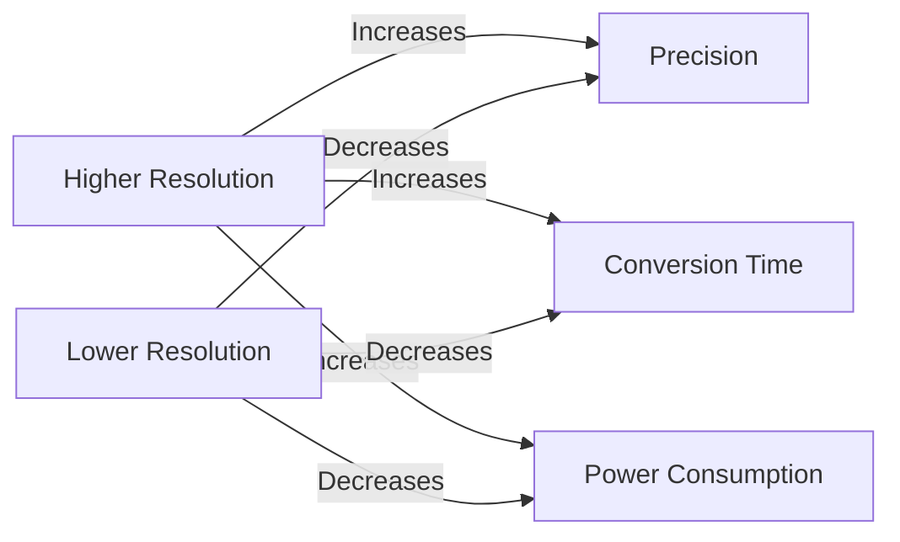

# STM32 ADC Resolution

## Introduction

Analog-to-Digital Converters (ADCs) are essential components in modern microcontrollers that allow us to measure analog signals from the physical world. The **resolution** of an ADC defines its ability to detect small changes in the input voltage, which directly impacts the precision of your measurements.

In this tutorial, we'll explore ADC resolution in STM32 microcontrollers, how to configure it, and why it matters for your embedded applications.

## Understanding ADC Resolution

ADC resolution refers to the number of discrete digital values an ADC can produce to represent analog inputs. It's typically expressed in bits.

For example:
- A 12-bit ADC can represent 2¹² = 4,096 different values
- A 10-bit ADC can represent 2¹⁰ = 1,024 different values
- An 8-bit ADC can represent 2⁸ = 256 different values

Higher resolution means more precise measurements, but sometimes lower resolutions can be beneficial for faster conversion or lower power consumption.

### How Resolution Affects Measurements

The resolution directly affects the smallest change in voltage that can be detected. This smallest detectable change is called the **LSB (Least Significant Bit) voltage** and is calculated as:

```
LSB voltage = Reference Voltage / (2^Resolution bits)
```

For example, with a 3.3V reference voltage:
- 12-bit resolution: 3.3V / 4096 = 0.805 mV per step
- 10-bit resolution: 3.3V / 1024 = 3.22 mV per step
- 8-bit resolution: 3.3V / 256 = 12.89 mV per step

## STM32 ADC Resolution Options

Most STM32 microcontrollers offer configurable ADC resolution. Depending on the specific STM32 family, you can typically select from:

- 12-bit (default in most STM32 devices)
- 10-bit
- 8-bit
- 6-bit (in some models)
- 14-bit and 16-bit (in higher-end models like STM32H7)

## Configuring ADC Resolution

Let's look at how to configure the ADC resolution on an STM32 microcontroller using the STM32CubeHAL library.

### Using STM32CubeHAL

```c
/* ADC handle declaration */
ADC_HandleTypeDef hadc1;

/* ADC initialization function */
void MX_ADC1_Init(void)
{
  /* Initialize ADC handle structure */
  hadc1.Instance = ADC1;
  
  /* ADC initialization configuration */
  hadc1.Init.Resolution = ADC_RESOLUTION_12B; // Set 12-bit resolution
  hadc1.Init.ScanConvMode = DISABLE;
  hadc1.Init.ContinuousConvMode = DISABLE;
  hadc1.Init.DiscontinuousConvMode = DISABLE;
  hadc1.Init.ExternalTrigConvEdge = ADC_EXTERNALTRIGCONVEDGE_NONE;
  hadc1.Init.ExternalTrigConv = ADC_SOFTWARE_START;
  hadc1.Init.DataAlign = ADC_DATAALIGN_RIGHT;
  hadc1.Init.NbrOfConversion = 1;
  hadc1.Init.DMAContinuousRequests = DISABLE;
  hadc1.Init.EOCSelection = ADC_EOC_SINGLE_CONV;
  
  /* Initialize ADC */
  if (HAL_ADC_Init(&hadc1) != HAL_OK)
  {
    Error_Handler();
  }
}
```

To change the resolution, simply modify the `Resolution` field in the initialization structure. Available options include:

```c
hadc1.Init.Resolution = ADC_RESOLUTION_12B; // 12-bit resolution
hadc1.Init.Resolution = ADC_RESOLUTION_10B; // 10-bit resolution
hadc1.Init.Resolution = ADC_RESOLUTION_8B;  // 8-bit resolution
hadc1.Init.Resolution = ADC_RESOLUTION_6B;  // 6-bit resolution (if supported)
```

### Accessing the ADC Value

When reading the ADC conversion result, be aware that the value will be aligned according to your resolution setting:

```c
uint16_t adc_value;

/* Start ADC conversion */
HAL_ADC_Start(&hadc1);
  
/* Wait for conversion to complete */
HAL_ADC_PollForConversion(&hadc1, 100);
  
/* Read the ADC value */
adc_value = HAL_ADC_GetValue(&hadc1);

/* Convert to voltage (assuming 3.3V reference) */
float voltage = adc_value * (3.3f / (float)(1 << 12)); // For 12-bit resolution
```

Note that for different resolutions, you would adjust the divisor:
- 12-bit: `1 << 12` (4096)
- 10-bit: `1 << 10` (1024) 
- 8-bit: `1 << 8` (256)

## Resolution vs. Conversion Time

One important consideration when selecting ADC resolution is the trade-off with conversion time. Higher resolution generally requires longer conversion time:



## Complete Example: Reading Temperature Sensor with Different Resolutions

Here's a complete example that reads an external temperature sensor (like LM35) using different ADC resolutions and compares the results:

```c
#include "main.h"

ADC_HandleTypeDef hadc1;

/* Function prototypes */
void SystemClock_Config(void);
static void MX_GPIO_Init(void);
static void MX_ADC1_Init(uint32_t resolution);
float ReadTemperature(uint32_t resolution);

int main(void)
{
  /* MCU Configuration */
  HAL_Init();
  SystemClock_Config();
  MX_GPIO_Init();
  
  /* Variables to store temperature readings */
  float temp_12bit, temp_10bit, temp_8bit;
  
  while (1)
  {
    /* Read temperature with 12-bit resolution */
    temp_12bit = ReadTemperature(ADC_RESOLUTION_12B);
    
    /* Read temperature with 10-bit resolution */
    temp_10bit = ReadTemperature(ADC_RESOLUTION_10B);
    
    /* Read temperature with 8-bit resolution */
    temp_8bit = ReadTemperature(ADC_RESOLUTION_8B);
    
    /* Wait before next reading */
    HAL_Delay(1000);
  }
}

/* Read temperature function */
float ReadTemperature(uint32_t resolution)
{
  uint16_t adc_value;
  float voltage, temperature;
  
  /* Initialize ADC with specified resolution */
  MX_ADC1_Init(resolution);
  
  /* Configure ADC channel for temperature sensor */
  ADC_ChannelConfTypeDef sConfig = {0};
  sConfig.Channel = ADC_CHANNEL_0;  // Connect LM35 to PA0 (ADC1_IN0)
  sConfig.Rank = 1;
  sConfig.SamplingTime = ADC_SAMPLETIME_56CYCLES;
  HAL_ADC_ConfigChannel(&hadc1, &sConfig);
  
  /* Start ADC conversion */
  HAL_ADC_Start(&hadc1);
  HAL_ADC_PollForConversion(&hadc1, 100);
  
  /* Read ADC value */
  adc_value = HAL_ADC_GetValue(&hadc1);
  
  /* Calculate divisor based on resolution */
  uint32_t divisor;
  switch(resolution) {
    case ADC_RESOLUTION_12B:
      divisor = 4096;
      break;
    case ADC_RESOLUTION_10B:
      divisor = 1024;
      break;
    case ADC_RESOLUTION_8B:
      divisor = 256;
      break;
    default:
      divisor = 4096;
  }
  
  /* Calculate voltage and temperature */
  voltage = adc_value * (3.3f / (float)divisor);
  
  /* LM35 outputs 10mV per degree Celsius */
  temperature = voltage * 100.0f;
  
  return temperature;
}

/* ADC Initialization */
static void MX_ADC1_Init(uint32_t resolution)
{
  /* De-initialize ADC if it was initialized before */
  HAL_ADC_DeInit(&hadc1);
  
  /* Initialize ADC with specified resolution */
  hadc1.Instance = ADC1;
  hadc1.Init.Resolution = resolution;
  hadc1.Init.ScanConvMode = DISABLE;
  hadc1.Init.ContinuousConvMode = DISABLE;
  hadc1.Init.DiscontinuousConvMode = DISABLE;
  hadc1.Init.ExternalTrigConvEdge = ADC_EXTERNALTRIGCONVEDGE_NONE;
  hadc1.Init.ExternalTrigConv = ADC_SOFTWARE_START;
  hadc1.Init.DataAlign = ADC_DATAALIGN_RIGHT;
  hadc1.Init.NbrOfConversion = 1;
  hadc1.Init.DMAContinuousRequests = DISABLE;
  hadc1.Init.EOCSelection = ADC_EOC_SINGLE_CONV;
  
  if (HAL_ADC_Init(&hadc1) != HAL_OK)
  {
    Error_Handler();
  }
}
```

### Example Output

With this code, you might see results like:

```
Temperature readings:
12-bit resolution: 23.42°C (±0.0805°C precision)
10-bit resolution: 23.40°C (±0.322°C precision)
8-bit resolution:  23.35°C (±1.289°C precision)
```

Notice how the lower resolution readings have less precision.

## Real-World Considerations

### When to Use Higher Resolution

Use higher resolution (12-bit or more) for:
- Precision measurements like temperature monitoring
- Scientific instrumentation
- Medical devices
- Voltage monitoring in sensitive circuits

### When to Use Lower Resolution

Consider lower resolution (8 or 10-bit) for:
- Fast-changing signals where conversion speed matters
- Battery-powered applications where power consumption is critical
- Simple applications like light sensors or potentiometer readings
- When you need to process many channels quickly

### Oversampling to Increase Resolution

An interesting technique to increase effective resolution is **oversampling**. By taking multiple samples and averaging them, you can achieve higher effective resolution.

For example, to gain 2 extra bits of resolution:
1. Take 16 samples (2⁴) at your current resolution
2. Sum all samples
3. Divide the sum by 4 (2²)

```c
uint16_t OversampleADC(ADC_HandleTypeDef* hadc, uint8_t extraBits)
{
  uint32_t sum = 0;
  uint16_t samples = 1 << (extraBits * 2); // Number of samples needed
  
  for(uint16_t i = 0; i < samples; i++) {
    HAL_ADC_Start(hadc);
    HAL_ADC_PollForConversion(hadc, 10);
    sum += HAL_ADC_GetValue(hadc);
  }
  
  return sum >> extraBits; // Right shift to divide by 2^extraBits
}

// Usage example: Get 14-bit resolution from 12-bit ADC
uint16_t result = OversampleADC(&hadc1, 2);
```

This technique works well for static or slow-changing signals.

## Summary

ADC resolution is a critical parameter that directly affects the precision of your analog measurements in STM32 microcontrollers. Key points to remember:

- Higher resolution (more bits) provides more precise measurements
- Lower resolution can offer faster conversion times and lower power consumption
- STM32 microcontrollers typically offer configurable resolution (6 to 16 bits depending on the model)
- The resolution selection should match your application's requirements for precision vs. speed
- Techniques like oversampling can be used to effectively increase resolution when needed

## Exercises

1. Configure your STM32 to read a potentiometer at different ADC resolutions and observe the differences in readings.
2. Implement the oversampling technique to achieve 14-bit resolution from a 12-bit ADC.
3. Create a battery voltage monitor that switches to lower resolution when the battery is high, and higher resolution when the battery is low.
4. Compare the conversion time for the same analog input at different resolutions.

## Further Reading

- STM32 ADC calibration techniques
- Differential ADC measurements
- Multi-channel ADC scanning
- DMA with ADC for continuous sampling
- ADC in low-power applications