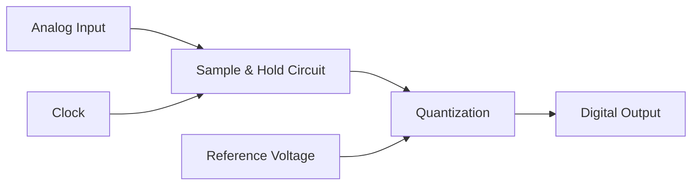

# STM32 ADC Sampling

## Introduction

The Analog-to-Digital Converter (ADC) is one of the most important peripherals in STM32 microcontrollers, bridging the gap between analog signals in the physical world and the digital domain where our code operates. ADCs allow us to measure voltage levels from sensors, potentiometers, audio inputs, and countless other analog sources.

In this tutorial, we'll explore how to set up and use the ADC peripheral on STM32 microcontrollers to sample analog signals. We'll cover the basic concepts, configuration options, and provide practical examples to help you incorporate analog sampling into your embedded projects.

## ADC Basics

### What is an ADC?

An Analog-to-Digital Converter (ADC) transforms a continuous analog voltage into a discrete digital value that can be processed by a microcontroller. The STM32 family includes powerful ADCs with the following key features:

- **Resolution**: Most STM32 ADCs provide 12-bit resolution (yielding values from 0 to 4095), though some offer up to 16-bit resolution
- **Channels**: Multiple input channels allow sampling different analog sources
- **Sampling rates**: From a few samples per second up to several megasamples per second
- **Reference voltage**: Typically uses the microcontroller's supply voltage (often 3.3V) as the maximum voltage reference

### How ADC Sampling Works



The sampling process involves:

1. **Sample and Hold**: Capturing the instantaneous voltage at a precise moment
2. **Quantization**: Converting this voltage to a digital value
3. **Encoding**: Outputting the result as a binary number

For a 12-bit ADC with a reference voltage of 3.3V, the conversion follows this formula:

```
Digital Value = (Analog Voltage / Reference Voltage) × 4095
```

## Setting Up the ADC

Let's look at how to configure the ADC on an STM32 microcontroller. We'll use the STM32F4 series as our example, but the concepts apply to most STM32 families.

### Basic Configuration Using STM32CubeMX

The easiest way to set up the ADC is using STM32CubeMX:

1. Select your microcontroller model
2. In the Pinout & Configuration tab, enable an ADC (e.g., ADC1)
3. Configure a pin as an analog input (e.g., PA0)
4. Configure ADC parameters (resolution, scan mode, etc.)
5. Generate code

### Manual Configuration Using HAL Library

If you prefer setting up the ADC manually through code, here's how to do it using the HAL library:

```c
// ADC handle structure
ADC_HandleTypeDef hadc1;

// ADC initialization function
void MX_ADC1_Init(void)
{
  // Configure ADC settings
  hadc1.Instance = ADC1;
  hadc1.Init.ClockPrescaler = ADC_CLOCK_SYNC_PCLK_DIV4;
  hadc1.Init.Resolution = ADC_RESOLUTION_12B;
  hadc1.Init.ScanConvMode = DISABLE;
  hadc1.Init.ContinuousConvMode = DISABLE;
  hadc1.Init.DiscontinuousConvMode = DISABLE;
  hadc1.Init.ExternalTrigConvEdge = ADC_EXTERNALTRIGCONVEDGE_NONE;
  hadc1.Init.ExternalTrigConv = ADC_SOFTWARE_START;
  hadc1.Init.DataAlign = ADC_DATAALIGN_RIGHT;
  hadc1.Init.NbrOfConversion = 1;
  hadc1.Init.DMAContinuousRequests = DISABLE;
  hadc1.Init.EOCSelection = ADC_EOC_SINGLE_CONV;
  
  // Initialize ADC
  if (HAL_ADC_Init(&hadc1) != HAL_OK)
  {
    Error_Handler();
  }
  
  // Configure channel
  ADC_ChannelConfTypeDef sConfig = {0};
  sConfig.Channel = ADC_CHANNEL_0;        // PA0 pin
  sConfig.Rank = 1;
  sConfig.SamplingTime = ADC_SAMPLETIME_56CYCLES;
  
  if (HAL_ADC_ConfigChannel(&hadc1, &sConfig) != HAL_OK)
  {
    Error_Handler();
  }
}

// MSP initialization function (called by HAL_ADC_Init)
void HAL_ADC_MspInit(ADC_HandleTypeDef* adcHandle)
{
  GPIO_InitTypeDef GPIO_InitStruct = {0};
  
  if(adcHandle->Instance==ADC1)
  {
    // Enable clocks
    __HAL_RCC_ADC1_CLK_ENABLE();
    __HAL_RCC_GPIOA_CLK_ENABLE();
    
    // Configure GPIO pin for analog input
    GPIO_InitStruct.Pin = GPIO_PIN_0;
    GPIO_InitStruct.Mode = GPIO_MODE_ANALOG;
    GPIO_InitStruct.Pull = GPIO_NOPULL;
    HAL_GPIO_Init(GPIOA, &GPIO_InitStruct);
  }
}
```

## Reading ADC Values

Once the ADC is configured, there are several ways to read values:

### Polling Mode

The simplest approach is to read values on demand through polling:

```c
uint16_t ReadADC(void)
{
  // Start ADC conversion
  HAL_ADC_Start(&hadc1);
  
  // Wait for conversion to complete
  HAL_ADC_PollForConversion(&hadc1, 100);
  
  // Read the ADC value
  uint16_t adcValue = HAL_ADC_GetValue(&hadc1);
  
  // Stop ADC conversion
  HAL_ADC_Stop(&hadc1);
  
  return adcValue;
}
```

### Interrupt Mode

For more efficient operation, you can use interrupts:

```c
// Start ADC in interrupt mode
void StartADC_Interrupt(void)
{
  HAL_ADC_Start_IT(&hadc1);
}

// Interrupt callback
void HAL_ADC_ConvCpltCallback(ADC_HandleTypeDef* hadc)
{
  if(hadc->Instance == ADC1)
  {
    uint16_t adcValue = HAL_ADC_GetValue(&hadc1);
    // Process ADC value here
    
    // Restart conversion if continuous mode is disabled
    HAL_ADC_Start_IT(&hadc1);
  }
}
```

### DMA Mode

For continuous sampling at high rates, DMA (Direct Memory Access) is the best option:

```c
#define ADC_BUFFER_SIZE 100
uint16_t adc_buffer[ADC_BUFFER_SIZE];

void StartADC_DMA(void)
{
  // Start ADC with DMA
  HAL_ADC_Start_DMA(&hadc1, (uint32_t*)adc_buffer, ADC_BUFFER_SIZE);
}

// DMA complete callback
void HAL_ADC_ConvCpltCallback(ADC_HandleTypeDef* hadc)
{
  if(hadc->Instance == ADC1)
  {
    // Buffer is now filled with ADC values
    // Process the data here
  }
}
```

## Advanced ADC Features

### Multi-Channel Scanning

To sample multiple channels sequentially:

```c
void MX_ADC1_Init_MultiChannel(void)
{
  // Basic ADC configuration (similar to above)
  hadc1.Instance = ADC1;
  hadc1.Init.ScanConvMode = ENABLE;  // Enable scan mode
  hadc1.Init.NbrOfConversion = 3;    // Number of channels to scan
  
  // Initialize ADC
  HAL_ADC_Init(&hadc1);
  
  // Configure Channel 0 (PA0)
  ADC_ChannelConfTypeDef sConfig = {0};
  sConfig.Channel = ADC_CHANNEL_0;
  sConfig.Rank = 1;
  sConfig.SamplingTime = ADC_SAMPLETIME_56CYCLES;
  HAL_ADC_ConfigChannel(&hadc1, &sConfig);
  
  // Configure Channel 1 (PA1)
  sConfig.Channel = ADC_CHANNEL_1;
  sConfig.Rank = 2;
  HAL_ADC_ConfigChannel(&hadc1, &sConfig);
  
  // Configure Channel 4 (PA4)
  sConfig.Channel = ADC_CHANNEL_4;
  sConfig.Rank = 3;
  HAL_ADC_ConfigChannel(&hadc1, &sConfig);
}
```

### Adjusting Sampling Time

The sampling time affects conversion accuracy and speed:

```c
// Options for sampling time include:
// ADC_SAMPLETIME_3CYCLES
// ADC_SAMPLETIME_15CYCLES
// ADC_SAMPLETIME_28CYCLES
// ADC_SAMPLETIME_56CYCLES
// ADC_SAMPLETIME_84CYCLES
// ADC_SAMPLETIME_112CYCLES
// ADC_SAMPLETIME_144CYCLES
// ADC_SAMPLETIME_480CYCLES

// Longer sampling time = more accurate but slower
sConfig.SamplingTime = ADC_SAMPLETIME_144CYCLES;
```

### Internal Channels

STM32 microcontrollers provide special ADC channels for internal measurements:

```c
// Temperature sensor
sConfig.Channel = ADC_CHANNEL_TEMPSENSOR;

// Internal reference voltage
sConfig.Channel = ADC_CHANNEL_VREFINT;

// Battery voltage monitoring
sConfig.Channel = ADC_CHANNEL_VBAT;
```

## Practical Example: Temperature Sensor Reading

Let's create a complete example that reads an analog temperature sensor (such as LM35) and converts the reading to degrees Celsius:

```c
#include "main.h"

ADC_HandleTypeDef hadc1;

void SystemClock_Config(void);
static void MX_GPIO_Init(void);
static void MX_ADC1_Init(void);
float ReadTemperature(void);

int main(void)
{
  HAL_Init();
  SystemClock_Config();
  MX_GPIO_Init();
  MX_ADC1_Init();
  
  while (1)
  {
    float temperature = ReadTemperature();
    
    // Do something with the temperature value
    // For example, transmit via UART or display on LCD
    
    HAL_Delay(1000); // Read temperature every second
  }
}

float ReadTemperature(void)
{
  // Start ADC conversion
  HAL_ADC_Start(&hadc1);
  
  // Wait for conversion to complete
  HAL_ADC_PollForConversion(&hadc1, 100);
  
  // Read the ADC value
  uint16_t adcValue = HAL_ADC_GetValue(&hadc1);
  
  // Stop ADC conversion
  HAL_ADC_Stop(&hadc1);
  
  // Convert ADC value to voltage (mV)
  // For 12-bit ADC with 3.3V reference
  float voltage = (adcValue * 3300.0f) / 4095.0f;
  
  // Convert voltage to temperature (LM35: 10mV per degree Celsius)
  float temperature = voltage / 10.0f;
  
  return temperature;
}

static void MX_ADC1_Init(void)
{
  // ADC initialization code (as shown in previous examples)
}
```

## Real-World Application: Digital Voltmeter

Let's build a simple digital voltmeter using the ADC:

```c
#include "main.h"
#include "lcd.h"  // Assuming you have an LCD library

ADC_HandleTypeDef hadc1;

void SystemClock_Config(void);
static void MX_GPIO_Init(void);
static void MX_ADC1_Init(void);
float ReadVoltage(void);

int main(void)
{
  HAL_Init();
  SystemClock_Config();
  MX_GPIO_Init();
  MX_ADC1_Init();
  LCD_Init();  // Initialize LCD
  
  LCD_Clear();
  LCD_SetCursor(0, 0);
  LCD_Print("Digital Voltmeter");
  
  while (1)
  {
    float voltage = ReadVoltage();
    
    char voltageStr[16];
    sprintf(voltageStr, "%.3f V", voltage);
    
    LCD_SetCursor(0, 1);
    LCD_Print(voltageStr);
    
    HAL_Delay(500); // Update every 500ms
  }
}

float ReadVoltage(void)
{
  // Start ADC conversion
  HAL_ADC_Start(&hadc1);
  HAL_ADC_PollForConversion(&hadc1, 100);
  uint16_t adcValue = HAL_ADC_GetValue(&hadc1);
  HAL_ADC_Stop(&hadc1);
  
  // Convert ADC value to voltage
  // Note: This assumes a voltage divider if measuring >3.3V
  // For example, with 10k:1k divider, multiply by 11
  float voltage = (adcValue * 3.3f * 11.0f) / 4095.0f;
  
  return voltage;
}

// ADC and GPIO initialization functions...
```

## Common Issues and Troubleshooting

### Noisy Readings

If your ADC readings are noisy, try these solutions:

1. **Add bypass capacitors** (0.1µF) close to the analog input pins
2. **Increase sampling time** to allow the sampling capacitor to charge fully
3. **Use averaging** to reduce noise:

```c
uint16_t ReadADC_Averaged(uint8_t samples)
{
  uint32_t sum = 0;
  
  for(uint8_t i = 0; i < samples; i++)
  {
    HAL_ADC_Start(&hadc1);
    HAL_ADC_PollForConversion(&hadc1, 100);
    sum += HAL_ADC_GetValue(&hadc1);
    HAL_ADC_Stop(&hadc1);
  }
  
  return (uint16_t)(sum / samples);
}
```

### Inaccurate Readings

For more accurate readings:

1. **Use an external voltage reference** instead of the microcontroller's power supply
2. **Calibrate the ADC** before use:

```c
void ADC_Calibrate(void)
{
  // For STM32F4, calibration is automatic during initialization
  
  // For STM32F1, you can manually calibrate:
  // HAL_ADCEx_Calibration_Start(&hadc1);
}
```

## Summary

In this tutorial, we've covered:

- The basics of ADC operation and how it converts analog signals to digital values
- Different ways to configure and initialize the ADC peripheral on STM32 microcontrollers
- Methods for reading ADC values: polling, interrupt, and DMA
- Advanced features like multi-channel scanning and internal channels
- Practical examples including temperature sensing and a digital voltmeter
- Troubleshooting common issues with ADC readings

The ADC is an essential peripheral that opens up a world of possibilities for your microcontroller projects, allowing them to interact with analog sensors and signals. With the knowledge from this tutorial, you should be able to incorporate analog sampling into your STM32 applications.

## Exercises

1. Create a simple light meter using an LDR (Light Dependent Resistor) and the ADC.
2. Build a data logger that samples an analog input and stores the values in memory.
3. Implement a system that uses multiple ADC channels to read different sensors simultaneously.
4. Design a digital oscilloscope that captures and displays waveforms from an analog input.
5. Create a battery monitor that measures voltage and estimates remaining battery life.

## Further Resources

- ST's official documentation on ADC peripherals
- STM32 HAL ADC driver documentation
- STM32CubeIDE and STM32CubeMX tutorials for configuring ADCs graphically
- Application notes on improving ADC performance and accuracy