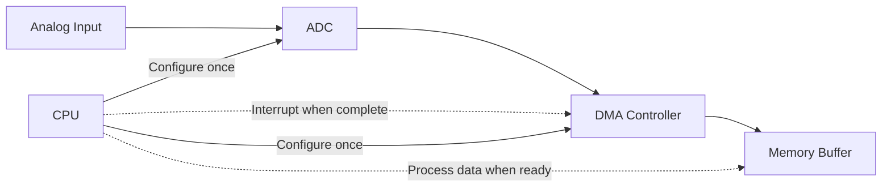

# STM32 ADC with DMA

## Introduction

When working with STM32 microcontrollers, you'll often need to read analog signals from sensors, potentiometers, or other analog devices. The STM32's Analog-to-Digital Converter (ADC) allows you to convert these analog signals into digital values that your program can process. However, continuously polling the ADC can consume significant CPU resources.

This is where Direct Memory Access (DMA) comes to the rescue. DMA allows data to be transferred between peripherals and memory without CPU intervention, freeing up your processor for other tasks. When combined with the ADC, DMA enables efficient, continuous analog data acquisition that runs in the background while your CPU handles other operations.

In this tutorial, we'll learn how to configure and use the STM32 ADC with DMA to efficiently collect analog data.

## Understanding ADC and DMA on STM32

### ADC Basics

The Analog-to-Digital Converter (ADC) in STM32 microcontrollers converts continuous analog signals into discrete digital values. Key features include:

- 12-bit resolution (4096 levels) on most STM32 devices
- Multiple input channels
- Configurable sampling rates
- Single, continuous, or scan conversion modes

### DMA Basics

Direct Memory Access (DMA) is a feature that allows data transfer between peripherals and memory without CPU intervention. Benefits include:

- Reduced CPU overhead
- Higher data throughput
- Parallel operation (CPU can perform other tasks)
- Automatic memory operations

### How They Work Together

When ADC and DMA work together:

1. The ADC performs conversions at configured intervals
2. DMA automatically transfers each conversion result to a memory buffer
3. The CPU is free to perform other tasks
4. After the buffer is filled, an interrupt can notify the program

This process is visualized in the diagram below:



## Setting Up ADC with DMA

### Hardware Requirements

To follow along with this tutorial, you'll need:

- An STM32 development board (like the Nucleo or Discovery series)
- An analog input source (potentiometer, sensor, etc.)
- ST-Link programmer (usually included with development boards)
- STM32CubeIDE or similar development environment

### Basic Configuration Steps

Let's walk through the process of setting up ADC with DMA:

1. Configure the GPIO pin as an analog input
2. Set up the ADC (resolution, clock, sampling time)
3. Configure the DMA (source, destination, transfer size)
4. Start the ADC with DMA

### Complete Example

Here's a complete example showing how to read an analog value from PA0 using ADC1 with DMA:

```c
#include "main.h"

ADC_HandleTypeDef hadc1;
DMA_HandleTypeDef hdma_adc1;
uint16_t adc_value[1]; // Buffer to store ADC conversion result

void SystemClock_Config(void);
static void MX_GPIO_Init(void);
static void MX_DMA_Init(void);
static void MX_ADC1_Init(void);

int main(void)
{
  /* MCU Configuration */
  HAL_Init();
  SystemClock_Config();
  
  /* Initialize peripherals */
  MX_GPIO_Init();
  MX_DMA_Init();
  MX_ADC1_Init();
  
  /* Start ADC with DMA */
  HAL_ADC_Start_DMA(&hadc1, (uint32_t*)adc_value, 1);
  
  /* Infinite loop */
  while (1)
  {
    /* adc_value now contains the most recent conversion result */
    /* Your application code here */
    HAL_Delay(100); // Adjust as needed
  }
}

/* ADC1 initialization function */
static void MX_ADC1_Init(void)
{
  ADC_ChannelConfTypeDef sConfig = {0};
  
  /* Configure the ADC peripheral */
  hadc1.Instance = ADC1;
  hadc1.Init.ClockPrescaler = ADC_CLOCK_SYNC_PCLK_DIV4;
  hadc1.Init.Resolution = ADC_RESOLUTION_12B;
  hadc1.Init.ScanConvMode = DISABLE;
  hadc1.Init.ContinuousConvMode = ENABLE;
  hadc1.Init.DiscontinuousConvMode = DISABLE;
  hadc1.Init.ExternalTrigConvEdge = ADC_EXTERNALTRIGCONVEDGE_NONE;
  hadc1.Init.ExternalTrigConv = ADC_SOFTWARE_START;
  hadc1.Init.DataAlign = ADC_DATAALIGN_RIGHT;
  hadc1.Init.NbrOfConversion = 1;
  hadc1.Init.DMAContinuousRequests = ENABLE;
  hadc1.Init.EOCSelection = ADC_EOC_SINGLE_CONV;
  HAL_ADC_Init(&hadc1);
  
  /* Configure ADC channel */
  sConfig.Channel = ADC_CHANNEL_0; // PA0
  sConfig.Rank = 1;
  sConfig.SamplingTime = ADC_SAMPLETIME_56CYCLES;
  HAL_ADC_ConfigChannel(&hadc1, &sConfig);
}

/* DMA initialization function */
static void MX_DMA_Init(void)
{
  /* DMA controller clock enable */
  __HAL_RCC_DMA2_CLK_ENABLE();
  
  /* Configure DMA for ADC1 */
  hdma_adc1.Instance = DMA2_Stream0;
  hdma_adc1.Init.Channel = DMA_CHANNEL_0;
  hdma_adc1.Init.Direction = DMA_PERIPH_TO_MEMORY;
  hdma_adc1.Init.PeriphInc = DMA_PINC_DISABLE;
  hdma_adc1.Init.MemInc = DMA_MINC_ENABLE;
  hdma_adc1.Init.PeriphDataAlignment = DMA_PDATAALIGN_HALFWORD;
  hdma_adc1.Init.MemDataAlignment = DMA_MDATAALIGN_HALFWORD;
  hdma_adc1.Init.Mode = DMA_CIRCULAR;
  hdma_adc1.Init.Priority = DMA_PRIORITY_LOW;
  hdma_adc1.Init.FIFOMode = DMA_FIFOMODE_DISABLE;
  HAL_DMA_Init(&hdma_adc1);
  
  /* Associate the DMA handle with the ADC handle */
  __HAL_LINKDMA(&hadc1, DMA_Handle, hdma_adc1);
  
  /* DMA interrupt configuration */
  HAL_NVIC_SetPriority(DMA2_Stream0_IRQn, 0, 0);
  HAL_NVIC_EnableIRQ(DMA2_Stream0_IRQn);
}

/* This function is called when ADC conversion completes */
void HAL_ADC_ConvCpltCallback(ADC_HandleTypeDef* hadc)
{
  if(hadc->Instance == ADC1)
  {
    /* Processing after DMA transfer complete */
    /* This is optional - with circular DMA, the buffer always contains the latest value */
  }
}
```

### Key Points to Note

1. We enable continuous conversion mode (`ContinuousConvMode = ENABLE`)
2. We enable DMA continuous requests (`DMAContinuousRequests = ENABLE`)
3. We configure DMA in circular mode (`Mode = DMA_CIRCULAR`)
4. The ADC value is automatically updated in the `adc_value` buffer

## Multi-Channel ADC with DMA

Often, you'll need to read multiple analog channels. Let's expand our example to read from three channels (PA0, PA1, and PA4):

```c
#include "main.h"

ADC_HandleTypeDef hadc1;
DMA_HandleTypeDef hdma_adc1;
uint16_t adc_values[3]; // Buffer to store ADC conversion results for 3 channels

void SystemClock_Config(void);
static void MX_GPIO_Init(void);
static void MX_DMA_Init(void);
static void MX_ADC1_Init(void);

int main(void)
{
  /* MCU Configuration */
  HAL_Init();
  SystemClock_Config();
  
  /* Initialize peripherals */
  MX_GPIO_Init();
  MX_DMA_Init();
  MX_ADC1_Init();
  
  /* Start ADC with DMA */
  HAL_ADC_Start_DMA(&hadc1, (uint32_t*)adc_values, 3);
  
  /* Infinite loop */
  while (1)
  {
    /* adc_values[0] contains the value from channel 0 (PA0) */
    /* adc_values[1] contains the value from channel 1 (PA1) */
    /* adc_values[2] contains the value from channel 4 (PA4) */
    
    /* Your application code here */
    HAL_Delay(100); // Adjust as needed
  }
}

/* ADC1 initialization function */
static void MX_ADC1_Init(void)
{
  ADC_ChannelConfTypeDef sConfig = {0};
  
  /* Configure the ADC peripheral */
  hadc1.Instance = ADC1;
  hadc1.Init.ClockPrescaler = ADC_CLOCK_SYNC_PCLK_DIV4;
  hadc1.Init.Resolution = ADC_RESOLUTION_12B;
  hadc1.Init.ScanConvMode = ENABLE; // Enable scan mode for multiple channels
  hadc1.Init.ContinuousConvMode = ENABLE;
  hadc1.Init.DiscontinuousConvMode = DISABLE;
  hadc1.Init.ExternalTrigConvEdge = ADC_EXTERNALTRIGCONVEDGE_NONE;
  hadc1.Init.ExternalTrigConv = ADC_SOFTWARE_START;
  hadc1.Init.DataAlign = ADC_DATAALIGN_RIGHT;
  hadc1.Init.NbrOfConversion = 3; // Number of channels to convert
  hadc1.Init.DMAContinuousRequests = ENABLE;
  hadc1.Init.EOCSelection = ADC_EOC_SEQ_CONV; // End of sequence instead of single conversion
  HAL_ADC_Init(&hadc1);
  
  /* Configure ADC channel 0 (PA0) */
  sConfig.Channel = ADC_CHANNEL_0;
  sConfig.Rank = 1;
  sConfig.SamplingTime = ADC_SAMPLETIME_56CYCLES;
  HAL_ADC_ConfigChannel(&hadc1, &sConfig);
  
  /* Configure ADC channel 1 (PA1) */
  sConfig.Channel = ADC_CHANNEL_1;
  sConfig.Rank = 2;
  HAL_ADC_ConfigChannel(&hadc1, &sConfig);
  
  /* Configure ADC channel 4 (PA4) */
  sConfig.Channel = ADC_CHANNEL_4;
  sConfig.Rank = 3;
  HAL_ADC_ConfigChannel(&hadc1, &sConfig);
}

/* DMA initialization function remains the same as the previous example */
/* HAL_ADC_ConvCpltCallback remains the same as the previous example */
```

### Key Differences for Multi-Channel:

1. We enable scan mode (`ScanConvMode = ENABLE`)
2. We set the number of conversions to 3 (`NbrOfConversion = 3`)
3. We use end of sequence instead of single conversion (`EOCSelection = ADC_EOC_SEQ_CONV`)
4. We configure each channel with a different rank

## Real-World Application: Temperature Monitoring System

Let's create a practical example: a temperature monitoring system that reads from multiple temperature sensors and controls a cooling fan based on the highest temperature.

```c
#include "main.h"

ADC_HandleTypeDef hadc1;
DMA_HandleTypeDef hdma_adc1;
TIM_HandleTypeDef htim3;

#define NUM_SENSORS 3
#define TEMP_THRESHOLD_LOW  30  // 30°C
#define TEMP_THRESHOLD_HIGH 40  // 40°C

uint16_t adc_values[NUM_SENSORS];
float temperatures[NUM_SENSORS];

void SystemClock_Config(void);
static void MX_GPIO_Init(void);
static void MX_DMA_Init(void);
static void MX_ADC1_Init(void);
static void MX_TIM3_Init(void);
static float ConvertToTemperature(uint16_t adc_value);
static void ControlFan(float max_temp);

int main(void)
{
  /* MCU Configuration */
  HAL_Init();
  SystemClock_Config();
  
  /* Initialize peripherals */
  MX_GPIO_Init();
  MX_DMA_Init();
  MX_ADC1_Init();
  MX_TIM3_Init();
  
  /* Start PWM for fan control */
  HAL_TIM_PWM_Start(&htim3, TIM_CHANNEL_1);
  
  /* Start ADC with DMA */
  HAL_ADC_Start_DMA(&hadc1, (uint32_t*)adc_values, NUM_SENSORS);
  
  /* Infinite loop */
  while (1)
  {
    /* Convert ADC values to temperatures */
    float max_temp = 0;
    for(int i = 0; i < NUM_SENSORS; i++) {
      temperatures[i] = ConvertToTemperature(adc_values[i]);
      if(temperatures[i] > max_temp) {
        max_temp = temperatures[i];
      }
    }
    
    /* Control fan based on max temperature */
    ControlFan(max_temp);
    
    HAL_Delay(1000); // Update every second
  }
}

/* Convert ADC value to temperature (assuming LM35 sensor: 10mV/°C) */
static float ConvertToTemperature(uint16_t adc_value)
{
  /* For 12-bit ADC with 3.3V reference */
  float voltage = (adc_value * 3.3f) / 4096.0f;
  
  /* LM35 outputs 10mV per degree Celsius */
  return voltage * 100.0f;
}

/* Control fan speed based on temperature */
static void ControlFan(float max_temp)
{
  uint32_t pwm_value;
  
  if(max_temp < TEMP_THRESHOLD_LOW) {
    /* Below low threshold - fan off */
    pwm_value = 0;
  } 
  else if(max_temp > TEMP_THRESHOLD_HIGH) {
    /* Above high threshold - fan at maximum */
    pwm_value = 1000; // Assuming timer period is 1000
  }
  else {
    /* Between thresholds - proportional control */
    float ratio = (max_temp - TEMP_THRESHOLD_LOW) / (TEMP_THRESHOLD_HIGH - TEMP_THRESHOLD_LOW);
    pwm_value = (uint32_t)(ratio * 1000);
  }
  
  /* Update PWM value */
  __HAL_TIM_SET_COMPARE(&htim3, TIM_CHANNEL_1, pwm_value);
}

/* ADC1 initialization function */
static void MX_ADC1_Init(void)
{
  ADC_ChannelConfTypeDef sConfig = {0};
  
  /* Configure the ADC peripheral */
  hadc1.Instance = ADC1;
  hadc1.Init.ClockPrescaler = ADC_CLOCK_SYNC_PCLK_DIV4;
  hadc1.Init.Resolution = ADC_RESOLUTION_12B;
  hadc1.Init.ScanConvMode = ENABLE;
  hadc1.Init.ContinuousConvMode = ENABLE;
  hadc1.Init.DiscontinuousConvMode = DISABLE;
  hadc1.Init.ExternalTrigConvEdge = ADC_EXTERNALTRIGCONVEDGE_NONE;
  hadc1.Init.ExternalTrigConv = ADC_SOFTWARE_START;
  hadc1.Init.DataAlign = ADC_DATAALIGN_RIGHT;
  hadc1.Init.NbrOfConversion = NUM_SENSORS;
  hadc1.Init.DMAContinuousRequests = ENABLE;
  hadc1.Init.EOCSelection = ADC_EOC_SEQ_CONV;
  HAL_ADC_Init(&hadc1);
  
  /* Configure ADC channels for temperature sensors */
  sConfig.SamplingTime = ADC_SAMPLETIME_56CYCLES;
  
  sConfig.Channel = ADC_CHANNEL_0; // Sensor 1 on PA0
  sConfig.Rank = 1;
  HAL_ADC_ConfigChannel(&hadc1, &sConfig);
  
  sConfig.Channel = ADC_CHANNEL_1; // Sensor 2 on PA1
  sConfig.Rank = 2;
  HAL_ADC_ConfigChannel(&hadc1, &sConfig);
  
  sConfig.Channel = ADC_CHANNEL_4; // Sensor 3 on PA4
  sConfig.Rank = 3;
  HAL_ADC_ConfigChannel(&hadc1, &sConfig);
}

/* TIM3 initialization function for PWM fan control */
static void MX_TIM3_Init(void)
{
  TIM_ClockConfigTypeDef sClockSourceConfig = {0};
  TIM_MasterConfigTypeDef sMasterConfig = {0};
  TIM_OC_InitTypeDef sConfigOC = {0};
  
  htim3.Instance = TIM3;
  htim3.Init.Prescaler = 84-1; // For 84MHz clock
  htim3.Init.CounterMode = TIM_COUNTERMODE_UP;
  htim3.Init.Period = 1000-1; // PWM frequency = 84MHz / 84 / 1000 = 1kHz
  htim3.Init.ClockDivision = TIM_CLOCKDIVISION_DIV1;
  HAL_TIM_Base_Init(&htim3);
  
  sClockSourceConfig.ClockSource = TIM_CLOCKSOURCE_INTERNAL;
  HAL_TIM_ConfigClockSource(&htim3, &sClockSourceConfig);
  
  HAL_TIM_PWM_Init(&htim3);
  
  sMasterConfig.MasterOutputTrigger = TIM_TRGO_RESET;
  sMasterConfig.MasterSlaveMode = TIM_MASTERSLAVEMODE_DISABLE;
  HAL_TIMEx_MasterConfigSynchronization(&htim3, &sMasterConfig);
  
  sConfigOC.OCMode = TIM_OCMODE_PWM1;
  sConfigOC.Pulse = 0; // Start with fan off
  sConfigOC.OCPolarity = TIM_OCPOLARITY_HIGH;
  sConfigOC.OCFastMode = TIM_OCFAST_DISABLE;
  HAL_TIM_PWM_ConfigChannel(&htim3, &sConfigOC, TIM_CHANNEL_1);
}

/* DMA and GPIO initialization functions are omitted for brevity */
```

## Performance Considerations

When working with ADC and DMA, keep these performance factors in mind:

### Sampling Rate

The maximum sampling rate depends on:
- ADC clock frequency
- Sampling time
- Resolution
- Number of channels

For example, with a 12-bit resolution, 84MHz APB2 clock, 4x prescaler, and 56-cycle sampling time:
- Single channel: ~84MHz / 4 / (12 + 56) = ~160kHz
- Three channels: ~160kHz / 3 = ~53kHz per channel

### Memory Usage

Consider the memory needed for your buffer:
- 16-bit per sample × Number of samples
- For circular mode, ensure the buffer is large enough

### CPU Load

With DMA, CPU load for ADC operations is minimal, but consider:
- Processing the collected data
- Interrupt handling overhead
- Buffer management

## Troubleshooting ADC DMA Setup

### Common Issues

1. **ADC readings are incorrect or unstable**
   - Check analog input connections
   - Verify power supply stability
   - Add decoupling capacitors near ADC pins

2. **DMA transfers not working**
   - Verify DMA stream and channel settings
   - Check that DMA is enabled for the ADC
   - Ensure buffer alignment is correct

3. **System crashes or hangs**
   - Check interrupt priorities
   - Verify buffer sizes and memory allocation
   - Ensure you're not modifying the buffer while DMA is active

### Debugging Tips

1. Use breakpoints and inspect the ADC and DMA registers
2. Add debug output to monitor conversion values
3. Start with a simple single-channel configuration and build up
4. Check that all clocks are enabled properly

## Summary

In this tutorial, we've covered:

- The basics of ADC and DMA in STM32 microcontrollers
- How to configure ADC with DMA for single and multiple channels
- A practical temperature monitoring application
- Performance considerations and troubleshooting tips

The combination of ADC and DMA is powerful for analog data acquisition, allowing your application to read analog signals efficiently without taxing the CPU. This approach is ideal for applications like sensor monitoring, signal processing, and data logging.

## Exercises

1. Modify the temperature monitoring system to add an LCD display that shows all sensor readings.
2. Implement an averaging filter to reduce noise in the ADC readings.
3. Create a data logger that stores ADC values in an array and outputs them over UART.
4. Add threshold detection that triggers an interrupt when a value exceeds a predefined limit.
5. Implement a system that alternates between high-speed and low-speed sampling to save power.

## Additional Resources

- [STM32 Reference Manual](https://www.st.com/resource/en/reference_manual/)
- [STM32 HAL ADC Driver Documentation](https://www.st.com/resource/en/user_manual/)
- [STM32 DMA Application Note](https://www.st.com/resource/en/application_note/)
- [STM32CubeIDE User Guide](https://www.st.com/resource/en/user_manual/)