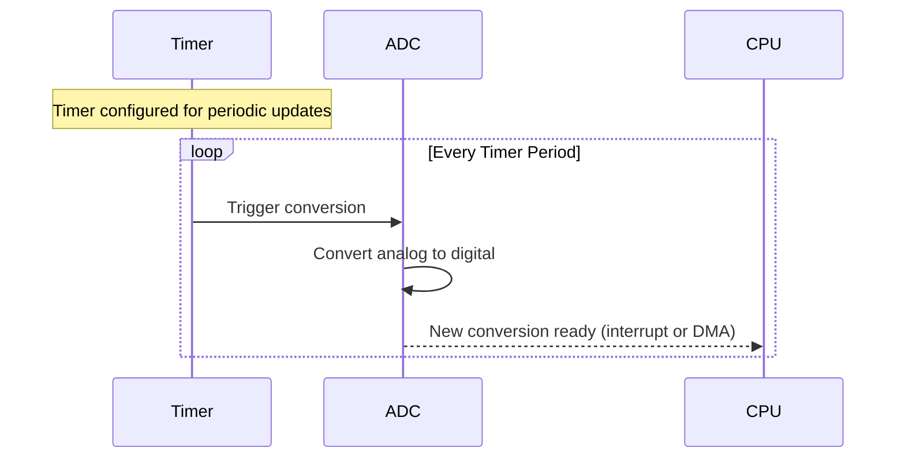

# STM32 ADC Triggering

## Introduction

ADC (Analog-to-Digital Converter) triggering is a critical feature in STM32 microcontrollers that determines when and how analog samples are taken. Rather than continuously sampling an analog signal, triggering allows you to precisely control the timing of conversions based on specific events or conditions. This capability is essential for applications requiring synchronized sampling, power efficiency, or precise timing in data acquisition.

In this guide, we'll explore the various ADC triggering mechanisms available on STM32 microcontrollers, how to configure them, and practical examples of their applications. By the end, you'll understand how to effectively integrate ADC triggering into your embedded projects.

## ADC Triggering Basics

At its core, ADC triggering provides control over the exact moment when an analog-to-digital conversion begins. STM32 microcontrollers offer several triggering options, giving you flexibility in designing your analog data acquisition system.

### Why Use ADC Triggering?

Without triggering, you would need to manually start each conversion or use continuous conversion mode (which constantly samples regardless of when you actually need the data). Triggering solves several problems:

1. **Synchronization** - Align ADC sampling with specific system events
2. **Power efficiency** - Sample only when needed rather than continuously
3. **Precise timing** - Get consistent time intervals between samples
4. **Resource optimization** - Free up the CPU from manually starting conversions

## STM32 ADC Triggering Modes

STM32 microcontrollers typically support the following triggering mechanisms:

1. **Software triggering** - Conversion starts when triggered by software
2. **Hardware triggering** - Conversion starts based on hardware events like:
   - Timer events
   - External pins
   - Internal signals

Let's examine each of these in detail.

### Software Triggering

Software triggering is the simplest form, where the conversion begins when explicitly commanded by your code. This is useful when you need manual control over the sampling process.

```c
// Start ADC conversion with software trigger
HAL_ADC_Start(&hadc1);  // For single conversion
// OR
HAL_ADC_Start_IT(&hadc1);  // With interrupt
// OR
HAL_ADC_Start_DMA(&hadc1, buffer, length);  // With DMA
```

While simple to implement, software triggering has limitations:
- Less precise timing (affected by code execution)
- Higher CPU overhead (requires constant software intervention)
- More difficult to synchronize with external events

### Timer-Based Triggering

Timer triggering allows you to initiate ADC conversions at precise time intervals or at specific points in a timer cycle. This is particularly useful for:
- Signal sampling at exact frequencies
- Synchronized sampling across multiple channels
- Power-efficient operation with predictable timing

Here's a diagram showing the relationship between timer events and ADC conversions:



The following code example shows how to configure a timer to trigger ADC conversions:

```c
void ConfigureTimerTriggeredADC(void)
{
    // 1. Configure ADC
    ADC_HandleTypeDef hadc1;
    hadc1.Instance = ADC1;
    hadc1.Init.ClockPrescaler = ADC_CLOCK_SYNC_PCLK_DIV4;
    hadc1.Init.Resolution = ADC_RESOLUTION_12B;
    hadc1.Init.ScanConvMode = DISABLE;
    hadc1.Init.ContinuousConvMode = DISABLE;  // Important: Disable continuous mode
    hadc1.Init.DiscontinuousConvMode = DISABLE;
    hadc1.Init.ExternalTrigConv = ADC_EXTERNALTRIGCONV_T3_TRGO;  // Use Timer3 as trigger
    hadc1.Init.ExternalTrigConvEdge = ADC_EXTERNALTRIGCONVEDGE_RISING;  // Trigger on rising edge
    hadc1.Init.DataAlign = ADC_DATAALIGN_RIGHT;
    hadc1.Init.NbrOfConversion = 1;
    HAL_ADC_Init(&hadc1);
    
    // 2. Configure the ADC channel
    ADC_ChannelConfTypeDef sConfig;
    sConfig.Channel = ADC_CHANNEL_0;
    sConfig.Rank = 1;
    sConfig.SamplingTime = ADC_SAMPLETIME_56CYCLES;
    HAL_ADC_ConfigChannel(&hadc1, &sConfig);
    
    // 3. Configure Timer3 to generate trigger
    TIM_HandleTypeDef htim3;
    htim3.Instance = TIM3;
    htim3.Init.Prescaler = 7999;  // Adjust based on your clock and needs
    htim3.Init.CounterMode = TIM_COUNTERMODE_UP;
    htim3.Init.Period = 999;  // Trigger every 1000 counts (adjust as needed)
    htim3.Init.ClockDivision = TIM_CLOCKDIVISION_DIV1;
    HAL_TIM_Base_Init(&htim3);
    
    // 4. Configure Timer3 to output trigger signal
    TIM_MasterConfigTypeDef sMasterConfig;
    sMasterConfig.MasterOutputTrigger = TIM_TRGO_UPDATE;  // Trigger on timer update event
    sMasterConfig.MasterSlaveMode = TIM_MASTERSLAVEMODE_DISABLE;
    HAL_TIMEx_MasterConfigSynchronization(&htim3, &sMasterConfig);
    
    // 5. Start the timer
    HAL_TIM_Base_Start(&htim3);
    
    // 6. Start ADC in DMA mode (no software trigger needed anymore)
    HAL_ADC_Start_DMA(&hadc1, (uint32_t*)adc_values, buffer_size);
}
```

In this example:
- The ADC is configured to start conversion when it receives a trigger from Timer3
- Timer3 is set up to generate triggers at regular intervals
- DMA is used to transfer conversion results automatically to memory

### External Pin Triggering

External pin triggering allows you to start ADC conversions based on external signals, which is useful for:
- Synchronizing with external hardware
- Triggering conversions only when an event of interest occurs
- Reducing power consumption by only converting when needed

To configure external pin triggering:

```c
void ConfigureExternalPinTriggeredADC(void)
{
    // 1. Configure ADC
    ADC_HandleTypeDef hadc1;
    hadc1.Instance = ADC1;
    hadc1.Init.ClockPrescaler = ADC_CLOCK_SYNC_PCLK_DIV4;
    hadc1.Init.Resolution = ADC_RESOLUTION_12B;
    hadc1.Init.ScanConvMode = DISABLE;
    hadc1.Init.ContinuousConvMode = DISABLE;
    hadc1.Init.DiscontinuousConvMode = DISABLE;
    hadc1.Init.ExternalTrigConv = ADC_EXTERNALTRIGCONV_Ext_IT11;  // External interrupt line 11
    hadc1.Init.ExternalTrigConvEdge = ADC_EXTERNALTRIGCONVEDGE_RISING;
    hadc1.Init.DataAlign = ADC_DATAALIGN_RIGHT;
    hadc1.Init.NbrOfConversion = 1;
    HAL_ADC_Init(&hadc1);
    
    // 2. Configure the ADC channel
    ADC_ChannelConfTypeDef sConfig;
    sConfig.Channel = ADC_CHANNEL_1;
    sConfig.Rank = 1;
    sConfig.SamplingTime = ADC_SAMPLETIME_28CYCLES;
    HAL_ADC_ConfigChannel(&hadc1, &sConfig);
    
    // 3. Configure external interrupt (EXTI) for the pin
    GPIO_InitTypeDef GPIO_InitStruct;
    GPIO_InitStruct.Pin = GPIO_PIN_11;
    GPIO_InitStruct.Mode = GPIO_MODE_IT_RISING;
    GPIO_InitStruct.Pull = GPIO_NOPULL;
    HAL_GPIO_Init(GPIOA, &GPIO_InitStruct);
    
    // 4. Enable the EXTI Line interrupt
    HAL_NVIC_SetPriority(EXTI15_10_IRQn, 0, 0);
    HAL_NVIC_EnableIRQ(EXTI15_10_IRQn);
    
    // 5. Start ADC (it will wait for the external trigger)
    HAL_ADC_Start_IT(&hadc1);
}
```

### Internal Signal Triggering

STM32 microcontrollers allow triggering from various internal signals, such as:
- Comparator outputs
- Internal events from other peripherals
- Special internal timing signals

This type of triggering allows complex coordination between different parts of your system.

## Practical Application: Data Acquisition System

Let's build a practical example: a data acquisition system that samples an analog sensor at precise intervals and transmits the data when a threshold is exceeded.

```c
#include "stm32f4xx_hal.h"

#define ADC_BUFFER_SIZE 100
#define THRESHOLD 2000  // Example threshold value

uint16_t adc_buffer[ADC_BUFFER_SIZE];
uint32_t buffer_index = 0;
uint8_t threshold_exceeded = 0;

ADC_HandleTypeDef hadc1;
TIM_HandleTypeDef htim2;
UART_HandleTypeDef huart2;

void SystemClock_Config(void);
void Error_Handler(void);

int main(void)
{
    HAL_Init();
    SystemClock_Config();
    
    // Initialize peripherals
    MX_GPIO_Init();
    MX_ADC1_Init();
    MX_TIM2_Init();
    MX_USART2_UART_Init();
    
    // Configure ADC with timer triggering
    hadc1.Instance = ADC1;
    hadc1.Init.ClockPrescaler = ADC_CLOCK_SYNC_PCLK_DIV4;
    hadc1.Init.Resolution = ADC_RESOLUTION_12B;
    hadc1.Init.ScanConvMode = DISABLE;
    hadc1.Init.ContinuousConvMode = DISABLE;
    hadc1.Init.DiscontinuousConvMode = DISABLE;
    hadc1.Init.ExternalTrigConv = ADC_EXTERNALTRIGCONV_T2_TRGO;
    hadc1.Init.ExternalTrigConvEdge = ADC_EXTERNALTRIGCONVEDGE_RISING;
    hadc1.Init.DataAlign = ADC_DATAALIGN_RIGHT;
    hadc1.Init.NbrOfConversion = 1;
    HAL_ADC_Init(&hadc1);
    
    // Configure ADC channel
    ADC_ChannelConfTypeDef sConfig;
    sConfig.Channel = ADC_CHANNEL_0;
    sConfig.Rank = 1;
    sConfig.SamplingTime = ADC_SAMPLETIME_56CYCLES;
    HAL_ADC_ConfigChannel(&hadc1, &sConfig);
    
    // Configure Timer2 for periodic triggering (100 Hz sampling)
    htim2.Instance = TIM2;
    htim2.Init.Prescaler = 839;
    htim2.Init.CounterMode = TIM_COUNTERMODE_UP;
    htim2.Init.Period = 999;
    htim2.Init.ClockDivision = TIM_CLOCKDIVISION_DIV1;
    HAL_TIM_Base_Init(&htim2);
    
    // Configure Timer2 as trigger source
    TIM_MasterConfigTypeDef sMasterConfig;
    sMasterConfig.MasterOutputTrigger = TIM_TRGO_UPDATE;
    sMasterConfig.MasterSlaveMode = TIM_MASTERSLAVEMODE_DISABLE;
    HAL_TIMEx_MasterConfigSynchronization(&htim2, &sMasterConfig);
    
    // Start the timer
    HAL_TIM_Base_Start(&htim2);
    
    // Start ADC with interrupt
    HAL_ADC_Start_IT(&hadc1);
    
    // Main application loop
    while (1)
    {
        // If buffer is full or threshold exceeded, transmit data
        if (buffer_index >= ADC_BUFFER_SIZE || threshold_exceeded)
        {
            char msg[50];
            sprintf(msg, "Buffer data sent. Threshold: %s\r
", 
                   threshold_exceeded ? "EXCEEDED" : "normal");
            HAL_UART_Transmit(&huart2, (uint8_t*)msg, strlen(msg), 100);
            
            // Transmit buffer data (simplified - in real application you'd format properly)
            HAL_UART_Transmit(&huart2, (uint8_t*)adc_buffer, buffer_index * sizeof(uint16_t), 1000);
            
            // Reset buffer
            buffer_index = 0;
            threshold_exceeded = 0;
        }
        
        // Other application tasks can run here without interfering with ADC sampling
        HAL_Delay(10);
    }
}

// ADC conversion complete callback
void HAL_ADC_ConvCpltCallback(ADC_HandleTypeDef* hadc)
{
    if (hadc->Instance == ADC1)
    {
        // Get conversion result
        uint16_t value = HAL_ADC_GetValue(hadc);
        
        // Store in buffer if space available
        if (buffer_index < ADC_BUFFER_SIZE)
        {
            adc_buffer[buffer_index++] = value;
            
            // Check if threshold exceeded
            if (value > THRESHOLD)
            {
                threshold_exceeded = 1;
            }
        }
    }
}

// Error handler
void Error_Handler(void)
{
    // Flash LED or take appropriate action
    while(1);
}
```

This example:
1. Configures the ADC to be triggered by Timer2
2. Sets up Timer2 to generate triggers at 100 Hz
3. Uses interrupts to process each ADC conversion
4. Stores samples in a buffer and monitors for threshold crossing
5. Transmits data via UART when the buffer is full or threshold is exceeded

## Advanced Triggering Techniques

### Multi-Channel Triggered Sampling

STM32 ADCs support scanning multiple channels in a sequence on each trigger event:

```c
void ConfigureMultiChannelTriggeredADC(void)
{
    // Configure ADC for scan mode
    hadc1.Init.ScanConvMode = ENABLE;  // Enable scan mode
    hadc1.Init.NbrOfConversion = 3;    // Three channels in sequence
    
    // Configure each channel in the sequence
    ADC_ChannelConfTypeDef sConfig;
    
    // First channel in sequence
    sConfig.Channel = ADC_CHANNEL_0;
    sConfig.Rank = 1;
    sConfig.SamplingTime = ADC_SAMPLETIME_56CYCLES;
    HAL_ADC_ConfigChannel(&hadc1, &sConfig);
    
    // Second channel in sequence
    sConfig.Channel = ADC_CHANNEL_1;
    sConfig.Rank = 2;
    HAL_ADC_ConfigChannel(&hadc1, &sConfig);
    
    // Third channel in sequence
    sConfig.Channel = ADC_CHANNEL_4;
    sConfig.Rank = 3;
    HAL_ADC_ConfigChannel(&hadc1, &sConfig);
}
```

### Injected Channel Triggering

STM32 ADCs have a special "injected channel" feature that allows high-priority conversions to interrupt regular conversions:

```c
void ConfigureInjectedChannelTriggering(void)
{
    // Configure ADC injected channel
    ADC_InjectionConfTypeDef sConfigInjected;
    sConfigInjected.InjectedChannel = ADC_CHANNEL_2;
    sConfigInjected.InjectedRank = 1;
    sConfigInjected.InjectedNbrOfConversion = 1;
    sConfigInjected.InjectedSamplingTime = ADC_SAMPLETIME_3CYCLES;
    sConfigInjected.ExternalTrigInjecConv = ADC_EXTERNALTRIGINJECCONV_T4_TRGO;
    sConfigInjected.ExternalTrigInjecConvEdge = ADC_EXTERNALTRIGINJECCONVEDGE_RISING;
    sConfigInjected.AutoInjectedConv = DISABLE;
    sConfigInjected.InjectedDiscontinuousConvMode = DISABLE;
    sConfigInjected.InjectedOffset = 0;
    HAL_ADCEx_InjectedConfigChannel(&hadc1, &sConfigInjected);
    
    // Start injected conversions
    HAL_ADCEx_InjectedStart_IT(&hadc1);
}
```

### Dual ADC Triggering

Some STM32 microcontrollers support simultaneous sampling using dual ADCs, useful for phase measurements or higher sampling rates:

```c
void ConfigureDualADCTriggering(void)
{
    // Configure master ADC
    ADC_HandleTypeDef hadc1; // Master ADC
    // ... basic ADC configuration ...
    
    // Configure slave ADC
    ADC_HandleTypeDef hadc2; // Slave ADC
    // ... basic ADC configuration ...
    
    // Configure multimode
    ADC_MultiModeTypeDef multimode;
    multimode.Mode = ADC_DUALMODE_REGSIMULT;  // Regular simultaneous mode
    multimode.DMAAccessMode = ADC_DMAACCESSMODE_12_10_BITS;
    multimode.TwoSamplingDelay = ADC_TWOSAMPLINGDELAY_5CYCLES;
    HAL_ADCEx_MultiModeConfigChannel(&hadc1, &multimode);
    
    // Start both ADCs with DMA
    HAL_ADCEx_MultiModeStart_DMA(&hadc1, (uint32_t*)buffer, length);
}
```

## Common Issues and Troubleshooting

### Timing Issues

**Problem**: Inconsistent sampling intervals or missed triggers.

**Solution**:
- Ensure proper timer configuration (prescaler, period)
- Check for priority conflicts in interrupts
- Verify that your ADC clock settings provide sufficient conversion time

### Noise and Accuracy Problems

**Problem**: Noise in ADC readings or poor conversion accuracy.

**Solution**:
- Increase sampling time for better accuracy
- Add hardware filtering (RC filter) on analog input
- Implement software averaging or filtering
- Ensure proper grounding and power supply filtering

### Example: Software Averaging

```c
#define AVERAGE_COUNT 16

uint16_t GetFilteredADCReading(ADC_HandleTypeDef* hadc, uint32_t channel)
{
    uint32_t sum = 0;
    
    for (int i = 0; i < AVERAGE_COUNT; i++)
    {
        // Configure channel
        ADC_ChannelConfTypeDef sConfig;
        sConfig.Channel = channel;
        sConfig.Rank = 1;
        sConfig.SamplingTime = ADC_SAMPLETIME_56CYCLES;
        HAL_ADC_ConfigChannel(hadc, &sConfig);
        
        // Start conversion
        HAL_ADC_Start(hadc);
        
        // Wait for conversion to complete
        HAL_ADC_PollForConversion(hadc, 100);
        
        // Add result to sum
        sum += HAL_ADC_GetValue(hadc);
    }
    
    // Return average
    return sum / AVERAGE_COUNT;
}
```

## Summary

STM32 ADC triggering provides powerful capabilities for precise analog data acquisition:

1. **Software triggering** offers simple, manual control
2. **Timer-based triggering** enables precise, periodic sampling
3. **External pin triggering** allows synchronization with external events
4. **Internal signal triggering** facilitates complex system coordination

By properly configuring ADC triggering, you can:
- Reduce power consumption by sampling only when needed
- Ensure precise timing between samples
- Synchronize analog sampling with other system events
- Free the CPU from manual conversion management

## Additional Resources and Exercises

### Further Learning

- Review the STM32 Reference Manual sections on ADC operation
- Explore the HAL ADC driver documentation
- Study STM32CubeMX for graphical ADC configuration

### Exercises

1. **Basic Timer Triggering**
   - Configure an ADC to sample at exactly 1 kHz using timer triggering
   - Store the results in a circular buffer
   - Calculate the average, minimum, and maximum values

2. **External Event Capture**
   - Set up an ADC to trigger on an external pin
   - Capture pre-trigger and post-trigger samples
   - Implement a simple oscilloscope-like function

3. **Advanced Multi-Channel System**
   - Configure multiple ADC channels with different sampling rates
   - Use DMA to transfer results without CPU intervention
   - Implement a real-time digital filter on the samples