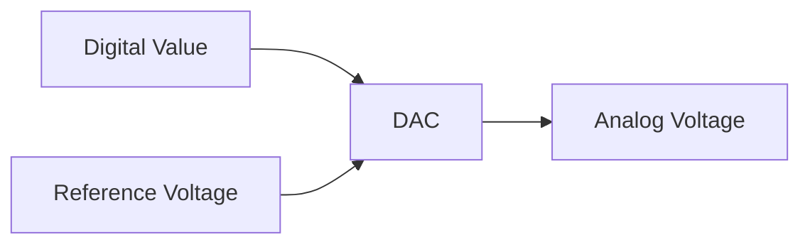

# STM32 DAC Basics

## Introduction

Digital-to-Analog Converters (DACs) are essential components in embedded systems that bridge the digital and analog worlds. They convert digital values from your microcontroller into corresponding analog voltage levels, enabling your STM32 to interact with analog devices like speakers, motors, or sensors that require analog control signals.

The STM32 family of microcontrollers includes built-in DAC peripherals that simplify generating analog signals without additional external components. This tutorial focuses on understanding and utilizing the DAC capabilities in STM32 microcontrollers.

## DAC Fundamentals

### What is a DAC?

A Digital-to-Analog Converter (DAC) transforms digital binary values into continuous analog voltages. In STM32 microcontrollers, the DAC peripheral takes a digital value (typically 8 or 12 bits) and converts it to a proportional voltage level between 0V and a reference voltage (typically the supply voltage VDDA).



### DAC Characteristics in STM32

Most STM32 microcontrollers that include DAC peripherals have the following characteristics:

- **Resolution**: Typically 12-bit (providing 4096 possible output levels)
- **Channels**: Usually 1 or 2 independent DAC channels
- **Output Range**: From 0V to VDDA (typically 3.3V)
- **Output Pins**: 
  - DAC1 channel 1: PA4
  - DAC1 channel 2: PA5 (when available)

### Resolution and Voltage Calculation

With a 12-bit DAC and a reference voltage of 3.3V, you can calculate the output voltage using:

$$V_{out} = \frac{DigitalValue}{2^{12}-1} \times V_{reference}$$

For example, a digital value of 2048 would produce:

$$V_{out} = \frac{2048}{4095} \times 3.3V = 1.65V$$

## STM32 DAC Configuration

Setting up the DAC in an STM32 microcontroller involves several steps:

1. Enable the DAC clock
2. Configure the GPIO pin as analog mode
3. Initialize and configure the DAC
4. Write values to generate analog output

Let's go through a complete example using STM32CubeIDE and HAL libraries.

### Basic DAC Initialization

```c
/* Enable DAC and GPIO clocks */
__HAL_RCC_DAC1_CLK_ENABLE();
__HAL_RCC_GPIOA_CLK_ENABLE();

/* Configure PA4 (DAC1_OUT1) as analog */
GPIO_InitTypeDef GPIO_InitStruct = {0};
GPIO_InitStruct.Pin = GPIO_PIN_4;
GPIO_InitStruct.Mode = GPIO_MODE_ANALOG;
GPIO_InitStruct.Pull = GPIO_NOPULL;
HAL_GPIO_Init(GPIOA, &GPIO_InitStruct);

/* Configure DAC */
DAC_HandleTypeDef hdac1;
hdac1.Instance = DAC1;
HAL_DAC_Init(&hdac1);

/* Configure DAC channel */
DAC_ChannelConfTypeDef sConfig = {0};
sConfig.DAC_Trigger = DAC_TRIGGER_NONE;
sConfig.DAC_OutputBuffer = DAC_OUTPUTBUFFER_ENABLE;
HAL_DAC_ConfigChannel(&hdac1, &sConfig, DAC_CHANNEL_1);

/* Start DAC */
HAL_DAC_Start(&hdac1, DAC_CHANNEL_1);
```

### Writing Values to the DAC

Once initialized, you can write values to the DAC to generate voltages:

```c
/* Set DAC output to mid-scale (1.65V with 3.3V reference) */
HAL_DAC_SetValue(&hdac1, DAC_CHANNEL_1, DAC_ALIGN_12B_R, 2048);

/* Set DAC output to 1V (assuming 3.3V reference) */
uint32_t value = (uint32_t)(4095 * (1.0 / 3.3));
HAL_DAC_SetValue(&hdac1, DAC_CHANNEL_1, DAC_ALIGN_12B_R, value);
```

## Advanced DAC Features

### Trigger Modes

The DAC can be triggered by various sources to automatically update its output:

```c
/* Configure DAC with timer trigger */
sConfig.DAC_Trigger = DAC_TRIGGER_T2_TRGO;
HAL_DAC_ConfigChannel(&hdac1, &sConfig, DAC_CHANNEL_1);

/* For triggered mode, use this function instead */
HAL_DAC_Start_IT(&hdac1, DAC_CHANNEL_1);
```

Common trigger sources include:
- Timers (TIM2, TIM4, TIM5, TIM6, TIM7, TIM8)
- External triggers (EXTI)
- Software triggers

### DMA Operation

For continuous waveform generation, you can use DMA to transfer data to the DAC without CPU intervention:

```c
/* Define a sine wave lookup table */
#define SINE_POINTS 256
uint16_t sineWaveData[SINE_POINTS];

/* Fill the lookup table with sine wave values */
for (int i = 0; i < SINE_POINTS; i++) {
    sineWaveData[i] = (uint16_t)(2047 * sin(i * 2 * PI / SINE_POINTS) + 2048);
}

/* Start DAC with DMA */
HAL_DAC_Start_DMA(&hdac1, DAC_CHANNEL_1, (uint32_t*)sineWaveData, 
                  SINE_POINTS, DAC_ALIGN_12B_R);
```

This setup requires additional configuration of a timer and DMA, which we'll explore in the practical examples.

## Practical Examples

### Example 1: Creating a Variable Voltage Source

This example demonstrates how to create a simple variable voltage source that can be controlled via UART:

```c
#include "main.h"
#include <stdio.h>
#include <string.h>

UART_HandleTypeDef huart2;
DAC_HandleTypeDef hdac1;

void SystemClock_Config(void);
static void MX_GPIO_Init(void);
static void MX_DAC1_Init(void);
static void MX_USART2_UART_Init(void);

char uartRxBuffer[20];
char uartTxBuffer[100];

int main(void)
{
  HAL_Init();
  SystemClock_Config();
  MX_GPIO_Init();
  MX_DAC1_Init();
  MX_USART2_UART_Init();
  
  /* Start DAC */
  HAL_DAC_Start(&hdac1, DAC_CHANNEL_1);
  
  /* Default output to 1.65V (mid-range) */
  HAL_DAC_SetValue(&hdac1, DAC_CHANNEL_1, DAC_ALIGN_12B_R, 2048);
  
  sprintf(uartTxBuffer, "Variable Voltage Source\r
Enter voltage (0.0-3.3V): ");
  HAL_UART_Transmit(&huart2, (uint8_t*)uartTxBuffer, strlen(uartTxBuffer), 100);
  
  while (1)
  {
    /* Receive voltage via UART */
    HAL_UART_Receive(&huart2, (uint8_t*)uartRxBuffer, 5, HAL_MAX_DELAY);
    
    /* Convert string to float */
    float requestedVoltage = atof(uartRxBuffer);
    
    /* Limit voltage to valid range */
    if (requestedVoltage < 0.0f) requestedVoltage = 0.0f;
    if (requestedVoltage > 3.3f) requestedVoltage = 3.3f;
    
    /* Calculate DAC value and set output */
    uint32_t dacValue = (uint32_t)(4095 * (requestedVoltage / 3.3f));
    HAL_DAC_SetValue(&hdac1, DAC_CHANNEL_1, DAC_ALIGN_12B_R, dacValue);
    
    /* Send confirmation */
    sprintf(uartTxBuffer, "Output set to %.2fV (DAC value: %lu)\r
Enter new voltage: ", 
            requestedVoltage, dacValue);
    HAL_UART_Transmit(&huart2, (uint8_t*)uartTxBuffer, strlen(uartTxBuffer), 100);
  }
}
```

### Example 2: Generating a Sine Wave

This example shows how to generate a continuous sine wave using a timer and DMA:

```c
#include "main.h"
#include <math.h>

#define SINE_POINTS 256
#define PI 3.14159265358979323846

DAC_HandleTypeDef hdac1;
TIM_HandleTypeDef htim6;
DMA_HandleTypeDef hdma_dac1_ch1;

uint16_t sineWaveData[SINE_POINTS];

void SystemClock_Config(void);
static void MX_GPIO_Init(void);
static void MX_DMA_Init(void);
static void MX_DAC1_Init(void);
static void MX_TIM6_Init(void);

int main(void)
{
  HAL_Init();
  SystemClock_Config();
  MX_GPIO_Init();
  MX_DMA_Init();
  MX_DAC1_Init();
  MX_TIM6_Init();
  
  /* Generate sine wave lookup table */
  for (int i = 0; i < SINE_POINTS; i++) {
    sineWaveData[i] = (uint16_t)(2047 * sin(i * 2 * PI / SINE_POINTS) + 2048);
  }
  
  /* Start timer */
  HAL_TIM_Base_Start(&htim6);
  
  /* Start DAC with DMA in circular mode */
  HAL_DAC_Start_DMA(&hdac1, DAC_CHANNEL_1, (uint32_t*)sineWaveData, 
                    SINE_POINTS, DAC_ALIGN_12B_R);
  
  while (1)
  {
    /* The DAC is now outputting the sine wave automatically */
    HAL_Delay(1000);
  }
}

/* Timer initialization (simplified) */
static void MX_TIM6_Init(void)
{
  htim6.Instance = TIM6;
  htim6.Init.Prescaler = 0;
  htim6.Init.CounterMode = TIM_COUNTERMODE_UP;
  htim6.Init.Period = 84; /* For ~1kHz sine wave with 84MHz clock */
  htim6.Init.AutoReloadPreload = TIM_AUTORELOAD_PRELOAD_DISABLE;
  HAL_TIM_Base_Init(&htim6);
  
  TIM_MasterConfigTypeDef sMasterConfig = {0};
  sMasterConfig.MasterOutputTrigger = TIM_TRGO_UPDATE;
  sMasterConfig.MasterSlaveMode = TIM_MASTERSLAVEMODE_DISABLE;
  HAL_TIMEx_MasterConfigSynchronization(&htim6, &sMasterConfig);
}

/* DAC initialization (simplified) */
static void MX_DAC1_Init(void)
{
  hdac1.Instance = DAC1;
  HAL_DAC_Init(&hdac1);
  
  DAC_ChannelConfTypeDef sConfig = {0};
  sConfig.DAC_Trigger = DAC_TRIGGER_T6_TRGO;
  sConfig.DAC_OutputBuffer = DAC_OUTPUTBUFFER_ENABLE;
  HAL_DAC_ConfigChannel(&hdac1, &sConfig, DAC_CHANNEL_1);
}
```

### Example 3: Creating a Simple Function Generator

Here's how to create a function generator with multiple waveforms (sine, triangle, sawtooth):

```c
#include "main.h"
#include <math.h>
#include <string.h>

#define WAVE_POINTS 256
#define PI 3.14159265358979323846

DAC_HandleTypeDef hdac1;
TIM_HandleTypeDef htim6;
DMA_HandleTypeDef hdma_dac1_ch1;
UART_HandleTypeDef huart2;

uint16_t sineWave[WAVE_POINTS];
uint16_t triangleWave[WAVE_POINTS];
uint16_t sawtoothWave[WAVE_POINTS];
uint16_t* currentWave;

void SystemClock_Config(void);
static void MX_GPIO_Init(void);
static void MX_DMA_Init(void);
static void MX_DAC1_Init(void);
static void MX_TIM6_Init(void);
static void MX_USART2_UART_Init(void);
void GenerateWaveforms(void);

char uartRxBuffer[10];
char uartTxBuffer[100];

int main(void)
{
  HAL_Init();
  SystemClock_Config();
  MX_GPIO_Init();
  MX_DMA_Init();
  MX_DAC1_Init();
  MX_TIM6_Init();
  MX_USART2_UART_Init();

  /* Generate waveform lookup tables */
  GenerateWaveforms();
  
  /* Default to sine wave */
  currentWave = sineWave;
  
  /* Start timer */
  HAL_TIM_Base_Start(&htim6);
  
  /* Start DAC with DMA */
  HAL_DAC_Start_DMA(&hdac1, DAC_CHANNEL_1, (uint32_t*)currentWave, 
                    WAVE_POINTS, DAC_ALIGN_12B_R);
  
  sprintf(uartTxBuffer, "Function Generator\r
Select waveform:\r
");
  strcat(uartTxBuffer, "1: Sine\r
2: Triangle\r
3: Sawtooth\r
");
  HAL_UART_Transmit(&huart2, (uint8_t*)uartTxBuffer, strlen(uartTxBuffer), 100);
  
  while (1)
  {
    /* Get waveform selection */
    HAL_UART_Receive(&huart2, (uint8_t*)uartRxBuffer, 1, HAL_MAX_DELAY);
    
    /* Stop current DMA transfer */
    HAL_DAC_Stop_DMA(&hdac1, DAC_CHANNEL_1);
    
    /* Select waveform based on input */
    switch(uartRxBuffer[0]) {
      case '1':
        currentWave = sineWave;
        strcpy(uartTxBuffer, "Selected: Sine Wave\r
");
        break;
      case '2':
        currentWave = triangleWave;
        strcpy(uartTxBuffer, "Selected: Triangle Wave\r
");
        break;
      case '3':
        currentWave = sawtoothWave;
        strcpy(uartTxBuffer, "Selected: Sawtooth Wave\r
");
        break;
      default:
        currentWave = sineWave;
        strcpy(uartTxBuffer, "Invalid selection, defaulting to Sine Wave\r
");
    }
    
    /* Restart DAC with new waveform */
    HAL_DAC_Start_DMA(&hdac1, DAC_CHANNEL_1, (uint32_t*)currentWave, 
                      WAVE_POINTS, DAC_ALIGN_12B_R);
    
    /* Send confirmation */
    HAL_UART_Transmit(&huart2, (uint8_t*)uartTxBuffer, strlen(uartTxBuffer), 100);
  }
}

void GenerateWaveforms(void)
{
  /* Generate sine wave */
  for (int i = 0; i < WAVE_POINTS; i++) {
    sineWave[i] = (uint16_t)(2047 * sin(i * 2 * PI / WAVE_POINTS) + 2048);
  }
  
  /* Generate triangle wave */
  for (int i = 0; i < WAVE_POINTS / 2; i++) {
    triangleWave[i] = (uint16_t)(i * 4096 / WAVE_POINTS * 2);
  }
  for (int i = WAVE_POINTS / 2; i < WAVE_POINTS; i++) {
    triangleWave[i] = (uint16_t)(4095 - (i - WAVE_POINTS / 2) * 4096 / WAVE_POINTS * 2);
  }
  
  /* Generate sawtooth wave */
  for (int i = 0; i < WAVE_POINTS; i++) {
    sawtoothWave[i] = (uint16_t)(i * 4095 / WAVE_POINTS);
  }
}
```

## Common Issues and Troubleshooting

### DAC Output Not Working

If your DAC output isn't producing the expected voltage:

1. **Check Power Supply**: Ensure VDDA is properly connected to your 3.3V supply
2. **Check GPIO Configuration**: Verify the DAC pin is configured as analog mode
3. **Check Clock Configuration**: Make sure the DAC clock is enabled
4. **Output Buffer**: The output buffer may need to be enabled or disabled depending on your load
5. **Measurement Issues**: Use a high-impedance multimeter to avoid loading the DAC output

### Noisy Output

If your DAC output has unwanted noise:

1. **Add Filtering**: Consider adding a simple RC low-pass filter to the output
2. **Power Supply Filtering**: Ensure VDDA has proper decoupling capacitors
3. **Digital Noise**: Keep digital signal traces away from the DAC analog output

### Code Example for Adding a Low-Pass Filter

```c
/*
 * To add a hardware low-pass filter:
 * - Connect a resistor (e.g., 1kΩ) between the DAC output pin and your load
 * - Connect a capacitor (e.g., 0.1μF) between the load side and ground
 *
 * This creates a filter with cutoff frequency:
 * f_cutoff = 1/(2π*R*C) = 1/(2π*1000*0.0000001) ≈ 1591 Hz
 */
```

## Summary

In this tutorial, we've covered:

1. **DAC Fundamentals**: Understanding how digital-to-analog conversion works in STM32 microcontrollers
2. **Basic Configuration**: Setting up and initializing the DAC peripheral
3. **Advanced Features**: Using triggers and DMA for automatic waveform generation
4. **Practical Examples**: Creating a variable voltage source, sine wave generator, and function generator
5. **Troubleshooting**: Common issues and their solutions

The DAC peripheral in STM32 microcontrollers provides a convenient way to generate analog signals without additional hardware. By mastering the DAC basics, you've unlocked the ability to interface with analog circuits, drive actuators, generate audio signals, and create custom waveforms for various applications.

## Additional Resources and Exercises

### Further Learning

1. STM32 Reference Manual - Look for the DAC peripheral section specific to your device
2. STM32CubeIDE HAL Libraries - Explore additional DAC functionality
3. STM32 Application Notes - Search for AN4566 "Using STM32 DAC to generate waveforms"

### Exercises

1. **Adjustable Function Generator**: Modify Example 3 to allow frequency adjustment via UART
2. **Audio Player**: Create a simple audio player that reads samples from an array and outputs them via the DAC
3. **Envelope Generator**: Implement an ADSR (Attack, Decay, Sustain, Release) envelope generator for audio synthesis
4. **Calibration Function**: Create a function that calibrates the DAC output against measured voltages to improve accuracy
5. **Multiple Channel Control**: If your STM32 has dual DAC channels, create an example that controls both independently