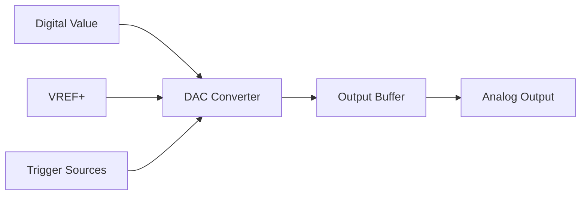

# STM32 DAC Configuration

## Introduction

The Digital-to-Analog Converter (DAC) is an essential peripheral in STM32 microcontrollers that converts digital values to analog voltage levels. This capability enables STM32 devices to interface with analog systems, generate waveforms, control analog devices, and produce audio signals. In this tutorial, we'll explore how to configure and use the DAC peripheral on STM32 microcontrollers.

Most STM32 families feature at least one DAC peripheral, with many mid to high-end models offering dual-channel DACs. These DACs typically offer 12-bit resolution, meaning they can produce 4,096 different voltage levels between 0V and the reference voltage (usually VREF+ or VDD).

## DAC Basics on STM32

Before diving into the configuration, let's understand the key features of the STM32 DAC:

- **Resolution**: Typically 12-bit, but can be configured for 8-bit operation
- **Output Range**: 0V to VREF+ (often 3.3V)
- **Channels**: One or two channels depending on the STM32 model
- **Trigger Sources**: Software, timers, external events
- **Buffer**: Can be enabled/disabled for different output impedance requirements
- **DMA Support**: For automatic waveform generation without CPU intervention

Let's visualize the basic DAC structure:



## Hardware Prerequisites

To follow this tutorial, you'll need:

1. An STM32 development board with DAC capability (e.g., STM32F4-Discovery, Nucleo-F429ZI)
2. STM32CubeIDE or another STM32 development environment
3. Basic oscilloscope (optional, but helpful for visualizing outputs)

## DAC Configuration Step-by-Step

Let's configure the DAC using the HAL (Hardware Abstraction Layer) library. We'll focus on the most common configuration scenarios.

### 1. Basic DAC Configuration

First, we need to initialize the DAC peripheral:

```c
#include "stm32f4xx_hal.h"

DAC_HandleTypeDef hdac;

void DAC_Init(void)
{
    /* Enable DAC clock */
    __HAL_RCC_DAC_CLK_ENABLE();
    
    /* Configure DAC */
    hdac.Instance = DAC;
    HAL_DAC_Init(&hdac);
    
    /* Configure DAC channel */
    DAC_ChannelConfTypeDef sConfig = {0};
    sConfig.DAC_Trigger = DAC_TRIGGER_NONE;   // Software trigger
    sConfig.DAC_OutputBuffer = DAC_OUTPUTBUFFER_ENABLE;  // Enable output buffer
    
    HAL_DAC_ConfigChannel(&hdac, &sConfig, DAC_CHANNEL_1);
    
    /* Start DAC */
    HAL_DAC_Start(&hdac, DAC_CHANNEL_1);
}
```

### 2. GPIO Configuration

The DAC output pins need to be configured as analog:

```c
void DAC_GPIO_Init(void)
{
    GPIO_InitTypeDef GPIO_InitStruct = {0};
    
    /* Enable GPIO clock */
    __HAL_RCC_GPIOA_CLK_ENABLE();
    
    /* Configure PA4 (DAC_OUT1) as analog */
    GPIO_InitStruct.Pin = GPIO_PIN_4;
    GPIO_InitStruct.Mode = GPIO_MODE_ANALOG;
    GPIO_InitStruct.Pull = GPIO_NOPULL;
    HAL_GPIO_Init(GPIOA, &GPIO_InitStruct);
    
    /* For DAC channel 2, configure PA5 (if needed) */
    // GPIO_InitStruct.Pin = GPIO_PIN_5;
    // HAL_GPIO_Init(GPIOA, &GPIO_InitStruct);
}
```

### 3. Setting DAC Values

Once configured, you can set the DAC output value:

```c
/* Set DAC to mid-scale (2048 in 12-bit mode) */
HAL_DAC_SetValue(&hdac, DAC_CHANNEL_1, DAC_ALIGN_12B_R, 2048);
```

The output voltage can be calculated as:

```
Vout = (digital_value / 4095) * VREF+
```

For example, with VREF+ = 3.3V:
- Digital value 0 = 0V
- Digital value 2048 ≈ 1.65V
- Digital value 4095 ≈ 3.3V

## Advanced DAC Features

### 1. Triggered DAC Conversion

Instead of software triggers, you can configure the DAC to update its value based on timer events:

```c
void DAC_TimerTrigger_Init(void)
{
    /* Configure DAC with timer trigger */
    DAC_ChannelConfTypeDef sConfig = {0};
    sConfig.DAC_Trigger = DAC_TRIGGER_T2_TRGO;  // Timer 2 trigger
    sConfig.DAC_OutputBuffer = DAC_OUTPUTBUFFER_ENABLE;
    
    HAL_DAC_ConfigChannel(&hdac, &sConfig, DAC_CHANNEL_1);
    
    /* Configure Timer 2 */
    TIM_HandleTypeDef htim2;
    htim2.Instance = TIM2;
    htim2.Init.Prescaler = 8400 - 1;  // For 10 kHz timer clock from 84 MHz
    htim2.Init.CounterMode = TIM_COUNTERMODE_UP;
    htim2.Init.Period = 10 - 1;  // 1 kHz update rate
    
    TIM_MasterConfigTypeDef sMasterConfig = {0};
    sMasterConfig.MasterOutputTrigger = TIM_TRGO_UPDATE;
    sMasterConfig.MasterSlaveMode = TIM_MASTERSLAVEMODE_DISABLE;
    
    HAL_TIM_Base_Init(&htim2);
    HAL_TIMEx_MasterConfigSynchronization(&htim2, &sMasterConfig);
    HAL_TIM_Base_Start(&htim2);
    
    /* Start DAC with trigger */
    HAL_DAC_Start(&hdac, DAC_CHANNEL_1);
}
```

### 2. DMA-Based Waveform Generation

One of the most powerful features is the ability to generate waveforms automatically using DMA:

```c
#define SINE_POINTS 256

uint16_t sine_wave[SINE_POINTS];
DMA_HandleTypeDef hdma_dac;

void DAC_DMA_Init(void)
{
    /* Generate sine wave table */
    for (int i = 0; i < SINE_POINTS; i++)
    {
        sine_wave[i] = (uint16_t)(2047 * sin(2 * 3.14159 * i / SINE_POINTS) + 2048);
    }
    
    /* Configure DMA */
    __HAL_RCC_DMA1_CLK_ENABLE();
    
    hdma_dac.Instance = DMA1_Stream5;
    hdma_dac.Init.Channel = DMA_CHANNEL_7;
    hdma_dac.Init.Direction = DMA_MEMORY_TO_PERIPH;
    hdma_dac.Init.PeriphInc = DMA_PINC_DISABLE;
    hdma_dac.Init.MemInc = DMA_MINC_ENABLE;
    hdma_dac.Init.PeriphDataAlignment = DMA_PDATAALIGN_HALFWORD;
    hdma_dac.Init.MemDataAlignment = DMA_MDATAALIGN_HALFWORD;
    hdma_dac.Init.Mode = DMA_CIRCULAR;
    hdma_dac.Init.Priority = DMA_PRIORITY_HIGH;
    hdma_dac.Init.FIFOMode = DMA_FIFOMODE_DISABLE;
    
    HAL_DMA_Init(&hdma_dac);
    
    /* Associate DMA handle with DAC handle */
    __HAL_LINKDMA(&hdac, DMA_Handle1, hdma_dac);
    
    /* Configure DAC with timer trigger and DMA */
    DAC_ChannelConfTypeDef sConfig = {0};
    sConfig.DAC_Trigger = DAC_TRIGGER_T2_TRGO;
    sConfig.DAC_OutputBuffer = DAC_OUTPUTBUFFER_ENABLE;
    
    HAL_DAC_ConfigChannel(&hdac, &sConfig, DAC_CHANNEL_1);
    
    /* Configure and start timer */
    // (Same as in the triggered example)
    
    /* Start DAC with DMA */
    HAL_DAC_Start_DMA(&hdac, DAC_CHANNEL_1, (uint32_t*)sine_wave, SINE_POINTS, DAC_ALIGN_12B_R);
}
```

This setup will continuously output a sine wave without any CPU intervention.

## Practical Examples

### Example 1: Voltage Reference

A simple voltage reference can be created using the DAC:

```c
void create_voltage_reference(float voltage)
{
    /* Calculate DAC value (for 3.3V reference) */
    uint32_t dac_value = (uint32_t)((voltage / 3.3) * 4095);
    
    /* Limit to valid range */
    if (dac_value > 4095)
        dac_value = 4095;
    
    /* Set DAC output */
    HAL_DAC_SetValue(&hdac, DAC_CHANNEL_1, DAC_ALIGN_12B_R, dac_value);
}
```

Usage:

```c
/* Create a 1.5V reference */
create_voltage_reference(1.5);
```

### Example 2: Triangle Wave Generator

Let's create a triangle wave generator:

```c
void generate_triangle_wave(uint32_t frequency)
{
    /* Calculate timer period for the desired frequency */
    uint32_t timer_freq = 10000;  // 10 kHz timer frequency
    uint32_t period = timer_freq / (frequency * 256);  // 256 points per waveform
    
    /* Configure timer */
    TIM_HandleTypeDef htim2;
    htim2.Instance = TIM2;
    htim2.Init.Prescaler = 8400 - 1;  // 10 kHz from 84 MHz
    htim2.Init.CounterMode = TIM_COUNTERMODE_UP;
    htim2.Init.Period = period - 1;
    
    TIM_MasterConfigTypeDef sMasterConfig = {0};
    sMasterConfig.MasterOutputTrigger = TIM_TRGO_UPDATE;
    sMasterConfig.MasterSlaveMode = TIM_MASTERSLAVEMODE_DISABLE;
    
    HAL_TIM_Base_Init(&htim2);
    HAL_TIMEx_MasterConfigSynchronization(&htim2, &sMasterConfig);
    
    /* Create triangle wave table */
    uint16_t triangle[256];
    for (int i = 0; i < 128; i++)
    {
        /* Rising edge */
        triangle[i] = i * 32;
        /* Falling edge */
        triangle[i + 128] = 4095 - (i * 32);
    }
    
    /* Configure DAC for DMA and timer trigger */
    DAC_ChannelConfTypeDef sConfig = {0};
    sConfig.DAC_Trigger = DAC_TRIGGER_T2_TRGO;
    sConfig.DAC_OutputBuffer = DAC_OUTPUTBUFFER_ENABLE;
    
    HAL_DAC_ConfigChannel(&hdac, &sConfig, DAC_CHANNEL_1);
    
    /* Start DAC with DMA */
    HAL_DAC_Start_DMA(&hdac, DAC_CHANNEL_1, (uint32_t*)triangle, 256, DAC_ALIGN_12B_R);
    
    /* Start timer */
    HAL_TIM_Base_Start(&htim2);
}
```

Usage:

```c
/* Generate a 100 Hz triangle wave */
generate_triangle_wave(100);
```

### Example 3: Audio Output

A simple audio tone generator:

```c
#define SAMPLE_RATE 44100
#define TONE_DURATION_MS 1000

void generate_audio_tone(float frequency)
{
    uint32_t num_samples = (SAMPLE_RATE * TONE_DURATION_MS) / 1000;
    uint16_t *audio_buffer = (uint16_t*)malloc(num_samples * sizeof(uint16_t));
    
    if (audio_buffer == NULL) {
        /* Handle memory allocation error */
        return;
    }
    
    /* Generate sine wave at specified frequency */
    for (uint32_t i = 0; i < num_samples; i++)
    {
        float t = (float)i / SAMPLE_RATE;
        audio_buffer[i] = (uint16_t)(2047 * sin(2 * 3.14159 * frequency * t) + 2048);
    }
    
    /* Configure timer for sample rate */
    TIM_HandleTypeDef htim6;
    htim6.Instance = TIM6;
    htim6.Init.Prescaler = 0;
    htim6.Init.CounterMode = TIM_COUNTERMODE_UP;
    /* For 84 MHz system clock: 84MHz / 44.1kHz = 1905 */
    htim6.Init.Period = 1905 - 1;
    
    TIM_MasterConfigTypeDef sMasterConfig = {0};
    sMasterConfig.MasterOutputTrigger = TIM_TRGO_UPDATE;
    sMasterConfig.MasterSlaveMode = TIM_MASTERSLAVEMODE_DISABLE;
    
    HAL_TIM_Base_Init(&htim6);
    HAL_TIMEx_MasterConfigSynchronization(&htim6, &sMasterConfig);
    
    /* Configure DAC for audio */
    DAC_ChannelConfTypeDef sConfig = {0};
    sConfig.DAC_Trigger = DAC_TRIGGER_T6_TRGO;
    sConfig.DAC_OutputBuffer = DAC_OUTPUTBUFFER_ENABLE;
    
    HAL_DAC_ConfigChannel(&hdac, &sConfig, DAC_CHANNEL_1);
    
    /* Start DAC with DMA (one-shot mode) */
    HAL_DAC_Start_DMA(&hdac, DAC_CHANNEL_1, (uint32_t*)audio_buffer, num_samples, DAC_ALIGN_12B_R);
    
    /* Start timer */
    HAL_TIM_Base_Start(&htim6);
    
    /* Audio will play for the specified duration */
    HAL_Delay(TONE_DURATION_MS);
    
    /* Stop DAC and timer */
    HAL_DAC_Stop_DMA(&hdac, DAC_CHANNEL_1);
    HAL_TIM_Base_Stop(&htim6);
    
    /* Free memory */
    free(audio_buffer);
}
```

Usage:

```c
/* Generate a 440 Hz tone (A4 note) for 1 second */
generate_audio_tone(440.0);
```

## Common Errors and Solutions

| Error | Possible Cause | Solution |
|-------|---------------|----------|
| No output voltage | GPIO not configured as analog | Ensure pin is set to analog mode |
| Incorrect voltage | Reference voltage issue | Check VREF+ connection, usually connected to VDD |
| Unstable output | Buffer disabled with low-impedance load | Enable the output buffer |
| Noisy output | Digital noise coupling | Add a simple RC filter after DAC output |
| DAC not triggering | Timer misconfiguration | Verify timer settings and trigger connections |

## Performance Considerations

1. **Buffer vs No Buffer**: Enabling the buffer increases output impedance but adds slight offset.
2. **Resolution Trade-off**: 12-bit resolution provides more precision but requires more memory and processor time for complex waveforms compared to 8-bit mode.
3. **DMA vs CPU**: Using DMA for waveform generation frees up the CPU for other tasks.
4. **Update Rate**: Higher update rates consume more power but provide better waveform fidelity.

## Summary

The STM32 DAC is a versatile peripheral that enables your microcontroller to interface with analog systems. In this tutorial, we've covered:

- Basic DAC concepts and configuration
- Software and timer-triggered DAC operation
- DMA-based automatic waveform generation
- Practical examples including voltage reference, waveform generation, and audio output

By mastering the DAC, you can extend your STM32 applications to control analog devices, generate signals, and create audio interfaces.

## Additional Resources

- STM32 Reference Manual: Check your specific STM32 family's reference manual for detailed DAC specifications
- STM32CubeF4 DAC examples: The STM32Cube package includes DAC examples for various use cases
- STM32 HAL DAC API documentation: For detailed information about all available DAC functions

## Exercises

1. Create a simple digital potentiometer using the DAC and a push button to increment/decrement the output voltage.
2. Generate a custom waveform of your design using the DMA-based method.
3. Build a simple function generator that can switch between sine, triangle, and square waves.
4. Create a light dimmer using the DAC to control an LED's brightness with PWM.
5. Design an audio player that can play simple melodies using an array of frequencies and durations.