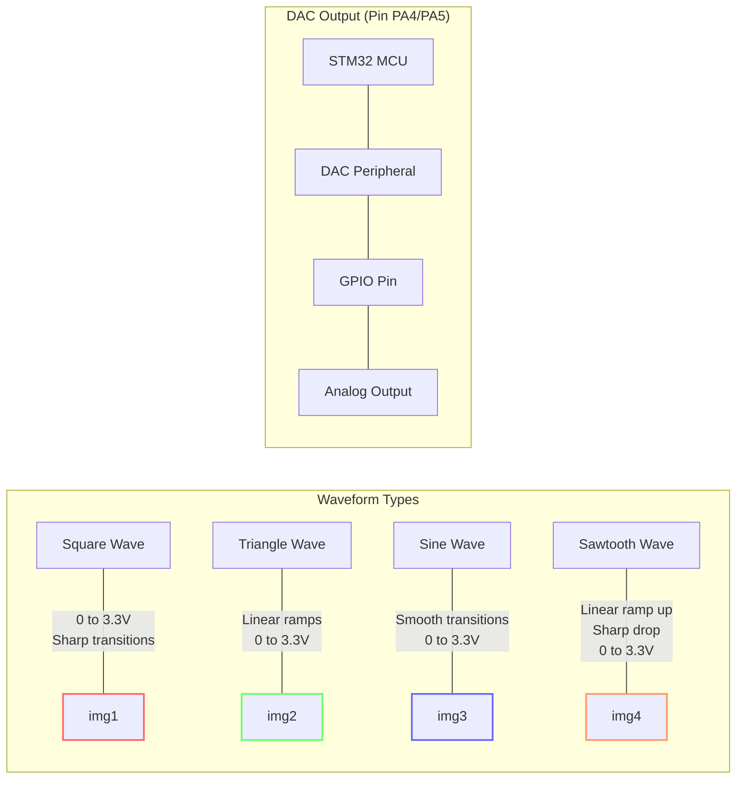

# STM32 DAC Waveforms

## Introduction

Digital-to-Analog Converters (DACs) are essential components in microcontrollers that allow us to generate analog voltage signals from digital values. The STM32 family of microcontrollers includes built-in DAC peripherals that can be used to create various waveforms like sine waves, triangle waves, and square waves. These waveforms are useful in numerous applications, from audio generation to control systems.

In this tutorial, we'll explore how to configure and use the DAC peripheral on STM32 microcontrollers to generate different types of waveforms. We'll cover the basics of DAC operation, setup procedures, and provide practical examples you can implement in your own projects.

## DAC Basics on STM32

### What is a DAC?

A Digital-to-Analog Converter (DAC) transforms digital values (binary numbers) into corresponding analog voltage levels. On STM32 microcontrollers, the DAC peripheral converts digital values from 0 to 4095 (12-bit resolution) into voltage levels ranging from 0V to VREF (typically 3.3V).

### DAC Channels on STM32

Most STM32 microcontrollers with DAC functionality have two DAC channels:
- DAC1 Channel 1 (connected to PA4)
- DAC1 Channel 2 (connected to PA5)

Each channel can be independently configured and operated.

### Key Features of STM32 DACs

- 12-bit resolution
- Dual channel capability
- Multiple trigger sources
- Built-in wave generation capabilities
- DMA support for efficient operation

## Setting Up the DAC

Before generating waveforms, we need to properly initialize the DAC. Here's a step-by-step guide:

### 1. Enable GPIO and DAC Clocks

```c
// Enable GPIO A and DAC clock
RCC->AHB1ENR |= RCC_AHB1ENR_GPIOAEN;
RCC->APB1ENR |= RCC_APB1ENR_DACEN;
```

### 2. Configure GPIO Pin

```c
// Configure PA4 (DAC1) as analog mode
GPIOA->MODER |= GPIO_MODER_MODER4;  // Set to analog mode (11)
GPIOA->PUPDR &= ~GPIO_PUPDR_PUPDR4; // No pull-up/pull-down
```

### 3. Initialize the DAC

```c
// Basic DAC initialization for Channel 1
DAC->CR |= DAC_CR_EN1;  // Enable DAC channel 1
```

### 4. Set Output Value

```c
// Set DAC output value (0-4095)
DAC->DHR12R1 = 2048;  // Set to mid-range (approximately 1.65V with VREF=3.3V)
```

## Generating Basic Waveforms

Now let's explore how to generate different types of waveforms using the STM32 DAC.

### Constant Voltage Output

The simplest "waveform" is just a constant voltage level:

```c
void setDacVoltage(uint16_t value) {
    // Ensure value is within 12-bit range (0-4095)
    if(value > 4095) value = 4095;
    
    // Set DAC output value
    DAC->DHR12R1 = value;
}

// Example usage:
// setDacVoltage(0);    // 0V
// setDacVoltage(2048); // ~1.65V (with VREF=3.3V)
// setDacVoltage(4095); // ~3.3V (with VREF=3.3V)
```

### Square Wave Generation

A square wave alternates between two voltage levels. We can generate it using a timer interrupt:

```c
// Square wave parameters
uint16_t highLevel = 4095;  // High level of square wave (3.3V with VREF=3.3V)
uint16_t lowLevel = 0;      // Low level of square wave (0V)
bool isHigh = false;        // Current state

// Timer interrupt handler
void TIM2_IRQHandler(void) {
    if (TIM2->SR & TIM_SR_UIF) {  // If update interrupt flag is set
        TIM2->SR &= ~TIM_SR_UIF;  // Clear the update interrupt flag
        
        if (isHigh) {
            DAC->DHR12R1 = lowLevel;
            isHigh = false;
        } else {
            DAC->DHR12R1 = highLevel;
            isHigh = true;
        }
    }
}

// Setup function
void setupSquareWave(uint32_t frequency) {
    // Initialize DAC as shown earlier
    // ... 
    
    // Configure Timer2 for desired frequency
    RCC->APB1ENR |= RCC_APB1ENR_TIM2EN;  // Enable Timer2 clock
    
    // Calculate prescaler and period for desired frequency
    // For a 84MHz system clock:
    uint32_t prescaler = 84 - 1;          // 1MHz timer clock
    uint32_t period = (1000000 / frequency) - 1;
    
    TIM2->PSC = prescaler;
    TIM2->ARR = period;
    TIM2->DIER |= TIM_DIER_UIE;           // Enable update interrupt
    TIM2->CR1 |= TIM_CR1_CEN;             // Enable timer
    
    // Enable Timer2 interrupt in NVIC
    NVIC_EnableIRQ(TIM2_IRQn);
}
```

### Triangle Wave Generation

A triangle wave can be generated by gradually incrementing and decrementing the DAC value:

```c
// Triangle wave parameters
uint16_t minValue = 0;    // Minimum value (0V)
uint16_t maxValue = 4095; // Maximum value (3.3V with VREF=3.3V)
uint16_t currentValue = 0;
int16_t increment = 64;   // Step size per interrupt
bool increasing = true;   // Direction

// Timer interrupt handler
void TIM2_IRQHandler(void) {
    if (TIM2->SR & TIM_SR_UIF) {  // If update interrupt flag is set
        TIM2->SR &= ~TIM_SR_UIF;  // Clear the update interrupt flag
        
        if (increasing) {
            currentValue += increment;
            if (currentValue >= maxValue) {
                currentValue = maxValue;
                increasing = false;
            }
        } else {
            currentValue -= increment;
            if (currentValue <= minValue || currentValue > maxValue) { // Second check prevents underflow
                currentValue = minValue;
                increasing = true;
            }
        }
        
        DAC->DHR12R1 = currentValue;
    }
}
```

### Sine Wave Generation

Sine waves are more complex but can be generated using a pre-calculated lookup table:

```c
// Sine wave lookup table (256 points)
const uint16_t sineTable[256] = {
    2048, 2098, 2148, 2198, 2248, 2298, 2348, 2398,
    2447, 2496, 2545, 2594, 2642, 2690, 2737, 2784,
    2831, 2877, 2923, 2968, 3013, 3057, 3100, 3143,
    3185, 3226, 3267, 3307, 3346, 3385, 3423, 3459,
    3495, 3530, 3565, 3598, 3630, 3662, 3692, 3722,
    3750, 3777, 3804, 3829, 3853, 3876, 3898, 3919,
    3939, 3958, 3975, 3992, 4007, 4021, 4034, 4045,
    4056, 4065, 4073, 4080, 4085, 4089, 4093, 4094,
    4095, 4094, 4093, 4089, 4085, 4080, 4073, 4065,
    4056, 4045, 4034, 4021, 4007, 3992, 3975, 3958,
    3939, 3919, 3898, 3876, 3853, 3829, 3804, 3777,
    3750, 3722, 3692, 3662, 3630, 3598, 3565, 3530,
    3495, 3459, 3423, 3385, 3346, 3307, 3267, 3226,
    3185, 3143, 3100, 3057, 3013, 2968, 2923, 2877,
    2831, 2784, 2737, 2690, 2642, 2594, 2545, 2496,
    2447, 2398, 2348, 2298, 2248, 2198, 2148, 2098,
    2048, 1997, 1947, 1897, 1847, 1797, 1747, 1697,
    1648, 1599, 1550, 1501, 1453, 1405, 1358, 1311,
    1264, 1218, 1172, 1127, 1082, 1038, 995, 952,
    910, 869, 828, 788, 749, 710, 672, 636,
    600, 565, 530, 497, 465, 433, 403, 373,
    345, 318, 291, 266, 242, 219, 197, 176,
    156, 137, 120, 103, 88, 74, 61, 50,
    39, 30, 22, 15, 10, 6, 2, 1,
    0, 1, 2, 6, 10, 15, 22, 30,
    39, 50, 61, 74, 88, 103, 120, 137,
    156, 176, 197, 219, 242, 266, 291, 318,
    345, 373, 403, 433, 465, 497, 530, 565,
    600, 636, 672, 710, 749, 788, 828, 869,
    910, 952, 995, 1038, 1082, 1127, 1172, 1218,
    1264, 1311, 1358, 1405, 1453, 1501, 1550, 1599,
    1648, 1697, 1747, 1797, 1847, 1897, 1947, 1997
};

// Global index for lookup table
uint8_t sineIndex = 0;

// Timer interrupt handler
void TIM2_IRQHandler(void) {
    if (TIM2->SR & TIM_SR_UIF) {  // If update interrupt flag is set
        TIM2->SR &= ~TIM_SR_UIF;  // Clear the update interrupt flag
        
        // Output current sine value
        DAC->DHR12R1 = sineTable[sineIndex];
        
        // Move to next index (with wrap-around)
        sineIndex = (sineIndex + 1) % 256;
    }
}
```

## Advanced Waveform Generation with DMA

For more efficient waveform generation, we can use Direct Memory Access (DMA) to transfer values from memory to the DAC without CPU intervention. This is especially useful for high-frequency waveforms.

### Setting Up DAC with DMA

```c
// Sine wave data (pre-calculated)
const uint16_t sineWave[32] = {
    2048, 2447, 2831, 3185, 3495, 3750, 3939, 4056,
    4095, 4056, 3939, 3750, 3495, 3185, 2831, 2447,
    2048, 1648, 1264, 910, 600, 345, 156, 39,
    0, 39, 156, 345, 600, 910, 1264, 1648
};

void setupDacWithDma(void) {
    // Enable necessary clocks
    RCC->AHB1ENR |= RCC_AHB1ENR_GPIOAEN | RCC_AHB1ENR_DMA1EN;
    RCC->APB1ENR |= RCC_APB1ENR_DACEN | RCC_APB1ENR_TIM6EN;
    
    // Configure PA4 (DAC Channel 1) as analog
    GPIOA->MODER |= GPIO_MODER_MODER4;
    
    // Configure Timer6 as trigger for DAC
    TIM6->PSC = 0;                  // No prescaler
    TIM6->ARR = 84 - 1;             // Update rate = 84MHz/84 = 1MHz
    TIM6->CR2 |= TIM_CR2_MMS_1;     // TRGO on update event
    
    // Configure DAC
    DAC->CR |= DAC_CR_EN1;          // Enable DAC channel 1
    DAC->CR |= DAC_CR_TEN1;         // Enable trigger for channel 1
    DAC->CR |= DAC_CR_TSEL1_1;      // Timer6 TRGO selected as trigger
    DAC->CR |= DAC_CR_DMAEN1;       // Enable DMA for channel 1
    
    // Configure DMA
    DMA1_Stream5->CR &= ~DMA_SxCR_EN;   // Disable DMA stream
    while(DMA1_Stream5->CR & DMA_SxCR_EN); // Wait until disabled
    
    DMA1_Stream5->PAR = (uint32_t)&(DAC->DHR12R1);   // Destination address
    DMA1_Stream5->M0AR = (uint32_t)sineWave;        // Source address
    DMA1_Stream5->NDTR = 32;                        // Number of data items
    
    DMA1_Stream5->CR |= DMA_SxCR_CIRC;              // Circular mode
    DMA1_Stream5->CR |= DMA_SxCR_MINC;              // Memory increment
    DMA1_Stream5->CR |= DMA_SxCR_DIR_0;             // Memory to peripheral
    DMA1_Stream5->CR |= DMA_SxCR_MSIZE_0;           // 16-bit memory size
    DMA1_Stream5->CR |= DMA_SxCR_PSIZE_0;           // 16-bit peripheral size
    DMA1_Stream5->CR |= DMA_SxCR_PL_0;              // Medium priority
    
    DMA1_Stream5->CR |= DMA_SxCR_EN;                // Enable DMA stream
    
    TIM6->CR1 |= TIM_CR1_CEN;                      // Start timer
}
```

### Adjusting Waveform Frequency

To change the frequency of the generated waveform, you can modify the timer period:

```c
void setWaveformFrequency(uint32_t frequency) {
    // For a 32-point waveform, output frequency = timer frequency / 32
    // So timer frequency = output frequency * 32
    uint32_t timerFrequency = frequency * 32;
    
    // Assuming system clock of 84MHz
    uint32_t period = (84000000 / timerFrequency) - 1;
    
    // Update timer period
    TIM6->CR1 &= ~TIM_CR1_CEN;    // Stop timer
    TIM6->ARR = period;           // Set new period
    TIM6->CR1 |= TIM_CR1_CEN;     // Restart timer
}
```

## Real-world Applications

### Audio Signal Generation

The DAC waveform generation can be used to create simple audio signals:

```c
// Example: Generate a 440Hz sine wave (A4 note)
void playTone(void) {
    // Initialize DAC with DMA as shown earlier
    setupDacWithDma();
    
    // Set frequency to 440Hz
    setWaveformFrequency(440);
    
    // Play for 1 second
    delay_ms(1000);
    
    // Stop playback
    TIM6->CR1 &= ~TIM_CR1_CEN;    // Stop timer
}
```

### Function Generator

This code implements a simple function generator that can output different waveform types:

```c
typedef enum {
    WAVE_SINE,
    WAVE_TRIANGLE,
    WAVE_SQUARE,
    WAVE_SAWTOOTH
} WaveformType;

// Arrays for different waveforms (32 points each)
const uint16_t sineWave[32] = { /* ... */ };
const uint16_t triangleWave[32] = { /* ... */ };
const uint16_t squareWave[32] = { /* ... */ };
const uint16_t sawtoothWave[32] = { /* ... */ };

void setWaveformType(WaveformType type) {
    // Stop DMA and timer
    DMA1_Stream5->CR &= ~DMA_SxCR_EN;
    TIM6->CR1 &= ~TIM_CR1_CEN;
    
    // Wait until DMA is fully disabled
    while(DMA1_Stream5->CR & DMA_SxCR_EN);
    
    // Update DMA source based on waveform type
    switch(type) {
        case WAVE_SINE:
            DMA1_Stream5->M0AR = (uint32_t)sineWave;
            break;
        case WAVE_TRIANGLE:
            DMA1_Stream5->M0AR = (uint32_t)triangleWave;
            break;
        case WAVE_SQUARE:
            DMA1_Stream5->M0AR = (uint32_t)squareWave;
            break;
        case WAVE_SAWTOOTH:
            DMA1_Stream5->M0AR = (uint32_t)sawtoothWave;
            break;
    }
    
    // Restart DMA and timer
    DMA1_Stream5->NDTR = 32;
    DMA1_Stream5->CR |= DMA_SxCR_EN;
    TIM6->CR1 |= TIM_CR1_CEN;
}
```

### Signal Modulation

You can also implement amplitude modulation by dynamically scaling the waveform values:

```c
// Apply amplitude modulation to a sine wave
void amplitudeModulation(uint16_t carrierFreq, uint16_t modulationFreq) {
    // Setup with DMA (similar to previous examples)
    // ...
    
    // Set carrier frequency
    setWaveformFrequency(carrierFreq);
    
    // Modulation parameters
    float modulationDepth = 0.5;  // 50% modulation
    float modulationPhase = 0.0;
    float modulationStep = 2.0 * 3.14159 * modulationFreq / 1000.0;  // For 1ms interrupts
    
    // Setup a timer for modulation
    // ... (Timer7 configuration for modulationFreq)
    
    // Enable timer7 interrupt
    NVIC_EnableIRQ(TIM7_IRQn);
}

// Interrupt handler for modulation
void TIM7_IRQHandler(void) {
    if (TIM7->SR & TIM_SR_UIF) {
        TIM7->SR &= ~TIM_SR_UIF;  // Clear interrupt flag
        
        // Calculate new amplitude
        modulationPhase += modulationStep;
        if (modulationPhase > 2.0 * 3.14159) {
            modulationPhase -= 2.0 * 3.14159;
        }
        
        float amplitude = 1.0 + modulationDepth * sinf(modulationPhase);
        
        // Scale waveform and update DMA
        for (int i = 0; i < 32; i++) {
            uint16_t scaledValue = (uint16_t)(sineWave[i] * amplitude);
            if (scaledValue > 4095) scaledValue = 4095;
            modulatedWave[i] = scaledValue;
        }
    }
}
```

## Visualizing DAC Waveforms

Let's use a Mermaid diagram to visualize the different waveform types:



## Performance Considerations

When working with DAC waveform generation, keep these performance factors in mind:

1. **Resolution trade-offs**: Higher resolution (more points in the lookup table) gives smoother waveforms but requires more memory.

2. **Update Rate**: The maximum achievable waveform frequency depends on:
   - Timer frequency
   - Number of points in the waveform
   - Maximum frequency = Timer frequency / Number of points

3. **DMA vs. Interrupt**: DMA-based waveform generation is more efficient than interrupt-based approaches, especially at high frequencies.

4. **Output Filtering**: The DAC output may contain step transitions. For smoother analog outputs, especially for audio applications, consider adding a simple RC low-pass filter on the output pin.

## Summary

In this tutorial, we've explored how to use the STM32's DAC peripheral to generate various types of waveforms:

1. We covered the basics of DAC operation and configuration
2. We implemented different waveform types:
   - Constant voltage
   - Square waves
   - Triangle waves
   - Sine waves
3. We leveraged DMA for more efficient waveform generation
4. We explored real-world applications including:
   - Audio signal generation
   - Function generators
   - Signal modulation

The STM32's DAC capabilities make it well-suited for a variety of analog signal generation tasks. By combining the DAC with timers and DMA, you can create complex waveforms with minimal CPU overhead.

## Exercises

1. Modify the sine wave generation code to create a waveform with variable amplitude.
2. Implement a frequency sweep function that gradually changes the output frequency from a low to high value.
3. Create a simple DTMF (Dual-Tone Multi-Frequency) generator for generating telephone tones.
4. Extend the function generator to allow for custom waveform definitions.
5. Implement a phase modulation example similar to the amplitude modulation example.

## Additional Resources

- STM32 Reference Manual (see the DAC chapter)
- STM32 HAL Libraries documentation
- Signal processing tutorials for more advanced waveform generation techniques
- Analog circuit design resources for output filtering options