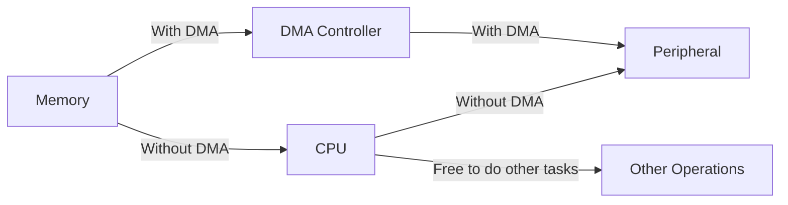
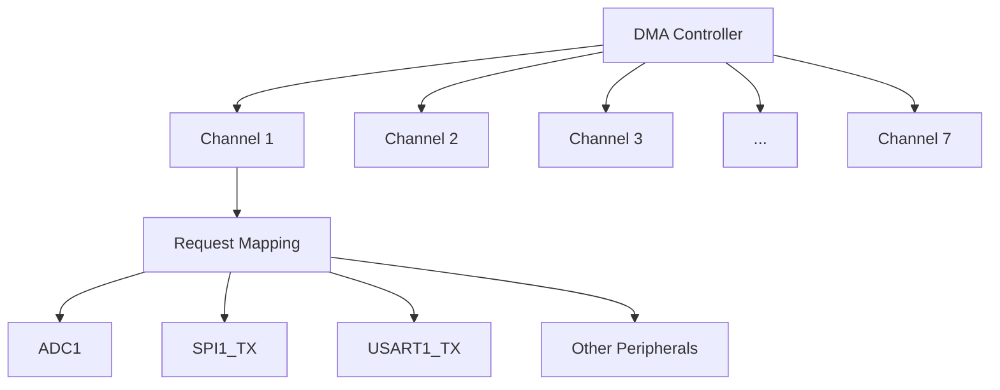

# STM32 DMA Basics

Direct Memory Access (DMA) is one of the most powerful features available in STM32 microcontrollers. It allows data transfers between memory and peripherals without CPU intervention, freeing up processor resources for other tasks. In this guide, we'll explore the basics of DMA on STM32 microcontrollers and learn how to implement simple DMA transfers.

## What is DMA?

DMA stands for Direct Memory Access, a feature that allows peripherals to access memory directly without going through the CPU. This means data can be transferred between memory and peripherals (or between memory locations) while the CPU is executing other instructions.

<div className="info-box">
  <strong>Why DMA Matters:</strong> Without DMA, the CPU must handle every byte transfer between peripherals and memory, consuming valuable processing time. With DMA, these transfers happen in the background, significantly improving system performance.
</div>



## STM32 DMA Architecture

STM32 microcontrollers feature a flexible DMA subsystem. Depending on the specific STM32 family, you might have:

- 1 or 2 DMA controllers
- Multiple channels per controller (typically 5-8 channels)
- Different priority levels for each channel
- Various data width options (byte, half-word, word)
- Memory-to-memory, memory-to-peripheral, and peripheral-to-memory transfer modes

For STM32F1 and similar series, the architecture looks like this:



## Key DMA Concepts

Before we dive into code examples, let's understand some essential DMA concepts:

### 1. DMA Channels and Streams

- **Channels**: Each DMA controller has multiple channels. Each channel can be assigned to a specific peripheral.
- **Streams**: In advanced STM32 models (F4, F7, H7), DMA channels are further divided into streams for more flexibility.

### 2. Transfer Modes

- **Memory-to-Memory**: Transfer data from one memory area to another.
- **Peripheral-to-Memory**: Read data from a peripheral and store it in memory (e.g., ADC readings).
- **Memory-to-Peripheral**: Send data from memory to a peripheral (e.g., DAC output).

### 3. Transfer Properties

- **Data Size**: Byte (8-bit), Half-word (16-bit), or Word (32-bit).
- **Increment Mode**: Whether memory/peripheral addresses are automatically incremented.
- **Circular Mode**: Automatically restart transfers when completed (useful for continuous ADC readings).
- **Transfer Complete Interrupt**: Generated when a transfer is completed.

## Setting Up a Basic DMA Transfer

Let's implement a basic DMA transfer from memory to a peripheral (UART) using STM32CubeIDE. This approach uses the HAL (Hardware Abstraction Layer) library, which simplifies DMA configuration.

### Step 1: Configure the Peripheral

First, we need to configure the UART peripheral:

```c
// UART configuration
UART_HandleTypeDef huart1;

void UART_Init(void)
{
  huart1.Instance = USART1;
  huart1.Init.BaudRate = 115200;
  huart1.Init.WordLength = UART_WORDLENGTH_8B;
  huart1.Init.StopBits = UART_STOPBITS_1;
  huart1.Init.Parity = UART_PARITY_NONE;
  huart1.Init.Mode = UART_MODE_TX;
  huart1.Init.HwFlowCtl = UART_HWCONTROL_NONE;
  huart1.Init.OverSampling = UART_OVERSAMPLING_16;
  
  if (HAL_UART_Init(&huart1) != HAL_OK)
  {
    Error_Handler();
  }
}
```

### Step 2: Configure the DMA

Next, we need to configure the DMA for UART transmission:

```c
// DMA handle
DMA_HandleTypeDef hdma_usart1_tx;

void DMA_Init(void)
{
  /* Enable DMA1 clock */
  __HAL_RCC_DMA1_CLK_ENABLE();
  
  /* Configure DMA for USART1 TX */
  hdma_usart1_tx.Instance = DMA1_Channel4; // Channel for USART1_TX on many STM32F1 devices
  hdma_usart1_tx.Init.Direction = DMA_MEMORY_TO_PERIPH;
  hdma_usart1_tx.Init.PeriphInc = DMA_PINC_DISABLE;
  hdma_usart1_tx.Init.MemInc = DMA_MINC_ENABLE;
  hdma_usart1_tx.Init.PeriphDataAlignment = DMA_PDATAALIGN_BYTE;
  hdma_usart1_tx.Init.MemDataAlignment = DMA_MDATAALIGN_BYTE;
  hdma_usart1_tx.Init.Mode = DMA_NORMAL;
  hdma_usart1_tx.Init.Priority = DMA_PRIORITY_MEDIUM;
  
  if (HAL_DMA_Init(&hdma_usart1_tx) != HAL_OK)
  {
    Error_Handler();
  }
  
  /* Associate the DMA handle with the UART handle */
  __HAL_LINKDMA(&huart1, hdmatx, hdma_usart1_tx);
  
  /* NVIC configuration for DMA transfer complete interrupt */
  HAL_NVIC_SetPriority(DMA1_Channel4_IRQn, 0, 0);
  HAL_NVIC_EnableIRQ(DMA1_Channel4_IRQn);
}
```

Let's break down the DMA configuration parameters:

- **Direction**: Memory to peripheral (we're sending data to UART)
- **PeriphInc**: Don't increment peripheral address (UART data register stays the same)
- **MemInc**: Increment memory address (to read through our data buffer)
- **Alignment**: Byte alignment for both memory and peripheral (UART uses 8-bit data)
- **Mode**: Normal (transfer stops when complete)
- **Priority**: Medium (you can adjust based on system requirements)

### Step 3: Start a DMA Transfer

Now we can use DMA to transmit data through UART:

```c
void Send_With_DMA(uint8_t *data, uint16_t size)
{
  /* Start UART transmission in DMA mode */
  if (HAL_UART_Transmit_DMA(&huart1, data, size) != HAL_OK)
  {
    Error_Handler();
  }
}

// Example usage
int main(void)
{
  /* MCU Configuration */
  HAL_Init();
  SystemClock_Config();
  
  /* Initialize UART and DMA */
  UART_Init();
  DMA_Init();
  
  /* Data to send */
  uint8_t message[] = "Hello from STM32 DMA!\r
";
  
  while (1)
  {
    /* Send data using DMA */
    Send_With_DMA(message, sizeof(message) - 1);
    
    /* Wait for transmission to complete */
    while (HAL_UART_GetState(&huart1) != HAL_UART_STATE_READY)
    {
      /* CPU can do other tasks here while DMA is working */
    }
    
    /* Wait before sending again */
    HAL_Delay(1000);
  }
}
```

### Step 4: Handle DMA Interrupts

To properly handle DMA interrupts, we need to implement the interrupt handler:

```c
/* DMA interrupt handler */
void DMA1_Channel4_IRQHandler(void)
{
  HAL_DMA_IRQHandler(&hdma_usart1_tx);
}

/* UART TX transfer completed callback */
void HAL_UART_TxCpltCallback(UART_HandleTypeDef *huart)
{
  if (huart->Instance == USART1)
  {
    /* UART transmission complete */
    /* You can add your own code here to handle the completion */
  }
}
```

## Practical Example: ADC with DMA

One of the most common applications of DMA is reading ADC values continuously without CPU intervention. Here's how to set up ADC with DMA in circular mode:

```c
// ADC handle
ADC_HandleTypeDef hadc1;
// DMA handle
DMA_HandleTypeDef hdma_adc1;
// Buffer to store ADC readings
uint16_t adc_values[4]; // For 4 channels

void ADC_DMA_Init(void)
{
  ADC_ChannelConfTypeDef sConfig = {0};
  
  /* Configure the ADC peripheral */
  hadc1.Instance = ADC1;
  hadc1.Init.ScanConvMode = ADC_SCAN_ENABLE;
  hadc1.Init.ContinuousConvMode = ENABLE;
  hadc1.Init.DiscontinuousConvMode = DISABLE;
  hadc1.Init.ExternalTrigConv = ADC_SOFTWARE_START;
  hadc1.Init.DataAlign = ADC_DATAALIGN_RIGHT;
  hadc1.Init.NbrOfConversion = 4; // Number of channels
  
  if (HAL_ADC_Init(&hadc1) != HAL_OK)
  {
    Error_Handler();
  }
  
  /* Configure ADC channels */
  // Channel 0
  sConfig.Channel = ADC_CHANNEL_0;
  sConfig.Rank = ADC_REGULAR_RANK_1;
  sConfig.SamplingTime = ADC_SAMPLETIME_55CYCLES_5;
  if (HAL_ADC_ConfigChannel(&hadc1, &sConfig) != HAL_OK)
  {
    Error_Handler();
  }
  
  // Channel 1
  sConfig.Channel = ADC_CHANNEL_1;
  sConfig.Rank = ADC_REGULAR_RANK_2;
  if (HAL_ADC_ConfigChannel(&hadc1, &sConfig) != HAL_OK)
  {
    Error_Handler();
  }
  
  // Channel 2
  sConfig.Channel = ADC_CHANNEL_2;
  sConfig.Rank = ADC_REGULAR_RANK_3;
  if (HAL_ADC_ConfigChannel(&hadc1, &sConfig) != HAL_OK)
  {
    Error_Handler();
  }
  
  // Channel 3
  sConfig.Channel = ADC_CHANNEL_3;
  sConfig.Rank = ADC_REGULAR_RANK_4;
  if (HAL_ADC_ConfigChannel(&hadc1, &sConfig) != HAL_OK)
  {
    Error_Handler();
  }
  
  /* Configure DMA for ADC */
  __HAL_RCC_DMA1_CLK_ENABLE();
  
  hdma_adc1.Instance = DMA1_Channel1; // Channel for ADC1 on many STM32F1 devices
  hdma_adc1.Init.Direction = DMA_PERIPH_TO_MEMORY;
  hdma_adc1.Init.PeriphInc = DMA_PINC_DISABLE;
  hdma_adc1.Init.MemInc = DMA_MINC_ENABLE;
  hdma_adc1.Init.PeriphDataAlignment = DMA_PDATAALIGN_HALFWORD;
  hdma_adc1.Init.MemDataAlignment = DMA_MDATAALIGN_HALFWORD;
  hdma_adc1.Init.Mode = DMA_CIRCULAR;
  hdma_adc1.Init.Priority = DMA_PRIORITY_HIGH;
  
  if (HAL_DMA_Init(&hdma_adc1) != HAL_OK)
  {
    Error_Handler();
  }
  
  __HAL_LINKDMA(&hadc1, DMA_Handle, hdma_adc1);
  
  /* Enable DMA interrupt */
  HAL_NVIC_SetPriority(DMA1_Channel1_IRQn, 0, 0);
  HAL_NVIC_EnableIRQ(DMA1_Channel1_IRQn);
}

int main(void)
{
  /* MCU Configuration */
  HAL_Init();
  SystemClock_Config();
  
  /* Initialize ADC with DMA */
  ADC_DMA_Init();
  
  /* Start ADC with DMA in circular mode */
  HAL_ADC_Start_DMA(&hadc1, (uint32_t*)adc_values, 4);
  
  while (1)
  {
    /* The CPU is free to do other tasks while DMA continuously updates adc_values */
    
    /* Example: Process ADC values */
    ProcessData(adc_values);
    
    HAL_Delay(100);
  }
}

/* DMA interrupt handler */
void DMA1_Channel1_IRQHandler(void)
{
  HAL_DMA_IRQHandler(&hdma_adc1);
}

/* ADC conversion complete callback */
void HAL_ADC_ConvCpltCallback(ADC_HandleTypeDef* hadc)
{
  if(hadc->Instance == ADC1)
  {
    /* ADC conversion complete */
    /* This function is called every time DMA completes a full cycle */
  }
}
```

Key points about this ADC with DMA example:

1. We configure 4 ADC channels for continuous scanning
2. DMA is set up in circular mode, so it never stops transferring data
3. The `adc_values` array is automatically updated with the latest readings
4. The CPU can process data or perform other tasks while the DMA works

## Common DMA Pitfalls and Tips

### Pitfalls

1. **Memory Alignment Issues**: Ensure your data buffers are properly aligned, especially when using half-word or word transfers.
2. **Buffer Overflow**: Always ensure the DMA doesn't write beyond your allocated buffer.
3. **Conflict Between Channels**: Some peripherals share DMA channels; check the reference manual to avoid conflicts.
4. **Forgetting to Enable Clocks**: DMA controllers need their clocks enabled before configuration.

### Tips

1. **Use HAL Timeout**: When starting DMA transfers, use timeout to prevent infinite waiting.
2. **Double Buffering**: For continuous data processing, consider implementing double buffering.
3. **Check Transfer Complete Flag**: Always verify that a transfer is complete before accessing the data.
4. **DMA Callback Functions**: Implement callback functions for handling transfer completion and errors.

## Advanced Topics (Preview)

While this guide focuses on the basics, here are some advanced DMA topics to explore next:

- **DMA with FIFOs** (in STM32F4 and above)
- **Double buffer mode** for continuous processing
- **Stream priority levels** and arbitration
- **DMA with mutual peripherals** like SPI and I2C
- **Memory-to-memory DMA** for fast data copying

## Summary

DMA is a powerful feature in STM32 microcontrollers that allows for efficient data transfers without CPU intervention. Key benefits include:

- Offloading the CPU for better system performance
- Enabling background data transfers
- Supporting continuous peripheral operations (like ADC sampling)
- Reducing power consumption in certain scenarios

By mastering DMA, you'll be able to dramatically improve the performance and efficiency of your STM32 applications, especially those dealing with high data throughput or multiple peripherals.

## Exercises

1. Modify the UART example to use circular DMA mode to repeatedly send data.
2. Implement a double buffer system with DMA for ADC readings.
3. Use DMA for memory-to-memory transfer to quickly copy data between arrays.
4. Create a DMA-based data logger that captures ADC readings and sends them via UART.
5. Implement a DMA-based SPI transfer to communicate with an external sensor.

## Additional Resources

- STM32 Reference Manuals (specific to your device family)
- [STM32 DMA Application Note (AN4031)](https://www.st.com)
- STM32CubeIDE Examples (look for DMA examples in the package)
- STM32 HAL Documentation (DMA section)