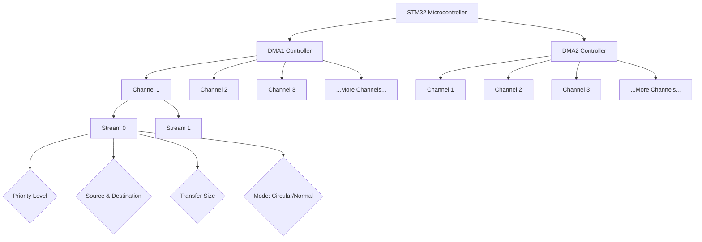

# STM32 DMA Controllers

## Introduction

Direct Memory Access (DMA) is one of the most powerful features available in STM32 microcontrollers. Unlike normal data transfers that require constant CPU intervention, DMA allows for the movement of data between memory and peripherals or between memory locations without CPU involvement. This frees up the processor to perform other tasks, significantly improving system performance and efficiency.

In this article, we'll dive deep into STM32 DMA controllers, understand their architecture, explore how to configure and use them, and see some practical examples of DMA in action.

## Understanding DMA Controllers in STM32

### What is a DMA Controller?

A DMA controller is a specialized hardware module that manages memory-to-memory, memory-to-peripheral, and peripheral-to-memory data transfers independently of the CPU. STM32 microcontrollers come with multiple DMA controllers depending on the specific microcontroller series.

### Architecture of STM32 DMA Controllers

STM32 microcontrollers typically have 1-2 DMA controllers (DMA1 and DMA2), with each controller containing multiple channels (usually 5-8 channels per controller). The architecture can be visualized as follows:



In more advanced STM32 series like the STM32F4 or STM32F7, each DMA controller has multiple "streams" (typically 8), and each stream can be assigned to different peripheral requests via request multiplexers.

### Key Features of STM32 DMA Controllers

1. **Multiple Channels/Streams**: Allow handling several independent DMA transfers simultaneously
2. **Configurable Priority Levels**: Each channel can be assigned a priority level (Low, Medium, High, Very High)
3. **Circular Mode**: Automatically restarts the transfer once completed, ideal for continuous data acquisition
4. **Memory-to-Memory Mode**: Transfers data between memory locations
5. **Peripheral-to-Memory Mode**: Moves data from a peripheral to memory
6. **Memory-to-Peripheral Mode**: Sends data from memory to a peripheral
7. **Configurable Transfer Sizes**: Byte (8-bit), Half-Word (16-bit), or Word (32-bit)
8. **Interrupt Generation**: Can generate interrupts at half-transfer and transfer-complete events

## Configuring a DMA Controller

### Basic Configuration Steps

Configuring a DMA controller involves several steps:

1. Enable clock access to the DMA controller
2. Configure the DMA channel/stream parameters
3. Enable the DMA channel/stream
4. Configure and enable the peripheral to work with DMA

Let's look at a step-by-step example of configuring DMA for ADC data transfer:

```c
// 1. Enable DMA clock
RCC->AHB1ENR |= RCC_AHB1ENR_DMA2EN;  // Enable DMA2 clock

// 2. Configure DMA
// Disable the stream first (in case it was enabled)
DMA2_Stream0->CR &= ~DMA_SxCR_EN;
while(DMA2_Stream0->CR & DMA_SxCR_EN) { }  // Wait until EN bit is cleared

// Clear any flags
DMA2->LIFCR = (DMA_LIFCR_CTCIF0 | DMA_LIFCR_CHTIF0 | DMA_LIFCR_CTEIF0 | DMA_LIFCR_CDMEIF0 | DMA_LIFCR_CFEIF0);

// Configure the stream
DMA2_Stream0->PAR = (uint32_t)&ADC1->DR;        // Source: ADC1 Data Register
DMA2_Stream0->M0AR = (uint32_t)adc_buffer;      // Destination: our buffer
DMA2_Stream0->NDTR = ADC_BUFFER_SIZE;           // Number of data items to transfer

// Configure transfer properties
DMA2_Stream0->CR = 0;                           // Reset register
DMA2_Stream0->CR |= DMA_SxCR_CHSEL_0;           // Channel 0
DMA2_Stream0->CR |= DMA_SxCR_PL_1;              // Priority: High
DMA2_Stream0->CR |= DMA_SxCR_MSIZE_0;           // Memory data size: 16-bit
DMA2_Stream0->CR |= DMA_SxCR_PSIZE_0;           // Peripheral data size: 16-bit
DMA2_Stream0->CR |= DMA_SxCR_MINC;              // Memory increment mode
DMA2_Stream0->CR &= ~DMA_SxCR_PINC;             // Peripheral increment mode disabled
DMA2_Stream0->CR |= DMA_SxCR_CIRC;              // Circular mode enabled
DMA2_Stream0->CR &= ~DMA_SxCR_DIR;              // Direction: Peripheral to memory

// 3. Enable DMA Stream
DMA2_Stream0->CR |= DMA_SxCR_EN;                // Enable the DMA stream

// 4. Configure ADC to use DMA
ADC1->CR2 |= ADC_CR2_DMA;                       // Enable DMA for ADC
```

This code configures DMA2 Stream0 to transfer data from the ADC1 data register to a memory buffer in a circular mode, allowing continuous ADC sampling without CPU intervention.

### Using HAL Library for DMA Configuration

For beginners, using the STM32 HAL (Hardware Abstraction Layer) library can simplify DMA configuration:

```c
// Define DMA handle
static DMA_HandleTypeDef hdma_adc;

// Configure DMA for ADC
void ConfigureDMA_ADC(void)
{
    // Configure DMA handle
    hdma_adc.Instance = DMA2_Stream0;                      // Use DMA2 Stream0
    hdma_adc.Init.Channel = DMA_CHANNEL_0;                 // ADC uses Channel 0
    hdma_adc.Init.Direction = DMA_PERIPH_TO_MEMORY;        // Data from ADC to memory
    hdma_adc.Init.PeriphInc = DMA_PINC_DISABLE;           // Don't increment peripheral address
    hdma_adc.Init.MemInc = DMA_MINC_ENABLE;               // Increment memory address
    hdma_adc.Init.PeriphDataAlignment = DMA_PDATAALIGN_HALFWORD; // ADC data is 16-bit
    hdma_adc.Init.MemDataAlignment = DMA_MDATAALIGN_HALFWORD;    // Store as 16-bit
    hdma_adc.Init.Mode = DMA_CIRCULAR;                    // Circular mode for continuous operation
    hdma_adc.Init.Priority = DMA_PRIORITY_HIGH;           // High priority
    hdma_adc.Init.FIFOMode = DMA_FIFOMODE_DISABLE;        // Don't use FIFO mode

    // Initialize DMA
    if (HAL_DMA_Init(&hdma_adc) != HAL_OK)
    {
        Error_Handler();
    }

    // Link DMA handle with ADC handle
    __HAL_LINKDMA(&hadc1, DMA_Handle, hdma_adc);
}
```

This HAL-based code accomplishes the same goal as the register-level code but with a more structured and readable approach.

## Practical Examples

Let's explore some common practical applications of DMA in STM32 microcontrollers:

### Example 1: UART Reception with DMA

One of the most useful applications of DMA is handling UART reception without requiring the CPU to check for incoming data constantly.

```c
#define RX_BUFFER_SIZE 100
uint8_t rx_buffer[RX_BUFFER_SIZE];

void UART_DMA_Init(void)
{
    // Configure UART
    USART_HandleTypeDef huart2;
    huart2.Instance = USART2;
    huart2.Init.BaudRate = 115200;
    huart2.Init.WordLength = UART_WORDLENGTH_8B;
    huart2.Init.StopBits = UART_STOPBITS_1;
    huart2.Init.Parity = UART_PARITY_NONE;
    huart2.Init.Mode = UART_MODE_TX_RX;
    huart2.Init.HwFlowCtl = UART_HWCONTROL_NONE;
    HAL_UART_Init(&huart2);
    
    // Configure DMA for UART Reception
    hdma_uart_rx.Instance = DMA1_Stream5;
    hdma_uart_rx.Init.Channel = DMA_CHANNEL_4;
    hdma_uart_rx.Init.Direction = DMA_PERIPH_TO_MEMORY;
    hdma_uart_rx.Init.PeriphInc = DMA_PINC_DISABLE;
    hdma_uart_rx.Init.MemInc = DMA_MINC_ENABLE;
    hdma_uart_rx.Init.PeriphDataAlignment = DMA_PDATAALIGN_BYTE;
    hdma_uart_rx.Init.MemDataAlignment = DMA_MDATAALIGN_BYTE;
    hdma_uart_rx.Init.Mode = DMA_CIRCULAR;
    hdma_uart_rx.Init.Priority = DMA_PRIORITY_MEDIUM;
    HAL_DMA_Init(&hdma_uart_rx);
    
    // Link DMA with UART
    __HAL_LINKDMA(&huart2, hdmarx, hdma_uart_rx);
    
    // Start DMA reception
    HAL_UART_Receive_DMA(&huart2, rx_buffer, RX_BUFFER_SIZE);
}
```

This code configures UART2 to receive data continuously into a circular buffer using DMA. The CPU can process the received data whenever it's available without having to wait for each byte.

### Example 2: ADC with DMA for Signal Sampling

In this example, we'll set up an ADC to continuously sample an analog signal and store the values in a buffer using DMA:

```c
#define ADC_BUFFER_SIZE 1000
uint16_t adc_buffer[ADC_BUFFER_SIZE];

void ADC_DMA_Init(void)
{
    // Configure ADC
    ADC_HandleTypeDef hadc1;
    ADC_ChannelConfTypeDef adc_channel_config;
    
    hadc1.Instance = ADC1;
    hadc1.Init.Resolution = ADC_RESOLUTION_12B;
    hadc1.Init.ScanConvMode = DISABLE;
    hadc1.Init.ContinuousConvMode = ENABLE;
    hadc1.Init.ExternalTrigConv = ADC_SOFTWARE_START;
    hadc1.Init.DataAlign = ADC_DATAALIGN_RIGHT;
    hadc1.Init.NbrOfConversion = 1;
    HAL_ADC_Init(&hadc1);
    
    // Configure ADC channel
    adc_channel_config.Channel = ADC_CHANNEL_0;
    adc_channel_config.Rank = 1;
    adc_channel_config.SamplingTime = ADC_SAMPLETIME_56CYCLES;
    HAL_ADC_ConfigChannel(&hadc1, &adc_channel_config);
    
    // Configure DMA for ADC
    hdma_adc.Instance = DMA2_Stream0;
    hdma_adc.Init.Channel = DMA_CHANNEL_0;
    hdma_adc.Init.Direction = DMA_PERIPH_TO_MEMORY;
    hdma_adc.Init.PeriphInc = DMA_PINC_DISABLE;
    hdma_adc.Init.MemInc = DMA_MINC_ENABLE;
    hdma_adc.Init.PeriphDataAlignment = DMA_PDATAALIGN_HALFWORD;
    hdma_adc.Init.MemDataAlignment = DMA_MDATAALIGN_HALFWORD;
    hdma_adc.Init.Mode = DMA_CIRCULAR;
    hdma_adc.Init.Priority = DMA_PRIORITY_HIGH;
    HAL_DMA_Init(&hdma_adc);
    
    // Link DMA with ADC
    __HAL_LINKDMA(&hadc1, DMA_Handle, hdma_adc);
    
    // Start ADC with DMA
    HAL_ADC_Start_DMA(&hadc1, (uint32_t*)adc_buffer, ADC_BUFFER_SIZE);
}
```

This setup allows the ADC to continuously sample an analog signal at high speed, storing the results in a circular buffer without any CPU intervention.

### Example 3: Memory-to-Memory DMA Transfer

Let's see how to use DMA for fast memory-to-memory transfers:

```c
#define DATA_SIZE 1000
uint32_t src_buffer[DATA_SIZE] = {0};
uint32_t dst_buffer[DATA_SIZE] = {0};

void Memory_To_Memory_DMA(void)
{
    // Prepare source data
    for (int i = 0; i < DATA_SIZE; i++) {
        src_buffer[i] = i;
    }
    
    // Configure DMA for memory-to-memory transfer
    DMA_HandleTypeDef hdma_memtomem;
    hdma_memtomem.Instance = DMA2_Stream0;
    hdma_memtomem.Init.Channel = DMA_CHANNEL_0;
    hdma_memtomem.Init.Direction = DMA_MEMORY_TO_MEMORY;
    hdma_memtomem.Init.PeriphInc = DMA_PINC_ENABLE;  // In M2M mode, this is source address increment
    hdma_memtomem.Init.MemInc = DMA_MINC_ENABLE;     // Destination address increment
    hdma_memtomem.Init.PeriphDataAlignment = DMA_PDATAALIGN_WORD;
    hdma_memtomem.Init.MemDataAlignment = DMA_MDATAALIGN_WORD;
    hdma_memtomem.Init.Mode = DMA_NORMAL;            // Not circular for M2M
    hdma_memtomem.Init.Priority = DMA_PRIORITY_HIGH;
    HAL_DMA_Init(&hdma_memtomem);
    
    // Start memory-to-memory transfer
    HAL_DMA_Start(&hdma_memtomem, 
                  (uint32_t)src_buffer, 
                  (uint32_t)dst_buffer, 
                  DATA_SIZE);
    
    // Wait for transfer to complete
    HAL_DMA_PollForTransfer(&hdma_memtomem, HAL_DMA_FULL_TRANSFER, HAL_MAX_DELAY);
    
    // Verify transfer (optional)
    bool transfer_success = true;
    for (int i = 0; i < DATA_SIZE; i++) {
        if (dst_buffer[i] != src_buffer[i]) {
            transfer_success = false;
            break;
        }
    }
    
    if (transfer_success) {
        // Success - maybe turn on an LED
    } else {
        // Error - handle accordingly
    }
}
```

This example demonstrates how to use DMA for fast copying of data between two memory regions, which can be significantly faster than using a CPU loop, especially for large data blocks.

## Working with DMA Interrupts

DMA controllers can generate interrupts at various points in the transfer process, allowing for more complex operations:

```c
// Define buffer and position indicators
#define BUFFER_SIZE 1000
uint16_t adc_buffer[BUFFER_SIZE];
volatile uint16_t buffer_position = 0;

// DMA half-transfer and transfer-complete callback functions
void HAL_ADC_ConvHalfCpltCallback(ADC_HandleTypeDef* hadc)
{
    // This is called when half of the buffer is filled
    // We can process the first half of the buffer (0 to BUFFER_SIZE/2-1)
    ProcessADCData(0, BUFFER_SIZE/2);
}

void HAL_ADC_ConvCpltCallback(ADC_HandleTypeDef* hadc)
{
    // This is called when the buffer is completely filled
    // We can process the second half of the buffer (BUFFER_SIZE/2 to BUFFER_SIZE-1)
    ProcessADCData(BUFFER_SIZE/2, BUFFER_SIZE);
}

// Function to process ADC data
void ProcessADCData(uint16_t start, uint16_t end)
{
    // Process data from adc_buffer[start] to adc_buffer[end-1]
    for (uint16_t i = start; i < end; i++) {
        // Do something with adc_buffer[i]
        // Example: Apply a digital filter, look for thresholds, etc.
    }
}

// Initialize ADC with DMA interrupts
void ADC_DMA_Interrupt_Init(void)
{
    // Same ADC and DMA configuration as before
    // ...
    
    // Enable DMA interrupts
    __HAL_DMA_ENABLE_IT(&hdma_adc, DMA_IT_TC | DMA_IT_HT);
    
    // Start ADC with DMA
    HAL_ADC_Start_DMA(&hadc1, (uint32_t*)adc_buffer, BUFFER_SIZE);
}
```

This code demonstrates the use of DMA half-transfer and transfer-complete interrupts to process ADC data in real-time without missing any samples, a technique known as "double buffering."

## Common DMA Pitfalls and Tips

### 1. Resource Conflicts

Each peripheral is typically mapped to specific DMA channels/streams. Be sure to consult the reference manual for your specific STM32 device to confirm which DMA resources are available for each peripheral.

### 2. Buffer Alignment

For optimal DMA performance, especially when using FIFOs or burst transfers, ensure that your memory buffers are properly aligned. For 32-bit transfers, align your buffers to 4-byte boundaries:

```c
// Aligned buffer for optimal DMA performance
uint32_t __attribute__((aligned(4))) aligned_buffer[BUFFER_SIZE];
```

### 3. Circular Buffer Processing

When using DMA in circular mode, you need to keep track of which portions of the buffer have been processed:

```c
// Global variables
volatile uint32_t last_processed_index = 0;
volatile uint32_t current_dma_index = 0;

// Function to check and process new data
void CheckAndProcessNewData(void)
{
    // Get current DMA position
    current_dma_index = BUFFER_SIZE - (uint16_t)(DMA2_Stream0->NDTR);
    
    // Check if new data is available
    if (current_dma_index != last_processed_index) {
        // Process data from last_processed_index to current_dma_index
        if (current_dma_index > last_processed_index) {
            // No buffer wrap-around
            ProcessDataBlock(last_processed_index, current_dma_index);
        } else {
            // Buffer wrap-around occurred
            ProcessDataBlock(last_processed_index, BUFFER_SIZE);
            ProcessDataBlock(0, current_dma_index);
        }
        
        // Update last processed index
        last_processed_index = current_dma_index;
    }
}
```

### 4. DMA and Cache Coherency

On STM32 devices with caches (like STM32F7, STM32H7), you need to be careful with memory coherency when using DMA:

```c
// Before DMA reads from a memory location that the CPU has written to
SCB_CleanDCache_by_Addr((uint32_t*)buffer_address, buffer_size);

// Before CPU reads from a memory location that DMA has written to
SCB_InvalidateDCache_by_Addr((uint32_t*)buffer_address, buffer_size);
```

### 5. DMA Stream Priority

When multiple DMA streams are active, their priority settings become important. Configure higher priority for time-critical transfers:

```c
// High priority for critical transfer
hdma_adc.Init.Priority = DMA_PRIORITY_VERY_HIGH;

// Lower priority for non-critical transfer
hdma_uart_tx.Init.Priority = DMA_PRIORITY_LOW;
```

## Summary

DMA controllers are powerful hardware modules in STM32 microcontrollers that can significantly improve system performance by offloading data transfer tasks from the CPU. Key takeaways:

1. DMA allows data transfers between memory and peripherals without CPU intervention
2. STM32 microcontrollers typically have multiple DMA controllers, each with multiple channels/streams
3. DMA can be configured for different transfer types: memory-to-memory, peripheral-to-memory, and memory-to-peripheral
4. Circular mode allows continuous data acquisition, perfect for ADC sampling or UART reception
5. DMA interrupts enable real-time processing of transferred data using half-transfer and transfer-complete events
6. Using DMA properly requires understanding the specific capabilities and limitations of your STM32 device

By mastering DMA controllers, you can create more efficient and responsive embedded systems, handling high-speed data transfers while leaving the CPU free to perform other tasks.

## Additional Resources and Exercises

### Resources

1. STMicroelectronics Documentation:
   - STM32 Reference Manuals (specific to your device family)
   - STM32 Application Notes (especially AN4031: "Using the STM32 DMA controller")
   - STM32CubeIDE HAL Documentation

2. Community Resources:
   - STM32 Forums
   - [STM32 DMA Configuration Tool](https://stm32-dma-config.netlify.app/)

### Exercises

1. **Basic DMA Practice**: Configure DMA to transfer a block of data from one memory location to another and verify the transfer.

2. **ADC with DMA**: Set up an ADC to continuously sample a potentiometer and compute a moving average of the readings using DMA.

3. **UART Communication**: Implement a UART communication system using DMA for both transmission and reception of large data packets.

4. **Audio Processing**: Use DMA with a timer to generate a simple waveform output (sine, square, or triangle) to a DAC.

5. **Double Buffer Implementation**: Create a system that processes sensor data in real-time using DMA double buffering.

6. **DMA with Multiple Peripherals**: Configure DMA to handle data transfers between multiple peripherals (e.g., SPI to UART bridging).

By working through these exercises, you'll gain practical experience with DMA controllers and be able to leverage their capabilities in your own embedded projects.