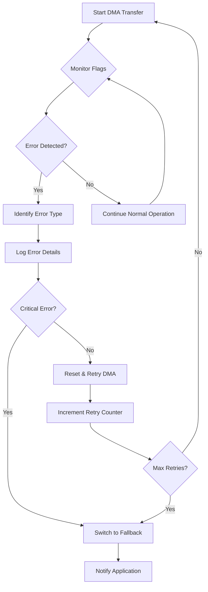

# STM32 DMA Error Handling

## Introduction

Direct Memory Access (DMA) is a powerful feature in STM32 microcontrollers that allows data transfers between memory and peripherals without CPU intervention. While DMA significantly improves performance and efficiency, it's essential to implement proper error handling to ensure your applications remain robust when unexpected issues occur.

This guide explores common DMA errors, detection methods, and best practices for handling these errors in STM32 applications. By the end, you'll be equipped with the knowledge to implement reliable DMA error handling mechanisms in your projects.

## Understanding DMA Errors

Before diving into error handling, it's important to understand the types of errors that can occur during DMA transfers:

1. **Transfer Error** - Occurs when the DMA controller cannot access the source or destination address.
2. **FIFO Error** - Happens when the FIFO buffer overflows or underflows during transfer (applies to DMA2 in STM32F4/F7).
3. **Direct Mode Error** - Occurs in direct mode when the peripheral is not ready to receive/send data.
4. **Bus Error** - Happens when a bus access issue occurs during the transfer.
5. **Address Error** - Triggered when an invalid address is accessed during transfer.

## DMA Error Interrupt Handling

STM32 DMA controllers provide error interrupt flags that can be used to detect and handle errors. Let's examine how to set up and handle these interrupts:

### Configuring DMA Error Interrupts

```c
void ConfigureDMA_ErrorHandling(void)
{
  /* Enable DMA stream */
  DMA_InitTypeDef DMA_InitStructure;
  
  /* DMA configuration code... */
  
  /* Enable DMA error interrupts */
  DMA_ITConfig(DMA2_Stream0, DMA_IT_TE | DMA_IT_FE | DMA_IT_DME, ENABLE);
  
  /* Configure NVIC for DMA interrupt */
  NVIC_InitTypeDef NVIC_InitStructure;
  NVIC_InitStructure.NVIC_IRQChannel = DMA2_Stream0_IRQn;
  NVIC_InitStructure.NVIC_IRQChannelPreemptionPriority = 0;
  NVIC_InitStructure.NVIC_IRQChannelSubPriority = 0;
  NVIC_InitStructure.NVIC_IRQChannelCmd = ENABLE;
  NVIC_Init(&NVIC_InitStructure);
}
```

### Implementing the DMA Error Interrupt Handler

```c
void DMA2_Stream0_IRQHandler(void)
{
  /* Check for Transfer Error */
  if (DMA_GetITStatus(DMA2_Stream0, DMA_IT_TEIF0) != RESET)
  {
    /* Clear the flag */
    DMA_ClearITPendingBit(DMA2_Stream0, DMA_IT_TEIF0);
    
    /* Handle the error - for example, restart the transfer or notify application */
    HandleDMATransferError();
  }
  
  /* Check for FIFO Error */
  if (DMA_GetITStatus(DMA2_Stream0, DMA_IT_FEIF0) != RESET)
  {
    /* Clear the flag */
    DMA_ClearITPendingBit(DMA2_Stream0, DMA_IT_FEIF0);
    
    /* Handle FIFO error */
    HandleDMAFifoError();
  }
  
  /* Check for Direct Mode Error */
  if (DMA_GetITStatus(DMA2_Stream0, DMA_IT_DMEIF0) != RESET)
  {
    /* Clear the flag */
    DMA_ClearITPendingBit(DMA2_Stream0, DMA_IT_DMEIF0);
    
    /* Handle Direct Mode error */
    HandleDMADirectModeError();
  }
  
  /* Also check for transfer complete if needed */
  if (DMA_GetITStatus(DMA2_Stream0, DMA_IT_TCIF0) != RESET)
  {
    /* Clear the flag */
    DMA_ClearITPendingBit(DMA2_Stream0, DMA_IT_TCIF0);
    
    /* Handle transfer complete */
    HandleDMATransferComplete();
  }
}
```

## Error Handling Strategies

When a DMA error occurs, there are several strategies you can implement:

### 1. Recovery and Retry

One common approach is to attempt recovery by resetting the DMA and retrying the transfer:

```c
void HandleDMATransferError(void)
{
  uint8_t maxRetries = 3;
  static uint8_t retryCount = 0;
  
  /* Disable the DMA stream */
  DMA_Cmd(DMA2_Stream0, DISABLE);
  
  /* Wait for the stream to be effectively disabled */
  while (DMA_GetCmdStatus(DMA2_Stream0) != DISABLE)
  {
    /* Wait */
  }
  
  if (retryCount < maxRetries)
  {
    /* Reset DMA stream configuration */
    DMA_DeInit(DMA2_Stream0);
    
    /* Reconfigure the DMA stream */
    ConfigureDMA();
    
    /* Re-enable the DMA stream */
    DMA_Cmd(DMA2_Stream0, ENABLE);
    
    retryCount++;
    
    /* Log the retry attempt */
    LogDMARetry(retryCount);
  }
  else
  {
    /* Max retries reached, notify application of persistent failure */
    NotifyDMAFailure();
    retryCount = 0;  /* Reset for next error occurrence */
  }
}
```

### 2. Fallback to Polling Mode

If DMA transfer fails consistently, you might want to fall back to a more reliable (though less efficient) polling-based transfer:

```c
void NotifyDMAFailure(void)
{
  /* Disable DMA for this peripheral */
  USART_DMACmd(USART2, USART_DMAReq_Tx, DISABLE);
  
  /* Set a flag to use polling mode instead */
  g_useDMAForTransfer = 0;
  
  /* Log the fallback */
  LogMessage("DMA transfer failed, falling back to polling mode");
  
  /* Optionally notify user through LED or other indicator */
  Error_Handler();
}
```

### 3. Graceful Degradation

For critical applications, implement a graceful degradation strategy:

```c
void Error_Handler(void)
{
  /* If this is a critical component */
  if (IS_CRITICAL_COMPONENT)
  {
    /* Reset the system */
    NVIC_SystemReset();
  }
  else
  {
    /* Disable only the affected peripheral */
    DisableAffectedPeripheral();
    
    /* Notify application of reduced functionality */
    SetSystemState(DEGRADED_MODE);
    
    /* Enable backup communication channel if available */
    EnableBackupCommunication();
  }
  
  /* Log the error with details */
  LogErrorDetails();
}
```

## Real-World Example: ADC with DMA Error Handling

Let's explore a complete example of an ADC using DMA with robust error handling:

```c
/* Global variables */
uint16_t ADC_Buffer[32];  /* Buffer to store ADC readings */
volatile uint8_t DMA_ErrorFlag = 0;  /* Error flag */
volatile uint8_t DMA_CompleteFlag = 0;  /* Completion flag */

/* ADC and DMA configuration function */
void ConfigureADC_WithDMA(void)
{
  /* Enable peripherals clocks */
  RCC_AHB1PeriphClockCmd(RCC_AHB1Periph_DMA2, ENABLE);
  RCC_APB2PeriphClockCmd(RCC_APB2Periph_ADC1, ENABLE);
  
  /* DMA configuration */
  DMA_InitTypeDef DMA_InitStructure;
  DMA_DeInit(DMA2_Stream0);
  DMA_InitStructure.DMA_Channel = DMA_Channel_0;
  DMA_InitStructure.DMA_PeripheralBaseAddr = (uint32_t)&ADC1->DR;
  DMA_InitStructure.DMA_Memory0BaseAddr = (uint32_t)ADC_Buffer;
  DMA_InitStructure.DMA_DIR = DMA_DIR_PeripheralToMemory;
  DMA_InitStructure.DMA_BufferSize = 32;
  DMA_InitStructure.DMA_PeripheralInc = DMA_PeripheralInc_Disable;
  DMA_InitStructure.DMA_MemoryInc = DMA_MemoryInc_Enable;
  DMA_InitStructure.DMA_PeripheralDataSize = DMA_PeripheralDataSize_HalfWord;
  DMA_InitStructure.DMA_MemoryDataSize = DMA_MemoryDataSize_HalfWord;
  DMA_InitStructure.DMA_Mode = DMA_Mode_Circular;
  DMA_InitStructure.DMA_Priority = DMA_Priority_High;
  DMA_InitStructure.DMA_FIFOMode = DMA_FIFOMode_Disable;
  DMA_InitStructure.DMA_MemoryBurst = DMA_MemoryBurst_Single;
  DMA_InitStructure.DMA_PeripheralBurst = DMA_PeripheralBurst_Single;
  DMA_Init(DMA2_Stream0, &DMA_InitStructure);
  
  /* Enable DMA Stream Transfer Complete and Error interrupts */
  DMA_ITConfig(DMA2_Stream0, DMA_IT_TC | DMA_IT_TE | DMA_IT_FE, ENABLE);
  
  /* Enable DMA */
  DMA_Cmd(DMA2_Stream0, ENABLE);
  
  /* Configure NVIC */
  NVIC_InitTypeDef NVIC_InitStructure;
  NVIC_InitStructure.NVIC_IRQChannel = DMA2_Stream0_IRQn;
  NVIC_InitStructure.NVIC_IRQChannelPreemptionPriority = 0;
  NVIC_InitStructure.NVIC_IRQChannelSubPriority = 0;
  NVIC_InitStructure.NVIC_IRQChannelCmd = ENABLE;
  NVIC_Init(&NVIC_InitStructure);
  
  /* ADC common configuration */
  ADC_CommonInitTypeDef ADC_CommonInitStructure;
  ADC_CommonInitStructure.ADC_Mode = ADC_Mode_Independent;
  ADC_CommonInitStructure.ADC_Prescaler = ADC_Prescaler_Div4;
  ADC_CommonInitStructure.ADC_DMAAccessMode = ADC_DMAAccessMode_Disabled;
  ADC_CommonInitStructure.ADC_TwoSamplingDelay = ADC_TwoSamplingDelay_5Cycles;
  ADC_CommonInit(&ADC_CommonInitStructure);
  
  /* ADC1 configuration */
  ADC_InitTypeDef ADC_InitStructure;
  ADC_InitStructure.ADC_Resolution = ADC_Resolution_12b;
  ADC_InitStructure.ADC_ScanConvMode = ENABLE;
  ADC_InitStructure.ADC_ContinuousConvMode = ENABLE;
  ADC_InitStructure.ADC_ExternalTrigConvEdge = ADC_ExternalTrigConvEdge_None;
  ADC_InitStructure.ADC_DataAlign = ADC_DataAlign_Right;
  ADC_InitStructure.ADC_NbrOfConversion = 1;
  ADC_Init(ADC1, &ADC_InitStructure);
  
  /* Enable ADC1 DMA */
  ADC_DMACmd(ADC1, ENABLE);
  
  /* Configure ADC channel */
  ADC_RegularChannelConfig(ADC1, ADC_Channel_0, 1, ADC_SampleTime_56Cycles);
  
  /* Enable ADC1 */
  ADC_Cmd(ADC1, ENABLE);
  
  /* Start ADC1 Software Conversion */
  ADC_SoftwareStartConv(ADC1);
}

/* DMA interrupt handler */
void DMA2_Stream0_IRQHandler(void)
{
  /* Check for Transfer Complete interrupt */
  if (DMA_GetITStatus(DMA2_Stream0, DMA_IT_TCIF0) != RESET)
  {
    DMA_ClearITPendingBit(DMA2_Stream0, DMA_IT_TCIF0);
    DMA_CompleteFlag = 1;
  }
  
  /* Check for Transfer Error interrupt */
  if (DMA_GetITStatus(DMA2_Stream0, DMA_IT_TEIF0) != RESET)
  {
    DMA_ClearITPendingBit(DMA2_Stream0, DMA_IT_TEIF0);
    DMA_ErrorFlag = 1;
    HandleDMAError();
  }
  
  /* Check for FIFO Error interrupt */
  if (DMA_GetITStatus(DMA2_Stream0, DMA_IT_FEIF0) != RESET)
  {
    DMA_ClearITPendingBit(DMA2_Stream0, DMA_IT_FEIF0);
    DMA_ErrorFlag = 1;
    HandleDMAError();
  }
}

/* DMA error handler function */
void HandleDMAError(void)
{
  static uint8_t errorCount = 0;
  
  /* Stop ADC conversion */
  ADC_Cmd(ADC1, DISABLE);
  
  /* Disable DMA */
  DMA_Cmd(DMA2_Stream0, DISABLE);
  
  /* Wait for DMA to be disabled */
  while (DMA_GetCmdStatus(DMA2_Stream0) != DISABLE)
  {
    /* Wait */
  }
  
  /* Increment error counter */
  errorCount++;
  
  if (errorCount < 3)
  {
    /* Reset DMA stream */
    DMA_DeInit(DMA2_Stream0);
    
    /* Reconfigure DMA and ADC */
    ConfigureADC_WithDMA();
    
    /* Log the error and retry */
    LogMessage("DMA error detected, retrying ADC configuration");
  }
  else
  {
    /* Multiple errors occurred, switch to failsafe mode */
    InitializeFailsafeADC_PollingMode();
    
    /* Log the critical error */
    LogMessage("Critical DMA error: Switching to polling mode for ADC");
    
    /* Reset error counter */
    errorCount = 0;
  }
}

/* Fallback polling-based ADC function */
void InitializeFailsafeADC_PollingMode(void)
{
  /* Disable DMA requests */
  ADC_DMACmd(ADC1, DISABLE);
  
  /* Reconfigure ADC for polling mode */
  ADC_InitTypeDef ADC_InitStructure;
  ADC_InitStructure.ADC_Resolution = ADC_Resolution_12b;
  ADC_InitStructure.ADC_ScanConvMode = DISABLE;
  ADC_InitStructure.ADC_ContinuousConvMode = DISABLE;
  ADC_InitStructure.ADC_ExternalTrigConvEdge = ADC_ExternalTrigConvEdge_None;
  ADC_InitStructure.ADC_DataAlign = ADC_DataAlign_Right;
  ADC_InitStructure.ADC_NbrOfConversion = 1;
  ADC_Init(ADC1, &ADC_InitStructure);
  
  /* Enable ADC */
  ADC_Cmd(ADC1, ENABLE);
}

/* Function to read ADC in polling mode (fallback) */
uint16_t ReadADC_PollingMode(void)
{
  /* Start the conversion */
  ADC_SoftwareStartConv(ADC1);
  
  /* Wait until conversion completion */
  while(ADC_GetFlagStatus(ADC1, ADC_FLAG_EOC) == RESET)
  {
    /* Wait */
  }
  
  /* Return the conversion result */
  return ADC_GetConversionValue(ADC1);
}

/* Main application function showing error handling in practice */
void ApplicationTask(void)
{
  /* Initialize ADC with DMA */
  ConfigureADC_WithDMA();
  
  while(1)
  {
    /* Check if DMA error occurred */
    if (DMA_ErrorFlag)
    {
      /* Clear flag (already handled in the IRQ) */
      DMA_ErrorFlag = 0;
      
      /* If we're in polling mode now, read ADC manually */
      if (ADC_DMAGetStatus(ADC1) == RESET)
      {
        uint16_t adcValue = ReadADC_PollingMode();
        ProcessADCValue(adcValue);
      }
    }
    
    /* Check if DMA transfer is complete */
    if (DMA_CompleteFlag)
    {
      DMA_CompleteFlag = 0;
      
      /* Process ADC values from buffer */
      ProcessADCBuffer(ADC_Buffer, 32);
    }
    
    /* Other application tasks */
    SystemTasks();
  }
}
```

## Error Monitoring and Debugging

### Using Status Registers

STM32 DMA controllers provide status registers that allow you to check the error conditions:

```c
/* Function to check DMA error status */
DMAErrorStatus_t CheckDMAErrors(DMA_Stream_TypeDef* DMAy_Streamx)
{
  DMAErrorStatus_t errorStatus = {0};
  
  /* Create a status structure */
  errorStatus.TransferError = DMA_GetFlagStatus(DMAy_Streamx, DMA_FLAG_TEIF0) != RESET;
  errorStatus.FIFOError = DMA_GetFlagStatus(DMAy_Streamx, DMA_FLAG_FEIF0) != RESET;
  errorStatus.DirectModeError = DMA_GetFlagStatus(DMAy_Streamx, DMA_FLAG_DMEIF0) != RESET;
  
  return errorStatus;
}
```

### Error Monitoring Flow



## Best Practices for DMA Error Handling

1. **Always Enable Error Interrupts**: Enable all relevant error interrupts to detect issues early.

2. **Clear Error Flags**: Always clear error flags after detecting them to prevent persistent interrupt triggering.

3. **Implement Retry Mechanisms**: For transient errors, retry the DMA configuration with a limited retry count.

4. **Failsafe Fallbacks**: Have a backup method (like polling) ready if DMA consistently fails.

5. **Error Logging**: Maintain an error log to track DMA issues for debugging.

6. **Timeout Monitoring**: Implement watchdog timers to detect hung DMA transfers.

7. **Reset Strategy**: Define a clear reset strategy - either peripheral-only or system-wide if necessary.

8. **Error Counters**: Use error counters to detect patterns and prevent infinite retry loops.

## Common Error Scenarios and Solutions

| Error Type | Possible Causes | Solution |
|------------|----------------|----------|
| Transfer Error | Invalid memory address, peripheral not ready | Check address configuration, ensure peripheral is enabled |
| FIFO Error | Data throughput mismatch, burst mode issues | Adjust FIFO threshold, check burst configuration |
| Direct Mode Error | Peripheral timing issues | Use FIFO mode instead, check peripheral clock |
| Bus Error | Multiple masters conflict, bus overload | Check bus priority, reduce DMA priority |
| Configuration Error | Wrong channel/stream for peripheral | Verify peripheral-DMA channel mapping |

## Summary

Proper DMA error handling is essential for building robust STM32 applications. By understanding common error types, implementing appropriate detection mechanisms, and having fallback strategies, you can ensure your system remains operational even when DMA issues occur.

The key takeaways from this tutorial are:

1. Always enable DMA error interrupts to catch issues early
2. Implement a structured approach to handling different error types
3. Have a fallback strategy when DMA fails repeatedly
4. Use error counters and logging to track issues
5. Apply the appropriate reset strategy based on error severity

By implementing these practices, you'll create more reliable embedded systems that can recover gracefully from DMA-related issues.

## Additional Resources

- STM32F4 Reference Manual (RM0090): Detailed information about DMA controllers
- Application Note AN4031: STM32 DMA controller
- Application Note AN5093: Safe DMA usage in STM32 applications

## Exercises

1. Implement a DMA error handler for an SPI transfer that falls back to polling mode after three failed attempts.
2. Create a logging system that records DMA error types, timestamps, and recovery actions.
3. Modify the ADC example to handle different error types with specific recovery strategies.
4. Implement a watchdog timer to detect and recover from stalled DMA transfers.
5. Design a complete error monitoring dashboard that tracks DMA errors across multiple peripherals.