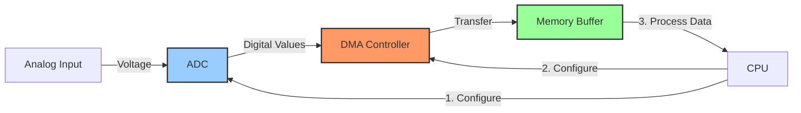

# STM32 DMA with ADC

## Introduction

When working with STM32 microcontrollers, you'll often need to read analog signals from sensors, potentiometers, or other analog sources. The Analog-to-Digital Converter (ADC) is perfect for this task, but continuously polling the ADC can consume significant CPU resources. This is where Direct Memory Access (DMA) comes to the rescue!

In this tutorial, we'll explore how to combine the ADC with DMA to efficiently capture analog data without CPU intervention. This powerful combination allows your microcontroller to perform other tasks while analog readings are automatically transferred to memory.

## What You'll Learn

- The basic concepts of DMA and ADC
- How DMA and ADC work together
- Step-by-step configuration of DMA with ADC
- Single-channel and multi-channel ADC with DMA
- Continuous conversion mode
- Practical examples for real-world applications

## Prerequisites

- Basic knowledge of STM32 microcontrollers
- Familiarity with STM32CubeIDE or similar development environment
- Understanding of C programming fundamentals
- Basic knowledge of GPIO and ADC concepts

## Understanding DMA with ADC

### Quick Recap: What is DMA?

Direct Memory Access (DMA) is a feature that allows data transfer between peripherals and memory without CPU intervention. The CPU initiates the transfer, but once started, the DMA controller handles all data movement, freeing the CPU for other tasks.

### Quick Recap: What is ADC?

The Analog-to-Digital Converter (ADC) converts analog voltages into digital values that can be processed by the microcontroller. STM32 microcontrollers typically have 12-bit ADCs, meaning they can represent analog voltages with 4096 (2^12) discrete levels.

### Why Use DMA with ADC?

Without DMA, the typical ADC workflow looks like this:

1. CPU starts an ADC conversion
2. CPU waits for conversion to complete (polling) or gets interrupted
3. CPU reads the result and stores it
4. Repeat for each sample

This approach is inefficient because:

- The CPU wastes cycles waiting for conversions
- High-frequency sampling becomes difficult
- Handling interrupts adds overhead
- Timing can be inconsistent

With DMA, the workflow becomes:

1. CPU configures ADC and DMA once
2. DMA automatically transfers ADC results to memory
3. CPU can perform other tasks or enter low-power mode
4. Once all samples are collected, DMA can notify the CPU (optional)

This approach offers significant advantages:

- CPU is free for other tasks
- Consistent and precise sampling rates
- Lower power consumption
- Higher maximum sampling frequencies
- Multiple ADC channels can be easily processed

## How DMA and ADC Work Together

Let's visualize the interaction between the ADC, DMA, and memory:



The process works as follows:

1. The ADC converts analog signals to digital values
2. When a conversion completes, the ADC generates a request to the DMA
3. The DMA transfers the conversion result to a predefined memory location
4. This cycle repeats without CPU intervention
5. After all transfers complete, the DMA can optionally generate an interrupt

## Setting Up DMA with ADC: Step-by-Step Guide

Let's walk through configuring DMA with ADC on an STM32 microcontroller. We'll use the STM32CubeIDE for this example, but the concepts apply to other tools as well.

### 1. Configure the ADC

First, we need to set up the ADC:

```c
void ADC_Init(void) {
    // Enable ADC and GPIO clock
    RCC->AHB1ENR |= RCC_AHB1ENR_GPIOAEN;  // Enable GPIOA clock
    RCC->APB2ENR |= RCC_APB2ENR_ADC1EN;   // Enable ADC1 clock
    
    // Configure PA0 as analog input
    GPIOA->MODER |= GPIO_MODER_MODE0;     // Set PA0 to analog mode (11)
    
    // Configure ADC1
    ADC1->CR1 = 0;                        // Reset CR1 register
    ADC1->CR2 = 0;                        // Reset CR2 register
    
    // Set ADC resolution to 12 bits
    ADC1->CR1 &= ~ADC_CR1_RES;
    
    // Enable scan mode for multiple channels (if needed)
    ADC1->CR1 |= ADC_CR1_SCAN;
    
    // Enable DMA and DMA continuous requests
    ADC1->CR2 |= ADC_CR2_DMA | ADC_CR2_DDS;
    
    // Enable continuous conversion mode
    ADC1->CR2 |= ADC_CR2_CONT;
    
    // Configure for one channel (channel 0 - PA0)
    ADC1->SQR1 = 0;                       // 1 conversion in regular sequence
    ADC1->SQR3 = 0;                       // Set channel 0 as first conversion
    
    // Set sampling time for channel 0 (longer time = more accurate)
    ADC1->SMPR2 |= (7 << (3 * 0));        // Set maximum sampling time for channel 0
}
```

### 2. Configure the DMA

Next, we configure the DMA:

```c
void DMA_Init(uint16_t *buffer, uint16_t size) {
    // Enable DMA2 clock
    RCC->AHB1ENR |= RCC_AHB1ENR_DMA2EN;
    
    // Configure DMA2 Stream0 (Used for ADC1)
    DMA2_Stream0->CR = 0;                 // Reset DMA CR register
    
    // Wait for DMA to be disabled
    while (DMA2_Stream0->CR & DMA_SxCR_EN);
    
    DMA2_Stream0->PAR = (uint32_t)&ADC1->DR;  // Source: ADC1 Data Register
    DMA2_Stream0->M0AR = (uint32_t)buffer;    // Destination: Our buffer
    DMA2_Stream0->NDTR = size;               // Number of data items to transfer
    
    // Configure DMA transfer
    DMA2_Stream0->CR |= DMA_SxCR_PL_1;       // Priority: High
    DMA2_Stream0->CR |= DMA_SxCR_MSIZE_0;    // Memory data size: 16 bits
    DMA2_Stream0->CR |= DMA_SxCR_PSIZE_0;    // Peripheral data size: 16 bits
    DMA2_Stream0->CR |= DMA_SxCR_MINC;       // Memory increment mode
    DMA2_Stream0->CR |= DMA_SxCR_CIRC;       // Circular mode for continuous sampling
    
    // Enable DMA transfer complete interrupt (optional)
    // DMA2_Stream0->CR |= DMA_SxCR_TCIE;
    
    // Enable DMA Stream
    DMA2_Stream0->CR |= DMA_SxCR_EN;
}
```

### 3. Start the ADC with DMA

Finally, we start the ADC conversion:

```c
void ADC_Start(void) {
    // Enable ADC1
    ADC1->CR2 |= ADC_CR2_ADON;
    
    // Small delay to ensure ADC is ready
    for(volatile int i = 0; i < 1000; i++);
    
    // Start conversion
    ADC1->CR2 |= ADC_CR2_SWSTART;
}
```

### 4. Complete Example

Let's put it all together:

```c
#include "stm32f4xx.h"

#define ADC_BUFFER_SIZE 100

uint16_t adc_buffer[ADC_BUFFER_SIZE];
volatile uint8_t conversion_complete = 0;

int main(void) {
    // Initialize buffer
    for (int i = 0; i < ADC_BUFFER_SIZE; i++) {
        adc_buffer[i] = 0;
    }
    
    // Initialize system
    SystemInit();
    
    // Initialize ADC and DMA
    ADC_Init();
    DMA_Init(adc_buffer, ADC_BUFFER_SIZE);
    
    // Start ADC conversions
    ADC_Start();
    
    // Main loop
    while (1) {
        // Your application code here
        // The ADC values are continuously updated in adc_buffer
        
        // Example: Process the collected data
        uint32_t sum = 0;
        for (int i = 0; i < ADC_BUFFER_SIZE; i++) {
            sum += adc_buffer[i];
        }
        uint16_t average = sum / ADC_BUFFER_SIZE;
        
        // Do something with the average value
        if (average > 2048) {
            // Voltage is above mid-point
            // Toggle an LED or perform some action
        }
    }
}
```

## Multiple ADC Channels with DMA

In many applications, you'll need to sample multiple analog inputs. Here's how to configure multiple ADC channels with DMA:

### 1. Configure Multiple ADC Channels

```c
void ADC_Init_MultiChannel(void) {
    // Enable ADC and GPIO clock
    RCC->AHB1ENR |= RCC_AHB1ENR_GPIOAEN;  // Enable GPIOA clock
    RCC->APB2ENR |= RCC_APB2ENR_ADC1EN;   // Enable ADC1 clock
    
    // Configure PA0, PA1, and PA4 as analog inputs
    GPIOA->MODER |= GPIO_MODER_MODE0;     // Set PA0 to analog mode
    GPIOA->MODER |= GPIO_MODER_MODE1;     // Set PA1 to analog mode
    GPIOA->MODER |= GPIO_MODER_MODE4;     // Set PA4 to analog mode
    
    // Configure ADC1
    ADC1->CR1 = 0;
    ADC1->CR2 = 0;
    
    // Enable scan mode for multiple channels
    ADC1->CR1 |= ADC_CR1_SCAN;
    
    // Enable DMA and DMA continuous requests
    ADC1->CR2 |= ADC_CR2_DMA | ADC_CR2_DDS;
    
    // Enable continuous conversion mode
    ADC1->CR2 |= ADC_CR2_CONT;
    
    // Configure for three channels (0, 1, and 4)
    ADC1->SQR1 = (2 << 20);               // 3 conversions in regular sequence (value = channels - 1)
    ADC1->SQR3 = (0 << 0) | (1 << 5) | (4 << 10);  // Channel sequence: 0, 1, 4
    
    // Set sampling time for channels
    ADC1->SMPR2 |= (7 << (3 * 0));        // Set sampling time for channel 0
    ADC1->SMPR2 |= (7 << (3 * 1));        // Set sampling time for channel 1
    ADC1->SMPR2 |= (7 << (3 * 4));        // Set sampling time for channel 4
}
```

### 2. Using the Multi-Channel Data

```c
#define NUM_CHANNELS 3
#define SAMPLES_PER_CHANNEL 100
#define TOTAL_SAMPLES (NUM_CHANNELS * SAMPLES_PER_CHANNEL)

uint16_t adc_buffer[TOTAL_SAMPLES];

int main(void) {
    // Initialize ADC and DMA for multiple channels
    ADC_Init_MultiChannel();
    DMA_Init(adc_buffer, TOTAL_SAMPLES);
    
    // Start ADC conversions
    ADC_Start();
    
    while (1) {
        // Process the data
        uint32_t ch0_sum = 0, ch1_sum = 0, ch4_sum = 0;
        
        for (int i = 0; i < SAMPLES_PER_CHANNEL; i++) {
            ch0_sum += adc_buffer[i * NUM_CHANNELS + 0];     // Channel 0 data
            ch1_sum += adc_buffer[i * NUM_CHANNELS + 1];     // Channel 1 data
            ch4_sum += adc_buffer[i * NUM_CHANNELS + 2];     // Channel 4 data
        }
        
        uint16_t ch0_avg = ch0_sum / SAMPLES_PER_CHANNEL;
        uint16_t ch1_avg = ch1_sum / SAMPLES_PER_CHANNEL;
        uint16_t ch4_avg = ch4_sum / SAMPLES_PER_CHANNEL;
        
        // Use the averaged values
        // ...
    }
}
```

## Using HAL Library for DMA with ADC

While the register-level approach provides deep understanding, many prefer using the STM32 HAL (Hardware Abstraction Layer) library for easier development. Here's how to configure DMA with ADC using HAL:

```c
#include "stm32f4xx_hal.h"

#define ADC_BUFFER_SIZE 100

ADC_HandleTypeDef hadc1;
DMA_HandleTypeDef hdma_adc1;
uint16_t adc_buffer[ADC_BUFFER_SIZE];

void SystemClock_Config(void);
static void MX_GPIO_Init(void);
static void MX_DMA_Init(void);
static void MX_ADC1_Init(void);

int main(void) {
    // Initialize HAL Library
    HAL_Init();
    
    // Configure system clock
    SystemClock_Config();
    
    // Initialize peripherals
    MX_GPIO_Init();
    MX_DMA_Init();
    MX_ADC1_Init();
    
    // Start ADC with DMA
    HAL_ADC_Start_DMA(&hadc1, (uint32_t*)adc_buffer, ADC_BUFFER_SIZE);
    
    while (1) {
        // Your application code here
        // adc_buffer contains the ADC values
    }
}

static void MX_ADC1_Init(void) {
    ADC_ChannelConfTypeDef sConfig = {0};
    
    // Configure ADC
    hadc1.Instance = ADC1;
    hadc1.Init.ClockPrescaler = ADC_CLOCK_SYNC_PCLK_DIV4;
    hadc1.Init.Resolution = ADC_RESOLUTION_12B;
    hadc1.Init.ScanConvMode = ENABLE;
    hadc1.Init.ContinuousConvMode = ENABLE;
    hadc1.Init.DiscontinuousConvMode = DISABLE;
    hadc1.Init.ExternalTrigConvEdge = ADC_EXTERNALTRIGCONVEDGE_NONE;
    hadc1.Init.ExternalTrigConv = ADC_SOFTWARE_START;
    hadc1.Init.DataAlign = ADC_DATAALIGN_RIGHT;
    hadc1.Init.NbrOfConversion = 1;
    hadc1.Init.DMAContinuousRequests = ENABLE;
    hadc1.Init.EOCSelection = ADC_EOC_SINGLE_CONV;
    HAL_ADC_Init(&hadc1);
    
    // Configure ADC channel
    sConfig.Channel = ADC_CHANNEL_0;
    sConfig.Rank = 1;
    sConfig.SamplingTime = ADC_SAMPLETIME_480CYCLES;
    HAL_ADC_ConfigChannel(&hadc1, &sConfig);
}

static void MX_DMA_Init(void) {
    // Enable DMA2 clock
    __HAL_RCC_DMA2_CLK_ENABLE();
    
    // Configure DMA for ADC
    hdma_adc1.Instance = DMA2_Stream0;
    hdma_adc1.Init.Channel = DMA_CHANNEL_0;
    hdma_adc1.Init.Direction = DMA_PERIPH_TO_MEMORY;
    hdma_adc1.Init.PeriphInc = DMA_PINC_DISABLE;
    hdma_adc1.Init.MemInc = DMA_MINC_ENABLE;
    hdma_adc1.Init.PeriphDataAlignment = DMA_PDATAALIGN_HALFWORD;
    hdma_adc1.Init.MemDataAlignment = DMA_MDATAALIGN_HALFWORD;
    hdma_adc1.Init.Mode = DMA_CIRCULAR;
    hdma_adc1.Init.Priority = DMA_PRIORITY_HIGH;
    hdma_adc1.Init.FIFOMode = DMA_FIFOMODE_DISABLE;
    HAL_DMA_Init(&hdma_adc1);
    
    // Link DMA with ADC
    __HAL_LINKDMA(&hadc1, DMA_Handle, hdma_adc1);
    
    // Configure DMA interrupt (optional)
    HAL_NVIC_SetPriority(DMA2_Stream0_IRQn, 0, 0);
    HAL_NVIC_EnableIRQ(DMA2_Stream0_IRQn);
}

// DMA completion callback (optional)
void HAL_ADC_ConvCpltCallback(ADC_HandleTypeDef* hadc) {
    if(hadc->Instance == ADC1) {
        // ADC conversion complete - buffer is filled
        // Process the data here or set a flag
    }
}
```

## Practical Applications

Let's explore some real-world applications of DMA with ADC:

### 1. Digital Oscilloscope

You can create a simple digital oscilloscope by sampling an analog signal at high frequency and sending the data to a PC.

```c
#define SAMPLE_COUNT 1000
#define SAMPLING_FREQUENCY 10000 // 10 kHz

uint16_t samples[SAMPLE_COUNT];
volatile uint8_t sampling_complete = 0;

// Configure Timer to control ADC sampling rate
void Timer_Init(void) {
    // Configure timer for precise sampling rate
    // ...
}

// DMA transfer complete callback
void HAL_ADC_ConvCpltCallback(ADC_HandleTypeDef* hadc) {
    sampling_complete = 1;
    HAL_ADC_Stop_DMA(&hadc1);
}

int main(void) {
    // Initialize peripherals
    // ...
    
    while (1) {
        if (start_sampling) {
            sampling_complete = 0;
            
            // Start ADC with DMA
            HAL_ADC_Start_DMA(&hadc1, (uint32_t*)samples, SAMPLE_COUNT);
            
            // Wait for sampling to complete
            while (!sampling_complete);
            
            // Send data to PC
            for (int i = 0; i < SAMPLE_COUNT; i++) {
                printf("%d
", samples[i]);
            }
            
            start_sampling = 0;
        }
    }
}
```

### 2. Audio Processing

You can sample audio signals and process them in real-time:

```c
#define AUDIO_BUFFER_SIZE 512
uint16_t audio_buffer[AUDIO_BUFFER_SIZE];
uint16_t processed_buffer[AUDIO_BUFFER_SIZE];
volatile uint8_t buffer_half = 0;
volatile uint8_t buffer_full = 0;

// DMA half transfer callback
void HAL_ADC_ConvHalfCpltCallback(ADC_HandleTypeDef* hadc) {
    buffer_half = 1;
}

// DMA transfer complete callback
void HAL_ADC_ConvCpltCallback(ADC_HandleTypeDef* hadc) {
    buffer_full = 1;
}

// Process audio data (simple echo effect)
void ProcessAudio(uint16_t* input, uint16_t* output, uint16_t size) {
    static uint16_t delay_buffer[256] = {0};
    static uint16_t delay_index = 0;
    
    for (int i = 0; i < size; i++) {
        // Mix original signal with delayed signal (echo)
        uint16_t delayed_sample = delay_buffer[delay_index];
        delay_buffer[delay_index] = input[i];
        delay_index = (delay_index + 1) & 0xFF; // Wrap around at 256
        
        // Apply echo (70% original, 30% delayed)
        output[i] = (input[i] * 7 + delayed_sample * 3) / 10;
    }
}

int main(void) {
    // Initialize peripherals
    // ...
    
    // Start continuous ADC with DMA
    HAL_ADC_Start_DMA(&hadc1, (uint32_t*)audio_buffer, AUDIO_BUFFER_SIZE);
    
    while (1) {
        // Process first half of buffer when half complete
        if (buffer_half) {
            ProcessAudio(audio_buffer, processed_buffer, AUDIO_BUFFER_SIZE/2);
            // Output processed data (DAC, PWM, etc.)
            buffer_half = 0;
        }
        
        // Process second half of buffer when fully complete
        if (buffer_full) {
            ProcessAudio(audio_buffer + AUDIO_BUFFER_SIZE/2, 
                         processed_buffer + AUDIO_BUFFER_SIZE/2, 
                         AUDIO_BUFFER_SIZE/2);
            // Output processed data (DAC, PWM, etc.)
            buffer_full = 0;
        }
    }
}
```

### 3. Multi-Channel Data Logger

Create a data logger that monitors multiple analog sensors:

```c
#define NUM_CHANNELS 4
#define SAMPLES_PER_CHANNEL 100
#define TOTAL_SAMPLES (NUM_CHANNELS * SAMPLES_PER_CHANNEL)

uint16_t adc_buffer[TOTAL_SAMPLES];
typedef struct {
    uint32_t timestamp;
    uint16_t temperature;
    uint16_t pressure;
    uint16_t humidity;
    uint16_t light;
} SensorData_t;

SensorData_t sensor_log[1000]; // Store 1000 sensor readings
uint16_t log_index = 0;

void ProcessSensorData(void) {
    uint32_t temp_sum = 0, pressure_sum = 0, humidity_sum = 0, light_sum = 0;
    
    // Average the samples for each channel
    for (int i = 0; i < SAMPLES_PER_CHANNEL; i++) {
        temp_sum += adc_buffer[i * NUM_CHANNELS + 0];      // Temperature sensor
        pressure_sum += adc_buffer[i * NUM_CHANNELS + 1];  // Pressure sensor
        humidity_sum += adc_buffer[i * NUM_CHANNELS + 2];  // Humidity sensor
        light_sum += adc_buffer[i * NUM_CHANNELS + 3];     // Light sensor
    }
    
    // Store in log
    sensor_log[log_index].timestamp = HAL_GetTick();
    sensor_log[log_index].temperature = temp_sum / SAMPLES_PER_CHANNEL;
    sensor_log[log_index].pressure = pressure_sum / SAMPLES_PER_CHANNEL;
    sensor_log[log_index].humidity = humidity_sum / SAMPLES_PER_CHANNEL;
    sensor_log[log_index].light = light_sum / SAMPLES_PER_CHANNEL;
    
    log_index = (log_index + 1) % 1000; // Circular buffer
}

int main(void) {
    // Initialize peripherals
    // ...
    
    // Start continuous ADC with DMA
    HAL_ADC_Start_DMA(&hadc1, (uint32_t*)adc_buffer, TOTAL_SAMPLES);
    
    while (1) {
        // Sleep for 1 second
        HAL_Delay(1000);
        
        // Process and log sensor data every second
        ProcessSensorData();
    }
}
```

## Common Issues and Solutions

### 1. DMA Not Transferring Data

If your DMA isn't transferring data:

- Ensure all clocks are enabled (ADC, DMA, GPIO)
- Verify the DMA channel and stream match your ADC
- Check that the ADC data register address is correct
- Make sure ADC is properly configured for DMA mode
- Verify that DMA is enabled before starting ADC conversion

### 2. Inconsistent Sampling Rate

For precise timing:

- Use a timer to trigger ADC conversions instead of continuous mode
- Configure the timer to the exact frequency needed
- Disable interrupts during critical timing sections
- Use DMA in circular mode to avoid gaps in sampling

### 3. Noisy ADC Readings

To reduce noise in ADC readings:

- Increase the ADC sampling time
- Add an external RC filter to the analog input
- Average multiple samples for each channel
- Ensure proper grounding and power supply filtering
- Keep analog signals away from digital signals and clock lines

## Summary

In this tutorial, you've learned:

- How DMA and ADC work together to efficiently capture analog data
- The step-by-step process to configure DMA with ADC on STM32 microcontrollers
- How to handle single-channel and multi-channel ADC sampling
- Techniques for processing ADC data in real-time
- Real-world applications demonstrating the power of DMA with ADC
- Common issues and their solutions

By using DMA with ADC, you can significantly improve the performance and efficiency of your STM32 applications, especially those requiring continuous analog data acquisition.

## Exercises

1. Modify the single-channel example to sample at a precise frequency using a timer trigger.
2. Implement a digital voltmeter that displays the measured voltage on an LCD.
3. Create a multi-channel temperature monitoring system that samples multiple temperature sensors.
4. Implement a simple FFT (Fast Fourier Transform) on the sampled data to analyze frequency components.
5. Design a battery voltage logger that records battery voltage over time.

## Additional Resources

- [STM32 Reference Manual](https://www.st.com/resource/en/reference_manual/dm00031020-stm32f405-415-stm32f407-417-stm32f427-437-and-stm32f429-439-advanced-arm-based-32-bit-mcus-stmicroelectronics.pdf) - Official documentation for STM32 microcontrollers
- [STM32 HAL ADC Documentation](https://www.st.com/resource/en/user_manual/dm00105879-description-of-stm32f4-hal-and-ll-drivers-stmicroelectronics.pdf) - Details on the HAL ADC API
- [STM32CubeIDE Documentation](https://www.st.com/resource/en/user_manual/dm00603964-stm32cubeide-user-guide-stmicroelectronics.pdf) - Guide for STM32CubeIDE
- Online communities like [STM32 Forums](https://community.st.com/s/?language=en_US) and [Stack Overflow](https://stackoverflow.com/questions/tagged/stm32)