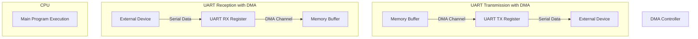

# STM32 DMA with UART

## Introduction

When developing embedded applications on STM32 microcontrollers, efficient data transfer between peripherals and memory is crucial for system performance. Direct Memory Access (DMA) is a powerful feature that allows data to be moved without consuming CPU resources. This tutorial focuses on combining DMA with UART (Universal Asynchronous Receiver-Transmitter) communication to create efficient, non-blocking data transfers in your STM32 applications.

By using DMA with UART, your microcontroller can:
- Receive or transmit data in the background while the CPU performs other tasks
- Handle high-speed data streams without missing bytes
- Reduce interrupt overhead and CPU load
- Process large data blocks efficiently

This guide will walk you through the fundamentals, configuration steps, and practical examples to help you master DMA-driven UART communication on STM32 microcontrollers.

## Prerequisites

Before diving into DMA with UART, you should be familiar with:
- Basic STM32 programming concepts
- UART communication fundamentals
- STM32CubeIDE or similar development environment
- STM32 HAL (Hardware Abstraction Layer) library

## Understanding DMA with UART

### What is DMA?

Direct Memory Access (DMA) is a feature that allows peripherals to transfer data to/from memory without CPU intervention. Think of DMA as an assistant that handles data movement tasks independently, freeing the CPU to focus on other operations.

### How DMA Works with UART

When UART and DMA work together:

1. For transmission (TX):
   - The CPU sets up a buffer with data to send
   - DMA reads data from this buffer and feeds it to the UART peripheral
   - The UART transmits each byte serially
   - All this happens without CPU involvement until the entire buffer is sent

2. For reception (RX):
   - The UART receives data serially
   - DMA transfers each received byte to a memory buffer
   - The CPU can process this data later, or be notified when the buffer is full



## DMA Channels and Streams in STM32

STM32 microcontrollers typically have multiple DMA channels (or streams in some families) that can be assigned to different peripherals. Each UART peripheral has specific DMA channels that can be used for transmission and reception.

For example, on an STM32F4 series:
- USART1 TX can use DMA2 Stream 7, Channel 4
- USART1 RX can use DMA2 Stream 5, Channel 4

The STM32 reference manual for your specific device will list the available DMA channels for each UART peripheral.

## Configuring DMA with UART

Let's walk through the step-by-step process of setting up DMA with UART on an STM32 microcontroller using the HAL library.

### 1. Initialize UART and DMA Handles

First, we need to define our UART and DMA handles:

```c
UART_HandleTypeDef huart2;
DMA_HandleTypeDef hdma_usart2_rx;
DMA_HandleTypeDef hdma_usart2_tx;

// Buffers for transmission and reception
uint8_t txBuffer[64];
uint8_t rxBuffer[64];
```

### 2. Configure the UART Peripheral

Configure the UART peripheral with the desired settings:

```c
void UART_Init(void) {
  huart2.Instance = USART2;
  huart2.Init.BaudRate = 115200;
  huart2.Init.WordLength = UART_WORDLENGTH_8B;
  huart2.Init.StopBits = UART_STOPBITS_1;
  huart2.Init.Parity = UART_PARITY_NONE;
  huart2.Init.Mode = UART_MODE_TX_RX;
  huart2.Init.HwFlowCtl = UART_HWCONTROL_NONE;
  huart2.Init.OverSampling = UART_OVERSAMPLING_16;
  
  if (HAL_UART_Init(&huart2) != HAL_OK) {
    Error_Handler();
  }
}
```

### 3. Configure DMA for UART

In the `HAL_UART_MspInit` function, we'll set up the DMA channels for both TX and RX:

```c
void HAL_UART_MspInit(UART_HandleTypeDef* uartHandle) {
  GPIO_InitTypeDef GPIO_InitStruct = {0};
  
  if(uartHandle->Instance == USART2) {
    /* Enable clocks for USART2, GPIOA, and DMA1 */
    __HAL_RCC_USART2_CLK_ENABLE();
    __HAL_RCC_GPIOA_CLK_ENABLE();
    __HAL_RCC_DMA1_CLK_ENABLE();
    
    /* Configure UART pins */
    GPIO_InitStruct.Pin = GPIO_PIN_2|GPIO_PIN_3;
    GPIO_InitStruct.Mode = GPIO_MODE_AF_PP;
    GPIO_InitStruct.Pull = GPIO_NOPULL;
    GPIO_InitStruct.Speed = GPIO_SPEED_FREQ_VERY_HIGH;
    GPIO_InitStruct.Alternate = GPIO_AF7_USART2;
    HAL_GPIO_Init(GPIOA, &GPIO_InitStruct);
    
    /* Configure DMA for UART RX */
    hdma_usart2_rx.Instance = DMA1_Stream5;
    hdma_usart2_rx.Init.Channel = DMA_CHANNEL_4;
    hdma_usart2_rx.Init.Direction = DMA_PERIPH_TO_MEMORY;
    hdma_usart2_rx.Init.PeriphInc = DMA_PINC_DISABLE;
    hdma_usart2_rx.Init.MemInc = DMA_MINC_ENABLE;
    hdma_usart2_rx.Init.PeriphDataAlignment = DMA_PDATAALIGN_BYTE;
    hdma_usart2_rx.Init.MemDataAlignment = DMA_MDATAALIGN_BYTE;
    hdma_usart2_rx.Init.Mode = DMA_NORMAL;
    hdma_usart2_rx.Init.Priority = DMA_PRIORITY_HIGH;
    hdma_usart2_rx.Init.FIFOMode = DMA_FIFOMODE_DISABLE;
    
    if (HAL_DMA_Init(&hdma_usart2_rx) != HAL_OK) {
      Error_Handler();
    }
    
    __HAL_LINKDMA(uartHandle, hdmarx, hdma_usart2_rx);
    
    /* Configure DMA for UART TX */
    hdma_usart2_tx.Instance = DMA1_Stream6;
    hdma_usart2_tx.Init.Channel = DMA_CHANNEL_4;
    hdma_usart2_tx.Init.Direction = DMA_MEMORY_TO_PERIPH;
    hdma_usart2_tx.Init.PeriphInc = DMA_PINC_DISABLE;
    hdma_usart2_tx.Init.MemInc = DMA_MINC_ENABLE;
    hdma_usart2_tx.Init.PeriphDataAlignment = DMA_PDATAALIGN_BYTE;
    hdma_usart2_tx.Init.MemDataAlignment = DMA_MDATAALIGN_BYTE;
    hdma_usart2_tx.Init.Mode = DMA_NORMAL;
    hdma_usart2_tx.Init.Priority = DMA_PRIORITY_MEDIUM;
    hdma_usart2_tx.Init.FIFOMode = DMA_FIFOMODE_DISABLE;
    
    if (HAL_DMA_Init(&hdma_usart2_tx) != HAL_OK) {
      Error_Handler();
    }
    
    __HAL_LINKDMA(uartHandle, hdmatx, hdma_usart2_tx);
    
    /* Configure NVIC for DMA transfer complete interrupt */
    HAL_NVIC_SetPriority(DMA1_Stream5_IRQn, 5, 0);
    HAL_NVIC_EnableIRQ(DMA1_Stream5_IRQn);
    HAL_NVIC_SetPriority(DMA1_Stream6_IRQn, 5, 0);
    HAL_NVIC_EnableIRQ(DMA1_Stream6_IRQn);
    
    /* Configure NVIC for USART */
    HAL_NVIC_SetPriority(USART2_IRQn, 4, 0);
    HAL_NVIC_EnableIRQ(USART2_IRQn);
  }
}
```

### 4. Implement the Interrupt Handlers

Add the necessary interrupt handlers for DMA and UART:

```c
/**
 * @brief This function handles DMA1 stream5 global interrupt (USART2 RX).
 */
void DMA1_Stream5_IRQHandler(void) {
  HAL_DMA_IRQHandler(&hdma_usart2_rx);
}

/**
 * @brief This function handles DMA1 stream6 global interrupt (USART2 TX).
 */
void DMA1_Stream6_IRQHandler(void) {
  HAL_DMA_IRQHandler(&hdma_usart2_tx);
}

/**
 * @brief This function handles USART2 global interrupt.
 */
void USART2_IRQHandler(void) {
  HAL_UART_IRQHandler(&huart2);
}
```

## Using DMA with UART

Now that we've configured everything, let's look at how to actually use DMA with UART in your application.

### Transmitting Data with DMA

To transmit data using DMA:

```c
void UART_TransmitWithDMA(uint8_t *data, uint16_t size) {
  // Copy the data to transmit buffer if needed
  memcpy(txBuffer, data, size);
  
  // Start DMA transmission
  HAL_UART_Transmit_DMA(&huart2, txBuffer, size);
}
```

### Receiving Data with DMA

For receiving data, we can set up the DMA to continuously receive data:

```c
void UART_ReceiveWithDMA(void) {
  // Start DMA reception in normal mode
  HAL_UART_Receive_DMA(&huart2, rxBuffer, sizeof(rxBuffer));
}
```

### Using IDLE Line Detection for Variable-Length Reception

One common approach for handling variable-length data is to use the UART IDLE line detection:

```c
void UART_EnableIdleDetection(void) {
  // Clear the IDLE flag first
  __HAL_UART_CLEAR_IDLEFLAG(&huart2);
  
  // Enable IDLE interrupt
  __HAL_UART_ENABLE_IT(&huart2, UART_IT_IDLE);
}

// In USART2_IRQHandler, add this after HAL_UART_IRQHandler:
void USART2_IRQHandler(void) {
  HAL_UART_IRQHandler(&huart2);
  
  // Check if IDLE flag is set
  if (__HAL_UART_GET_FLAG(&huart2, UART_FLAG_IDLE)) {
    // Clear IDLE flag
    __HAL_UART_CLEAR_IDLEFLAG(&huart2);
    
    // Calculate how many bytes were received
    uint16_t bytesReceived = sizeof(rxBuffer) - __HAL_DMA_GET_COUNTER(huart2.hdmarx);
    
    // Stop the DMA transfer
    HAL_UART_AbortReceive(&huart2);
    
    // Process the received data
    ProcessReceivedData(rxBuffer, bytesReceived);
    
    // Restart DMA reception
    HAL_UART_Receive_DMA(&huart2, rxBuffer, sizeof(rxBuffer));
  }
}
```

### Implementing Callback Functions

The HAL library provides callback functions that can be implemented to handle DMA transfer completion:

```c
// Called when transmission is complete
void HAL_UART_TxCpltCallback(UART_HandleTypeDef *huart) {
  if (huart->Instance == USART2) {
    // Transmission complete, do something if needed
    // For example, update a flag or start another transmission
  }
}

// Called when reception is complete
void HAL_UART_RxCpltCallback(UART_HandleTypeDef *huart) {
  if (huart->Instance == USART2) {
    // Reception complete, process the data
    ProcessReceivedData(rxBuffer, sizeof(rxBuffer));
    
    // Restart DMA reception if needed
    HAL_UART_Receive_DMA(&huart2, rxBuffer, sizeof(rxBuffer));
  }
}
```

## DMA Transfer Modes

STM32 DMA supports several transfer modes that can be used with UART:

### Normal Mode

In normal mode, the DMA transfers a specified number of bytes and then stops. This is useful for transmitting known-length packets:

```c
// Already shown in previous examples
hdma_usart2_tx.Init.Mode = DMA_NORMAL;
```

### Circular Mode

Circular mode is useful for continuous reception of data. When the buffer is full, the DMA wraps around to the beginning:

```c
hdma_usart2_rx.Init.Mode = DMA_CIRCULAR;
```

Example of using circular mode for reception:

```c
void StartContinuousReception(void) {
  // Configure DMA in circular mode
  hdma_usart2_rx.Init.Mode = DMA_CIRCULAR;
  HAL_DMA_Init(&hdma_usart2_rx);
  
  // Start reception
  HAL_UART_Receive_DMA(&huart2, rxBuffer, sizeof(rxBuffer));
  
  // Enable IDLE detection
  UART_EnableIdleDetection();
}
```

## Practical Example: Echo Server with DMA

Let's build a complete example of an echo server that uses DMA for both transmission and reception:

```c
#include "main.h"
#include "string.h"

UART_HandleTypeDef huart2;
DMA_HandleTypeDef hdma_usart2_rx;
DMA_HandleTypeDef hdma_usart2_tx;

uint8_t rxBuffer[64];
uint8_t txBuffer[64];
volatile uint8_t rxComplete = 0;

void SystemClock_Config(void);
static void MX_GPIO_Init(void);
static void MX_DMA_Init(void);
static void MX_USART2_UART_Init(void);

int main(void) {
  /* Reset of all peripherals, Initializes the Flash interface and the Systick. */
  HAL_Init();

  /* Configure the system clock */
  SystemClock_Config();

  /* Initialize all configured peripherals */
  MX_GPIO_Init();
  MX_DMA_Init();
  MX_USART2_UART_Init();

  /* Enable IDLE line detection */
  __HAL_UART_CLEAR_IDLEFLAG(&huart2);
  __HAL_UART_ENABLE_IT(&huart2, UART_IT_IDLE);

  /* Start DMA reception in circular mode */
  HAL_UART_Receive_DMA(&huart2, rxBuffer, sizeof(rxBuffer));

  /* Main loop */
  while (1) {
    /* Check if we received data */
    if (rxComplete) {
      rxComplete = 0;
      
      /* Calculate received bytes - only needed for IDLE detection */
      uint16_t bytesReceived = sizeof(rxBuffer) - __HAL_DMA_GET_COUNTER(huart2.hdmarx);
      
      /* Echo the data back */
      HAL_UART_Transmit_DMA(&huart2, rxBuffer, bytesReceived);
      
      /* Restart reception - only needed if not in circular mode */
      // HAL_UART_Receive_DMA(&huart2, rxBuffer, sizeof(rxBuffer));
    }
    
    /* Other tasks can be performed here */
    HAL_Delay(1);
  }
}

/* UART interrupt handler */
void USART2_IRQHandler(void) {
  HAL_UART_IRQHandler(&huart2);
  
  /* Check if IDLE flag is set */
  if (__HAL_UART_GET_FLAG(&huart2, UART_FLAG_IDLE)) {
    /* Clear IDLE flag */
    __HAL_UART_CLEAR_IDLEFLAG(&huart2);
    
    /* Set the reception complete flag */
    rxComplete = 1;
  }
}

/* Callback for DMA reception complete */
void HAL_UART_RxCpltCallback(UART_HandleTypeDef *huart) {
  if (huart->Instance == USART2) {
    rxComplete = 1;
  }
}

/* UART initialization function */
static void MX_USART2_UART_Init(void) {
  huart2.Instance = USART2;
  huart2.Init.BaudRate = 115200;
  huart2.Init.WordLength = UART_WORDLENGTH_8B;
  huart2.Init.StopBits = UART_STOPBITS_1;
  huart2.Init.Parity = UART_PARITY_NONE;
  huart2.Init.Mode = UART_MODE_TX_RX;
  huart2.Init.HwFlowCtl = UART_HWCONTROL_NONE;
  huart2.Init.OverSampling = UART_OVERSAMPLING_16;
  
  if (HAL_UART_Init(&huart2) != HAL_OK) {
    Error_Handler();
  }
}

/* Rest of the initialization functions omitted for brevity */
```

### How the Echo Server Works

1. The program initializes the UART and DMA in circular mode
2. It enables the IDLE line detection interrupt
3. It starts DMA reception to continuously receive data
4. When data is received (either buffer full or IDLE line detected), a flag is set
5. In the main loop, if the flag is set, the received data is echoed back using DMA transmission
6. The reception continues automatically due to the circular mode

## Advanced Topics

### Double Buffering for Continuous Data Processing

For applications that need to process a continuous stream of data, double buffering is an effective technique:

```c
uint8_t rxBuffer1[64];
uint8_t rxBuffer2[64];
uint8_t *activeBuffer = rxBuffer1;
uint8_t *processingBuffer = rxBuffer2;

void StartDoubleBufferedReception(void) {
  // Start with the first buffer
  HAL_UART_Receive_DMA(&huart2, activeBuffer, sizeof(rxBuffer1));
}

void HAL_UART_RxCpltCallback(UART_HandleTypeDef *huart) {
  if (huart->Instance == USART2) {
    // Swap buffers
    uint8_t *temp = activeBuffer;
    activeBuffer = processingBuffer;
    processingBuffer = temp;
    
    // Start receiving into the new active buffer
    HAL_UART_Receive_DMA(&huart2, activeBuffer, sizeof(rxBuffer1));
    
    // Process the data in the processing buffer
    ProcessData(processingBuffer, sizeof(rxBuffer1));
  }
}
```

### DMA with Hardware Flow Control

For high-speed or critical applications, hardware flow control (RTS/CTS) can be combined with DMA:

```c
void UART_Init_With_FlowControl(void) {
  huart2.Instance = USART2;
  huart2.Init.BaudRate = 115200;
  huart2.Init.WordLength = UART_WORDLENGTH_8B;
  huart2.Init.StopBits = UART_STOPBITS_1;
  huart2.Init.Parity = UART_PARITY_NONE;
  huart2.Init.Mode = UART_MODE_TX_RX;
  huart2.Init.HwFlowCtl = UART_HWCONTROL_RTS_CTS;  // Enable hardware flow control
  huart2.Init.OverSampling = UART_OVERSAMPLING_16;
  
  // Initialize UART
  if (HAL_UART_Init(&huart2) != HAL_OK) {
    Error_Handler();
  }
}
```

### FIFO Mode for DMA

Some STM32 devices support FIFO mode for DMA, which can improve performance for burst transfers:

```c
void ConfigureDMA_WithFIFO(void) {
  hdma_usart2_tx.Init.FIFOMode = DMA_FIFOMODE_ENABLE;
  hdma_usart2_tx.Init.FIFOThreshold = DMA_FIFO_THRESHOLD_FULL;
  hdma_usart2_tx.Init.MemBurst = DMA_MBURST_SINGLE;
  hdma_usart2_tx.Init.PeriphBurst = DMA_PBURST_SINGLE;
  
  if (HAL_DMA_Init(&hdma_usart2_tx) != HAL_OK) {
    Error_Handler();
  }
}
```

## Common Pitfalls and Solutions

### Problem: Data Corruption or Missing Bytes

**Possible Causes:**
- Buffer overflow due to insufficient buffer size
- Concurrent access to buffers without proper synchronization
- Interrupt priority issues

**Solutions:**
- Increase buffer size to handle the expected data rate
- Use volatile variables and flags for synchronization
- Ensure DMA and UART interrupts have appropriate priorities

### Problem: DMA Transfer Never Completes

**Possible Causes:**
- Incorrect DMA channel or stream configuration
- Missing interrupt handlers
- Issues with the external device communication

**Solutions:**
- Double-check DMA channel assignments
- Verify all interrupt handlers are implemented
- Test with a simple loopback connection (TX to RX)

### Problem: Receiving Variable-Length Data

**Possible Causes:**
- Using normal mode DMA without a way to detect the end of transmission
- Not handling IDLE line detection properly

**Solutions:**
- Implement IDLE line detection as shown earlier
- Consider using timeout mechanisms for protocols without IDLE periods

## Real-World Application: Data Logger

Let's see how DMA with UART can be used in a real-world application - a data logger that receives sensor data via UART and stores it to an SD card.

```c
#include "main.h"
#include "fatfs.h"
#include "string.h"

UART_HandleTypeDef huart2;
DMA_HandleTypeDef hdma_usart2_rx;

#define RX_BUFFER_SIZE 1024
uint8_t rxBuffer[RX_BUFFER_SIZE];
volatile uint32_t receivedBytes = 0;
volatile uint8_t dataReady = 0;
FIL logFile;

void SystemClock_Config(void);
static void MX_GPIO_Init(void);
static void MX_DMA_Init(void);
static void MX_USART2_UART_Init(void);
static void MX_FATFS_Init(void);
void InitSDCard(void);
void LogData(uint8_t *data, uint32_t size);

int main(void) {
  /* MCU Configuration */
  HAL_Init();
  SystemClock_Config();
  MX_GPIO_Init();
  MX_DMA_Init();
  MX_USART2_UART_Init();
  MX_FATFS_Init();
  
  /* Initialize SD card */
  InitSDCard();
  
  /* Open log file */
  if (f_open(&logFile, "sensor_log.txt", FA_WRITE | FA_CREATE_ALWAYS) != FR_OK) {
    Error_Handler();
  }
  
  /* Set up UART reception with DMA */
  __HAL_UART_CLEAR_IDLEFLAG(&huart2);
  __HAL_UART_ENABLE_IT(&huart2, UART_IT_IDLE);
  HAL_UART_Receive_DMA(&huart2, rxBuffer, RX_BUFFER_SIZE);
  
  /* Main loop */
  while (1) {
    if (dataReady) {
      /* Reset the flag */
      dataReady = 0;
      
      /* Log the received data */
      LogData(rxBuffer, receivedBytes);
      
      /* Restart reception */
      HAL_UART_Receive_DMA(&huart2, rxBuffer, RX_BUFFER_SIZE);
    }
  }
}

/* Function to log data to SD card */
void LogData(uint8_t *data, uint32_t size) {
  UINT bytesWritten;
  
  /* Write timestamp */
  char timeStamp[32];
  sprintf(timeStamp, "[%lu] ", HAL_GetTick());
  f_write(&logFile, timeStamp, strlen(timeStamp), &bytesWritten);
  
  /* Write data */
  f_write(&logFile, data, size, &bytesWritten);
  f_write(&logFile, "\r
", 2, &bytesWritten);
  
  /* Sync file to ensure data is written */
  f_sync(&logFile);
}

/* UART interrupt handler */
void USART2_IRQHandler(void) {
  HAL_UART_IRQHandler(&huart2);
  
  /* Check if IDLE flag is set */
  if (__HAL_UART_GET_FLAG(&huart2, UART_FLAG_IDLE)) {
    /* Clear IDLE flag */
    __HAL_UART_CLEAR_IDLEFLAG(&huart2);
    
    /* Calculate how many bytes were received */
    receivedBytes = RX_BUFFER_SIZE - __HAL_DMA_GET_COUNTER(huart2.hdmarx);
    
    /* Stop the DMA transfer to process the data */
    HAL_UART_AbortReceive(&huart2);
    
    /* Set the data ready flag */
    dataReady = 1;
  }
}

/* SD card initialization - simplified for this example */
void InitSDCard(void) {
  FATFS fs;
  if (f_mount(&fs, "", 0) != FR_OK) {
    Error_Handler();
  }
}

/* Rest of the initialization functions omitted for brevity */
```

## Summary

In this tutorial, we've covered the fundamentals of using DMA with UART on STM32 microcontrollers. Key points to remember:

- DMA allows efficient data transfer without CPU intervention
- For UART communication, DMA can handle both transmission and reception
- The HAL library provides convenient functions for configuring and using DMA with UART
- Circular mode is useful for continuous reception
- IDLE line detection helps with variable-length data
- Double buffering allows continuous processing of data streams

By combining DMA with UART, you can significantly improve the performance and responsiveness of your STM32 applications, especially those that deal with high data rates or need to perform multiple tasks simultaneously.

## Additional Resources

Here are some resources to further expand your knowledge:

- STM32 Reference Manuals for your specific device
- STM32 HAL Driver Documentation
- Application Note AN4031: "Using the STM32F2, STM32F4 and STM32F7 Series DMA controller"

## Exercises

1. **Basic Exercise**: Modify the echo server example to toggle an LED each time data is received and echoed back.

2. **Intermediate Exercise**: Create a command parser that receives commands over UART using DMA and executes different actions based on the received command.

3. **Advanced Exercise**: Implement a protocol that sends binary data with a header and checksum, using DMA for both transmission and reception.

4. **Challenge Exercise**: Create a circular buffer system on top of DMA circular mode that allows continuous data processing even with varying data rates.

Happy coding with your STM32 and DMA!