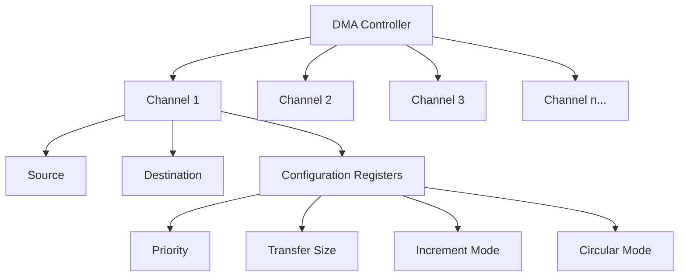

# STM32 DMA Channels

Direct Memory Access (DMA) is one of the most powerful features in STM32 microcontrollers, allowing data transfers without CPU intervention. Understanding how DMA channels work is essential for maximizing your STM32's performance.

## Introduction to DMA Channels

DMA channels are dedicated pathways that handle memory-to-memory, memory-to-peripheral, or peripheral-to-memory data transfers independently of the CPU. Think of DMA channels as dedicated assistants that can move data around while your CPU focuses on other tasks.

On STM32 microcontrollers, DMA controllers come with multiple channels (typically 5-8 channels per DMA controller, depending on the specific STM32 model). Each channel can be assigned to service a specific peripheral or memory region.

## DMA Channel Architecture

The channel architecture varies across STM32 families, but most follow a similar pattern:



Each DMA channel has its own set of configuration registers that control:

- Source and destination addresses
- Data size (byte, half-word, word)
- Address increment mode
- Priority level
- Transfer mode (one-shot or circular)
- Memory and peripheral burst sizes
- Interrupt generation conditions

## Channel Mapping and Limitations

Not all peripherals can be connected to all DMA channels. STM32 microcontrollers have a fixed mapping between peripherals and DMA channels. This mapping is documented in the reference manual for each STM32 model.

For example, in an STM32F4 microcontroller, the USART1_TX might only be connected to DMA2 Channel 7, while SPI1_RX might be connected to DMA2 Channel 0.

Here's a simplified example of channel mapping:

| Peripheral | DMA Controller | Channel | Stream (if applicable) |
|------------|----------------|---------|------------------------|
| USART1_TX  | DMA2           | 7       | 1                      |
| USART1_RX  | DMA2           | 2       | 5                      |
| SPI1_TX    | DMA2           | 3       | 3                      |
| SPI1_RX    | DMA2           | 0       | 2                      |
| ADC1       | DMA2           | 0       | 0                      |

This fixed mapping means that resource conflicts can occur if you need to use multiple peripherals that share the same DMA channel simultaneously.

## DMA Stream Concept (Advanced STM32)

In more advanced STM32 families (like STM32F4, STM32F7), the DMA architecture is enhanced with the concept of "streams." Each DMA controller might have 8 streams, and each stream can be connected to different channels through a multiplexer.

This stream-based architecture provides more flexibility than the simpler channel-based architecture in basic STM32 devices.

## Configuring a DMA Channel

Let's walk through the process of setting up a basic DMA channel for a memory-to-memory transfer:

```c
// Enable DMA1 clock
RCC->AHB1ENR |= RCC_AHB1ENR_DMA1EN;

// Define source and destination arrays
uint32_t sourceArray[10] = {1, 2, 3, 4, 5, 6, 7, 8, 9, 10};
uint32_t destArray[10] = {0};

// Configure DMA1 Channel 1
DMA1_Channel1->CCR = 0; // Reset configuration
DMA1_Channel1->CPAR = (uint32_t)destArray; // Destination address
DMA1_Channel1->CMAR = (uint32_t)sourceArray; // Source address
DMA1_Channel1->CNDTR = 10; // Number of data items to transfer

// Configure transfer direction (memory-to-memory)
DMA1_Channel1->CCR |= DMA_CCR_MEM2MEM;
// Configure data size (32-bit)
DMA1_Channel1->CCR |= DMA_CCR_MSIZE_1 | DMA_CCR_PSIZE_1;
// Enable memory increment mode for both source and destination
DMA1_Channel1->CCR |= DMA_CCR_MINC | DMA_CCR_PINC;
// Set high priority
DMA1_Channel1->CCR |= DMA_CCR_PL_1;

// Enable the DMA Channel
DMA1_Channel1->CCR |= DMA_CCR_EN;

// Wait for transfer to complete
while(!(DMA1->ISR & DMA_ISR_TCIF1));

// Clear the transfer complete flag
DMA1->IFCR = DMA_IFCR_CTCIF1;
```

After running this code, `destArray` will contain the same values as `sourceArray`, and the entire operation happened without CPU intervention after the initial setup.

## Practical Example: ADC with DMA

One of the most common uses of DMA is continuous sampling from an ADC. Here's how to set up a DMA channel to continuously transfer ADC conversion results to a buffer:

```c
#define ADC_BUFFER_SIZE 100

uint16_t adcBuffer[ADC_BUFFER_SIZE];

void ADC_DMA_Init(void) {
    // Enable clocks
    RCC->AHB1ENR |= RCC_AHB1ENR_DMA2EN;
    RCC->APB2ENR |= RCC_APB2ENR_ADC1EN;
    
    // Configure ADC
    ADC1->CR1 = 0;
    ADC1->CR2 = 0;
    
    // Set 12-bit resolution, single conversion mode
    ADC1->CR1 |= ADC_CR1_RES_0;
    
    // Enable DMA for ADC and continuous mode
    ADC1->CR2 |= ADC_CR2_DMA | ADC_CR2_CONT;
    
    // Configure ADC channel and sampling time
    ADC1->SMPR2 |= ADC_SMPR2_SMP0_0 | ADC_SMPR2_SMP0_1 | ADC_SMPR2_SMP0_2; // 480 cycles
    ADC1->SQR1 = 0; // 1 conversion in regular sequence
    ADC1->SQR3 |= 0; // Channel 0 as first conversion
    
    // Configure DMA2 Stream 0 Channel 0 for ADC1
    DMA2_Stream0->CR = 0; // Reset configuration
    
    // Wait for DMA to be disabled
    while(DMA2_Stream0->CR & DMA_SxCR_EN);
    
    DMA2_Stream0->PAR = (uint32_t)&ADC1->DR; // Source: ADC Data Register
    DMA2_Stream0->M0AR = (uint32_t)adcBuffer; // Destination: Buffer
    DMA2_Stream0->NDTR = ADC_BUFFER_SIZE; // Buffer size
    
    // Configure the DMA stream
    // Peripheral to Memory, Circular mode, Half-word data size
    DMA2_Stream0->CR |= (0 << DMA_SxCR_CHSEL_Pos); // Channel 0
    DMA2_Stream0->CR |= DMA_SxCR_CIRC; // Circular mode
    DMA2_Stream0->CR |= DMA_SxCR_MINC; // Memory increment
    DMA2_Stream0->CR |= DMA_SxCR_PSIZE_0; // Peripheral size: 16-bit
    DMA2_Stream0->CR |= DMA_SxCR_MSIZE_0; // Memory size: 16-bit
    
    // Enable DMA stream
    DMA2_Stream0->CR |= DMA_SxCR_EN;
    
    // Enable ADC
    ADC1->CR2 |= ADC_CR2_ADON;
    
    // Start conversion
    ADC1->CR2 |= ADC_CR2_SWSTART;
}
```

With this setup, the ADC will continuously sample and the results will be stored in `adcBuffer` in a circular fashion. The CPU can process the data as needed without worrying about missing samples.

## Priority Levels and Arbitration

When multiple DMA channels are active simultaneously, conflicts can arise. STM32 DMA controllers use priority levels to resolve these conflicts.

Each channel can be assigned one of four priority levels:
- Very High
- High
- Medium
- Low

When two channels request access simultaneously, the one with higher priority wins. When two channels have the same priority, the lower-numbered channel usually wins (although this can vary by STM32 family).

Here's how to set a channel's priority:

```c
// Set Channel 1 to Very High priority
DMA1_Channel1->CCR &= ~DMA_CCR_PL; // Clear priority bits
DMA1_Channel1->CCR |= DMA_CCR_PL; // Set to Very High (both bits set)

// Set Channel 2 to Medium priority
DMA2_Channel2->CCR &= ~DMA_CCR_PL; // Clear priority bits
DMA2_Channel2->CCR |= DMA_CCR_PL_0; // Set to Medium
```

## DMA Interrupts

DMA channels can generate interrupts on various events:
- Transfer Complete (TC)
- Half Transfer Complete (HT)
- Transfer Error (TE)

These interrupts allow your code to react to DMA events without polling:

```c
void DMA_InterruptConfig(void) {
    // Enable Transfer Complete interrupt for Channel 1
    DMA1_Channel1->CCR |= DMA_CCR_TCIE;
    
    // Enable Half Transfer interrupt for Channel 1
    DMA1_Channel1->CCR |= DMA_CCR_HTIE;
    
    // Enable DMA1 Channel1 interrupt in NVIC
    NVIC_EnableIRQ(DMA1_Channel1_IRQn);
}

// DMA interrupt handler
void DMA1_Channel1_IRQHandler(void) {
    if(DMA1->ISR & DMA_ISR_TCIF1) {
        // Handle Transfer Complete
        DMA1->IFCR = DMA_IFCR_CTCIF1; // Clear flag
    }
    
    if(DMA1->ISR & DMA_ISR_HTIF1) {
        // Handle Half Transfer
        DMA1->IFCR = DMA_IFCR_CHTIF1; // Clear flag
    }
    
    if(DMA1->ISR & DMA_ISR_TEIF1) {
        // Handle Transfer Error
        DMA1->IFCR = DMA_IFCR_CTEIF1; // Clear flag
    }
}
```

## Advanced Topics: Double Buffer Mode

In more advanced STM32 models, DMA streams support a double buffer mode where two memory target areas can be used alternately. This is particularly useful for continuous processing of data while ensuring no data is lost.

## Performance Considerations

When using DMA channels, keep these performance considerations in mind:

1. **Bus Contention**: DMA transfers use the same system bus as the CPU. Heavy DMA activity can slow down CPU operations and vice versa.

2. **FIFO Usage**: In advanced STM32 models, each DMA stream has a FIFO that can help smooth out transfers and reduce bus contention.

3. **Burst Transfers**: Configure burst transfers when appropriate to improve bus efficiency.

4. **Memory Alignment**: Properly aligned memory addresses improve transfer efficiency.

## Common Pitfalls

1. **Channel Conflicts**: Trying to use the same DMA channel for multiple peripherals simultaneously.

2. **Forgetting to Enable Clocks**: Always enable the DMA clock before configuring channels.

3. **Buffer Overruns**: In circular mode, ensure your processing keeps up with the data rate to avoid overwriting unprocessed data.

4. **Incorrect Configuration**: Double-check peripheral data size, memory data size, and address increment settings.

## Summary

DMA channels are powerful tools in STM32 microcontrollers that allow efficient data transfers without CPU intervention. By understanding channel mapping, configuration options, and priority mechanisms, you can optimize your STM32 applications for better performance and lower power consumption.

Remember these key points:
- Each peripheral can only be connected to specific DMA channels
- Configure the source, destination, data size, and increment modes correctly
- Use appropriate priority levels when multiple channels are active
- Consider using interrupts to react to DMA events without polling
- Watch out for channel conflicts in complex applications

## Exercises

1. Configure a DMA channel to transfer data from an UART receiver to a memory buffer.
2. Set up a memory-to-memory DMA transfer with an interrupt that triggers when the transfer is halfway complete.
3. Create a circular DMA configuration that continuously moves ADC samples to a buffer, and process the data in blocks using the Half Transfer Complete and Transfer Complete interrupts.
4. Research your specific STM32 model's reference manual and create a mapping table of which peripherals connect to which DMA channels.

## Additional Resources

- STM32 Reference Manuals: Check your specific STM32 family's documentation for detailed DMA capabilities
- STM32CubeIDE: Use the code generation tools to help set up DMA configurations
- ST's AN4031 Application Note: "Using the STM32F2, STM32F4 and STM32F7 Series DMA controller"
- ST's RM0008 Reference Manual: For STM32F1 DMA details
- ST's RM0090 Reference Manual: For STM32F4 DMA details