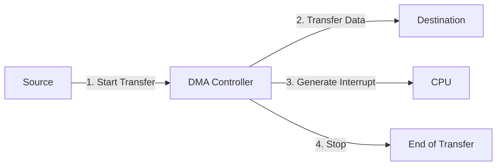
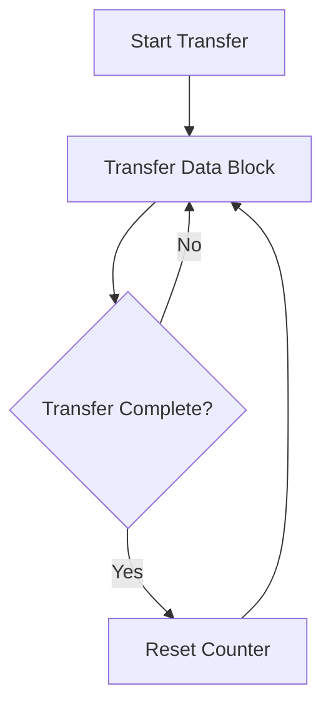
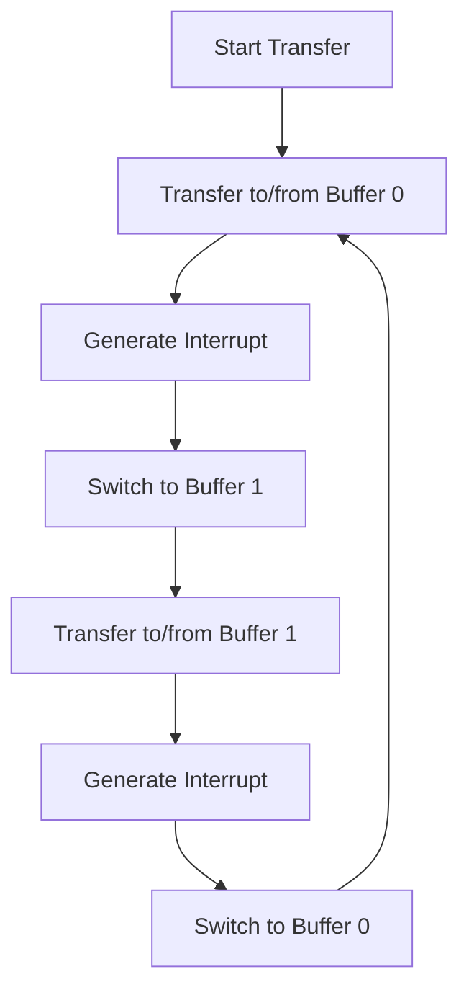
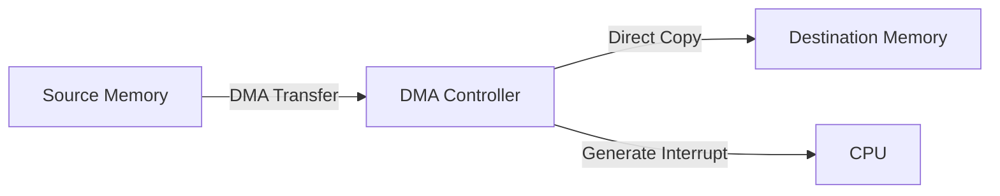

# STM32 DMA Modes

## Introduction

Direct Memory Access (DMA) is a powerful feature in STM32 microcontrollers that allows data to be transferred between memory and peripherals without CPU intervention. This significantly improves performance by freeing up the processor to handle other tasks while data transfers occur in the background.

In this tutorial, we'll explore the different DMA modes available on STM32 microcontrollers, understand when to use each mode, and implement practical examples to demonstrate their applications.

## Understanding DMA Modes

STM32 microcontrollers offer several DMA modes, each designed for specific use cases:

1. **Normal Mode** - Basic one-time data transfer
2. **Circular Mode** - Continuous data transfers with automatic reload
3. **Double Buffer Mode** - Seamless switching between two memory buffers
4. **Memory-to-Memory Mode** - Direct transfers between memory locations

Let's explore each mode in detail.

## Normal Mode

Normal mode is the simplest DMA operation mode. In this mode, the DMA controller transfers a specified amount of data from a source to a destination and then stops.

### How Normal Mode Works



### When to Use Normal Mode

- One-time data transfers
- Handling large but infrequent data blocks
- Operations that don't need to repeat automatically

### Normal Mode Configuration Example

Here's how to configure a DMA channel in normal mode to transfer data from memory to a UART peripheral:

```c
/* DMA Normal Mode Configuration */
void ConfigDMA_NormalMode(void)
{
  /* Enable clock for DMA1 */
  RCC->AHB1ENR |= RCC_AHB1ENR_DMA1EN;
  
  /* Reset DMA1 Stream3 configuration */
  DMA1_Stream3->CR = 0;
  
  /* Wait until DMA stream is disabled */
  while(DMA1_Stream3->CR & DMA_SxCR_EN);
  
  /* Configure DMA Stream */
  DMA1_Stream3->PAR = (uint32_t)&USART3->DR;        /* Peripheral address */
  DMA1_Stream3->M0AR = (uint32_t)txBuffer;         /* Memory address */
  DMA1_Stream3->NDTR = TX_BUFFER_SIZE;             /* Number of data items to transfer */
  
  /* Configure stream: 
   * Memory-to-peripheral, Normal mode, 
   * Memory increment, Priority high */
  DMA1_Stream3->CR |= DMA_SxCR_DIR_0 |             /* Memory to peripheral */
                      DMA_SxCR_MINC |              /* Memory increment mode */
                      DMA_SxCR_PL_1 |              /* Priority high */
                      DMA_SxCR_CHSEL_0 | DMA_SxCR_CHSEL_1; /* Channel 6 selection for USART3_TX */
  
  /* Enable DMA transfer complete interrupt */
  DMA1_Stream3->CR |= DMA_SxCR_TCIE;
  
  /* Enable DMA Stream */
  DMA1_Stream3->CR |= DMA_SxCR_EN;
  
  /* Enable USART DMA transmit request */
  USART3->CR3 |= USART_CR3_DMAT;
}
```

### Handling the DMA Interrupt

```c
/* DMA1 Stream3 interrupt handler */
void DMA1_Stream3_IRQHandler(void)
{
  /* Check transfer complete flag */
  if(DMA1->HISR & DMA_HISR_TCIF3)
  {
    /* Clear transfer complete flag */
    DMA1->HIFCR |= DMA_HIFCR_CTCIF3;
    
    /* Handle transfer complete event */
    TransferComplete_Callback();
  }
}
```

## Circular Mode

Circular mode allows the DMA controller to automatically reload and restart the transfer once it completes. This creates a continuous data stream and is especially useful for handling periodic data like ADC samples or audio streams.

### How Circular Mode Works



### When to Use Circular Mode

- Continuous data sampling (ADC)
- Audio processing
- Communication protocols requiring continuous data streams
- Real-time data acquisition systems

### Circular Mode Configuration Example

Here's how to configure a DMA channel in circular mode to continuously receive data from an ADC:

```c
/* DMA Circular Mode Configuration for ADC */
void ConfigDMA_CircularMode(void)
{
  /* Enable clock for DMA2 */
  RCC->AHB1ENR |= RCC_AHB1ENR_DMA2EN;
  
  /* Reset DMA2 Stream0 configuration */
  DMA2_Stream0->CR = 0;
  
  /* Wait until DMA stream is disabled */
  while(DMA2_Stream0->CR & DMA_SxCR_EN);
  
  /* Configure DMA Stream */
  DMA2_Stream0->PAR = (uint32_t)&ADC1->DR;         /* Peripheral address (ADC data register) */
  DMA2_Stream0->M0AR = (uint32_t)adcBuffer;        /* Memory address */
  DMA2_Stream0->NDTR = ADC_BUFFER_SIZE;            /* Number of data items to transfer */
  
  /* Configure stream: 
   * Peripheral-to-memory, Circular mode,
   * Peripheral data size: half-word (16-bit),
   * Memory increment, Priority high */
  DMA2_Stream0->CR |= DMA_SxCR_CIRC |              /* Circular mode */
                      DMA_SxCR_MINC |              /* Memory increment mode */
                      DMA_SxCR_PSIZE_0 |           /* Peripheral data size: half-word (16-bit) */
                      DMA_SxCR_MSIZE_0 |           /* Memory data size: half-word (16-bit) */
                      DMA_SxCR_PL_1 |              /* Priority high */
                      DMA_SxCR_CHSEL_0;            /* Channel 0 selection for ADC1 */
  
  /* Enable DMA half transfer and transfer complete interrupts */
  DMA2_Stream0->CR |= DMA_SxCR_HTIE | DMA_SxCR_TCIE;
  
  /* Enable DMA Stream */
  DMA2_Stream0->CR |= DMA_SxCR_EN;
  
  /* Enable ADC DMA request */
  ADC1->CR2 |= ADC_CR2_DMA;
}
```

### Handling Half-Transfer and Complete-Transfer Interrupts

```c
/* DMA2 Stream0 interrupt handler */
void DMA2_Stream0_IRQHandler(void)
{
  /* Check half transfer flag */
  if(DMA2->LISR & DMA_LISR_HTIF0)
  {
    /* Clear half transfer flag */
    DMA2->LIFCR |= DMA_LIFCR_CHTIF0;
    
    /* Process first half of buffer while DMA fills second half */
    ProcessFirstHalfOfBuffer();
  }
  
  /* Check transfer complete flag */
  if(DMA2->LISR & DMA_LISR_TCIF0)
  {
    /* Clear transfer complete flag */
    DMA2->LIFCR |= DMA_LIFCR_CTCIF0;
    
    /* Process second half of buffer while DMA fills first half */
    ProcessSecondHalfOfBuffer();
  }
}
```

## Double Buffer Mode

Double buffer mode is an advanced feature available on some STM32 devices. It allows the DMA controller to automatically switch between two memory buffers, providing a ping-pong mechanism for continuous data processing.

### How Double Buffer Mode Works



### When to Use Double Buffer Mode

- Real-time audio processing
- High-speed data acquisition
- Applications where you need to process one buffer while the other is being filled
- Scenarios requiring zero data loss during processing

### Double Buffer Mode Configuration Example

Here's how to configure a DMA channel in double buffer mode for continuous ADC sampling with two buffers:

```c
/* DMA Double Buffer Mode Configuration */
void ConfigDMA_DoubleBufferMode(void)
{
  /* Enable clock for DMA2 */
  RCC->AHB1ENR |= RCC_AHB1ENR_DMA2EN;
  
  /* Reset DMA2 Stream0 configuration */
  DMA2_Stream0->CR = 0;
  
  /* Wait until DMA stream is disabled */
  while(DMA2_Stream0->CR & DMA_SxCR_EN);
  
  /* Configure DMA Stream */
  DMA2_Stream0->PAR = (uint32_t)&ADC1->DR;         /* Peripheral address (ADC data register) */
  DMA2_Stream0->M0AR = (uint32_t)adcBuffer0;       /* Memory 0 address (first buffer) */
  DMA2_Stream0->M1AR = (uint32_t)adcBuffer1;       /* Memory 1 address (second buffer) */
  DMA2_Stream0->NDTR = ADC_BUFFER_SIZE;            /* Number of data items to transfer */
  
  /* Configure stream: 
   * Peripheral-to-memory, Circular mode, Double buffer mode,
   * Memory increment, Priority very high */
  DMA2_Stream0->CR |= DMA_SxCR_CIRC |              /* Circular mode */
                      DMA_SxCR_DBM |               /* Double buffer mode */
                      DMA_SxCR_MINC |              /* Memory increment mode */
                      DMA_SxCR_PSIZE_0 |           /* Peripheral data size: half-word (16-bit) */
                      DMA_SxCR_MSIZE_0 |           /* Memory data size: half-word (16-bit) */
                      DMA_SxCR_PL_1 | DMA_SxCR_PL_0 | /* Priority very high */
                      DMA_SxCR_CHSEL_0;            /* Channel 0 selection for ADC1 */
  
  /* Enable DMA transfer complete interrupt */
  DMA2_Stream0->CR |= DMA_SxCR_TCIE;
  
  /* Enable DMA Stream */
  DMA2_Stream0->CR |= DMA_SxCR_EN;
  
  /* Enable ADC DMA request */
  ADC1->CR2 |= ADC_CR2_DMA;
}
```

### Handling Double Buffer Mode Interrupts

```c
/* DMA2 Stream0 interrupt handler for double buffer mode */
void DMA2_Stream0_IRQHandler(void)
{
  /* Check transfer complete flag */
  if(DMA2->LISR & DMA_LISR_TCIF0)
  {
    /* Clear transfer complete flag */
    DMA2->LIFCR |= DMA_LIFCR_CTCIF0;
    
    /* Check which buffer is currently being used by DMA */
    if(DMA2_Stream0->CR & DMA_SxCR_CT)
    {
      /* DMA is currently using Memory 1, so we can process Memory 0 */
      ProcessBuffer(adcBuffer0, ADC_BUFFER_SIZE);
    }
    else
    {
      /* DMA is currently using Memory 0, so we can process Memory 1 */
      ProcessBuffer(adcBuffer1, ADC_BUFFER_SIZE);
    }
  }
}
```

## Memory-to-Memory Mode

Memory-to-Memory mode allows the DMA controller to transfer data directly from one memory area to another, without involving peripherals. This is particularly useful for fast memory copy operations.

### How Memory-to-Memory Mode Works



### When to Use Memory-to-Memory Mode

- Fast memory copy operations
- Display frame buffer updates
- Moving large blocks of data between RAM regions
- Data preprocessing before sending to peripherals

### Memory-to-Memory Mode Configuration Example

Here's how to configure a DMA channel for memory-to-memory transfer:

```c
/* DMA Memory-to-Memory Mode Configuration */
void DMA_MemToMem_Transfer(uint32_t *srcAddress, uint32_t *destAddress, uint32_t dataSize)
{
  /* Enable clock for DMA2 */
  RCC->AHB1ENR |= RCC_AHB1ENR_DMA2EN;
  
  /* Reset DMA2 Stream0 configuration */
  DMA2_Stream0->CR = 0;
  
  /* Wait until DMA stream is disabled */
  while(DMA2_Stream0->CR & DMA_SxCR_EN);
  
  /* Configure DMA Stream */
  DMA2_Stream0->PAR = (uint32_t)srcAddress;        /* Source address */
  DMA2_Stream0->M0AR = (uint32_t)destAddress;      /* Destination address */
  DMA2_Stream0->NDTR = dataSize;                   /* Number of data items to transfer */
  
  /* Configure stream: 
   * Memory-to-memory mode, 
   * Source and destination memory increment,
   * Priority very high */
  DMA2_Stream0->CR |= DMA_SxCR_DIR_1 |             /* Memory to memory mode */
                      DMA_SxCR_MINC |              /* Memory increment mode (destination) */
                      DMA_SxCR_PINC |              /* Peripheral increment mode (source) */
                      DMA_SxCR_PSIZE_1 |           /* Peripheral data size: word (32-bit) */
                      DMA_SxCR_MSIZE_1 |           /* Memory data size: word (32-bit) */
                      DMA_SxCR_PL_1 | DMA_SxCR_PL_0; /* Priority very high */
  
  /* Enable DMA transfer complete interrupt */
  DMA2_Stream0->CR |= DMA_SxCR_TCIE;
  
  /* Enable DMA Stream (start transfer) */
  DMA2_Stream0->CR |= DMA_SxCR_EN;
}
```

### Practical Application: Fast Frame Buffer Copy

```c
/* Example: Copy a frame from back buffer to display buffer */
void UpdateDisplay(void)
{
  /* Copy the back buffer to the display buffer using DMA */
  DMA_MemToMem_Transfer(
    (uint32_t*)backBuffer,
    (uint32_t*)displayBuffer,
    DISPLAY_WIDTH * DISPLAY_HEIGHT / 4  /* Size in 32-bit words */
  );
  
  /* The CPU can continue with other tasks while DMA performs the copy */
  PrepareNextFrame();
}
```

## Real-World Application Examples

### Example 1: Audio Processing with DMA Circular Mode

This example demonstrates how to use DMA in circular mode to continuously sample audio data from a microphone connected to the ADC:

```c
#define AUDIO_BUFFER_SIZE 1024

uint16_t audioBuffer[AUDIO_BUFFER_SIZE];
volatile uint8_t audioBufferHalfFull = 0;
volatile uint8_t audioBufferFull = 0;

void InitAudioCapture(void)
{
  /* Configure ADC for audio sampling */
  ConfigureADC();
  
  /* Configure DMA in circular mode */
  /* Enable clock for DMA2 */
  RCC->AHB1ENR |= RCC_AHB1ENR_DMA2EN;
  
  /* Configure DMA2 Stream0 for ADC1 */
  DMA2_Stream0->CR = 0;
  while(DMA2_Stream0->CR & DMA_SxCR_EN);
  
  DMA2_Stream0->PAR = (uint32_t)&ADC1->DR;
  DMA2_Stream0->M0AR = (uint32_t)audioBuffer;
  DMA2_Stream0->NDTR = AUDIO_BUFFER_SIZE;
  
  /* Peripheral to memory, Circular mode, Half-word size, Interrupts */
  DMA2_Stream0->CR |= DMA_SxCR_CIRC | DMA_SxCR_MINC | 
                      DMA_SxCR_PSIZE_0 | DMA_SxCR_MSIZE_0 |
                      DMA_SxCR_HTIE | DMA_SxCR_TCIE |
                      DMA_SxCR_CHSEL_0;
  
  /* Enable DMA interrupts in NVIC */
  NVIC_EnableIRQ(DMA2_Stream0_IRQn);
  
  /* Start DMA */
  DMA2_Stream0->CR |= DMA_SxCR_EN;
  
  /* Enable ADC DMA request */
  ADC1->CR2 |= ADC_CR2_DMA;
  
  /* Start ADC conversion */
  ADC1->CR2 |= ADC_CR2_SWSTART;
}

/* DMA interrupt handler */
void DMA2_Stream0_IRQHandler(void)
{
  /* Half transfer complete */
  if(DMA2->LISR & DMA_LISR_HTIF0)
  {
    DMA2->LIFCR |= DMA_LIFCR_CHTIF0;
    audioBufferHalfFull = 1;
  }
  
  /* Transfer complete */
  if(DMA2->LISR & DMA_LISR_TCIF0)
  {
    DMA2->LIFCR |= DMA_LIFCR_CTCIF0;
    audioBufferFull = 1;
  }
}

/* Main processing loop */
void ProcessAudio(void)
{
  while(1)
  {
    /* Process first half of buffer */
    if(audioBufferHalfFull)
    {
      audioBufferHalfFull = 0;
      ApplyAudioFilter(&audioBuffer[0], AUDIO_BUFFER_SIZE/2);
    }
    
    /* Process second half of buffer */
    if(audioBufferFull)
    {
      audioBufferFull = 0;
      ApplyAudioFilter(&audioBuffer[AUDIO_BUFFER_SIZE/2], AUDIO_BUFFER_SIZE/2);
    }
  }
}
```

### Example 2: Efficient UART Communication with DMA Normal Mode

This example shows how to use DMA in normal mode to send large data blocks over UART without blocking the CPU:

```c
#define TX_BUFFER_SIZE 256

uint8_t txBuffer[TX_BUFFER_SIZE];
volatile uint8_t transferComplete = 0;

void SendDataOverUART(uint8_t *data, uint32_t size)
{
  /* Copy data to transmit buffer */
  for(uint32_t i = 0; i < size && i < TX_BUFFER_SIZE; i++)
  {
    txBuffer[i] = data[i];
  }
  
  /* Configure DMA for UART TX */
  DMA1_Stream3->CR = 0;
  while(DMA1_Stream3->CR & DMA_SxCR_EN);
  
  DMA1_Stream3->PAR = (uint32_t)&USART3->DR;
  DMA1_Stream3->M0AR = (uint32_t)txBuffer;
  DMA1_Stream3->NDTR = size;
  
  /* Memory to peripheral, Normal mode, Memory increment */
  DMA1_Stream3->CR |= DMA_SxCR_DIR_0 | DMA_SxCR_MINC | 
                      DMA_SxCR_TCIE |
                      DMA_SxCR_CHSEL_0 | DMA_SxCR_CHSEL_1; /* Channel 6 for USART3_TX */
  
  /* Reset transfer complete flag */
  transferComplete = 0;
  
  /* Enable DMA */
  DMA1_Stream3->CR |= DMA_SxCR_EN;
  
  /* Enable UART DMA TX request */
  USART3->CR3 |= USART_CR3_DMAT;
  
  /* CPU can now do other tasks while DMA handles the transfer */
}

/* DMA interrupt handler */
void DMA1_Stream3_IRQHandler(void)
{
  /* Check transfer complete flag */
  if(DMA1->HISR & DMA_HISR_TCIF3)
  {
    /* Clear transfer complete flag */
    DMA1->HIFCR |= DMA_HIFCR_CTCIF3;
    
    /* Set transfer complete flag */
    transferComplete = 1;
  }
}
```

## Comparison of DMA Modes

| Mode | Key Features | Best For | Limitations |
|------|-------------|----------|-------------|
| **Normal** | One-time transfer<br />Simple setup | Infrequent transfers<br />Simple operations | Requires CPU to restart for each transfer |
| **Circular** | Continuous operation<br />Auto-reload | Continuous sampling<br />Real-time applications | Fixed buffer size<br />Can't change config during operation |
| **Double Buffer** | Ping-pong buffers<br />Continuous processing | High-performance applications<br />Zero-loss processing | More complex to implement<br />Not available on all STM32 devices |
| **Memory-to-Memory** | Direct memory copies<br />High-speed transfers | Fast memory operations<br />Data preprocessing | Uses more DMA bandwidth<br />Not for peripheral transfers |

## Debugging DMA Issues

When working with DMA, you might encounter some common issues:

1. **Transfer Not Starting**
   - Check DMA stream enable bit (DMA_SxCR_EN)
   - Verify peripheral DMA request is enabled
   - Ensure addresses are properly aligned

2. **Data Corruption**
   - Check data width settings (PSIZE and MSIZE)
   - Verify buffer alignment matches data width
   - Ensure source/destination addresses are valid

3. **Interrupt Not Triggering**
   - Verify interrupt flags are enabled in DMA_SxCR
   - Check NVIC configuration
   - Clear pending flags before starting transfer

4. **Buffer Overruns**
   - Ensure buffer size matches NDTR value
   - For circular mode, process data fast enough
   - Consider using double buffer mode for high data rates

## Summary

In this tutorial, we've explored the different DMA modes available on STM32 microcontrollers:

- **Normal Mode**: For one-time transfers with simplicity
- **Circular Mode**: For continuous operations with automatic reload
- **Double Buffer Mode**: For high-performance continuous processing
- **Memory-to-Memory Mode**: For efficient data movement between memory areas

Each mode serves specific use cases and provides different advantages in terms of performance, flexibility, and implementation complexity. By choosing the right DMA mode for your application, you can significantly improve system performance while reducing CPU load.

## Exercises

1. Configure a DMA channel in normal mode to transfer a block of data from memory to SPI peripheral.
2. Implement an ADC data acquisition system using DMA circular mode to continuously sample sensor data.
3. Create a double-buffer audio processing system that captures audio samples with one buffer while processing the other.
4. Implement a fast display update mechanism using memory-to-memory DMA to copy frame buffers.
5. Compare the performance difference between CPU-based memory copy and DMA memory-to-memory transfer for different block sizes.

## Additional Resources

- STM32 Reference Manuals (RM0090 for STM32F4xx series)
- [STM32 DMA Driver Documentation](https://www.st.com)
- [ST Community Forums](https://community.st.com)
- Application Notes:
  - AN4031: Using the STM32F2, STM32F4 and STM32F7 Series DMA controller
  - AN4640: Managing memory with DMAMUX in STM32 devices