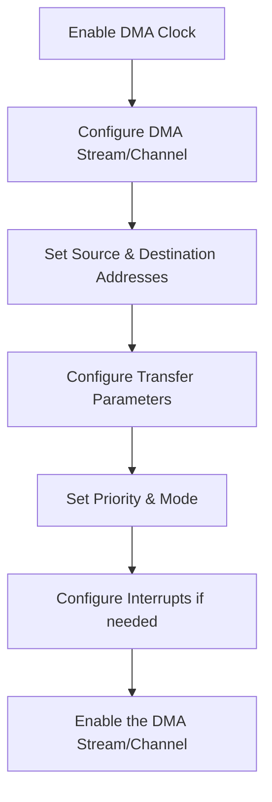

# STM32 DMA Configuration

## Introduction

Direct Memory Access (DMA) is a powerful feature in STM32 microcontrollers that allows peripherals to transfer data to and from memory without CPU intervention. This significantly improves system performance by freeing the processor to handle other tasks while data transfers occur in the background.

In this guide, we'll walk through the process of configuring DMA on STM32 microcontrollers, from basic setup to practical applications. By the end, you'll understand how to leverage DMA to make your STM32 applications more efficient.

## DMA Basics on STM32

Before diving into configuration, let's understand the key components of the STM32 DMA system:

1. **DMA Controllers**: Most STM32 microcontrollers have multiple DMA controllers (typically DMA1 and DMA2)
2. **DMA Channels/Streams**: Each controller has multiple channels (in older STM32s) or streams (in newer models)
3. **Request Mapping**: Peripherals are mapped to specific DMA channels/streams
4. **Transfer Modes**: Different modes for memory-to-memory, peripheral-to-memory, or memory-to-peripheral transfers

The STM32 DMA engine allows for flexible configuration of:
- Source and destination addresses
- Data sizes (byte, half-word, word)
- Memory and peripheral increment modes
- Circular mode for continuous operations
- Interrupt triggers at various transfer stages

## DMA Configuration Process

Let's break down the process of configuring DMA on an STM32 microcontroller:



Now let's implement each step in code.

## Step-by-Step DMA Configuration

### 1. Enable DMA Clock

First, we need to enable the clock for the DMA controller we'll be using:

```c
// Enable DMA1 clock
RCC->AHB1ENR |= RCC_AHB1ENR_DMA1EN;

// Or for DMA2
// RCC->AHB1ENR |= RCC_AHB1ENR_DMA2EN;
```

### 2. Configure DMA Stream/Channel

Let's configure DMA for a common use case: transferring ADC data to memory. We'll use DMA2, Stream 0 as an example:

```c
// Disable DMA stream first (if it was enabled)
DMA2_Stream0->CR &= ~DMA_SxCR_EN;

// Wait until DMA stream is disabled
while(DMA2_Stream0->CR & DMA_SxCR_EN) { }

// Clear any pending flags
DMA2->LIFCR = 0x0F7D0F7D; // Clear all flags for Stream 0

// Select channel for the stream (channel 0 for ADC1)
DMA2_Stream0->CR &= ~DMA_SxCR_CHSEL;  // Clear channel selection bits
DMA2_Stream0->CR |= (0 << DMA_SxCR_CHSEL_Pos); // Set channel 0
```

### 3. Set Source and Destination Addresses

Next, we set the peripheral and memory addresses:

```c
// Set peripheral address (ADC1 data register)
DMA2_Stream0->PAR = (uint32_t)&ADC1->DR;

// Set memory address (our data buffer)
uint16_t adc_buffer[100];
DMA2_Stream0->M0AR = (uint32_t)adc_buffer;

// Set number of data items to transfer
DMA2_Stream0->NDTR = 100;
```

### 4. Configure Transfer Parameters

Now we configure the DMA transfer characteristics:

```c
// Configure DMA stream
DMA2_Stream0->CR &= ~(DMA_SxCR_DIR | DMA_SxCR_CIRC | DMA_SxCR_PINC | DMA_SxCR_MINC | 
                      DMA_SxCR_PSIZE | DMA_SxCR_MSIZE | DMA_SxCR_PL);

// Set direction: peripheral to memory
DMA2_Stream0->CR |= (0 << DMA_SxCR_DIR_Pos);

// Enable circular mode for continuous ADC sampling
DMA2_Stream0->CR |= DMA_SxCR_CIRC;

// Disable peripheral address increment
// Enable memory address increment
DMA2_Stream0->CR |= DMA_SxCR_MINC;

// Set peripheral data size: 16 bits (half-word)
DMA2_Stream0->CR |= (1 << DMA_SxCR_PSIZE_Pos);

// Set memory data size: 16 bits (half-word)
DMA2_Stream0->CR |= (1 << DMA_SxCR_MSIZE_Pos);

// Set DMA priority: high
DMA2_Stream0->CR |= (2 << DMA_SxCR_PL_Pos);
```

### 5. Configure Interrupts (Optional)

If we want to receive notifications when transfers complete:

```c
// Enable transfer complete interrupt
DMA2_Stream0->CR |= DMA_SxCR_TCIE;

// Enable DMA interrupts in NVIC
NVIC_EnableIRQ(DMA2_Stream0_IRQn);
NVIC_SetPriority(DMA2_Stream0_IRQn, 0);
```

### 6. Enable the DMA Stream

Finally, enable the DMA stream to start the transfer:

```c
// Enable DMA stream
DMA2_Stream0->CR |= DMA_SxCR_EN;
```

## Using HAL Library

For those using STM32CubeMX and the HAL library, the configuration is more streamlined:

```c
// DMA handle structure
DMA_HandleTypeDef hdma_adc1;

// Configure the DMA
hdma_adc1.Instance = DMA2_Stream0;
hdma_adc1.Init.Channel = DMA_CHANNEL_0;
hdma_adc1.Init.Direction = DMA_PERIPH_TO_MEMORY;
hdma_adc1.Init.PeriphInc = DMA_PINC_DISABLE;
hdma_adc1.Init.MemInc = DMA_MINC_ENABLE;
hdma_adc1.Init.PeriphDataAlignment = DMA_PDATAALIGN_HALFWORD;
hdma_adc1.Init.MemDataAlignment = DMA_MDATAALIGN_HALFWORD;
hdma_adc1.Init.Mode = DMA_CIRCULAR;
hdma_adc1.Init.Priority = DMA_PRIORITY_HIGH;
hdma_adc1.Init.FIFOMode = DMA_FIFOMODE_DISABLE;

// Initialize the DMA
HAL_DMA_Init(&hdma_adc1);

// Link DMA with ADC
__HAL_LINKDMA(&hadc1, DMA_Handle, hdma_adc1);
```

## Common DMA Use Cases

### 1. ADC with DMA

One of the most common uses of DMA is with the Analog-to-Digital Converter to continuously sample signals without CPU intervention:

```c
// Configure ADC for DMA mode
ADC1->CR2 |= ADC_CR2_DMA;  // Enable DMA mode
ADC1->CR2 |= ADC_CR2_CONT; // Continuous conversion mode

// Start ADC conversion
ADC1->CR2 |= ADC_CR2_SWSTART;
```

With HAL:

```c
// Start ADC with DMA
HAL_ADC_Start_DMA(&hadc1, (uint32_t*)adc_buffer, 100);
```

### 2. UART Transmission with DMA

Another common application is sending data via UART without blocking the CPU:

```c
// Configure UART for DMA transmission
USART1->CR3 |= USART_CR3_DMAT;

// Set up DMA for UART TX
DMA2_Stream7->CR &= ~DMA_SxCR_EN;  // Disable stream
while(DMA2_Stream7->CR & DMA_SxCR_EN) { }
DMA2->HIFCR = 0x0F7D0F7D;  // Clear flags
DMA2_Stream7->CR |= (4 << DMA_SxCR_CHSEL_Pos);  // Channel 4 for USART1_TX
DMA2_Stream7->PAR = (uint32_t)&USART1->DR;      // UART data register
DMA2_Stream7->M0AR = (uint32_t)tx_buffer;       // Transmit buffer
DMA2_Stream7->NDTR = tx_buffer_size;            // Buffer size
DMA2_Stream7->CR |= (1 << DMA_SxCR_DIR_Pos);    // Memory to peripheral
DMA2_Stream7->CR |= DMA_SxCR_MINC;              // Increment memory address
DMA2_Stream7->CR |= DMA_SxCR_TCIE;              // Transfer complete interrupt
DMA2_Stream7->CR |= DMA_SxCR_EN;                // Enable DMA stream

// Data will now transfer automatically!
```

With HAL:

```c
// Start UART transmission using DMA
HAL_UART_Transmit_DMA(&huart1, tx_buffer, tx_buffer_size);
```

### 3. Memory-to-Memory Transfer

STM32 DMA can also copy memory regions efficiently:

```c
// Configure DMA for memory-to-memory transfer
DMA2_Stream0->CR &= ~DMA_SxCR_EN;  // Disable stream
while(DMA2_Stream0->CR & DMA_SxCR_EN) { }
DMA2->LIFCR = 0x0F7D0F7D;  // Clear flags
DMA2_Stream0->CR |= (2 << DMA_SxCR_DIR_Pos);  // Memory to memory
DMA2_Stream0->PAR = (uint32_t)source_buffer;  // Source
DMA2_Stream0->M0AR = (uint32_t)dest_buffer;   // Destination
DMA2_Stream0->NDTR = buffer_size;             // Size
DMA2_Stream0->CR |= DMA_SxCR_MINC | DMA_SxCR_PINC;  // Increment both addresses
DMA2_Stream0->CR |= (2 << DMA_SxCR_PL_Pos);   // High priority
DMA2_Stream0->CR |= DMA_SxCR_EN;              // Enable DMA
```

With HAL:

```c
// Perform memory-to-memory transfer
HAL_DMA_Start(&hdma_memtomem, (uint32_t)source_buffer, (uint32_t)dest_buffer, buffer_size);
HAL_DMA_PollForTransfer(&hdma_memtomem, HAL_DMA_FULL_TRANSFER, HAL_MAX_DELAY);
```

## DMA Interrupt Handling

When using DMA interrupts, you'll need to implement the appropriate handler:

```c
void DMA2_Stream0_IRQHandler(void) {
  // Check if transfer complete interrupt
  if(DMA2->LISR & DMA_LISR_TCIF0) {
    // Clear the interrupt flag
    DMA2->LIFCR = DMA_LIFCR_CTCIF0;
    
    // Handle the completed transfer
    // For example, process data or start new transfer
    ProcessADCData(adc_buffer);
  }
  
  // Check for transfer error
  if(DMA2->LISR & DMA_LISR_TEIF0) {
    // Clear the error flag
    DMA2->LIFCR = DMA_LIFCR_CTEIF0;
    
    // Handle error
    HandleDMAError();
  }
}
```

With HAL:

```c
void HAL_ADC_ConvCpltCallback(ADC_HandleTypeDef* hadc) {
  // This is called when DMA transfer is complete
  if(hadc->Instance == ADC1) {
    // Process the ADC data
    ProcessADCData(adc_buffer);
  }
}

void HAL_ADC_ErrorCallback(ADC_HandleTypeDef* hadc) {
  // Handle errors
  HandleDMAError();
}
```

## Advanced DMA Features

### Double Buffer Mode

Some STM32 models support double buffer mode, which allows alternating between two memory buffers to ensure continuous processing:

```c
// Configure double buffer mode
DMA2_Stream0->CR |= DMA_SxCR_DBM;      // Enable double buffer mode
DMA2_Stream0->M0AR = (uint32_t)buffer0; // First buffer
DMA2_Stream0->M1AR = (uint32_t)buffer1; // Second buffer
```

With HAL:

```c
hdma_adc1.Init.Mode = DMA_CIRCULAR;
hdma_adc1.XferM1CpltCallback = SecondHalfCpltCallback;
HAL_DMAEx_MultiBufferStart(&hdma_adc1, (uint32_t)&ADC1->DR, 
                          (uint32_t)buffer0, (uint32_t)buffer1, BUFFER_SIZE);
```

### FIFO Mode

For more efficient transfers, especially with different source and destination data sizes:

```c
// Configure FIFO mode
DMA2_Stream0->FCR |= DMA_SxFCR_DMDIS;       // Disable direct mode
DMA2_Stream0->FCR &= ~DMA_SxFCR_FTH;        // Clear threshold bits
DMA2_Stream0->FCR |= (3 << DMA_SxFCR_FTH_Pos); // Set FIFO threshold to full (4/4)
```

With HAL:

```c
hdma_adc1.Init.FIFOMode = DMA_FIFOMODE_ENABLE;
hdma_adc1.Init.FIFOThreshold = DMA_FIFO_THRESHOLD_FULL;
```

## Common DMA Pitfalls and Solutions

### 1. Channel Conflict

**Problem**: Multiple peripherals configured to use the same DMA channel
**Solution**: Carefully review the DMA channel mapping in your device's reference manual and reassign channels if necessary

### 2. Data Alignment Issues

**Problem**: Mismatched data sizes causing incorrect transfers
**Solution**: Always ensure peripheral and memory data size configurations match the actual data sizes

### 3. Interrupt Handling

**Problem**: Missing transfer complete flags causing blocked operations
**Solution**: Always check and clear appropriate flags in interrupt handlers

### 4. Circular Buffer Overflow

**Problem**: Processing data too slowly in circular mode
**Solution**: Use transfer half-complete interrupts to process first half while second half is being filled

## Performance Optimization Tips

1. **Use Burst Transfers**: Configure burst transfers for improved memory bus efficiency
2. **Optimize Data Alignment**: Align data buffers to word boundaries for faster transfers
3. **Prioritize Critical Transfers**: Use the priority settings to optimize system performance
4. **Buffer Size Consideration**: Choose buffer sizes that are efficiently handled by the memory system

## Debugging DMA

When debugging DMA issues, check these common areas:

1. Flag status registers (LISR, HISR, etc.) to see if transfers are completing
2. Enable DMA error interrupts to catch transfer errors
3. Check that peripheral and DMA configurations match (e.g., data size)
4. Verify memory buffer alignment and access permissions
5. Check for DMA channel conflicts with other active peripherals

## Summary

DMA is a powerful feature in STM32 microcontrollers that can significantly improve application performance by offloading data transfer tasks from the CPU. We've covered:

- Basic DMA concepts and architecture on STM32 devices
- Step-by-step configuration process
- Common use cases including ADC, UART, and memory transfers
- Advanced features like double buffering and FIFO mode
- Common pitfalls and optimization tips

By properly configuring and utilizing DMA, you can create more efficient, responsive STM32 applications that make better use of system resources.

## Additional Resources and Exercises

### Resources

- ST's application note AN4031: "Using the STM32F2, STM32F4 and STM32F7 Series DMA controller"
- ST's RM0090 Reference Manual (for STM32F4 series)
- CubeMX and HAL documentation for DMA configuration

### Exercises

1. Configure DMA to continuously sample an analog signal using ADC and store results in a circular buffer
2. Implement a UART transmit and receive system using DMA for both directions
3. Create a memory-to-memory DMA transfer function that can efficiently copy data blocks
4. Implement double-buffering with an audio application (ADC sampling or DAC output)
5. Create a DMA-based SPI communication system for high-speed data transfer

Work through these exercises to gain practical experience with DMA configuration and usage in STM32 microcontrollers. Each exercise builds upon the concepts covered in this guide and will help solidify your understanding of DMA.