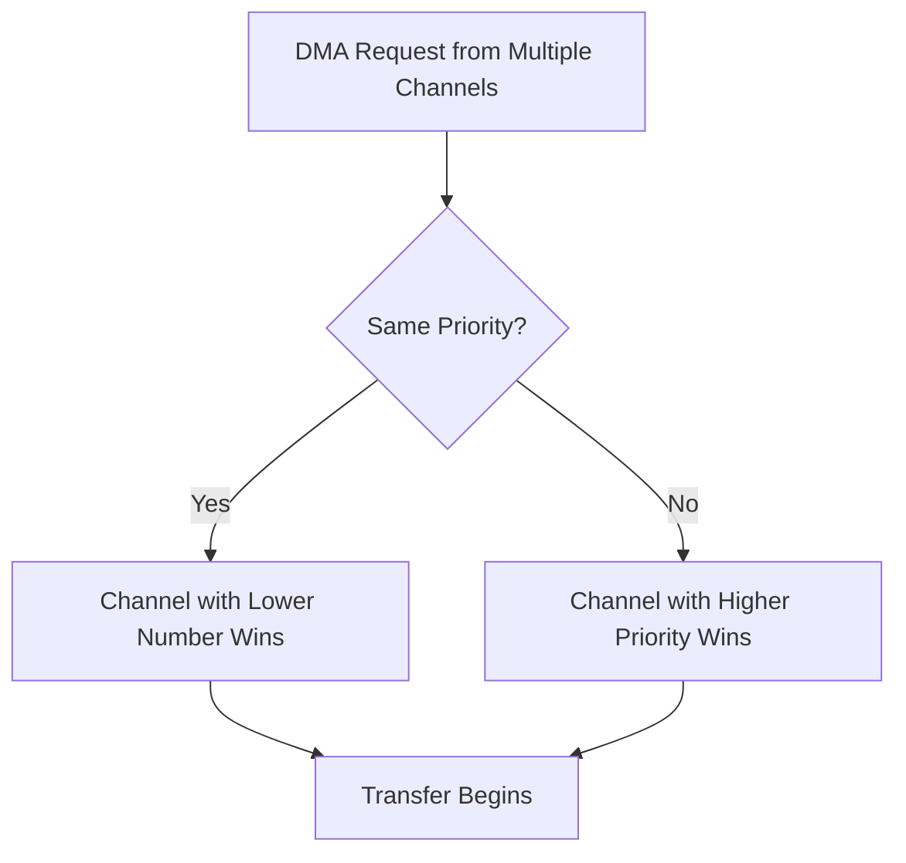

# STM32 DMA Priorities

## Introduction

Direct Memory Access (DMA) is a powerful feature in STM32 microcontrollers that allows data transfers between peripherals and memory without CPU intervention. One of the key aspects of configuring DMA is setting appropriate **priority levels**. In systems where multiple DMA transfers might occur simultaneously, these priorities determine which transfer takes precedence when arbitration is necessary.

This guide will help you understand DMA priorities on STM32 microcontrollers, how they work, and how to configure them effectively for your applications.

## Understanding DMA Priority Levels

STM32 microcontrollers offer four distinct priority levels for DMA transfers:

- **Very High (3)**: Highest priority level
- **High (2)**: Second highest priority
- **Medium (1)**: Second lowest priority
- **Low (0)**: Lowest priority level

When multiple DMA channels request access to the same bus simultaneously, the DMA controller uses these priority levels to determine which channel gets access first.

### How Arbitration Works

1. The channel with the highest priority gets access first
2. If multiple channels have the same priority level, the channel with the lower number gets preference (e.g., Channel 1 has priority over Channel 2)



## Configuring DMA Priorities

### Using STM32CubeMX

The simplest way to configure DMA priorities is through the STM32CubeMX tool:

1. Open your project in STM32CubeMX
2. Navigate to the DMA settings tab
3. Select the desired DMA channel
4. Choose a priority level from the dropdown menu
5. Generate the code

### Using HAL Library

When using the STM32 HAL library, you can set DMA priorities in your code by configuring the `Priority` field in the DMA handle initialization structure:

```c
/* DMA handle declaration */
DMA_HandleTypeDef hdma_usart2_tx;

/* DMA initialization function */
void MX_DMA_Init(void) 
{
  /* DMA controller clock enable */
  __HAL_RCC_DMA1_CLK_ENABLE();
  
  /* Configure DMA for USART2_TX */
  hdma_usart2_tx.Instance = DMA1_Channel7;
  hdma_usart2_tx.Init.Direction = DMA_MEMORY_TO_PERIPH;
  hdma_usart2_tx.Init.PeriphInc = DMA_PINC_DISABLE;
  hdma_usart2_tx.Init.MemInc = DMA_MINC_ENABLE;
  hdma_usart2_tx.Init.PeriphDataAlignment = DMA_PDATAALIGN_BYTE;
  hdma_usart2_tx.Init.MemDataAlignment = DMA_MDATAALIGN_BYTE;
  hdma_usart2_tx.Init.Mode = DMA_NORMAL;
  
  /* Set DMA priority to HIGH */
  hdma_usart2_tx.Init.Priority = DMA_PRIORITY_HIGH;
  
  HAL_DMA_Init(&hdma_usart2_tx);
  
  /* Associate the initialized DMA handle to the USART handle */
  __HAL_LINKDMA(&huart2, hdmatx, hdma_usart2_tx);
  
  /* DMA interrupt init */
  HAL_NVIC_SetPriority(DMA1_Channel7_IRQn, 0, 0);
  HAL_NVIC_EnableIRQ(DMA1_Channel7_IRQn);
}
```

### Using Low-Level Register Configuration

For more control or in cases where you're not using HAL, you can configure DMA priorities directly through registers:

```c
/* Enable DMA1 clock */
RCC->AHBENR |= RCC_AHBENR_DMA1EN;

/* Configure DMA1 Channel1 */
DMA1_Channel1->CCR &= ~DMA_CCR_PL; /* Clear priority bits */
DMA1_Channel1->CCR |= DMA_CCR_PL_1; /* Set priority to HIGH (binary 10) */

/* Other configuration settings */
DMA1_Channel1->CCR |= DMA_CCR_MINC | DMA_CCR_DIR; /* Memory increment mode, read from memory */
DMA1_Channel1->CNDTR = buffer_size; /* Set data size */
DMA1_Channel1->CPAR = (uint32_t)&(SPI1->DR); /* Set peripheral address */
DMA1_Channel1->CMAR = (uint32_t)tx_buffer; /* Set memory address */

/* Enable DMA Channel */
DMA1_Channel1->CCR |= DMA_CCR_EN;
```

In the code above, the priority bits (`PL`) in the DMA channel configuration register (`CCR`) are set to binary `10`, which corresponds to `HIGH` priority.

## Priority Level Mapping

Here's how the priority levels map to register values:

| Priority Level | Binary Value (PL[1:0]) | Register Setting |
|----------------|------------------------|-----------------|
| Low (0)        | 00                     | 0               |
| Medium (1)     | 01                     | DMA_CCR_PL_0    |
| High (2)       | 10                     | DMA_CCR_PL_1    |
| Very High (3)  | 11                     | DMA_CCR_PL_0 \| DMA_CCR_PL_1 |

## Practical Examples

### Example 1: UART TX with ADC Conversion

In this example, we have two DMA operations running simultaneously:
1. UART transmission (less time-critical)
2. ADC data acquisition (more time-critical)

```c
void ConfigureDMA(void)
{
  /* Configure DMA for ADC with VERY HIGH priority */
  hdma_adc.Instance = DMA1_Channel1;
  hdma_adc.Init.Direction = DMA_PERIPH_TO_MEMORY;
  hdma_adc.Init.Priority = DMA_PRIORITY_VERY_HIGH; // Critical for not missing samples
  HAL_DMA_Init(&hdma_adc);
  
  /* Configure DMA for UART TX with MEDIUM priority */
  hdma_uart_tx.Instance = DMA1_Channel4;
  hdma_uart_tx.Init.Direction = DMA_MEMORY_TO_PERIPH;
  hdma_uart_tx.Init.Priority = DMA_PRIORITY_MEDIUM; // Less time-critical
  HAL_DMA_Init(&hdma_uart_tx);
}
```

By setting a higher priority for the ADC DMA channel, we ensure that ADC samples are not missed even when there's simultaneous UART communication.

### Example 2: Complex System with Multiple Priorities

In a more complex system with multiple DMA transfers:

```c
void ConfigureSystemDMA(void)
{
  /* Emergency sensor data - highest priority */
  hdma_emergency.Init.Priority = DMA_PRIORITY_VERY_HIGH;
  
  /* Control loop data - high priority */
  hdma_control.Init.Priority = DMA_PRIORITY_HIGH;
  
  /* Display update - medium priority */
  hdma_display.Init.Priority = DMA_PRIORITY_MEDIUM;
  
  /* Data logging - lowest priority */
  hdma_logging.Init.Priority = DMA_PRIORITY_LOW;
  
  /* Initialize all DMA channels */
  HAL_DMA_Init(&hdma_emergency);
  HAL_DMA_Init(&hdma_control);
  HAL_DMA_Init(&hdma_display);
  HAL_DMA_Init(&hdma_logging);
}
```

This setup ensures that critical real-time data is handled first, while less time-sensitive operations like logging yield to more important tasks.

## Choosing the Right Priority Levels

When deciding on DMA priority levels, consider:

1. **Time Sensitivity**: How quickly does the data need to be transferred?
2. **Data Loss Implications**: What happens if data transfer is delayed?
3. **Peripheral Requirements**: Some peripherals (like high-speed ADCs) may have strict timing requirements
4. **Transfer Frequency**: How often does this transfer occur?

Here's a general guideline:

| Use Case | Recommended Priority |
|----------|---------------------|
| High-speed ADC sampling | Very High |
| Motor control | High/Very High |
| Communication protocols (UART, SPI, I2C) | Medium/High |
| Display updates | Medium |
| Data logging | Low |

## Potential Issues and Solutions

### Priority Inversion

**Problem**: A low-priority transfer monopolizes the bus, preventing higher-priority transfers.  
**Solution**: Properly set up priorities and consider using burst mode for large transfers to allow interleaving.

### Starvation

**Problem**: Low-priority channels never get access because high-priority channels are constantly active.  
**Solution**: Use circular mode with interrupt flags to break up continuous transfers, allowing low-priority transfers to get some bus time.

### Example Fix for Continuous Transfer

```c
/* Configure DMA for continuous ADC in circular mode */
hdma_adc.Init.Mode = DMA_CIRCULAR;
hdma_adc.Init.Priority = DMA_PRIORITY_HIGH;
HAL_DMA_Init(&hdma_adc);

/* Set up transfer complete interrupt */
HAL_NVIC_SetPriority(DMA1_Channel1_IRQn, 0, 0);
HAL_NVIC_EnableIRQ(DMA1_Channel1_IRQn);

/* In the IRQ handler */
void DMA1_Channel1_IRQHandler(void)
{
  /* Process half-transfer and transfer-complete events */
  HAL_DMA_IRQHandler(&hdma_adc);
  
  /* Optionally pause to allow other transfers */
  // DMA1_Channel1->CCR &= ~DMA_CCR_EN;
  // /* Do some processing */
  // DMA1_Channel1->CCR |= DMA_CCR_EN;
}
```

## Common Mistakes

1. **Setting all channels to Very High**: This defeats the purpose of priority levels since arbitration will default to channel number
2. **Ignoring channel numbers**: Remember that with equal priorities, lower channel numbers win
3. **Not considering NVIC priorities**: DMA interrupt priorities (NVIC) should align with DMA channel priorities
4. **Forgetting about memory bus contention**: Even with priorities set, memory bus access can become a bottleneck

## Summary

DMA priorities in STM32 microcontrollers offer a flexible way to manage multiple concurrent data transfers. By setting appropriate priority levels, you can ensure that critical data transfers take precedence over less time-sensitive ones. Remember these key points:

- Four priority levels: Very High, High, Medium, and Low
- When priorities are equal, lower channel numbers win
- Match priorities to the time-sensitivity and importance of the data transfer
- Be cautious of issues like priority inversion and starvation
- Consider both DMA channel priorities and NVIC interrupt priorities in your design

By carefully planning and configuring your DMA priorities, you can create more efficient, responsive, and reliable embedded systems.

## Exercises

1. Configure two DMA channels with different priorities to transfer data from memory to two different UARTs.
2. Set up an ADC to continuously sample data with DMA in circular mode, while occasionally transferring data via SPI. Use appropriate priorities.
3. Analyze a system with three DMA channels of the same priority and predict which transfers will complete first.
4. Use DMA priorities to implement a system where emergency sensor data always takes precedence over routine logging operations.

## Additional Resources

- STM32 Reference Manuals (specific to your microcontroller family)
- STM32 HAL Driver Documentation
- Application Notes:
  - AN4031: Using the STM32F2, STM32F4 and STM32F7 Series DMA controller
  - AN3126: Audio and waveform generation using the DAC in STM32 microcontrollers