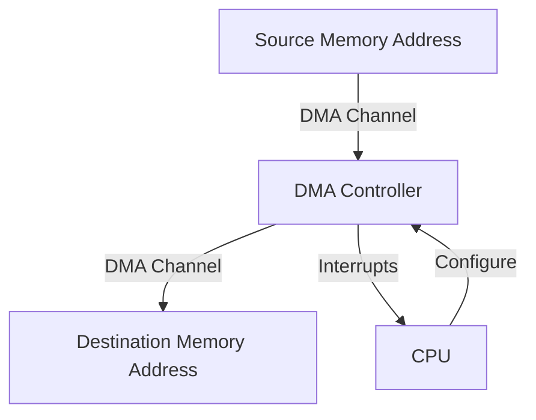

# STM32 Memory-to-Memory DMA

## Introduction

Direct Memory Access (DMA) is a powerful feature in microcontrollers that allows data transfers between memory locations or peripherals without CPU intervention. While many DMA operations involve peripherals, the STM32 family supports **memory-to-memory DMA transfers**, which can significantly improve performance when copying blocks of data.

This tutorial focuses specifically on memory-to-memory DMA operations with STM32 microcontrollers, which enables you to efficiently move data from one memory location to another while freeing up the CPU to perform other tasks.

## Why Use Memory-to-Memory DMA?

Before diving into implementation, let's understand why you might want to use memory-to-memory DMA:

1. **CPU Offloading**: The DMA controller handles the entire data transfer process, leaving the CPU free to execute other code.
2. **Performance**: DMA transfers typically occur faster than CPU-driven transfers, especially for large data blocks.
3. **Power Efficiency**: In some cases, using DMA can be more power-efficient than using the CPU for data transfers.
4. **Deterministic Timing**: DMA transfers happen at predictable rates, which can be important for time-sensitive applications.

## STM32 DMA Architecture Overview

STM32 microcontrollers typically include multiple DMA controllers, each with several channels. For memory-to-memory transfers, the architecture is slightly different from peripheral DMA:



Key architectural points for memory-to-memory DMA:

- Most STM32 families require using DMA2 for memory-to-memory transfers
- Memory-to-memory mode is only available on specific channels (varies by STM32 family)
- Each transfer requires source and destination addresses, plus a data size
- Transfer can be configured with different data widths (byte, half-word, word)
- Some advanced STM32 models support 2D memory transfers for operations like image processing

## Basic Memory-to-Memory DMA Configuration

Let's walk through the steps to set up a basic memory-to-memory DMA transfer:

### Step 1: Enable DMA Clock

First, we need to enable the clock for the DMA controller we'll be using:

```c
// Enable DMA2 clock (required for memory-to-memory DMA)
RCC->AHB1ENR |= RCC_AHB1ENR_DMA2EN; // For most STM32F4 devices
// Note: The specific register may differ based on your STM32 family
```

### Step 2: Configure DMA Parameters

Now, we'll configure the DMA channel for memory-to-memory transfer:

```c
// Define source and destination buffers
uint32_t sourceBuffer[10] = {1, 2, 3, 4, 5, 6, 7, 8, 9, 10};
uint32_t destBuffer[10] = {0};

// Configure DMA2 Stream0 for memory-to-memory transfer
// Reset the stream configuration
DMA2_Stream0->CR = 0;

while (DMA2_Stream0->CR & DMA_SxCR_EN) { /* Wait until EN bit is cleared */ }

// Configure the stream parameters
DMA2_Stream0->PAR = (uint32_t)sourceBuffer;        // Source address
DMA2_Stream0->M0AR = (uint32_t)destBuffer;         // Destination address
DMA2_Stream0->NDTR = 10;                           // Number of data items to transfer

// Configure transfer characteristics
DMA2_Stream0->CR |= (0 << DMA_SxCR_CHSEL_Pos);     // Channel selection (0-7)
DMA2_Stream0->CR |= DMA_SxCR_DIR_0;                // Memory-to-memory mode (0b01)
DMA2_Stream0->CR |= DMA_SxCR_MINC;                 // Memory increment mode (source)
DMA2_Stream0->CR |= DMA_SxCR_PINC;                 // Peripheral increment mode (acts as destination in mem-to-mem)
DMA2_Stream0->CR |= DMA_SxCR_MSIZE_1;              // Memory data size: 32-bit (0b10)
DMA2_Stream0->CR |= DMA_SxCR_PSIZE_1;              // Peripheral data size: 32-bit
DMA2_Stream0->CR |= DMA_SxCR_PL_1;                 // Priority: High
```

### Step 3: Enable DMA Transfer

With the configuration complete, we can start the transfer:

```c
// Enable DMA
DMA2_Stream0->CR |= DMA_SxCR_EN;

// Optional: Wait for transfer to complete
while (!(DMA2->LISR & DMA_LISR_TCIF0)) { /* Wait for transfer complete flag */ }

// Clear the transfer complete flag
DMA2->LIFCR = DMA_LIFCR_CTCIF0;
```

## Complete Memory-to-Memory DMA Example

Here's a complete example function that demonstrates memory-to-memory DMA transfer:

```c
void DMA_MemToMem_Transfer(void* src, void* dst, uint32_t size) {
    // Enable DMA2 clock
    RCC->AHB1ENR |= RCC_AHB1ENR_DMA2EN;
    
    // Wait for any ongoing transfer to complete
    while (DMA2_Stream0->CR & DMA_SxCR_EN) {}
    
    // Clear all interrupt flags
    DMA2->LIFCR = 0x0F7D0F7D;
    
    // Configure the DMA Stream
    DMA2_Stream0->PAR = (uint32_t)src;             // Source address
    DMA2_Stream0->M0AR = (uint32_t)dst;            // Destination address
    DMA2_Stream0->NDTR = size;                     // Data size
    
    // Configure the DMA Stream for memory-to-memory transfer
    DMA2_Stream0->CR = 0;                          // Reset CR register
    DMA2_Stream0->CR |= DMA_SxCR_DIR_0;            // Memory-to-memory mode
    DMA2_Stream0->CR |= DMA_SxCR_MINC;             // Memory increment mode
    DMA2_Stream0->CR |= DMA_SxCR_PINC;             // Peripheral increment mode
    DMA2_Stream0->CR |= DMA_SxCR_MSIZE_1;          // Memory data size: 32-bit
    DMA2_Stream0->CR |= DMA_SxCR_PSIZE_1;          // Peripheral data size: 32-bit
    DMA2_Stream0->CR |= DMA_SxCR_PL_1;             // Priority: High
    
    // Enable the DMA Stream
    DMA2_Stream0->CR |= DMA_SxCR_EN;
    
    // Wait for transfer to complete
    while (!(DMA2->LISR & DMA_LISR_TCIF0)) {}
    
    // Clear the transfer complete flag
    DMA2->LIFCR = DMA_LIFCR_CTCIF0;
}
```

## Using the HAL Library for Memory-to-Memory DMA

For beginners, it's often easier to use the STM32 HAL (Hardware Abstraction Layer) library. Here's how to perform memory-to-memory DMA using HAL:

```c
#include "stm32f4xx_hal.h"

void HAL_MemToMem_DMA_Example(void) {
    // Define source and destination buffers
    uint32_t srcBuffer[10] = {1, 2, 3, 4, 5, 6, 7, 8, 9, 10};
    uint32_t dstBuffer[10] = {0};
    
    // DMA handle declaration
    static DMA_HandleTypeDef hdma_memtomem;
    
    // Configure the DMA Stream
    hdma_memtomem.Instance = DMA2_Stream0;
    
    // Initialize the DMA
    hdma_memtomem.Init.Channel = DMA_CHANNEL_0;
    hdma_memtomem.Init.Direction = DMA_MEMORY_TO_MEMORY;  // Memory to memory mode
    hdma_memtomem.Init.PeriphInc = DMA_PINC_ENABLE;      // Source address increment
    hdma_memtomem.Init.MemInc = DMA_MINC_ENABLE;         // Destination address increment
    hdma_memtomem.Init.PeriphDataAlignment = DMA_PDATAALIGN_WORD;  // Source data size
    hdma_memtomem.Init.MemDataAlignment = DMA_MDATAALIGN_WORD;     // Destination data size
    hdma_memtomem.Init.Mode = DMA_NORMAL;                // Normal mode (not circular)
    hdma_memtomem.Init.Priority = DMA_PRIORITY_HIGH;     // Stream priority
    hdma_memtomem.Init.FIFOMode = DMA_FIFOMODE_ENABLE;   // FIFO mode
    hdma_memtomem.Init.FIFOThreshold = DMA_FIFO_THRESHOLD_FULL;
    hdma_memtomem.Init.MemBurst = DMA_MBURST_SINGLE;     // Memory burst
    hdma_memtomem.Init.PeriphBurst = DMA_PBURST_SINGLE;  // Peripheral burst
    
    // Initialize the DMA
    HAL_DMA_Init(&hdma_memtomem);
    
    // Start the DMA transfer
    HAL_DMA_Start(&hdma_memtomem, (uint32_t)srcBuffer, (uint32_t)dstBuffer, 10);
    
    // Wait for transfer to complete
    HAL_DMA_PollForTransfer(&hdma_memtomem, HAL_DMA_FULL_TRANSFER, HAL_MAX_DELAY);
    
    // Transfer complete - dstBuffer now contains the same data as srcBuffer
}
```

## Using DMA with Interrupt for Memory-to-Memory Transfer

In more complex applications, you might want to use DMA interrupts rather than polling:

```c
#include "stm32f4xx_hal.h"

DMA_HandleTypeDef hdma_memtomem;
volatile uint8_t transferComplete = 0;

void DMA_TransferComplete_Callback(DMA_HandleTypeDef *hdma) {
    transferComplete = 1;
    // Your post-transfer code here
}

void HAL_MemToMem_DMA_Interrupt_Example(void) {
    // Define source and destination buffers
    uint32_t srcBuffer[10] = {1, 2, 3, 4, 5, 6, 7, 8, 9, 10};
    uint32_t dstBuffer[10] = {0};
    
    // Configure the DMA stream
    hdma_memtomem.Instance = DMA2_Stream0;
    hdma_memtomem.Init.Channel = DMA_CHANNEL_0;
    hdma_memtomem.Init.Direction = DMA_MEMORY_TO_MEMORY;
    hdma_memtomem.Init.PeriphInc = DMA_PINC_ENABLE;
    hdma_memtomem.Init.MemInc = DMA_MINC_ENABLE;
    hdma_memtomem.Init.PeriphDataAlignment = DMA_PDATAALIGN_WORD;
    hdma_memtomem.Init.MemDataAlignment = DMA_MDATAALIGN_WORD;
    hdma_memtomem.Init.Mode = DMA_NORMAL;
    hdma_memtomem.Init.Priority = DMA_PRIORITY_HIGH;
    hdma_memtomem.Init.FIFOMode = DMA_FIFOMODE_ENABLE;
    hdma_memtomem.Init.FIFOThreshold = DMA_FIFO_THRESHOLD_FULL;
    hdma_memtomem.Init.MemBurst = DMA_MBURST_SINGLE;
    hdma_memtomem.Init.PeriphBurst = DMA_PBURST_SINGLE;
    
    // Register the callback
    hdma_memtomem.XferCpltCallback = DMA_TransferComplete_Callback;
    
    // Initialize the DMA
    HAL_DMA_Init(&hdma_memtomem);
    
    // Enable DMA interrupts
    HAL_NVIC_SetPriority(DMA2_Stream0_IRQn, 0, 0);
    HAL_NVIC_EnableIRQ(DMA2_Stream0_IRQn);
    
    // Reset the transfer complete flag
    transferComplete = 0;
    
    // Start the DMA transfer
    HAL_DMA_Start_IT(&hdma_memtomem, (uint32_t)srcBuffer, (uint32_t)dstBuffer, 10);
    
    // Continue with other tasks while transfer happens in background
    // ...
    
    // If needed, wait for transfer to complete
    while (!transferComplete) {
        // Do something else or low-power wait
    }
    
    // Transfer complete - dstBuffer now contains srcBuffer data
}

// DMA IRQ handler
void DMA2_Stream0_IRQHandler(void) {
    HAL_DMA_IRQHandler(&hdma_memtomem);
}
```

## Practical Applications

### 1. Fast Buffer Copy

Memory-to-memory DMA is ideal for quickly copying large arrays or structures:

```c
void FastBufferCopy(void) {
    // Large data arrays
    uint32_t sourceArray[1000];
    uint32_t destArray[1000];
    
    // Fill source array with values
    for (int i = 0; i < 1000; i++) {
        sourceArray[i] = i;
    }
    
    // Measure time without DMA
    uint32_t startTime = HAL_GetTick();
    for (int i = 0; i < 1000; i++) {
        destArray[i] = sourceArray[i];
    }
    uint32_t cpuCopyTime = HAL_GetTick() - startTime;
    
    // Measure time with DMA
    startTime = HAL_GetTick();
    DMA_MemToMem_Transfer(sourceArray, destArray, 1000);
    uint32_t dmaCopyTime = HAL_GetTick() - startTime;
    
    // Compare results (typical output: CPU: 2ms, DMA: <1ms for 4KB transfer)
}
```

### 2. Buffer Swapping in Double Buffering Scheme

Double buffering allows one buffer to be processed while another is being filled:

```c
uint16_t bufferA[256];
uint16_t bufferB[256];
uint16_t* activeBuffer = bufferA;
uint16_t* processingBuffer = bufferB;

void SwapBuffers(void) {
    // Wait for any ongoing ADC/sensor data collection to finish
    
    // Swap buffer pointers
    uint16_t* temp = activeBuffer;
    activeBuffer = processingBuffer;
    processingBuffer = temp;
    
    // Use DMA to clear the new active buffer quickly
    uint16_t zeroBuffer[256] = {0};
    DMA_MemToMem_Transfer(zeroBuffer, activeBuffer, 256);
    
    // Now processingBuffer contains data to process
    // and activeBuffer is ready for new samples
}
```

### 3. Image Processing

DMA is extremely useful for manipulating image data:

```c
void ImageGrayscaleConversion(void) {
    // RGB image data (24 bits per pixel)
    uint8_t rgbImage[WIDTH * HEIGHT * 3];
    // Grayscale output (8 bits per pixel)
    uint8_t grayscaleImage[WIDTH * HEIGHT];
    
    // Process image in multiple chunks with DMA
    for (int chunk = 0; chunk < HEIGHT; chunk++) {
        // Process one row at a time
        uint32_t offset = chunk * WIDTH * 3;
        
        // Copy RGB data to a working buffer
        uint8_t workingBuffer[WIDTH * 3];
        DMA_MemToMem_Transfer(&rgbImage[offset], workingBuffer, WIDTH * 3);
        
        // Convert RGB to grayscale while DMA is working on next transfer
        for (int pixel = 0; pixel < WIDTH; pixel++) {
            uint8_t r = workingBuffer[pixel*3];
            uint8_t g = workingBuffer[pixel*3+1];
            uint8_t b = workingBuffer[pixel*3+2];
            
            // Standard grayscale conversion
            grayscaleImage[chunk*WIDTH + pixel] = (uint8_t)(0.3f*r + 0.59f*g + 0.11f*b);
        }
    }
}
```

## Advanced Tips and Considerations

### Memory Alignment

For optimal DMA performance, ensure your data is properly aligned:

```c
// Properly aligned buffers
__attribute__((aligned(4))) uint32_t alignedBuffer[100];

// Check if address is aligned to 4-byte boundary
bool isAligned = ((uint32_t)buffer & 0x3) == 0;
```

### Transfer Size Limitations

Different STM32 families have different limitations on DMA transfer size:

- Most STM32 DMA controllers support up to 65,535 (16-bit) data items per transfer
- For larger transfers, you'll need to split them into multiple operations

### Concurrent DMA Transfers

STM32 microcontrollers support multiple concurrent DMA operations:

```c
void MultipleDMATransfers(void) {
    // Configure DMA2_Stream0 for first transfer
    // ...
    
    // Configure DMA2_Stream1 for second transfer
    // ...
    
    // Start both transfers
    DMA2_Stream0->CR |= DMA_SxCR_EN;
    DMA2_Stream1->CR |= DMA_SxCR_EN;
    
    // Wait for both to complete
    while (!(DMA2->LISR & DMA_LISR_TCIF0) || !(DMA2->LISR & DMA_LISR_TCIF1)) {}
    
    // Clear flags
    DMA2->LIFCR = DMA_LIFCR_CTCIF0 | DMA_LIFCR_CTCIF1;
}
```

### Error Handling

Always implement proper error handling for your DMA transfers:

```c
void DMA_WithErrorHandling(void) {
    // Start transfer
    HAL_StatusTypeDef status = HAL_DMA_Start_IT(&hdma_memtomem, 
                                             (uint32_t)srcBuffer, 
                                             (uint32_t)dstBuffer, 
                                             bufferSize);
    
    if (status != HAL_OK) {
        // Handle initialization error
        Error_Handler();
    }
    
    // Check for transfer errors
    if (hdma_memtomem.ErrorCode != HAL_DMA_ERROR_NONE) {
        switch (hdma_memtomem.ErrorCode) {
            case HAL_DMA_ERROR_TE:
                // Transfer error
                break;
            case HAL_DMA_ERROR_FE:
                // FIFO error
                break;
            case HAL_DMA_ERROR_DME:
                // Direct mode error
                break;
            default:
                // Other error
                break;
        }
        
        // Reset DMA to recover
        HAL_DMA_DeInit(&hdma_memtomem);
        HAL_DMA_Init(&hdma_memtomem);
    }
}
```

## Performance Comparison

Here's a typical performance comparison between CPU and DMA for memory transfers (actual results will vary by STM32 model and system clock):

| Transfer Size | CPU Copy Time | DMA Copy Time | CPU Usage During DMA |
|---------------|---------------|---------------|----------------------|
| 1 KB          | 25 μs         | 15 μs         | ~0%                  |
| 10 KB         | 250 μs        | 150 μs        | ~0%                  |
| 100 KB        | 2.5 ms        | 1.5 ms        | ~0%                  |

The main advantage isn't always raw speed but that the CPU is completely free during DMA transfers.

## Summary

Memory-to-memory DMA on STM32 microcontrollers is a powerful feature that can significantly improve performance when transferring data between memory locations. Key points to remember:

1. Memory-to-memory transfers are typically only available on certain DMA controllers (usually DMA2)
2. DMA frees up the CPU to perform other tasks during data transfer
3. You can configure DMA for different data widths (8, 16, or 32 bits)
4. DMA can be used with polling or interrupt-based approaches
5. Always handle errors properly to ensure system stability
6. Memory alignment can impact transfer efficiency

## Additional Resources and Exercises

### Resources
- STM32 Reference Manuals for your specific device family
- STM32 HAL Driver documentation
- STMicroelectronics application notes AN4031 and AN4640

### Exercises

1. **Basic Exercise**: Implement a memory-to-memory DMA transfer to copy a 100-element array of integers, and verify the copy is correct.

2. **Intermediate Exercise**: Create a double buffering system for an ADC that uses DMA to transfer data between buffers while processing one buffer.

3. **Advanced Exercise**: Implement a memory-to-memory DMA with circular mode to continuously rotate data through multiple buffers, which could be useful for signal processing applications.

4. **Challenge Exercise**: Develop a system that uses multiple concurrent DMA transfers for different operations and uses only interrupt-based completion notification rather than polling.

With these examples and guidance, you should now have a strong foundation for implementing memory-to-memory DMA transfers in your STM32 projects!