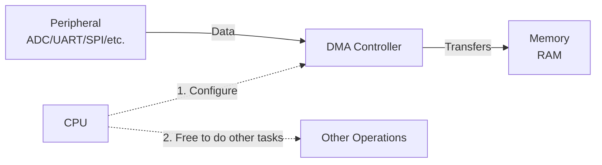

# STM32 Peripheral-to-Memory DMA

## Introduction

Direct Memory Access (DMA) is a powerful feature in STM32 microcontrollers that allows data to be transferred between peripherals and memory without the intervention of the CPU. In this tutorial, we'll focus specifically on **Peripheral-to-Memory DMA transfers**, which involve moving data from a peripheral (like an ADC, UART, or SPI) directly to a memory location.

This approach significantly improves system performance by:
- Freeing up the CPU to perform other tasks during data transfers
- Reducing latency in data processing
- Enabling efficient handling of high-speed data streams

By the end of this tutorial, you'll understand how Peripheral-to-Memory DMA works on STM32 microcontrollers and be able to implement it in your own projects.

## Basic Concepts

### What is Peripheral-to-Memory DMA?

In a Peripheral-to-Memory DMA transfer, data flows from a peripheral device (the source) to a memory location (the destination) without CPU intervention. This is particularly useful when you need to capture data from sensors, communication interfaces, or other external devices.



### Key Components

1. **Source**: The peripheral device generating data (ADC, UART, SPI, etc.)
2. **Destination**: A memory location (typically an array in RAM)  
3. **DMA Controller**: Hardware that manages the data transfer
4. **DMA Channel**: A specific pathway for data transfer
5. **DMA Stream**: On advanced STM32 devices, streams provide multiple transfer paths with enhanced features

## STM32 DMA Architecture

STM32 microcontrollers feature different DMA implementations depending on the specific family:

- **Basic STM32 devices** (like F1, L1): Typically have DMA1 with 7 channels
- **Advanced STM32 devices** (like F4, F7): Usually have DMA1 and DMA2, each with multiple streams (usually 8) and each stream can use one of several channels

For each peripheral, the STM32 reference manual specifies which DMA controller, stream, and channel to use. This is fixed in hardware and cannot be changed.

## Setting Up Peripheral-to-Memory DMA

Let's go through the general steps to set up a Peripheral-to-Memory DMA transfer:

### 1. Enable Clocks

First, enable the clocks for both the DMA controller and the peripheral you want to use:

```c
// Enable DMA1 clock
RCC->AHB1ENR |= RCC_AHB1ENR_DMA1EN;

// Enable peripheral clock (example for ADC1)
RCC->APB2ENR |= RCC_APB2ENR_ADC1EN;
```

### 2. Configure the Peripheral

Configure the peripheral to work with DMA. Each peripheral has specific registers for DMA enablement:

```c
// Example for ADC1
// Enable DMA mode for ADC1
ADC1->CR2 |= ADC_CR2_DMA;
```

### 3. Configure the DMA Channel/Stream

```c
// Disable the DMA stream first (important!)
DMA1_Stream0->CR &= ~DMA_SxCR_EN;

// Wait until the stream is disabled
while(DMA1_Stream0->CR & DMA_SxCR_EN) { }

// Set the peripheral address (source)
DMA1_Stream0->PAR = (uint32_t)&ADC1->DR;

// Set the memory address (destination)
DMA1_Stream0->M0AR = (uint32_t)adcResultBuffer;

// Set the number of data items to transfer
DMA1_Stream0->NDTR = BUFFER_SIZE;

// Configure DMA stream
DMA1_Stream0->CR = 0;
DMA1_Stream0->CR |= (0 << DMA_SxCR_CHSEL_Pos);     // Select channel 0
DMA1_Stream0->CR |= DMA_SxCR_MINC;                 // Memory increment mode
DMA1_Stream0->CR |= DMA_SxCR_CIRC;                 // Circular mode
DMA1_Stream0->CR |= (0 << DMA_SxCR_DIR_Pos);       // Peripheral to memory
DMA1_Stream0->CR |= (0 << DMA_SxCR_MSIZE_Pos);     // Memory data size: byte
DMA1_Stream0->CR |= (0 << DMA_SxCR_PSIZE_Pos);     // Peripheral data size: byte
DMA1_Stream0->CR |= (0 << DMA_SxCR_PL_Pos);        // Priority: Low

// Clear all interrupt flags
DMA1->LIFCR = 0x3F << (0 * 6);
```

### 4. Enable DMA Interrupts (Optional)

If you want to handle DMA completion or errors:

```c
// Enable Transfer Complete interrupt
DMA1_Stream0->CR |= DMA_SxCR_TCIE;

// Enable DMA interrupts in NVIC
NVIC_EnableIRQ(DMA1_Stream0_IRQn);
```

### 5. Enable the DMA Stream

```c
// Enable the DMA stream
DMA1_Stream0->CR |= DMA_SxCR_EN;
```

### 6. Start the Peripheral

```c
// Example for ADC1
// Start ADC conversion
ADC1->CR2 |= ADC_CR2_SWSTART;
```

## Using STM32CubeMX and HAL Library

While the register-level approach gives you maximum control, STM32CubeMX and the HAL library make it easier to configure DMA:

```c
// Define the ADC handle and DMA handle
ADC_HandleTypeDef hadc1;
DMA_HandleTypeDef hdma_adc1;

// Buffer to store ADC results
uint16_t adcResultBuffer[BUFFER_SIZE];

void ConfigureDMA(void)
{
    // Configure DMA for ADC1
    hdma_adc1.Instance = DMA1_Stream0;
    hdma_adc1.Init.Channel = DMA_CHANNEL_0;
    hdma_adc1.Init.Direction = DMA_PERIPH_TO_MEMORY;
    hdma_adc1.Init.PeriphInc = DMA_PINC_DISABLE;
    hdma_adc1.Init.MemInc = DMA_MINC_ENABLE;
    hdma_adc1.Init.PeriphDataAlignment = DMA_PDATAALIGN_HALFWORD;
    hdma_adc1.Init.MemDataAlignment = DMA_MDATAALIGN_HALFWORD;
    hdma_adc1.Init.Mode = DMA_CIRCULAR;
    hdma_adc1.Init.Priority = DMA_PRIORITY_LOW;
    hdma_adc1.Init.FIFOMode = DMA_FIFOMODE_DISABLE;
    
    HAL_DMA_Init(&hdma_adc1);
    
    // Link DMA handle with ADC handle
    __HAL_LINKDMA(&hadc1, DMA_Handle, hdma_adc1);
    
    // Configure ADC1
    hadc1.Instance = ADC1;
    // ... other ADC configurations
    
    HAL_ADC_Init(&hadc1);
    
    // Start ADC with DMA
    HAL_ADC_Start_DMA(&hadc1, (uint32_t*)adcResultBuffer, BUFFER_SIZE);
}
```

## Practical Example: ADC with DMA

Let's implement a complete example using ADC with DMA to continuously sample an analog input:

```c
#include "stm32f4xx_hal.h"

#define ADC_BUFFER_SIZE 100

ADC_HandleTypeDef hadc1;
DMA_HandleTypeDef hdma_adc1;
uint16_t adc_buffer[ADC_BUFFER_SIZE];
volatile uint8_t adc_conversion_complete = 0;

void SystemClock_Config(void);
void Error_Handler(void);

int main(void)
{
    HAL_Init();
    SystemClock_Config();
    
    // Enable clocks
    __HAL_RCC_DMA2_CLK_ENABLE();
    __HAL_RCC_ADC1_CLK_ENABLE();
    __HAL_RCC_GPIOA_CLK_ENABLE();
    
    // Configure GPIO for ADC input (PA0)
    GPIO_InitTypeDef GPIO_InitStruct = {0};
    GPIO_InitStruct.Pin = GPIO_PIN_0;
    GPIO_InitStruct.Mode = GPIO_MODE_ANALOG;
    GPIO_InitStruct.Pull = GPIO_NOPULL;
    HAL_GPIO_Init(GPIOA, &GPIO_InitStruct);
    
    // Configure DMA
    hdma_adc1.Instance = DMA2_Stream0;
    hdma_adc1.Init.Channel = DMA_CHANNEL_0;
    hdma_adc1.Init.Direction = DMA_PERIPH_TO_MEMORY;
    hdma_adc1.Init.PeriphInc = DMA_PINC_DISABLE;
    hdma_adc1.Init.MemInc = DMA_MINC_ENABLE;
    hdma_adc1.Init.PeriphDataAlignment = DMA_PDATAALIGN_HALFWORD;
    hdma_adc1.Init.MemDataAlignment = DMA_MDATAALIGN_HALFWORD;
    hdma_adc1.Init.Mode = DMA_CIRCULAR;
    hdma_adc1.Init.Priority = DMA_PRIORITY_HIGH;
    hdma_adc1.Init.FIFOMode = DMA_FIFOMODE_DISABLE;
    
    HAL_DMA_Init(&hdma_adc1);
    
    // Associate the DMA handle with the ADC handle
    __HAL_LINKDMA(&hadc1, DMA_Handle, hdma_adc1);
    
    // Configure NVIC for DMA
    HAL_NVIC_SetPriority(DMA2_Stream0_IRQn, 0, 0);
    HAL_NVIC_EnableIRQ(DMA2_Stream0_IRQn);
    
    // Configure ADC1
    hadc1.Instance = ADC1;
    hadc1.Init.ClockPrescaler = ADC_CLOCK_SYNC_PCLK_DIV4;
    hadc1.Init.Resolution = ADC_RESOLUTION_12B;
    hadc1.Init.ScanConvMode = DISABLE;
    hadc1.Init.ContinuousConvMode = ENABLE;
    hadc1.Init.DiscontinuousConvMode = DISABLE;
    hadc1.Init.ExternalTrigConvEdge = ADC_EXTERNALTRIGCONVEDGE_NONE;
    hadc1.Init.ExternalTrigConv = ADC_SOFTWARE_START;
    hadc1.Init.DataAlign = ADC_DATAALIGN_RIGHT;
    hadc1.Init.NbrOfConversion = 1;
    hadc1.Init.DMAContinuousRequests = ENABLE;
    hadc1.Init.EOCSelection = ADC_EOC_SINGLE_CONV;
    
    if (HAL_ADC_Init(&hadc1) != HAL_OK)
    {
        Error_Handler();
    }
    
    // Configure ADC channel
    ADC_ChannelConfTypeDef sConfig = {0};
    sConfig.Channel = ADC_CHANNEL_0;
    sConfig.Rank = 1;
    sConfig.SamplingTime = ADC_SAMPLETIME_56CYCLES;
    
    if (HAL_ADC_ConfigChannel(&hadc1, &sConfig) != HAL_OK)
    {
        Error_Handler();
    }
    
    // Start ADC with DMA
    HAL_ADC_Start_DMA(&hadc1, (uint32_t*)adc_buffer, ADC_BUFFER_SIZE);
    
    while (1)
    {
        // Process data when a full buffer is received
        if (adc_conversion_complete)
        {
            // Process ADC data here
            // For example, calculate average:
            uint32_t sum = 0;
            for (int i = 0; i < ADC_BUFFER_SIZE; i++)
            {
                sum += adc_buffer[i];
            }
            uint16_t average = sum / ADC_BUFFER_SIZE;
            
            // Do something with the average value
            
            adc_conversion_complete = 0;
        }
        
        // CPU can do other tasks here while DMA handles ADC data
    }
}

// DMA transfer complete callback
void HAL_ADC_ConvCpltCallback(ADC_HandleTypeDef* hadc)
{
    if (hadc->Instance == ADC1)
    {
        adc_conversion_complete = 1;
    }
}

// DMA Stream0 interrupt handler
void DMA2_Stream0_IRQHandler(void)
{
    HAL_DMA_IRQHandler(&hdma_adc1);
}

// Error handler function
void Error_Handler(void)
{
    // Error handling code
    while(1) { }
}
```

## Real-World Applications

### 1. High-Speed Data Acquisition

DMA is essential for applications requiring continuous high-speed sampling, such as:
- Digital oscilloscopes
- Audio processing
- Vibration analysis
- Power monitoring

### 2. UART Communication

Using DMA with UART allows receiving large amounts of data without missing bytes:

```c
// Configure DMA for UART reception
hdma_uart_rx.Instance = DMA1_Stream5;
hdma_uart_rx.Init.Channel = DMA_CHANNEL_4;
hdma_uart_rx.Init.Direction = DMA_PERIPH_TO_MEMORY;
hdma_uart_rx.Init.PeriphInc = DMA_PINC_DISABLE;
hdma_uart_rx.Init.MemInc = DMA_MINC_ENABLE;
hdma_uart_rx.Init.PeriphDataAlignment = DMA_PDATAALIGN_BYTE;
hdma_uart_rx.Init.MemDataAlignment = DMA_MDATAALIGN_BYTE;
hdma_uart_rx.Init.Mode = DMA_CIRCULAR;
hdma_uart_rx.Init.Priority = DMA_PRIORITY_HIGH;

HAL_DMA_Init(&hdma_uart_rx);
__HAL_LINKDMA(&huart2, hdmarx, hdma_uart_rx);

// Start DMA reception
HAL_UART_Receive_DMA(&huart2, rxBuffer, RX_BUFFER_SIZE);
```

### 3. SPI Data Transfer

DMA with SPI enables efficient reading from external sensors or memory:

```c
// Configure DMA for SPI reception
hdma_spi_rx.Instance = DMA2_Stream0;
hdma_spi_rx.Init.Channel = DMA_CHANNEL_3;
hdma_spi_rx.Init.Direction = DMA_PERIPH_TO_MEMORY;
hdma_spi_rx.Init.PeriphInc = DMA_PINC_DISABLE;
hdma_spi_rx.Init.MemInc = DMA_MINC_ENABLE;
hdma_spi_rx.Init.PeriphDataAlignment = DMA_PDATAALIGN_BYTE;
hdma_spi_rx.Init.MemDataAlignment = DMA_MDATAALIGN_BYTE;
hdma_spi_rx.Init.Mode = DMA_NORMAL;
hdma_spi_rx.Init.Priority = DMA_PRIORITY_HIGH;

HAL_DMA_Init(&hdma_spi_rx);
__HAL_LINKDMA(&hspi1, hdmarx, hdma_spi_rx);

// Read data from an external device
HAL_SPI_Receive_DMA(&hspi1, rxBuffer, DATA_LENGTH);
```

## Advanced Techniques

### Double Buffering

Double buffering allows processing one block of data while another is being filled:

```c
#define BUFFER_SIZE 100
uint16_t adcBuffer1[BUFFER_SIZE];
uint16_t adcBuffer2[BUFFER_SIZE];
volatile uint8_t activeBuffer = 0;

void HAL_ADC_ConvHalfCpltCallback(ADC_HandleTypeDef* hadc)
{
    // First half of the buffer is filled
    if (activeBuffer == 0)
    {
        // Process adcBuffer1
    }
    else
    {
        // Process adcBuffer2
    }
}

void HAL_ADC_ConvCpltCallback(ADC_HandleTypeDef* hadc)
{
    // Second half of the buffer is filled
    activeBuffer = !activeBuffer;
    if (activeBuffer == 0)
    {
        // Setup DMA to use adcBuffer1 next
        HAL_ADC_Start_DMA(&hadc1, (uint32_t*)adcBuffer1, BUFFER_SIZE);
    }
    else
    {
        // Setup DMA to use adcBuffer2 next
        HAL_ADC_Start_DMA(&hadc1, (uint32_t*)adcBuffer2, BUFFER_SIZE);
    }
}
```

### DMA with Interrupts

Combining DMA with interrupts allows efficient data handling:

```c
// Enable DMA half-transfer and transfer-complete interrupts
hdma_adc.Instance = DMA1_Stream0;
// ... other configurations
hdma_adc.Init.Mode = DMA_CIRCULAR;

// Register callbacks
HAL_ADC_Start_DMA(&hadc1, (uint32_t*)adcBuffer, BUFFER_SIZE * 2);

// In your main loop
while (1)
{
    // CPU can do other tasks
    // DMA and interrupt handlers will process the data
}

// Interrupt handlers
void HAL_ADC_ConvHalfCpltCallback(ADC_HandleTypeDef* hadc)
{
    // Process first half of buffer
    ProcessData(&adcBuffer[0], BUFFER_SIZE);
}

void HAL_ADC_ConvCpltCallback(ADC_HandleTypeDef* hadc)
{
    // Process second half of buffer
    ProcessData(&adcBuffer[BUFFER_SIZE], BUFFER_SIZE);
}
```

## Common Pitfalls and Solutions

### 1. Buffer Alignment

For efficient DMA transfers, memory buffers should be properly aligned:

```c
// Correct alignment for a 32-bit MCU
__attribute__((aligned(4))) uint16_t adcBuffer[BUFFER_SIZE];
```

### 2. Race Conditions

Be careful when accessing DMA buffers to avoid race conditions:

```c
// Disable interrupts before accessing shared data
__disable_irq();
// Process DMA buffer
ProcessBuffer(buffer, size);
__enable_irq();
```

### 3. Circular Mode Issues

In circular mode, keep track of buffer positions to avoid processing stale data:

```c
// Get current DMA position
uint16_t dmaPos = BUFFER_SIZE - (uint16_t)(DMA1_Stream0->NDTR);
// Process only new data since last check
ProcessNewData(buffer, lastPos, dmaPos);
lastPos = dmaPos;
```

### 4. DMA Stream Selection

Make sure to use the correct DMA stream and channel for your peripheral:

```c
// Check the reference manual for the correct combination
// For STM32F4, ADC1 uses DMA2_Stream0, Channel 0
hdma_adc1.Instance = DMA2_Stream0;
hdma_adc1.Init.Channel = DMA_CHANNEL_0;
```

## Summary

Peripheral-to-Memory DMA is a powerful feature of STM32 microcontrollers that enables efficient data transfer from peripherals to memory without CPU intervention. Key benefits include:

- Reduced CPU load
- Higher data throughput
- Better real-time performance
- Efficient handling of high-speed peripherals

When implementing Peripheral-to-Memory DMA:
1. Choose the appropriate DMA controller, stream, and channel
2. Configure both the peripheral and DMA with compatible settings
3. Use circular mode for continuous sampling
4. Implement proper interrupt handling for data processing
5. Consider double buffering for high-speed applications

## Exercises

1. Implement a basic ADC to memory transfer using DMA and print the values over UART.
2. Modify the example to use double buffering for continuous data processing.
3. Create a digital oscilloscope that samples an analog input at high speed and transfers the data to a PC via UART with DMA.
4. Implement a frequency counter using timer capture with DMA.
5. Create a data logger that samples multiple ADC channels and stores the data in external memory using DMA.

## Additional Resources

- STM32 Reference Manuals - Check your specific device family
- STM32 DMA Application Notes (AN4031) - Provides detailed information about DMA usage
- STM32CubeF4 DMA Examples - Practical code examples
- STM32 HAL Library Documentation - For HAL-based implementations

Happy coding with STM32 DMA!