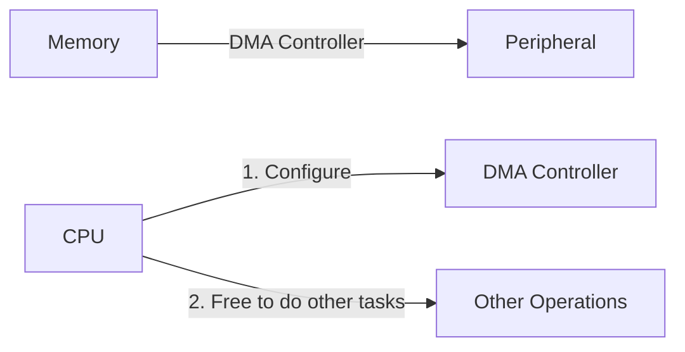

# STM32 Memory-to-Peripheral DMA

## Introduction

Direct Memory Access (DMA) is a powerful feature in STM32 microcontrollers that allows data transfer between memory and peripherals without CPU intervention. In this tutorial, we'll focus specifically on Memory-to-Peripheral DMA transfers, where data flows from the microcontroller's memory to an external peripheral.

Memory-to-Peripheral DMA is particularly useful for operations like:
- Sending data to a DAC (Digital-to-Analog Converter)
- Transmitting data via UART, SPI, or I2C
- Driving LED arrays or displays
- Generating waveforms or signals

By offloading these data transfers to the DMA controller, your CPU is free to handle other tasks, significantly improving system performance and power efficiency.

## How Memory-to-Peripheral DMA Works

In a Memory-to-Peripheral DMA transfer, the following occurs:



1. The CPU configures the DMA controller with source address (memory), destination address (peripheral register), and transfer parameters
2. The DMA controller handles the data transfer independently
3. When complete, the DMA controller can generate an interrupt to notify the CPU
4. Throughout this process, the CPU is free to execute other code

## Setting Up Memory-to-Peripheral DMA

Let's walk through the process of setting up a Memory-to-Peripheral DMA transfer on an STM32 microcontroller:

### Step 1: Enable Required Clocks

First, we need to enable clocks for both the DMA controller and the peripheral we plan to use:

```c
// Enable DMA1 clock
RCC->AHB1ENR |= RCC_AHB1ENR_DMA1EN;

// Enable peripheral clock (example for USART2)
RCC->APB1ENR |= RCC_APB1ENR_USART2EN;
```

### Step 2: Configure the Peripheral

Before setting up DMA, configure the peripheral for normal operation. Here's an example for USART2:

```c
// Configure USART2 (115200 baud, 8N1)
USART2->BRR = SystemCoreClock / 115200;
USART2->CR1 = USART_CR1_TE | USART_CR1_UE;

// Enable DMA transmitter
USART2->CR3 |= USART_CR3_DMAT;
```

### Step 3: Configure DMA Channel/Stream

Now, let's configure the DMA channel or stream for the transfer:

```c
// Disable DMA stream (required before configuration)
DMA1_Stream6->CR &= ~DMA_SxCR_EN;

// Wait until DMA stream is disabled
while(DMA1_Stream6->CR & DMA_SxCR_EN) { }

// Clear any pending flags
DMA1->HIFCR |= DMA_HIFCR_CTCIF6 | DMA_HIFCR_CHTIF6 | DMA_HIFCR_CTEIF6 | 
              DMA_HIFCR_CDMEIF6 | DMA_HIFCR_CFEIF6;

// Configure DMA stream
DMA1_Stream6->PAR = (uint32_t)&USART2->DR;  // Peripheral address (destination)
DMA1_Stream6->M0AR = (uint32_t)data_buffer;  // Memory address (source)
DMA1_Stream6->NDTR = buffer_size;            // Number of data items to transfer

// Configure transfer direction, memory increment, transfer complete interrupt
DMA1_Stream6->CR = DMA_SxCR_CHSEL_2 |        // Channel selection (Channel 4)
                  DMA_SxCR_DIR_0 |           // Memory-to-peripheral direction
                  DMA_SxCR_MINC |            // Memory increment mode
                  DMA_SxCR_TCIE;             // Transfer complete interrupt enable
```

### Step 4: Enable DMA and Handle Transfer Completion

Finally, enable the DMA transfer and handle its completion:

```c
// Enable DMA stream
DMA1_Stream6->CR |= DMA_SxCR_EN;

// Optional: Configure and enable the DMA transfer complete interrupt
NVIC_SetPriority(DMA1_Stream6_IRQn, 6);
NVIC_EnableIRQ(DMA1_Stream6_IRQn);

// The CPU is now free to do other things while transfer happens!
```

Interrupt handler for transfer completion:

```c
void DMA1_Stream6_IRQHandler(void) {
    // Check if transfer complete flag is set
    if (DMA1->HISR & DMA_HISR_TCIF6) {
        // Clear the transfer complete flag
        DMA1->HIFCR |= DMA_HIFCR_CTCIF6;
        
        // Handle transfer complete (e.g., update status flags)
        transfer_complete_flag = 1;
    }
}
```

## Practical Example: Generating a Waveform with DAC and DMA

Let's look at a complete example of using Memory-to-Peripheral DMA to generate a sine wave using the DAC peripheral:

```c
#include "stm32f4xx.h"
#include <math.h>

#define SINE_POINTS 256
uint16_t sine_wave[SINE_POINTS];

void SystemInit(void);
void DMA_Init(void);
void DAC_Init(void);
void generateSineWave(void);

int main(void) {
    SystemInit();
    
    // Generate sine wave data
    generateSineWave();
    
    // Initialize peripherals
    DAC_Init();
    DMA_Init();
    
    // The CPU can now perform other tasks
    while (1) {
        // Main application code here
    }
}

void generateSineWave(void) {
    for (int i = 0; i < SINE_POINTS; i++) {
        // Generate sine wave with values from 0 to 4095 (12-bit DAC)
        sine_wave[i] = (uint16_t)(2047.0 * sin(2 * M_PI * i / SINE_POINTS) + 2047.0);
    }
}

void DAC_Init(void) {
    // Enable clocks
    RCC->AHB1ENR |= RCC_AHB1ENR_GPIOAEN;
    RCC->APB1ENR |= RCC_APB1ENR_DACEN;
    
    // Configure PA4 (DAC_OUT1) as analog
    GPIOA->MODER |= GPIO_MODER_MODER4;
    
    // Configure DAC channel 1
    DAC->CR |= DAC_CR_EN1;          // Enable DAC channel 1
    DAC->CR |= DAC_CR_DMAEN1;       // Enable DMA for DAC channel 1
    DAC->CR |= DAC_CR_TEN1;         // Enable trigger for DAC channel 1
    DAC->CR |= DAC_CR_TSEL1_1;      // Select Timer 6 as trigger
    
    // Configure Timer 6 as a trigger source
    RCC->APB1ENR |= RCC_APB1ENR_TIM6EN;
    TIM6->PSC = 0;                  // No prescaler
    TIM6->ARR = SystemCoreClock / (SINE_POINTS * 1000) - 1; // 1kHz waveform
    TIM6->CR2 |= TIM_CR2_MMS_1;     // TRGO on update event
    TIM6->CR1 |= TIM_CR1_CEN;       // Enable timer
}

void DMA_Init(void) {
    // Enable DMA1 clock
    RCC->AHB1ENR |= RCC_AHB1ENR_DMA1EN;
    
    // Disable DMA stream (required before configuration)
    DMA1_Stream5->CR &= ~DMA_SxCR_EN;
    
    // Wait until DMA stream is fully disabled
    while (DMA1_Stream5->CR & DMA_SxCR_EN) { }
    
    // Clear any pending flags
    DMA1->HIFCR |= DMA_HIFCR_CTCIF5 | DMA_HIFCR_CHTIF5 | 
                   DMA_HIFCR_CTEIF5 | DMA_HIFCR_CDMEIF5 | DMA_HIFCR_CFEIF5;
    
    // Configure DMA
    DMA1_Stream5->PAR = (uint32_t)&DAC->DHR12R1;   // Peripheral address (DAC)
    DMA1_Stream5->M0AR = (uint32_t)sine_wave;      // Memory address (sine wave data)
    DMA1_Stream5->NDTR = SINE_POINTS;              // Number of data points
    
    // Configure stream: memory-to-peripheral, memory increment, circular mode
    DMA1_Stream5->CR = (0x7 << DMA_SxCR_CHSEL_Pos) | // Channel 7
                      DMA_SxCR_DIR_0 |            // Memory-to-peripheral
                      DMA_SxCR_MINC |             // Memory increment mode
                      DMA_SxCR_CIRC;              // Circular mode
    
    // Enable DMA stream
    DMA1_Stream5->CR |= DMA_SxCR_EN;
}
```

### Output

When this code runs, the DAC will continuously output a sine wave with a frequency of 1kHz. The DMA transfers data from the `sine_wave` array to the DAC at a rate determined by Timer 6, without requiring any CPU intervention.

## Advanced Considerations

### DMA Stream Selection

STM32 microcontrollers often have multiple DMA controllers and streams. Each peripheral is typically mapped to specific DMA streams. Consult the reference manual for your specific STM32 model to determine the correct stream for your peripheral.

### Transfer Sizes

You can configure DMA to transfer data in different sizes:
- Byte (8-bit)
- Half-word (16-bit)
- Word (32-bit)

Ensure that both the source and destination sizes match to avoid data corruption.

```c
// Configure for 16-bit transfers (for DAC)
DMA1_Stream5->CR |= DMA_SxCR_PSIZE_0;  // Peripheral size: 16-bit
DMA1_Stream5->CR |= DMA_SxCR_MSIZE_0;  // Memory size: 16-bit
```

### Circular Mode vs. Normal Mode

- **Normal Mode**: The DMA transfers the specified number of data items and stops.
- **Circular Mode**: The DMA continuously transfers data, restarting from the beginning once complete.

Circular mode is ideal for repetitive tasks like waveform generation or continuous sampling.

### DMA Interrupts

DMA can generate interrupts at various points:
- Transfer Complete
- Half Transfer Complete
- Transfer Error

These interrupts allow your code to respond to transfer events without polling.

## Common Pitfalls and Debugging Tips

1. **Ensure Proper Clock Configuration**:
   - Both the DMA controller and the peripheral must have their clocks enabled.

2. **Check Channel and Stream Mapping**:
   - Each peripheral is mapped to specific DMA channels/streams. Using the wrong one will not work.

3. **Peripheral Configuration**:
   - The peripheral must be properly configured for DMA operation (e.g., USART_CR3_DMAT for USART).

4. **DMA Priority**:
   - If multiple DMA transfers are active, priority settings might affect performance.

5. **Data Alignment and Size**:
   - Ensure memory and peripheral data sizes match to avoid alignment issues.

6. **Debugging with Status Flags**:
   - Check DMA status registers (DMA_LISR, DMA_HISR) to diagnose transfer issues.

## Summary

Memory-to-Peripheral DMA is a powerful feature of STM32 microcontrollers that allows efficient data transfers from memory to peripherals without CPU intervention. Key benefits include:

- Reduced CPU load, freeing up processing power for other tasks
- More efficient power usage
- Higher data transfer rates for time-critical applications
- Enabling complex operations like continuous waveform generation

By following the steps outlined in this tutorial, you can successfully implement Memory-to-Peripheral DMA in your STM32 projects, improving performance and efficiency.

## Exercises

1. Modify the sine wave example to generate a square wave instead.
2. Implement a UART transmitter using DMA to send a large buffer of data.
3. Create a system that uses DMA to drive an LED strip with changing patterns.
4. Implement a dual-buffer scheme (double buffering) where one buffer is being filled while the other is being transferred via DMA.

## Additional Resources

- STM32 Reference Manual (RM0090 for STM32F4 series) - Chapters on DMA controller
- STM32 Application Notes:
  - AN4031: Using the STM32F2, STM32F4 and STM32F7 Series DMA controller
  - AN3126: Audio and waveform generation using the DAC
- STMicroelectronics website for additional example code and documentation