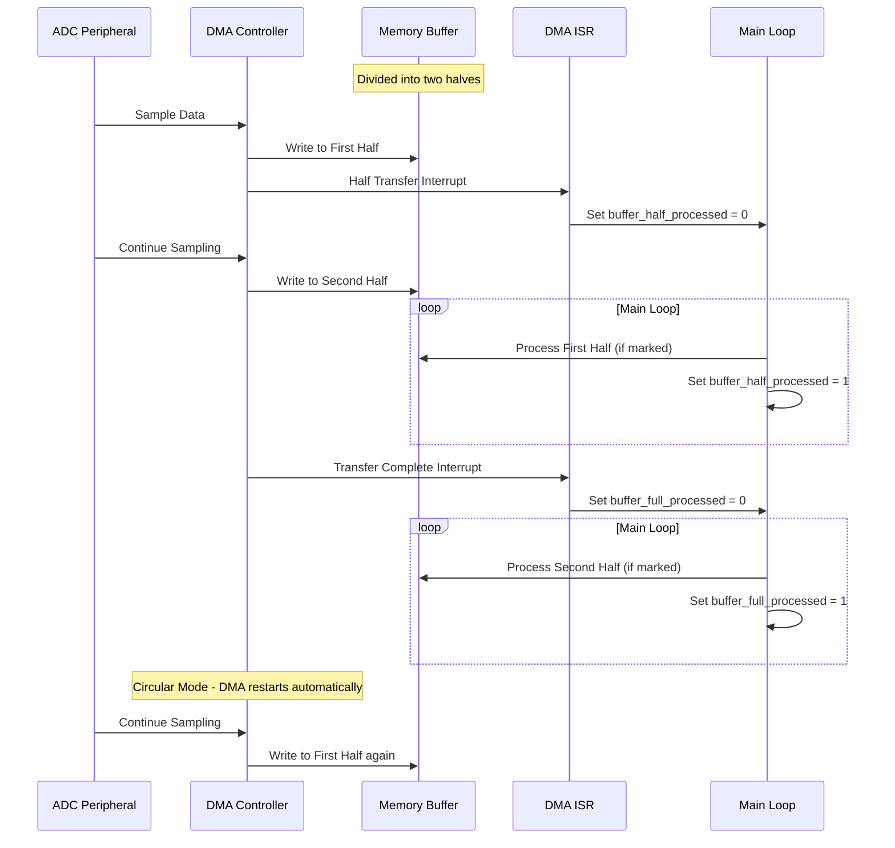

# STM32 DMA Interrupts

## Introduction

When working with microcontrollers, efficient data transfer is crucial for system performance. The Direct Memory Access (DMA) controller in STM32 microcontrollers allows data movement between peripherals and memory without CPU intervention. While basic DMA transfers work autonomously, real-world applications often require the system to know when transfers are completed or if errors occur.

This is where **DMA interrupts** come into play. DMA interrupts enable your application to respond to DMA events asynchronously, allowing your main program to continue execution while being notified when important DMA events occur.

In this tutorial, we'll explore how to set up and use DMA interrupts in STM32 microcontrollers, providing practical examples to help you implement them in your own projects.

## Understanding DMA Interrupts

### What are DMA Interrupts?

DMA interrupts are notifications generated by the DMA controller when specific events occur during a DMA transfer. These interrupts can be triggered upon:

- **Transfer Complete (TC)**: Generated when an entire DMA transfer completes
- **Half Transfer (HT)**: Generated when half of a DMA transfer completes
- **Transfer Error (TE)**: Generated when an error occurs during the DMA transfer

By configuring and enabling these interrupts, your application can respond to these events by executing specific interrupt service routines (ISRs).

### The Benefits of DMA Interrupts

Using DMA interrupts provides several advantages:

1. **Efficient CPU usage**: The CPU can perform other tasks while DMA transfers occur in the background
2. **Timely responses**: Your application can immediately respond to completed transfers or errors
3. **Chained operations**: You can trigger new operations when a DMA transfer completes
4. **Error handling**: You can detect and respond to transfer errors

## Configuring DMA Interrupts

Setting up DMA interrupts involves several steps:

1. Initialize the DMA channel for your desired peripheral
2. Configure the DMA interrupt flags
3. Enable the NVIC (Nested Vectored Interrupt Controller) for the DMA channel
4. Implement the interrupt service routine (ISR)

Let's walk through each of these steps with code examples.

### Step 1: DMA Channel Initialization

First, we need to initialize the DMA channel. This example configures DMA for UART transmission:

```c
void DMA_Config(void)
{
  /* Enable DMA1 clock */
  RCC->AHBENR |= RCC_AHBENR_DMA1EN;
  
  /* Configure DMA1 Channel 4 (UART1 TX) */
  DMA1_Channel4->CCR = 0;                       // Disable channel first
  DMA1_Channel4->CPAR = (uint32_t)&USART1->DR;  // Peripheral address
  DMA1_Channel4->CMAR = (uint32_t)tx_buffer;    // Memory address
  DMA1_Channel4->CNDTR = BUFFER_SIZE;           // Data size
  
  /* Configure DMA channel settings */
  DMA1_Channel4->CCR |= DMA_CCR_DIR;            // Memory-to-peripheral
  DMA1_Channel4->CCR |= DMA_CCR_MINC;           // Memory increment mode
  DMA1_Channel4->CCR |= DMA_CCR_PSIZE_0;        // Peripheral size: 16-bit
  DMA1_Channel4->CCR |= DMA_CCR_MSIZE_0;        // Memory size: 16-bit
  
  /* Enable DMA interrupts */
  DMA1_Channel4->CCR |= DMA_CCR_TCIE;           // Transfer complete interrupt
  DMA1_Channel4->CCR |= DMA_CCR_HTIE;           // Half transfer interrupt
  DMA1_Channel4->CCR |= DMA_CCR_TEIE;           // Transfer error interrupt
}
```

The critical part for enabling interrupts is setting the appropriate bits in the CCR (Channel Configuration Register):
- `DMA_CCR_TCIE`: Transfer Complete Interrupt Enable
- `DMA_CCR_HTIE`: Half Transfer Interrupt Enable
- `DMA_CCR_TEIE`: Transfer Error Interrupt Enable

### Step 2: Enable NVIC for DMA Interrupts

After configuring the DMA channel, we need to enable the interrupt in the NVIC:

```c
void DMA_NVIC_Config(void)
{
  /* Configure NVIC for DMA1 Channel4 interrupt */
  NVIC_SetPriority(DMA1_Channel4_IRQn, 1);   // Set priority (0 is highest)
  NVIC_EnableIRQ(DMA1_Channel4_IRQn);        // Enable the interrupt
}
```

### Step 3: Implement the Interrupt Service Routine

Now we need to implement the ISR to handle the DMA interrupts:

```c
void DMA1_Channel4_IRQHandler(void)
{
  /* Check for transfer complete interrupt */
  if (DMA1->ISR & DMA_ISR_TCIF4)
  {
    DMA1->IFCR = DMA_IFCR_CTCIF4;     // Clear the interrupt flag
    
    /* Handle transfer complete event */
    TransferCompleteCallback();
  }
  
  /* Check for half transfer interrupt */
  if (DMA1->ISR & DMA_ISR_HTIF4)
  {
    DMA1->IFCR = DMA_IFCR_CHTIF4;     // Clear the interrupt flag
    
    /* Handle half transfer event */
    HalfTransferCallback();
  }
  
  /* Check for transfer error interrupt */
  if (DMA1->ISR & DMA_ISR_TEIF4)
  {
    DMA1->IFCR = DMA_IFCR_CTEIF4;     // Clear the interrupt flag
    
    /* Handle transfer error event */
    TransferErrorCallback();
  }
}
```

In this ISR:
1. We check which interrupt flag is set using the Interrupt Status Register (ISR)
2. Clear the corresponding flag using the Interrupt Flag Clear Register (IFCR)
3. Call the appropriate callback function to handle the event

### Step 4: Implement Callback Functions

Finally, we implement the callback functions to handle each type of interrupt:

```c
void TransferCompleteCallback(void)
{
  /* Turn on LED to indicate transfer complete */
  GPIOA->BSRR = GPIO_BSRR_BS5;
  
  /* Process the completed transfer */
  processCompletedData();
  
  /* Start a new transfer if needed */
  startNewTransfer();
}

void HalfTransferCallback(void)
{
  /* Process the first half of data while the second half is being transferred */
  processHalfBuffer();
}

void TransferErrorCallback(void)
{
  /* Handle error condition */
  errorCounter++;
  resetDMATransfer();
}
```

### Step 5: Start the DMA Transfer

To start the DMA transfer with interrupts enabled:

```c
void StartDMATransfer(void)
{
  /* Update DMA with current buffer address and size */
  DMA1_Channel4->CMAR = (uint32_t)tx_buffer;
  DMA1_Channel4->CNDTR = BUFFER_SIZE;
  
  /* Enable DMA channel */
  DMA1_Channel4->CCR |= DMA_CCR_EN;
}
```

## Practical Example: Circular Buffer for ADC with DMA Interrupts

Here's a practical example that uses DMA interrupts to manage a circular buffer for continuous ADC sampling:

```c
#define ADC_BUFFER_SIZE 512

volatile uint16_t adc_buffer[ADC_BUFFER_SIZE];
volatile uint8_t buffer_half_processed = 0;
volatile uint8_t buffer_full_processed = 0;

void ADC_DMA_Config(void)
{
  /* Configure ADC */
  // ... ADC configuration code ...
  
  /* Configure DMA for ADC in circular mode */
  RCC->AHBENR |= RCC_AHBENR_DMA1EN;
  
  DMA1_Channel1->CCR = 0;
  DMA1_Channel1->CPAR = (uint32_t)&ADC1->DR;       // ADC data register
  DMA1_Channel1->CMAR = (uint32_t)adc_buffer;      // Memory buffer
  DMA1_Channel1->CNDTR = ADC_BUFFER_SIZE;          // Buffer size
  
  /* Set circular mode for continuous operation */
  DMA1_Channel1->CCR |= DMA_CCR_CIRC;              // Circular mode
  DMA1_Channel1->CCR |= DMA_CCR_MINC;              // Memory increment
  DMA1_Channel1->CCR |= DMA_CCR_PSIZE_0;           // Peripheral: 16-bit
  DMA1_Channel1->CCR |= DMA_CCR_MSIZE_0;           // Memory: 16-bit
  
  /* Enable interrupts for half and complete transfer */
  DMA1_Channel1->CCR |= DMA_CCR_HTIE;              // Half transfer interrupt
  DMA1_Channel1->CCR |= DMA_CCR_TCIE;              // Complete transfer interrupt
  
  /* Configure NVIC */
  NVIC_SetPriority(DMA1_Channel1_IRQn, 2);
  NVIC_EnableIRQ(DMA1_Channel1_IRQn);
  
  /* Enable DMA and ADC */
  DMA1_Channel1->CCR |= DMA_CCR_EN;                // Enable DMA
  ADC1->CR2 |= ADC_CR2_ADON;                       // Enable ADC
  ADC1->CR2 |= ADC_CR2_DMA;                        // Enable ADC DMA
  ADC1->CR2 |= ADC_CR2_CONT;                       // Continuous conversion
  ADC1->CR2 |= ADC_CR2_SWSTART;                    // Start conversion
}

void DMA1_Channel1_IRQHandler(void)
{
  /* Half transfer interrupt */
  if (DMA1->ISR & DMA_ISR_HTIF1)
  {
    DMA1->IFCR = DMA_IFCR_CHTIF1;                  // Clear flag
    buffer_half_processed = 0;                      // Mark first half for processing
  }
  
  /* Transfer complete interrupt */
  if (DMA1->ISR & DMA_ISR_TCIF1)
  {
    DMA1->IFCR = DMA_IFCR_CTCIF1;                  // Clear flag
    buffer_full_processed = 0;                      // Mark second half for processing
  }
}

void ProcessADCData(void)
{
  uint32_t sum = 0;
  uint16_t average = 0;
  
  /* Process first half of buffer */
  if (buffer_half_processed == 0)
  {
    for (int i = 0; i < ADC_BUFFER_SIZE/2; i++)
    {
      sum += adc_buffer[i];
    }
    average = sum / (ADC_BUFFER_SIZE/2);
    
    /* Do something with the average value */
    UpdateDisplay(average);
    
    buffer_half_processed = 1;                      // Mark as processed
  }
  
  /* Process second half of buffer */
  if (buffer_full_processed == 0)
  {
    sum = 0;
    for (int i = ADC_BUFFER_SIZE/2; i < ADC_BUFFER_SIZE; i++)
    {
      sum += adc_buffer[i];
    }
    average = sum / (ADC_BUFFER_SIZE/2);
    
    /* Do something with the average value */
    UpdateDisplay(average);
    
    buffer_full_processed = 1;                      // Mark as processed
  }
}

int main(void)
{
  /* Initialize system */
  SystemClock_Config();
  GPIO_Config();
  ADC_DMA_Config();
  
  while (1)
  {
    /* Process ADC data while DMA runs in background */
    ProcessADCData();
    
    /* Other application tasks */
    // ...
  }
}
```

This example demonstrates a common pattern in embedded systems: using DMA in circular mode with half and complete transfer interrupts to process data continuously while new data is being acquired.

The flow of operation is visualized in the following diagram:



This pattern allows continuous data acquisition while ensuring no data is lost. The main program processes data from one half of the buffer while the DMA controller fills the other half.

## Common DMA Interrupt Patterns

### 1. One-Shot Transfer with Completion Notification

This pattern is useful when you want to perform a single DMA transfer and be notified when it completes:

```c
/* Configure DMA for single transfer */
DMA1_Channel4->CCR &= ~DMA_CCR_CIRC;     // Disable circular mode
DMA1_Channel4->CCR |= DMA_CCR_TCIE;      // Enable transfer complete interrupt

/* Start transfer */
DMA1_Channel4->CCR |= DMA_CCR_EN;

/* In the ISR */
void DMA1_Channel4_IRQHandler(void)
{
  if (DMA1->ISR & DMA_ISR_TCIF4)
  {
    DMA1->IFCR = DMA_IFCR_CTCIF4;        // Clear flag
    
    /* Transfer is complete - notify application */
    transferComplete = 1;
  }
}
```

### 2. Double-Buffer with Ping-Pong Operation

This pattern uses two buffers alternately, allowing one buffer to be processed while the other is being filled:

```c
#define BUFFER_SIZE 256
uint16_t buffer_a[BUFFER_SIZE];
uint16_t buffer_b[BUFFER_SIZE];
volatile uint8_t active_buffer = 0;       // 0 = buffer A, 1 = buffer B

void StartPingPongDMA(void)
{
  /* Initial configuration for buffer A */
  DMA1_Channel1->CCR = 0;
  DMA1_Channel1->CMAR = (uint32_t)buffer_a;
  DMA1_Channel1->CNDTR = BUFFER_SIZE;
  DMA1_Channel1->CCR |= DMA_CCR_TCIE;      // Transfer complete interrupt
  DMA1_Channel1->CCR |= DMA_CCR_EN;        // Enable channel
  
  active_buffer = 0;
}

void DMA1_Channel1_IRQHandler(void)
{
  if (DMA1->ISR & DMA_ISR_TCIF1)
  {
    DMA1->IFCR = DMA_IFCR_CTCIF1;          // Clear flag
    
    /* Disable DMA temporarily */
    DMA1_Channel1->CCR &= ~DMA_CCR_EN;
    
    /* Switch buffers */
    if (active_buffer == 0)
    {
      /* Buffer A is full, switch to buffer B */
      DMA1_Channel1->CMAR = (uint32_t)buffer_b;
      active_buffer = 1;
      
      /* Process buffer A in main loop */
      ProcessBufferA();
    }
    else
    {
      /* Buffer B is full, switch to buffer A */
      DMA1_Channel1->CMAR = (uint32_t)buffer_a;
      active_buffer = 0;
      
      /* Process buffer B in main loop */
      ProcessBufferB();
    }
    
    /* Reset counter and restart DMA */
    DMA1_Channel1->CNDTR = BUFFER_SIZE;
    DMA1_Channel1->CCR |= DMA_CCR_EN;
  }
}
```

### 3. Error Handling with DMA

This pattern focuses on detecting and handling DMA errors:

```c
/* Enable error interrupt */
DMA1_Channel3->CCR |= DMA_CCR_TEIE;       // Transfer error interrupt

/* In the ISR */
void DMA1_Channel3_IRQHandler(void)
{
  if (DMA1->ISR & DMA_ISR_TEIF3)
  {
    DMA1->IFCR = DMA_IFCR_CTEIF3;         // Clear error flag
    
    /* Handle error */
    DMA1_Channel3->CCR &= ~DMA_CCR_EN;    // Disable DMA
    
    /* Reset peripheral */
    ResetPeripheral();
    
    /* Reinitialize DMA */
    InitializeDMA();
    
    /* Log error */
    error_count++;
  }
}
```

## Using STM32CubeMX for DMA Interrupt Configuration

If you're using the STM32CubeMX tool and HAL libraries, configuring DMA interrupts becomes even simpler:

```c
/* DMA handle structure */
DMA_HandleTypeDef hdma_usart1_tx;

void MX_DMA_Init(void)
{
  /* DMA controller clock enable */
  __HAL_RCC_DMA1_CLK_ENABLE();
  
  /* Configure DMA for USART1 TX */
  hdma_usart1_tx.Instance = DMA1_Channel4;
  hdma_usart1_tx.Init.Direction = DMA_MEMORY_TO_PERIPH;
  hdma_usart1_tx.Init.PeriphInc = DMA_PINC_DISABLE;
  hdma_usart1_tx.Init.MemInc = DMA_MINC_ENABLE;
  hdma_usart1_tx.Init.PeriphDataAlignment = DMA_PDATAALIGN_BYTE;
  hdma_usart1_tx.Init.MemDataAlignment = DMA_MDATAALIGN_BYTE;
  hdma_usart1_tx.Init.Mode = DMA_NORMAL;
  hdma_usart1_tx.Init.Priority = DMA_PRIORITY_MEDIUM;
  
  HAL_DMA_Init(&hdma_usart1_tx);
  
  /* Associate DMA handle with USART handle */
  __HAL_LINKDMA(&huart1, hdmatx, hdma_usart1_tx);
  
  /* NVIC configuration for DMA interrupt */
  HAL_NVIC_SetPriority(DMA1_Channel4_IRQn, 0, 0);
  HAL_NVIC_EnableIRQ(DMA1_Channel4_IRQn);
}

/* Callback implementation */
void HAL_UART_TxCpltCallback(UART_HandleTypeDef *huart)
{
  /* Transfer complete callback */
  if (huart->Instance == USART1)
  {
    /* Handle USART1 TX complete */
    TransferComplete();
  }
}

/* Error callback */
void HAL_UART_ErrorCallback(UART_HandleTypeDef *huart)
{
  /* Error callback */
  if (huart->Instance == USART1)
  {
    /* Handle USART1 error */
    HandleError();
  }
}

/* Start transmission */
void StartTransmission(uint8_t *data, uint16_t size)
{
  HAL_UART_Transmit_DMA(&huart1, data, size);
}
```

The HAL library automatically handles the interrupt flags and calls the appropriate callbacks when events occur.

## Best Practices for DMA Interrupts

1. **Keep ISRs Short**: Interrupt service routines should be as brief as possible. Avoid lengthy processing inside ISRs.

2. **Use Flags**: Set flags in the ISR and handle the actual processing in the main loop.

3. **Clear Interrupt Flags**: Always clear the interrupt flags in the ISR to prevent repeated interrupts.

4. **Handle Errors**: Always implement error handling for DMA transfers.

5. **Manage Priorities**: Set appropriate interrupt priorities based on the importance and timing requirements of your application.

6. **Disable Interrupts When Not Needed**: If a DMA channel is not in use, disable its interrupts to reduce overhead.

7. **Volatile Variables**: Use the `volatile` keyword for variables that are shared between ISRs and the main program.

## Troubleshooting DMA Interrupts

If your DMA interrupts aren't working as expected, check these common issues:

1. **DMA Clock Not Enabled**: Ensure you've enabled the clock for the DMA controller.

2. **Incorrect Channel**: Verify you're using the correct DMA channel for your peripheral.

3. **Interrupt Flags Not Cleared**: Make sure you're clearing the interrupt flags in your ISR.

4. **NVIC Not Configured**: Check that you've enabled the DMA interrupt in the NVIC.

5. **Incorrect Priority**: If other interrupts are preventing your DMA interrupt from executing, adjust priorities.

6. **DMA Not Enabled**: Ensure the DMA channel is enabled after configuration.

7. **Peripheral DMA Request Not Enabled**: Some peripherals require enabling a specific bit to request DMA transfers.

## Summary

DMA interrupts are a powerful feature in STM32 microcontrollers that allow efficient handling of data transfers. By using interrupts, your application can respond to DMA events asynchronously, allowing for more efficient use of CPU resources.

Key points to remember:

- DMA interrupts can notify your application of transfer complete, half transfer, and error events
- Proper configuration involves setting up the DMA channel, enabling interrupts, and configuring the NVIC
- Keep ISR processing short and use flags to defer processing to the main loop
- Use the appropriate DMA interrupt pattern for your application needs
- Always implement error handling for robust applications

## Additional Resources

- STM32 Reference Manual - DMA Controller section
- STM32 HAL DMA Driver documentation
- ST Community forums for DMA-related questions

## Exercises

1. **Basic DMA Interrupt**: Implement a UART transmit function using DMA with a transfer complete interrupt to notify when the transmission is finished.

2. **Circular Buffer**: Create a circular buffer for ADC sampling using DMA in circular mode with half and complete transfer interrupts.

3. **Error Handling**: Extend one of the above exercises to include proper error handling for DMA transfer errors.

4. **Multiple DMA Channels**: Configure two DMA channels with different priorities and observe how the interrupts are handled.

5. **Advanced Challenge**: Implement a ping-pong buffer system for continuous data processing with minimal CPU overhead.