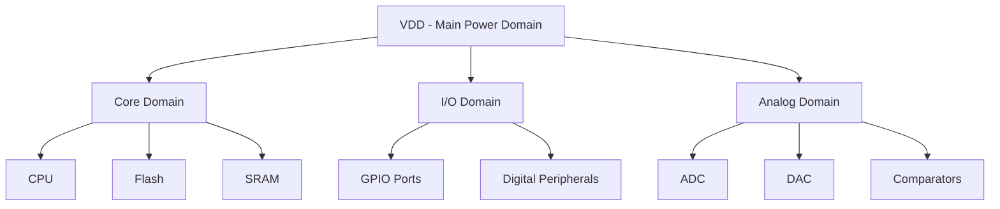

# STM32 Power Domains

## Introduction

Power management is a critical aspect of embedded system design, especially for battery-powered applications. STM32 microcontrollers offer sophisticated power-saving features through a structured approach to power domains. This article explores what power domains are, how they're implemented in STM32 microcontrollers, and how you can leverage them to optimize your application's power consumption.

A power domain is a section of the microcontroller that can have its power supply controlled independently from other sections. By understanding and properly managing these domains, you can significantly extend battery life and reduce heat generation in your embedded applications.

## Understanding Power Domains

### What Are Power Domains?

Power domains are isolated sections of a microcontroller that can be powered on or off independently. This architecture allows for fine-grained control over which parts of the chip consume power at any given time.

In STM32 microcontrollers, these domains are organized hierarchically:



### Main Power Domains in STM32

STM32 microcontrollers typically have the following power domains:

1. **VDD (Main Supply)**: Powers the entire microcontroller
2. **VDDA (Analog Supply)**: Powers analog peripherals like ADCs and DACs
3. **VBAT (Battery Backup)**: Powers the RTC and backup registers
4. **VDDIO2 (Additional I/O Supply)**: Powers specific I/O ports (on some models)
5. **VDD_USB/SDIO**: Dedicated supply for USB or SDIO interfaces (on applicable models)

Each domain can operate at different voltage levels and can be individually controlled, allowing you to power down unused sections of the chip.

## Power Domain Management in STM32

STM32 microcontrollers provide several mechanisms to control power domains:

### 1. Power Control Register (PWR_CR)

The Power Control Register allows you to configure power modes and domain states. Here's how to access it:

```c
// Enable PWR clock
RCC->APB1ENR |= RCC_APB1ENR_PWREN;

// Access PWR_CR register
PWR->CR |= PWR_CR_DBP;  // Enable access to RTC and backup registers
```

### 2. Clock Gating

One of the simplest ways to reduce power consumption is to disable clocks to unused peripherals:

```c
// Disable USART1 clock to reduce power
RCC->APB2ENR &= ~RCC_APB2ENR_USART1EN;

// Enable USART1 clock when needed
RCC->APB2ENR |= RCC_APB2ENR_USART1EN;
```

### 3. Peripheral Power-Down

Some peripherals can be explicitly powered down:

```c
// Power down the ADC
ADC1->CR2 &= ~ADC_CR2_ADON;
```

## Power Modes and Their Relationship to Domains

STM32 microcontrollers offer various power modes that affect different power domains:

### Run Mode

All necessary domains are powered on. The processor and peripherals operate normally.

```c
// Configure system clock and operate in Run mode
SystemClock_Config();  // Initialize clocks
// Normal operation code
```

### Sleep Mode

The CPU is stopped, but peripherals remain active. This mode keeps peripheral domains powered while reducing core domain power.

```c
// Enter Sleep mode
HAL_PWR_EnterSLEEPMode(PWR_MAINREGULATOR_ON, PWR_SLEEPENTRY_WFI);
```

### Stop Mode

Most clocks are stopped, and some voltage regulators are disabled. This significantly reduces power consumption while maintaining RAM content and peripheral states.

```c
// Prepare for Stop mode
// Configure which peripherals should remain active
PWR->CR |= PWR_CR_LPDS;  // Enter low-power regulator mode

// Enter Stop mode
HAL_PWR_EnterSTOPMode(PWR_LOWPOWERREGULATOR_ON, PWR_STOPENTRY_WFI);
```

### Standby Mode

Almost all power domains are powered down except for the standby circuitry and optionally the backup domain. This mode offers the lowest power consumption but requires a reset to resume operation.

```c
// Enter Standby mode
HAL_PWR_EnterSTANDBYMode();
```

## Practical Example: Optimizing Power with Domain Control

Let's create a practical example where we optimize power consumption by controlling different domains:

```c
#include "stm32f4xx_hal.h"

void SystemClock_Config(void);
void Error_Handler(void);

int main(void)
{
  HAL_Init();
  SystemClock_Config();
  
  // Initialize LED (assuming it's connected to GPIOA Pin 5)
  __HAL_RCC_GPIOA_CLK_ENABLE();
  GPIO_InitTypeDef GPIO_InitStruct = {0};
  GPIO_InitStruct.Pin = GPIO_PIN_5;
  GPIO_InitStruct.Mode = GPIO_MODE_OUTPUT_PP;
  GPIO_InitStruct.Pull = GPIO_NOPULL;
  GPIO_InitStruct.Speed = GPIO_SPEED_FREQ_LOW;
  HAL_GPIO_Init(GPIOA, &GPIO_InitStruct);
  
  // Enable PWR clock
  __HAL_RCC_PWR_CLK_ENABLE();
  
  while (1)
  {
    // ACTIVE PHASE: LED ON
    HAL_GPIO_WritePin(GPIOA, GPIO_PIN_5, GPIO_PIN_SET);
    HAL_Delay(1000);
    
    // SLEEP PHASE: Turn LED off and enter Sleep mode
    HAL_GPIO_WritePin(GPIOA, GPIO_PIN_5, GPIO_PIN_RESET);
    
    // Disable unused peripherals to save power
    __HAL_RCC_USART1_CLK_DISABLE();  // Disable USART1 clock
    __HAL_RCC_ADC1_CLK_DISABLE();    // Disable ADC1 clock
    
    // Enter Sleep mode
    HAL_PWR_EnterSLEEPMode(PWR_MAINREGULATOR_ON, PWR_SLEEPENTRY_WFI);
    
    // Code execution continues here after wakeup
    
    // Re-enable required peripherals
    __HAL_RCC_USART1_CLK_ENABLE();  // Re-enable USART1 clock if needed
    __HAL_RCC_ADC1_CLK_ENABLE();    // Re-enable ADC1 clock if needed
  }
}
```

This example demonstrates how to:
1. Initialize the system and an LED
2. Toggle between active mode and sleep mode
3. Disable clocks to unused peripherals to reduce power consumption
4. Re-enable peripherals after wakeup

## Real-world Application: Battery-powered Weather Station

Let's design a power-efficient weather station using STM32 power domains:

```c
#include "stm32f4xx_hal.h"

#define MEASUREMENT_INTERVAL_MS 60000  // Take measurements every minute

void SystemClock_Config(void);
void ConfigureSensors(void);
void TakeMeasurements(void);
void TransmitData(void);
void ConfigureRTC(void);
void EnterLowPowerMode(void);

int main(void)
{
  HAL_Init();
  SystemClock_Config();
  
  // Enable access to backup domain
  __HAL_RCC_PWR_CLK_ENABLE();
  HAL_PWR_EnableBkUpAccess();
  
  // Configure RTC for wake-up
  ConfigureRTC();
  
  // Initialize sensors
  ConfigureSensors();
  
  while (1)
  {
    // 1. Wake up and take measurements
    TakeMeasurements();
    
    // 2. Transmit data (e.g., via radio or stored to flash)
    TransmitData();
    
    // 3. Enter low-power mode until next measurement
    EnterLowPowerMode();
    
    // Execution continues here after RTC wakeup
  }
}

void ConfigureSensors(void)
{
  // Enable clocks for sensor interfaces (I2C, SPI, ADC, etc.)
  __HAL_RCC_GPIOA_CLK_ENABLE();
  __HAL_RCC_GPIOB_CLK_ENABLE();
  __HAL_RCC_I2C1_CLK_ENABLE();
  __HAL_RCC_ADC1_CLK_ENABLE();
  
  // Configure sensor interfaces
  // (Implementation details omitted for brevity)
}

void TakeMeasurements(void)
{
  // Power up sensor domain
  __HAL_RCC_I2C1_CLK_ENABLE();
  __HAL_RCC_ADC1_CLK_ENABLE();
  
  // Perform measurements
  // (Implementation details omitted for brevity)
  
  // Disable sensor domain to save power
  __HAL_RCC_I2C1_CLK_DISABLE();
  __HAL_RCC_ADC1_CLK_DISABLE();
}

void TransmitData(void)
{
  // Enable communication domain
  __HAL_RCC_USART1_CLK_ENABLE();
  
  // Transmit data
  // (Implementation details omitted for brevity)
  
  // Disable communication domain
  __HAL_RCC_USART1_CLK_DISABLE();
}

void ConfigureRTC(void)
{
  // Enable LSE (Low Speed External oscillator)
  __HAL_RCC_LSE_CONFIG(RCC_LSE_ON);
  while (__HAL_RCC_GET_FLAG(RCC_FLAG_LSERDY) == RESET) {}
  
  // Select LSE as RTC clock source
  __HAL_RCC_RTC_CONFIG(RCC_RTCCLKSOURCE_LSE);
  __HAL_RCC_RTC_ENABLE();
  
  // RTC configuration details omitted for brevity
}

void EnterLowPowerMode(void)
{
  // Disable all unused peripherals
  __HAL_RCC_GPIOA_CLK_DISABLE();
  __HAL_RCC_GPIOB_CLK_DISABLE();
  // Keep only essential peripherals enabled
  
  // Enter STOP mode with RTC wakeup
  HAL_PWR_EnterSTOPMode(PWR_LOWPOWERREGULATOR_ON, PWR_STOPENTRY_WFI);
}
```

This weather station example demonstrates efficient power domain management:

1. It only powers up sensor interfaces when taking measurements
2. It only enables communication interfaces when transmitting data
3. It keeps the backup domain active for the RTC while in low-power mode
4. It disables unused GPIO ports and peripherals to minimize leakage current

## Advanced Power Domain Optimization Techniques

### 1. Using Peripheral Power Control Registers

Some STM32 families provide specific peripheral power control registers:

```c
// Example for STM32L4 series
// Disable ADC power domain
RCC->AHB2SMENR &= ~RCC_AHB2SMENR_ADCSMEN;
```

### 2. I/O Port Power Optimization

Configuring unused I/O pins properly can prevent power leakage:

```c
// Configure all unused pins as analog inputs (lowest power state)
GPIO_InitTypeDef GPIO_InitStruct = {0};
GPIO_InitStruct.Pin = GPIO_PIN_ALL;
GPIO_InitStruct.Mode = GPIO_MODE_ANALOG;
GPIO_InitStruct.Pull = GPIO_NOPULL;
HAL_GPIO_Init(GPIOB, &GPIO_InitStruct);  // Apply to entire GPIOB port
```

### 3. Voltage Scaling

Adjusting core voltage based on performance needs:

```c
// Scale voltage down for low-frequency operation
PWR->CR1 &= ~PWR_CR1_VOS;
PWR->CR1 |= PWR_CR1_VOS_0;  // Set VOS to Range 3 (lowest power)

// Scale voltage up for high-frequency operation
PWR->CR1 &= ~PWR_CR1_VOS;
PWR->CR1 |= PWR_CR1_VOS_1 | PWR_CR1_VOS_0;  // Set VOS to Range 1 (highest performance)
```

## Measuring Power Consumption

To validate your power domain optimization, you can measure current consumption:

1. **Direct Measurement**: Use a multimeter in series with the power supply
2. **Debug Interface**: Some STM32 development boards include current measurement circuits
3. **Power Profiling Tools**: ST-LINK utility and STM32CubeMonitor can visualize power consumption

## Summary

STM32 power domains provide a powerful mechanism for optimizing energy consumption in embedded applications. By understanding and properly managing these domains, you can:

- Extend battery life in portable applications
- Reduce heat generation and improve reliability
- Meet stringent power requirements for IoT and wearable devices

The key strategies for effective power domain management are:

1. Disable clocks to unused peripherals
2. Configure unused I/O pins to their lowest power state
3. Use appropriate power modes (Sleep, Stop, Standby)
4. Enable voltage scaling when applicable
5. Maintain only essential power domains active when in low-power states

By following these principles and applying the techniques discussed in this article, you can create highly efficient STM32-based applications that maximize battery life without compromising functionality.

## Additional Resources

- ST's application note [AN4365: Getting started with STM32F4 series hardware development](https://www.st.com/resource/en/application_note/an4365-getting-started-with-stm32f4-series-hardware-development-stmicroelectronics.pdf)
- ST's user manual [RM0090: STM32F405/415, STM32F407/417, STM32F427/437 and STM32F429/439 advanced Arm®-based 32-bit MCUs](https://www.st.com/resource/en/reference_manual/rm0090-stm32f405415-stm32f407417-stm32f427437-and-stm32f429439-advanced-armbased-32bit-mcus-stmicroelectronics.pdf)
- STM32CubeL4 examples for low-power applications

## Exercises

1. **Basic Exercise**: Configure an STM32 project to toggle an LED, then put the microcontroller into Sleep mode for 5 seconds between toggles.

2. **Intermediate Exercise**: Create a program that measures temperature using an internal sensor, transmits the data via UART, and then enters Stop mode for 1 minute before repeating.

3. **Advanced Exercise**: Implement a battery-powered data logger that uses different power modes based on battery level:
   - Above 80%: Normal operation
   - 50-80%: Reduce sampling frequency
   - Below 50%: Enter ultra-low-power mode with minimal functionality