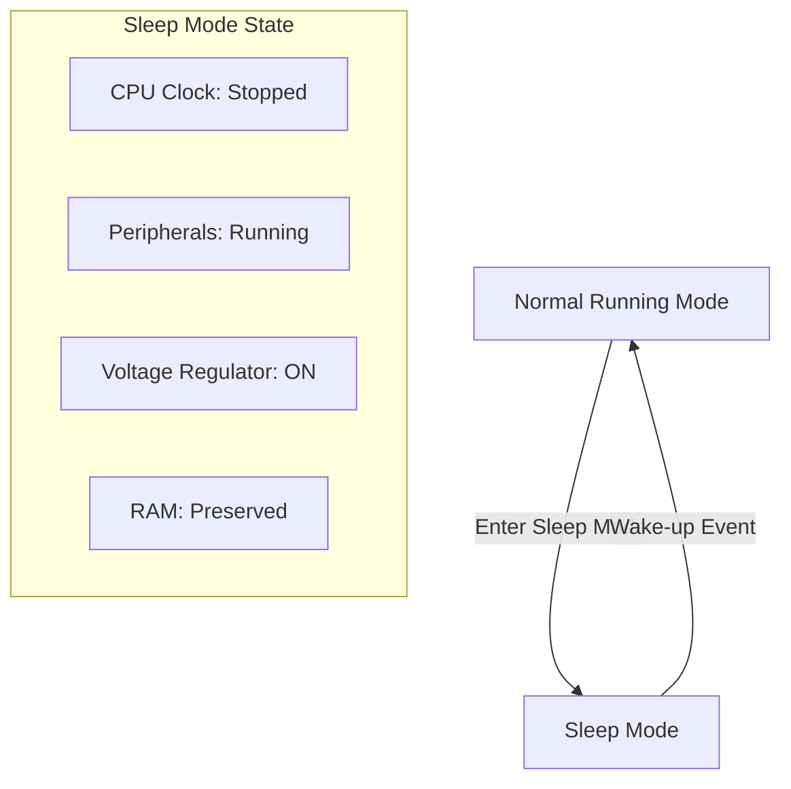

# STM32 Sleep Mode

## Introduction

Power consumption is a critical concern in modern embedded systems, especially for battery-powered devices. The STM32 family of microcontrollers provides several low-power modes that allow developers to significantly extend battery life by reducing power consumption when full processing power is not needed.

Sleep Mode is the first level of low-power operation in STM32 microcontrollers. It offers a good balance between power saving and wake-up time, making it ideal for applications that need to conserve power while still responding quickly to events.

## What is Sleep Mode?

Sleep Mode (also known as Low-power sleep mode) is a power-saving state where the CPU clock is stopped, but peripherals and voltage regulator continue to operate. This results in significant power savings while allowing quick wake-up times.



### Key characteristics of Sleep Mode:

- **CPU is stopped**: The processor core stops executing instructions
- **Peripherals continue to run**: All enabled peripherals can continue to operate
- **Quick wake-up time**: The system can wake up quickly (typically microseconds)
- **Memory contents preserved**: All RAM contents are maintained
- **Power consumption reduction**: Typically reduces current consumption by 50-70% compared to Run mode

## How to Enter Sleep Mode

The STM32 can enter Sleep Mode in two different ways:

1. Using the `__WFI()` (Wait For Interrupt) instruction
2. Using the `__WFE()` (Wait For Event) instruction

Both instructions are available through the CMSIS library.

### Using WFI (Wait For Interrupt)

This is the most common method to enter Sleep Mode. The processor will wake up when an enabled interrupt occurs.

```c
#include "stm32f4xx_hal.h"

void EnterSleepMode_WFI(void)
{
  /* Suspend Tick increment to prevent wakeup by Systick interrupt */
  HAL_SuspendTick();
  
  /* Enter Sleep Mode */
  HAL_PWR_EnterSLEEPMode(PWR_MAINREGULATOR_ON, PWR_SLEEPENTRY_WFI);
  
  /* Resume Tick interrupt */
  HAL_ResumeTick();
}
```

### Using WFE (Wait For Event)

This method puts the processor to sleep until an event occurs. An event can be an interrupt or a signal from the Event Register.

```c
#include "stm32f4xx_hal.h"

void EnterSleepMode_WFE(void)
{
  /* Suspend Tick increment to prevent wakeup by Systick interrupt */
  HAL_SuspendTick();
  
  /* Enter Sleep Mode */
  HAL_PWR_EnterSLEEPMode(PWR_MAINREGULATOR_ON, PWR_SLEEPENTRY_WFE);
  
  /* Resume Tick interrupt */
  HAL_ResumeTick();
}
```

## Waking Up from Sleep Mode

The STM32 can wake up from Sleep Mode in response to any enabled interrupt. Common sources include:

1. External interrupts (EXTI pins)
2. Timer interrupts
3. UART/USART receive interrupts
4. RTC (Real-Time Clock) alarms

Let's see an example that uses an external button to wake up the microcontroller:

```c
#include "stm32f4xx_hal.h"

void ConfigureWakeupButton(void)
{
  GPIO_InitTypeDef GPIO_InitStruct = {0};
  
  /* Enable GPIOA clock */
  __HAL_RCC_GPIOA_CLK_ENABLE();
  
  /* Configure PA0 pin as input with interrupt */
  GPIO_InitStruct.Pin = GPIO_PIN_0;
  GPIO_InitStruct.Mode = GPIO_MODE_IT_RISING;
  GPIO_InitStruct.Pull = GPIO_PULLDOWN;
  HAL_GPIO_Init(GPIOA, &GPIO_InitStruct);
  
  /* Enable EXTI Line0 interrupt */
  HAL_NVIC_SetPriority(EXTI0_IRQn, 0, 0);
  HAL_NVIC_EnableIRQ(EXTI0_IRQn);
}

/* Interrupt handler for EXTI Line0 */
void EXTI0_IRQHandler(void)
{
  HAL_GPIO_EXTI_IRQHandler(GPIO_PIN_0);
}

/* Callback function for EXTI interrupts */
void HAL_GPIO_EXTI_Callback(uint16_t GPIO_Pin)
{
  if(GPIO_Pin == GPIO_PIN_0)
  {
    /* Button was pressed - Add your wake-up code here */
    /* This function is called after waking up from Sleep Mode */
  }
}
```

## Complete Sleep Mode Example

Here's a complete example showing how to use Sleep Mode in a practical application. This program will:
1. Initialize the system and a GPIO pin for an LED
2. Configure a button for wake-up
3. Enter Sleep Mode
4. Toggle the LED when waking up from Sleep Mode

```c
#include "stm32f4xx_hal.h"

/* LED and Button pins definition */
#define LED_PIN GPIO_PIN_5
#define LED_GPIO_PORT GPIOA
#define BUTTON_PIN GPIO_PIN_0
#define BUTTON_GPIO_PORT GPIOA

void SystemClock_Config(void);
void GPIO_Init(void);
void ConfigureWakeupButton(void);
void EnterSleepMode(void);

int main(void)
{
  /* Reset of all peripherals, initialize the Flash interface and the Systick */
  HAL_Init();
  
  /* Configure the system clock */
  SystemClock_Config();
  
  /* Initialize GPIO for LED */
  GPIO_Init();
  
  /* Configure wakeup button */
  ConfigureWakeupButton();
  
  while (1)
  {
    /* Turn LED off before sleep */
    HAL_GPIO_WritePin(LED_GPIO_PORT, LED_PIN, GPIO_PIN_RESET);
    
    /* Enter Sleep Mode */
    EnterSleepMode();
    
    /* When we reach here, the system has woken up */
    
    /* Toggle LED to indicate wake-up */
    HAL_GPIO_TogglePin(LED_GPIO_PORT, LED_PIN);
    
    /* Small delay before going back to sleep */
    HAL_Delay(1000);
  }
}

void GPIO_Init(void)
{
  GPIO_InitTypeDef GPIO_InitStruct = {0};
  
  /* Enable GPIOA clock */
  __HAL_RCC_GPIOA_CLK_ENABLE();
  
  /* Configure LED pin as output */
  GPIO_InitStruct.Pin = LED_PIN;
  GPIO_InitStruct.Mode = GPIO_MODE_OUTPUT_PP;
  GPIO_InitStruct.Pull = GPIO_NOPULL;
  GPIO_InitStruct.Speed = GPIO_SPEED_FREQ_LOW;
  HAL_GPIO_Init(LED_GPIO_PORT, &GPIO_InitStruct);
}

void ConfigureWakeupButton(void)
{
  GPIO_InitTypeDef GPIO_InitStruct = {0};
  
  /* Configure button pin as input with interrupt */
  GPIO_InitStruct.Pin = BUTTON_PIN;
  GPIO_InitStruct.Mode = GPIO_MODE_IT_RISING;
  GPIO_InitStruct.Pull = GPIO_PULLDOWN;
  HAL_GPIO_Init(BUTTON_GPIO_PORT, &GPIO_InitStruct);
  
  /* Enable EXTI Line0 interrupt */
  HAL_NVIC_SetPriority(EXTI0_IRQn, 0, 0);
  HAL_NVIC_EnableIRQ(EXTI0_IRQn);
}

void EnterSleepMode(void)
{
  /* Suspend Tick increment to prevent wakeup by Systick interrupt */
  HAL_SuspendTick();
  
  /* Enter Sleep Mode, wake up on next interrupt */
  HAL_PWR_EnterSLEEPMode(PWR_MAINREGULATOR_ON, PWR_SLEEPENTRY_WFI);
  
  /* Resume Tick interrupt */
  HAL_ResumeTick();
}

/* Interrupt handler for EXTI Line0 */
void EXTI0_IRQHandler(void)
{
  HAL_GPIO_EXTI_IRQHandler(BUTTON_PIN);
}

/* Callback function for EXTI interrupts */
void HAL_GPIO_EXTI_Callback(uint16_t GPIO_Pin)
{
  /* This function is called after waking up from Sleep Mode */
  if(GPIO_Pin == BUTTON_PIN)
  {
    /* Button was pressed - code here executes after wake-up */
  }
}
```

## Real-world Applications

### 1. Battery-powered Sensor Node

For a temperature sensor that only needs to take readings every minute:

```c
void SensorNode_Example(void)
{
  while(1)
  {
    /* Read temperature sensor */
    float temperature = ReadTemperatureSensor();
    
    /* Transmit data */
    SendTemperatureData(temperature);
    
    /* Set RTC alarm to wake up after 60 seconds */
    SetRTCAlarm(60);
    
    /* Enter Sleep Mode until RTC alarm triggers */
    EnterSleepMode();
  }
}
```

### 2. Wearable Fitness Tracker

A fitness tracker can use Sleep Mode when the user is inactive:

```c
void FitnessTracker_Example(void)
{
  while(1)
  {
    /* Check accelerometer for movement */
    if(IsUserInactive())
    {
      /* Configure accelerometer interrupt to wake up on movement */
      ConfigureAccelerometerWakeup();
      
      /* Enter Sleep Mode */
      EnterSleepMode();
      
      /* When we get here, user has moved */
      ResumeNormalOperation();
    }
    
    /* Normal operation - count steps, monitor heart rate, etc. */
    PerformNormalMonitoring();
  }
}
```

## Power Consumption Comparison

Here's an example of power consumption comparison for an STM32F4 microcontroller running at 84 MHz:

| Mode | Current Consumption | Wake-up Time |
|------|---------------------|--------------|
| Run Mode | 45-50 mA | N/A |
| Sleep Mode | 10-15 mA | 2-5 μs |

## Tips for Optimizing Sleep Mode

1. **Disable unnecessary peripherals**: Before entering Sleep Mode, disable any peripherals you don't need to further reduce power consumption.

2. **Consider the Systick**: The Systick timer continues to run in Sleep Mode, causing periodic wake-ups. For longer sleep periods, consider suspending it with `HAL_SuspendTick()`.

3. **Manage wake-up sources**: Only enable the interrupts you need for wake-up to avoid unnecessary waking.

4. **Use the appropriate sleep mode**: If your application can tolerate longer wake-up times, consider deeper low-power modes like Stop or Standby for greater power savings.

5. **Configure the voltage regulator**: For some STM32 families, you can use `PWR_LOWPOWERREGULATOR_ON` instead of `PWR_MAINREGULATOR_ON` to save additional power.

## Common Pitfalls

1. **Forgetting to enable a wake-up source**: If you don't enable at least one interrupt source that can trigger a wake-up, the device will stay in Sleep Mode indefinitely.

2. **Not handling the Systick**: The Systick interrupt can cause the device to wake up frequently, which might not be desired for longer sleep periods.

3. **Not considering peripheral behavior**: Some peripherals may continue to consume power during Sleep Mode. Review your peripheral configuration to minimize power consumption.

## Summary

STM32 Sleep Mode is a valuable feature for reducing power consumption in embedded applications. It offers a good balance between power saving and quick response time, making it suitable for a wide range of applications.

Key takeaways:
- Sleep Mode stops the CPU clock but keeps peripherals running
- You can enter Sleep Mode using either WFI or WFE instructions
- Any enabled interrupt can wake up the system from Sleep Mode
- Sleep Mode typically reduces power consumption by 50-70%
- For deeper power savings, consider using Stop or Standby modes

## Exercises

1. Modify the example code to use a timer interrupt instead of a button to wake up the microcontroller.

2. Create a simple power consumption monitoring system that measures and compares current draw in Run Mode versus Sleep Mode.

3. Implement a project that uses different wake-up sources (button, timer, UART) to exit Sleep Mode and performs different actions based on which source triggered the wake-up.

4. Design a battery-powered weather station that wakes up every hour to take measurements, then returns to Sleep Mode.

## Next Steps

Now that you understand Sleep Mode, you might want to explore:
- STM32 Stop Mode for deeper power savings
- STM32 Standby Mode for minimum power consumption
- Low-power timer (LPTIM) for timing operations during low-power modes
- Power consumption optimization techniques specific to your application