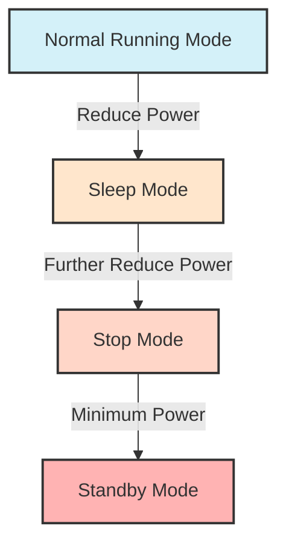

# STM32 RTC in Low Power

## Introduction

The Real-Time Clock (RTC) is a crucial peripheral in STM32 microcontrollers that can significantly enhance power efficiency in embedded applications. When combined with low-power modes, the RTC allows your device to maintain accurate timekeeping while consuming minimal power. This capability is essential for battery-powered devices where extending battery life is a primary concern.

In this tutorial, we'll explore how to configure and use the RTC peripheral in conjunction with STM32's low-power modes to create energy-efficient applications that can run for months or even years on a single battery.

## Understanding the STM32 RTC

The RTC in STM32 microcontrollers is a separate subsystem with its own clock domain. This separation allows the RTC to continue functioning even when the main system clock is disabled, which is what happens in low-power modes.

Key features of the STM32 RTC include:

- Independent power supply domain (Backup domain)
- Ability to operate with an external 32.768 kHz crystal oscillator (LSE)
- Calendar functions (date and time)
- Programmable alarms
- Wakeup timer with programmable intervals
- Timestamp capability
- Battery backup operation

## Low Power Modes Overview

Before diving into RTC configuration, let's briefly review the main low-power modes available on STM32 microcontrollers:



1. **Sleep Mode**: CPU is stopped, peripherals continue running
2. **Stop Mode**: CPU and most peripherals are stopped, but memory content is preserved
3. **Standby Mode**: Lowest power consumption, but only backup registers are preserved

The RTC can operate in all these modes, making it versatile for different power requirements.

## Setting Up the RTC

Let's start by setting up the RTC with the LSE (Low-Speed External) clock source, which is the most power-efficient option.

```c
void RTC_Init(void) {
    // Enable PWR and Backup access
    __HAL_RCC_PWR_CLK_ENABLE();
    HAL_PWR_EnableBkUpAccess();
    
    // Enable LSE Oscillator (32.768 kHz crystal)
    RCC_OscInitTypeDef RCC_OscInitStruct = {0};
    RCC_OscInitStruct.OscillatorType = RCC_OSCILLATORTYPE_LSE;
    RCC_OscInitStruct.LSEState = RCC_LSE_ON;
    RCC_OscInitStruct.PLL.PLLState = RCC_PLL_NONE;
    HAL_RCC_OscConfig(&RCC_OscInitStruct);
    
    // Select LSE as RTC clock source
    RCC_PeriphCLKInitTypeDef PeriphClkInitStruct = {0};
    PeriphClkInitStruct.PeriphClockSelection = RCC_PERIPHCLK_RTC;
    PeriphClkInitStruct.RTCClockSelection = RCC_RTCCLKSOURCE_LSE;
    HAL_RCCEx_PeriphCLKConfig(&PeriphClkInitStruct);
    
    // Enable RTC Clock
    __HAL_RCC_RTC_ENABLE();
    
    // Configure RTC
    RTC_HandleTypeDef RTCHandle = {0};
    RTCHandle.Instance = RTC;
    RTCHandle.Init.HourFormat = RTC_HOURFORMAT_24;
    RTCHandle.Init.AsynchPrediv = 127; // 128 division factor
    RTCHandle.Init.SynchPrediv = 255;  // 256 division factor
    // These division factors will result in a 1Hz clock from the 32.768 kHz LSE
    
    HAL_RTC_Init(&RTCHandle);
    
    // Initialize date and time (optional)
    RTC_DateTypeDef sDate = {0};
    sDate.Year = 0x24;  // 2024 (BCD format)
    sDate.Month = RTC_MONTH_JANUARY;
    sDate.Date = 0x01;
    sDate.WeekDay = RTC_WEEKDAY_MONDAY;
    HAL_RTC_SetDate(&RTCHandle, &sDate, RTC_FORMAT_BCD);
    
    RTC_TimeTypeDef sTime = {0};
    sTime.Hours = 0x00;
    sTime.Minutes = 0x00;
    sTime.Seconds = 0x00;
    sTime.TimeFormat = RTC_HOURFORMAT12_AM;
    HAL_RTC_SetTime(&RTCHandle, &sTime, RTC_FORMAT_BCD);
}
```

This initialization code sets up the RTC with:
- LSE 32.768 kHz crystal as the clock source
- 24-hour format
- Division factors for obtaining a precise 1Hz timebase
- Initial date and time (January 1, 2024, 00:00:00)

## Using RTC Alarm for Low Power Wake-Up

One of the most common uses of RTC in low-power applications is to periodically wake up the microcontroller from a low-power state. Here's how to configure an RTC alarm to wake up the STM32 from Stop mode:

```c
void SetRTCAlarm(uint32_t seconds_from_now) {
    RTC_HandleTypeDef RTCHandle = {0};
    RTCHandle.Instance = RTC;
    
    // Get current time
    RTC_TimeTypeDef sTime = {0};
    RTC_DateTypeDef sDate = {0};
    HAL_RTC_GetTime(&RTCHandle, &sTime, RTC_FORMAT_BIN);
    HAL_RTC_GetDate(&RTCHandle, &sDate, RTC_FORMAT_BIN); // Required after GetTime
    
    // Calculate alarm time
    uint32_t total_seconds = (sTime.Hours * 3600) + (sTime.Minutes * 60) + sTime.Seconds + seconds_from_now;
    uint8_t alarm_hours = (total_seconds / 3600) % 24;
    uint8_t alarm_minutes = (total_seconds / 60) % 60;
    uint8_t alarm_seconds = total_seconds % 60;
    
    // Configure the alarm
    RTC_AlarmTypeDef sAlarm = {0};
    sAlarm.AlarmTime.Hours = alarm_hours;
    sAlarm.AlarmTime.Minutes = alarm_minutes;
    sAlarm.AlarmTime.Seconds = alarm_seconds;
    sAlarm.AlarmTime.SubSeconds = 0;
    sAlarm.AlarmTime.DayLightSaving = RTC_DAYLIGHTSAVING_NONE;
    sAlarm.AlarmTime.StoreOperation = RTC_STOREOPERATION_RESET;
    sAlarm.AlarmMask = RTC_ALARMMASK_DATEWEEKDAY; // Ignore date/weekday
    sAlarm.AlarmSubSecondMask = RTC_ALARMSUBSECONDMASK_ALL;
    sAlarm.AlarmDateWeekDaySel = RTC_ALARMDATEWEEKDAYSEL_DATE;
    sAlarm.AlarmDateWeekDay = 1;
    sAlarm.Alarm = RTC_ALARM_A;
    
    // Set the alarm
    HAL_RTC_DeactivateAlarm(&RTCHandle, RTC_ALARM_A);
    HAL_RTC_SetAlarm_IT(&RTCHandle, &sAlarm, RTC_FORMAT_BIN);
    
    // Enable RTC Alarm interrupt
    HAL_NVIC_SetPriority(RTC_Alarm_IRQn, 0, 0);
    HAL_NVIC_EnableIRQ(RTC_Alarm_IRQn);
}
```

The function above:
1. Gets the current RTC time
2. Calculates a future alarm time based on a specified number of seconds
3. Configures and activates Alarm A with interrupt capability

## Entering Low Power Mode with RTC Wake-Up

Now let's see how to enter Stop mode and let the RTC wake the system up:

```c
void EnterStopModeWithRTCWakeup(uint32_t seconds_until_wakeup) {
    // Set RTC alarm to wake up after specified seconds
    SetRTCAlarm(seconds_until_wakeup);
    
    // Configure wake-up source (RTC Alarm)
    __HAL_PWR_CLEAR_FLAG(PWR_FLAG_WU);
    HAL_PWR_EnableWakeUpPin(PWR_WAKEUP_PIN1);
    
    // Enter Stop mode
    HAL_PWR_EnterSTOPMode(PWR_LOWPOWERREGULATOR_ON, PWR_STOPENTRY_WFI);
    
    // System now enters Stop mode and will wake up when alarm triggers
    
    // Code execution will continue from here after wake-up
    
    // System clock configuration might need to be restored after wake-up
    SystemClock_Config();
}
```

Here's what this function does:
1. Sets up the RTC alarm for the specified time in the future
2. Configures the system to wake up on the RTC alarm
3. Enters Stop mode with the WFI (Wait For Interrupt) instruction
4. After wake-up, restores the system clock configuration

## RTC Alarm Interrupt Handler

When the RTC alarm triggers, the following interrupt handler is called:

```c
void RTC_Alarm_IRQHandler(void) {
    HAL_RTC_AlarmIRQHandler(&RTCHandle);
}

void HAL_RTC_AlarmAEventCallback(RTC_HandleTypeDef *hrtc) {
    // This function is called when the alarm triggers
    // Add your wake-up code here
    
    // For example, set a flag that will be checked in the main loop
    alarm_triggered = 1;
}
```

## Practical Example: Temperature Logger with Low Power

Let's put everything together in a practical example of a temperature logger that wakes up every hour, reads a temperature sensor, stores the reading, and goes back to sleep:

```c
#include "stm32f4xx_hal.h"
#include <stdio.h>
#include <string.h>

RTC_HandleTypeDef RTCHandle;
I2C_HandleTypeDef I2CHandle;

volatile uint8_t alarm_triggered = 0;
float temperature_log[24]; // Store 24 hours of data
uint8_t log_index = 0;

void SystemClock_Config(void);
void Error_Handler(void);
void RTC_Init(void);
void I2C_Init(void);
float ReadTemperature(void);
void SetRTCAlarm(uint32_t seconds_from_now);
void EnterStopModeWithRTCWakeup(uint32_t seconds_until_wakeup);

int main(void) {
    // Initialize HAL Library
    HAL_Init();
    
    // Configure the system clock
    SystemClock_Config();
    
    // Initialize peripherals
    RTC_Init();
    I2C_Init();
    
    // Main application loop
    while (1) {
        // Read temperature
        float temperature = ReadTemperature();
        
        // Store in log
        temperature_log[log_index] = temperature;
        log_index = (log_index + 1) % 24;
        
        // Enter Stop mode and wake up in one hour (3600 seconds)
        EnterStopModeWithRTCWakeup(3600);
        
        // This code will be executed after waking up
        // Reset alarm flag
        alarm_triggered = 0;
    }
}

float ReadTemperature(void) {
    // Implementation for reading temperature from I2C sensor
    // This is a simplified example
    uint8_t data[2];
    HAL_I2C_Mem_Read(&I2CHandle, 0x48 << 1, 0x00, 1, data, 2, 1000);
    
    // Convert raw data to temperature (depends on your specific sensor)
    int16_t raw = (data[0] << 8) | data[1];
    float temperature = raw * 0.0625f; // Example conversion for a specific sensor
    
    return temperature;
}

void HAL_RTC_AlarmAEventCallback(RTC_HandleTypeDef *hrtc) {
    alarm_triggered = 1;
}
```

This example:
1. Initializes the RTC and I2C peripherals
2. In the main loop, reads the temperature and stores it in a circular buffer
3. Enters Stop mode for one hour (3600 seconds)
4. Wakes up when the RTC alarm triggers and repeats the process

## Power Consumption Measurements

To give you an idea of the power savings you can achieve, here are some typical power consumption figures for an STM32F4 microcontroller:

| Mode | Power Consumption |
|------|-------------------|
| Run Mode (80 MHz) | ~40 mA |
| Sleep Mode | ~10 mA |
| Stop Mode | ~5 μA |
| Standby Mode | ~2 μA |

When using the RTC with a 32.768 kHz LSE crystal in Stop mode, the total system power consumption can be as low as 5-10 μA, allowing for years of operation on a single coin cell battery for simple logging applications.

## Tips for Optimizing RTC Power Consumption

1. **Use LSE as clock source**: The Low-Speed External oscillator (32.768 kHz crystal) is the most power-efficient option.

2. **Optimize RTC prescaler values**: Properly configure the synchronous and asynchronous prescalers based on your application needs.

3. **Use RTC Wakeup Timer instead of Alarm** for simpler periodic wake-ups:

```c
void SetRTCWakeUpTimer(uint32_t seconds) {
    HAL_RTCEx_DeactivateWakeUpTimer(&RTCHandle);
    HAL_RTCEx_SetWakeUpTimer_IT(&RTCHandle, seconds, RTC_WAKEUPCLOCK_CK_SPRE_16BITS);
}
```

4. **Minimize wake-up time**: Perform quick operations after wake-up and return to low-power mode as soon as possible.

5. **Use the backup registers**: Store critical data in RTC backup registers to preserve it during power cycles:

```c
// Write to backup register
HAL_RTCEx_BKUPWrite(&RTCHandle, RTC_BKP_DR0, 0x1234);

// Read from backup register
uint32_t value = HAL_RTCEx_BKUPRead(&RTCHandle, RTC_BKP_DR0);
```

## Common Pitfalls and Solutions

1. **RTC not keeping time accurately**: Ensure your LSE crystal has proper load capacitors and PCB layout.

2. **System not waking up**: Check if the RTC interrupt is properly configured and the interrupt flag is being cleared.

3. **Date/Time reset after power cycle**: Make sure your backup domain is powered (by battery if necessary) and backup access is enabled.

4. **High power consumption in Stop mode**: Check for peripherals that might still be active; disable them before entering low-power mode.

## Summary

In this tutorial, we've explored:

- The STM32 RTC peripheral and its features
- Different low-power modes available on STM32 microcontrollers
- How to configure the RTC with the LSE clock for minimum power consumption
- Setting up RTC alarms to wake up from low-power modes
- A practical example of a temperature logger with minimal power consumption

By combining the RTC with STM32's low-power modes, you can create ultra-low-power applications that run for years on battery power. This approach is ideal for IoT sensors, data loggers, wearable devices, and any application where power efficiency is a primary concern.

## Further Learning

To deepen your understanding of STM32 low-power applications with RTC, consider exploring:

1. **RTC Timestamp**: Learn how to capture events with precise timing information
2. **Tamper Detection**: Understand how to detect and respond to tampering attempts
3. **Backup Battery Switching**: Implement automatic switching to backup power for the RTC
4. **Advanced Power Profiling**: Use tools like power analyzers to measure and optimize your application's power consumption

## Exercises

1. Modify the temperature logger example to log data at different intervals during day and night.
2. Implement a power-efficient data transmission system that batches multiple readings before sending them.
3. Create a system that uses both RTC alarm and wakeup timer for different purposes in the same application.
4. Design an ultra-low-power calendar application that shows the date and time on an e-paper display, updating once per minute.