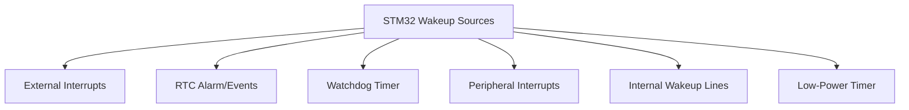

# STM32 Wakeup Sources

## Introduction

When working with battery-powered or energy-efficient applications, putting your STM32 microcontroller into a low-power mode is essential for extending battery life. However, your device still needs to "wake up" at the right time to perform necessary tasks. This is where **wakeup sources** come into play.

Wakeup sources are events or signals that can bring your STM32 microcontroller out of low-power modes back to full operation. Understanding these wakeup sources is crucial for implementing effective power management strategies in your embedded applications.

## Understanding STM32 Low-Power Modes

Before diving into wakeup sources, let's briefly review the low-power modes available in STM32 microcontrollers:

1. **Sleep Mode**: CPU is stopped, peripherals continue running
2. **Stop Mode**: CPU and most clocks are stopped, but memory and register contents are preserved
3. **Standby Mode**: Almost everything is powered down, minimal power consumption, but most context is lost

Each mode offers different power savings and has different wakeup capabilities, so it's important to choose the right combination of low-power mode and wakeup source for your application.

## Available Wakeup Sources

STM32 microcontrollers offer several wakeup sources that can be used to exit low-power modes:



Let's explore each of these wakeup sources in detail.

### 1. External Interrupts (EXTI)

External interrupts can wake the device from Sleep, Stop, and some can even wake it from Standby mode. They include:

- **GPIO pins**: Configured as external interrupt sources
- **EXTI lines**: Dedicated interrupt lines that can be connected to various sources

#### Example: Waking from Sleep Mode with a Button Press

```c
#include "stm32f4xx_hal.h"

void configureSleepModeWithButtonWakeup(void) {
    GPIO_InitTypeDef GPIO_InitStruct = {0};
    
    // Enable GPIOA clock
    __HAL_RCC_GPIOA_CLK_ENABLE();
    
    // Configure PA0 as input with pull-up (connected to button)
    GPIO_InitStruct.Pin = GPIO_PIN_0;
    GPIO_InitStruct.Mode = GPIO_MODE_IT_FALLING;  // Interrupt on falling edge
    GPIO_InitStruct.Pull = GPIO_PULLUP;
    HAL_GPIO_Init(GPIOA, &GPIO_InitStruct);
    
    // Enable EXTI Line0 interrupt
    HAL_NVIC_SetPriority(EXTI0_IRQn, 0, 0);
    HAL_NVIC_EnableIRQ(EXTI0_IRQn);
}

// Button interrupt handler
void EXTI0_IRQHandler(void) {
    HAL_GPIO_EXTI_IRQHandler(GPIO_PIN_0);
}

// Callback function called after interrupt is processed
void HAL_GPIO_EXTI_Callback(uint16_t GPIO_Pin) {
    if (GPIO_Pin == GPIO_PIN_0) {
        // Button was pressed, device is now awake
        // Add code to handle wake-up event
    }
}

void enterSleepMode(void) {
    // Enter Sleep mode
    HAL_SuspendTick();  // Suspend SysTick to prevent immediate wake-up
    HAL_PWR_EnterSLEEPMode(PWR_MAINREGULATOR_ON, PWR_SLEEPENTRY_WFI);
    HAL_ResumeTick();   // Resume SysTick after waking up
}
```

### 2. Real-Time Clock (RTC)

The RTC can generate alarms, wakeup events, and timestamps that can wake the microcontroller from Sleep, Stop, or Standby modes. This is particularly useful for time-based wakeup requirements.

#### Example: Waking from Stop Mode with RTC Alarm

```c
#include "stm32f4xx_hal.h"

void configureRTCWakeup(void) {
    RTC_HandleTypeDef hrtc;
    RTC_AlarmTypeDef sAlarm;
    
    // Enable RTC clock
    __HAL_RCC_RTC_ENABLE();
    
    // Initialize RTC
    hrtc.Instance = RTC;
    hrtc.Init.HourFormat = RTC_HOURFORMAT_24;
    hrtc.Init.AsynchPrediv = 127;
    hrtc.Init.SynchPrediv = 255;
    HAL_RTC_Init(&hrtc);
    
    // Set alarm to wake up after 10 seconds
    sAlarm.AlarmTime.Hours = 0;
    sAlarm.AlarmTime.Minutes = 0;
    sAlarm.AlarmTime.Seconds = 10;
    sAlarm.AlarmTime.SubSeconds = 0;
    sAlarm.AlarmTime.DayLightSaving = RTC_DAYLIGHTSAVING_NONE;
    sAlarm.AlarmTime.StoreOperation = RTC_STOREOPERATION_RESET;
    sAlarm.AlarmMask = RTC_ALARMMASK_DATEWEEKDAY;
    sAlarm.AlarmSubSecondMask = RTC_ALARMSUBSECONDMASK_ALL;
    sAlarm.AlarmDateWeekDaySel = RTC_ALARMDATEWEEKDAYSEL_DATE;
    sAlarm.AlarmDateWeekDay = 1;
    sAlarm.Alarm = RTC_ALARM_A;
    HAL_RTC_SetAlarm_IT(&hrtc, &sAlarm, RTC_FORMAT_BIN);
    
    // Enable RTC Alarm A Interrupt
    HAL_NVIC_SetPriority(RTC_Alarm_IRQn, 0, 0);
    HAL_NVIC_EnableIRQ(RTC_Alarm_IRQn);
}

// RTC Alarm interrupt handler
void RTC_Alarm_IRQHandler(void) {
    RTC_HandleTypeDef hrtc;
    HAL_RTC_AlarmIRQHandler(&hrtc);
}

// Callback function called after alarm interrupt is processed
void HAL_RTC_AlarmAEventCallback(RTC_HandleTypeDef *hrtc) {
    // RTC alarm occurred, device is now awake
    // Add code to handle wake-up event
}

void enterStopMode(void) {
    // Enter Stop mode
    HAL_PWR_EnterSTOPMode(PWR_LOWPOWERREGULATOR_ON, PWR_STOPENTRY_WFI);
    
    // After waking up, reconfigure system clock if needed
    SystemClock_Config();
}
```

### 3. Independent Watchdog (IWDG)

The independent watchdog can wake up the device from Sleep and Stop modes. It's typically used as a safety feature to detect and recover from software failures.

#### Example: IWDG Configuration

```c
#include "stm32f4xx_hal.h"

void configureWatchdogWakeup(void) {
    IWDG_HandleTypeDef hiwdg;
    
    // Initialize IWDG with ~4 second timeout
    // IWDG clock = LSI (~32 kHz) / 32 = 1 kHz
    // Reload value = 4095, giving timeout of ~4.095 seconds
    hiwdg.Instance = IWDG;
    hiwdg.Init.Prescaler = IWDG_PRESCALER_32;
    hiwdg.Init.Reload = 4095;
    HAL_IWDG_Init(&hiwdg);
}

void refreshWatchdog(void) {
    // Must call this function regularly to prevent watchdog reset
    HAL_IWDG_Refresh(&IWDG_Handle);
}
```

### 4. Peripheral Interrupts

Many STM32 peripherals can generate interrupts that wake the device from Sleep mode. These include:

- UART/USART when receiving data
- I2C when addressed as a slave
- SPI when receiving data
- ADC when conversion completes
- Timer events

#### Example: UART Wakeup from Sleep Mode

```c
#include "stm32f4xx_hal.h"

UART_HandleTypeDef huart2;

void configureUARTWakeup(void) {
    // Initialize UART2
    huart2.Instance = USART2;
    huart2.Init.BaudRate = 9600;
    huart2.Init.WordLength = UART_WORDLENGTH_8B;
    huart2.Init.StopBits = UART_STOPBITS_1;
    huart2.Init.Parity = UART_PARITY_NONE;
    huart2.Init.Mode = UART_MODE_TX_RX;
    huart2.Init.HwFlowCtl = UART_HWCONTROL_NONE;
    huart2.Init.OverSampling = UART_OVERSAMPLING_16;
    HAL_UART_Init(&huart2);
    
    // Enable UART receive interrupt
    HAL_UART_Receive_IT(&huart2, buffer, 1);
    
    // Enable USART2 interrupts
    HAL_NVIC_SetPriority(USART2_IRQn, 0, 0);
    HAL_NVIC_EnableIRQ(USART2_IRQn);
}

// UART interrupt handler
void USART2_IRQHandler(void) {
    HAL_UART_IRQHandler(&huart2);
}

// Callback function called after receiving data
void HAL_UART_RxCpltCallback(UART_HandleTypeDef *huart) {
    if (huart->Instance == USART2) {
        // Data received, device is now awake
        // Process the received data
        
        // Restart the interrupt-based UART reception for next byte
        HAL_UART_Receive_IT(&huart2, buffer, 1);
    }
}
```

### 5. Low-Power Timer (LPTIM)

STM32 microcontrollers often include a Low-Power Timer (LPTIM) specifically designed to operate in low-power modes. It can wake the device from Stop mode with very low power consumption.

#### Example: LPTIM Wakeup from Stop Mode

```c
#include "stm32l4xx_hal.h"  // Example for STM32L4 series

LPTIM_HandleTypeDef hlptim;

void configureLPTIMWakeup(void) {
    // Enable LPTIM clock
    __HAL_RCC_LPTIM1_CLK_ENABLE();
    
    // Configure LPTIM
    hlptim.Instance = LPTIM1;
    hlptim.Init.Clock.Source = LPTIM_CLOCKSOURCE_APBCLOCK_LPOSC;
    hlptim.Init.Clock.Prescaler = LPTIM_PRESCALER_DIV16;  // LSI/16
    hlptim.Init.Trigger.Source = LPTIM_TRIGSOURCE_SOFTWARE;
    hlptim.Init.OutputPolarity = LPTIM_OUTPUTPOLARITY_HIGH;
    hlptim.Init.UpdateMode = LPTIM_UPDATE_IMMEDIATE;
    hlptim.Init.CounterSource = LPTIM_COUNTERSOURCE_INTERNAL;
    HAL_LPTIM_Init(&hlptim);
    
    // Enable LPTIM1 interrupt
    HAL_NVIC_SetPriority(LPTIM1_IRQn, 0, 0);
    HAL_NVIC_EnableIRQ(LPTIM1_IRQn);
}

void startLPTIMWakeupTimer(uint16_t timeout) {
    // Start timer in interrupt mode
    HAL_LPTIM_TimeOut_Start_IT(&hlptim, 0xFFFF, timeout);
}

// LPTIM interrupt handler
void LPTIM1_IRQHandler(void) {
    HAL_LPTIM_IRQHandler(&hlptim);
}

// Callback function called after timeout
void HAL_LPTIM_CompareMatchCallback(LPTIM_HandleTypeDef *hlptim) {
    // LPTIM timeout occurred, device is now awake
    // Add code to handle wake-up event
}
```

## Choosing the Right Wakeup Source

Each wakeup source has different characteristics that make it suitable for different applications:

| Wakeup Source | Sleep Mode | Stop Mode | Standby Mode | Typical Use Case |
|---------------|------------|-----------|--------------|------------------|
| External Interrupts | ✅ | ✅ | ✅ (WKUP pins) | User input, sensor triggers |
| RTC Alarms | ✅ | ✅ | ✅ | Time-based wakeup, periodic tasks |
| Watchdog | ✅ | ✅ | ❌ | System monitoring |
| Peripheral Interrupts | ✅ | ❌ | ❌ | Communication interfaces |
| LPTIM | ✅ | ✅ | ❌ | Ultra-low power timing |

When choosing a wakeup source, consider:

1. **Power consumption**: Different wakeup sources consume different amounts of power
2. **Response time**: How quickly do you need to wake up?
3. **Reliability**: Some wakeup sources are more reliable than others
4. **Complexity**: Some wakeup sources require more complex configuration

## Practical Application Example: Battery-Powered Weather Station

Let's develop a practical example of a battery-powered weather station that uses different low-power modes and wakeup sources:

```c
#include "stm32l4xx_hal.h"

// Global variables
RTC_HandleTypeDef hrtc;
ADC_HandleTypeDef hadc1;
uint8_t alertMode = 0;
float temperature = 0.0f;

void SystemClock_Config(void);
void Error_Handler(void);

int main(void) {
    // Initialize HAL
    HAL_Init();
    
    // Configure system clock
    SystemClock_Config();
    
    // Initialize peripherals
    initGPIO();
    initRTC();
    initADC();
    initExternalWakeup();
    
    // Main loop
    while (1) {
        // Take temperature measurement
        temperature = readTemperature();
        
        // Check for alert conditions
        if (temperature > 30.0f && !alertMode) {
            // Temperature too high, enable alerting
            alertMode = 1;
            setupAlertMode();
        } else if (temperature <= 28.0f && alertMode) {
            // Temperature back to normal, disable alerting
            alertMode = 0;
            disableAlertMode();
        }
        
        // Send data (simplified, would be via radio/BLE/etc.)
        sendData(temperature);
        
        // Enter low power mode
        if (alertMode) {
            // In alert mode, use sleep mode to wake up faster
            HAL_PWR_EnterSLEEPMode(PWR_MAINREGULATOR_ON, PWR_SLEEPENTRY_WFI);
        } else {
            // Normal mode, use Stop mode for better power savings
            // Wake up every 10 minutes
            setRTCWakeupTimer(10 * 60);
            HAL_PWR_EnterSTOPMode(PWR_LOWPOWERREGULATOR_ON, PWR_STOPENTRY_WFI);
            // Reconfigure clocks after waking up
            SystemClock_Config();
        }
    }
}

void initExternalWakeup(void) {
    GPIO_InitTypeDef GPIO_InitStruct = {0};
    
    // Configure PA0 as external wakeup pin (for user button)
    __HAL_RCC_GPIOA_CLK_ENABLE();
    GPIO_InitStruct.Pin = GPIO_PIN_0;
    GPIO_InitStruct.Mode = GPIO_MODE_IT_RISING;
    GPIO_InitStruct.Pull = GPIO_PULLDOWN;
    HAL_GPIO_Init(GPIOA, &GPIO_InitStruct);
    
    // Enable EXTI interrupt
    HAL_NVIC_SetPriority(EXTI0_IRQn, 0, 0);
    HAL_NVIC_EnableIRQ(EXTI0_IRQn);
}

void initRTC(void) {
    // Initialize RTC for alarm and wakeup
    hrtc.Instance = RTC;
    hrtc.Init.HourFormat = RTC_HOURFORMAT_24;
    hrtc.Init.AsynchPrediv = 127;
    hrtc.Init.SynchPrediv = 255;
    hrtc.Init.OutPut = RTC_OUTPUT_DISABLE;
    HAL_RTC_Init(&hrtc);
}

void setRTCWakeupTimer(uint32_t seconds) {
    // Configure RTC wakeup timer
    HAL_RTCEx_SetWakeUpTimer_IT(&hrtc, seconds, RTC_WAKEUPCLOCK_CK_SPRE_16BITS);
}

void setupAlertMode(void) {
    // Configure timer for faster wakeup (every 30 seconds)
    setRTCWakeupTimer(30);
    
    // Enable LED blinking
    HAL_GPIO_WritePin(GPIOA, GPIO_PIN_5, GPIO_PIN_SET);
}

void disableAlertMode(void) {
    // Disable LED
    HAL_GPIO_WritePin(GPIOA, GPIO_PIN_5, GPIO_PIN_RESET);
}

float readTemperature(void) {
    uint32_t adcValue;
    
    // Start ADC conversion
    HAL_ADC_Start(&hadc1);
    HAL_ADC_PollForConversion(&hadc1, 100);
    adcValue = HAL_ADC_GetValue(&hadc1);
    HAL_ADC_Stop(&hadc1);
    
    // Convert ADC value to temperature (simplified)
    return (float)adcValue * 0.1f;
}

void sendData(float temperature) {
    // Simplified - in reality, would send data via radio/BLE/etc.
    char buffer[50];
    sprintf(buffer, "Temperature: %.1f C\r
", temperature);
    // HAL_UART_Transmit or other communication method would be here
}

// External interrupt handler
void EXTI0_IRQHandler(void) {
    HAL_GPIO_EXTI_IRQHandler(GPIO_PIN_0);
}

// Callback for external interrupt
void HAL_GPIO_EXTI_Callback(uint16_t GPIO_Pin) {
    if (GPIO_Pin == GPIO_PIN_0) {
        // Button pressed, user interaction
        // Could toggle modes, force a reading, etc.
    }
}

// RTC wakeup interrupt handler
void RTC_WKUP_IRQHandler(void) {
    HAL_RTCEx_WakeUpTimerIRQHandler(&hrtc);
}

// Callback for RTC wakeup
void HAL_RTCEx_WakeUpTimerEventCallback(RTC_HandleTypeDef *hrtc) {
    // RTC wakeup occurred
    // No specific action needed as main loop will handle measurements
}
```

This example demonstrates several wakeup sources:
1. **RTC Wakeup Timer**: For regular measurements (every 10 minutes in normal mode, every 30 seconds in alert mode)
2. **External Interrupt**: For user interaction via a button
3. **System transitions**: Between Sleep and Stop modes based on environmental conditions

## Best Practices for Using Wakeup Sources

1. **Minimize False Wakeups**: Configure interrupts carefully to avoid unwanted wakeups
2. **Debounce Inputs**: For physical button/switch inputs, implement debouncing to prevent multiple wakeups
3. **Handle Clock Reconfiguration**: After waking from Stop or Standby modes, reconfigure system clocks if needed
4. **Clear Interrupt Flags**: Always clear interrupt flags after handling wakeup events
5. **Consider Power Consumption**: Choose the most power-efficient wakeup source for your application
6. **Test Thoroughly**: Verify that your wakeup configurations work reliably across different conditions

## Troubleshooting Common Issues

1. **Device Not Waking Up**:
   - Check if interrupt flags are properly cleared
   - Verify interrupt priorities are correctly set
   - Ensure the chosen wakeup source is compatible with your low-power mode

2. **Unexpected Wakeups**:
   - Check for floating inputs that might trigger interrupts
   - Verify proper pull-up/pull-down resistor configurations
   - Check for noise on external interrupt lines

3. **Inconsistent Behavior**:
   - Some peripherals might need specific clock configurations to work in low-power modes
   - Voltage regulator settings can affect wakeup behavior
   - Remember that Stop and Standby modes may reset some peripherals

## Summary

STM32 microcontrollers offer a variety of wakeup sources that can be used to exit different low-power modes. The choice of wakeup source depends on your application's requirements for power consumption, response time, and functionality.

Key points to remember:
- External interrupts can wake from most low-power modes
- RTC alarms and wakeup timers provide time-based wakeup capabilities
- Peripheral interrupts like UART and I2C can wake from Sleep mode
- The Low-Power Timer (LPTIM) provides an efficient wakeup source for Stop mode
- Different wakeup sources are compatible with different low-power modes

By strategically combining low-power modes with appropriate wakeup sources, you can significantly extend battery life in your STM32-based applications while maintaining the required functionality.

## Additional Resources

- STM32 Low-Power Modes (previous section in this tutorial)
- STM32 RTC Configuration
- STM32 Interrupt Handling
- STM32 Power Management API Reference

## Exercises

1. Configure an STM32 development board to enter Stop mode and wake up using a button press.
2. Implement a power-efficient data logger that wakes up every minute to take sensor readings.
3. Create a system that normally stays in Standby mode and only wakes up when an alarm condition is detected.
4. Measure and compare the power consumption of different wakeup sources in your application.
5. Implement debouncing for button inputs to prevent multiple wakeups from a single press.