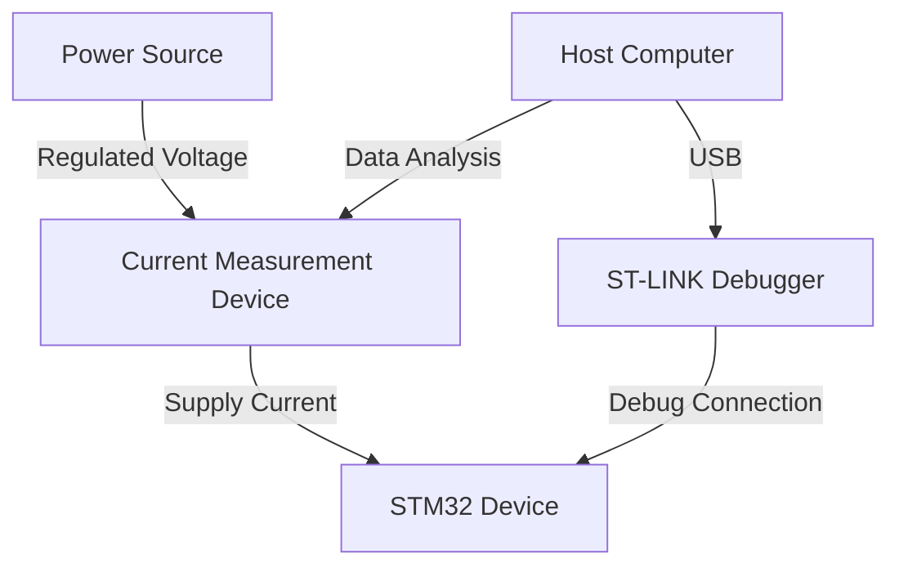

# STM32 Power Debugging

## Introduction

Power debugging is a critical aspect of embedded systems development, especially for battery-powered applications where energy efficiency directly impacts product viability. In this guide, we'll explore how to analyze, measure, and optimize power consumption in STM32 microcontrollers.

Unlike traditional debugging that focuses on program flow and logic errors, power debugging concentrates on identifying energy inefficiencies. These inefficiencies might not affect functionality but can dramatically reduce battery life and system reliability.

## Why Power Debugging Matters

Battery-powered STM32 applications require careful power management to:

- Extend battery life
- Reduce heat generation
- Improve overall system reliability
- Meet product power specifications
- Enable new use cases (like energy harvesting)

## Required Tools for Power Debugging

### Hardware Tools

1. **Digital Multimeter (DMM)**
   - For basic current measurements
   - Limitations: Can't capture dynamic current behavior

2. **Power Analyzer**
   - Purpose-built instruments for power measurement
   - Examples: Keysight N6705C, Qoitech Otii Arc

3. **Oscilloscope with Current Probe**
   - For visualizing current consumption over time
   - Can detect short power spikes

4. **ST-LINK with Power Monitoring**
   - Many newer STM32 development boards include this feature
   - Integrates with STM32CubeMonitor-Power

5. **X-NUCLEO-LPM01A**
   - ST's dedicated low-power measurement expansion board
   - Measures current from 100nA to 50mA

### Software Tools

1. **STM32CubeMonitor-Power**
   - ST's power consumption analysis tool
   - Provides real-time visualization and profiling

2. **STM32CubeMX Power Calculator**
   - Estimates theoretical power consumption
   - Helps during design phase

3. **Logic Analyzer**
   - For correlating power consumption with program execution
   - Debug pins can be toggled to mark events

## Basic Power Measurement Setup

Here's a basic setup for measuring STM32 power consumption:



### Code Example: Setting Up Debug Pins

When debugging power issues, it's helpful to toggle GPIO pins at key points in your code:

```c
// At the start of your program
#define DEBUG_PIN  GPIO_PIN_5
#define DEBUG_PORT GPIOA

// In your initialization code
void ConfigureDebugPin(void) {
  GPIO_InitTypeDef GPIO_InitStruct = {0};
  
  // Enable clock for debug port
  __HAL_RCC_GPIOA_CLK_ENABLE();
  
  // Configure debug pin
  GPIO_InitStruct.Pin = DEBUG_PIN;
  GPIO_InitStruct.Mode = GPIO_MODE_OUTPUT_PP;
  GPIO_InitStruct.Pull = GPIO_NOPULL;
  GPIO_InitStruct.Speed = GPIO_SPEED_FREQ_LOW; // Use low speed to minimize power impact
  HAL_GPIO_Init(DEBUG_PORT, &GPIO_InitStruct);
}

// Use these macros to mark code sections
#define POWER_DEBUG_START() HAL_GPIO_WritePin(DEBUG_PORT, DEBUG_PIN, GPIO_PIN_SET)
#define POWER_DEBUG_STOP()  HAL_GPIO_WritePin(DEBUG_PORT, DEBUG_PIN, GPIO_PIN_RESET)
```

Now you can mark sections of code for power analysis:

```c
void SensorReadProcess(void) {
  POWER_DEBUG_START(); // Mark start of sensor reading
  
  // Sensor reading operations
  SensorWakeup();
  SensorReadData();
  SensorSleep();
  
  POWER_DEBUG_STOP(); // Mark end of sensor reading
}
```

## Common Power Issues and Solutions

### 1. High Sleep Current

**Symptoms:**
- Device consumes too much power in sleep modes
- Battery drains quickly even when the system is idle

**Debugging Steps:**

1. Verify proper low-power mode configuration
2. Check peripherals are properly disabled
3. Ensure all unused GPIOs have proper configuration

**Example Code: Proper GPIO Configuration**

```c
void ConfigureUnusedGPIOs(void) {
  GPIO_InitTypeDef GPIO_InitStruct = {0};
  
  // Enable all GPIO clocks (needed to configure them)
  __HAL_RCC_GPIOA_CLK_ENABLE();
  __HAL_RCC_GPIOB_CLK_ENABLE();
  // ... enable other GPIO ports as needed
  
  // Configure all pins as analog inputs (lowest power state)
  GPIO_InitStruct.Pin = GPIO_PIN_All;
  GPIO_InitStruct.Mode = GPIO_MODE_ANALOG;
  GPIO_InitStruct.Pull = GPIO_NOPULL;
  
  HAL_GPIO_Init(GPIOA, &GPIO_InitStruct);
  HAL_GPIO_Init(GPIOB, &GPIO_InitStruct);
  // ... configure other GPIO ports as needed
  
  // Disable GPIO clocks after configuration
  __HAL_RCC_GPIOA_CLK_DISABLE();
  __HAL_RCC_GPIOB_CLK_DISABLE();
  // ... disable other GPIO clocks
}
```

### 2. Unexpected Wake-ups

**Symptoms:**
- Device wakes up when it shouldn't
- Intermittent power spikes visible on analyzer

**Debugging Steps:**

1. Monitor wake-up sources
2. Use debug pins to identify the source
3. Review interrupt configurations

**Example Code: Tracking Wake-up Sources**

```c
// In the interrupt handlers or wake-up code
volatile uint32_t wakeup_count_rtc = 0;
volatile uint32_t wakeup_count_ext = 0;

void HAL_RTCEx_WakeUpTimerEventCallback(RTC_HandleTypeDef *hrtc) {
  wakeup_count_rtc++;
  
  POWER_DEBUG_START();
  // Process RTC wake-up
  POWER_DEBUG_STOP();
}

void HAL_GPIO_EXTI_Callback(uint16_t GPIO_Pin) {
  wakeup_count_ext++;
  
  POWER_DEBUG_START();
  // Process external wake-up
  POWER_DEBUG_STOP();
}
```

### 3. Peripheral Power Drain

**Symptoms:**
- Higher than expected power consumption
- Power remains high after operations should be complete

**Debugging Approach:**

1. Isolate peripherals by enabling/disabling them one by one
2. Use STM32CubeMonitor-Power to correlate peripheral activity
3. Check for proper peripheral clock gating

**Example: ADC Power Optimization**

```c
void OptimizedADC_Measure(void) {
  // Enable ADC clock only when needed
  __HAL_RCC_ADC1_CLK_ENABLE();
  
  POWER_DEBUG_START();
  
  // Configure ADC
  // ...
  
  // Perform measurement
  HAL_ADC_Start(&hadc1);
  HAL_ADC_PollForConversion(&hadc1, 100);
  uint32_t value = HAL_ADC_GetValue(&hadc1);
  HAL_ADC_Stop(&hadc1);
  
  POWER_DEBUG_STOP();
  
  // Disable ADC clock when not in use
  __HAL_RCC_ADC1_CLK_DISABLE();
  
  // Process value
  // ...
}
```

## Using STM32CubeMonitor-Power

STM32CubeMonitor-Power is a valuable tool for visualizing power consumption. Here's how to use it effectively:

1. **Initial Setup**
   - Connect your ST-LINK with power monitoring features
   - Install and launch STM32CubeMonitor-Power
   - Configure your board settings

2. **Basic Measurement**
   - Start recording
   - Observe current consumption in different states
   - Use markers to identify code sections

3. **Advanced Analysis**
   - Create power profiles for different scenarios
   - Compare optimization results
   - Export data for reporting

## Practical Example: Weather Station Node

Let's analyze a practical example of a weather station sensor node that wakes up periodically, takes measurements, and transmits data.

**Initial Power Profile:**

| State             | Current  | Duration | Energy    |
|-------------------|----------|----------|-----------|
| Sleep             | 5 μA     | 59.5 s   | 297.5 μJ  |
| Wake-up           | 8 mA     | 10 ms    | 80 μJ     |
| Sensor Reading    | 15 mA    | 200 ms   | 3000 μJ   |
| Data Transmission | 25 mA    | 300 ms   | 7500 μJ   |
| Total (1 minute)  | -        | 60 s     | 10877.5 μJ|

**Power Debugging Steps:**

1. **Identify the highest energy consumers**
   - Data transmission uses 69% of energy
   - Sensor reading uses 27.5% of energy

2. **Optimize sensor reading**
   - Only power sensors when needed
   - Lower ADC clock speed

3. **Optimize data transmission**
   - Compress data before sending
   - Use lower transmission power when possible

**Code Example: Optimized Sensor Node**

```c
void OptimizedWeatherStation(void) {
  // 1. Wake up from STOP mode
  POWER_DEBUG_START(); // Mark wake-up
  SystemClock_Config(); // Restore clocks
  POWER_DEBUG_STOP();
  
  // 2. Power up and read sensors with clock optimization
  POWER_DEBUG_START(); // Mark sensor reading
  
  // Only enable required clocks
  __HAL_RCC_ADC1_CLK_ENABLE();
  __HAL_RCC_I2C1_CLK_ENABLE();
  
  // Read sensors
  float temperature = ReadTemperature();
  float humidity = ReadHumidity();
  float pressure = ReadPressure();
  
  // Disable peripheral clocks
  __HAL_RCC_ADC1_CLK_DISABLE();
  __HAL_RCC_I2C1_CLK_DISABLE();
  
  POWER_DEBUG_STOP();
  
  // 3. Process and compress data
  POWER_DEBUG_START(); // Mark data processing
  uint8_t dataPacket[8];
  CompressWeatherData(temperature, humidity, pressure, dataPacket);
  POWER_DEBUG_STOP();
  
  // 4. Transmit data with power optimization
  POWER_DEBUG_START(); // Mark transmission
  
  // Enable radio clock
  __HAL_RCC_SPI1_CLK_ENABLE();
  
  // Calculate distance to gateway and adjust power
  uint8_t txPower = CalculateOptimalTxPower();
  ConfigureRadioTxPower(txPower);
  
  // Transmit data
  TransmitData(dataPacket, sizeof(dataPacket));
  
  // Disable radio clock
  __HAL_RCC_SPI1_CLK_DISABLE();
  
  POWER_DEBUG_STOP();
  
  // 5. Prepare for sleep
  POWER_DEBUG_START(); // Mark sleep preparation
  
  // Configure wake-up timer
  ConfigureRTCWakeUp(60); // Wake up in 60 seconds
  
  // Enter STOP mode
  EnterSTOPMode();
  
  POWER_DEBUG_STOP();
}
```

**Optimized Power Profile:**

| State             | Current  | Duration | Energy    | Savings |
|-------------------|----------|----------|-----------|---------|
| Sleep             | 2 μA     | 59.5 s   | 119 μJ    | 60%     |
| Wake-up           | 8 mA     | 10 ms    | 80 μJ     | 0%      |
| Sensor Reading    | 10 mA    | 150 ms   | 1500 μJ   | 50%     |
| Data Transmission | 20 mA    | 200 ms   | 4000 μJ   | 47%     |
| Total (1 minute)  | -        | 60 s     | 5699 μJ   | 48%     |

## Advanced Power Debugging Techniques

### 1. Power State Correlation

Correlate power states with program execution:

```c
typedef enum {
  POWER_STATE_SLEEP,
  POWER_STATE_SENSOR,
  POWER_STATE_PROCESS,
  POWER_STATE_TRANSMIT
} PowerState_t;

void LogPowerState(PowerState_t state) {
  // Set specific debug pins for each state
  switch(state) {
    case POWER_STATE_SLEEP:
      HAL_GPIO_WritePin(DEBUG_PORT, DEBUG_PIN_0, GPIO_PIN_RESET);
      HAL_GPIO_WritePin(DEBUG_PORT, DEBUG_PIN_1, GPIO_PIN_RESET);
      break;
    case POWER_STATE_SENSOR:
      HAL_GPIO_WritePin(DEBUG_PORT, DEBUG_PIN_0, GPIO_PIN_SET);
      HAL_GPIO_WritePin(DEBUG_PORT, DEBUG_PIN_1, GPIO_PIN_RESET);
      break;
    // ... other states
  }
}
```

### 2. Frequency Scaling

Dynamically adjust clock speed for better efficiency:

```c
void OptimizeCPUFrequency(ProcessingLoad_t load) {
  switch(load) {
    case LOAD_LOW:
      // Set system clock to 8 MHz
      SetSystemClock_8MHz();
      break;
    case LOAD_MEDIUM:
      // Set system clock to 24 MHz
      SetSystemClock_24MHz();
      break;
    case LOAD_HIGH:
      // Set system clock to 80 MHz
      SetSystemClock_80MHz();
      break;
  }
}
```

### 3. Power Profiling with UART Logging

Use low-power intervals for logging:

```c
void LogPowerProfile(void) {
  static uint32_t counter = 0;
  static uint32_t lastWakeTime = 0;
  
  uint32_t currentTime = HAL_GetTick();
  uint32_t sleepDuration = currentTime - lastWakeTime;
  
  // Enable UART only when needed
  __HAL_RCC_USART2_CLK_ENABLE();
  
  printf("Wake #%lu: Slept for %lu ms, Battery: %lu mV\r
", 
         counter++, sleepDuration, ReadBatteryVoltage());
  
  // Disable UART when not in use
  __HAL_RCC_USART2_CLK_DISABLE();
  
  lastWakeTime = currentTime;
}
```

## Power Debugging Workflow

Follow this systematic approach to debug power issues:

1. **Establish a baseline**
   - Measure current in all operating modes
   - Document expected values

2. **Identify anomalies**
   - Look for unexpected current peaks
   - Check for higher than expected sleep current

3. **Isolate the cause**
   - Disable peripherals one by one
   - Use debug pins to correlate code execution

4. **Optimize**
   - Implement fixes based on findings
   - Validate improvements with measurements

5. **Document**
   - Create power budgets for various scenarios
   - Document optimizations for future reference

## Summary

Power debugging is an essential skill for STM32 developers working on battery-powered applications. By following a systematic approach and using the right tools, you can identify and solve power consumption issues effectively.

Remember these key points:

1. Use appropriate measurement tools for your application
2. Configure your device properly for low-power operation
3. Use debug pins to correlate code execution with power consumption
4. Optimize peripheral usage and clock configurations
5. Document your power budgets and optimizations

## Exercises

1. Set up a basic power measurement for an STM32 development board
2. Measure the current consumption in different sleep modes
3. Use debug pins to measure the duration and power consumption of an I2C sensor reading
4. Optimize a periodic wake-up application to minimize power consumption
5. Create a power budget for a battery-powered application

## Additional Resources

- STMicroelectronics Application Notes:
  - AN4365: Ultra-low-power features of STM32 MCUs
  - AN4621: STM32 sleep modes and energy-saving features
  
- STM32CubeMX and STM32CubeMonitor-Power documentation

- STM32 Low-Power Timer (LPTIM) documentation

- Hardware:
  - X-NUCLEO-LPM01A (STM32 low-power measurement expansion board)
  - Power Profiler Kit II from Nordic Semiconductor (works well with STM32)