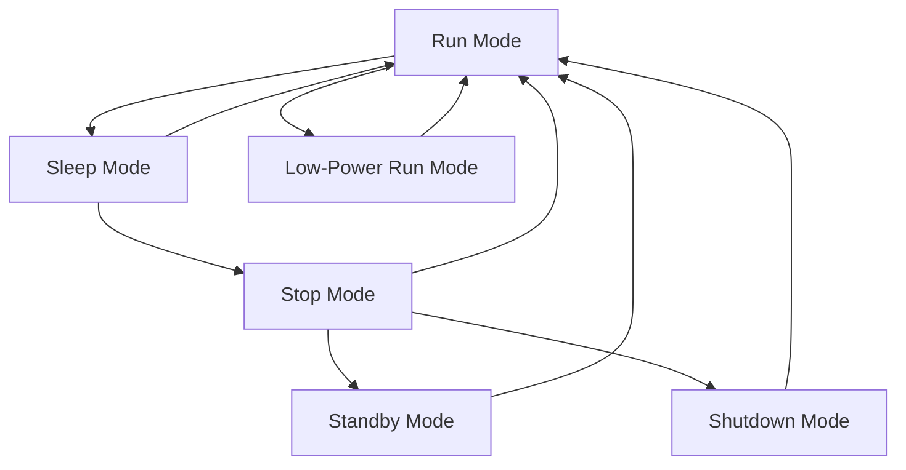

# STM32 Low Power Best Practices

## Introduction

Power consumption is a critical factor in many embedded applications, especially for battery-powered devices. STM32 microcontrollers offer various low-power modes and features that can significantly extend battery life when properly implemented. This guide will explore best practices for minimizing power consumption in STM32-based designs, helping you create more energy-efficient applications.

## Understanding STM32 Power Consumption Fundamentals

Before diving into specific techniques, it's important to understand what contributes to power consumption in an STM32 microcontroller:

1. **Core and peripheral clocks** - Higher frequencies mean higher power consumption
2. **Active peripherals** - Each active peripheral consumes power
3. **I/O pins** - The state and configuration of I/O pins affects power consumption
4. **Supply voltage** - Higher voltage means higher power consumption
5. **Low-power modes** - Different modes offer various power-saving levels with different wake-up capabilities

## STM32 Low-Power Modes Overview

STM32 microcontrollers typically offer several low-power modes, with specific names and features varying slightly across different STM32 families:



Let's review each mode's characteristics:

| Mode | CPU | Peripherals | RAM | Typical Current | Wake-up Sources | Wake-up Time |
|------|-----|-------------|-----|----------------|-----------------|--------------|
| Run | On | On | Maintained | 3-10 mA | N/A | N/A |
| Low-Power Run | On (reduced) | On | Maintained | 0.5-2 mA | N/A | N/A |
| Sleep | Off | On | Maintained | 0.5-5 mA | Any interrupt | Fast (μs) |
| Stop | Off | Off (some on) | Maintained | 5-10 μA | EXTI, RTC, etc. | Medium (μs) |
| Standby | Off | Off | Lost | 1-3 μA | RTC, WKUP pins | Slow (ms) |
| Shutdown | Off | Off | Lost | < 1 μA | WKUP pins | Slowest (ms) |

## Best Practice 1: Choose the Right Low-Power Mode

Select the most appropriate low-power mode based on your application's requirements:

```c
// Example: Entering Sleep Mode
void EnterSleepMode(void)
{
  /* Suspend Systick */
  HAL_SuspendTick();
  
  /* Enter Sleep Mode, wake up is done once any interrupt is received */
  HAL_PWR_EnterSLEEPMode(PWR_MAINREGULATOR_ON, PWR_SLEEPENTRY_WFI);
  
  /* Resume Systick after wake-up */
  HAL_ResumeTick();
}

// Example: Entering Stop Mode
void EnterStopMode(void)
{
  /* Configure the wake-up source: EXTI Line */
  __HAL_PWR_CLEAR_FLAG(PWR_FLAG_WU);
  
  /* Suspend Systick */
  HAL_SuspendTick();
  
  /* Enter Stop Mode */
  HAL_PWR_EnterSTOPMode(PWR_LOWPOWERREGULATOR_ON, PWR_STOPENTRY_WFI);
  
  /* Resume Systick and system clock after wake-up */
  HAL_ResumeTick();
  SystemClock_Config(); // Reconfigure clocks after Stop mode
}
```

## Best Practice 2: Optimize Clock Configuration

Clock management is crucial for power savings:

1. Use the lowest frequency that meets your performance requirements
2. Disable unused clocks to peripherals
3. Consider using the MSI (Multi-Speed Internal) clock when available for better power efficiency
4. Use the HSI or LSI for less critical timing applications

```c
void OptimizeClocks(void)
{
  RCC_ClkInitTypeDef RCC_ClkInitStruct;
  RCC_OscInitTypeDef RCC_OscInitStruct;
  
  /* Configure the clock source to use MSI with PLL for efficient performance */
  RCC_OscInitStruct.OscillatorType = RCC_OSCILLATORTYPE_MSI;
  RCC_OscInitStruct.MSIState = RCC_MSI_ON;
  RCC_OscInitStruct.MSICalibrationValue = RCC_MSICALIBRATION_DEFAULT;
  RCC_OscInitStruct.MSIClockRange = RCC_MSIRANGE_6; // 4 MHz
  RCC_OscInitStruct.PLL.PLLState = RCC_PLL_ON;
  RCC_OscInitStruct.PLL.PLLSource = RCC_PLLSOURCE_MSI;
  // PLL configuration to balance performance and power
  
  HAL_RCC_OscConfig(&RCC_OscInitStruct);
  
  /* Select PLL as system clock source and configure bus clocks */
  RCC_ClkInitStruct.ClockType = RCC_CLOCKTYPE_SYSCLK | RCC_CLOCKTYPE_HCLK |
                               RCC_CLOCKTYPE_PCLK1 | RCC_CLOCKTYPE_PCLK2;
  RCC_ClkInitStruct.SYSCLKSource = RCC_SYSCLKSOURCE_PLLCLK;
  RCC_ClkInitStruct.AHBCLKDivider = RCC_SYSCLK_DIV1;
  RCC_ClkInitStruct.APB1CLKDivider = RCC_HCLK_DIV2;
  RCC_ClkInitStruct.APB2CLKDivider = RCC_HCLK_DIV1;
  HAL_RCC_ClockConfig(&RCC_ClkInitStruct, FLASH_LATENCY_2);
}
```

## Best Practice 3: Optimize Peripheral Usage

Only enable peripherals when needed:

```c
void OptimizePeripheralUsage(void)
{
  /* Disable unused peripherals */
  __HAL_RCC_GPIOA_CLK_DISABLE();  // Disable if not using GPIOA
  __HAL_RCC_USART2_CLK_DISABLE(); // Disable if not using USART2
  
  /* Example of enabling a peripheral only when needed */
  void StartADC(void)
  {
    /* Enable ADC clock */
    __HAL_RCC_ADC_CLK_ENABLE();
    
    /* Configure and start ADC */
    // ADC configuration code here
    
    /* Take measurement */
    HAL_ADC_Start(&hadc1);
    HAL_ADC_PollForConversion(&hadc1, 100);
    uint32_t value = HAL_ADC_GetValue(&hadc1);
    
    /* Disable ADC when done */
    HAL_ADC_Stop(&hadc1);
    __HAL_RCC_ADC_CLK_DISABLE();
  }
}
```

## Best Practice 4: Proper GPIO Configuration

GPIO pins can be a significant source of power consumption if not configured properly:

```c
void ConfigureGPIOForLowPower(void)
{
  GPIO_InitTypeDef GPIO_InitStruct = {0};
  
  /* Configure unused pins as analog inputs to reduce power consumption */
  GPIO_InitStruct.Pin = GPIO_PIN_All;
  GPIO_InitStruct.Mode = GPIO_MODE_ANALOG;
  GPIO_InitStruct.Pull = GPIO_NOPULL;
  
  HAL_GPIO_Init(GPIOA, &GPIO_InitStruct);
  HAL_GPIO_Init(GPIOB, &GPIO_InitStruct);
  // Continue for all unused GPIO ports
  
  /* For used pins, consider push-pull vs open-drain and internal pull-ups/pull-downs */
  GPIO_InitStruct.Pin = GPIO_PIN_5;
  GPIO_InitStruct.Mode = GPIO_MODE_OUTPUT_PP;
  GPIO_InitStruct.Pull = GPIO_NOPULL;
  GPIO_InitStruct.Speed = GPIO_SPEED_FREQ_LOW;  // Use lowest speed suitable for application
  HAL_GPIO_Init(GPIOA, &GPIO_InitStruct);
  
  /* Avoid floating inputs */
  GPIO_InitStruct.Pin = GPIO_PIN_0;
  GPIO_InitStruct.Mode = GPIO_MODE_INPUT;
  GPIO_InitStruct.Pull = GPIO_PULLDOWN;  // Define a known state
  HAL_GPIO_Init(GPIOB, &GPIO_InitStruct);
}
```

## Best Practice 5: Use DMA for Efficient Data Transfers

DMA can reduce CPU intervention and allow the processor to enter low-power modes during data transfers:

```c
void ConfigureDMAForEfficiency(void)
{
  /* Configure DMA for UART reception without CPU intervention */
  hdma_usart2_rx.Instance = DMA1_Channel5;
  hdma_usart2_rx.Init.Direction = DMA_PERIPH_TO_MEMORY;
  hdma_usart2_rx.Init.PeriphInc = DMA_PINC_DISABLE;
  hdma_usart2_rx.Init.MemInc = DMA_MINC_ENABLE;
  hdma_usart2_rx.Init.PeriphDataAlignment = DMA_PDATAALIGN_BYTE;
  hdma_usart2_rx.Init.MemDataAlignment = DMA_MDATAALIGN_BYTE;
  hdma_usart2_rx.Init.Mode = DMA_CIRCULAR;
  hdma_usart2_rx.Init.Priority = DMA_PRIORITY_LOW;
  HAL_DMA_Init(&hdma_usart2_rx);
  
  /* Link DMA to UART */
  __HAL_LINKDMA(&huart2, hdmarx, hdma_usart2_rx);
  
  /* Start DMA reception in background */
  HAL_UART_Receive_DMA(&huart2, rxBuffer, BUFFER_SIZE);
  
  /* CPU can now enter low-power mode while DMA handles data transfer */
  EnterSleepMode();
}
```

## Best Practice 6: Implement Event-Driven Architecture

Use interrupts instead of polling to reduce unnecessary CPU activity:

```c
/* Configure button interrupt to wake up from low-power mode */
void ConfigureExternalInterrupt(void)
{
  GPIO_InitTypeDef GPIO_InitStruct = {0};
  
  /* Configure button pin as input with interrupt */
  GPIO_InitStruct.Pin = BUTTON_PIN;
  GPIO_InitStruct.Mode = GPIO_MODE_IT_FALLING;
  GPIO_InitStruct.Pull = GPIO_PULLUP;
  HAL_GPIO_Init(BUTTON_GPIO_PORT, &GPIO_InitStruct);
  
  /* Enable and set EXTI line priority */
  HAL_NVIC_SetPriority(BUTTON_EXTI_IRQn, 0, 0);
  HAL_NVIC_EnableIRQ(BUTTON_EXTI_IRQn);
}

/* Interrupt handler */
void HAL_GPIO_EXTI_Callback(uint16_t GPIO_Pin)
{
  if (GPIO_Pin == BUTTON_PIN)
  {
    /* Button pressed, perform necessary tasks */
    ProcessButtonPress();
  }
}

/* Main loop based on events */
int main(void)
{
  /* Initialize system */
  SystemInit();
  ConfigureExternalInterrupt();
  
  while (1)
  {
    /* Enter Stop mode, wait for events */
    EnterStopMode();
    
    /* Code here will run after wake-up from interrupt */
  }
}
```

## Best Practice 7: Use Peripheral Low-Power Features

Many STM32 peripherals have specific low-power features:

```c
void ConfigureLowPowerUART(void)
{
  /* Configure UART with low-power features */
  huart2.Instance = USART2;
  huart2.Init.BaudRate = 9600;  // Lower baud rate for power saving
  huart2.Init.WordLength = UART_WORDLENGTH_8B;
  huart2.Init.StopBits = UART_STOPBITS_1;
  huart2.Init.Parity = UART_PARITY_NONE;
  huart2.Init.Mode = UART_MODE_TX_RX;
  huart2.Init.HwFlowCtl = UART_HWCONTROL_NONE;
  huart2.Init.OverSampling = UART_OVERSAMPLING_16;
  /* On some STM32 families: */
  // huart2.Init.OneBitSampling = UART_ONE_BIT_SAMPLE_DISABLE;
  // huart2.AdvancedInit.AdvFeatureInit = UART_ADVFEATURE_NO_INIT;
  HAL_UART_Init(&huart2);
  
  /* Configure UART to wake up from Stop mode */
  HAL_UARTEx_EnableStopMode(&huart2);
  
  /* Configure UART to wake up on address match */
  uint8_t address = 0x01;
  HAL_UARTEx_EnableWakeUpStop(&huart2, UART_WAKEUP_ADDRESS, address);
}

void ConfigureLowPowerRTC(void)
{
  /* Initialize RTC with low-power features */
  hrtc.Instance = RTC;
  hrtc.Init.HourFormat = RTC_HOURFORMAT_24;
  hrtc.Init.AsynchPrediv = 127;  // Higher value for lower power consumption
  hrtc.Init.SynchPrediv = 255;   // Higher value for lower power consumption
  hrtc.Init.OutPut = RTC_OUTPUT_DISABLE;
  hrtc.Init.OutPutRemap = RTC_OUTPUT_REMAP_NONE;
  hrtc.Init.OutPutPolarity = RTC_OUTPUT_POLARITY_HIGH;
  hrtc.Init.OutPutType = RTC_OUTPUT_TYPE_OPENDRAIN;
  HAL_RTC_Init(&hrtc);
  
  /* Configure RTC to wake up the system from Stop mode */
  HAL_RTCEx_SetWakeUpTimer_IT(&hrtc, 4095, RTC_WAKEUPCLOCK_RTCCLK_DIV16);
}
```

## Best Practice 8: Use the Debugging Tools for Power Analysis

STM32CubeIDE and STM32CubeMX offer power consumption calculation tools that can help estimate power usage:

1. STM32CubeMX Power Consumption Calculator:
   - In your STM32CubeMX project, go to "Power Consumption Calculator" tab
   - Configure your application's different operating modes
   - Analyze the estimated power consumption

2. ST-LINK Power Measurement (on supported boards):
   - Connect your development board with ST-LINK
   - Use the power measurement features in STM32CubeIDE
   - Monitor real-time power consumption during application execution

## Real-World Application Example: Battery-Powered Sensor Node

Let's build a complete example of a battery-powered temperature sensor that wakes up periodically, takes measurements, transmits data via UART, and returns to low-power mode:

```c
/* Global variables */
UART_HandleTypeDef huart2;
ADC_HandleTypeDef hadc1;
RTC_HandleTypeDef hrtc;
float temperature;
uint8_t transmitComplete = 0;

/* Initialize system for low power */
void SystemInit(void)
{
  /* Configure system clock for optimal power consumption */
  ConfigureSystemClock();
  
  /* Configure unused GPIO pins as analog inputs */
  ConfigureGPIOForLowPower();
  
  /* Configure ADC for temperature measurement */
  ConfigureADC();
  
  /* Configure UART for data transmission */
  ConfigureUART();
  
  /* Configure RTC for periodic wakeup */
  ConfigureRTC();
}

/* Configure RTC for wakeup every 60 seconds */
void ConfigureRTC(void)
{
  hrtc.Instance = RTC;
  hrtc.Init.HourFormat = RTC_HOURFORMAT_24;
  hrtc.Init.AsynchPrediv = 127;
  hrtc.Init.SynchPrediv = 255;
  hrtc.Init.OutPut = RTC_OUTPUT_DISABLE;
  HAL_RTC_Init(&hrtc);
  
  /* Set wakeup timer to 60 seconds */
  HAL_RTCEx_SetWakeUpTimer_IT(&hrtc, 60 * 2048, RTC_WAKEUPCLOCK_RTCCLK_DIV16);
}

/* Read temperature sensor */
float ReadTemperature(void)
{
  uint32_t adcValue;
  float tempCelsius;
  
  /* Enable ADC clock */
  __HAL_RCC_ADC_CLK_ENABLE();
  
  /* Start ADC and read value */
  HAL_ADC_Start(&hadc1);
  HAL_ADC_PollForConversion(&hadc1, 100);
  adcValue = HAL_ADC_GetValue(&hadc1);
  HAL_ADC_Stop(&hadc1);
  
  /* Disable ADC clock */
  __HAL_RCC_ADC_CLK_DISABLE();
  
  /* Convert ADC value to temperature (simplified) */
  tempCelsius = (adcValue * 3.3f / 4096 - 0.76f) / 0.0025f + 25.0f;
  
  return tempCelsius;
}

/* Transmit temperature data over UART */
void TransmitData(float temperature)
{
  char buffer[32];
  
  /* Format temperature string */
  sprintf(buffer, "Temperature: %.2f C\r
", temperature);
  
  /* Enable UART clock */
  __HAL_RCC_USART2_CLK_ENABLE();
  
  /* Transmit data */
  transmitComplete = 0;
  HAL_UART_Transmit_IT(&huart2, (uint8_t*)buffer, strlen(buffer));
  
  /* Wait for transmission to complete */
  while (!transmitComplete) {
    /* Enter Sleep mode while waiting for UART to finish */
    HAL_PWR_EnterSLEEPMode(PWR_MAINREGULATOR_ON, PWR_SLEEPENTRY_WFI);
  }
  
  /* Disable UART clock */
  __HAL_RCC_USART2_CLK_DISABLE();
}

/* UART transmission complete callback */
void HAL_UART_TxCpltCallback(UART_HandleTypeDef *huart)
{
  if (huart->Instance == USART2) {
    transmitComplete = 1;
  }
}

/* RTC wakeup interrupt handler */
void HAL_RTCEx_WakeUpTimerEventCallback(RTC_HandleTypeDef *hrtc)
{
  /* This function will be called when RTC wakeup occurs */
}

/* Main function */
int main(void)
{
  /* Initialize the system */
  SystemInit();
  
  while (1)
  {
    /* Read temperature sensor */
    temperature = ReadTemperature();
    
    /* Transmit data */
    TransmitData(temperature);
    
    /* Enter Stop mode, wait for RTC wakeup */
    HAL_PWR_EnterSTOPMode(PWR_LOWPOWERREGULATOR_ON, PWR_STOPENTRY_WFI);
    
    /* System will wake up when RTC alarm triggers */
  }
}
```

## Best Practice 9: Create a Power Profile Table

For comprehensive power management, create a power profile table for your application's different states:

| Operating State | Description | Active Components | Power Mode | Duration | Current |
|----------------|-------------|-------------------|------------|----------|---------|
| Idle | Waiting for event | RTC only | Stop | 59.5 sec/min | 5 μA |
| Wake-up | System initialization | Core, RTC | Run | 5 ms/min | 5 mA |
| Measurement | Reading sensor | Core, ADC, RTC | Run | 10 ms/min | 8 mA |
| Transmission | Sending data | Core, UART, RTC | Run | 20 ms/min | 10 mA |

This profile helps in estimating battery life and identifying optimization opportunities.

## Best Practice 10: Periodic Code Reviews for Power Optimization

Regularly review your code for power optimization:

1. Check for unintended blocking delays
2. Look for polling loops that could be replaced with interrupts
3. Verify that all peripherals are properly disabled when not in use
4. Confirm appropriate use of low-power modes
5. Check GPIO configurations for power leaks

## Summary

Implementing low-power best practices in STM32 applications requires a holistic approach:

1. Choose the right low-power mode for your application requirements
2. Optimize clock configuration for the minimum necessary speed
3. Only enable peripherals when needed
4. Configure GPIO pins properly, especially unused ones
5. Use DMA to reduce CPU intervention
6. Implement an event-driven architecture with interrupts
7. Utilize peripheral-specific low-power features
8. Use debugging tools to analyze power consumption
9. Create a power profile for your application
10. Regularly review code for power optimization opportunities

By consistently applying these best practices, you can significantly extend the battery life of your STM32-based applications while maintaining the necessary functionality and performance.

## Additional Resources

- STM32 Low-Power Modes Application Note (AN4621)
- STM32 Ultra Low Power Features Application Note (AN4445)
- STM32 Power Consumption Optimization Application Note (AN4365)
- STM32CubeMX User Manual
- [STM32 Online Training on Low-Power Modes](https://www.st.com)
- [STMicroelectronics Community Forums](https://community.st.com)

## Exercises

1. Modify the sensor node example to add a button interrupt for on-demand readings
2. Implement a data logging application that stores measurements in flash memory with optimal power consumption
3. Create a power consumption calculator for a specific battery-powered application
4. Experiment with different clock configurations and measure their impact on power consumption
5. Implement dynamic frequency scaling based on application workload