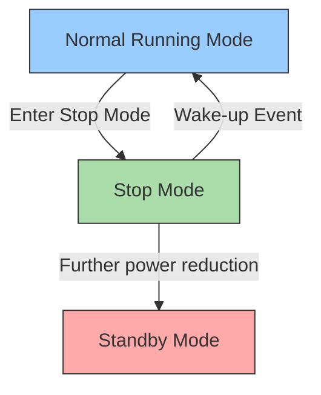

# STM32 Stop Mode

## Introduction

Power consumption is a critical factor in battery-powered or energy-efficient embedded applications. The STM32 microcontroller family offers several low-power modes to help developers optimize energy usage, with **Stop Mode** being one of the most useful intermediate power-saving states.

Stop Mode allows you to significantly reduce power consumption while maintaining certain peripherals and memory content, providing a balance between power saving and wake-up time. This tutorial will guide you through understanding, configuring, and using Stop Mode in your STM32 projects.

## Understanding Stop Mode

### What is Stop Mode?

Stop Mode is a low-power mode in STM32 microcontrollers that:

- Stops the CPU clock
- Maintains the content of RAM and registers
- Keeps selected peripherals running (depending on configuration)
- Allows quick wake-up compared to Standby Mode
- Significantly reduces power consumption compared to Sleep Mode



### Different Variants of Stop Mode

STM32 microcontrollers typically offer multiple Stop Mode variants:

1. **Stop Mode**: The basic variant
2. **Stop 1 Mode**: Maintains more peripherals, higher consumption
3. **Stop 2 Mode**: Fewer peripherals available, lower consumption

The exact variants and their names may vary across different STM32 families.

## Power Consumption Comparison

To put Stop Mode into perspective:

| Mode | Power Consumption | Wake-up Time | Memory Retention | Active Peripherals |
|------|-------------------|--------------|------------------|-------------------|
| Run Mode | 10-300 mA | N/A | Yes | All |
| Sleep Mode | 1-10 mA | Very fast (µs) | Yes | Most |
| Stop Mode | 5-50 µA | Fast (ms) | Yes | Some |
| Standby Mode | 1-5 µA | Slow (ms) | No | Very few |

*Note: Actual values vary depending on the specific STM32 microcontroller model, clock settings, and peripherals enabled.*

## Configuring Stop Mode

### Prerequisites

Before implementing Stop Mode:

1. Understand your application's power requirements
2. Identify acceptable wake-up sources
3. Determine which peripherals must remain active

### Basic Configuration Steps

Here's how to implement Stop Mode using the STM32 HAL library:

```c
// Include necessary headers
#include "stm32f4xx_hal.h"

void EnterStopMode(void)
{
  // 1. Configure wake-up source (e.g., EXTI interrupt)
  HAL_NVIC_EnableIRQ(EXTI15_10_IRQn);  // Enable EXTI interrupt
  
  // 2. Clear wake-up flags if necessary
  __HAL_PWR_CLEAR_FLAG(PWR_FLAG_WU);
  
  // 3. Enter Stop Mode
  HAL_PWR_EnterSTOPMode(PWR_LOWPOWERREGULATOR_ON, PWR_STOPENTRY_WFI);
  
  // 4. Code execution will continue from here after wake-up
  SystemClock_Config();  // Restore system clock configuration
}
```

### Configuring Wake-up Sources

The most common wake-up sources for Stop Mode are:

1. **External interrupts (EXTI)**: Wake up on pin state change
2. **RTC alarm**: Wake up at specific time
3. **Independent watchdog**: Safety wake-up
4. **Specific peripheral interrupts**: Depending on the STM32 model

Here's how to configure an external pin as a wake-up source:

```c
void ConfigureWakeupPin(void)
{
  GPIO_InitTypeDef GPIO_InitStruct = {0};
  
  // 1. Enable GPIO clock
  __HAL_RCC_GPIOA_CLK_ENABLE();
  
  // 2. Configure GPIO pin (e.g., PA0 as input with pull-up)
  GPIO_InitStruct.Pin = GPIO_PIN_0;
  GPIO_InitStruct.Mode = GPIO_MODE_IT_FALLING;  // Interrupt on falling edge
  GPIO_InitStruct.Pull = GPIO_PULLUP;
  HAL_GPIO_Init(GPIOA, &GPIO_InitStruct);
  
  // 3. Enable and set EXTI interrupt priority
  HAL_NVIC_SetPriority(EXTI0_IRQn, 0, 0);
  HAL_NVIC_EnableIRQ(EXTI0_IRQn);
}
```

## Practical Example: Battery-Powered Temperature Sensor

Let's implement a practical example of a battery-powered temperature sensor that periodically wakes up, measures the temperature, and goes back to Stop Mode.

### Hardware Requirements

- STM32 microcontroller (e.g., STM32F411RE)
- Temperature sensor (e.g., LM35 or internal STM32 temperature sensor)
- LED for status indication
- Battery power source

### Complete Code Example

```c
#include "stm32f4xx_hal.h"

// Function prototypes
void SystemClock_Config(void);
void GPIO_Init(void);
void ADC_Init(void);
void RTC_Init(void);
float ReadTemperature(void);

ADC_HandleTypeDef hadc1;
RTC_HandleTypeDef hrtc;

int main(void)
{
  // Initialize HAL
  HAL_Init();
  
  // Configure system clock
  SystemClock_Config();
  
  // Initialize peripherals
  GPIO_Init();
  ADC_Init();
  RTC_Init();
  
  while (1)
  {
    // Turn on LED to indicate we're active
    HAL_GPIO_WritePin(GPIOA, GPIO_PIN_5, GPIO_PIN_SET);
    
    // Read temperature
    float temperature = ReadTemperature();
    
    // Process and store temperature data if needed
    // ...
    
    // Turn off LED to indicate we're going to sleep
    HAL_GPIO_WritePin(GPIOA, GPIO_PIN_5, GPIO_PIN_RESET);
    
    // Configure RTC alarm to wake up in 60 seconds
    RTC_AlarmTypeDef sAlarm = {0};
    RTC_TimeTypeDef sTime;
    
    // Get current time
    HAL_RTC_GetTime(&hrtc, &sTime, RTC_FORMAT_BIN);
    
    // Set alarm for 60 seconds later
    sAlarm.AlarmTime.Hours = sTime.Hours;
    sAlarm.AlarmTime.Minutes = sTime.Minutes;
    sAlarm.AlarmTime.Seconds = (sTime.Seconds + 60) % 60;
    if (sAlarm.AlarmTime.Seconds < sTime.Seconds) {
      sAlarm.AlarmTime.Minutes = (sTime.Minutes + 1) % 60;
      if (sAlarm.AlarmTime.Minutes < sTime.Minutes) {
        sAlarm.AlarmTime.Hours = (sTime.Hours + 1) % 24;
      }
    }
    
    sAlarm.AlarmMask = RTC_ALARMMASK_DATEWEEKDAY;
    sAlarm.Alarm = RTC_ALARM_A;
    
    HAL_RTC_SetAlarm_IT(&hrtc, &sAlarm, RTC_FORMAT_BIN);
    
    // Enter Stop Mode
    HAL_PWR_EnterSTOPMode(PWR_LOWPOWERREGULATOR_ON, PWR_STOPENTRY_WFI);
    
    // Execution continues here after wake-up
    // Reconfigure any clocks or peripherals as needed
    SystemClock_Config();
  }
}

float ReadTemperature(void)
{
  uint32_t adcValue;
  
  // Start ADC conversion
  HAL_ADC_Start(&hadc1);
  
  // Wait for conversion to complete
  HAL_ADC_PollForConversion(&hadc1, 100);
  
  // Read ADC value
  adcValue = HAL_ADC_GetValue(&hadc1);
  
  // Convert ADC value to temperature (example calculation)
  float temperature = ((float)adcValue * 3.3 / 4096) * 100;
  
  return temperature;
}

// RTC Alarm interrupt handler
void RTC_Alarm_IRQHandler(void)
{
  HAL_RTC_AlarmIRQHandler(&hrtc);
}

// Rest of initialization functions would be implemented here
// ...
```

### Power Consumption Analysis

With Stop Mode, our example temperature sensor could achieve:

- **Run Mode** (during measurement): ~25mA for ~100ms = 2.5µC per measurement
- **Stop Mode** (between measurements): ~10µA for 60s = 600µC between measurements
- **Total average current**: ~10.04µA

Compared to always-on operation (~25mA), using Stop Mode provides approximately a 2,500x reduction in power consumption, extending battery life from hours to months or even years.

## Best Practices and Considerations

When implementing Stop Mode, keep these tips in mind:

1. **Clock Reconfiguration**: After exiting Stop Mode, you may need to reconfigure certain clocks.

2. **Peripheral State**: Some peripherals may need reinitialization after wake-up.

3. **Flash Access**: The first flash access might be slower after wake-up.

4. **Debouncing**: For external interrupt wake-up sources, implement proper debouncing to avoid unwanted wake-ups.

5. **Power Regulator**: Using the low-power regulator (`PWR_LOWPOWERREGULATOR_ON`) saves more power but increases wake-up time.

6. **Power Consumption Verification**: Always measure the actual power consumption of your application in different scenarios.

## Common Issues and Troubleshooting

| Issue | Possible Causes | Solution |
|-------|----------------|----------|
| Device doesn't enter Stop Mode | Pending interrupts | Clear all pending interrupt flags before entering Stop Mode |
| Device doesn't wake up | Incorrectly configured wake-up source | Verify wake-up source configuration |
| High power consumption in Stop Mode | Unnecessary peripherals still active | Disable unused peripherals before entering Stop Mode |
| System crash after wake-up | Clock misconfiguration | Properly restore system clock after wake-up |

## Summary

STM32 Stop Mode offers an excellent compromise between power saving and functionality, making it ideal for battery-powered applications that need to operate for extended periods while maintaining quick response times.

By carefully configuring wake-up sources and optimizing peripheral usage, you can achieve power consumption reductions of several orders of magnitude compared to normal operation, while still maintaining critical functionality and memory contents.

## Further Learning

To deepen your understanding of STM32 low-power modes:

1. Explore the other low-power modes (Sleep and Standby)
2. Experiment with different wake-up sources
3. Implement power consumption measurement in your projects
4. Compare different STM32 families' low-power capabilities

## Exercises

1. Modify the temperature sensor example to use an external interrupt as an additional wake-up source.

2. Implement a power consumption measurement system to compare different low-power modes.

3. Create a battery-powered data logger that wakes up on external events, stores data, and returns to Stop Mode.

4. Optimize the temperature sensor example to achieve even lower power consumption by carefully managing peripheral power.