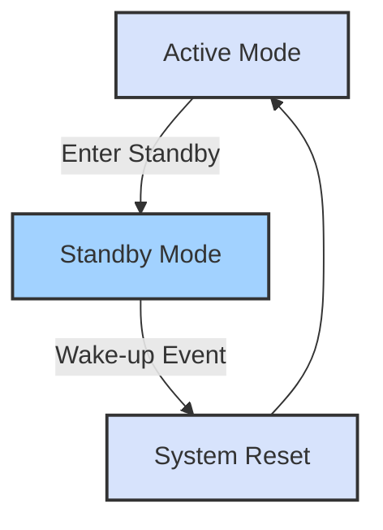

# STM32 Standby Mode

In battery-powered embedded applications, power efficiency is crucial for extending device operation time. The STM32 family of microcontrollers offers several low-power modes to help developers optimize power consumption. Among these, Standby mode provides the highest power savings at the cost of longer wake-up time and limited retention of system state.

## What is Standby Mode?

Standby mode is the deepest low-power mode available on STM32 microcontrollers. In this mode:

- The main voltage regulator is powered off
- All clocks are stopped
- The PLL, HSI, and HSE oscillators are disabled
- RAM contents are lost
- The backup domain (RTC, backup registers) remains powered if enabled
- Only specific wake-up sources can bring the system back to active mode



## Power Consumption Comparison

Here's how Standby mode compares to other low-power modes on a typical STM32F4 device:

| Mode | Typical Current Consumption | Wake-up Time | RAM Retention |
|------|----------------------------|-------------|--------------|
| Run | 10-50 mA | N/A | Yes |
| Sleep | 1-5 mA | Immediate | Yes |
| Stop | 5-10 μA | ~5 μs | Yes |
| Standby | 1-3 μA | ~50 μs | No |

## Enabling Standby Mode

To enter Standby mode, you need to follow these steps:

1. Configure the wake-up sources
2. Set the necessary bits in the Power Control Register (PWR_CR)
3. Execute a WFI (Wait For Interrupt) or WFE (Wait For Event) instruction

Here's a code example showing how to enter Standby mode:

```c
// Include necessary headers
#include "stm32f4xx_hal.h"

void enter_standby_mode(void)
{
  // 1. Enable the Power Control clock
  __HAL_RCC_PWR_CLK_ENABLE();
  
  // 2. Clear the Wake-up flag
  __HAL_PWR_CLEAR_FLAG(PWR_FLAG_WU);
  
  // 3. Enable the WKUP pin (optional, if using PA0 as wake-up source)
  HAL_PWR_EnableWakeUpPin(PWR_WAKEUP_PIN1);
  
  // 4. Set the PDDS bit to enter standby mode when the CPU enters deepsleep
  HAL_PWR_EnterSTANDBYMode();
  
  // Note: The code will continue from here after system reset following wake-up
}
```

## Wake-Up Sources

In Standby mode, the STM32 can only be awakened by specific sources:

1. **WKUP pin** - External pin (typically PA0) configured as wake-up source
2. **RTC alarm** - If the RTC is kept running in standby mode
3. **Independent watchdog** - If enabled before entering standby
4. **External reset** - NRST pin
5. **IWDG reset** - Independent Watchdog reset

Let's look at an example of using the RTC alarm as a wake-up source:

```c
void configure_rtc_wakeup(uint32_t seconds)
{
  RTC_HandleTypeDef RTCHandle;
  RTC_AlarmTypeDef AlarmConfig;
  
  // Initialize RTC
  RTCHandle.Instance = RTC;
  RTCHandle.Init.HourFormat = RTC_HOURFORMAT_24;
  RTCHandle.Init.AsynchPrediv = 127;
  RTCHandle.Init.SynchPrediv = 255;
  RTCHandle.Init.OutPut = RTC_OUTPUT_DISABLE;
  HAL_RTC_Init(&RTCHandle);
  
  // Get current time
  RTC_TimeTypeDef currentTime;
  RTC_DateTypeDef currentDate;
  HAL_RTC_GetTime(&RTCHandle, &currentTime, RTC_FORMAT_BIN);
  HAL_RTC_GetDate(&RTCHandle, &currentDate, RTC_FORMAT_BIN);
  
  // Configure the alarm to trigger after specified seconds
  AlarmConfig.AlarmTime.Hours = (currentTime.Hours + (seconds / 3600)) % 24;
  AlarmConfig.AlarmTime.Minutes = (currentTime.Minutes + ((seconds % 3600) / 60)) % 60;
  AlarmConfig.AlarmTime.Seconds = (currentTime.Seconds + (seconds % 60)) % 60;
  AlarmConfig.AlarmTime.SubSeconds = 0;
  AlarmConfig.AlarmTime.DayLightSaving = RTC_DAYLIGHTSAVING_NONE;
  AlarmConfig.AlarmTime.StoreOperation = RTC_STOREOPERATION_RESET;
  AlarmConfig.AlarmMask = RTC_ALARMMASK_DATEWEEKDAY;
  AlarmConfig.AlarmSubSecondMask = RTC_ALARMSUBSECONDMASK_ALL;
  AlarmConfig.AlarmDateWeekDaySel = RTC_ALARMDATEWEEKDAYSEL_DATE;
  AlarmConfig.AlarmDateWeekDay = 1;
  AlarmConfig.Alarm = RTC_ALARM_A;
  
  HAL_RTC_SetAlarm_IT(&RTCHandle, &AlarmConfig, RTC_FORMAT_BIN);
  
  // Enable RTC wake-up
  __HAL_RCC_BACKUPRESET_FORCE();
  __HAL_RCC_BACKUPRESET_RELEASE();
  HAL_PWR_EnableBkUpAccess();
  __HAL_RTC_WRITEPROTECTION_DISABLE(&RTCHandle);
  __HAL_RTC_WAKEUPTIMER_CLEAR_FLAG(&RTCHandle, RTC_FLAG_WUTF);
  __HAL_RTC_ALARM_ENABLE_IT(&RTCHandle, RTC_IT_ALRA);
  __HAL_RTC_WRITEPROTECTION_ENABLE(&RTCHandle);
}
```

## Detecting Wake-up Source

After waking from Standby mode, your application may need to determine what caused the wake-up. You can check this by examining the PWR_CSR register:

```c
void check_wakeup_source(void)
{
  // Enable Power Control clock
  __HAL_RCC_PWR_CLK_ENABLE();
  
  // Check if we're coming from Standby mode
  if(__HAL_PWR_GET_FLAG(PWR_FLAG_SB) != RESET)
  {
    // Clear the Standby flag
    __HAL_PWR_CLEAR_FLAG(PWR_FLAG_SB);
    
    // Check if wake-up pin triggered the wake-up
    if(__HAL_PWR_GET_FLAG(PWR_FLAG_WU) != RESET)
    {
      // Clear the wake-up flag
      __HAL_PWR_CLEAR_FLAG(PWR_FLAG_WU);
      
      // Wake-up triggered by WKUP pin (PA0)
      printf("Woken up by WKUP pin\r
");
    }
    else
    {
      // Wake-up triggered by RTC or other source
      printf("Woken up by RTC alarm or other source\r
");
    }
  }
}
```

## Practical Applications

### Battery-Powered Weather Station

A practical application of Standby mode is in a battery-powered weather station that periodically wakes up to take measurements and transmit data:

```c
int main(void)
{
  // Initialize system
  SystemInit();
  HAL_Init();
  
  // Check wake-up source
  check_wakeup_source();
  
  // Initialize sensors and peripherals
  init_sensors();
  init_communication();
  
  // Take readings
  float temperature = read_temperature();
  float humidity = read_humidity();
  
  // Transmit data
  transmit_data(temperature, humidity);
  
  // Configure RTC to wake us up in 15 minutes (900 seconds)
  configure_rtc_wakeup(900);
  
  // Enter standby mode
  enter_standby_mode();
  
  // This point is never reached - system resets after wake-up
  while(1) {}
}
```

### Motion-Activated Security Camera

Another application could be a motion-activated security camera:

```c
int main(void)
{
  // Initialize system
  SystemInit();
  HAL_Init();
  
  // Initialize camera and storage
  init_camera();
  init_storage();
  
  // Configure PA0 as wake-up pin (connected to PIR motion sensor)
  __HAL_RCC_PWR_CLK_ENABLE();
  HAL_PWR_EnableWakeUpPin(PWR_WAKEUP_PIN1);
  
  // Check if we woke up due to motion
  if(__HAL_PWR_GET_FLAG(PWR_FLAG_WU) != RESET)
  {
    // Clear the wake-up flag
    __HAL_PWR_CLEAR_FLAG(PWR_FLAG_WU);
    
    // Take picture
    capture_image();
    
    // Save to storage or transmit
    save_image();
  }
  
  // Enter standby mode and wait for motion
  enter_standby_mode();
  
  // This point is never reached - system resets after wake-up
  while(1) {}
}
```

## Considerations and Limitations

When using Standby mode, keep these considerations in mind:

1. **Loss of RAM contents** - All RAM contents are lost, so save any critical data to non-volatile memory before entering Standby mode.

2. **Wake-up time** - The system performs a reset when waking from Standby mode, leading to a longer wake-up time compared to other low-power modes.

3. **Limited wake-up sources** - Only specific wake-up sources can bring the system out of Standby mode.

4. **Current spike** - When waking up, the system may experience a brief current spike that should be accounted for in power calculations.

5. **Backup domain** - If you need to retain some data across Standby cycles, use the backup domain (RTC registers or backup SRAM if available).

## Integration with CubeMX

If you're using STM32CubeMX to generate your project, you can configure Standby mode through the GUI:

1. Open your project in CubeMX
2. Go to the "System Core" section and select "PWR"
3. In the configuration panel, set "Low Power Mode" to "Standby Mode"
4. Configure your wake-up sources (RTC, WKUP pin)
5. Generate the code

## Summary

Standby mode is the deepest low-power mode available on STM32 microcontrollers, offering the highest power savings at the cost of longer wake-up time and loss of RAM contents. Key points to remember:

- Current consumption is typically 1-3 μA (versus several mA in Run mode)
- Wake-up sources are limited to specific pins, RTC alarms, and system resets
- System performs a reset when waking up from Standby mode
- RAM contents are lost, but backup domain can be preserved
- Perfect for battery-powered applications that need to operate for extended periods

## Exercises

1. Modify the weather station example to wake up every hour during the day and every 3 hours at night (hint: use the RTC to check the current time).

2. Create an application that uses both the WKUP pin and an RTC alarm as wake-up sources and behaves differently depending on the wake-up source.

3. Design a low-power data logger that enters Standby mode between readings but preserves the log count in the backup domain.

## Further Reading

- STM32 Reference Manual sections on Power Control (PWR)
- Application Note AN4621: STM32 ultra-low-power features overview
- STM32 Low-power modes application note

Happy coding with STM32 low-power modes!