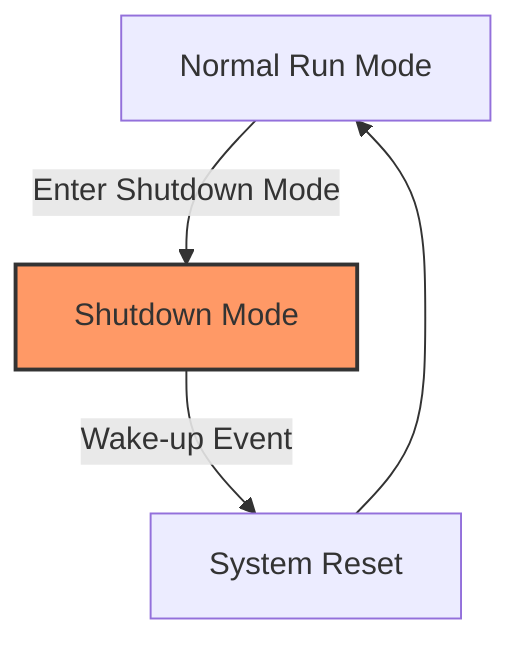

# STM32 Shutdown Mode

## Introduction

Shutdown mode represents the deepest low-power state available in most STM32 microcontrollers. This mode is designed for applications that require ultra-low power consumption during extended periods of inactivity while allowing the system to be awakened by specific external triggers.

In this guide, we'll explore how Shutdown mode works, when to use it, how to properly configure and enter this mode, and how to safely wake up from it. We'll also look at practical examples to help you implement this power-saving feature in your own STM32 projects.

## Understanding Shutdown Mode

Shutdown mode is the lowest power consumption mode available in STM32 microcontrollers. When a device enters Shutdown mode:

- All clocks are stopped
- The PLL, HSI, and HSE oscillators are disabled
- The voltage regulator is powered off
- All I/O pins are put in high-impedance state
- Almost all internal registers and SRAM contents are lost



The key characteristics of Shutdown mode include:

- **Ultra-low power consumption**: Typically in the range of 20-60 nA (nano-amperes)
- **Wake-up sources**: Limited to WKUP pins, RTC alarm, or independent watchdog
- **Recovery method**: System reset is performed upon wake-up
- **State preservation**: Only the RTC (if enabled) and backup registers retain their values

## When to Use Shutdown Mode

Shutdown mode is ideal for:

- Battery-powered devices that need to maximize battery life
- Systems that remain inactive for extended periods (hours, days, or even months)
- Applications where a complete system reset upon wake-up is acceptable
- Scenarios where ultra-low power consumption takes priority over quick wake-up time

## Configuring and Entering Shutdown Mode

### Prerequisites

Before entering Shutdown mode, you should:

1. Configure desired wake-up sources
2. Save any critical data to backup registers (if needed)
3. Configure I/O pins appropriately to minimize power consumption

### Basic Implementation

Here's a simple example of how to enter Shutdown mode using the STM32 HAL library:

```c
#include "stm32l4xx_hal.h"

void enterShutdownMode(void)
{
  /* Configure wake-up pin (PA0 as an example) */
  HAL_PWR_DisableWakeUpPin(PWR_WAKEUP_PIN1);
  
  /* Clear wake-up flag */
  __HAL_PWR_CLEAR_FLAG(PWR_FLAG_WUF1);
  
  /* Enable wake-up pin */
  HAL_PWR_EnableWakeUpPin(PWR_WAKEUP_PIN1_HIGH);
  
  /* Enter shutdown mode */
  HAL_PWREx_EnterSHUTDOWNMode();
  
  /* Code execution will not reach here until reset after wake-up */
}
```

### Configuring RTC as Wake-up Source

To use the RTC alarm as a wake-up source:

```c
void configureRTCWakeup(uint32_t seconds)
{
  RTC_TimeTypeDef sTime = {0};
  RTC_DateTypeDef sDate = {0};
  RTC_AlarmTypeDef sAlarm = {0};
  
  /* Set current time (for example purposes) */
  sTime.Hours = 0;
  sTime.Minutes = 0;
  sTime.Seconds = 0;
  HAL_RTC_SetTime(&hrtc, &sTime, RTC_FORMAT_BIN);
  
  /* Set current date (for example purposes) */
  sDate.WeekDay = RTC_WEEKDAY_MONDAY;
  sDate.Month = RTC_MONTH_JANUARY;
  sDate.Date = 1;
  sDate.Year = 21;
  HAL_RTC_SetDate(&hrtc, &sDate, RTC_FORMAT_BIN);
  
  /* Set alarm to wake up after specified seconds */
  sAlarm.AlarmTime.Hours = 0;
  sAlarm.AlarmTime.Minutes = 0;
  sAlarm.AlarmTime.Seconds = seconds;
  sAlarm.AlarmTime.SubSeconds = 0;
  sAlarm.AlarmMask = RTC_ALARMMASK_DATEWEEKDAY;
  sAlarm.AlarmSubSecondMask = RTC_ALARMSUBSECONDMASK_ALL;
  sAlarm.AlarmDateWeekDaySel = RTC_ALARMDATEWEEKDAYSEL_DATE;
  sAlarm.AlarmDateWeekDay = 1;
  sAlarm.Alarm = RTC_ALARM_A;
  HAL_RTC_SetAlarm_IT(&hrtc, &sAlarm, RTC_FORMAT_BIN);
  
  /* Enable RTC wake-up */
  HAL_PWR_EnableBkUpAccess();
  __HAL_RCC_BACKUPRESET_FORCE();
  __HAL_RCC_BACKUPRESET_RELEASE();
}
```

## Detecting Wake-up Source

After waking up from Shutdown mode, you may want to determine what caused the wake-up. This can be done by checking the appropriate flags in the Power Control Register (PWR_SR1):

```c
void checkWakeupSource(void)
{
  if(__HAL_PWR_GET_FLAG(PWR_FLAG_WUF1) != RESET)
  {
    /* System was woken up by WKUP pin 1 */
    printf("Wakeup from WKUP pin 1\r
");
    
    /* Clear the flag */
    __HAL_PWR_CLEAR_FLAG(PWR_FLAG_WUF1);
  }
  else if(__HAL_PWR_GET_FLAG(PWR_FLAG_WUF2) != RESET)
  {
    /* System was woken up by WKUP pin 2 */
    printf("Wakeup from WKUP pin 2\r
");
    
    /* Clear the flag */
    __HAL_PWR_CLEAR_FLAG(PWR_FLAG_WUF2);
  }
  else if(__HAL_PWR_GET_FLAG(PWR_FLAG_SB) != RESET)
  {
    /* System was in Standby/Shutdown mode */
    printf("Wakeup from Standby/Shutdown mode\r
");
    
    /* Check if RTC alarm triggered the wake-up */
    if(__HAL_RTC_ALARM_GET_FLAG(&hrtc, RTC_FLAG_ALRAF) != RESET)
    {
      printf("Wakeup triggered by RTC alarm\r
");
      
      /* Clear the RTC alarm flag */
      __HAL_RTC_ALARM_CLEAR_FLAG(&hrtc, RTC_FLAG_ALRAF);
    }
    
    /* Clear the standby flag */
    __HAL_PWR_CLEAR_FLAG(PWR_FLAG_SB);
  }
}
```

## Practical Example: Battery-Powered Weather Station

Let's consider a practical example of a battery-powered weather station that wakes up once every hour to take measurements and then returns to Shutdown mode:

```c
#include "stm32l4xx_hal.h"
#include "sensors.h"
#include "communication.h"

/* Backup register addresses */
#define BKP_REG_COUNTER     RTC_BKP_DR0
#define BKP_REG_LAST_TEMP   RTC_BKP_DR1
#define BKP_REG_LAST_HUM    RTC_BKP_DR2

/* Main application function */
int main(void)
{
  /* MCU Configuration */
  HAL_Init();
  SystemClock_Config();
  
  /* Initialize peripherals */
  MX_GPIO_Init();
  MX_RTC_Init();
  
  /* Initialize sensors and communication */
  Sensors_Init();
  Comm_Init();
  
  /* Check if this is a wake-up from Shutdown */
  checkWakeupSource();
  
  /* Read measurement counter from backup register */
  uint32_t measurementCounter = HAL_RTCEx_BKUPRead(&hrtc, BKP_REG_COUNTER);
  measurementCounter++;
  
  /* Take measurements */
  float temperature = Sensors_ReadTemperature();
  float humidity = Sensors_ReadHumidity();
  
  /* Store values in backup registers (simplified - actual implementation would need scaling) */
  HAL_RTCEx_BKUPWrite(&hrtc, BKP_REG_COUNTER, measurementCounter);
  HAL_RTCEx_BKUPWrite(&hrtc, BKP_REG_LAST_TEMP, (uint32_t)(temperature * 100));
  HAL_RTCEx_BKUPWrite(&hrtc, BKP_REG_LAST_HUM, (uint32_t)(humidity * 100));
  
  /* Send data if it's time (e.g., every 12 measurements) */
  if (measurementCounter % 12 == 0) {
    Comm_SendData(temperature, humidity);
  }
  
  /* Configure RTC to wake up in one hour */
  configureRTCWakeup(3600);
  
  /* Enter shutdown mode */
  printf("Entering shutdown mode, measurement #%lu complete\r
", measurementCounter);
  HAL_Delay(100); /* Allow UART to finish transmission */
  
  /* Disable unused peripherals to save power */
  Sensors_DeInit();
  Comm_DeInit();
  
  /* Enter shutdown mode */
  enterShutdownMode();
  
  /* Code will never reach here until reset */
  while (1) {}
}
```

## Comparing Power Modes in STM32

To understand when to use Shutdown mode versus other low-power modes, consider this comparison:

| Feature | Run Mode | Sleep Mode | Stop Mode | Standby Mode | Shutdown Mode |
|---------|----------|------------|-----------|--------------|---------------|
| Power Consumption | High<br />(~10-40 mA) | Medium<br />(~1-5 mA) | Low<br />(~0.5-1 μA) | Very Low<br />(~0.3-1 μA) | Ultra Low<br />(~20-60 nA) |
| Wake-up Time | N/A | Fast<br />(~1 μs) | Medium<br />(~5-10 μs) | Slow<br />(~50-100 μs) | Very Slow<br />(System Reset) |
| Wake-up Sources | N/A | Any interrupt | EXTI lines, RTC | WKUP pins, RTC, IWDG | WKUP pins, RTC, IWDG |
| RAM/Register Retention | Yes | Yes | Yes | Partial | No (except backup) |
| Voltage Regulator | On | On | Low-power | Off | Off |
| Reset on Wake-up | No | No | No | No | Yes |

## Best Practices for Using Shutdown Mode

1. **Save critical data before shutdown**: Since most RAM and register contents are lost, save any vital information to backup registers or external non-volatile memory.

2. **Configure pins properly**: Set unused pins to Analog mode with no pull-up/pull-down to minimize leakage current.

3. **Disable peripherals**: Turn off all unnecessary peripherals before entering Shutdown mode.

4. **Consider wake-up sources carefully**: Only specific sources can wake the device from Shutdown. Plan your application accordingly.

5. **Account for reset on wake-up**: Remember that your device will perform a complete reset when waking from Shutdown mode.

6. **Verify power consumption**: Measure the actual power consumption to ensure you're achieving the expected benefits.

## Debugging Considerations

Debugging Shutdown mode can be challenging because:

- The debug interface is disabled in Shutdown mode
- The device performs a reset upon wake-up

To facilitate debugging:

1. Use LED indicators to signal when the device is about to enter Shutdown mode
2. Store diagnostic information in backup registers
3. Consider using a logic analyzer to monitor wake-up signals
4. Implement debug flag mechanisms to track execution flow across resets

## Common Issues and Solutions

| Issue | Possible Cause | Solution |
|-------|----------------|----------|
| Device doesn't enter Shutdown mode | Debugger is connected | Disconnect debugger or use software-only debugging |
| Unexpected wake-ups | Improper pin configuration | Configure unused pins as analog inputs with no pull-up/pull-down |
| Higher than expected power consumption | Peripherals not properly disabled | Ensure all peripherals are disabled before entering Shutdown mode |
| Device doesn't wake up | Wake-up source not properly configured | Verify wake-up pin configuration and external circuitry |
| Data loss after wake-up | Relying on non-backup memory | Only use backup registers or external memory for critical data |

## Summary

Shutdown mode offers the lowest power consumption option for STM32 microcontrollers, making it ideal for battery-powered applications that need to maximize operational life. While it does have limitations, such as performing a system reset upon wake-up and limited wake-up sources, these trade-offs are often acceptable in ultra-low-power applications.

By understanding how to properly configure and use Shutdown mode, you can develop embedded systems that operate for months or even years on a single battery charge.

## Exercises

1. Create a simple program that toggles an LED each time the STM32 wakes up from Shutdown mode using a push-button.

2. Modify the weather station example to also record minimum and maximum temperatures in backup registers.

3. Implement a battery voltage monitoring system that uses different wake-up intervals based on the remaining battery capacity.

4. Create a "shipping mode" for a device where it stays in Shutdown mode until a specific button combination wakes it up for first use.

5. Design a low-power data logger that wakes up at varying intervals (more frequently during the day, less frequently at night) using the RTC alarm.

## Additional Resources

- STM32 Reference Manuals (specific to your MCU family)
- Application Note AN4621: STM32 ultra-low-power features overview
- STM32CubeL4 HAL Power examples
- STM32 Low-Power Modes Application Note (AN4469)