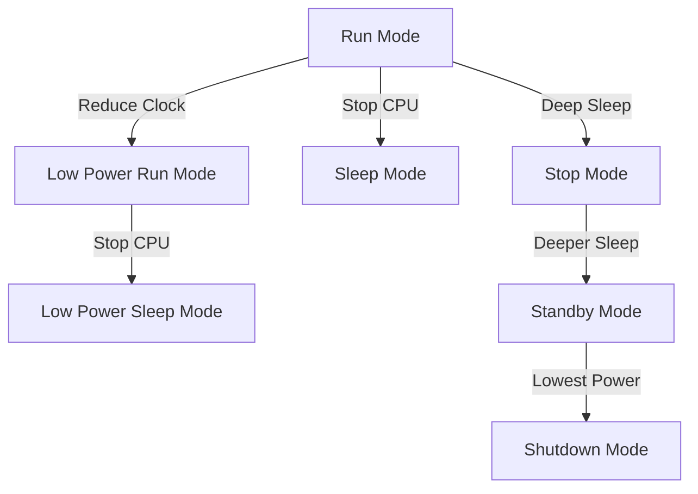

# STM32 Power Consumption

## Introduction

Power consumption is a critical factor in embedded systems design, especially for battery-operated devices. STM32 microcontrollers offer various features and modes to help developers minimize power consumption while maintaining necessary functionality. This guide will help you understand the power consumption characteristics of STM32 microcontrollers and provide practical techniques to optimize your applications for low power operation.

## Power Consumption Basics

Before diving into specific STM32 features, it's important to understand the factors that affect power consumption in microcontrollers:

1. **Operating Voltage** - Power consumption is directly proportional to the square of the operating voltage (P ∝ V²)
2. **Clock Frequency** - Higher clock speeds increase power consumption
3. **Active Peripherals** - Each active peripheral consumes additional power
4. **CPU Activity** - Executing instructions consumes power
5. **Sleep Modes** - Different low-power modes offer various power savings with different wake-up times

## STM32 Power Modes

STM32 microcontrollers offer several power modes that balance power consumption against functionality and wake-up time:



### Run Mode

This is the normal operating mode where the CPU and all peripherals are active. Power consumption is highest in this mode.

```c
// No special code needed - this is the default state after initialization
```

### Sleep Mode

In Sleep mode, only the CPU is stopped, while all peripherals continue to operate. This mode allows quick wake-up.

```c
// Enter Sleep mode
HAL_PWR_EnterSLEEPMode(PWR_MAINREGULATOR_ON, PWR_SLEEPENTRY_WFI);
```

### Low-Power Sleep Mode

Similar to Sleep mode, but with the voltage regulator in low-power mode.

```c
// Enter Low-Power Sleep mode
HAL_PWR_EnterSLEEPMode(PWR_LOWPOWERREGULATOR_ON, PWR_SLEEPENTRY_WFI);
```

### Stop Mode

In Stop mode, all clocks in the 1.2V domain are stopped, the PLL, HSI, and HSE oscillators are disabled, and the voltage regulator is in low-power mode. This significantly reduces power consumption while allowing RAM content to be retained.

```c
// Enter Stop mode
HAL_PWR_EnterSTOPMode(PWR_LOWPOWERREGULATOR_ON, PWR_STOPENTRY_WFI);
```

### Standby Mode

Standby mode offers the lowest power consumption while still allowing some wake-up sources. The 1.2V domain is powered off, and only the RTC, backup registers, and standby circuitry remain powered.

```c
// Enter Standby mode
HAL_PWR_EnterSTANDBYMode();
```

### Shutdown Mode (Available on newer STM32 families)

The lowest power mode available on some newer STM32 devices, with even the RTC stopped.

```c
// Enter Shutdown mode (on supported devices)
HAL_PWREx_EnterSHUTDOWNMode();
```

## Measuring Power Consumption

To optimize your application, you need to measure its power consumption. Here are some methods:

1. **Using Development Boards** - Many STM32 development boards include power measurement capabilities
2. **External Multimeter** - Connect an ammeter in series with your power supply
3. **STM32CubeMonitor-Power** - ST's software tool for power consumption analysis

Example setup for measuring current with a multimeter:

```c
/* Configure the system for power measurement */
void ConfigForPowerMeasurement(void)
{
  // Disable unused GPIO pins
  __HAL_RCC_GPIOA_CLK_ENABLE();
  __HAL_RCC_GPIOB_CLK_ENABLE();
  
  GPIO_InitTypeDef GPIO_InitStruct = {0};
  GPIO_InitStruct.Pin = GPIO_PIN_All;
  GPIO_InitStruct.Mode = GPIO_MODE_ANALOG;
  GPIO_InitStruct.Pull = GPIO_NOPULL;
  HAL_GPIO_Init(GPIOA, &GPIO_InitStruct);
  HAL_GPIO_Init(GPIOB, &GPIO_InitStruct);
  
  // Disable GPIO clocks after configuration
  __HAL_RCC_GPIOA_CLK_DISABLE();
  __HAL_RCC_GPIOB_CLK_DISABLE();
}
```

## Power Optimization Techniques

### 1. Clock Management

The clock frequency directly affects power consumption. Only use the speed you actually need.

```c
// Configure the system clock to a lower frequency
void ConfigureLowerClock(void)
{
  RCC_OscInitTypeDef RCC_OscInitStruct = {0};
  RCC_ClkInitTypeDef RCC_ClkInitStruct = {0};
  
  // Configure HSI as system clock source at 16 MHz instead of using PLL
  RCC_OscInitStruct.OscillatorType = RCC_OSCILLATORTYPE_HSI;
  RCC_OscInitStruct.HSIState = RCC_HSI_ON;
  RCC_OscInitStruct.HSICalibrationValue = RCC_HSICALIBRATION_DEFAULT;
  RCC_OscInitStruct.PLL.PLLState = RCC_PLL_NONE;
  HAL_RCC_OscConfig(&RCC_OscInitStruct);
  
  // Select HSI as system clock, no division
  RCC_ClkInitStruct.ClockType = RCC_CLOCKTYPE_SYSCLK | RCC_CLOCKTYPE_HCLK | RCC_CLOCKTYPE_PCLK1 | RCC_CLOCKTYPE_PCLK2;
  RCC_ClkInitStruct.SYSCLKSource = RCC_SYSCLKSOURCE_HSI;
  RCC_ClkInitStruct.AHBCLKDivider = RCC_SYSCLK_DIV1;
  RCC_ClkInitStruct.APB1CLKDivider = RCC_HCLK_DIV1;
  RCC_ClkInitStruct.APB2CLKDivider = RCC_HCLK_DIV1;
  HAL_RCC_ClockConfig(&RCC_ClkInitStruct, FLASH_LATENCY_0);
}
```

### 2. Peripheral Management

Only enable peripherals when needed and disable them when not in use.

```c
// Example of enabling and disabling a peripheral only when needed
void UsePeripheralEfficiently(void)
{
  // Enable ADC clock only when needed
  __HAL_RCC_ADC1_CLK_ENABLE();
  
  // Perform ADC operations...
  // ...
  
  // Disable ADC clock when done
  __HAL_RCC_ADC1_CLK_DISABLE();
}
```

### 3. GPIO Configuration

Properly configured GPIO pins can reduce power consumption.

```c
// Configure all unused pins as analog inputs with no pull-up/down
void ConfigureUnusedGPIO(void)
{
  GPIO_InitTypeDef GPIO_InitStruct = {0};
  
  // Enable all GPIO clocks
  __HAL_RCC_GPIOA_CLK_ENABLE();
  __HAL_RCC_GPIOB_CLK_ENABLE();
  __HAL_RCC_GPIOC_CLK_ENABLE();
  // Add other GPIO ports as needed
  
  // Configure all pins as analog (lowest power state)
  GPIO_InitStruct.Pin = GPIO_PIN_All;
  GPIO_InitStruct.Mode = GPIO_MODE_ANALOG;
  GPIO_InitStruct.Pull = GPIO_NOPULL;
  HAL_GPIO_Init(GPIOA, &GPIO_InitStruct);
  HAL_GPIO_Init(GPIOB, &GPIO_InitStruct);
  HAL_GPIO_Init(GPIOC, &GPIO_InitStruct);
  // Do the same for other GPIO ports
  
  // Disable GPIO clocks after configuration
  __HAL_RCC_GPIOA_CLK_DISABLE();
  __HAL_RCC_GPIOB_CLK_DISABLE();
  __HAL_RCC_GPIOC_CLK_DISABLE();
  // Disable other GPIO clocks as needed
}
```

### 4. Voltage Scaling

STM32 microcontrollers support voltage scaling, allowing the core voltage to be reduced for lower power consumption at the expense of performance.

```c
// Configure voltage scaling for lower power (STM32L4 example)
void ConfigureVoltageScaling(void)
{
  // Enable Power Control clock
  __HAL_RCC_PWR_CLK_ENABLE();
  
  // Configure the main internal regulator output voltage
  HAL_PWREx_ControlVoltageScaling(PWR_REGULATOR_VOLTAGE_SCALE2); // Lower voltage, lower performance
}
```

### 5. Efficient Coding Practices

How you write your code can significantly impact power consumption:

```c
// Bad Example: Polling
void IneffientPolling(void)
{
  while (1) {
    // Check if something happened
    if (HAL_GPIO_ReadPin(BUTTON_PORT, BUTTON_PIN) == GPIO_PIN_SET) {
      // Handle event
    }
    // CPU is active all the time, wasting power
  }
}

// Good Example: Interrupt-based
void EfficientInterruptBased(void)
{
  // Configure button interrupt
  GPIO_InitTypeDef GPIO_InitStruct = {0};
  GPIO_InitStruct.Pin = BUTTON_PIN;
  GPIO_InitStruct.Mode = GPIO_MODE_IT_RISING;
  GPIO_InitStruct.Pull = GPIO_PULLDOWN;
  HAL_GPIO_Init(BUTTON_PORT, &GPIO_InitStruct);
  
  // Enable button interrupt
  HAL_NVIC_SetPriority(BUTTON_IRQn, 0, 0);
  HAL_NVIC_EnableIRQ(BUTTON_IRQn);
  
  while (1) {
    // Enter sleep mode, wait for interrupt
    HAL_PWR_EnterSLEEPMode(PWR_MAINREGULATOR_ON, PWR_SLEEPENTRY_WFI);
    // CPU wakes up only when button is pressed
  }
}

// Button interrupt handler
void BUTTON_IRQHandler(void)
{
  // Handle button press
  // ...
  
  // Clear interrupt flag
  HAL_GPIO_EXTI_IRQHandler(BUTTON_PIN);
}
```

## Real-World Example: Battery-Powered Temperature Sensor

Let's build a practical example of a battery-powered temperature sensor that wakes up periodically, measures temperature, transmits the data, and returns to sleep.

```c
#include "main.h"
#include "stm32l4xx_hal.h"

ADC_HandleTypeDef hadc1;
UART_HandleTypeDef huart2;
RTC_HandleTypeDef hrtc;

void SystemClock_Config(void);
static void MX_GPIO_Init(void);
static void MX_ADC1_Init(void);
static void MX_USART2_UART_Init(void);
static void MX_RTC_Init(void);
void EnterLowPowerMode(void);

int main(void)
{
  HAL_Init();
  SystemClock_Config();
  
  // Initialize peripherals
  MX_GPIO_Init();
  MX_ADC1_Init();
  MX_USART2_UART_Init();
  MX_RTC_Init();
  
  while (1)
  {
    // Wake up, measure temperature and send data
    uint32_t adcValue = 0;
    float temperature = 0.0f;
    char uartBuffer[32] = {0};
    
    // Enable ADC clock
    __HAL_RCC_ADC_CLK_ENABLE();
    
    // Calibrate ADC
    HAL_ADCEx_Calibration_Start(&hadc1, ADC_SINGLE_ENDED);
    
    // Start ADC conversion
    HAL_ADC_Start(&hadc1);
    if (HAL_ADC_PollForConversion(&hadc1, 100) == HAL_OK)
    {
      adcValue = HAL_ADC_GetValue(&hadc1);
      temperature = ((float)adcValue * 3.3f / 4096.0f - 0.76f) / 0.0025f + 25.0f;
    }
    HAL_ADC_Stop(&hadc1);
    
    // Disable ADC clock to save power
    __HAL_RCC_ADC_CLK_DISABLE();
    
    // Enable UART clock
    __HAL_RCC_USART2_CLK_ENABLE();
    
    // Format and send temperature data
    sprintf(uartBuffer, "Temperature: %.1f°C\r
", temperature);
    HAL_UART_Transmit(&huart2, (uint8_t*)uartBuffer, strlen(uartBuffer), 100);
    
    // Disable UART clock to save power
    __HAL_RCC_USART2_CLK_DISABLE();
    
    // Enter low-power mode until next RTC wake-up (every 60 seconds)
    EnterLowPowerMode();
  }
}

void EnterLowPowerMode(void)
{
  // Set RTC alarm for 60 seconds
  RTC_AlarmTypeDef sAlarm = {0};
  RTC_TimeTypeDef sTime = {0};
  RTC_DateTypeDef sDate = {0};
  
  // Get current time
  HAL_RTC_GetTime(&hrtc, &sTime, RTC_FORMAT_BIN);
  HAL_RTC_GetDate(&hrtc, &sDate, RTC_FORMAT_BIN);
  
  // Set alarm to current time + 60 seconds
  sAlarm.AlarmTime.Hours = sTime.Hours;
  sAlarm.AlarmTime.Minutes = sTime.Minutes;
  sAlarm.AlarmTime.Seconds = (sTime.Seconds + 60) % 60;
  if (sAlarm.AlarmTime.Seconds < sTime.Seconds) {
    sAlarm.AlarmTime.Minutes = (sTime.Minutes + 1) % 60;
    if (sAlarm.AlarmTime.Minutes < sTime.Minutes) {
      sAlarm.AlarmTime.Hours = (sTime.Hours + 1) % 24;
    }
  }
  
  sAlarm.AlarmTime.SubSeconds = 0;
  sAlarm.AlarmTime.DayLightSaving = RTC_DAYLIGHTSAVING_NONE;
  sAlarm.AlarmTime.StoreOperation = RTC_STOREOPERATION_RESET;
  sAlarm.AlarmMask = RTC_ALARMMASK_DATEWEEKDAY;
  sAlarm.AlarmSubSecondMask = RTC_ALARMSUBSECONDMASK_ALL;
  sAlarm.AlarmDateWeekDaySel = RTC_ALARMDATEWEEKDAYSEL_DATE;
  sAlarm.AlarmDateWeekDay = 1;
  sAlarm.Alarm = RTC_ALARM_A;
  
  HAL_RTC_SetAlarm_IT(&hrtc, &sAlarm, RTC_FORMAT_BIN);
  
  // Enter STOP mode with RTC as wake-up source
  HAL_PWR_EnterSTOPMode(PWR_LOWPOWERREGULATOR_ON, PWR_STOPENTRY_WFI);
  
  // After wake-up, reconfigure the system clock
  SystemClock_Config();
}

// RTC Alarm A callback
void HAL_RTC_AlarmAEventCallback(RTC_HandleTypeDef *hrtc)
{
  // Wake up from STOP mode - no action needed here
  // Program execution will resume in main loop
}

// Other initialization functions (SystemClock_Config, MX_GPIO_Init, etc.) would be included here
```

This example demonstrates:
- Periodic wake-up using RTC alarm
- Efficient peripheral usage (enabling only when needed)
- Using STOP mode for low power consumption
- Proper system reconfiguration after wake-up

## Power Consumption Comparison

Here's a typical comparison of power consumption across different modes for an STM32L4 microcontroller (values may vary based on specific model and configuration):

| Mode | Typical Current Consumption | Features Available |
|------|---------------------------|-------------------|
| Run Mode (80 MHz) | 10-15 mA | All features |
| Low Power Run (2 MHz) | 5-10 μA | All features at reduced speed |
| Sleep Mode | 2-5 mA | All peripherals except CPU |
| Low Power Sleep | 1-2 mA | All peripherals except CPU, reduced power |
| Stop Mode | 1-5 μA | RTC, backup registers, wake-up capability |
| Standby Mode | 260-400 nA | RTC, backup registers, limited wake-up sources |
| Shutdown Mode | 8-30 nA | Limited wake-up sources only |

## Debugging Low Power Applications

Debugging low-power applications can be challenging because debug connections may prevent entering certain low-power modes or increase power consumption. Here are some tips:

1. **Use printf debugging** - Send debug information over UART before entering low-power modes
2. **Measure current consumption** - Use external tools to verify power consumption
3. **State indicators** - Use LEDs to indicate state transitions (but remember they consume power too)
4. **Watchdog timers** - Use as safety nets to recover from unexpected behavior

```c
// Example of printf debugging before entering low-power mode
void DebugBeforeSleep(float temperature)
{
  char debugMsg[64];
  sprintf(debugMsg, "Temperature: %.1f°C, Entering STOP mode for 60s\r
", temperature);
  HAL_UART_Transmit(&huart2, (uint8_t*)debugMsg, strlen(debugMsg), 100);
  
  // Wait for UART transmission to complete
  while(HAL_UART_GetState(&huart2) != HAL_UART_STATE_READY);
  
  // Now enter low-power mode
  HAL_PWR_EnterSTOPMode(PWR_LOWPOWERREGULATOR_ON, PWR_STOPENTRY_WFI);
}
```

## Battery Life Estimation

To estimate battery life for your application, use this simplified formula:

```
Battery Life (hours) = Battery Capacity (mAh) / Average Current Consumption (mA)
```

For a more accurate calculation, consider the duty cycle of your application:

```c
// Example calculation
float EstimateBatteryLife(float batteryCapacity, float activeModeCurrent, float sleepModeCurrent, float activeDutyCycle)
{
  float averageCurrent = (activeModeCurrent * activeDutyCycle) + (sleepModeCurrent * (1.0f - activeDutyCycle));
  float batteryLifeHours = batteryCapacity / averageCurrent;
  
  return batteryLifeHours;
}
```

## Summary

Optimizing power consumption in STM32 microcontrollers requires a comprehensive approach:

1. **Choose the appropriate power mode** for your application's needs
2. **Manage peripheral clocks** efficiently
3. **Configure unused GPIO pins** properly
4. **Use interrupt-based approaches** rather than polling
5. **Consider voltage scaling** when applicable
6. **Measure and verify** your power consumption

By implementing these techniques, you can significantly extend the battery life of your STM32-based devices and create more energy-efficient applications.

## Additional Resources

- STM32 Low Power Webinar Series by ST Microelectronics
- STM32 Power Consumption Application Notes (AN4365, AN4621)
- STM32CubeL4 Power Management Examples
- STM32 Low Power Cookbook for each specific STM32 family

## Practice Exercises

1. Modify the temperature sensor example to wake up on a button press instead of using an RTC timer
2. Implement a power state machine with different modes based on battery voltage level
3. Compare power consumption between polling and interrupt-based approaches for a simple button input
4. Optimize an existing project to reduce power consumption by at least 50%
5. Calculate the expected battery life for a CR2032 coin cell (typical capacity 225mAh) for the temperature sensor example