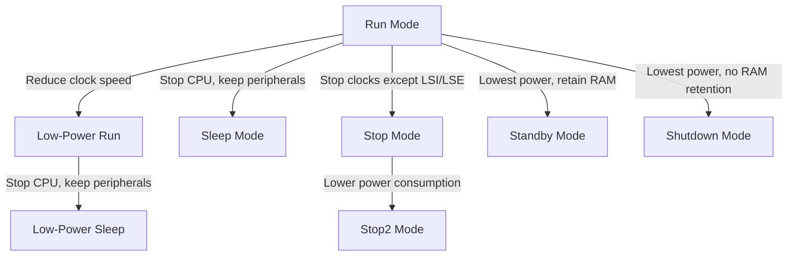

# STM32 Battery Operation

## Introduction

Battery-powered applications are increasingly common in embedded systems, from IoT sensors to wearable devices. When designing battery-operated devices using STM32 microcontrollers, power efficiency becomes a critical consideration that directly impacts battery life and device usability. This guide explores how to optimize STM32 microcontrollers for battery operation, covering power modes, peripherals management, and practical implementation techniques.

STM32 microcontrollers offer various low-power modes and features specifically designed for battery-powered applications. Understanding these options is essential for maximizing battery life while maintaining necessary functionality.

## Understanding Battery Constraints

Before diving into STM32-specific techniques, it's important to understand the fundamental constraints of battery-powered operation:

- **Limited energy capacity**: Batteries provide finite energy, measured in mAh (milliampere-hours)
- **Discharge characteristics**: Voltage drops as the battery discharges
- **Self-discharge**: Batteries gradually lose charge over time even when not in use
- **Temperature sensitivity**: Battery performance varies with temperature
- **Cycle life**: Rechargeable batteries degrade after multiple charge-discharge cycles

For example, a typical CR2032 coin cell battery has a capacity of around 225mAh at 3V. If your STM32 application continuously draws 10mA, the battery will only last about 22.5 hours (theoretical maximum, actual duration will be less).

## STM32 Low-Power Modes

STM32 microcontrollers feature multiple low-power modes that can be leveraged for battery operation:



### Run Modes
- **Run Mode**: Normal operation with all features active
- **Low-Power Run**: CPU and peripherals operate at reduced frequency

### Sleep Modes
- **Sleep Mode**: CPU is stopped, peripherals continue to operate
- **Low-Power Sleep**: CPU is stopped, peripherals operate at reduced frequency

### Stop Modes
- **Stop Mode**: All clocks are stopped except LSI and LSE, peripherals are stopped, memory content is preserved
- **Stop2 Mode**: Further reduces power consumption compared to Stop mode (available on some STM32 families)

### Standby and Shutdown Modes
- **Standby Mode**: Lowest power mode with RAM content preserved
- **Shutdown Mode**: Lowest power mode without RAM content preservation

Here's a comparison of current consumption across different modes (values vary by STM32 family):

| Power Mode | Typical Current | Wake-up Time | RAM Retention |
|------------|----------------|--------------|---------------|
| Run        | 3.5-10 mA      | -            | Yes           |
| Low-Power Run | 250-500 μA  | -            | Yes           |
| Sleep      | 1-3 mA         | 1-5 μs       | Yes           |
| Low-Power Sleep | 150-400 μA | 1-5 μs      | Yes           |
| Stop       | 5-10 μA        | 5-10 μs      | Yes           |
| Stop2      | 1-3 μA         | 5-12 μs      | Yes           |
| Standby    | 0.3-1.5 μA     | 50-150 μs    | Partial       |
| Shutdown   | 0.05-0.3 μA    | 5-10 ms      | No            |

## Implementing Low-Power Modes

Let's examine how to implement these modes in your STM32 application.

### Entering Sleep Mode

```c
// Include necessary headers
#include "stm32l4xx_hal.h"  // Replace with your STM32 family header

// Function to enter Sleep mode
void EnterSleepMode(void)
{
  // Suspend Tick increment to prevent waking up from Systick interrupt
  HAL_SuspendTick();
  
  // Enter Sleep Mode
  HAL_PWR_EnterSLEEPMode(PWR_MAINREGULATOR_ON, PWR_SLEEPENTRY_WFI);
  
  // Resume Tick interrupt after wake-up
  HAL_ResumeTick();
}
```

### Entering Stop Mode

```c
// Function to enter Stop mode
void EnterStopMode(void)
{
  // Suspend Tick increment
  HAL_SuspendTick();
  
  // Enter Stop mode
  HAL_PWR_EnterSTOPMode(PWR_LOWPOWERREGULATOR_ON, PWR_STOPENTRY_WFI);
  
  // System clock configuration recovery after wake-up
  SystemClock_Config();
  
  // Resume Tick interrupt
  HAL_ResumeTick();
}
```

### Entering Standby Mode

```c
// Function to enter Standby mode
void EnterStandbyMode(void)
{
  // Clear Standby flag
  __HAL_PWR_CLEAR_FLAG(PWR_FLAG_SB);
  
  // Clear wake-up flags
  __HAL_PWR_CLEAR_FLAG(PWR_FLAG_WU);
  
  // Configure wake-up pin (if needed)
  HAL_PWR_EnableWakeUpPin(PWR_WAKEUP_PIN1);
  
  // Enter Standby mode
  HAL_PWR_EnterSTANDBYMode();
  
  // Note: After Standby, the system will reset
  // No code after this line will be executed
}
```

## Power Optimization Strategies

### 1. Clock Management

Reducing clock frequency is one of the most effective ways to lower power consumption:

```c
// Configure system clock to lower frequency (e.g., 4 MHz MSI on STM32L4)
void ConfigureLowPowerClock(void)
{
  RCC_OscInitTypeDef RCC_OscInitStruct = {0};
  RCC_ClkInitTypeDef RCC_ClkInitStruct = {0};
  
  // Configure MSI to 4 MHz
  RCC_OscInitStruct.OscillatorType = RCC_OSCILLATORTYPE_MSI;
  RCC_OscInitStruct.MSIState = RCC_MSI_ON;
  RCC_OscInitStruct.MSICalibrationValue = RCC_MSICALIBRATION_DEFAULT;
  RCC_OscInitStruct.MSIClockRange = RCC_MSIRANGE_6; // 4 MHz
  RCC_OscInitStruct.PLL.PLLState = RCC_PLL_NONE;
  HAL_RCC_OscConfig(&RCC_OscInitStruct);
  
  // Select MSI as system clock
  RCC_ClkInitStruct.ClockType = RCC_CLOCKTYPE_SYSCLK;
  RCC_ClkInitStruct.SYSCLKSource = RCC_SYSCLKSOURCE_MSI;
  RCC_ClkInitStruct.AHBCLKDivider = RCC_SYSCLK_DIV1;
  RCC_ClkInitStruct.APB1CLKDivider = RCC_HCLK_DIV1;
  RCC_ClkInitStruct.APB2CLKDivider = RCC_HCLK_DIV1;
  HAL_RCC_ClockConfig(&RCC_ClkInitStruct, FLASH_LATENCY_0);
}
```

### 2. Peripheral Management

Only enable peripherals when needed:

```c
// Example: Enable ADC only when required
void MeasureAndSleep(void)
{
  // Enable ADC
  __HAL_RCC_ADC_CLK_ENABLE();
  HAL_ADC_MspInit(&hadc1);
  HAL_ADC_Start(&hadc1);
  
  // Take measurement
  HAL_ADC_PollForConversion(&hadc1, 100);
  uint32_t adcValue = HAL_ADC_GetValue(&hadc1);
  
  // Process data
  ProcessAdcData(adcValue);
  
  // Disable ADC
  HAL_ADC_Stop(&hadc1);
  HAL_ADC_MspDeInit(&hadc1);
  __HAL_RCC_ADC_CLK_DISABLE();
  
  // Enter low-power mode
  EnterStopMode();
}
```

### 3. GPIO Configuration

Configure unused pins to minimize power leakage:

```c
// Configure all unused GPIOs as analog inputs
void ConfigureUnusedGPIOs(void)
{
  GPIO_InitTypeDef GPIO_InitStruct = {0};
  
  // Enable all GPIO clocks
  __HAL_RCC_GPIOA_CLK_ENABLE();
  __HAL_RCC_GPIOB_CLK_ENABLE();
  __HAL_RCC_GPIOC_CLK_ENABLE();
  __HAL_RCC_GPIOD_CLK_ENABLE();
  __HAL_RCC_GPIOE_CLK_ENABLE();
  
  // Configure all GPIO pins as analog (except those used in the application)
  GPIO_InitStruct.Mode = GPIO_MODE_ANALOG;
  GPIO_InitStruct.Pull = GPIO_NOPULL;
  
  // Initialize all pins on GPIOA to GPIOE
  GPIO_InitStruct.Pin = GPIO_PIN_All;
  HAL_GPIO_Init(GPIOA, &GPIO_InitStruct);
  HAL_GPIO_Init(GPIOB, &GPIO_InitStruct);
  HAL_GPIO_Init(GPIOC, &GPIO_InitStruct);
  HAL_GPIO_Init(GPIOD, &GPIO_InitStruct);
  HAL_GPIO_Init(GPIOE, &GPIO_InitStruct);
  
  // Disable GPIO clocks
  __HAL_RCC_GPIOA_CLK_DISABLE();
  __HAL_RCC_GPIOB_CLK_DISABLE();
  __HAL_RCC_GPIOC_CLK_DISABLE();
  __HAL_RCC_GPIOD_CLK_DISABLE();
  __HAL_RCC_GPIOE_CLK_DISABLE();
}
```

## Battery Monitoring

STM32 microcontrollers can monitor their own power supply voltage using the integrated ADC:

```c
// Function to measure battery voltage
float MeasureBatteryVoltage(void)
{
  uint32_t adcValue;
  float batteryVoltage;
  
  // Configure ADC for VREFINT channel
  ADC_ChannelConfTypeDef sConfig = {0};
  sConfig.Channel = ADC_CHANNEL_VREFINT;
  sConfig.Rank = 1;
  sConfig.SamplingTime = ADC_SAMPLETIME_247CYCLES_5;
  HAL_ADC_ConfigChannel(&hadc1, &sConfig);
  
  // Start ADC conversion
  HAL_ADC_Start(&hadc1);
  HAL_ADC_PollForConversion(&hadc1, 100);
  adcValue = HAL_ADC_GetValue(&hadc1);
  HAL_ADC_Stop(&hadc1);
  
  // Calculate battery voltage
  // VREFINT_CAL is calibration value at 3.0V and 30°C
  // VREFINT_CAL is stored in system memory
  uint16_t VREFINT_CAL = *((uint16_t*)0x1FFF75AA);
  batteryVoltage = 3.0f * ((float)VREFINT_CAL / (float)adcValue);
  
  return batteryVoltage;
}
```

## Practical Example: Battery-Powered Temperature Sensor

Let's create a complete example of a battery-powered temperature sensor that periodically measures temperature and transmits data:

```c
#include "stm32l4xx_hal.h"
#include <stdio.h>

// Global handles
ADC_HandleTypeDef hadc1;
UART_HandleTypeDef huart2;
RTC_HandleTypeDef hrtc;

// Function prototypes
void SystemClock_Config(void);
void ConfigurePeripherals(void);
float ReadTemperature(void);
float MeasureBatteryVoltage(void);
void TransmitData(float temperature, float voltage);
void EnterStopMode(uint32_t seconds);

// Main function
int main(void)
{
  // Initialize HAL
  HAL_Init();
  
  // Configure system clock
  SystemClock_Config();
  
  // Configure unused GPIOs as analog
  ConfigureUnusedGPIOs();
  
  // Configure required peripherals
  ConfigurePeripherals();
  
  // Main application loop
  while (1)
  {
    // Read temperature and battery voltage
    float temperature = ReadTemperature();
    float batteryVoltage = MeasureBatteryVoltage();
    
    // Transmit data
    TransmitData(temperature, batteryVoltage);
    
    // Enter Stop mode for 60 seconds
    EnterStopMode(60);
  }
}

// Configure RTC for wake-up from Stop mode
void ConfigureRtcWakeup(uint32_t seconds)
{
  // Configure RTC
  hrtc.Instance = RTC;
  hrtc.Init.HourFormat = RTC_HOURFORMAT_24;
  hrtc.Init.AsynchPrediv = 127;
  hrtc.Init.SynchPrediv = 255;
  hrtc.Init.OutPut = RTC_OUTPUT_DISABLE;
  HAL_RTC_Init(&hrtc);
  
  // Configure wake-up timer
  HAL_RTCEx_SetWakeUpTimer_IT(&hrtc, seconds * 2, RTC_WAKEUPCLOCK_CK_SPRE_16BITS);
}

// Enter Stop mode with RTC wake-up
void EnterStopMode(uint32_t seconds)
{
  // Configure RTC for wake-up
  ConfigureRtcWakeup(seconds);
  
  // Suspend Tick
  HAL_SuspendTick();
  
  // Enter Stop mode
  HAL_PWR_EnterSTOPMode(PWR_LOWPOWERREGULATOR_ON, PWR_STOPENTRY_WFI);
  
  // System will wake up here after RTC alarm
  
  // Restore system clock
  SystemClock_Config();
  
  // Resume Tick
  HAL_ResumeTick();
  
  // Disable wake-up timer
  HAL_RTCEx_DeactivateWakeUpTimer(&hrtc);
}

// Read temperature from internal sensor
float ReadTemperature(void)
{
  uint32_t adcValue;
  float temperature;
  
  // Configure ADC for temperature channel
  ADC_ChannelConfTypeDef sConfig = {0};
  sConfig.Channel = ADC_CHANNEL_TEMPSENSOR;
  sConfig.Rank = 1;
  sConfig.SamplingTime = ADC_SAMPLETIME_247CYCLES_5;
  HAL_ADC_ConfigChannel(&hadc1, &sConfig);
  
  // Enable ADC
  __HAL_ADC_ENABLE(&hadc1);
  
  // Start ADC conversion
  HAL_ADC_Start(&hadc1);
  HAL_ADC_PollForConversion(&hadc1, 100);
  adcValue = HAL_ADC_GetValue(&hadc1);
  HAL_ADC_Stop(&hadc1);
  
  // Calculate temperature
  // Formula from STM32L4 datasheet
  temperature = ((float)adcValue * 3.3f / 4096.0f - 0.76f) / 0.0025f + 25.0f;
  
  return temperature;
}

// Transmit data via UART
void TransmitData(float temperature, float voltage)
{
  char buffer[64];
  sprintf(buffer, "Temp: %.2f C, Battery: %.2f V\r
", temperature, voltage);
  HAL_UART_Transmit(&huart2, (uint8_t*)buffer, strlen(buffer), 1000);
}
```

## Power Consumption Analysis

Let's analyze the power consumption of our temperature sensor example:

| Operation | Current | Duration | Energy |
|-----------|---------|----------|--------|
| Temperature reading | 5 mA | 10 ms | 50 μAs |
| Data transmission | 15 mA | 20 ms | 300 μAs |
| Stop mode | 5 μA | 60 s | 300 μAs |
| **Total per cycle** | - | 60.03 s | 650 μAs |

With a 1000 mAh battery, this system could theoretically operate for:
- 1000 mAh × 3600 s/h ÷ (650 μAs ÷ 60.03 s) ≈ 3.3 years

In reality, battery self-discharge and other factors would reduce this, but it demonstrates the effectiveness of power optimization.

## Battery Selection Guidelines

When selecting a battery for your STM32 application, consider:

1. **Required capacity**: Calculate based on your average current consumption and desired operating life
2. **Voltage range**: Ensure compatibility with STM32 operating voltage (typically 1.8V to 3.6V)
3. **Physical size constraints**: Choose a form factor suitable for your device
4. **Temperature range**: Consider the operating environment
5. **Rechargeability**: Decide between primary (non-rechargeable) and secondary (rechargeable) batteries

Common battery options:
- **Coin cells** (CR2032, etc.): Compact, 3V, ~225mAh, suitable for low-power applications
- **AAA/AA alkaline**: 1.5V (need 2+ in series), 1000-2500mAh, affordable and widely available
- **Lithium-ion/polymer**: 3.7V, 500-5000mAh, rechargeable, higher energy density

## Summary

Optimizing STM32 microcontrollers for battery operation involves:

1. Using appropriate low-power modes (Sleep, Stop, Standby) based on application requirements
2. Managing peripheral power by enabling only when needed
3. Configuring unused GPIO pins to minimize leakage current
4. Reducing clock frequencies when possible
5. Implementing intelligent wake-up mechanisms like RTC alarms
6. Monitoring battery voltage to implement low-battery warnings or actions

By applying these techniques, you can extend battery life from hours to months or even years, depending on the application.

## Exercises

1. Modify the temperature sensor example to include a low-battery warning when voltage drops below 2.7V.
2. Implement a more sophisticated power management scheme that varies the sampling rate based on temperature changes (sample more frequently when temperature is changing rapidly).
3. Add a button interrupt to wake the device from Stop mode for manual readings.
4. Research and calculate the power consumption for your own battery-powered STM32 application.
5. Implement power profiling using an external current measurement tool to verify your power optimization strategies.

## Additional Resources

- STM32 Low-Power Features Application Note (AN4621)
- STM32L4 Reference Manual, Chapter: Power Control (PWR)
- STM32 Ultra Low Power Features Application Note (AN3152)
- Battery Technologies Comparison for IoT Applications