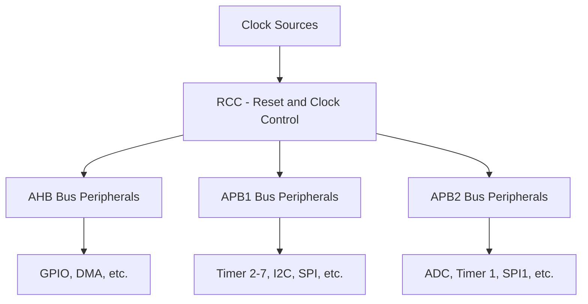

# STM32 Clock Gating

## Introduction

Clock gating is one of the most effective techniques for reducing power consumption in microcontrollers. On STM32 devices, it allows you to selectively disable the clock signal to peripheral modules that aren't in use, significantly decreasing dynamic power consumption without losing the state of the peripheral.

This tutorial will guide you through understanding and implementing clock gating on STM32 microcontrollers, a fundamental technique in low-power embedded design.

## Understanding Clock Distribution in STM32

Before diving into clock gating, it's important to understand how clocks are distributed within an STM32 microcontroller.



In STM32 microcontrollers, the Reset and Clock Control (RCC) module manages all the clock signals. The system clock is distributed to different peripherals through various buses:

- AHB (Advanced High-performance Bus)
- APB1 (Advanced Peripheral Bus 1)
- APB2 (Advanced Peripheral Bus 2)

Each peripheral connected to these buses has a dedicated clock that can be individually enabled or disabled.

## How Clock Gating Works

Clock gating is a technique that stops the clock signal from reaching a particular peripheral when it's not needed. When a peripheral's clock is gated (disabled):

1. The peripheral stops operating
2. It doesn't consume dynamic power (power due to switching activity)
3. It retains its configuration (unlike a full reset)
4. It can be re-enabled quickly when needed

## Implementing Clock Gating on STM32

### Using HAL Library

The most straightforward way to implement clock gating on STM32 is through the HAL (Hardware Abstraction Layer) library using the `__HAL_RCC_x_CLK_ENABLE()` and `__HAL_RCC_x_CLK_DISABLE()` macros.

Here's a basic example showing how to enable and disable the GPIOA clock:

```c
// Enable GPIOA clock
__HAL_RCC_GPIOA_CLK_ENABLE();

// Use GPIOA
// ...

// Disable GPIOA clock when not needed
__HAL_RCC_GPIOA_CLK_DISABLE();
```

### Direct Register Access

You can also implement clock gating by directly manipulating the RCC registers:

```c
// Enable GPIOA clock
RCC->AHB1ENR |= RCC_AHB1ENR_GPIOAEN;

// Use GPIOA
// ...

// Disable GPIOA clock
RCC->AHB1ENR &= ~RCC_AHB1ENR_GPIOAEN;
```

Note: The specific register names might vary depending on the STM32 family you're using. Always refer to the reference manual for your specific device.

## Practical Example: Current Measurement with Clock Gating

Let's create a practical example to demonstrate the power savings achieved with clock gating. We'll measure current consumption with and without clock gating applied.

```c
#include "stm32f4xx_hal.h"

void SystemClock_Config(void);
void GPIO_Init(void);
void disableAllPeripheralClocks(void);

int main(void)
{
  HAL_Init();
  SystemClock_Config();
  
  GPIO_Init();
  
  // Toggle LED to indicate program start
  HAL_GPIO_TogglePin(GPIOA, GPIO_PIN_5);
  HAL_Delay(1000);
  
  while (1)
  {
    // Scenario 1: Without clock gating
    // All peripheral clocks remain enabled
    HAL_GPIO_TogglePin(GPIOA, GPIO_PIN_5); // Signal for measurement
    HAL_Delay(5000); // Measure current during this period
    
    // Scenario 2: With clock gating
    disableAllPeripheralClocks(); // Apply clock gating
    __HAL_RCC_GPIOA_CLK_ENABLE(); // Keep only necessary peripheral
    
    HAL_GPIO_TogglePin(GPIOA, GPIO_PIN_5); // Signal for measurement
    HAL_Delay(5000); // Measure current during this period
    
    // Re-enable all clocks for next iteration
    __HAL_RCC_GPIOB_CLK_ENABLE();
    __HAL_RCC_GPIOC_CLK_ENABLE();
    // ... enable other peripheral clocks
  }
}

void GPIO_Init(void)
{
  __HAL_RCC_GPIOA_CLK_ENABLE();
  
  GPIO_InitTypeDef GPIO_InitStruct = {0};
  GPIO_InitStruct.Pin = GPIO_PIN_5;
  GPIO_InitStruct.Mode = GPIO_MODE_OUTPUT_PP;
  GPIO_InitStruct.Pull = GPIO_NOPULL;
  GPIO_InitStruct.Speed = GPIO_SPEED_FREQ_LOW;
  HAL_GPIO_Init(GPIOA, &GPIO_InitStruct);
}

void disableAllPeripheralClocks(void)
{
  // Disable AHB1 peripheral clocks
  __HAL_RCC_GPIOA_CLK_DISABLE();
  __HAL_RCC_GPIOB_CLK_DISABLE();
  __HAL_RCC_GPIOC_CLK_DISABLE();
  __HAL_RCC_GPIOD_CLK_DISABLE();
  __HAL_RCC_GPIOE_CLK_DISABLE();
  __HAL_RCC_CRC_CLK_DISABLE();
  __HAL_RCC_DMA1_CLK_DISABLE();
  __HAL_RCC_DMA2_CLK_DISABLE();
  
  // Disable APB1 peripheral clocks
  __HAL_RCC_TIM2_CLK_DISABLE();
  __HAL_RCC_TIM3_CLK_DISABLE();
  __HAL_RCC_TIM4_CLK_DISABLE();
  __HAL_RCC_SPI2_CLK_DISABLE();
  __HAL_RCC_I2C1_CLK_DISABLE();
  
  // Disable APB2 peripheral clocks
  __HAL_RCC_TIM1_CLK_DISABLE();
  __HAL_RCC_USART1_CLK_DISABLE();
  __HAL_RCC_ADC1_CLK_DISABLE();
  __HAL_RCC_SPI1_CLK_DISABLE();
  
  // Note: This is not an exhaustive list
  // Add or remove peripherals according to your specific STM32 model
}
```

When running this example with an ammeter connected to the board's power supply, you should observe a noticeable difference in current consumption between the two scenarios.

### Expected Output (Measurement Results)

Typical current reduction you might observe with clock gating (values will vary by device):

| Configuration | Current Consumption |
|---------------|---------------------|
| All clocks enabled | 10-15 mA |
| Most clocks disabled | 5-8 mA |

This demonstrates how effective clock gating can be for reducing power consumption.

## Best Practices for STM32 Clock Gating

1. **Only Enable When Needed**: Enable peripheral clocks just before using them and disable immediately after.

2. **Track Dependencies**: Some peripherals depend on others. For example, disabling the clock to a GPIO port will affect any peripherals using those pins.

3. **Be Mindful of Initialization**: Always enable the clock before initializing a peripheral.

4. **Check Reference Manual**: Different STM32 families have different clock trees and peripheral arrangements.

5. **Consider Wake-up Time**: When a clock is re-enabled, the peripheral might need time to stabilize before use.

## Common Pitfalls

1. **Disabling Clocks for Active Peripherals**: Don't disable clocks for peripherals that are still in use or might be triggered by interrupts.

2. **Forgetting Dependencies**: For instance, if USART1 is using pins on GPIOA, don't disable GPIOA clock while USART1 is active.

3. **Overlooking Debug Impact**: Some clock gating might affect debugging capabilities. STM32's debug interface requires certain clocks to remain active.

## Advanced Clock Gating Techniques

### Using Callbacks for Automatic Clock Management

You can create utility functions to automatically manage clock gating:

```c
typedef struct {
  GPIO_TypeDef* port;
  void (*enableClock)(void);
  void (*disableClock)(void);
} GPIO_ClockControl_t;

// Define clock control for each port
const GPIO_ClockControl_t GPIOA_ClockControl = {
  .port = GPIOA,
  .enableClock = (void (*)(void))__HAL_RCC_GPIOA_CLK_ENABLE,
  .disableClock = (void (*)(void))__HAL_RCC_GPIOA_CLK_DISABLE
};

// More ports...

void GPIO_ManagedWrite(const GPIO_ClockControl_t* clockCtrl, uint16_t pin, GPIO_PinState state)
{
  // Enable clock only for operation
  clockCtrl->enableClock();
  
  // Perform operation
  HAL_GPIO_WritePin(clockCtrl->port, pin, state);
  
  // Disable clock after operation
  clockCtrl->disableClock();
}
```

### Peripheral Clock Gating in Sleep Modes

STM32 microcontrollers offer various sleep modes where clock gating is automatically applied:

```c
// Enter Sleep Mode with clock gating
HAL_PWR_EnterSLEEPMode(PWR_MAINREGULATOR_ON, PWR_SLEEPENTRY_WFI);

// Enter Stop Mode with deeper clock gating
HAL_PWR_EnterSTOPMode(PWR_LOWPOWERREGULATOR_ON, PWR_STOPENTRY_WFI);
```

## Real-world Application: Battery-powered Sensor Node

Let's consider a practical application for an environmental sensor that wakes up periodically, takes measurements, and transmits data:

```c
#include "stm32f4xx_hal.h"

void SystemClock_Config(void);
void Error_Handler(void);
void configureSensor(void);
void readSensor(float* temperature, float* humidity);
void transmitData(float temperature, float humidity);

int main(void)
{
  HAL_Init();
  SystemClock_Config();
  
  while (1)
  {
    float temperature, humidity;
    
    // 1. Enable only required peripheral clocks
    __HAL_RCC_GPIOA_CLK_ENABLE();
    __HAL_RCC_I2C1_CLK_ENABLE();
    
    // 2. Configure and read sensor
    configureSensor();
    readSensor(&temperature, &humidity);
    
    // 3. Disable sensor related clocks
    __HAL_RCC_I2C1_CLK_DISABLE();
    
    // 4. Enable communication peripheral
    __HAL_RCC_USART1_CLK_ENABLE();
    
    // 5. Transmit data
    transmitData(temperature, humidity);
    
    // 6. Disable all used peripherals
    __HAL_RCC_USART1_CLK_DISABLE();
    __HAL_RCC_GPIOA_CLK_DISABLE();
    
    // 7. Enter stop mode for 60 seconds
    HAL_PWR_EnterSTOPMode(PWR_LOWPOWERREGULATOR_ON, PWR_STOPENTRY_WFI);
  }
}
```

With proper clock gating as shown above, this sensor node could operate for months or even years on a single battery charge, compared to days or weeks without power optimization.

## Measuring the Impact of Clock Gating

To measure the effect of clock gating on your specific application, you can use:

1. **Current measurement**: Connect an ammeter in series with your board's power supply
2. **Energy profiling tools**: Some development boards have built-in energy profilers
3. **Logic analyzer**: To verify that clocks are indeed being disabled

## Summary

Clock gating is a powerful technique for reducing power consumption in STM32 microcontrollers. By selectively disabling clocks to unused peripherals, you can significantly extend battery life in your embedded applications.

Key takeaways:
- Clock gating reduces dynamic power consumption without losing peripheral state
- STM32's RCC module provides easy-to-use APIs for enabling/disabling peripheral clocks
- Combine clock gating with sleep modes for maximum power savings
- Always consider peripheral dependencies when implementing clock gating

## Additional Resources

- [STM32F4 Reference Manual](https://www.st.com/resource/en/reference_manual/dm00031020-stm32f405-415-stm32f407-417-stm32f427-437-and-stm32f429-439-advanced-arm-based-32-bit-mcus-stmicroelectronics.pdf) - See chapters on RCC and Power Control
- [AN4365: Ultra-low-power features of STM32F0/F1/F2/F4/F7/L0/L1/L4 Series](https://www.st.com/resource/en/application_note/an4365-ultralow-power-features-of-stm32f0f1f2f4f7l0l1l4-series-stmicroelectronics.pdf)
- [STM32 Low Power Modes Overview](https://www.st.com/content/st_com/en/stm32-low-power.html)

## Exercises

1. **Basic Clock Gating**: Modify an LED blinking program to use clock gating on all unused peripherals. Measure the power consumption difference.

2. **Advanced Clock Gating**: Create a system that uses multiple peripherals (ADC, UART, I2C) and implement a state machine that enables only the necessary clocks for each operation.

3. **Sleep Mode Integration**: Combine clock gating with different sleep modes to create an ultra-low-power application that wakes up periodically to perform a task.

4. **Current Measurement**: Set up a current measurement experiment to quantify the power savings from clock gating in your specific application.