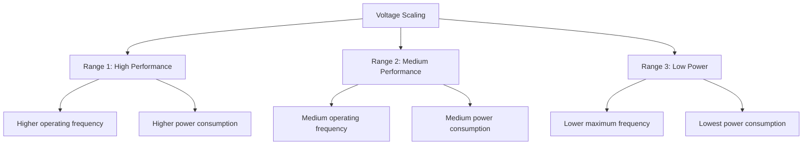

# STM32 Voltage Scaling

## Introduction

Voltage scaling is a powerful technique in STM32 microcontrollers that allows you to adjust the operating voltage of the CPU and other digital peripherals to optimize power consumption. By reducing the voltage supplied to these components when maximum performance isn't needed, you can significantly extend battery life in portable applications or reduce energy consumption in mains-powered devices.

This technique is particularly valuable for battery-powered IoT devices, wearables, sensor nodes, and any application where power efficiency is a priority. In this tutorial, we'll explore how voltage scaling works in STM32 microcontrollers, when to use it, and how to implement it in your projects.

## Understanding Voltage Scaling

### What is Voltage Scaling?

Voltage scaling refers to the ability to dynamically adjust the operating voltage of the CPU and digital peripherals. The fundamental principle is simple: lower operating voltage leads to lower power consumption, following the power equation:

$$P = C \times V^2 \times f$$

Where:
- P is power consumption
- C is capacitance (fixed for a given device)
- V is voltage
- f is frequency

Note that power consumption scales **quadratically** with voltage, making voltage reduction a highly effective way to save energy.

### Voltage Scaling in STM32

STM32 microcontrollers typically offer multiple voltage scaling modes, which are often labeled as:

1. **Range 1**: Highest performance, highest power consumption
2. **Range 2**: Medium performance, reduced power consumption
3. **Range 3**: Lowest performance, lowest power consumption

The specific ranges and their exact implications vary between STM32 families. For example:



Let's look at how voltage scaling ranges affect the STM32L4 series as an example:

| Voltage Range | Max CPU Frequency | Relative Power | Use Case |
|---------------|-------------------|----------------|----------|
| Range 1       | 80 MHz            | Highest        | Performance-critical tasks |
| Range 2       | 26 MHz            | Medium         | Balanced performance/power |
| Range 3       | 2 MHz             | Lowest         | Ultra-low-power scenarios |

## Implementation Guide

Now, let's explore how to implement voltage scaling in your STM32 projects.

### Prerequisites

Before using voltage scaling:

1. Understand your application's performance requirements
2. Be aware of how frequency limits change with voltage scaling
3. Have STM32CubeIDE or equivalent setup with the appropriate HAL libraries

### Basic Implementation

Here's how to configure voltage scaling using the HAL library in STM32CubeIDE:

```c
/* Configure the main internal regulator output voltage */
HAL_PWREx_ControlVoltageScaling(PWR_REGULATOR_VOLTAGE_SCALE1); // Highest performance

// Or for lower power consumption:
// HAL_PWREx_ControlVoltageScaling(PWR_REGULATOR_VOLTAGE_SCALE2);
// Or for lowest power (with reduced max frequency):
// HAL_PWREx_ControlVoltageScaling(PWR_REGULATOR_VOLTAGE_SCALE3);
```

This code is typically placed in the system clock configuration function.

### Complete Example: Dynamic Voltage Scaling

Let's create a more comprehensive example that dynamically switches between voltage scaling levels based on processing needs:

```c
#include "main.h"

/* Private function prototypes */
void SystemClock_Config(void);
void ConfigureVoltageScaling(uint32_t VoltageScaling);
void PerformLightTask(void);
void PerformHeavyTask(void);

int main(void)
{
  /* Reset of all peripherals, initialize the Flash interface and the Systick */
  HAL_Init();

  /* Configure the system clock for high performance */
  SystemClock_Config();
  
  /* Initialize LED */
  BSP_LED_Init(LED2);
  
  while (1)
  {
    /* For light processing tasks, use lower voltage */
    ConfigureVoltageScaling(PWR_REGULATOR_VOLTAGE_SCALE2);
    PerformLightTask();
    
    /* For heavy processing tasks, use higher voltage */
    ConfigureVoltageScaling(PWR_REGULATOR_VOLTAGE_SCALE1);
    PerformHeavyTask();
    
    /* Return to low power */
    ConfigureVoltageScaling(PWR_REGULATOR_VOLTAGE_SCALE2);
    
    /* Blink LED to indicate cycle completion */
    BSP_LED_Toggle(LED2);
    HAL_Delay(1000);
  }
}

/**
  * @brief  Configure voltage scaling
  * @param  VoltageScaling: The desired voltage scaling level
  * @retval None
  */
void ConfigureVoltageScaling(uint32_t VoltageScaling)
{
  /* Switch to the required voltage scaling mode */
  HAL_PWREx_ControlVoltageScaling(VoltageScaling);
  
  /* Wait for voltage scaling to complete */
  while(PWR->SR2 & PWR_SR2_VOSF) {}
}

/**
  * @brief  Perform a light processing task
  * @retval None
  */
void PerformLightTask(void)
{
  /* Simple task that doesn't need full CPU performance */
  uint32_t i;
  volatile uint32_t dummy = 0;
  
  for(i = 0; i < 10000; i++)
  {
    dummy++;
  }
}

/**
  * @brief  Perform a heavy processing task
  * @retval None
  */
void PerformHeavyTask(void)
{
  /* Complex task that requires higher performance */
  uint32_t i;
  volatile uint32_t dummy = 0;
  
  for(i = 0; i < 1000000; i++)
  {
    dummy = (dummy * 1103515245 + 12345) % 0x7FFFFFFF;
  }
}
```

### Important Considerations

When implementing voltage scaling, keep these points in mind:

1. **Clock Frequency Limitations**: Each voltage range has a maximum allowed clock frequency. Exceeding this can cause unpredictable behavior.

2. **Transition Time**: Changing voltage scaling levels isn't instantaneous. Always check the VOSF (Voltage Scaling Flag) in the PWR_SR2 register to ensure the transition is complete.

3. **Peripheral Behavior**: Some peripherals may have different timing characteristics at lower voltage levels. Consult the datasheet for details.

4. **Flash Access Time**: You may need to adjust flash wait states when changing voltage scaling levels.

## Real-World Applications

Let's explore some practical applications of voltage scaling:

### Example 1: Battery-Powered Sensor Node

A sensor node that periodically wakes up, measures data, transmits it, and goes back to sleep can benefit greatly from voltage scaling:

```c
#include "main.h"

int main(void)
{
  /* Initialize system */
  HAL_Init();
  SystemClock_Config();
  
  /* Initialize peripherals */
  InitializeSensor();
  InitializeRadio();
  
  while (1)
  {
    /* Sleep in low power mode */
    ConfigureVoltageScaling(PWR_REGULATOR_VOLTAGE_SCALE3);
    EnterStopMode();
    
    /* Wake up, configure medium voltage for sensor reading */
    ConfigureVoltageScaling(PWR_REGULATOR_VOLTAGE_SCALE2);
    uint32_t sensorData = ReadSensor();
    
    /* Switch to high performance for radio transmission */
    ConfigureVoltageScaling(PWR_REGULATOR_VOLTAGE_SCALE1);
    TransmitData(sensorData);
    
    /* Return to low power */
    ConfigureVoltageScaling(PWR_REGULATOR_VOLTAGE_SCALE3);
  }
}
```

This approach can dramatically extend battery life, potentially from days to months or even years, depending on the duty cycle.

### Example 2: Adaptive Performance in a Portable Medical Device

A portable ECG monitor might use voltage scaling to adapt to different monitoring modes:

```c
#include "main.h"

typedef enum {
  MODE_STANDBY,
  MODE_BASIC_MONITORING,
  MODE_HIGH_RESOLUTION,
  MODE_ALARM
} DeviceMode_t;

void SetOperatingMode(DeviceMode_t mode)
{
  switch (mode)
  {
    case MODE_STANDBY:
      /* Minimum processing, lowest power */
      HAL_PWREx_ControlVoltageScaling(PWR_REGULATOR_VOLTAGE_SCALE3);
      SetSamplingRate(10); // 10 Hz
      break;
    
    case MODE_BASIC_MONITORING:
      /* Regular monitoring, balanced power */
      HAL_PWREx_ControlVoltageScaling(PWR_REGULATOR_VOLTAGE_SCALE2);
      SetSamplingRate(100); // 100 Hz
      break;
    
    case MODE_HIGH_RESOLUTION:
      /* Detailed analysis, high performance */
      HAL_PWREx_ControlVoltageScaling(PWR_REGULATOR_VOLTAGE_SCALE1);
      SetSamplingRate(500); // 500 Hz
      break;
    
    case MODE_ALARM:
      /* Critical situation, maximum performance */
      HAL_PWREx_ControlVoltageScaling(PWR_REGULATOR_VOLTAGE_SCALE1);
      SetSamplingRate(1000); // 1 kHz
      ActivateAlarm();
      break;
  }
  
  /* Wait for voltage scaling to complete */
  while(PWR->SR2 & PWR_SR2_VOSF) {}
}
```

This approach ensures that the device uses only the necessary power for each operating mode, extending battery life while still providing high performance when needed.

## Power Measurement Results

To illustrate the impact of voltage scaling, here are typical current consumption measurements from an STM32L476 running at different voltage scales (values are approximate and will vary between specific devices):

| Operating Mode | Voltage Scale | Frequency | Current Consumption |
|----------------|--------------|-----------|---------------------|
| Run            | Scale 1      | 80 MHz    | 9.50 mA             |
| Run            | Scale 2      | 26 MHz    | 3.80 mA             |
| Run            | Scale 3      | 2 MHz     | 0.95 mA             |

As you can see, the power savings are substantial. By dynamically adjusting the voltage scaling based on your application's current processing needs, you can achieve an optimal balance between performance and power consumption.

## Advanced Topics

### Combining Voltage Scaling with Other Low-Power Techniques

For maximum power efficiency, voltage scaling should be used alongside other STM32 low-power features:

1. **Clock Gating**: Disable clocks to unused peripherals
2. **Sleep Modes**: Enter low-power sleep modes when possible
3. **Low-Power Run Mode**: Use with voltage scaling for minimal consumption during active periods
4. **Peripheral Low-Power Modes**: Configure peripherals for low-power operation

Here's an example that combines these techniques:

```c
void EnterUltraLowPowerMode(void)
{
  /* Configure minimum voltage */
  HAL_PWREx_ControlVoltageScaling(PWR_REGULATOR_VOLTAGE_SCALE3);
  
  /* Disable unused peripherals */
  __HAL_RCC_GPIOA_CLK_DISABLE();
  __HAL_RCC_GPIOB_CLK_DISABLE();
  /* Keep only essential peripherals enabled */
  
  /* Configure low-power run mode */
  HAL_PWREx_EnableLowPowerRunMode();
  
  /* Reduce system clock */
  SystemClock_ConfigLowPower(); // Configure system to run at minimum frequency
}
```

### Voltage Scaling and Temperature Considerations

The behavior of voltage scaling can be affected by temperature. At extreme temperatures, you might need to adjust your voltage scaling strategy:

- At high temperatures, leakage current increases
- At low temperatures, devices might require higher voltage for reliable operation

Consider incorporating temperature monitoring and adaptive voltage scaling for applications that operate in extreme environments.

## Summary

Voltage scaling is a powerful technique for optimizing power consumption in STM32 microcontrollers. By dynamically adjusting the operating voltage based on performance needs, you can significantly extend battery life while maintaining the ability to deliver high performance when required.

Key takeaways:

1. Voltage scaling offers multiple ranges with different performance/power tradeoffs
2. Power consumption scales quadratically with voltage, making this highly effective
3. Always respect the maximum frequency limitations for each voltage range
4. Wait for voltage transitions to complete before changing clock frequencies
5. Combine voltage scaling with other low-power techniques for maximum efficiency

By mastering voltage scaling, you can design STM32-based applications that are not only powerful but also energy-efficient, extending battery life and reducing environmental impact.

## Exercises

1. **Basic Implementation**: Configure an STM32 project to use voltage scaling level 2 and measure the power consumption difference compared to the default level.

2. **Dynamic Switching**: Create a program that switches between voltage scaling levels based on a button press, toggling an LED at different speeds to demonstrate the performance differences.

3. **Power Optimization Challenge**: Design a battery-powered temperature sensor that wakes up every minute, reads the temperature, transmits it via UART, and returns to sleep. Use voltage scaling to optimize power consumption at each stage.

4. **Advanced**: Implement a system that monitors its own processing load and automatically adjusts voltage scaling to maintain the optimal balance between performance and power consumption.

## Additional Resources

- [STM32L4 Series Reference Manual](https://www.st.com) - Section on Power Control (PWR)
- [AN4621: STM32L4 Series ultra-low-power features overview](https://www.st.com)
- [STM32CubeL4 HAL PWR Driver Documentation](https://www.st.com)