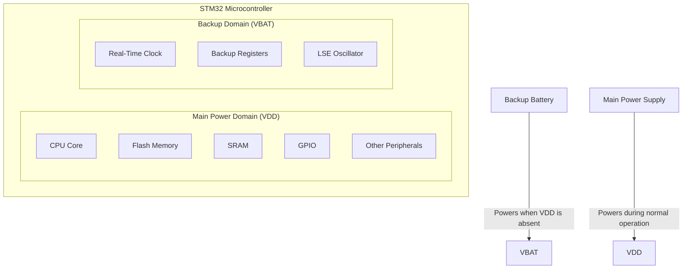

# STM32 Backup Domain

## Introduction

The STM32 Backup Domain is a special power domain within STM32 microcontrollers that remains active even when the main power supply is turned off. This critical feature allows certain peripherals and memory to continue functioning during power-down states, making it essential for applications requiring data retention, real-time clock functionality, and ultra-low power consumption.

In this guide, we'll explore how the Backup Domain works, its key components, how to configure it, and practical applications that leverage this powerful feature in real-world scenarios.

## What is the Backup Domain?

The Backup Domain (BKP Domain) is a separate power domain within STM32 microcontrollers that can be powered by a dedicated battery (VBAT) when the main VDD supply is off. This isolation allows critical functions to continue operating even when the rest of the microcontroller is powered down.



### Key Components of the Backup Domain

1. **Real-Time Clock (RTC)**: Maintains accurate time and date information even when the main power is off.
2. **Backup Registers**: Special registers that retain their data during power cycles.
3. **Low-Speed External (LSE) Oscillator**: A 32.768 kHz crystal oscillator that provides a clock source for the RTC.
4. **VBAT Pin**: Connection for an external backup battery that powers the Backup Domain when main power is off.

## Powering the Backup Domain

The Backup Domain can be powered in two ways:

1. **Normal operation**: Powered by the main VDD supply.
2. **Backup operation**: Powered by a battery connected to the VBAT pin when VDD is off.

For backup operation, a typical setup uses a 3V coin cell battery (CR2032) connected to the VBAT pin with appropriate protective components.

### Typical VBAT Circuit

```
VDD -----|>|--+--[R]--- VBAT
             |
  Battery ---+
             |
           GND
```

Where:
- The diode prevents current flow from the battery to VDD when VDD is present
- The resistor (typically 1kΩ) limits current during transitions
- The battery (typically 3V CR2032) powers the Backup Domain when VDD is absent

## Backup Registers

Backup registers are special-purpose registers that retain their values as long as the Backup Domain is powered. They can store critical data that needs to survive power cycles.

Depending on the specific STM32 model, there may be 5, 10, 20, or more backup registers available, each typically 16 or 32 bits wide.

### Accessing Backup Registers

Before accessing backup registers, you need to:

1. Enable the Power Controller (PWR) and Backup interface clock
2. Enable write access to the Backup Domain

Here's a simple example of storing and retrieving data using backup registers:

```c
// Enable access to backup domain
void EnableBackupDomainAccess(void) {
  // Enable PWR and Backup interface clocks
  RCC->APB1ENR |= RCC_APB1ENR_PWREN | RCC_APB1ENR_BKPEN;
  
  // Enable access to Backup domain
  PWR->CR |= PWR_CR_DBP;
}

// Store a value in backup register 1
void StoreBackupData(uint16_t data) {
  EnableBackupDomainAccess();
  BKP->DR1 = data;
}

// Read a value from backup register 1
uint16_t ReadBackupData(void) {
  EnableBackupDomainAccess();
  return BKP->DR1;
}
```

## Real-Time Clock (RTC)

The RTC is a key component of the Backup Domain that provides accurate timekeeping even during power-down states. It can generate alarms at specific times and can be used to wake up the microcontroller from low-power modes.

### RTC Clock Sources

The RTC can be clocked from three possible sources:

1. **LSE (Low-Speed External)**: 32.768 kHz external crystal - most accurate, recommended for production
2. **LSI (Low-Speed Internal)**: Internal RC oscillator (~40 kHz) - less accurate but doesn't require external components
3. **HSE/128**: High-Speed External clock divided by 128 - accurate but higher power consumption

### Configuring the RTC

Here's a step-by-step example of configuring the RTC using the LSE clock source:

```c
void ConfigureRTC(void) {
  // Enable access to Backup domain
  EnableBackupDomainAccess();
  
  // Check if RTC is already configured (first time after power-on)
  if (BKP->DR1 != 0x5A5A) {
    // Reset Backup Domain
    RCC->BDCR |= RCC_BDCR_BDRST;
    RCC->BDCR &= ~RCC_BDCR_BDRST;
    
    // Enable LSE
    RCC->BDCR |= RCC_BDCR_LSEON;
    // Wait until LSE is ready
    while (!(RCC->BDCR & RCC_BDCR_LSERDY));
    
    // Select LSE as RTC clock source
    RCC->BDCR |= RCC_BDCR_RTCSEL_LSE;
    
    // Enable RTC clock
    RCC->BDCR |= RCC_BDCR_RTCEN;
    
    // Wait for RTC registers sync
    RTC->CRL &= ~RTC_CRL_RSF;
    while (!(RTC->CRL & RTC_CRL_RSF));
    
    // Wait until last write operation is finished
    while (!(RTC->CRL & RTC_CRL_RTOFF));
    
    // Enter configuration mode
    RTC->CRL |= RTC_CRL_CNF;
    
    // Set prescaler for 32.768 kHz LSE (32768Hz / (32767+1) = 1Hz)
    RTC->PRLH = 0;
    RTC->PRLL = 0x7FFF;
    
    // Set initial time (e.g., to 0)
    RTC->CNTH = 0;
    RTC->CNTL = 0;
    
    // Exit configuration mode
    RTC->CRL &= ~RTC_CRL_CNF;
    
    // Wait until write is complete
    while (!(RTC->CRL & RTC_CRL_RTOFF));
    
    // Mark RTC as configured
    BKP->DR1 = 0x5A5A;
  } else {
    // RTC already configured, just wait for synchronization
    RTC->CRL &= ~RTC_CRL_RSF;
    while (!(RTC->CRL & RTC_CRL_RSF));
  }
}
```

### Setting and Reading RTC Time

```c
// Set RTC counter value (seconds since reference point)
void SetRTCTime(uint32_t seconds) {
  // Wait until last write operation is finished
  while (!(RTC->CRL & RTC_CRL_RTOFF));
  
  // Enter configuration mode
  RTC->CRL |= RTC_CRL_CNF;
  
  // Set time
  RTC->CNTH = seconds >> 16;
  RTC->CNTL = seconds & 0xFFFF;
  
  // Exit configuration mode
  RTC->CRL &= ~RTC_CRL_CNF;
  
  // Wait until write is complete
  while (!(RTC->CRL & RTC_CRL_RTOFF));
}

// Get current RTC counter value
uint32_t GetRTCTime(void) {
  uint16_t high1, high2, low;
  
  // Read process for ensuring consistency
  do {
    high1 = RTC->CNTH;
    low = RTC->CNTL;
    high2 = RTC->CNTH;
  } while (high1 != high2);
  
  return ((uint32_t)high1 << 16) | low;
}
```

### RTC Alarm Configuration

The RTC can generate an alarm when the counter reaches a specified value:

```c
// Set RTC alarm to trigger after specified number of seconds
void SetRTCAlarm(uint32_t seconds) {
  uint32_t alarmTime = GetRTCTime() + seconds;
  
  // Wait until last write operation is finished
  while (!(RTC->CRL & RTC_CRL_RTOFF));
  
  // Enter configuration mode
  RTC->CRL |= RTC_CRL_CNF;
  
  // Set alarm value
  RTC->ALRH = alarmTime >> 16;
  RTC->ALRL = alarmTime & 0xFFFF;
  
  // Exit configuration mode
  RTC->CRL &= ~RTC_CRL_CNF;
  
  // Wait until write is complete
  while (!(RTC->CRL & RTC_CRL_RTOFF));
  
  // Enable alarm interrupt
  RTC->CRH |= RTC_CRH_ALRIE;
}
```

## Tamper Detection

Some STM32 models include a tamper detection feature that can automatically erase backup registers if tampering is detected. This is useful for security-critical applications.

```c
void ConfigureTamperDetection(void) {
  EnableBackupDomainAccess();
  
  // Configure tamper pin as input with pull-up
  BKP->CR |= BKP_CR_TPE | BKP_CR_TPAL;
  
  // Enable tamper interrupt
  BKP->CSR |= BKP_CSR_TPIE;
  
  // Enable tamper interrupt in NVIC
  NVIC_EnableIRQ(TAMPER_IRQn);
}

// Tamper interrupt handler
void TAMPER_IRQHandler(void) {
  if (BKP->CSR & BKP_CSR_TEF) {
    // Tamper event detected - handle security breach
    // Backup registers are automatically cleared
    
    // Clear tamper event flag
    BKP->CSR |= BKP_CSR_CTF;
  }
}
```

## Practical Applications

### Application 1: Simple Data Retention

This example demonstrates how to use backup registers to remember the number of times a device has been powered on:

```c
void BootCounter(void) {
  EnableBackupDomainAccess();
  
  // Read current boot count
  uint16_t bootCount = BKP->DR1;
  
  // Increment boot count
  bootCount++;
  
  // Store new boot count
  BKP->DR1 = bootCount;
  
  printf("This device has been powered on %d times
", bootCount);
}
```

### Application 2: Power-Failure Detection with Timestamp

This example uses the RTC and backup registers to log when power failures occur:

```c
#define POWER_FAILURE_COUNT_REG  BKP->DR1
#define LAST_FAILURE_TIME_REG_H  BKP->DR2
#define LAST_FAILURE_TIME_REG_L  BKP->DR3

void SystemInit(void) {
  EnableBackupDomainAccess();
  ConfigureRTC();
  
  // Check if last shutdown was unexpected
  if (BKP->DR4 != 0xDEAD) {
    // Unexpected shutdown detected
    uint16_t failureCount = POWER_FAILURE_COUNT_REG;
    failureCount++;
    POWER_FAILURE_COUNT_REG = failureCount;
    
    // Store timestamp of power failure (which is when we booted up again)
    uint32_t currentTime = GetRTCTime();
    LAST_FAILURE_TIME_REG_H = (currentTime >> 16);
    LAST_FAILURE_TIME_REG_L = (currentTime & 0xFFFF);
    
    printf("Power failure detected! Total failures: %d
", failureCount);
  }
  
  // Mark normal boot
  BKP->DR4 = 0xDEAD;
}

void PrepareForShutdown(void) {
  // Clear normal shutdown marker to detect unexpected shutdowns
  BKP->DR4 = 0;
}
```

### Application 3: Battery-Backed Data Logger with RTC Wake-up

This example shows how to use the RTC alarm to wake the MCU from standby mode for periodic data logging:

```c
void ConfigureDataLogger(uint32_t loggingInterval) {
  EnableBackupDomainAccess();
  ConfigureRTC();
  
  // Store logging configuration in backup registers
  BKP->DR5 = loggingInterval & 0xFFFF;
  BKP->DR6 = (loggingInterval >> 16) & 0xFFFF;
  
  // Store log entry counter
  if (BKP->DR7 == 0xFFFF) { // First time initialization
    BKP->DR7 = 0; // Start count at 0
  }
}

void LogDataPoint(float temperature) {
  // Read log counter
  uint16_t logCount = BKP->DR7;
  
  // Get current time
  uint32_t timestamp = GetRTCTime();
  
  // Log data to external storage or transmit wirelessly
  printf("Log #%d at time %lu: Temperature %.2f°C
", logCount, timestamp, temperature);
  
  // Increment log counter
  logCount++;
  BKP->DR7 = logCount;
  
  // Retrieve logging interval
  uint32_t interval = (uint32_t)BKP->DR5 | ((uint32_t)BKP->DR6 << 16);
  
  // Set next alarm
  SetRTCAlarm(interval);
  
  // Prepare to enter standby mode
  // ...
  // Enter standby mode - MCU will be woken up when RTC alarm triggers
  PWR->CR |= PWR_CR_CWUF;
  PWR->CR |= PWR_CR_PDDS;
  SCB->SCR |= SCB_SCR_SLEEPDEEP_Msk;
  
  __WFI(); // Wait For Interrupt - enter standby mode
}

// RTC alarm interrupt handler
void RTC_Alarm_IRQHandler(void) {
  // Clear RTC alarm flag
  RTC->CRL &= ~RTC_CRL_ALRF;
  
  // Exit standby mode and continue execution
  // System will reset and run main code that should check for alarm wakeup
}

// Check if we woke up from RTC alarm
bool IsRTCWakeup(void) {
  return (PWR->CSR & PWR_CSR_WUF) && (RCC->BDCR & RCC_BDCR_RTCEN);
}
```

## Best Practices and Considerations

1. **Battery Selection**
   - Lithium coin cells (CR2032, CR2025) are common choices for backup batteries
   - Consider battery lifetime - a CR2032 can power the Backup Domain for several years
   - For longer life applications, consider rechargeable options with charging circuits

2. **Current Consumption**
   - The Backup Domain typically consumes 1-2 µA when powered by VBAT
   - Using LSE increases current consumption by about 1 µA
   - Optimize usage to extend battery life

3. **Data Integrity**
   - Use checksums or CRCs to validate data stored in backup registers
   - Implement redundancy for critical values (store in multiple registers)
   - Consider encryption for sensitive data

4. **Clock Accuracy**
   - LSE provides the best accuracy but requires an external crystal
   - Consider temperature impacts on timing accuracy
   - For precise timekeeping, periodic calibration may be necessary

5. **Reset Behavior**
   - System reset does not affect the Backup Domain
   - Only a Backup Domain reset or power loss to VBAT will clear backup registers
   - Be careful with debug settings that might reset the Backup Domain

## Summary

The STM32 Backup Domain is a powerful feature that enables critical functionality to continue operating even when the main power is off. Key takeaways:

- The Backup Domain contains the RTC, backup registers, and LSE oscillator
- It can be powered by a backup battery through the VBAT pin
- It's essential for applications requiring timekeeping, data retention, and low power operation
- Proper configuration is necessary to ensure reliable operation
- A variety of practical applications can leverage this feature, from simple boot counting to sophisticated power-aware data logging

By understanding and utilizing the Backup Domain effectively, you can create STM32-based applications that maintain critical functionality even through power cycles, enhancing reliability and enabling new power-efficient use cases.

## Practice Exercises

1. **Basic Exercise**: Implement a program that counts and displays the number of times an STM32 board has been reset.

2. **Intermediate Exercise**: Create a simple digital clock using the RTC that maintains time even when power is removed.

3. **Advanced Exercise**: Design a power-failure logging system that records the time of power failures and the duration the system was without power.

4. **Challenge**: Implement a battery-powered data logger that wakes up periodically, reads a sensor, and goes back to sleep, optimizing for maximum battery life.

## Additional Resources

- STM32 Reference Manuals - Refer to the specific sections on RTC, Power Control, and Backup Domain
- STM32 Low Power Application Notes (AN4633, AN2867)
- HAL Library Documentation for RTC and Backup Domain functions