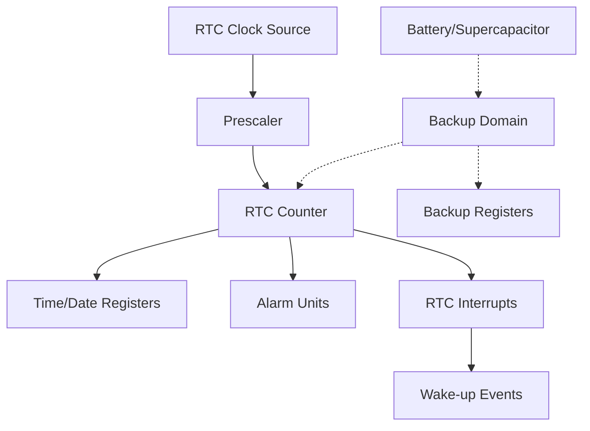

# STM32 RTC Basics

## Introduction

The Real-Time Clock (RTC) is a crucial peripheral in STM32 microcontrollers that provides accurate timekeeping and calendar functionality. Unlike regular timers, the RTC continues operating even when the main power is off, thanks to a backup power supply (typically a battery or supercapacitor). This makes it ideal for applications requiring persistent time information, such as data logging, alarm systems, and IoT devices.

In this tutorial, we'll explore the basics of the STM32 RTC peripheral, its configuration, and practical applications. By the end, you'll understand how to implement reliable timekeeping solutions in your STM32 projects.

## RTC Architecture

The STM32 RTC peripheral includes:

1. **Time and Date Registers**: Store current time and date information
2. **Backup Registers**: Non-volatile memory for custom data
3. **Alarm Units**: Configurable to trigger events at specific times
4. **Digital Calibration**: For improving timekeeping accuracy
5. **Timestamp**: Records the time of specific events

Here's a simplified diagram of the RTC architecture:



## RTC Clock Sources

The RTC requires a precise, low-frequency clock source. STM32 microcontrollers offer several options:

1. **LSE (Low-Speed External)**: Typically a 32.768 kHz crystal oscillator - most accurate
2. **LSI (Low-Speed Internal)**: Internal RC oscillator (~32 kHz, less accurate but doesn't require external components)
3. **HSE (High-Speed External)**: External crystal with a divider (rarely used for RTC)

The LSE is preferred for applications requiring high accuracy, as it provides a stable 32.768 kHz frequency that easily divides into a 1-second timebase.

## Basic RTC Configuration

Let's see how to configure the RTC using STM32CubeMX and the HAL library:

### Configuration in STM32CubeMX

1. Enable the RTC peripheral in the "Timers" section
2. Select the appropriate clock source (LSE recommended)
3. Configure date and time format (24h/AM-PM)
4. Set initial date and time values if needed

### RTC Initialization Code

```c
// RTC handle declaration
RTC_HandleTypeDef hrtc;

// RTC initialization function
void MX_RTC_Init(void)
{
  /** Initialize RTC Only 
  */
  hrtc.Instance = RTC;
  hrtc.Init.HourFormat = RTC_HOURFORMAT_24;
  hrtc.Init.AsynchPrediv = 127;
  hrtc.Init.SynchPrediv = 255;
  hrtc.Init.OutPut = RTC_OUTPUT_DISABLE;
  hrtc.Init.OutPutRemap = RTC_OUTPUT_REMAP_NONE;
  hrtc.Init.OutPutPolarity = RTC_OUTPUT_POLARITY_HIGH;
  hrtc.Init.OutPutType = RTC_OUTPUT_TYPE_OPENDRAIN;
  
  if (HAL_RTC_Init(&hrtc) != HAL_OK)
  {
    Error_Handler();
  }
  
  // Set initial date and time if needed (first time configuration)
  if (HAL_RTCEx_BKUPRead(&hrtc, RTC_BKP_DR0) != 0x32F2)
  {
    RTC_TimeTypeDef sTime = {0};
    RTC_DateTypeDef sDate = {0};
    
    sTime.Hours = 12;
    sTime.Minutes = 30;
    sTime.Seconds = 0;
    sTime.DayLightSaving = RTC_DAYLIGHTSAVING_NONE;
    sTime.StoreOperation = RTC_STOREOPERATION_RESET;
    
    if (HAL_RTC_SetTime(&hrtc, &sTime, RTC_FORMAT_BIN) != HAL_OK)
    {
      Error_Handler();
    }
    
    sDate.WeekDay = RTC_WEEKDAY_MONDAY;
    sDate.Month = RTC_MONTH_JANUARY;
    sDate.Date = 1;
    sDate.Year = 23;  // 2023
    
    if (HAL_RTC_SetDate(&hrtc, &sDate, RTC_FORMAT_BIN) != HAL_OK)
    {
      Error_Handler();
    }
    
    // Write a backup register to indicate RTC is initialized
    HAL_RTCEx_BKUPWrite(&hrtc, RTC_BKP_DR0, 0x32F2);
  }
}
```

### Clock Configuration in HAL_RTC_MspInit

```c
void HAL_RTC_MspInit(RTC_HandleTypeDef* rtcHandle)
{
  RCC_OscInitTypeDef RCC_OscInitStruct = {0};
  RCC_PeriphCLKInitTypeDef PeriphClkInit = {0};
  
  // Configure LSE as RTC clock source
  RCC_OscInitStruct.OscillatorType = RCC_OSCILLATORTYPE_LSE;
  RCC_OscInitStruct.LSEState = RCC_LSE_ON;
  RCC_OscInitStruct.PLL.PLLState = RCC_PLL_NONE;
  if (HAL_RCC_OscConfig(&RCC_OscInitStruct) != HAL_OK)
  {
    Error_Handler();
  }
    
  // Select LSE as RTC clock source
  PeriphClkInit.PeriphClockSelection = RCC_PERIPHCLK_RTC;
  PeriphClkInit.RTCClockSelection = RCC_RTCCLKSOURCE_LSE;
  if (HAL_RCCEx_PeriphCLKConfig(&PeriphClkInit) != HAL_OK)
  {
    Error_Handler();
  }

  // Enable RTC Clock
  __HAL_RCC_RTC_ENABLE();
}
```

## Reading Time and Date

Once the RTC is configured, you can read the current time and date using the HAL library:

```c
void printCurrentTime(void)
{
  RTC_TimeTypeDef sTime;
  RTC_DateTypeDef sDate;
  
  // Get the current Time and Date
  HAL_RTC_GetTime(&hrtc, &sTime, RTC_FORMAT_BIN);
  HAL_RTC_GetDate(&hrtc, &sDate, RTC_FORMAT_BIN);
  
  // Format and print time
  printf("Current Time: %02d:%02d:%02d\r
", 
         sTime.Hours, sTime.Minutes, sTime.Seconds);
  
  // Format and print date
  const char* weekdays[] = {"Monday", "Tuesday", "Wednesday", "Thursday", "Friday", "Saturday", "Sunday"};
  const char* months[] = {"January", "February", "March", "April", "May", "June", "July", 
                          "August", "September", "October", "November", "December"};
  
  printf("Current Date: %s, %s %d, 20%02d\r
", 
         weekdays[sDate.WeekDay - 1], months[sDate.Month - 1], sDate.Date, sDate.Year);
}
```

**Important note**: When reading the RTC, always read the time first, then the date. The HAL_RTC_GetDate function updates the shadow registers.

## Setting RTC Alarms

The STM32 RTC can generate alarms at specific times. Here's how to configure an alarm:

```c
void setRTCAlarm(uint8_t hours, uint8_t minutes, uint8_t seconds)
{
  RTC_AlarmTypeDef sAlarm = {0};
  
  // Configure the alarm for the specified time
  sAlarm.AlarmTime.Hours = hours;
  sAlarm.AlarmTime.Minutes = minutes;
  sAlarm.AlarmTime.Seconds = seconds;
  sAlarm.AlarmTime.SubSeconds = 0;
  sAlarm.AlarmTime.DayLightSaving = RTC_DAYLIGHTSAVING_NONE;
  sAlarm.AlarmTime.StoreOperation = RTC_STOREOPERATION_RESET;
  sAlarm.AlarmMask = RTC_ALARMMASK_DATEWEEKDAY; // Ignore date/weekday for daily alarm
  sAlarm.AlarmSubSecondMask = RTC_ALARMSUBSECONDMASK_ALL;
  sAlarm.AlarmDateWeekDaySel = RTC_ALARMDATEWEEKDAYSEL_DATE;
  sAlarm.AlarmDateWeekDay = 1;
  sAlarm.Alarm = RTC_ALARM_A;
  
  // Set and enable the alarm
  if (HAL_RTC_SetAlarm_IT(&hrtc, &sAlarm, RTC_FORMAT_BIN) != HAL_OK)
  {
    Error_Handler();
  }
}

// Alarm callback
void HAL_RTC_AlarmAEventCallback(RTC_HandleTypeDef *hrtc)
{
  // This function is called when the alarm triggers
  // Add your alarm handling code here
  HAL_GPIO_TogglePin(LED_GPIO_Port, LED_Pin); // Toggle an LED
  printf("Alarm triggered!\r
");
}
```

You'll also need to configure the NVIC for RTC Alarm interrupts:

```c
// In HAL_RTC_MspInit
HAL_NVIC_SetPriority(RTC_Alarm_IRQn, 0, 0);
HAL_NVIC_EnableIRQ(RTC_Alarm_IRQn);
```

## Using RTC Wake-up Timer

The RTC wake-up timer can periodically wake up the microcontroller from low-power modes:

```c
void configureRTCWakeup(uint32_t seconds)
{
  // The wake-up timer clock is typically RTC/16 (2048 Hz with a 32768 Hz LSE)
  // WakeUpCounter = seconds * (32768 / 16)
  uint32_t wakeupCounter = seconds * 2048;
  
  // Disable wake-up timer first
  HAL_RTCEx_DeactivateWakeUpTimer(&hrtc);
  
  // Configure wake-up timer with specified interval
  if (HAL_RTCEx_SetWakeUpTimer_IT(&hrtc, wakeupCounter, RTC_WAKEUPCLOCK_RTCCLK_DIV16) != HAL_OK)
  {
    Error_Handler();
  }
}

// Wake-up timer callback
void HAL_RTCEx_WakeUpTimerEventCallback(RTC_HandleTypeDef *hrtc)
{
  // This function is called when the wake-up timer triggers
  // Add your wake-up handling code here
  printf("RTC Wake-up event!\r
");
}
```

## Practical Example: Data Logger with Timestamp

Here's a practical example showing how to use the RTC in a data logging application:

```c
typedef struct {
  float temperature;
  float humidity;
  RTC_TimeTypeDef time;
  RTC_DateTypeDef date;
} SensorLog_t;

#define MAX_LOGS 100
SensorLog_t sensorLogs[MAX_LOGS];
uint32_t logIndex = 0;

void logSensorData(float temp, float humidity)
{
  if (logIndex >= MAX_LOGS) {
    printf("Error: Log buffer full\r
");
    return;
  }
  
  // Save sensor data
  sensorLogs[logIndex].temperature = temp;
  sensorLogs[logIndex].humidity = humidity;
  
  // Get and save current timestamp
  HAL_RTC_GetTime(&hrtc, &sensorLogs[logIndex].time, RTC_FORMAT_BIN);
  HAL_RTC_GetDate(&hrtc, &sensorLogs[logIndex].date, RTC_FORMAT_BIN);
  
  logIndex++;
  
  // Print confirmation
  printf("Data logged at %02d:%02d:%02d - Temp: %.1f°C, Humidity: %.1f%%\r
",
         sensorLogs[logIndex-1].time.Hours,
         sensorLogs[logIndex-1].time.Minutes,
         sensorLogs[logIndex-1].time.Seconds,
         temp, humidity);
}

// Call this function periodically or on an event
void sampleAndLogData(void)
{
  // Simulating sensor readings
  float temperature = 25.5f + ((float)rand() / RAND_MAX * 2.0f - 1.0f);
  float humidity = 60.0f + ((float)rand() / RAND_MAX * 5.0f - 2.5f);
  
  logSensorData(temperature, humidity);
}
```

## Backup Registers

STM32 RTC includes backup registers that retain their values even during power cycles (when backup power is available). These can store application-specific data:

```c
void saveSettingsToBackup(uint32_t userID, uint32_t configFlags)
{
  // Save user ID to backup register 1
  HAL_RTCEx_BKUPWrite(&hrtc, RTC_BKP_DR1, userID);
  
  // Save configuration flags to backup register 2
  HAL_RTCEx_BKUPWrite(&hrtc, RTC_BKP_DR2, configFlags);
}

void loadSettingsFromBackup(uint32_t *userID, uint32_t *configFlags)
{
  // Read values from backup registers
  *userID = HAL_RTCEx_BKUPRead(&hrtc, RTC_BKP_DR1);
  *configFlags = HAL_RTCEx_BKUPRead(&hrtc, RTC_BKP_DR2);
}
```

## Low-Power Considerations

The RTC is designed to operate in low-power modes:

1. **Sleep Mode**: CPU is stopped, but peripherals remain active. RTC continues to run.
2. **Stop Mode**: Most clocks are stopped, but RTC continues to operate.
3. **Standby Mode**: Almost everything is powered down, but RTC can remain active.

Example of using RTC to wake up from Stop mode:

```c
void enterLowPowerMode(void)
{
  // Configure RTC to wake up every 10 seconds
  configureRTCWakeup(10);
  
  printf("Entering Stop mode, will wake up in 10 seconds...\r
");
  HAL_Delay(100); // Allow serial message to be sent
  
  // Enter Stop mode
  HAL_PWR_EnterSTOPMode(PWR_LOWPOWERREGULATOR_ON, PWR_STOPENTRY_WFI);
  
  // Code continues here after wake-up
  SystemClock_Config(); // Restore system clock configuration
  printf("Woke up from Stop mode!\r
");
}
```

## Common Issues and Troubleshooting

1. **RTC not keeping time**: 
   - Check if the LSE is properly connected and oscillating
   - Verify backup power is connected (battery, supercapacitor)
   - Use a multimeter to check for 32.768 kHz at the LSE pins

2. **Time drifting over time**:
   - Use the RTC calibration feature to improve accuracy
   - Consider temperature effects on the crystal

3. **RTC configuration lost after reset**:
   - Ensure a backup register is written after initial configuration
   - Verify the backup power supply is functioning
   - Check that the RTC domain is not reset during debugging

## RTC Calibration

To improve RTC accuracy, STM32 provides a digital calibration feature:

```c
void calibrateRTC(int32_t ppm)
{
  // ppm: Parts per million correction factor
  // Positive values slow down the RTC clock
  // Negative values speed up the RTC clock
  // Range: -487.1 ppm to +488.5 ppm
  
  // Convert ppm to calibration value
  // Example: 20 ppm means add 20 clock cycles per 1,000,000 cycles
  
  if (ppm > 0) {
    // Slow down the clock (add cycles)
    HAL_RTCEx_SetSmoothCalib(&hrtc, RTC_SMOOTHCALIB_PERIOD_32SEC, RTC_SMOOTHCALIB_PLUSPULSES_SET, (uint32_t)((ppm * 512) / 1000000));
  } else {
    // Speed up the clock (remove cycles)
    HAL_RTCEx_SetSmoothCalib(&hrtc, RTC_SMOOTHCALIB_PERIOD_32SEC, RTC_SMOOTHCALIB_PLUSPULSES_RESET, (uint32_t)((-ppm * 512) / 1000000));
  }
}
```

## Summary

The STM32 RTC peripheral provides a reliable timekeeping solution for embedded applications. We've covered:

- RTC architecture and clock sources
- Basic configuration and initialization
- Reading and setting time/date
- Using alarms and wake-up timers
- Practical applications like data logging
- Backup registers for persistent storage
- Low-power considerations
- Troubleshooting and calibration

With this knowledge, you can now implement accurate timekeeping functions in your STM32 projects, even during power-off conditions. The RTC is particularly valuable for applications requiring timestamps, scheduled operations, or wake-up from low-power modes.

## Additional Resources and Exercises

### Resources
- STM32 Reference Manual for your specific device family
- AN4759: STM32 RTC hardware calendar application note
- STM32CubeF4/F7/L4/etc examples: 'RTC_Calendar' and 'RTC_Alarm'

### Exercises

1. **Basic RTC Clock**: Implement a digital clock that displays the current time and date on an LCD or via UART.

2. **Alarm Clock**: Create an alarm clock that triggers an LED and buzzer at a user-defined time.

3. **Data Logger**: Develop a temperature logger that records sensor readings with timestamps every hour and stores them in flash memory.

4. **Power-Efficient System**: Design a system that wakes up from Standby mode every 15 minutes, performs a measurement, and goes back to sleep.

5. **Time Synchronization**: Implement a function to synchronize the RTC with a time server via UART commands.

6. **Calendar Events**: Create a simple calendar application that stores and notifies about upcoming events using RTC alarms.