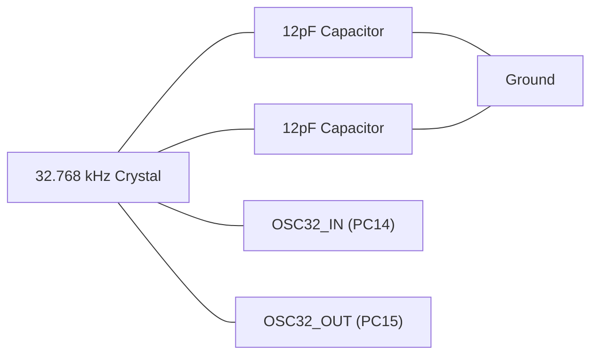

# STM32 RTC Configuration

## Introduction

The Real-Time Clock (RTC) is a vital peripheral in many embedded applications that require accurate timekeeping, date tracking, or timed events. The STM32 family of microcontrollers includes a sophisticated RTC peripheral that can maintain time and date even when the main power is off, using a backup battery or supercapacitor.

In this tutorial, we'll explore how to configure and use the RTC peripheral on STM32 microcontrollers, with practical examples to help you integrate this functionality into your projects.

## What is an RTC?

A Real-Time Clock is a computer clock that keeps track of the current time, even when the system's main power is off. Unlike the SysTick timer which is commonly used for generating millisecond delays, the RTC is designed specifically for timekeeping functions with:

- Calendar capabilities (date and time)
- Battery backup support
- Low power consumption
- Alarm functionality
- High accuracy with external crystals

## STM32 RTC Features

The STM32 RTC peripheral offers several key features:

- Calendar with hours, minutes, seconds, date, month, year, and weekday
- Automatic leap year correction
- Multiple clock sources (LSE, LSI, HSE)
- Programmable alarms
- Wakeup from low-power modes
- Digital calibration for improved accuracy
- Tamper detection
- Backup registers for storing data during power loss

## Hardware Requirements

To fully utilize the RTC functionality, you'll typically need:

- An STM32 microcontroller
- A 32.768 kHz crystal oscillator (for best accuracy)
- A backup power source (battery or supercapacitor)

Here's a typical connection diagram for the external crystal:



## Clock Sources for the RTC

The RTC can be clocked from three different sources:

1. **LSE (Low-Speed External)**: A 32.768 kHz crystal oscillator connected to OSC32_IN and OSC32_OUT pins
2. **LSI (Low-Speed Internal)**: An internal RC oscillator (~32 kHz or ~40 kHz depending on the STM32 model)
3. **HSE (High-Speed External)**: The main crystal divided by a prescaler

For accurate timekeeping, the LSE is strongly recommended as it provides a precise 32.768 kHz frequency. The LSI is less accurate but useful when no external crystal is available.

## Basic RTC Configuration

Let's start by configuring the RTC using STM32CubeMX and the HAL library. We'll then explore sample code to initialize the RTC, set the time and date, and read them back.

### Configuration with STM32CubeMX

1. Open your STM32CubeMX project
2. In the Pinout & Configuration tab, enable RTC under "Timers"
3. Configure the clock source (preferably LSE)
4. Configure the calendar format (Binary or BCD)
5. Set up the time and date initialization values (optional)
6. Configure backup domain if needed
7. Generate the code

### Initializing the RTC with HAL

The following code demonstrates how to initialize the RTC with the LSE clock source:

```c
RTC_HandleTypeDef hrtc;

void RTC_Init(void)
{
  RTC_TimeTypeDef sTime = {0};
  RTC_DateTypeDef sDate = {0};
  
  /* Enable Power Clock and access to the backup domain */
  __HAL_RCC_PWR_CLK_ENABLE();
  HAL_PWR_EnableBkUpAccess();
  
  /* Enable LSE Oscillator */
  RCC_OscInitTypeDef RCC_OscInitStruct = {0};
  RCC_OscInitStruct.OscillatorType = RCC_OSCILLATORTYPE_LSE;
  RCC_OscInitStruct.LSEState = RCC_LSE_ON;
  RCC_OscInitStruct.PLL.PLLState = RCC_PLL_NONE;
  if (HAL_RCC_OscConfig(&RCC_OscInitStruct) != HAL_OK)
  {
    Error_Handler();
  }
  
  /* Select LSE as RTC clock source */
  RCC_PeriphCLKInitTypeDef PeriphClkInitStruct = {0};
  PeriphClkInitStruct.PeriphClockSelection = RCC_PERIPHCLK_RTC;
  PeriphClkInitStruct.RTCClockSelection = RCC_RTCCLKSOURCE_LSE;
  if (HAL_RCCEx_PeriphCLKConfig(&PeriphClkInitStruct) != HAL_OK)
  {
    Error_Handler();
  }
  
  /* Enable RTC Clock */
  __HAL_RCC_RTC_ENABLE();
  
  /* Initialize RTC */
  hrtc.Instance = RTC;
  hrtc.Init.HourFormat = RTC_HOURFORMAT_24;
  hrtc.Init.AsynchPrediv = 127; // Divider for 32.768 kHz crystal
  hrtc.Init.SynchPrediv = 255;  // Combined with AsynchPrediv gives 1 Hz
  hrtc.Init.OutPut = RTC_OUTPUT_DISABLE;
  hrtc.Init.OutPutPolarity = RTC_OUTPUT_POLARITY_HIGH;
  hrtc.Init.OutPutType = RTC_OUTPUT_TYPE_OPENDRAIN;
  
  if (HAL_RTC_Init(&hrtc) != HAL_OK)
  {
    Error_Handler();
  }
  
  /* Initialize Time: 12:30:45 */
  sTime.Hours = 12;
  sTime.Minutes = 30;
  sTime.Seconds = 45;
  sTime.DayLightSaving = RTC_DAYLIGHTSAVING_NONE;
  sTime.StoreOperation = RTC_STOREOPERATION_RESET;
  if (HAL_RTC_SetTime(&hrtc, &sTime, RTC_FORMAT_BIN) != HAL_OK)
  {
    Error_Handler();
  }
  
  /* Initialize Date: March 12, 2023 (Sunday) */
  sDate.WeekDay = RTC_WEEKDAY_SUNDAY;
  sDate.Month = RTC_MONTH_MARCH;
  sDate.Date = 12;
  sDate.Year = 23; // 2023 - 2000
  if (HAL_RTC_SetDate(&hrtc, &sDate, RTC_FORMAT_BIN) != HAL_OK)
  {
    Error_Handler();
  }
}
```

### Setting and Getting Time and Date

To set the RTC time and date:

```c
void RTC_SetDateTime(uint8_t hours, uint8_t minutes, uint8_t seconds,
                     uint8_t day, uint8_t month, uint8_t year, uint8_t weekday)
{
  RTC_TimeTypeDef sTime = {0};
  RTC_DateTypeDef sDate = {0};
  
  /* Set Time */
  sTime.Hours = hours;
  sTime.Minutes = minutes;
  sTime.Seconds = seconds;
  sTime.DayLightSaving = RTC_DAYLIGHTSAVING_NONE;
  sTime.StoreOperation = RTC_STOREOPERATION_RESET;
  HAL_RTC_SetTime(&hrtc, &sTime, RTC_FORMAT_BIN);
  
  /* Set Date */
  sDate.WeekDay = weekday;
  sDate.Month = month;
  sDate.Date = day;
  sDate.Year = year;
  HAL_RTC_SetDate(&hrtc, &sDate, RTC_FORMAT_BIN);
}
```

To read the current time and date:

```c
void RTC_GetDateTime(RTC_TimeTypeDef *time, RTC_DateTypeDef *date)
{
  /* Get Time */
  HAL_RTC_GetTime(&hrtc, time, RTC_FORMAT_BIN);
  
  /* Get Date */
  HAL_RTC_GetDate(&hrtc, date, RTC_FORMAT_BIN);
}
```

## Time and Date Formatting

When working with the RTC, you'll often want to format the time and date for display purposes. Here's a simple function to convert RTC time into a formatted string:

```c
void RTC_GetTimeString(char *buffer)
{
  RTC_TimeTypeDef time;
  RTC_DateTypeDef date;
  
  /* Get Time and Date */
  HAL_RTC_GetTime(&hrtc, &time, RTC_FORMAT_BIN);
  HAL_RTC_GetDate(&hrtc, &date, RTC_FORMAT_BIN);
  
  /* Format as HH:MM:SS */
  sprintf(buffer, "%02d:%02d:%02d", time.Hours, time.Minutes, time.Seconds);
}

void RTC_GetDateString(char *buffer)
{
  RTC_TimeTypeDef time;
  RTC_DateTypeDef date;
  
  /* Get Time and Date */
  HAL_RTC_GetTime(&hrtc, &time, RTC_FORMAT_BIN);
  HAL_RTC_GetDate(&hrtc, &date, RTC_FORMAT_BIN);
  
  /* Get month name */
  const char *months[] = {"Jan", "Feb", "Mar", "Apr", "May", "Jun", 
                          "Jul", "Aug", "Sep", "Oct", "Nov", "Dec"};
  
  /* Format as DD-MMM-YYYY */
  sprintf(buffer, "%02d-%s-20%02d", date.Date, months[date.Month-1], date.Year);
}
```

## RTC Backup Registers

STM32 microcontrollers provide backup registers that remain powered even when the main power is off, as long as VBAT is connected to a battery or supercapacitor. These registers are useful for storing critical data or tracking system state across resets.

```c
/* Write to backup register */
void WriteBackupRegister(uint32_t registerIndex, uint32_t data)
{
  if (registerIndex < RTC_BKP_NUMBER)
  {
    HAL_RTCEx_BKUPWrite(&hrtc, registerIndex, data);
  }
}

/* Read from backup register */
uint32_t ReadBackupRegister(uint32_t registerIndex)
{
  if (registerIndex < RTC_BKP_NUMBER)
  {
    return HAL_RTCEx_BKUPRead(&hrtc, registerIndex);
  }
  return 0;
}
```

## RTC Alarms

The STM32 RTC provides alarm capabilities that can wake up the microcontroller from sleep modes. Here's how to configure an alarm for 7:30 AM every day:

```c
void RTC_SetAlarm(void)
{
  RTC_AlarmTypeDef sAlarm = {0};
  
  /* Configure Alarm A for 7:30 AM every day */
  sAlarm.AlarmTime.Hours = 7;
  sAlarm.AlarmTime.Minutes = 30;
  sAlarm.AlarmTime.Seconds = 0;
  sAlarm.AlarmTime.SubSeconds = 0;
  sAlarm.AlarmTime.DayLightSaving = RTC_DAYLIGHTSAVING_NONE;
  sAlarm.AlarmTime.StoreOperation = RTC_STOREOPERATION_RESET;
  sAlarm.AlarmMask = RTC_ALARMMASK_DATEWEEKDAY; // Ignore date/weekday (trigger every day)
  sAlarm.AlarmSubSecondMask = RTC_ALARMSUBSECONDMASK_ALL;
  sAlarm.AlarmDateWeekDaySel = RTC_ALARMDATEWEEKDAYSEL_DATE;
  sAlarm.AlarmDateWeekDay = 1;
  sAlarm.Alarm = RTC_ALARM_A;
  
  HAL_RTC_DeactivateAlarm(&hrtc, RTC_ALARM_A);
  if (HAL_RTC_SetAlarm_IT(&hrtc, &sAlarm, RTC_FORMAT_BIN) != HAL_OK)
  {
    Error_Handler();
  }
}
```

And to handle the alarm interrupt:

```c
void HAL_RTC_AlarmAEventCallback(RTC_HandleTypeDef *hrtc)
{
  /* This function is called when the alarm triggers */
  /* Perform your alarm action here */
  
  /* For example, toggle an LED */
  HAL_GPIO_TogglePin(LED_GPIO_Port, LED_Pin);
}
```

## Wakeup Timer

For periodic wakeups, the RTC provides a dedicated wakeup timer:

```c
void RTC_SetWakeupTimer(uint32_t seconds)
{
  /* Set wakeup timer to trigger every X seconds */
  /* RTC_WAKEUPCLOCK_CK_SPRE_16BITS = Clock divided by 16 */
  HAL_RTCEx_SetWakeUpTimer_IT(&hrtc, seconds, RTC_WAKEUPCLOCK_CK_SPRE_16BITS);
}

void HAL_RTCEx_WakeUpTimerEventCallback(RTC_HandleTypeDef *hrtc)
{
  /* This function is called when the wakeup timer triggers */
  /* Perform your wakeup action here */
}
```

## Power Management and RTC

One of the most valuable features of the RTC is its ability to operate in low-power modes and even wake up the microcontroller. Here's an example of entering STOP mode and waking up via the RTC:

```c
void EnterLowPowerMode(void)
{
  /* Set RTC wakeup timer for 10 seconds */
  RTC_SetWakeupTimer(10);
  
  /* Enter STOP mode */
  HAL_PWR_EnterSTOPMode(PWR_LOWPOWERREGULATOR_ON, PWR_STOPENTRY_WFI);
  
  /* System will resume from here after wakeup */
  /* Reconfigure system clock if needed */
  SystemClock_Config();
}
```

## RTC Calibration

For applications requiring high accuracy timekeeping, the STM32 RTC includes a digital calibration feature. This can compensate for crystal inaccuracies:

```c
void RTC_Calibrate(int32_t ppm)
{
  /* ppm: parts per million adjustment, positive or negative */
  /* Formula: (ppm * 32) / 1000000 */
  /* Valid range: -487.1 to +488.5 ppm */
  
  uint32_t calibrationPeriod = RTC_CALIBRATION_PERIOD_32SEC;
  int32_t calibrationValue;
  
  /* Calculate calibration value */
  calibrationValue = (ppm * 32) / 1000000;
  
  /* Apply calibration */
  HAL_RTCEx_SetSmoothCalib(&hrtc, calibrationPeriod, 0, abs(calibrationValue));
}
```

## Practical Example: Digital Clock with Temperature

Let's build a simple example that combines the RTC with an I2C temperature sensor to create a digital clock with temperature monitoring. For this example, we'll assume you're using a common display like an OLED or LCD, and a temperature sensor like the BMP280.

```c
#include "main.h"
#include "stdio.h"
#include "string.h"

/* Handles */
extern I2C_HandleTypeDef hi2c1;
extern UART_HandleTypeDef huart2;
RTC_HandleTypeDef hrtc;

/* Function prototypes */
void SystemClock_Config(void);
static void MX_GPIO_Init(void);
static void MX_I2C1_Init(void);
static void MX_USART2_UART_Init(void);
static void MX_RTC_Init(void);
float ReadTemperature(void);

int main(void)
{
  /* Initialize system */
  HAL_Init();
  SystemClock_Config();
  MX_GPIO_Init();
  MX_I2C1_Init();
  MX_USART2_UART_Init();
  MX_RTC_Init();
  
  /* Buffers for time, date and temperature */
  char timeStr[20];
  char dateStr[20];
  char displayBuffer[100];
  
  while (1)
  {
    /* Get current time and date */
    RTC_GetTimeString(timeStr);
    RTC_GetDateString(dateStr);
    
    /* Read temperature from sensor */
    float temperature = ReadTemperature();
    
    /* Format display string */
    sprintf(displayBuffer, "Time: %s\r
Date: %s\r
Temp: %.1f C\r
", 
            timeStr, dateStr, temperature);
    
    /* Send to UART */
    HAL_UART_Transmit(&huart2, (uint8_t*)displayBuffer, strlen(displayBuffer), 100);
    
    /* Update display here if using LCD/OLED */
    
    /* Wait 1 second */
    HAL_Delay(1000);
  }
}
```

## Common Issues and Troubleshooting

When working with the RTC, you might encounter some common issues:

1. **Time drifts significantly**: 
   - Ensure you're using an external 32.768 kHz crystal
   - Consider calibrating the RTC
   - Verify the crystal capacitor values (typically 5-12pF)

2. **RTC resets after power cycle**:
   - Check that VBAT is connected to a battery or supercapacitor
   - Verify that backup domain is properly initialized
   - Ensure HAL_PWR_EnableBkUpAccess() is called

3. **LSE won't start**:
   - Check crystal connections and capacitors
   - Try increasing LSE startup timeout
   - As a fallback, use LSI instead (less accurate)

4. **Calendar functions don't work properly**:
   - Ensure you're calling HAL_RTC_GetDate() after HAL_RTC_GetTime()
   - Verify that the date format (BIN/BCD) is consistent

## Summary

The STM32 RTC is a powerful peripheral that provides accurate timekeeping and calendar functions for embedded applications. In this tutorial, we covered:

- Basic RTC concepts and features
- Clock source selection and configuration
- Setting and reading time and date
- Using backup registers for persistent storage
- Configuring alarms and wakeup timers
- Power management with the RTC
- Calibration for improved accuracy
- Building a practical digital clock example

With these fundamentals, you can integrate the RTC into your projects for applications like data logging, scheduling, timestamping, and power-efficient designs.

## Exercises

1. Modify the digital clock example to use an LCD display.
2. Create a data logger that records temperature readings with timestamps.
3. Implement a power-efficient design that wakes up every minute to take a measurement, then returns to sleep.
4. Build an alarm clock with multiple programmable alarms.
5. Develop a system that uses RTC backup registers to count the number of power cycles.

## Additional Resources

- STM32 Reference Manual (RM) - Look for the RTC section
- STM32 HAL Documentation
- STM32CubeMX User Manual
- Application notes:
  - AN4759: STM32 RTC hardware calendar calculation
  - AN3371: Using the hardware real-time clock (RTC) in low-power modes with STM32 microcontrollers